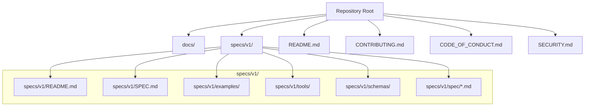
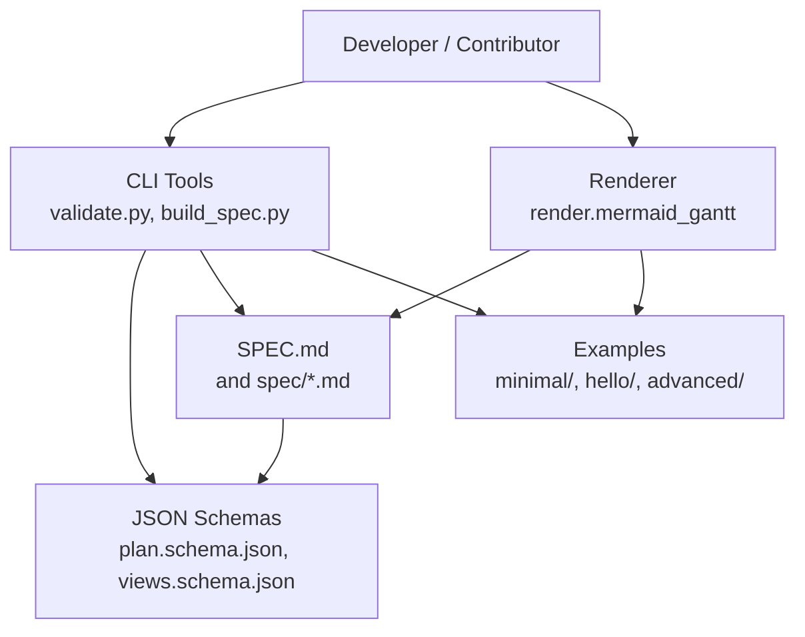
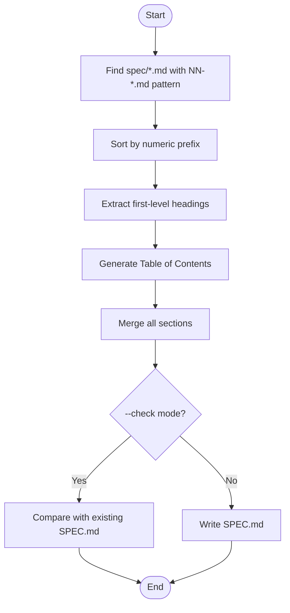
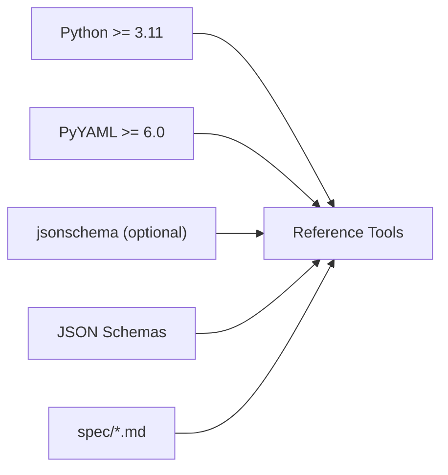
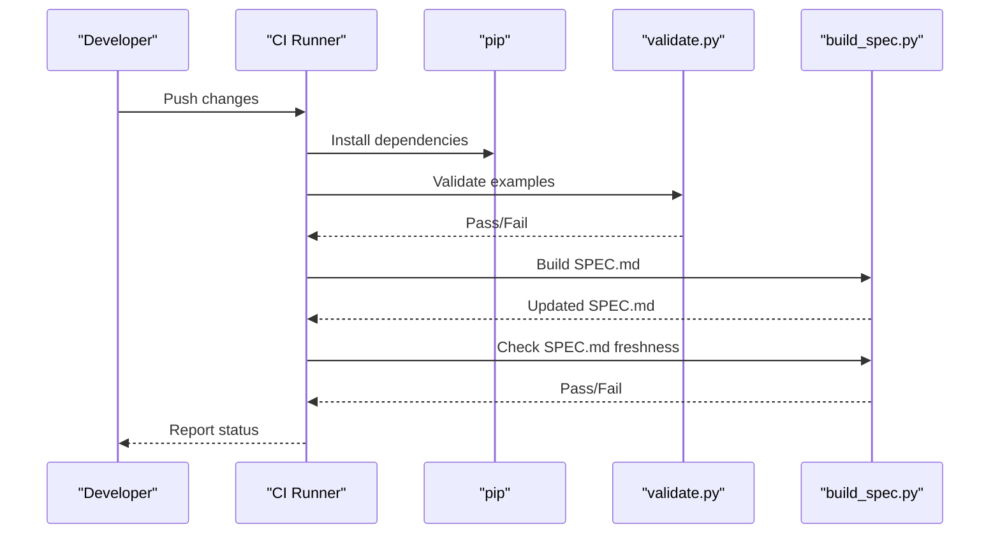

# Development and Contributing

<cite>
**Referenced Files in This Document**
- [README.md](file://README.md)
- [CONTRIBUTING.md](file://CONTRIBUTING.md)
- [CODE_OF_CONDUCT.md](file://CODE_OF_CONDUCT.md)
- [SECURITY.md](file://SECURITY.md)
- [specs/v1/README.md](file://specs/v1/README.md)
- [specs/v1/SPEC.md](file://specs/v1/SPEC.md)
- [specs/v1/examples/README.md](file://specs/v1/examples/README.md)
- [specs/v1/tools/README.md](file://specs/v1/tools/README.md)
- [specs/v1/tools/requirements.txt](file://specs/v1/tools/requirements.txt)
- [specs/v1/tools/build_spec.py](file://specs/v1/tools/build_spec.py)
- [specs/v1/tools/validate.py](file://specs/v1/tools/validate.py)
- [specs/v1/schemas/plan.schema.json](file://specs/v1/schemas/plan.schema.json)
- [specs/v1/schemas/views.schema.json](file://specs/v1/schemas/views.schema.json)
- [specs/v1/spec/00-introduction.md](file://specs/v1/spec/00-introduction.md)
- [specs/v1/spec/90-extensibility.md](file://specs/v1/spec/90-extensibility.md)
</cite>

## Table of Contents
1. [Introduction](#introduction)
2. [Project Structure](#project-structure)
3. [Core Components](#core-components)
4. [Architecture Overview](#architecture-overview)
5. [Detailed Component Analysis](#detailed-component-analysis)
6. [Dependency Analysis](#dependency-analysis)
7. [Performance Considerations](#performance-considerations)
8. [Troubleshooting Guide](#troubleshooting-guide)
9. [Contribution Workflow](#contribution-workflow)
10. [Specification Evolution and Versioning](#specification-evolution-and-versioning)
11. [Testing and Quality Assurance](#testing-and-quality-assurance)
12. [Extending the Specification](#extending-the-specification)
13. [Continuous Integration Guidance](#continuous-integration-guidance)
14. [Conclusion](#conclusion)

## Introduction
This document provides a complete guide for developers and contributors working on Opskarta. It covers development environment setup, testing frameworks, code standards, specification evolution, versioning, contribution workflow, and quality assurance processes. The goal is to enable both bug fixes and feature contributions with clear expectations around documentation, examples, and ecosystem compatibility.

## Project Structure
Opskarta is organized around a single specification version (v1) with supporting tools, examples, and schemas. The repository is designed so that the specification is the core, and tools are reference implementations that remain lightweight and optional.

**Diagram sources**
- [README.md](file://README.md#L1-L96)
- [specs/v1/README.md](file://specs/v1/README.md#L1-L27)
- [specs/v1/SPEC.md](file://specs/v1/SPEC.md#L1-L407)

**Section sources**
- [README.md](file://README.md#L1-L96)
- [specs/v1/README.md](file://specs/v1/README.md#L1-L27)

## Core Components
- Specification v1: Defines the YAML/JSON format for plans and views, validation rules, scheduling semantics, statuses, and extensibility.
- Tools: Reference implementations for validating files, building the specification, and rendering Mermaid Gantt charts.
- Examples: Minimal, hello, and advanced example sets demonstrating plan and view usage.
- Schemas: JSON Schema definitions for machine-readable validation.

Key responsibilities:
- Maintain the specification as the single source of truth.
- Keep tools small, deterministic, and compatible with the spec.
- Provide clear examples and validation to ensure interoperability.

**Section sources**
- [specs/v1/SPEC.md](file://specs/v1/SPEC.md#L1-L407)
- [specs/v1/tools/README.md](file://specs/v1/tools/README.md#L1-L126)
- [specs/v1/examples/README.md](file://specs/v1/examples/README.md#L1-L34)
- [specs/v1/schemas/plan.schema.json](file://specs/v1/schemas/plan.schema.json#L1-L86)
- [specs/v1/schemas/views.schema.json](file://specs/v1/schemas/views.schema.json#L1-L26)

## Architecture Overview
The development architecture centers on the specification and reference tools:

**Diagram sources**
- [specs/v1/tools/validate.py](file://specs/v1/tools/validate.py#L1-L752)
- [specs/v1/tools/build_spec.py](file://specs/v1/tools/build_spec.py#L1-L240)
- [specs/v1/tools/README.md](file://specs/v1/tools/README.md#L1-L126)
- [specs/v1/SPEC.md](file://specs/v1/SPEC.md#L1-L407)
- [specs/v1/schemas/plan.schema.json](file://specs/v1/schemas/plan.schema.json#L1-L86)
- [specs/v1/schemas/views.schema.json](file://specs/v1/schemas/views.schema.json#L1-L26)
- [specs/v1/examples/README.md](file://specs/v1/examples/README.md#L1-L34)

## Detailed Component Analysis

### Validation Tool (validate.py)
Responsibilities:
- Parse YAML safely.
- Validate semantic correctness against the specification (required fields, referential integrity, cycles, formats).
- Optional JSON Schema validation for stricter machine-checking.
- Provide actionable error messages with paths, values, and expected formats.

**Diagram sources**
- [specs/v1/tools/validate.py](file://specs/v1/tools/validate.py#L634-L751)

**Section sources**
- [specs/v1/tools/validate.py](file://specs/v1/tools/validate.py#L1-L752)

### Spec Builder (build_spec.py)
Responsibilities:
- Assemble spec/*.md files into a single SPEC.md with a generated table of contents.
- Enforce numeric prefix ordering and detect duplicate prefixes.
- Provide a check mode to ensure SPEC.md stays in sync with spec/*.md.

**Diagram sources**
- [specs/v1/tools/build_spec.py](file://specs/v1/tools/build_spec.py#L174-L239)

**Section sources**
- [specs/v1/tools/build_spec.py](file://specs/v1/tools/build_spec.py#L1-L240)

### Renderer (Mermaid Gantt)
Responsibilities:
- Render Gantt diagrams from plan and views.
- Compute dates from dependencies and durations.
- Support calendar exclusions and status-based coloring.

Usage highlights:
- Accepts plan and views files, a target view, and optional output file.
- Lists available views when requested.

**Section sources**
- [specs/v1/tools/README.md](file://specs/v1/tools/README.md#L69-L92)

## Dependency Analysis
- Python runtime: The tools require Python 3.11+.
- Dependencies:
  - PyYAML for parsing YAML.
  - Optional: jsonschema for JSON Schema validation.
- Internal dependencies:
  - validate.py depends on JSON Schemas for optional strict validation.
  - build_spec.py depends on spec/*.md files to generate SPEC.md.

**Diagram sources**
- [specs/v1/tools/requirements.txt](file://specs/v1/tools/requirements.txt#L1-L10)
- [specs/v1/tools/validate.py](file://specs/v1/tools/validate.py#L1-L16)
- [specs/v1/tools/build_spec.py](file://specs/v1/tools/build_spec.py#L1-L24)

**Section sources**
- [specs/v1/tools/requirements.txt](file://specs/v1/tools/requirements.txt#L1-L10)

## Performance Considerations
- Validation complexity:
  - Semantic checks are linear in the number of nodes and edges.
  - Cycle detection uses DFS and is O(V + E) for parent and after relations.
- Rendering:
  - Date computation and Gantt generation are linear in the number of nodes and lanes.
- Recommendations:
  - Keep PRs small to minimize validation overhead.
  - Prefer incremental spec updates and targeted examples.

[No sources needed since this section provides general guidance]

## Troubleshooting Guide
Common issues and resolutions:
- YAML parse errors: Ensure files are valid YAML and use UTF-8 encoding.
- Missing required fields: Add version, nodes, and title per specification.
- Referential integrity errors: Fix parent, after, and status references to existing node IDs.
- Cyclic dependencies: Remove cycles in parent and after chains.
- JSON Schema validation failures: Align data types and formats with schemas.
- Tool installation: Install dependencies from requirements.txt.

**Section sources**
- [specs/v1/tools/validate.py](file://specs/v1/tools/validate.py#L135-L329)
- [specs/v1/tools/validate.py](file://specs/v1/tools/validate.py#L431-L579)
- [specs/v1/tools/README.md](file://specs/v1/tools/README.md#L6-L11)

## Contribution Workflow
- Issue-first collaboration: Open an issue describing the problem, proposal, or question.
- Provide examples: Include before/after YAML samples for format changes; show input and expected output for tools.
- Keep PRs small and focused.
- New fields must be optional (unless introducing a new major version), semantically clear, and documented in the specification.
- Code standards:
  - Python >= 3.11.
  - Formatting/linting with ruff (where applicable).
  - Tests with pytest for non-trivial logic.

**Section sources**
- [CONTRIBUTING.md](file://CONTRIBUTING.md#L14-L31)

## Specification Evolution and Versioning
- Current state: v1 is Alpha and Draft.
- Versioning strategy:
  - The version field in the root documents identifies the schema version.
  - Extensibility is encouraged; unknown fields should be preserved and ignored by base tools.
- Backward compatibility:
  - New fields should be optional until a new major version.
  - Base tools must ignore unknown fields and preserve formatting when applicable.
- Change management:
  - Update spec/*.md files in order (numeric prefix).
  - Regenerate SPEC.md using the spec builder.
  - Run the spec builder in check mode to prevent drift.

**Section sources**
- [README.md](file://README.md#L10-L15)
- [specs/v1/README.md](file://specs/v1/README.md#L3-L4)
- [specs/v1/spec/00-introduction.md](file://specs/v1/spec/00-introduction.md#L1-L10)
- [specs/v1/spec/90-extensibility.md](file://specs/v1/spec/90-extensibility.md#L1-L26)
- [specs/v1/tools/build_spec.py](file://specs/v1/tools/build_spec.py#L174-L239)

## Testing and Quality Assurance
- Local validation:
  - Use the validator to check plans and views locally.
  - Optionally enable JSON Schema validation for stricter checks.
- Example-driven verification:
  - Validate examples to ensure they remain correct after changes.
- Spec integrity:
  - Use the spec builder’s check mode to ensure SPEC.md matches spec/*.md.
- Code quality:
  - Follow Python >= 3.11 and ruff formatting/linting.
  - Add tests with pytest for non-trivial logic.

**Section sources**
- [specs/v1/tools/README.md](file://specs/v1/tools/README.md#L14-L60)
- [specs/v1/examples/README.md](file://specs/v1/examples/README.md#L13-L28)
- [specs/v1/tools/build_spec.py](file://specs/v1/tools/build_spec.py#L209-L225)
- [CONTRIBUTING.md](file://CONTRIBUTING.md#L27-L31)

## Extending the Specification
Guidelines for extending the specification and maintaining ecosystem compatibility:
- Extend with optional fields; avoid breaking changes.
- Group user-defined fields under a namespace (e.g., x:) to prevent conflicts.
- Document new fields in spec/*.md and regenerate SPEC.md.
- Ensure tools ignore unknown fields and preserve formatting when applicable.

**Section sources**
- [specs/v1/spec/90-extensibility.md](file://specs/v1/spec/90-extensibility.md#L1-L26)
- [specs/v1/tools/build_spec.py](file://specs/v1/tools/build_spec.py#L174-L239)

## Continuous Integration Guidance
Recommended CI steps aligned with repository tooling:
- Install dependencies: pip install -r specs/v1/tools/requirements.txt
- Validate examples: python tools/validate.py examples/hello/hello.plan.yaml examples/hello/hello.views.yaml
- Build and check spec: python tools/build_spec.py; python tools/build_spec.py --check
- Optional: Enable JSON Schema validation by installing jsonschema and running schema-enabled validations.

**Diagram sources**
- [specs/v1/tools/README.md](file://specs/v1/tools/README.md#L6-L11)
- [specs/v1/tools/README.md](file://specs/v1/tools/README.md#L18-L32)
- [specs/v1/tools/build_spec.py](file://specs/v1/tools/build_spec.py#L174-L239)

**Section sources**
- [specs/v1/tools/README.md](file://specs/v1/tools/README.md#L6-L11)
- [specs/v1/tools/README.md](file://specs/v1/tools/README.md#L52-L60)
- [specs/v1/examples/README.md](file://specs/v1/examples/README.md#L17-L28)

## Conclusion
Opskarta’s development model emphasizes a clear specification, minimal reference tools, and practical examples. Contributors should focus on small, well-scoped changes, maintain backward compatibility, and ensure spec and tooling integrity. By following the contribution workflow, testing practices, and extension guidelines, you can confidently add features and improve the ecosystem while preserving interoperability.