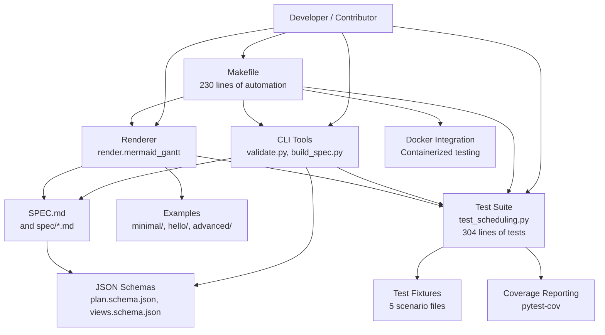

# Development and Contributing

<cite>
**Referenced Files in This Document**
- [README.md](file://README.md)
- [CONTRIBUTING.md](file://CONTRIBUTING.md)
- [CODE_OF_CONDUCT.md](file://CODE_OF_CONDUCT.md)
- [SECURITY.md](file://SECURITY.md)
- [specs/v1/README.md](file://specs/v1/README.md)
- [specs/v1/SPEC.md](file://specs/v1/SPEC.md)
- [specs/v1/examples/README.md](file://specs/v1/examples/README.md)
- [specs/v1/tools/README.md](file://specs/v1/tools/README.md)
- [specs/v1/tools/requirements.txt](file://specs/v1/tools/requirements.txt)
- [specs/v1/tools/build_spec.py](file://specs/v1/tools/build_spec.py)
- [specs/v1/tools/validate.py](file://specs/v1/tools/validate.py)
- [specs/v1/tools/render/mermaid_gantt.py](file://specs/v1/tools/render/mermaid_gantt.py)
- [specs/v1/schemas/plan.schema.json](file://specs/v1/schemas/plan.schema.json)
- [specs/v1/schemas/views.schema.json](file://specs/v1/schemas/views.schema.json)
- [specs/v1/spec/00-introduction.md](file://specs/v1/spec/00-introduction.md)
- [specs/v1/spec/90-extensibility.md](file://specs/v1/spec/90-extensibility.md)
- [specs/v1/tests/test_scheduling.py](file://specs/v1/tests/test_scheduling.py)
- [specs/v1/tests/fixtures/extensions.plan.yaml](file://specs/v1/tests/fixtures/extensions.plan.yaml)
- [specs/v1/tests/fixtures/parent_inheritance.plan.yaml](file://specs/v1/tests/fixtures/parent_inheritance.plan.yaml)
- [specs/v1/tests/fixtures/start_after_conflict.plan.yaml](file://specs/v1/tests/fixtures/start_after_conflict.plan.yaml)
- [specs/v1/tests/fixtures/weekends_exclusion.plan.yaml](file://specs/v1/tests/fixtures/weekends_exclusion.plan.yaml)
- [specs/v1/tests/fixtures/weeks_duration.plan.yaml](file://specs/v1/tests/fixtures/weeks_duration.plan.yaml)
- [Makefile](file://Makefile)
</cite>

## Update Summary
**Changes Made**
- Added comprehensive Makefile infrastructure documentation with 230 lines of build automation
- Documented complete CI/CD pipeline support with Docker integration
- Enhanced testing framework with pytest integration and coverage reporting
- Added validation systems for examples, fixtures, and JSON schemas
- Documented rendering capabilities for Gantt diagrams
- Updated development workflow with automated dependency management

## Table of Contents
1. [Introduction](#introduction)
2. [Project Structure](#project-structure)
3. [Core Components](#core-components)
4. [Architecture Overview](#architecture-overview)
5. [Detailed Component Analysis](#detailed-component-analysis)
6. [Dependency Analysis](#dependency-analysis)
7. [Performance Considerations](#performance-considerations)
8. [Troubleshooting Guide](#troubleshooting-guide)
9. [Contribution Workflow](#contribution-workflow)
10. [Specification Evolution and Versioning](#specification-evolution-and-versioning)
11. [Testing and Quality Assurance](#testing-and-quality-assurance)
12. [Extending the Specification](#extending-the-specification)
13. [Continuous Integration Guidance](#continuous-integration-guidance)
14. [Makefile Infrastructure](#makefile-infrastructure)
15. [Conclusion](#conclusion)

## Introduction
This document provides a complete guide for developers and contributors working on Opskarta. It covers development environment setup, testing frameworks, code standards, specification evolution, versioning, contribution workflow, and quality assurance processes. The goal is to enable both bug fixes and feature contributions with clear expectations around documentation, examples, and ecosystem compatibility.

**Updated** Added comprehensive Makefile infrastructure providing build automation, validation systems, pytest integration, and CI/CD pipeline support for opskarta v1 specification project.

## Project Structure
Opskarta is organized around a single specification version (v1) with supporting tools, examples, schemas, and a comprehensive test suite. The repository is designed so that the specification is the core, and tools are reference implementations that remain lightweight and optional.

**Diagram sources**
- [README.md](file://README.md#L1-L96)
- [specs/v1/README.md](file://specs/v1/README.md#L1-L27)
- [specs/v1/SPEC.md](file://specs/v1/SPEC.md#L1-L407)

**Section sources**
- [README.md](file://README.md#L1-L96)
- [specs/v1/README.md](file://specs/v1/README.md#L1-L27)

## Core Components
- Specification v1: Defines the YAML/JSON format for plans and views, validation rules, scheduling semantics, statuses, and extensibility.
- Tools: Reference implementations for validating files, building the specification, and rendering Mermaid Gantt charts.
- Examples: Minimal, hello, and advanced example sets demonstrating plan and view usage.
- Schemas: JSON Schema definitions for machine-readable validation.
- **Tests**: Comprehensive test suite with 304 lines of scheduling tests and fixture-based scenarios covering various scheduling edge cases.

Key responsibilities:
- Maintain the specification as the single source of truth.
- Keep tools small, deterministic, and compatible with the spec.
- Provide clear examples and validation to ensure interoperability.
- **Ensure comprehensive test coverage for all scheduling functionality and edge cases.**

**Section sources**
- [specs/v1/SPEC.md](file://specs/v1/SPEC.md#L1-L407)
- [specs/v1/tools/README.md](file://specs/v1/tools/README.md#L1-L126)
- [specs/v1/examples/README.md](file://specs/v1/examples/README.md#L1-L34)
- [specs/v1/schemas/plan.schema.json](file://specs/v1/schemas/plan.schema.json#L1-L86)
- [specs/v1/schemas/views.schema.json](file://specs/v1/schemas/views.schema.json#L1-L26)
- [specs/v1/tests/test_scheduling.py](file://specs/v1/tests/test_scheduling.py#L1-L305)

## Architecture Overview
The development architecture centers on the specification and reference tools with integrated testing infrastructure and comprehensive Makefile automation:

**Diagram sources**
- [Makefile](file://Makefile#L1-L230)
- [specs/v1/tools/validate.py](file://specs/v1/tools/validate.py#L1-L782)
- [specs/v1/tools/build_spec.py](file://specs/v1/tools/build_spec.py#L1-L240)
- [specs/v1/tools/README.md](file://specs/v1/tools/README.md#L1-L126)
- [specs/v1/SPEC.md](file://specs/v1/SPEC.md#L1-L407)
- [specs/v1/schemas/plan.schema.json](file://specs/v1/schemas/plan.schema.json#L1-L86)
- [specs/v1/schemas/views.schema.json](file://specs/v1/schemas/views.schema.json#L1-L26)
- [specs/v1/examples/README.md](file://specs/v1/examples/README.md#L1-L34)
- [specs/v1/tests/test_scheduling.py](file://specs/v1/tests/test_scheduling.py#L1-L305)

## Detailed Component Analysis

### Validation Tool (validate.py)
Responsibilities:
- Parse YAML safely.
- Validate semantic correctness against the specification (required fields, referential integrity, cycles, formats).
- Optional JSON Schema validation for stricter machine-checking.
- Provide actionable error messages with paths, values, and expected formats.

**Diagram sources**
- [specs/v1/tools/validate.py](file://specs/v1/tools/validate.py#L634-L751)

**Section sources**
- [specs/v1/tools/validate.py](file://specs/v1/tools/validate.py#L1-L782)

### Spec Builder (build_spec.py)
Responsibilities:
- Assemble spec/*.md files into a single SPEC.md with a generated table of contents.
- Enforce numeric prefix ordering and detect duplicate prefixes.
- Provide a check mode to ensure SPEC.md stays in sync with spec/*.md.

**Diagram sources**
- [specs/v1/tools/build_spec.py](file://specs/v1/tools/build_spec.py#L174-L239)

**Section sources**
- [specs/v1/tools/build_spec.py](file://specs/v1/tools/build_spec.py#L1-L240)

### Renderer (Mermaid Gantt)
Responsibilities:
- Render Gantt diagrams from plan and views.
- Compute dates from dependencies and durations.
- Support calendar exclusions and status-based coloring.

Usage highlights:
- Accepts plan and views files, a target view, and optional output file.
- Lists available views when requested.

**Section sources**
- [specs/v1/tools/README.md](file://specs/v1/tools/README.md#L69-L92)

### Test Infrastructure (test_scheduling.py)
**New** Comprehensive test suite covering scheduling functionality with 304 lines of tests:

Responsibilities:
- **Duration parsing tests**: Validate day and week duration formats ("5d", "1w" = 5 workdays).
- **Date calculation tests**: Verify workday vs calendar day calculations with weekend exclusions.
- **Schedule computation tests**: Test explicit start dates, after dependencies, and precedence rules.
- **Validation tests**: Ensure proper error handling for invalid formats and missing required fields.
- **Fixture-based tests**: Validate real-world scenarios using YAML fixture files.

Test categories:
- **TestDuration**: Duration parsing edge cases and format validation.
- **TestDateCalculation**: Workday arithmetic with weekend exclusions.
- **TestScheduleComputation**: Complex scheduling scenarios and dependency resolution.
- **TestValidation**: Semantic validation of plan and views files.
- **TestFixtures**: Real-world scenario validation using fixture files.

**Diagram sources**
- [specs/v1/tests/test_scheduling.py](file://specs/v1/tests/test_scheduling.py#L33-L305)

**Section sources**
- [specs/v1/tests/test_scheduling.py](file://specs/v1/tests/test_scheduling.py#L1-L305)

### Test Fixtures
**New** Five comprehensive fixture files covering different scheduling scenarios:

- **extensions.plan.yaml**: Custom extension fields using x: namespace for team assignments and risk assessment.
- **parent_inheritance.plan.yaml**: Opt-in parent inheritance via x.scheduling.anchor_to_parent_start configuration.
- **start_after_conflict.plan.yaml**: Conflict resolution where explicit start takes precedence over after dependencies.
- **weekends_exclusion.plan.yaml**: Weekend exclusion scenarios with proper workday calculations.
- **weeks_duration.plan.yaml**: Week-based duration calculations (1w = 5 workdays) with chaining dependencies.

**Section sources**
- [specs/v1/tests/fixtures/extensions.plan.yaml](file://specs/v1/tests/fixtures/extensions.plan.yaml#L1-L22)
- [specs/v1/tests/fixtures/parent_inheritance.plan.yaml](file://specs/v1/tests/fixtures/parent_inheritance.plan.yaml#L1-L29)
- [specs/v1/tests/fixtures/start_after_conflict.plan.yaml](file://specs/v1/tests/fixtures/start_after_conflict.plan.yaml#L1-L20)
- [specs/v1/tests/fixtures/weekends_exclusion.plan.yaml](file://specs/v1/tests/fixtures/weekends_exclusion.plan.yaml#L1-L21)
- [specs/v1/tests/fixtures/weeks_duration.plan.yaml](file://specs/v1/tests/fixtures/weeks_duration.plan.yaml#L1-L24)

## Dependency Analysis
- Python runtime: The tools require Python 3.11+.
- Dependencies:
  - PyYAML for parsing YAML.
  - Optional: jsonschema for JSON Schema validation.
  - **pytest and pytest-cov for comprehensive testing and coverage reporting.**
- Internal dependencies:
  - validate.py depends on JSON Schemas for optional strict validation.
  - build_spec.py depends on spec/*.md files to generate SPEC.md.
  - **test_scheduling.py imports validation and rendering functions for comprehensive testing.**

**Diagram sources**
- [specs/v1/tools/requirements.txt](file://specs/v1/tools/requirements.txt#L1-L10)
- [specs/v1/tools/validate.py](file://specs/v1/tools/validate.py#L1-L16)
- [specs/v1/tools/build_spec.py](file://specs/v1/tools/build_spec.py#L1-L24)
- [Makefile](file://Makefile#L158-L161)

**Section sources**
- [specs/v1/tools/requirements.txt](file://specs/v1/tools/requirements.txt#L1-L10)
- [Makefile](file://Makefile#L158-L161)

## Performance Considerations
- Validation complexity:
  - Semantic checks are linear in the number of nodes and edges.
  - Cycle detection uses DFS and is O(V + E) for parent and after relations.
- Rendering:
  - Date computation and Gantt generation are linear in the number of nodes and lanes.
- **Testing performance**:
  - Test suite runs efficiently with pytest parallelization support.
  - Fixture-based tests reduce code duplication and improve maintainability.
  - Coverage reporting helps identify untested code paths.
- **Makefile optimization**:
  - Containerized testing reduces environment setup overhead.
  - Parallel validation of multiple files improves throughput.
  - Cached dependencies minimize installation time.
- Recommendations:
  - Keep PRs small to minimize validation overhead.
  - Prefer incremental spec updates and targeted examples.
  - **Use pytest markers and selective test execution for faster development cycles.**

## Troubleshooting Guide
Common issues and resolutions:
- YAML parse errors: Ensure files are valid YAML and use UTF-8 encoding.
- Missing required fields: Add version, nodes, and title per specification.
- Referential integrity errors: Fix parent, after, and status references to existing node IDs.
- Cyclic dependencies: Remove cycles in parent and after chains.
- JSON Schema validation failures: Align data types and formats with schemas.
- Tool installation: Install dependencies from requirements.txt.
- **Test failures**: Use pytest verbose mode (-v) and coverage reports (--cov) to identify failing test cases.
- **Coverage gaps**: Analyze missing branch coverage and add targeted test cases.
- **Makefile issues**: Use `make help` to see available targets and ensure proper Python/Docker detection.
- **Docker problems**: Verify Docker installation and network connectivity for containerized operations.

**Section sources**
- [specs/v1/tools/validate.py](file://specs/v1/tools/validate.py#L135-L329)
- [specs/v1/tools/validate.py](file://specs/v1/tools/validate.py#L431-L579)
- [specs/v1/tools/README.md](file://specs/v1/tools/README.md#L6-L11)
- [specs/v1/tests/test_scheduling.py](file://specs/v1/tests/test_scheduling.py#L10-L12)
- [Makefile](file://Makefile#L14-L28)

## Contribution Workflow
- Issue-first collaboration: Open an issue describing the problem, proposal, or question.
- Provide examples: Include before/after YAML samples for format changes; show input and expected output for tools.
- Keep PRs small and focused.
- New fields must be optional (unless introducing a new major version), semantically clear, and documented in the specification.
- **Code standards**:
  - Python >= 3.11.
  - Formatting/linting with ruff (where applicable).
  - **Add comprehensive tests with pytest for all new functionality.**
  - **Maintain or improve test coverage for existing functionality.**
  - **Use fixture files for complex test scenarios.**

**Section sources**
- [CONTRIBUTING.md](file://CONTRIBUTING.md#L14-L31)

## Specification Evolution and Versioning
- Current state: v1 is Alpha and Draft.
- Versioning strategy:
  - The version field in the root documents identifies the schema version.
  - Extensibility is encouraged; unknown fields should be preserved and ignored by base tools.
- Backward compatibility:
  - New fields should be optional until a new major version.
  - Base tools must ignore unknown fields and preserve formatting when applicable.
- Change management:
  - Update spec/*.md files in order (numeric prefix).
  - Regenerate SPEC.md using the spec builder.
  - Run the spec builder in check mode to prevent drift.
  - **Update test fixtures to reflect new specification changes.**

**Section sources**
- [README.md](file://README.md#L10-L15)
- [specs/v1/README.md](file://specs/v1/README.md#L3-L4)
- [specs/v1/spec/00-introduction.md](file://specs/v1/spec/00-introduction.md#L1-L10)
- [specs/v1/spec/90-extensibility.md](file://specs/v1/spec/90-extensibility.md#L1-L26)
- [specs/v1/tools/build_spec.py](file://specs/v1/tools/build_spec.py#L174-L239)

## Testing and Quality Assurance
**Updated** Comprehensive testing infrastructure with multiple layers of quality assurance:

### Local Testing
- **Unit tests**: Run with pytest for comprehensive coverage: `make test-unit`
- **Full test suite**: Execute all tests with automatic fallback: `make test`
- **Coverage reporting**: Generate detailed coverage reports: `make test-coverage`
- **Individual test groups**: Run specific test categories: `python -m pytest test_scheduling.py TestDuration -v`

### Test Categories
- **Duration parsing**: Validate "5d", "1w", integer, and invalid format handling.
- **Date calculations**: Test workday vs calendar day computations with weekend exclusions.
- **Schedule computation**: Complex scenarios including dependencies, precedence rules, and inheritance.
- **Validation**: Semantic validation of plans and views with proper error handling.
- **Fixtures**: Real-world scenarios using YAML fixture files for regression testing.

### Test Fixtures
- **Extension fields**: Custom x: namespace usage for team assignments and risk assessment.
- **Parent inheritance**: Opt-in inheritance via x.scheduling.anchor_to_parent_start.
- **Conflict resolution**: Start vs after dependency precedence.
- **Weekend exclusions**: Proper workday calculations across weekends.
- **Week-based durations**: 1w = 5 workdays with chaining dependencies.

### Quality Metrics
- **Test coverage**: Automatic coverage reporting via pytest-cov.
- **Regression prevention**: Fixture-based tests ensure scenarios remain valid.
- **Edge case handling**: Comprehensive validation of boundary conditions.

**Section sources**
- [specs/v1/tests/test_scheduling.py](file://specs/v1/tests/test_scheduling.py#L1-L305)
- [specs/v1/tests/fixtures/extensions.plan.yaml](file://specs/v1/tests/fixtures/extensions.plan.yaml#L1-L22)
- [specs/v1/tests/fixtures/parent_inheritance.plan.yaml](file://specs/v1/tests/fixtures/parent_inheritance.plan.yaml#L1-L29)
- [specs/v1/tests/fixtures/start_after_conflict.plan.yaml](file://specs/v1/tests/fixtures/start_after_conflict.plan.yaml#L1-L20)
- [specs/v1/tests/fixtures/weekends_exclusion.plan.yaml](file://specs/v1/tests/fixtures/weekends_exclusion.plan.yaml#L1-L21)
- [specs/v1/tests/fixtures/weeks_duration.plan.yaml](file://specs/v1/tests/fixtures/weeks_duration.plan.yaml#L1-L24)
- [Makefile](file://Makefile#L111-L127)

## Extending the Specification
Guidelines for extending the specification and maintaining ecosystem compatibility:
- Extend with optional fields; avoid breaking changes.
- Group user-defined fields under a namespace (e.g., x:) to prevent conflicts.
- Document new fields in spec/*.md and regenerate SPEC.md.
- Ensure tools ignore unknown fields and preserve formatting when applicable.
- **Update test fixtures to include new extension scenarios.**
- **Add comprehensive test coverage for new functionality.**

**Section sources**
- [specs/v1/spec/90-extensibility.md](file://specs/v1/spec/90-extensibility.md#L1-L26)
- [specs/v1/tools/build_spec.py](file://specs/v1/tools/build_spec.py#L174-L239)

## Continuous Integration Guidance
**Updated** Enhanced CI/CD integration with comprehensive testing and coverage reporting:

### Recommended CI Steps
- **Install dependencies**: `make deps` (installs pyyaml, jsonschema, pytest, pytest-cov)
- **Validate examples**: `make validate-examples`
- **Validate fixtures**: `make validate-fixtures`
- **Build and check spec**: `make build-spec && make check-spec`
- **Run full test suite**: `make test` (runs pytest with fallback to unittest)
- **Generate coverage reports**: `make test-coverage`
- **Docker-based CI**: `make ci-docker` for containerized testing

### CI Pipeline Structure

**Diagram sources**
- [Makefile](file://Makefile#L210-L217)
- [Makefile](file://Makefile#L111-L127)
- [Makefile](file://Makefile#L158-L161)

### Docker Integration
- **Containerized testing**: `make docker-test` for isolated test environments.
- **Containerized validation**: `make docker-validate` for schema validation.
- **Containerized builds**: `make docker-build` for SPEC.md generation.
- **Interactive shells**: `make docker-shell` for debugging.

### Quality Gates
- **SPEC.md freshness**: Automated spec integrity checking.
- **YAML validation**: Comprehensive plan and views validation.
- **Test execution**: Full test suite with coverage reporting.
- **Schema validation**: JSON schema syntax verification.

**Section sources**
- [Makefile](file://Makefile#L210-L217)
- [Makefile](file://Makefile#L111-L127)
- [Makefile](file://Makefile#L158-L161)
- [Makefile](file://Makefile#L179-L204)

## Makefile Infrastructure
**New** Comprehensive 230-line Makefile providing complete build automation, validation systems, and CI/CD pipeline support:

### Core Build Targets
- **`make build`**: Complete build including SPEC.md generation and validation
- **`make build-spec`**: Generate SPEC.md from spec/*.md files
- **`make check-spec`**: Verify SPEC.md is up-to-date with spec/*.md sources

### Validation Systems
- **`make validate`**: Comprehensive validation of all examples and fixtures
- **`make validate-examples`**: Validate all example files (minimal, hello, advanced)
- **`make validate-fixtures`**: Validate test fixture files
- **`make validate-schema`**: Validate JSON schema syntax

### Testing Framework
- **`make test`**: Run complete test suite with pytest fallback
- **`make test-unit`**: Run unit tests only
- **`make test-coverage`**: Generate coverage reports with pytest-cov

### Rendering Capabilities
- **`make render-examples`**: Generate Gantt diagrams for all examples

### Development Tools
- **`make deps`**: Install Python dependencies (pyyaml, jsonschema, pytest, pytest-cov)
- **`make lint`**: Run code linting with ruff (if available)
- **`make format`**: Auto-format code with ruff (if available)

### Docker Integration
- **`make docker-test`**: Run tests in Python 3.11 container
- **`make docker-validate`**: Run validation in containerized environment
- **`make docker-build`**: Build SPEC.md in Docker container
- **`make docker-shell`**: Open interactive shell in container

### CI/CD Targets
- **`make ci`**: Run all CI checks (check-spec, validate, test)
- **`make ci-docker`**: Run all CI checks in Docker containers

### Cleanup Operations
- **`make clean`**: Remove generated files (output, cache, coverage)

### Environment Detection
The Makefile automatically detects Python and Docker availability:
- Uses local Python if available, otherwise falls back to Docker
- Provides clear error messages when neither is found
- Supports both python3 and python commands

**Section sources**
- [Makefile](file://Makefile#L1-L230)

## Conclusion
Opskarta's development model emphasizes a clear specification, minimal reference tools, practical examples, and comprehensive testing infrastructure. The addition of the 304-line test suite with fixture-based scenarios ensures robust quality assurance and regression prevention. The comprehensive 230-line Makefile infrastructure provides complete build automation, validation systems, pytest integration, and CI/CD pipeline support, making development workflows efficient and reproducible across different environments.

Contributors should focus on small, well-scoped changes, maintain backward compatibility, ensure spec and tooling integrity, and leverage the comprehensive testing framework and Makefile automation. By following the contribution workflow, testing practices, extension guidelines, and CI/CD integration, you can confidently add features and improve the ecosystem while preserving interoperability and maintaining high code quality standards. The Makefile infrastructure ensures consistent development experiences whether working locally or in CI/CD pipelines, with Docker support for reproducible containerized environments.