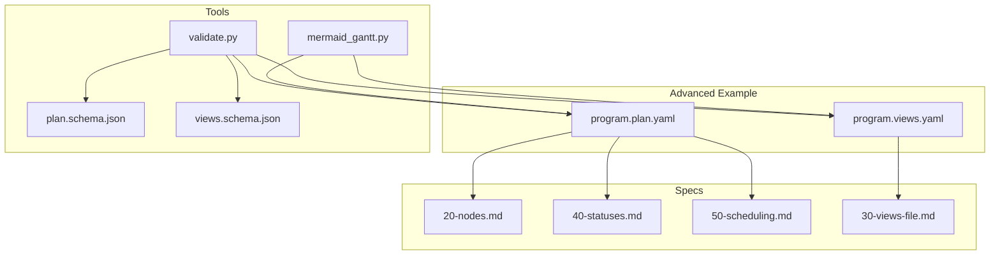
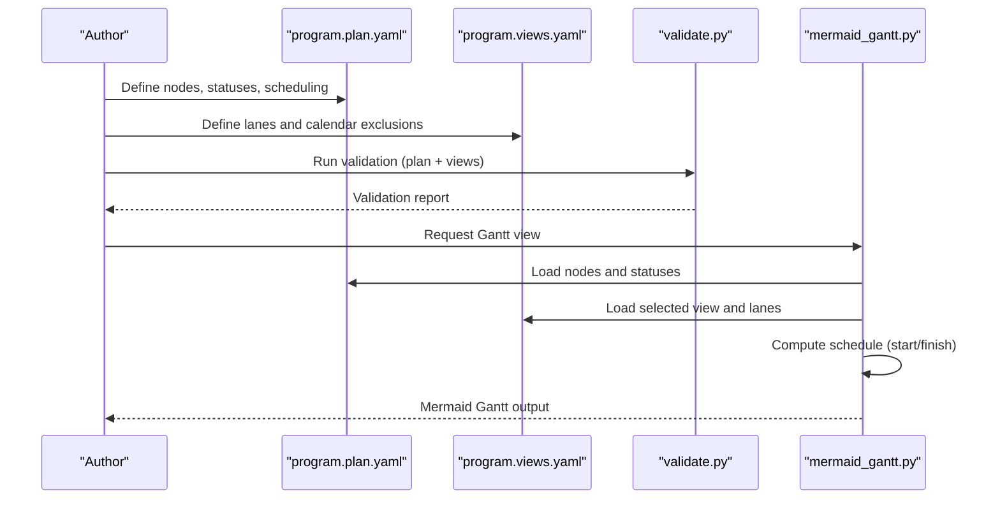
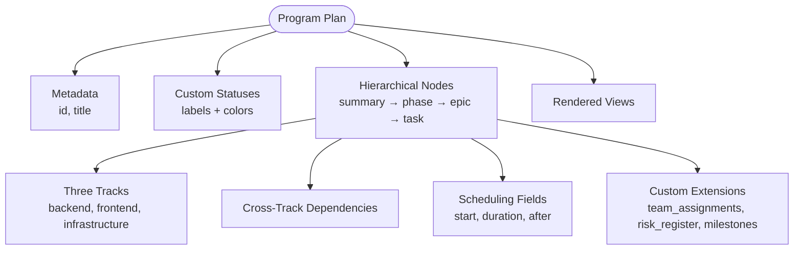
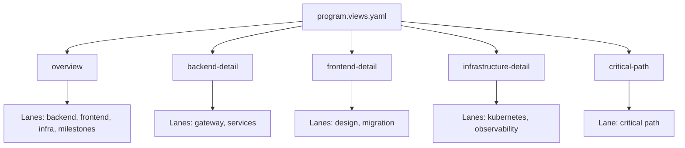
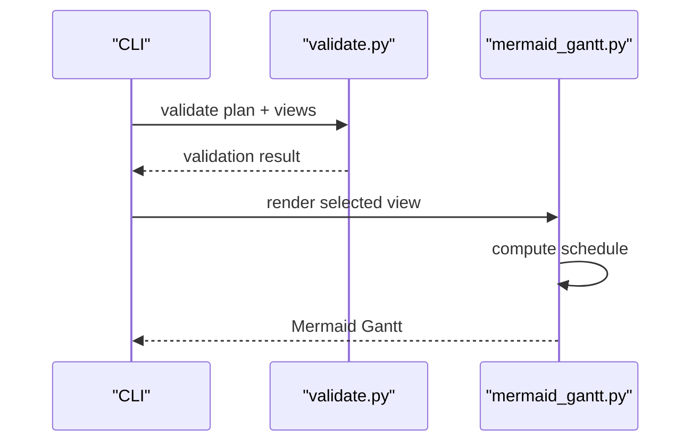
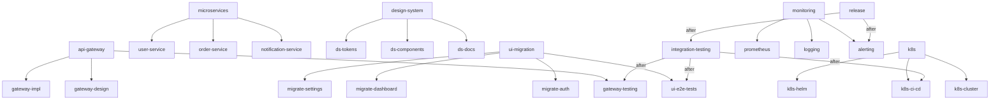

# Advanced Examples

<cite>
**Referenced Files in This Document**
- [README.md](file://specs/v1/examples/advanced/README.md)
- [program.plan.yaml](file://specs/v1/examples/advanced/program.plan.yaml)
- [program.views.yaml](file://specs/v1/examples/advanced/program.views.yaml)
- [20-nodes.md](file://specs/v1/spec/20-nodes.md)
- [40-statuses.md](file://specs/v1/spec/40-statuses.md)
- [50-scheduling.md](file://specs/v1/spec/50-scheduling.md)
- [30-views-file.md](file://specs/v1/spec/30-views-file.md)
- [validate.py](file://specs/v1/tools/validate.py)
- [mermaid_gantt.py](file://specs/v1/tools/render/mermaid_gantt.py)
- [plan.schema.json](file://specs/v1/schemas/plan.schema.json)
- [views.schema.json](file://specs/v1/schemas/views.schema.json)
- [hello.plan.yaml](file://specs/v1/examples/hello/hello.plan.yaml)
- [project.plan.yaml](file://specs/v1/examples/minimal/project.plan.yaml)
</cite>

## Table of Contents
1. [Introduction](#introduction)
2. [Project Structure](#project-structure)
3. [Core Components](#core-components)
4. [Architecture Overview](#architecture-overview)
5. [Detailed Component Analysis](#detailed-component-analysis)
6. [Dependency Analysis](#dependency-analysis)
7. [Performance Considerations](#performance-considerations)
8. [Troubleshooting Guide](#troubleshooting-guide)
9. [Conclusion](#conclusion)
10. [Appendices](#appendices)

## Introduction
This document presents advanced examples for complex multi-track program scenarios using the opskarta format. It focuses on a sophisticated program plan with deep hierarchical nodes, multiple status definitions, cross-dependencies across tracks, and multi-lane visualization. It also explains organizational patterns for large-scale projects involving multiple teams, phases, and stakeholders, and provides guidance on scaling operational maps for enterprise-level use cases.

The advanced example demonstrates:
- A program with three parallel tracks (backend, frontend, infrastructure)
- A four-level hierarchy (summary → phase → epic → task)
- Cross-track dependencies that model inter-team coordination
- Rich status definitions and scheduling fields
- Five distinct Gantt views tailored for different audiences
- Calendar exclusions and critical path visualization

## Project Structure
The advanced example consists of two primary files:
- Program plan: Defines the hierarchical nodes, statuses, scheduling, and custom extensions
- Views: Defines multiple Gantt views with lanes and calendar exclusions

**Diagram sources**
- [program.plan.yaml](file://specs/v1/examples/advanced/program.plan.yaml#L1-L326)
- [program.views.yaml](file://specs/v1/examples/advanced/program.views.yaml#L1-L93)
- [20-nodes.md](file://specs/v1/spec/20-nodes.md#L1-L37)
- [40-statuses.md](file://specs/v1/spec/40-statuses.md#L1-L23)
- [50-scheduling.md](file://specs/v1/spec/50-scheduling.md#L1-L80)
- [30-views-file.md](file://specs/v1/spec/30-views-file.md#L1-L34)
- [validate.py](file://specs/v1/tools/validate.py#L1-L752)
- [mermaid_gantt.py](file://specs/v1/tools/render/mermaid_gantt.py#L1-L549)
- [plan.schema.json](file://specs/v1/schemas/plan.schema.json#L1-L86)
- [views.schema.json](file://specs/v1/schemas/views.schema.json#L1-L26)

**Section sources**
- [README.md](file://specs/v1/examples/advanced/README.md#L1-L172)
- [program.plan.yaml](file://specs/v1/examples/advanced/program.plan.yaml#L1-L326)
- [program.views.yaml](file://specs/v1/examples/advanced/program.views.yaml#L1-L93)

## Core Components
- Program plan: Defines metadata, statuses, and a comprehensive node hierarchy with scheduling and cross-dependencies
- Views: Defines multiple Gantt views with lanes, calendar exclusions, and specialized perspectives
- Tools: Validation and rendering utilities that enforce schema correctness and produce Mermaid Gantt outputs

Key capabilities demonstrated:
- Hierarchical decomposition across three tracks
- Status management with seven custom statuses
- Scheduling with explicit start dates, durations, and dependencies
- Cross-dependencies spanning multiple tracks
- Multi-lane visualization for different audiences
- Calendar exclusions for realistic scheduling

**Section sources**
- [program.plan.yaml](file://specs/v1/examples/advanced/program.plan.yaml#L1-L326)
- [program.views.yaml](file://specs/v1/examples/advanced/program.views.yaml#L1-L93)
- [validate.py](file://specs/v1/tools/validate.py#L135-L329)
- [mermaid_gantt.py](file://specs/v1/tools/render/mermaid_gantt.py#L217-L294)

## Architecture Overview
The advanced example follows a layered architecture:
- Data layer: plan and views files define the program structure and presentation
- Validation layer: ensures referential integrity, semantic correctness, and schema compliance
- Rendering layer: transforms validated data into Mermaid Gantt diagrams

**Diagram sources**
- [validate.py](file://specs/v1/tools/validate.py#L691-L748)
- [mermaid_gantt.py](file://specs/v1/tools/render/mermaid_gantt.py#L49-L86)
- [mermaid_gantt.py](file://specs/v1/tools/render/mermaid_gantt.py#L349-L433)

## Detailed Component Analysis

### Program Plan Analysis
The program plan defines:
- Metadata: program identifier and title
- Seven custom statuses with labels and colors
- A four-level hierarchy: summary → phase → epic → task
- Three parallel tracks: backend, frontend, infrastructure
- Cross-dependencies that require completion across tracks before proceeding
- Rich scheduling fields: start, duration, after
- Custom extensions (x:) for team assignments, risk register, and milestones

Organizational patterns:
- Track-based decomposition aligns with team ownership
- Epic-level grouping aggregates related tasks
- Cross-dependencies ensure inter-team synchronization
- Custom extensions enable integrations and stakeholder-specific insights

**Diagram sources**
- [program.plan.yaml](file://specs/v1/examples/advanced/program.plan.yaml#L3-L326)

**Section sources**
- [program.plan.yaml](file://specs/v1/examples/advanced/program.plan.yaml#L1-L326)
- [40-statuses.md](file://specs/v1/spec/40-statuses.md#L1-L23)
- [20-nodes.md](file://specs/v1/spec/20-nodes.md#L1-L37)
- [50-scheduling.md](file://specs/v1/spec/50-scheduling.md#L1-L80)

### Views Analysis
The views file defines five Gantt views:
- Overview: program-level view with lanes for each track and milestones
- Track-specific details: backend-detail, frontend-detail, infrastructure-detail
- Critical path: focused view on the critical path to release
- Calendar exclusions: weekends and specific holidays

**Diagram sources**
- [program.views.yaml](file://specs/v1/examples/advanced/program.views.yaml#L1-L93)
- [30-views-file.md](file://specs/v1/spec/30-views-file.md#L1-L34)

**Section sources**
- [program.views.yaml](file://specs/v1/examples/advanced/program.views.yaml#L1-L93)
- [30-views-file.md](file://specs/v1/spec/30-views-file.md#L1-L34)

### Validation and Rendering Pipeline
The validation pipeline checks:
- Schema compliance (JSON Schema)
- Referential integrity (parent, after, status)
- Semantic correctness (no cycles, valid formats)

The rendering pipeline computes schedules and generates Mermaid Gantt diagrams with:
- Lane-based visualization
- Calendar exclusions
- Status-based theming

**Diagram sources**
- [validate.py](file://specs/v1/tools/validate.py#L634-L752)
- [mermaid_gantt.py](file://specs/v1/tools/render/mermaid_gantt.py#L439-L549)

**Section sources**
- [validate.py](file://specs/v1/tools/validate.py#L135-L329)
- [mermaid_gantt.py](file://specs/v1/tools/render/mermaid_gantt.py#L217-L294)
- [mermaid_gantt.py](file://specs/v1/tools/render/mermaid_gantt.py#L349-L433)

## Dependency Analysis
The advanced example showcases complex dependencies:
- Parent-child relationships form the hierarchy
- After-dependencies encode sequential and parallel relationships
- Cross-dependencies span tracks to synchronize outcomes
- Calendar exclusions influence computed start/finish dates

**Diagram sources**
- [program.plan.yaml](file://specs/v1/examples/advanced/program.plan.yaml#L16-L294)

**Section sources**
- [program.plan.yaml](file://specs/v1/examples/advanced/program.plan.yaml#L16-L294)
- [50-scheduling.md](file://specs/v1/spec/50-scheduling.md#L1-L80)

## Performance Considerations
- Validation cost scales with node count and dependency depth; keep plans modular and avoid excessive nesting
- Rendering performance depends on the number of nodes per lane and calendar exclusions; limit lanes to relevant subsets for large plans
- Use targeted views to reduce rendering workload and improve readability
- Store custom extensions separately from core plan data to minimize validation overhead

[No sources needed since this section provides general guidance]

## Troubleshooting Guide
Common issues and resolutions:
- Cyclic dependencies: Detected during validation; resolve by removing circular references
- Missing node references: Fix invalid parent or after references
- Invalid date or duration formats: Ensure ISO date format and supported duration units
- Calendar exclusion mismatches: Verify exclusions align with intended scheduling assumptions

Validation and rendering errors are surfaced with precise paths and expected values to aid quick fixes.

**Section sources**
- [validate.py](file://specs/v1/tools/validate.py#L325-L425)
- [mermaid_gantt.py](file://specs/v1/tools/render/mermaid_gantt.py#L236-L294)

## Conclusion
The advanced example demonstrates how opskarta enables modeling complex, multi-track programs with deep hierarchies, rich status definitions, cross-dependencies, and multi-lane visualizations. By combining structured plans with flexible views and robust validation and rendering tools, teams can scale operational maps to enterprise-grade complexity while maintaining clarity and alignment across stakeholders.

[No sources needed since this section summarizes without analyzing specific files]

## Appendices

### Scaling Operational Maps for Enterprise Use
- Organize by tracks aligned to team ownership
- Use epics to group related tasks and manage portfolio-level visibility
- Model cross-dependencies explicitly to surface risks and bottlenecks
- Employ multiple views for different audiences (executive, team leads, stakeholders)
- Integrate custom extensions for governance, risk, and milestone tracking
- Enforce naming conventions and taxonomy to support automation and reporting

[No sources needed since this section provides general guidance]

### Comparison with Minimal and Hello Examples
- Minimal example: Single root node with minimal structure
- Hello example: Two-phase rollout with basic scheduling and notes
- Advanced example: Multi-track, multi-level hierarchy, extensive statuses, cross-dependencies, and multiple views

**Section sources**
- [project.plan.yaml](file://specs/v1/examples/minimal/project.plan.yaml#L1-L6)
- [hello.plan.yaml](file://specs/v1/examples/hello/hello.plan.yaml#L1-L44)
- [README.md](file://specs/v1/examples/advanced/README.md#L1-L172)