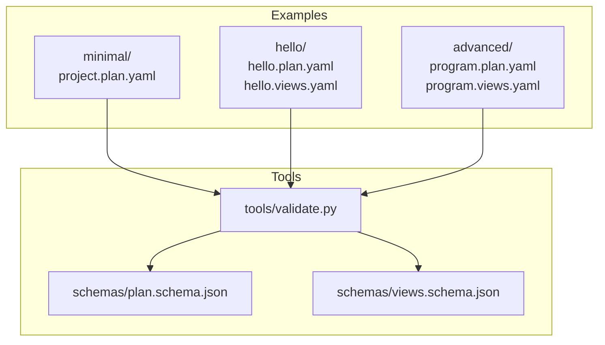
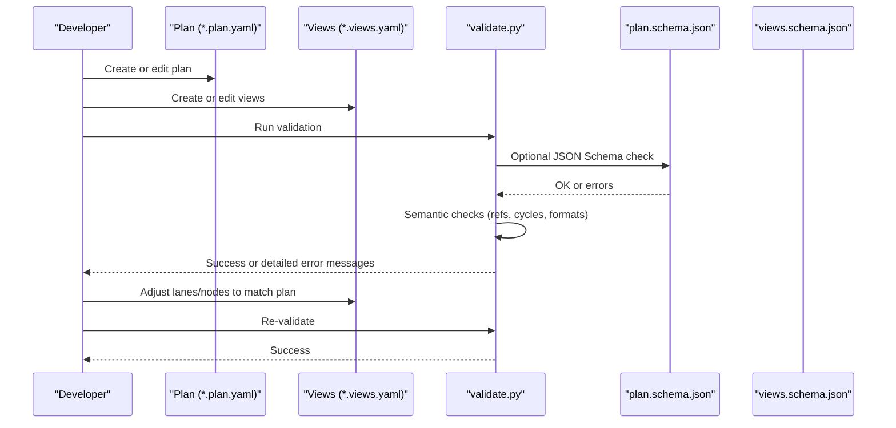
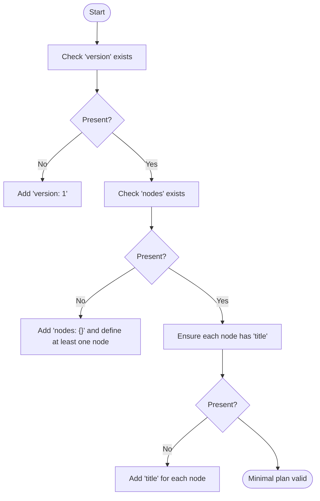
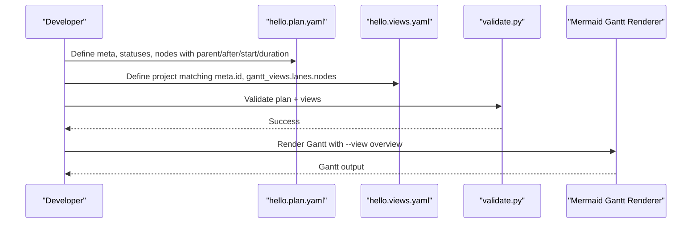
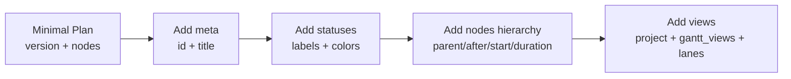
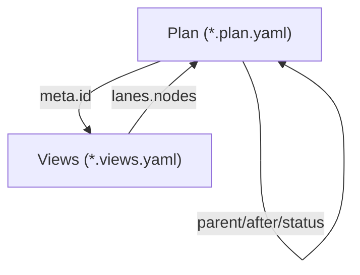

# Basic Examples

<cite>
**Referenced Files in This Document**
- [specs/v1/examples/minimal/project.plan.yaml](file://specs/v1/examples/minimal/project.plan.yaml)
- [specs/v1/examples/minimal/README.md](file://specs/v1/examples/minimal/README.md)
- [specs/v1/examples/hello/hello.plan.yaml](file://specs/v1/examples/hello/hello.plan.yaml)
- [specs/v1/examples/hello/hello.views.yaml](file://specs/v1/examples/hello/hello.views.yaml)
- [specs/v1/examples/hello/README.md](file://specs/v1/examples/hello/README.md)
- [specs/v1/examples/README.md](file://specs/v1/examples/README.md)
- [specs/v1/tools/validate.py](file://specs/v1/tools/validate.py)
- [specs/v1/schemas/plan.schema.json](file://specs/v1/schemas/plan.schema.json)
- [specs/v1/schemas/views.schema.json](file://specs/v1/schemas/views.schema.json)
- [specs/v1/spec/10-plan-file.md](file://specs/v1/spec/10-plan-file.md)
- [specs/v1/spec/30-views-file.md](file://specs/v1/spec/30-views-file.md)
- [specs/v1/spec/40-statuses.md](file://specs/v1/spec/40-statuses.md)
- [specs/v1/examples/advanced/README.md](file://specs/v1/examples/advanced/README.md)
- [specs/v1/examples/advanced/program.plan.yaml](file://specs/v1/examples/advanced/program.plan.yaml)
- [specs/v1/examples/advanced/program.views.yaml](file://specs/v1/examples/advanced/program.views.yaml)
</cite>

## Table of Contents
1. [Introduction](#introduction)
2. [Project Structure](#project-structure)
3. [Core Components](#core-components)
4. [Architecture Overview](#architecture-overview)
5. [Detailed Component Analysis](#detailed-component-analysis)
6. [Dependency Analysis](#dependency-analysis)
7. [Performance Considerations](#performance-considerations)
8. [Troubleshooting Guide](#troubleshooting-guide)
9. [Conclusion](#conclusion)
10. [Appendices](#appendices)

## Introduction
This document provides beginner-friendly, step-by-step guidance for creating operational maps with Opskarta. It starts with the minimal valid plan example and progresses to a complete “hello world” example that includes both a plan and a views file. You will learn:
- The absolute essential fields and structure of a minimal plan
- How to create a full plan and views file with proper node hierarchy, status definitions, and visualization setup
- How to validate your files and generate Mermaid Gantt output
- Practical exercises to build your first operational maps
- Common mistakes and how to fix them
- Why each additional element matters when moving from minimal to complete examples

## Project Structure
The examples are organized under specs/v1/examples with three levels of complexity:
- minimal: a minimal valid plan with only required fields
- hello: a basic plan plus a views file for Gantt visualization
- advanced: a multi-track program plan and multiple views

**Diagram sources**
- [specs/v1/examples/minimal/project.plan.yaml](file://specs/v1/examples/minimal/project.plan.yaml#L1-L6)
- [specs/v1/examples/hello/hello.plan.yaml](file://specs/v1/examples/hello/hello.plan.yaml#L1-L44)
- [specs/v1/examples/hello/hello.views.yaml](file://specs/v1/examples/hello/hello.views.yaml#L1-L13)
- [specs/v1/examples/advanced/program.plan.yaml](file://specs/v1/examples/advanced/program.plan.yaml#L1-L326)
- [specs/v1/examples/advanced/program.views.yaml](file://specs/v1/examples/advanced/program.views.yaml#L1-L93)
- [specs/v1/tools/validate.py](file://specs/v1/tools/validate.py#L634-L752)
- [specs/v1/schemas/plan.schema.json](file://specs/v1/schemas/plan.schema.json#L1-L86)
- [specs/v1/schemas/views.schema.json](file://specs/v1/schemas/views.schema.json#L1-L26)

**Section sources**
- [specs/v1/examples/README.md](file://specs/v1/examples/README.md#L1-L34)
- [specs/v1/examples/minimal/README.md](file://specs/v1/examples/minimal/README.md#L1-L52)
- [specs/v1/examples/hello/README.md](file://specs/v1/examples/hello/README.md#L1-L53)
- [specs/v1/examples/advanced/README.md](file://specs/v1/examples/advanced/README.md#L1-L172)

## Core Components
- Plan file (*.plan.yaml): Defines the project metadata, statuses, and nodes (work items) with their hierarchy, scheduling, and status.
- Views file (*.views.yaml): Defines how to visualize the plan (Gantt views), including lanes and calendar exclusions.
- Validation tool: Validates YAML syntax, JSON Schema compliance, and semantic integrity (references, cycles, formats).

Key responsibilities:
- Plan: version, meta, statuses, nodes
- Nodes: title (required), optional kind/status/parent/after/start/duration/notes
- Views: version, project matching meta.id, gantt_views with lanes and nodes

**Section sources**
- [specs/v1/spec/10-plan-file.md](file://specs/v1/spec/10-plan-file.md#L1-L30)
- [specs/v1/spec/30-views-file.md](file://specs/v1/spec/30-views-file.md#L1-L34)
- [specs/v1/spec/40-statuses.md](file://specs/v1/spec/40-statuses.md#L1-L23)
- [specs/v1/tools/validate.py](file://specs/v1/tools/validate.py#L135-L329)
- [specs/v1/tools/validate.py](file://specs/v1/tools/validate.py#L431-L579)

## Architecture Overview
The basic workflow for creating and validating an Opskarta operational map:

**Diagram sources**
- [specs/v1/tools/validate.py](file://specs/v1/tools/validate.py#L634-L752)
- [specs/v1/schemas/plan.schema.json](file://specs/v1/schemas/plan.schema.json#L1-L86)
- [specs/v1/schemas/views.schema.json](file://specs/v1/schemas/views.schema.json#L1-L26)

## Detailed Component Analysis

### Minimal Valid Plan Example Walkthrough
Goal: Create the smallest valid plan with only required fields.

What this example demonstrates:
- Only required fields: version and nodes
- One node with only the required title
- No views file (views are optional)

File structure:
- project.plan.yaml: version, nodes, root node with title

Validation command:
- cd specs/v1
- python tools/validate.py examples/minimal/project.plan.yaml

Expected outcome:
- Validation passes with no errors
- The plan is minimal but valid

Why this matters:
- Establishes the baseline schema and required keys
- Helps beginners understand the simplest working structure

Common mistakes and fixes:
- Missing version: Add version: 1
- Missing nodes: Add nodes: {} and define at least one node with title
- Invalid YAML syntax: Fix indentation and quoting

**Section sources**
- [specs/v1/examples/minimal/project.plan.yaml](file://specs/v1/examples/minimal/project.plan.yaml#L1-L6)
- [specs/v1/examples/minimal/README.md](file://specs/v1/examples/minimal/README.md#L1-L52)
- [specs/v1/tools/validate.py](file://specs/v1/tools/validate.py#L135-L329)

### Hello World Example Walkthrough
Goal: Create a complete plan and views file with proper node hierarchy, status definitions, and visualization setup.

What this example demonstrates:
- Plan file with meta, statuses, nodes hierarchy (summary, phase, task)
- Views file with one Gantt view and one lane
- Dependencies via after, scheduling via start and duration
- Statuses with labels and colors

File structure:
- hello.plan.yaml: version, meta, statuses, nodes with parent/after/start/duration/status
- hello.views.yaml: version, project matching meta.id, gantt_views with overview and lanes

Step-by-step:
1. Create hello.plan.yaml with:
   - version: 1
   - meta: id and title
   - statuses: four statuses with label and color
   - nodes: root summary, two phases, one task, parent/after/start/duration/status
2. Create hello.views.yaml with:
   - version: 1
   - project: must match meta.id from plan
   - gantt_views: overview with title and excludes
   - lanes: main with title and nodes list
3. Validate:
   - cd specs/v1
   - python tools/validate.py examples/hello/hello.plan.yaml examples/hello/hello.views.yaml
4. Generate Mermaid Gantt:
   - cd specs/v1
   - python -m tools.render.mermaid_gantt --plan examples/hello/hello.plan.yaml --views examples/hello/hello.views.yaml --view overview

Expected outcome:
- Validation passes for both plan and views
- Generated Gantt visualization renders the nodes per the overview view

Why this matters:
- Introduces all major building blocks: meta, statuses, nodes, scheduling, dependencies, and views
- Demonstrates linking plan and views via meta.id and project
- Provides a working base for further customization

**Section sources**
- [specs/v1/examples/hello/hello.plan.yaml](file://specs/v1/examples/hello/hello.plan.yaml#L1-L44)
- [specs/v1/examples/hello/hello.views.yaml](file://specs/v1/examples/hello/hello.views.yaml#L1-L13)
- [specs/v1/examples/hello/README.md](file://specs/v1/examples/hello/README.md#L1-L53)
- [specs/v1/tools/validate.py](file://specs/v1/tools/validate.py#L431-L579)

### Progression From Minimal to Complete
Moving from minimal to complete adds:
- meta: project identity and human-readable title
- statuses: custom statuses with labels and colors for visualization
- nodes: richer hierarchy (summary, phase, task), parent/after for structure and dependencies, start/duration for scheduling
- views: project linkage to plan, gantt_views with lanes and nodes for visualization

Why each element matters:
- meta.id ties views to the plan
- statuses enable status-aware rendering and reporting
- parent/after define the work graph and dependencies
- start/duration provide schedule context
- views define lanes and exclusions for Gantt rendering

**Section sources**
- [specs/v1/spec/10-plan-file.md](file://specs/v1/spec/10-plan-file.md#L1-L30)
- [specs/v1/spec/30-views-file.md](file://specs/v1/spec/30-views-file.md#L1-L34)
- [specs/v1/spec/40-statuses.md](file://specs/v1/spec/40-statuses.md#L1-L23)
- [specs/v1/examples/advanced/README.md](file://specs/v1/examples/advanced/README.md#L1-L172)

## Dependency Analysis
The validator enforces referential integrity and business rules:
- Plan-level: version, nodes presence, node-level title presence, parent/after references, status references, date and duration formats, acyclic dependencies
- Views-level: version, project equals meta.id, lanes/nodes references present and valid

**Diagram sources**
- [specs/v1/tools/validate.py](file://specs/v1/tools/validate.py#L135-L329)
- [specs/v1/tools/validate.py](file://specs/v1/tools/validate.py#L431-L579)

**Section sources**
- [specs/v1/tools/validate.py](file://specs/v1/tools/validate.py#L135-L329)
- [specs/v1/tools/validate.py](file://specs/v1/tools/validate.py#L431-L579)

## Performance Considerations
- Keep nodes and dependencies minimal for initial validation runs
- Use the JSON Schema validation flag only when needed to troubleshoot schema mismatches
- Prefer incremental updates: add one node or one lane at a time, then validate

## Troubleshooting Guide
Common issues and resolutions:
- Missing required fields
  - version missing in plan or views: add version: 1
  - nodes missing in plan: add nodes: {}
  - project missing in views: add project: <meta.id>
- Invalid YAML
  - Indentation or incorrect quoting: fix structure and rerun validation
- Reference errors
  - parent or after references non-existent node_id: ensure node exists in nodes
  - status references non-existent status_id: ensure status exists in statuses
- Date and duration formats
  - start must be YYYY-MM-DD
  - duration must be <number>d or <number>w
- Cyclic dependencies
  - parent chain or after chain creates a loop: break the cycle
- Views mismatch
  - project does not match meta.id: align project with meta.id

Where to validate:
- cd specs/v1
- python tools/validate.py examples/minimal/project.plan.yaml
- python tools/validate.py examples/hello/hello.plan.yaml examples/hello/hello.views.yaml

**Section sources**
- [specs/v1/tools/validate.py](file://specs/v1/tools/validate.py#L135-L329)
- [specs/v1/tools/validate.py](file://specs/v1/tools/validate.py#L431-L579)

## Conclusion
You now have the essentials to create operational maps with Opskarta:
- Start small with a minimal plan
- Grow to a complete plan with meta, statuses, nodes, and scheduling
- Add a views file to visualize your plan
- Validate early and often
- Use the examples as templates for your own projects

## Appendices

### Practical Exercises
Beginner exercises:
- Exercise 1: Copy minimal/project.plan.yaml to your working directory and add one more node with title. Validate.
- Exercise 2: Create a hello.plan.yaml from scratch with meta, statuses, and three nodes forming a simple pipeline (prep -> rollout -> switch). Validate.
- Exercise 3: Create hello.views.yaml with one lane containing all nodes from the plan. Validate and render Gantt.

Intermediate exercise:
- Extend the hello plan with additional nodes and dependencies. Add a second lane in views. Validate and render.

Advanced exercise:
- Compare the minimal, hello, and advanced examples. Identify differences in structure, scheduling, and visualization. Try rendering each advanced view.

### References
- Plan file specification: [specs/v1/spec/10-plan-file.md](file://specs/v1/spec/10-plan-file.md#L1-L30)
- Views file specification: [specs/v1/spec/30-views-file.md](file://specs/v1/spec/30-views-file.md#L1-L34)
- Statuses specification: [specs/v1/spec/40-statuses.md](file://specs/v1/spec/40-statuses.md#L1-L23)
- Example index: [specs/v1/examples/README.md](file://specs/v1/examples/README.md#L1-L34)
- Minimal example: [specs/v1/examples/minimal/README.md](file://specs/v1/examples/minimal/README.md#L1-L52)
- Hello example: [specs/v1/examples/hello/README.md](file://specs/v1/examples/hello/README.md#L1-L53)
- Advanced example: [specs/v1/examples/advanced/README.md](file://specs/v1/examples/advanced/README.md#L1-L172)