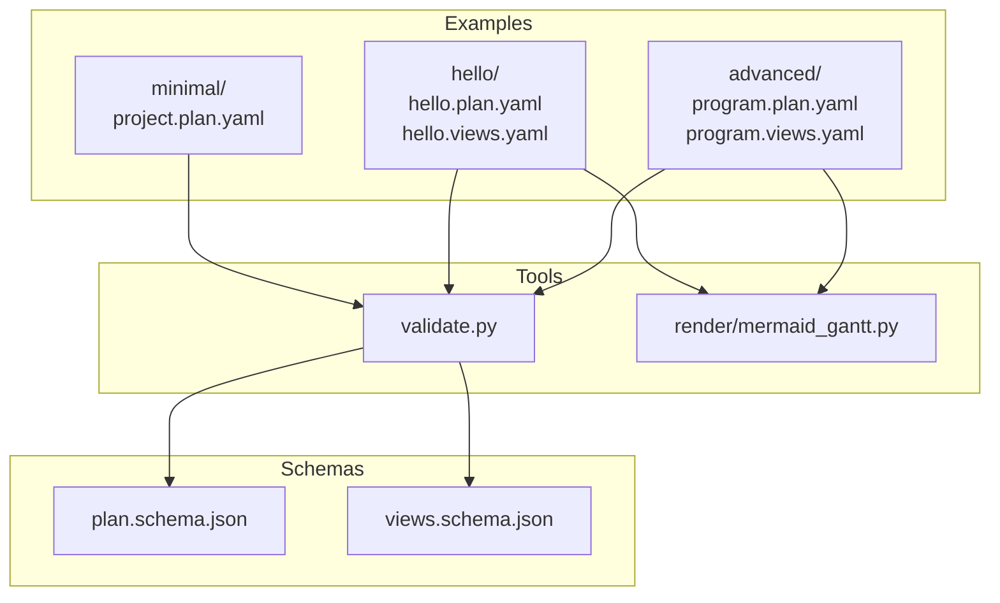
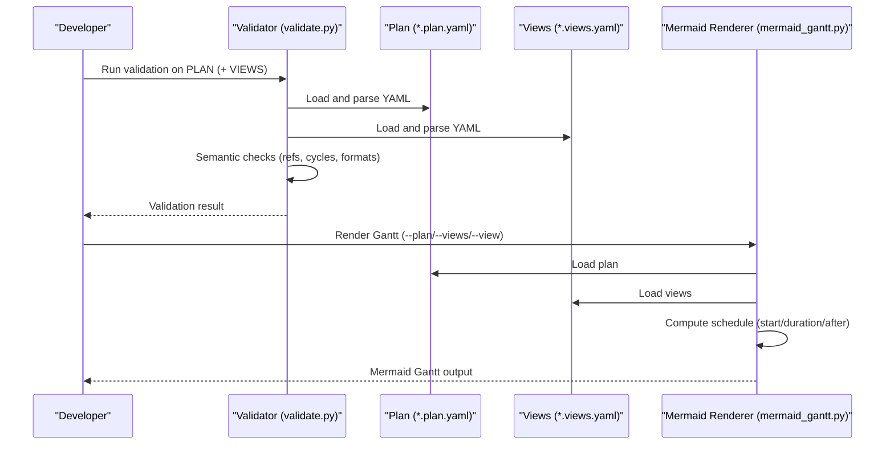
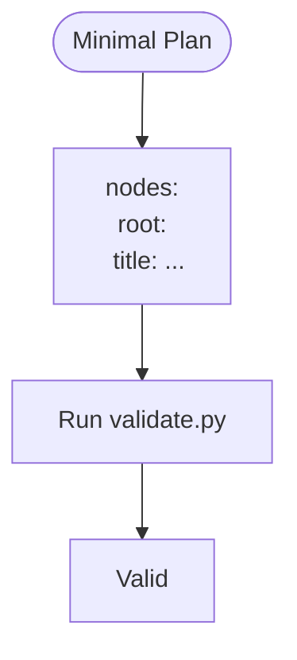
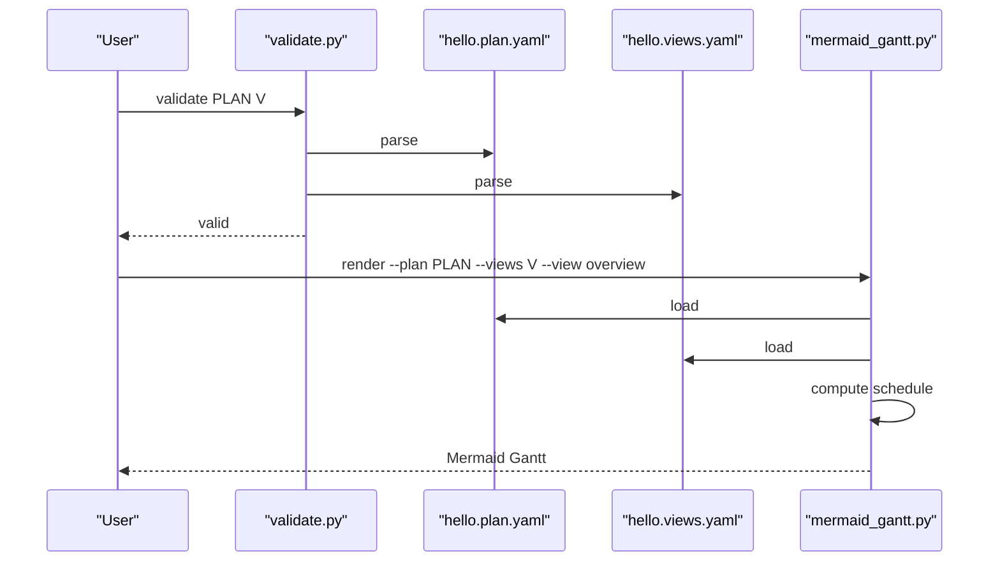
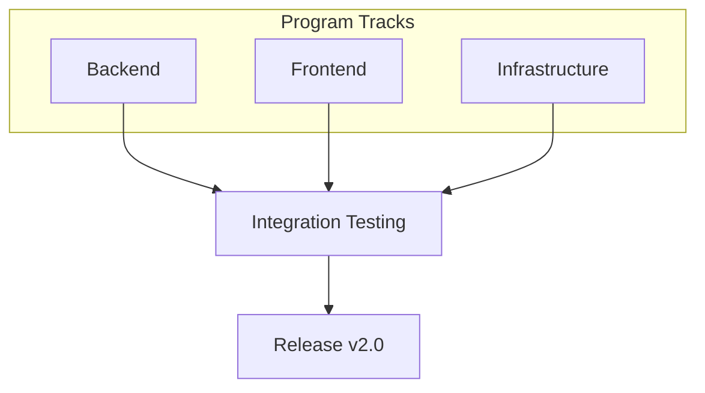
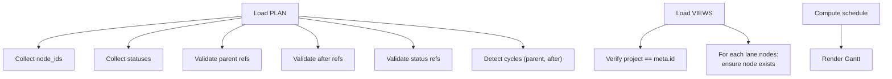

# Examples and Use Cases

<cite>
**Referenced Files in This Document**
- [specs/v1/examples/minimal/project.plan.yaml](file://specs/v1/examples/minimal/project.plan.yaml)
- [specs/v1/examples/minimal/README.md](file://specs/v1/examples/minimal/README.md)
- [specs/v1/examples/hello/hello.plan.yaml](file://specs/v1/examples/hello/hello.plan.yaml)
- [specs/v1/examples/hello/hello.views.yaml](file://specs/v1/examples/hello/hello.views.yaml)
- [specs/v1/examples/hello/README.md](file://specs/v1/examples/hello/README.md)
- [specs/v1/examples/advanced/program.plan.yaml](file://specs/v1/examples/advanced/program.plan.yaml)
- [specs/v1/examples/advanced/program.views.yaml](file://specs/v1/examples/advanced/program.views.yaml)
- [specs/v1/examples/advanced/README.md](file://specs/v1/examples/advanced/README.md)
- [specs/v1/SPEC.md](file://specs/v1/SPEC.md)
- [specs/v1/tools/validate.py](file://specs/v1/tools/validate.py)
- [specs/v1/tools/render/mermaid_gantt.py](file://specs/v1/tools/render/mermaid_gantt.py)
- [specs/v1/tools/README.md](file://specs/v1/tools/README.md)
- [specs/v1/schemas/plan.schema.json](file://specs/v1/schemas/plan.schema.json)
- [specs/v1/schemas/views.schema.json](file://specs/v1/schemas/views.schema.json)
</cite>

## Table of Contents
1. [Introduction](#introduction)
2. [Project Structure](#project-structure)
3. [Core Components](#core-components)
4. [Architecture Overview](#architecture-overview)
5. [Detailed Component Analysis](#detailed-component-analysis)
6. [Dependency Analysis](#dependency-analysis)
7. [Performance Considerations](#performance-considerations)
8. [Troubleshooting Guide](#troubleshooting-guide)
9. [Conclusion](#conclusion)
10. [Appendices](#appendices)

## Introduction
This document provides comprehensive examples and use cases for Opskarta v1, progressing from minimal valid plans to advanced multi-track programs. It explains practical implementation scenarios such as program management, multi-team coordination, release planning, and risk management. You will learn how to structure operational maps, organize information hierarchies, manage statuses and timelines, and communicate effectively through different view perspectives. Step-by-step tutorials guide you through creating phased rollouts, managing dependencies, and organizing multi-lane views. Real-world patterns covered include cross-track dependencies, calendar exclusions, and custom extensions.

## Project Structure
The repository organizes examples under specs/v1/examples with three levels of complexity:
- minimal: a minimal valid plan with a single node
- hello: a basic plan with a plan and a views file
- advanced: a full program with multiple tracks, statuses, dependencies, and custom extensions

Tools under specs/v1/tools provide validation and Mermaid Gantt rendering. Schemas define JSON Schema validation for plan and views files.

**Diagram sources**
- [specs/v1/examples/minimal/project.plan.yaml](file://specs/v1/examples/minimal/project.plan.yaml#L1-L6)
- [specs/v1/examples/hello/hello.plan.yaml](file://specs/v1/examples/hello/hello.plan.yaml#L1-L44)
- [specs/v1/examples/hello/hello.views.yaml](file://specs/v1/examples/hello/hello.views.yaml#L1-L13)
- [specs/v1/examples/advanced/program.plan.yaml](file://specs/v1/examples/advanced/program.plan.yaml#L1-L326)
- [specs/v1/examples/advanced/program.views.yaml](file://specs/v1/examples/advanced/program.views.yaml#L1-L93)
- [specs/v1/tools/validate.py](file://specs/v1/tools/validate.py#L1-L752)
- [specs/v1/tools/render/mermaid_gantt.py](file://specs/v1/tools/render/mermaid_gantt.py#L1-L549)
- [specs/v1/schemas/plan.schema.json](file://specs/v1/schemas/plan.schema.json#L1-L86)
- [specs/v1/schemas/views.schema.json](file://specs/v1/schemas/views.schema.json#L1-L26)

**Section sources**
- [specs/v1/examples/minimal/README.md](file://specs/v1/examples/minimal/README.md#L1-L52)
- [specs/v1/examples/hello/README.md](file://specs/v1/examples/hello/README.md#L1-L53)
- [specs/v1/examples/advanced/README.md](file://specs/v1/examples/advanced/README.md#L1-L172)
- [specs/v1/tools/README.md](file://specs/v1/tools/README.md#L1-L126)

## Core Components
- Plan files (*.plan.yaml): Define version, metadata, statuses, and nodes with hierarchical kinds (summary, phase, epic, task), optional status, parent, dependencies (after), and scheduling (start, duration). See [SPEC.md](file://specs/v1/SPEC.md#L27-L95).
- Views files (*.views.yaml): Define Gantt views with lanes and node lists for different audiences. See [SPEC.md](file://specs/v1/SPEC.md#L98-L131).
- Validation: Ensures required fields, reference integrity (parent, after, status), absence of cycles, and correct formats for dates and durations. See [SPEC.md](file://specs/v1/SPEC.md#L241-L380) and validator implementation [validate.py](file://specs/v1/tools/validate.py#L135-L329).
- Rendering: Generates Mermaid Gantt diagrams from plan and selected view, computing schedules from explicit starts and dependencies. See [SPEC.md](file://specs/v1/SPEC.md#L225-L237) and renderer [mermaid_gantt.py](file://specs/v1/tools/render/mermaid_gantt.py#L217-L294).

**Section sources**
- [specs/v1/SPEC.md](file://specs/v1/SPEC.md#L27-L131)
- [specs/v1/tools/validate.py](file://specs/v1/tools/validate.py#L135-L329)
- [specs/v1/tools/render/mermaid_gantt.py](file://specs/v1/tools/render/mermaid_gantt.py#L217-L294)

## Architecture Overview
The examples demonstrate a progression from minimal to advanced usage:
- minimal: validates a minimal plan with one node
- hello: adds statuses, scheduling, dependencies, and a single-lane view
- advanced: introduces multi-track phases, epics, tasks, cross-track dependencies, calendar exclusions, and custom extensions

**Diagram sources**
- [specs/v1/tools/validate.py](file://specs/v1/tools/validate.py#L690-L748)
- [specs/v1/tools/render/mermaid_gantt.py](file://specs/v1/tools/render/mermaid_gantt.py#L439-L544)

## Detailed Component Analysis

### Minimal Example Walkthrough
- Purpose: Demonstrate absolute minimum valid plan with a single node.
- Files:
  - [project.plan.yaml](file://specs/v1/examples/minimal/project.plan.yaml#L1-L6)
- Highlights:
  - Only required fields: version and nodes
  - One node with title
  - No statuses, no scheduling, no parent/after, no notes, no views file
- Validation outcome: Passes semantic validation; no errors expected.
- When to use: Starting point for understanding the format.

**Diagram sources**
- [specs/v1/examples/minimal/project.plan.yaml](file://specs/v1/examples/minimal/project.plan.yaml#L1-L6)
- [specs/v1/tools/validate.py](file://specs/v1/tools/validate.py#L135-L329)

**Section sources**
- [specs/v1/examples/minimal/project.plan.yaml](file://specs/v1/examples/minimal/project.plan.yaml#L1-L6)
- [specs/v1/examples/minimal/README.md](file://specs/v1/examples/minimal/README.md#L1-L52)

### Hello Example Walkthrough
- Purpose: Basic usage with plan and views.
- Files:
  - [hello.plan.yaml](file://specs/v1/examples/hello/hello.plan.yaml#L1-L44)
  - [hello.views.yaml](file://specs/v1/examples/hello/hello.views.yaml#L1-L13)
- Highlights:
  - Custom statuses with labels and colors
  - Phases and tasks with parent/after relationships
  - Scheduling via start and duration
  - Notes for critical tasks
  - Single-lane view with excluded weekends
- Validation outcome: Passes semantic validation; no errors expected.
- Rendering outcome: Generates a Gantt with lanes and colored tasks.

**Diagram sources**
- [specs/v1/examples/hello/hello.plan.yaml](file://specs/v1/examples/hello/hello.plan.yaml#L1-L44)
- [specs/v1/examples/hello/hello.views.yaml](file://specs/v1/examples/hello/hello.views.yaml#L1-L13)
- [specs/v1/tools/validate.py](file://specs/v1/tools/validate.py#L690-L748)
- [specs/v1/tools/render/mermaid_gantt.py](file://specs/v1/tools/render/mermaid_gantt.py#L439-L544)

**Section sources**
- [specs/v1/examples/hello/hello.plan.yaml](file://specs/v1/examples/hello/hello.plan.yaml#L1-L44)
- [specs/v1/examples/hello/hello.views.yaml](file://specs/v1/examples/hello/hello.views.yaml#L1-L13)
- [specs/v1/examples/hello/README.md](file://specs/v1/examples/hello/README.md#L1-L53)

### Advanced Example Walkthrough
- Purpose: Full program with three tracks, cross-track dependencies, calendar exclusions, and custom extensions.
- Files:
  - [program.plan.yaml](file://specs/v1/examples/advanced/program.plan.yaml#L1-L326)
  - [program.views.yaml](file://specs/v1/examples/advanced/program.views.yaml#L1-L93)
- Highlights:
  - Multi-track structure: backend, frontend, infrastructure
  - Cross-track dependencies: integration testing depends on completion across tracks
  - Calendar exclusions: weekends and holidays
  - Custom extensions (x:) for team assignments, risk register, and milestones
  - Multiple Gantt views: overview, track details, critical path
- Validation outcome: Passes semantic validation; no errors expected.
- Rendering outcome: Generates multiple Gantt views tailored for stakeholders.

**Diagram sources**
- [specs/v1/examples/advanced/program.plan.yaml](file://specs/v1/examples/advanced/program.plan.yaml#L1-L326)
- [specs/v1/examples/advanced/program.views.yaml](file://specs/v1/examples/advanced/program.views.yaml#L1-L93)

**Section sources**
- [specs/v1/examples/advanced/program.plan.yaml](file://specs/v1/examples/advanced/program.plan.yaml#L1-L326)
- [specs/v1/examples/advanced/program.views.yaml](file://specs/v1/examples/advanced/program.views.yaml#L1-L93)
- [specs/v1/examples/advanced/README.md](file://specs/v1/examples/advanced/README.md#L1-L172)

## Dependency Analysis
- Reference integrity:
  - parent must reference an existing node
  - after must reference existing nodes
  - status must reference an existing status key
- Cycle detection:
  - Parent chain cannot form cycles
  - Dependencies via after cannot form cycles
- Scheduling:
  - start and duration define explicit scheduling
  - after defines precedence; start inherits from dependencies or parent when absent
- View-to-plan linkage:
  - project in views must match meta.id in plan
  - lanes[].nodes must reference existing node IDs

**Diagram sources**
- [specs/v1/tools/validate.py](file://specs/v1/tools/validate.py#L135-L329)
- [specs/v1/tools/validate.py](file://specs/v1/tools/validate.py#L431-L579)
- [specs/v1/tools/render/mermaid_gantt.py](file://specs/v1/tools/render/mermaid_gantt.py#L217-L294)

**Section sources**
- [specs/v1/tools/validate.py](file://specs/v1/tools/validate.py#L253-L329)
- [specs/v1/tools/validate.py](file://specs/v1/tools/validate.py#L431-L579)
- [specs/v1/SPEC.md](file://specs/v1/SPEC.md#L241-L380)

## Performance Considerations
- Scheduling computation:
  - Topological resolution per node; complexity proportional to number of nodes plus edges in after dependencies.
  - Caching avoids recomputation for repeated nodes.
- Rendering:
  - O(n) pass over visible nodes per view; negligible overhead for typical workloads.
- Recommendations:
  - Keep views scoped to relevant nodes to minimize rendering cost.
  - Prefer coarse-grained lanes for high-level views; reserve detailed lanes for specific teams.

[No sources needed since this section provides general guidance]

## Troubleshooting Guide
Common issues and resolutions:
- Missing required fields:
  - Ensure version, nodes, and node.title are present. See [SPEC.md](file://specs/v1/SPEC.md#L245-L251).
- Invalid references:
  - parent, after, and status must refer to existing keys. Validator reports path, value, and available keys. See [SPEC.md](file://specs/v1/SPEC.md#L253-L315) and [validate.py](file://specs/v1/tools/validate.py#L230-L297).
- Cyclic dependencies:
  - Parent or after chains forming cycles are rejected. See [SPEC.md](file://specs/v1/SPEC.md#L276-L295) and [validate.py](file://specs/v1/tools/validate.py#L325-L403).
- Date/duration format errors:
  - start must be YYYY-MM-DD; duration must be digits followed by d or w. See [SPEC.md](file://specs/v1/SPEC.md#L317-L321) and [validate.py](file://specs/v1/tools/validate.py#L299-L323).
- View linkage mismatch:
  - project must equal meta.id; lanes nodes must exist in plan. See [SPEC.md](file://specs/v1/SPEC.md#L329-L354) and [validate.py](file://specs/v1/tools/validate.py#L482-L577).

**Section sources**
- [specs/v1/SPEC.md](file://specs/v1/SPEC.md#L241-L380)
- [specs/v1/tools/validate.py](file://specs/v1/tools/validate.py#L135-L579)

## Conclusion
These examples illustrate how to evolve from a minimal plan to a sophisticated, multi-track operational map. By combining structured nodes, statuses, scheduling, and multiple views, teams can coordinate complex programs, model cross-team dependencies, plan releases, and manage risks. The provided tools enable robust validation and rendering, ensuring reliable collaboration across stakeholders.

[No sources needed since this section summarizes without analyzing specific files]

## Appendices

### Step-by-Step Tutorials

- Tutorial: Create a phased rollout
  - Define a root summary, a preparation phase, a rollout phase, and a switchover task.
  - Use after to sequence rollout after preparation, and switchover after rollout.
  - Add notes for critical steps.
  - Render a Gantt view with a single lane for visibility.
  - References:
    - [hello.plan.yaml](file://specs/v1/examples/hello/hello.plan.yaml#L19-L44)
    - [hello.views.yaml](file://specs/v1/examples/hello/hello.views.yaml#L4-L13)
    - [SPEC.md](file://specs/v1/SPEC.md#L159-L237)

- Tutorial: Manage dependencies across tracks
  - Model cross-track dependencies by referencing nodes from other tracks in after.
  - Use multiple lanes in views to show each track’s progress.
  - Reference:
    - [program.plan.yaml](file://specs/v1/examples/advanced/program.plan.yaml#L271-L280)
    - [program.views.yaml](file://specs/v1/examples/advanced/program.views.yaml#L12-L28)

- Tutorial: Organize multi-lane views
  - Create separate lanes for major themes (e.g., Backend, Frontend, Infrastructure).
  - Add a dedicated “Milestones” lane for key gates.
  - Reference:
    - [program.views.yaml](file://specs/v1/examples/advanced/program.views.yaml#L12-L28)

- Tutorial: Use calendar exclusions
  - Exclude weekends and holidays in views to reflect working days.
  - Reference:
    - [program.views.yaml](file://specs/v1/examples/advanced/program.views.yaml#L10-L10)

- Tutorial: Add custom extensions
  - Store team assignments, risk register, and milestones under x: for downstream integrations.
  - Reference:
    - [program.plan.yaml](file://specs/v1/examples/advanced/program.plan.yaml#L298-L326)

### Best Practices
- Status management
  - Define a small set of meaningful statuses with consistent labels and colors.
  - Use statuses to reflect current state without dictating workflow.
  - Reference:
    - [SPEC.md](file://specs/v1/SPEC.md#L134-L155)

- Timeline planning
  - Prefer explicit start dates for key milestones; use duration for estimates.
  - Use after to encode dependencies; avoid ambiguous overlaps.
  - Reference:
    - [SPEC.md](file://specs/v1/SPEC.md#L159-L237)

- Stakeholder communication
  - Create multiple views: executive overview, team detail, critical path.
  - Use lanes to segment ownership and reduce cognitive load.
  - Reference:
    - [program.views.yaml](file://specs/v1/examples/advanced/program.views.yaml#L8-L93)

### Validation and Rendering Commands
- Validate:
  - Minimal: [validate.py](file://specs/v1/tools/validate.py#L690-L748)
  - Hello: [validate.py](file://specs/v1/tools/validate.py#L690-L748)
  - Advanced: [validate.py](file://specs/v1/tools/validate.py#L690-L748)
- Render:
  - Hello overview: [mermaid_gantt.py](file://specs/v1/tools/render/mermaid_gantt.py#L439-L544)
  - Advanced overview: [mermaid_gantt.py](file://specs/v1/tools/render/mermaid_gantt.py#L439-L544)
  - Advanced critical path: [mermaid_gantt.py](file://specs/v1/tools/render/mermaid_gantt.py#L439-L544)

**Section sources**
- [specs/v1/tools/README.md](file://specs/v1/tools/README.md#L1-L126)
- [specs/v1/tools/validate.py](file://specs/v1/tools/validate.py#L690-L748)
- [specs/v1/tools/render/mermaid_gantt.py](file://specs/v1/tools/render/mermaid_gantt.py#L439-L544)