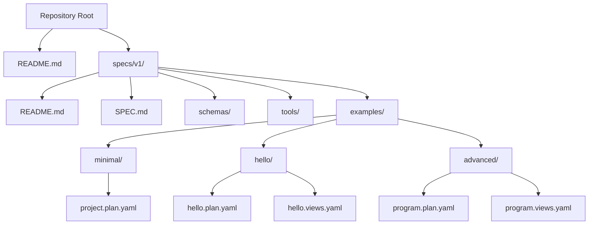
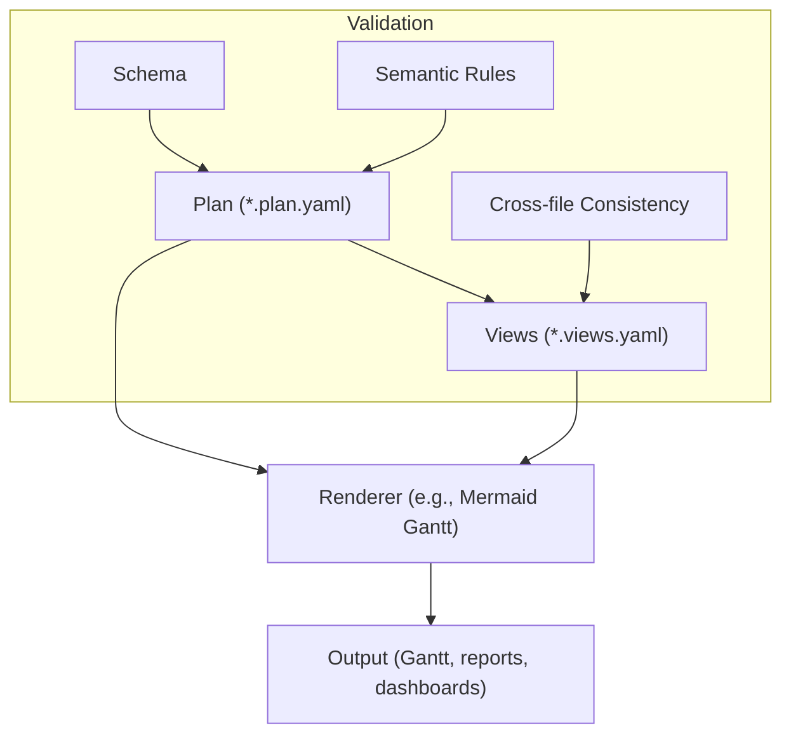
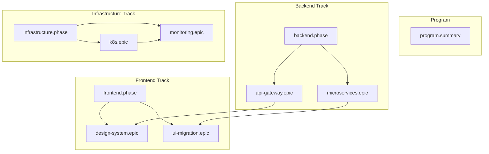
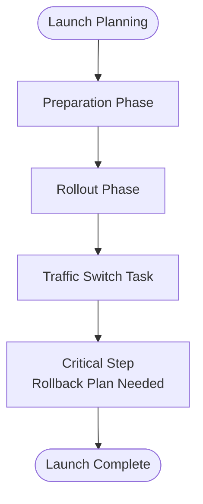
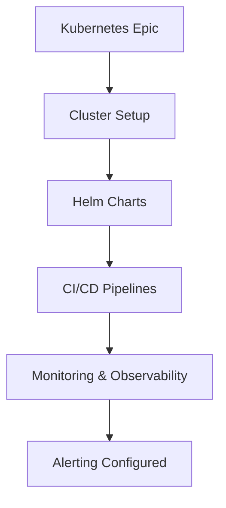
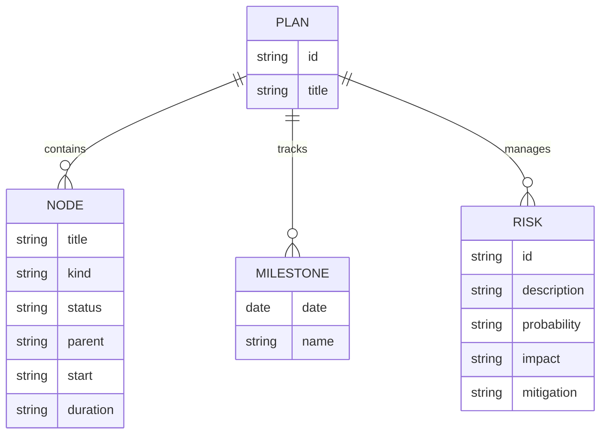
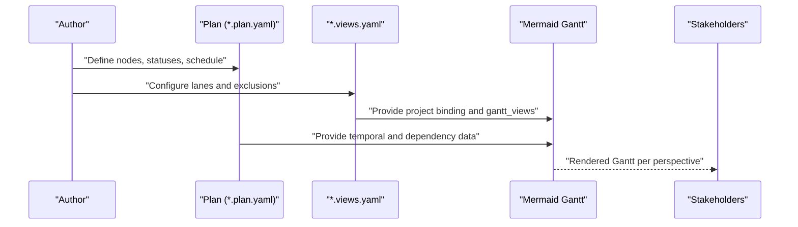
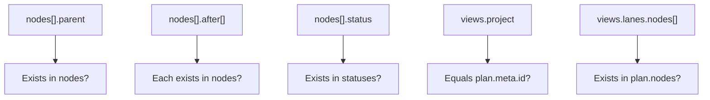

# Real-world Scenarios

<cite>
**Referenced Files in This Document**
- [README.md](file://README.md)
- [specs/v1/README.md](file://specs/v1/README.md)
- [specs/v1/examples/README.md](file://specs/v1/examples/README.md)
- [specs/v1/examples/minimal/project.plan.yaml](file://specs/v1/examples/minimal/project.plan.yaml)
- [specs/v1/examples/hello/hello.plan.yaml](file://specs/v1/examples/hello/hello.plan.yaml)
- [specs/v1/examples/hello/hello.views.yaml](file://specs/v1/examples/hello/hello.views.yaml)
- [specs/v1/examples/advanced/program.plan.yaml](file://specs/v1/examples/advanced/program.plan.yaml)
- [specs/v1/examples/advanced/program.views.yaml](file://specs/v1/examples/advanced/program.views.yaml)
- [specs/v1/spec/00-introduction.md](file://specs/v1/spec/00-introduction.md)
- [specs/v1/spec/10-plan-file.md](file://specs/v1/spec/10-plan-file.md)
- [specs/v1/spec/20-nodes.md](file://specs/v1/spec/20-nodes.md)
- [specs/v1/spec/30-views-file.md](file://specs/v1/spec/30-views-file.md)
- [specs/v1/spec/40-statuses.md](file://specs/v1/spec/40-statuses.md)
- [specs/v1/spec/50-scheduling.md](file://specs/v1/spec/50-scheduling.md)
- [specs/v1/spec/60-validation.md](file://specs/v1/spec/60-validation.md)
- [specs/v1/spec/90-extensibility.md](file://specs/v1/spec/90-extensibility.md)
</cite>

## Table of Contents
1. [Introduction](#introduction)
2. [Project Structure](#project-structure)
3. [Core Components](#core-components)
4. [Architecture Overview](#architecture-overview)
5. [Detailed Component Analysis](#detailed-component-analysis)
6. [Dependency Analysis](#dependency-analysis)
7. [Performance Considerations](#performance-considerations)
8. [Troubleshooting Guide](#troubleshooting-guide)
9. [Conclusion](#conclusion)
10. [Appendices](#appendices)

## Introduction
This document presents real-world scenarios for Opskarta, focusing on practical implementation patterns for managing complex programs and projects. It covers program management, multi-team coordination, release planning, risk management, and stakeholder communication through multiple view perspectives. Guidance is grounded in the opskarta v1 specification and validated by example plans and views included in the repository.

## Project Structure
The repository is organized around the opskarta v1 specification and example artifacts:
- Top-level README provides quick start and links to documentation.
- specs/v1/ contains the specification chapters, JSON schemas, and reference tools.
- specs/v1/examples/ contains minimal, hello, and advanced example sets demonstrating increasing complexity.
- The examples include both plan files (.plan.yaml) and views files (.views.yaml), plus supporting documentation.

**Diagram sources**
- [README.md](file://README.md#L1-L96)
- [specs/v1/README.md](file://specs/v1/README.md#L1-L27)
- [specs/v1/examples/README.md](file://specs/v1/examples/README.md#L1-L34)
- [specs/v1/examples/minimal/project.plan.yaml](file://specs/v1/examples/minimal/project.plan.yaml#L1-L6)
- [specs/v1/examples/hello/hello.plan.yaml](file://specs/v1/examples/hello/hello.plan.yaml#L1-L44)
- [specs/v1/examples/hello/hello.views.yaml](file://specs/v1/examples/hello/hello.views.yaml#L1-L13)
- [specs/v1/examples/advanced/program.plan.yaml](file://specs/v1/examples/advanced/program.plan.yaml#L1-L326)
- [specs/v1/examples/advanced/program.views.yaml](file://specs/v1/examples/advanced/program.views.yaml#L1-L93)

**Section sources**
- [README.md](file://README.md#L1-L96)
- [specs/v1/README.md](file://specs/v1/README.md#L1-L27)
- [specs/v1/examples/README.md](file://specs/v1/examples/README.md#L1-L34)

## Core Components
- Plan file (*.plan.yaml): Defines the operational map with metadata, statuses, and hierarchical nodes. It is the single source of truth for work breakdown and dependencies.
- Views file (*.views.yaml): Describes how to render the plan (e.g., Gantt lanes) and binds to a specific plan via the project field.
- Nodes: Work items with kinds (summary, phase, epic, task), status, parent/child hierarchy, and scheduling fields (start, duration, after).
- Statuses: User-defined labels and colors to represent progress and workflow states.
- Scheduling: Temporal semantics for nodes and interdependencies, enabling timeline generation and dependency visualization.
- Validation: Rules ensuring referential integrity, semantic correctness, and schema compliance.

Practical implications:
- Use plan files to capture evolving understanding of work and dependencies.
- Use views to tailor presentations for stakeholders (executives, managers, practitioners).
- Encode cross-cutting concerns (teams, risks, milestones) in the plan’s extension namespace for traceability.

**Section sources**
- [specs/v1/spec/10-plan-file.md](file://specs/v1/spec/10-plan-file.md#L1-L30)
- [specs/v1/spec/30-views-file.md](file://specs/v1/spec/30-views-file.md#L1-L34)
- [specs/v1/spec/20-nodes.md](file://specs/v1/spec/20-nodes.md#L1-L37)
- [specs/v1/spec/40-statuses.md](file://specs/v1/spec/40-statuses.md#L1-L23)
- [specs/v1/spec/50-scheduling.md](file://specs/v1/spec/50-scheduling.md#L1-L80)
- [specs/v1/spec/60-validation.md](file://specs/v1/spec/60-validation.md#L1-L140)
- [specs/v1/spec/90-extensibility.md](file://specs/v1/spec/90-extensibility.md#L1-L26)

## Architecture Overview
The opskarta architecture centers on a plan-as-code approach:
- Author the plan in YAML/JSON.
- Validate against schema and semantic rules.
- Render multiple views (e.g., Gantt) from the plan.
- Use extensions to enrich the plan with organizational context (team assignments, risks, milestones).

**Diagram sources**
- [specs/v1/spec/10-plan-file.md](file://specs/v1/spec/10-plan-file.md#L1-L30)
- [specs/v1/spec/30-views-file.md](file://specs/v1/spec/30-views-file.md#L1-L34)
- [specs/v1/spec/50-scheduling.md](file://specs/v1/spec/50-scheduling.md#L67-L74)
- [specs/v1/spec/60-validation.md](file://specs/v1/spec/60-validation.md#L116-L123)

## Detailed Component Analysis

### Scenario: Program Management with Multi-track Execution
This scenario demonstrates managing a program with three tracks (backend, frontend, infrastructure) and cross-track dependencies. It also includes risk register and milestone definitions.

Key elements:
- Hierarchical decomposition: summary -> phase -> epic -> task.
- Cross-track dependencies via after relationships.
- Team assignments and risk register under the extension namespace.
- Multiple Gantt views: overview, track-specific details, and critical path.

**Diagram sources**
- [specs/v1/examples/advanced/program.plan.yaml](file://specs/v1/examples/advanced/program.plan.yaml#L16-L294)

Implementation patterns:
- Define track-level epics and tasks; link them to phases.
- Use after to enforce completion gates across tracks.
- Add cross-cutting info (risks, milestones) under x: for visibility and reporting.

**Section sources**
- [specs/v1/examples/advanced/program.plan.yaml](file://specs/v1/examples/advanced/program.plan.yaml#L1-L326)
- [specs/v1/examples/advanced/program.views.yaml](file://specs/v1/examples/advanced/program.views.yaml#L1-L93)
- [specs/v1/spec/20-nodes.md](file://specs/v1/spec/20-nodes.md#L11-L16)
- [specs/v1/spec/50-scheduling.md](file://specs/v1/spec/50-scheduling.md#L15-L16)
- [specs/v1/spec/90-extensibility.md](file://specs/v1/spec/90-extensibility.md#L14-L23)

### Scenario: Product Launch (Phased Rollout)
This scenario models a phased product launch with preparation, rollout, and cutover steps, including rollback considerations.

**Diagram sources**
- [specs/v1/examples/hello/hello.plan.yaml](file://specs/v1/examples/hello/hello.plan.yaml#L13-L44)

Best practices:
- Model each phase explicitly and link them with after dependencies.
- Add a dedicated cutover task with contextual notes for risk awareness.
- Use views to highlight the rollout lane for stakeholders.

**Section sources**
- [specs/v1/examples/hello/hello.plan.yaml](file://specs/v1/examples/hello/hello.plan.yaml#L1-L44)
- [specs/v1/examples/hello/hello.views.yaml](file://specs/v1/examples/hello/hello.views.yaml#L1-L13)

### Scenario: Infrastructure Migration (Kubernetes Modernization)
This scenario focuses on migrating services to Kubernetes with cluster setup, Helm charts, CI/CD pipelines, and observability.

**Diagram sources**
- [specs/v1/examples/advanced/program.plan.yaml](file://specs/v1/examples/advanced/program.plan.yaml#L201-L266)

Guidance:
- Decompose into epics and tasks aligned with deployment stages.
- Use after to enforce sequential readiness gates.
- Surface critical path lanes in views for executive oversight.

**Section sources**
- [specs/v1/examples/advanced/program.plan.yaml](file://specs/v1/examples/advanced/program.plan.yaml#L201-L266)
- [specs/v1/examples/advanced/program.views.yaml](file://specs/v1/examples/advanced/program.views.yaml#L64-L76)

### Scenario: Strategic Initiative with Milestones and Risks
This scenario demonstrates capturing strategic goals with milestones and a risk register, enabling governance and reporting.

**Diagram sources**
- [specs/v1/examples/advanced/program.plan.yaml](file://specs/v1/examples/advanced/program.plan.yaml#L296-L326)

Implementation tips:
- Store milestones and risks under x: for centralized governance.
- Reference milestone nodes in views to highlight governance gates.
- Use statuses to reflect risk state and mitigation progress.

**Section sources**
- [specs/v1/examples/advanced/program.plan.yaml](file://specs/v1/examples/advanced/program.plan.yaml#L296-L326)
- [specs/v1/spec/40-statuses.md](file://specs/v1/spec/40-statuses.md#L1-L23)
- [specs/v1/spec/90-extensibility.md](file://specs/v1/spec/90-extensibility.md#L1-L26)

### View Perspective Patterns
Multiple views enable tailored communication:
- Overview: program-wide lanes per track and key milestones.
- Detail lanes: drill down into specific epics or teams.
- Critical path: highlight the longest sequence to release.

**Diagram sources**
- [specs/v1/spec/30-views-file.md](file://specs/v1/spec/30-views-file.md#L1-L34)
- [specs/v1/examples/hello/hello.views.yaml](file://specs/v1/examples/hello/hello.views.yaml#L1-L13)
- [specs/v1/examples/advanced/program.views.yaml](file://specs/v1/examples/advanced/program.views.yaml#L1-L93)

**Section sources**
- [specs/v1/spec/30-views-file.md](file://specs/v1/spec/30-views-file.md#L1-L34)
- [specs/v1/examples/hello/hello.views.yaml](file://specs/v1/examples/hello/hello.views.yaml#L1-L13)
- [specs/v1/examples/advanced/program.views.yaml](file://specs/v1/examples/advanced/program.views.yaml#L1-L93)

## Dependency Analysis
Opskarta enforces referential integrity and semantic correctness across plan and views:
- Parent-child relationships must reference existing nodes; cycles are disallowed.
- Dependencies (after) must reference existing nodes; cycles are disallowed.
- Status keys must match those declared in statuses.
- Views must bind to the correct plan via project id.
- Node ids referenced in views must exist in the plan.

**Diagram sources**
- [specs/v1/spec/60-validation.md](file://specs/v1/spec/60-validation.md#L13-L114)

**Section sources**
- [specs/v1/spec/60-validation.md](file://specs/v1/spec/60-validation.md#L1-L140)

## Performance Considerations
- Keep plans concise and hierarchical to improve rendering performance.
- Prefer explicit after dependencies to avoid ambiguous scheduling.
- Limit the number of lanes per view to reduce visual clutter.
- Use calendar exclusions judiciously to reflect realistic durations.

## Troubleshooting Guide
Common issues and resolutions:
- Reference errors: Ensure parent, after, and status values correspond to existing keys.
- Binding mismatch: views.project must equal plan.meta.id.
- Calendar exclusion misuse: excludes should align with intended business calendars.
- Extension field handling: Unknown fields are ignored; ensure downstream tools support your extensions.

Validation guidance:
- Run the reference validator on plan and views files.
- Review error messages indicating the problematic path, value, and expected set.

**Section sources**
- [specs/v1/spec/60-validation.md](file://specs/v1/spec/60-validation.md#L116-L140)

## Conclusion
Opskarta enables plan-as-code for complex programs by structuring work hierarchically, encoding scheduling and dependencies, and rendering multiple views for diverse stakeholders. The examples demonstrate how to organize information for multi-team environments, manage releases, and embed risk and milestone governance. Adopting the patterns here ensures clarity, traceability, and scalability across varied project types.

## Appendices

### Templates and Patterns
- Minimal plan template: [project.plan.yaml](file://specs/v1/examples/minimal/project.plan.yaml#L1-L6)
- Hello world plan and views: [hello.plan.yaml](file://specs/v1/examples/hello/hello.plan.yaml#L1-L44), [hello.views.yaml](file://specs/v1/examples/hello/hello.views.yaml#L1-L13)
- Advanced program plan and views: [program.plan.yaml](file://specs/v1/examples/advanced/program.plan.yaml#L1-L326), [program.views.yaml](file://specs/v1/examples/advanced/program.views.yaml#L1-L93)

**Section sources**
- [specs/v1/examples/minimal/project.plan.yaml](file://specs/v1/examples/minimal/project.plan.yaml#L1-L6)
- [specs/v1/examples/hello/hello.plan.yaml](file://specs/v1/examples/hello/hello.plan.yaml#L1-L44)
- [specs/v1/examples/hello/hello.views.yaml](file://specs/v1/examples/hello/hello.views.yaml#L1-L13)
- [specs/v1/examples/advanced/program.plan.yaml](file://specs/v1/examples/advanced/program.plan.yaml#L1-L326)
- [specs/v1/examples/advanced/program.views.yaml](file://specs/v1/examples/advanced/program.views.yaml#L1-L93)