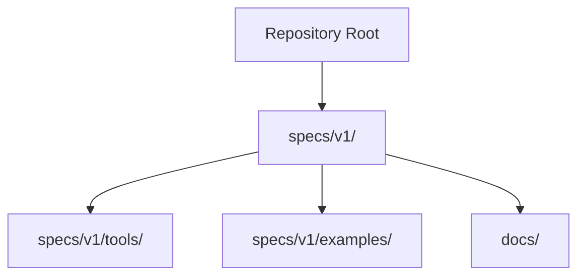
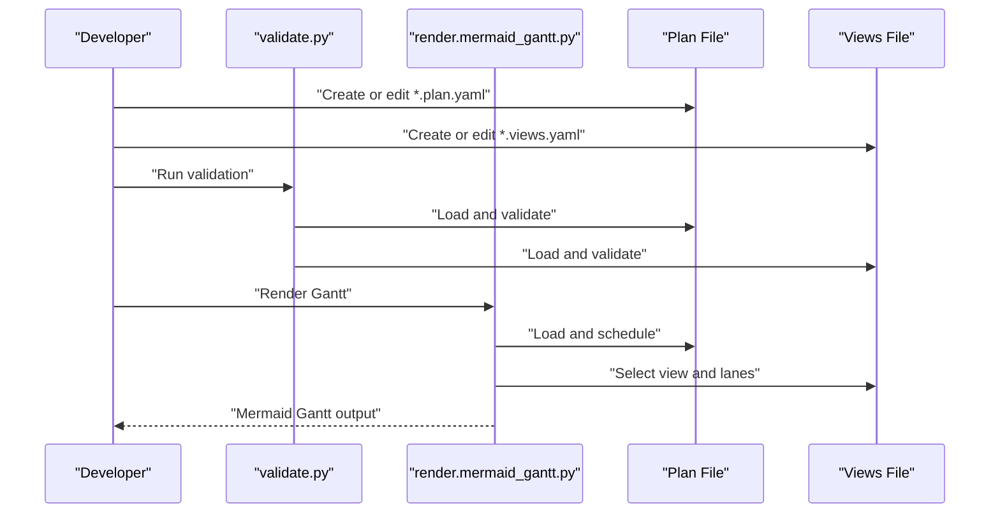
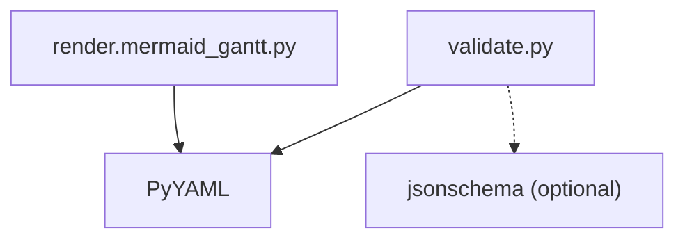

# Getting Started

<cite>
**Referenced Files in This Document**
- [README.md](file://README.md)
- [specs/v1/README.md](file://specs/v1/README.md)
- [specs/v1/tools/README.md](file://specs/v1/tools/README.md)
- [specs/v1/tools/requirements.txt](file://specs/v1/tools/requirements.txt)
- [specs/v1/tools/validate.py](file://specs/v1/tools/validate.py)
- [specs/v1/tools/render/mermaid_gantt.py](file://specs/v1/tools/render/mermaid_gantt.py)
- [specs/v1/examples/hello/README.md](file://specs/v1/examples/hello/README.md)
- [specs/v1/examples/hello/hello.plan.yaml](file://specs/v1/examples/hello/hello.plan.yaml)
- [specs/v1/examples/hello/hello.views.yaml](file://specs/v1/examples/hello/hello.views.yaml)
- [specs/v1/examples/minimal/project.plan.yaml](file://specs/v1/examples/minimal/project.plan.yaml)
- [specs/v1/schemas/plan.schema.json](file://specs/v1/schemas/plan.schema.json)
- [specs/v1/schemas/views.schema.json](file://specs/v1/schemas/views.schema.json)
- [specs/v1/SPEC.md](file://specs/v1/SPEC.md)
</cite>

## Table of Contents
1. [Introduction](#introduction)
2. [Project Structure](#project-structure)
3. [Core Components](#core-components)
4. [Architecture Overview](#architecture-overview)
5. [Detailed Component Analysis](#detailed-component-analysis)
6. [Dependency Analysis](#dependency-analysis)
7. [Performance Considerations](#performance-considerations)
8. [Troubleshooting Guide](#troubleshooting-guide)
9. [Conclusion](#conclusion)
10. [Appendices](#appendices)

## Introduction
Opskarta is a plan-as-code format for operational maps. It defines a YAML/JSON artifact that captures the structure of work and dependencies, enabling you to generate multiple views (Gantt charts, dependency graphs, reports, and more) from a single source of truth. This guide helps you quickly install prerequisites, validate your first plan, and render a Gantt chart using the included tools.

## Project Structure
At a high level, the repository provides:
- A specification and examples under specs/v1/
- Reference tools for validation and rendering under specs/v1/tools/
- Example plan and views files under specs/v1/examples/

**Diagram sources**
- [README.md](file://README.md#L1-L96)
- [specs/v1/README.md](file://specs/v1/README.md#L1-L27)

**Section sources**
- [README.md](file://README.md#L1-L96)
- [specs/v1/README.md](file://specs/v1/README.md#L1-L27)

## Core Components
- Plan file (.plan.yaml): Defines the operational map with version, metadata, statuses, and nodes.
- Views file (.views.yaml): Defines how to render the plan (e.g., Gantt tracks).
- Validation tool: Validates plan and views for syntax, schema, and semantics.
- Rendering tool: Generates Mermaid Gantt output from a selected view.

Key capabilities:
- Hierarchical nodes (programs, projects, tasks)
- Flexible status system
- Scheduling with dependencies (after) and durations
- Multiple views from a single plan
- Extensibility via custom fields

**Section sources**
- [specs/v1/README.md](file://specs/v1/README.md#L10-L16)
- [specs/v1/tools/README.md](file://specs/v1/tools/README.md#L12-L126)
- [specs/v1/SPEC.md](file://specs/v1/SPEC.md#L17-L23)

## Architecture Overview
The typical workflow is:
- Author a plan file
- Optionally author a views file
- Validate both files
- Render a Gantt view to Mermaid

**Diagram sources**
- [specs/v1/tools/validate.py](file://specs/v1/tools/validate.py#L634-L752)
- [specs/v1/tools/render/mermaid_gantt.py](file://specs/v1/tools/render/mermaid_gantt.py#L439-L549)

## Detailed Component Analysis

### Installation and Environment Setup
- Install Python dependencies for the reference tools:
  - PyYAML is required for parsing YAML files.
  - Optional: jsonschema for schema-level validation.
- Install dependencies using the provided requirements file.

Step-by-step:
1. Navigate to the tools directory.
2. Install dependencies with pip using the requirements file.
3. Verify installation by running the tools help or a quick validation.

Verification steps:
- Run the validation tool against the hello example to confirm it works.
- Run the renderer to produce a Gantt output.

**Section sources**
- [specs/v1/tools/README.md](file://specs/v1/tools/README.md#L6-L11)
- [specs/v1/tools/requirements.txt](file://specs/v1/tools/requirements.txt#L1-L10)
- [specs/v1/tools/README.md](file://specs/v1/tools/README.md#L108-L126)

### Creating Your First Plan File
- Start with the minimal example plan to learn the structure.
- Extend it with statuses and nodes to reflect your work.
- Use the hello example as a reference for structure and fields.

Fields to include:
- version: integer
- meta: id and title
- statuses: define your status keys with label and color
- nodes: define hierarchical nodes with title, kind, status, parent, after, start, duration, and notes

Tips:
- Use kind to distinguish summary, phase, epic, user_story, task.
- Use parent to build hierarchy.
- Use after to express dependencies.
- Use start and duration for scheduling.

**Section sources**
- [specs/v1/examples/minimal/project.plan.yaml](file://specs/v1/examples/minimal/project.plan.yaml#L1-L6)
- [specs/v1/examples/hello/hello.plan.yaml](file://specs/v1/examples/hello/hello.plan.yaml#L1-L44)
- [specs/v1/SPEC.md](file://specs/v1/SPEC.md#L27-L56)
- [specs/v1/SPEC.md](file://specs/v1/SPEC.md#L59-L95)

### Creating Your First Views File
- Define version and project matching the plan’s meta.id.
- Define gantt_views with at least one view.
- Define lanes with titles and lists of node IDs to include.

Example structure:
- version: integer
- project: string matching plan meta.id
- gantt_views: map of views
  - title: string
  - excludes: list (e.g., weekends)
  - lanes: map of lanes
    - title: string
    - nodes: list of node IDs

**Section sources**
- [specs/v1/examples/hello/hello.views.yaml](file://specs/v1/examples/hello/hello.views.yaml#L1-L13)
- [specs/v1/SPEC.md](file://specs/v1/SPEC.md#L98-L131)

### Validating Your Files
Two levels of validation are supported:
- Syntax: YAML/JSON correctness
- Schema: JSON Schema compliance (optional)
- Semantics: cross-references and business rules (always enabled)

Common checks:
- Required fields (version, nodes, title)
- References integrity (parent, after, status)
- No cycles in parent or after
- Date format (YYYY-MM-DD) and duration format (<number>d or <number>w)
- Project ID matching meta.id

How to run:
- From specs/v1, run the validator with your plan and views files.
- Optionally enable schema validation with a flag.

Expected outputs:
- Success messages indicating validation completion
- Warnings for unsupported version or other non-fatal issues

**Section sources**
- [specs/v1/tools/README.md](file://specs/v1/tools/README.md#L14-L47)
- [specs/v1/tools/validate.py](file://specs/v1/tools/validate.py#L10-L16)
- [specs/v1/tools/validate.py](file://specs/v1/tools/validate.py#L135-L329)
- [specs/v1/tools/validate.py](file://specs/v1/tools/validate.py#L431-L579)
- [specs/v1/schemas/plan.schema.json](file://specs/v1/schemas/plan.schema.json#L1-L86)
- [specs/v1/schemas/views.schema.json](file://specs/v1/schemas/views.schema.json#L1-L26)

### Rendering a Gantt Diagram
- Select a view from your views file.
- Run the renderer to produce a Mermaid Gantt diagram.
- Save to a file or pipe to stdout.

Options:
- --plan: path to plan file
- --views: path to views file
- --view: name of the view to render
- --output: optional output file path
- --list-views: list available views

Expected outputs:
- A fenced Mermaid block suitable for Markdown viewers or Mermaid-compatible renderers
- Color-coded tasks based on statuses
- Exclusions like weekends if configured

**Section sources**
- [specs/v1/tools/README.md](file://specs/v1/tools/README.md#L69-L92)
- [specs/v1/tools/README.md](file://specs/v1/tools/README.md#L73-L84)
- [specs/v1/tools/render/mermaid_gantt.py](file://specs/v1/tools/render/mermaid_gantt.py#L439-L549)

### Step-by-Step: Hello World Example
Follow these steps to validate and render the hello example:

1. Change to the specs/v1 directory.
2. Install dependencies using the requirements file.
3. Validate the hello plan and views:
   - python tools/validate.py examples/hello/hello.plan.yaml examples/hello/hello.views.yaml
4. Render the Gantt:
   - python -m tools.render.mermaid_gantt --plan examples/hello/hello.plan.yaml --views examples/hello/hello.views.yaml --view overview

What to expect:
- Validation completes successfully with no errors
- Gantt output appears in the terminal or saved to a file if you specify --output

**Section sources**
- [README.md](file://README.md#L68-L84)
- [specs/v1/examples/hello/README.md](file://specs/v1/examples/hello/README.md#L28-L46)
- [specs/v1/tools/README.md](file://specs/v1/tools/README.md#L108-L126)

## Dependency Analysis
The tools depend on:
- PyYAML for loading YAML files
- Optional jsonschema for schema validation

**Diagram sources**
- [specs/v1/tools/requirements.txt](file://specs/v1/tools/requirements.txt#L5-L9)
- [specs/v1/tools/validate.py](file://specs/v1/tools/validate.py#L77-L81)
- [specs/v1/tools/render/mermaid_gantt.py](file://specs/v1/tools/render/mermaid_gantt.py#L62-L67)

**Section sources**
- [specs/v1/tools/requirements.txt](file://specs/v1/tools/requirements.txt#L1-L10)
- [specs/v1/tools/validate.py](file://specs/v1/tools/validate.py#L77-L81)
- [specs/v1/tools/render/mermaid_gantt.py](file://specs/v1/tools/render/mermaid_gantt.py#L62-L67)

## Performance Considerations
- Validation runs quickly on small to medium plans.
- Rendering scales linearly with the number of nodes and lanes.
- Using schema validation adds overhead but improves correctness.

## Troubleshooting Guide
Common issues and resolutions:

- Missing PyYAML:
  - Symptom: Import error when running tools.
  - Fix: Install PyYAML using pip.

- Missing jsonschema (optional):
  - Symptom: Error when using schema validation.
  - Fix: Install jsonschema or run without the schema flag.

- File not found:
  - Symptom: Error indicating a missing plan or views file.
  - Fix: Ensure paths are correct and files exist.

- YAML parsing errors:
  - Symptom: Error about invalid YAML.
  - Fix: Check indentation and syntax; validate with a YAML linter.

- Schema mismatch:
  - Symptom: JSON Schema validation fails.
  - Fix: Align fields with the provided schemas; ensure required fields are present.

- Semantic validation failures:
  - Parent or status references not found:
    - Fix: Ensure parent IDs and status keys exist in nodes and statuses.
  - Cyclic dependencies:
    - Fix: Remove cycles in parent or after links.
  - Incorrect date or duration formats:
    - Fix: Use YYYY-MM-DD for dates and <number>d or <number>w for durations.

- Rendering errors:
  - View not found:
    - Fix: Use --list-views to see available views and select the correct one.
  - Nodes not found in plan:
    - Fix: Ensure lane node IDs exist in the plan.

Verification steps:
- Re-run validation after fixing issues.
- Confirm the hello example still works after changes.

**Section sources**
- [specs/v1/tools/validate.py](file://specs/v1/tools/validate.py#L77-L111)
- [specs/v1/tools/validate.py](file://specs/v1/tools/validate.py#L230-L329)
- [specs/v1/tools/validate.py](file://specs/v1/tools/validate.py#L446-L579)
- [specs/v1/tools/render/mermaid_gantt.py](file://specs/v1/tools/render/mermaid_gantt.py#L69-L85)
- [specs/v1/tools/render/mermaid_gantt.py](file://specs/v1/tools/render/mermaid_gantt.py#L510-L524)

## Conclusion
You now have the essentials to install the tools, create and validate your first plan and views, and render a Gantt diagram. Use the hello example as a template, extend it with your own statuses and nodes, and iterate with validation and rendering until your operational map is ready.

## Appendices

### File Formats and Basic Syntax
- Serialization: YAML (recommended) or JSON
- Versioning: version field at the root
- Node IDs: string keys in nodes
- Statuses: arbitrary keys with label and color
- Nodes: title is required; kind, status, parent, after, start, duration, issue, notes are optional
- Views: version and project required; gantt_views optional; lanes require titles and node lists

**Section sources**
- [specs/v1/SPEC.md](file://specs/v1/SPEC.md#L17-L23)
- [specs/v1/SPEC.md](file://specs/v1/SPEC.md#L27-L56)
- [specs/v1/SPEC.md](file://specs/v1/SPEC.md#L59-L95)
- [specs/v1/SPEC.md](file://specs/v1/SPEC.md#L98-L131)
- [specs/v1/SPEC.md](file://specs/v1/SPEC.md#L134-L156)
- [specs/v1/SPEC.md](file://specs/v1/SPEC.md#L159-L238)

### Example Files
- Minimal plan: [project.plan.yaml](file://specs/v1/examples/minimal/project.plan.yaml#L1-L6)
- Hello plan: [hello.plan.yaml](file://specs/v1/examples/hello/hello.plan.yaml#L1-L44)
- Hello views: [hello.views.yaml](file://specs/v1/examples/hello/hello.views.yaml#L1-L13)

**Section sources**
- [specs/v1/examples/minimal/project.plan.yaml](file://specs/v1/examples/minimal/project.plan.yaml#L1-L6)
- [specs/v1/examples/hello/hello.plan.yaml](file://specs/v1/examples/hello/hello.plan.yaml#L1-L44)
- [specs/v1/examples/hello/hello.views.yaml](file://specs/v1/examples/hello/hello.views.yaml#L1-L13)

### Command-Line Usage Summary
- Install dependencies:
  - pip install -r specs/v1/tools/requirements.txt
- Validate:
  - python tools/validate.py plan.yaml views.yaml
  - python tools/validate.py --schema plan.yaml
- Render:
  - python -m tools.render.mermaid_gantt --plan plan.yaml --views views.yaml --view overview
  - python -m tools.render.mermaid_gantt --plan plan.yaml --views views.yaml --view overview --output gantt.md
  - python -m tools.render.mermaid_gantt --plan plan.yaml --views views.yaml --list-views

**Section sources**
- [specs/v1/tools/README.md](file://specs/v1/tools/README.md#L18-L32)
- [specs/v1/tools/README.md](file://specs/v1/tools/README.md#L73-L84)
- [specs/v1/tools/README.md](file://specs/v1/tools/README.md#L108-L126)