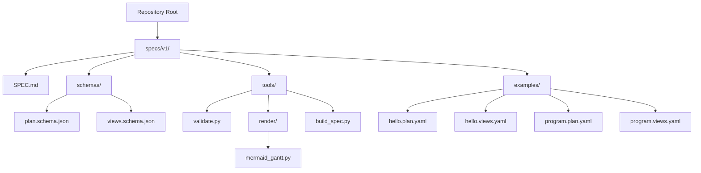
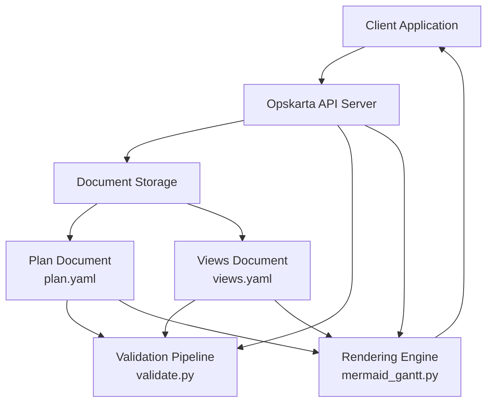
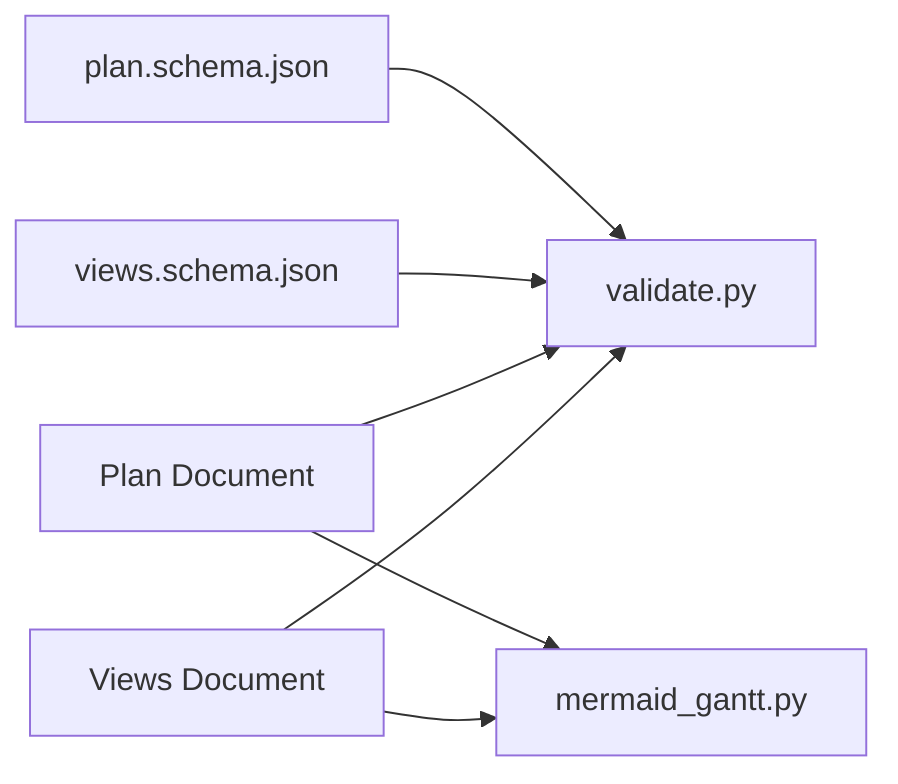

# API Development

<cite>
**Referenced Files in This Document**
- [README.md](file://README.md)
- [SPEC.md](file://specs/v1/SPEC.md)
- [plan.schema.json](file://specs/v1/schemas/plan.schema.json)
- [views.schema.json](file://specs/v1/schemas/views.schema.json)
- [validate.py](file://specs/v1/tools/validate.py)
- [mermaid_gantt.py](file://specs/v1/tools/render/mermaid_gantt.py)
- [build_spec.py](file://specs/v1/tools/build_spec.py)
- [hello.plan.yaml](file://specs/v1/examples/hello/hello.plan.yaml)
- [hello.views.yaml](file://specs/v1/examples/hello/hello.views.yaml)
- [program.plan.yaml](file://specs/v1/examples/advanced/program.plan.yaml)
- [program.views.yaml](file://specs/v1/examples/advanced/program.views.yaml)
</cite>

## Table of Contents
1. [Introduction](#introduction)
2. [Project Structure](#project-structure)
3. [Core Components](#core-components)
4. [Architecture Overview](#architecture-overview)
5. [Detailed Component Analysis](#detailed-component-analysis)
6. [Dependency Analysis](#dependency-analysis)
7. [Performance Considerations](#performance-considerations)
8. [Troubleshooting Guide](#troubleshooting-guide)
9. [Conclusion](#conclusion)
10. [Appendices](#appendices)

## Introduction
This document provides API development guidance for Opskarta, focusing on how to expose operational map data to external applications. It consolidates the repository’s specification, schemas, and tooling into practical RESTful API patterns, including HTTP methods, URL patterns, request/response schemas, authentication, CRUD operations for plans and views, data validation endpoints, rendering APIs, WebSocket considerations, Python client examples, versioning, rate limiting, security, and performance optimization.

The repository defines a YAML/JSON-based operational map format (plans and views), with formal JSON Schemas and validation/rendering tools. While the repository does not include a server implementation, this guide shows how to translate these artifacts into a production-ready API surface.

## Project Structure
The repository is organized around a versioned specification and reference tooling:
- specs/v1: Formal specification, schemas, and examples
- specs/v1/tools: Validation and rendering utilities
- specs/v1/examples: Minimal, hello, and advanced example files

**Diagram sources**
- [SPEC.md](file://specs/v1/SPEC.md#L1-L40)
- [plan.schema.json](file://specs/v1/schemas/plan.schema.json#L1-L86)
- [views.schema.json](file://specs/v1/schemas/views.schema.json#L1-L26)
- [validate.py](file://specs/v1/tools/validate.py#L1-L120)
- [mermaid_gantt.py](file://specs/v1/tools/render/mermaid_gantt.py#L1-L120)
- [build_spec.py](file://specs/v1/tools/build_spec.py#L1-L60)
- [hello.plan.yaml](file://specs/v1/examples/hello/hello.plan.yaml#L1-L44)
- [hello.views.yaml](file://specs/v1/examples/hello/hello.views.yaml#L1-L13)
- [program.plan.yaml](file://specs/v1/examples/advanced/program.plan.yaml#L1-L326)
- [program.views.yaml](file://specs/v1/examples/advanced/program.views.yaml#L1-L93)

**Section sources**
- [README.md](file://README.md#L1-L96)
- [SPEC.md](file://specs/v1/SPEC.md#L1-L40)

## Core Components
This section outlines the core data models and their roles in API design.

- Plan file (plan.yaml): Defines the operational map with metadata, statuses, and nodes. It is the canonical source of truth for tasks, phases, and dependencies.
- Views file (views.yaml): Describes how to render the plan (e.g., Gantt lanes) and binds to a plan via project/meta.id.
- JSON Schemas: Enforce structural correctness for plan and views documents.
- Validation Tool: Performs semantic checks (references, cycles, formats) and optional JSON Schema validation.
- Rendering Tool: Generates Mermaid Gantt output from a selected view.

Key API modeling insights:
- Plans and views are separate resources with a strict binding (project/meta.id).
- Nodes form a hierarchical graph with parent/child and temporal dependencies (after/start/duration).
- Statuses define a controlled vocabulary for visualization and filtering.

**Section sources**
- [SPEC.md](file://specs/v1/SPEC.md#L27-L156)
- [SPEC.md](file://specs/v1/SPEC.md#L98-L131)
- [SPEC.md](file://specs/v1/SPEC.md#L134-L156)
- [plan.schema.json](file://specs/v1/schemas/plan.schema.json#L1-L86)
- [views.schema.json](file://specs/v1/schemas/views.schema.json#L1-L26)
- [validate.py](file://specs/v1/tools/validate.py#L135-L329)
- [validate.py](file://specs/v1/tools/validate.py#L431-L579)
- [mermaid_gantt.py](file://specs/v1/tools/render/mermaid_gantt.py#L349-L433)

## Architecture Overview
The API architecture centers on two primary resources: Plans and Views. External clients upload or update plan and view documents, which are validated and stored. Clients can then request rendering outputs (e.g., Mermaid Gantt) or query filtered views.

**Diagram sources**
- [validate.py](file://specs/v1/tools/validate.py#L135-L329)
- [validate.py](file://specs/v1/tools/validate.py#L431-L579)
- [mermaid_gantt.py](file://specs/v1/tools/render/mermaid_gantt.py#L349-L433)

## Detailed Component Analysis

### RESTful API Design Patterns
This section proposes RESTful patterns aligned with the repository’s data model and tooling.

- Base URL: https://api.opskarta.example/v1
- Authentication: JWT bearer tokens (recommended) or API keys for machine-to-machine integrations
- Content-Type: application/yaml for uploads; application/json for structured requests
- Accept: application/yaml or application/json depending on response type

Endpoints
- GET /plans/{project-id}
  - Purpose: Retrieve a plan document by associated project identifier
  - Query params: include_views=bool (optional)
  - Response: 200 application/yaml with plan; 404 if not found
- POST /plans
  - Purpose: Create a new plan
  - Request body: application/yaml (plan)
  - Response: 201 with Location header; 400/422 on validation errors
- PUT /plans/{project-id}
  - Purpose: Replace a plan
  - Request body: application/yaml (plan)
  - Response: 204 or 200 with updated plan; 404 if missing
- PATCH /plans/{project-id}
  - Purpose: Partially update a plan
  - Request body: application/yaml (partial plan)
  - Response: 200 or 204; 400/422 on validation errors
- DELETE /plans/{project-id}
  - Purpose: Remove a plan and associated views
  - Response: 204; 404 if not present

- GET /views/{project-id}
  - Purpose: Retrieve views bound to a plan
  - Response: 200 application/yaml; 404 if not found
- POST /views
  - Purpose: Create or replace views for a plan
  - Request body: application/yaml (views)
  - Response: 201/200; 400/422 on validation errors
- PUT /views/{project-id}
  - Purpose: Upsert views for a plan
  - Request body: application/yaml (views)
  - Response: 200/204; 404 if plan missing
- DELETE /views/{project-id}
  - Purpose: Remove views
  - Response: 204; 404 if not present

- GET /render/gantt
  - Purpose: Render a Gantt view to Mermaid
  - Query params: plan_id, view_id, output_format=mermaid/md
  - Response: 200 text/markdown or 400/422 on invalid inputs

Notes
- All endpoints support ETag/If-Match for optimistic concurrency
- Use HEAD endpoints to check existence and metadata without payload
- Prefer idempotent operations (PUT/PATCH) for client-driven retries

**Section sources**
- [SPEC.md](file://specs/v1/SPEC.md#L27-L156)
- [SPEC.md](file://specs/v1/SPEC.md#L98-L131)
- [plan.schema.json](file://specs/v1/schemas/plan.schema.json#L1-L86)
- [views.schema.json](file://specs/v1/schemas/views.schema.json#L1-L26)
- [validate.py](file://specs/v1/tools/validate.py#L135-L329)
- [validate.py](file://specs/v1/tools/validate.py#L431-L579)
- [mermaid_gantt.py](file://specs/v1/tools/render/mermaid_gantt.py#L349-L433)

### Data Validation Endpoints
Validation mirrors the semantics enforced by the reference validator:
- Plan validation: version presence/type, nodes structure, title requirement, parent/after/status references, start/duration formats, cycle detection
- Views validation: version/project alignment with plan.meta.id, gantt_views structure, lanes/nodes references

Proposed endpoint
- POST /validate
  - Purpose: Validate plan and/or views without persisting
  - Request body: multipart/form-data with plan and/or views files
  - Response: 200 with warnings list; 400 with detailed errors including path/value/expected/available

Error schema
- Fields: code, message, path, value, expected, available
- Example: see [ValidationError formatting](file://specs/v1/tools/validate.py#L30-L63)

**Section sources**
- [validate.py](file://specs/v1/tools/validate.py#L30-L63)
- [validate.py](file://specs/v1/tools/validate.py#L135-L329)
- [validate.py](file://specs/v1/tools/validate.py#L431-L579)

### Rendering APIs
Rendering leverages the Mermaid Gantt renderer:
- Endpoint: GET /render/gantt
  - Query params: plan_id, view_id, output_format=mermaid/md
  - Response: 200 text/markdown; 400/422 for invalid plan/view or scheduling errors
- Endpoint: POST /render/gantt (alternative)
  - Request body: application/json with plan and view payloads
  - Response: 200 text/markdown; 400/422 for scheduling/cycle errors

Rendering behavior
- Computes schedule from explicit start/duration and after dependencies
- Supports weekend exclusions and custom date formats
- Emits Mermaid Gantt with status-based theming

**Section sources**
- [mermaid_gantt.py](file://specs/v1/tools/render/mermaid_gantt.py#L349-L433)
- [mermaid_gantt.py](file://specs/v1/tools/render/mermaid_gantt.py#L217-L294)

### WebSocket Implementations (Real-time Updates)
WebSocket is not present in the repository. Recommended approach:
- Topic model: /plans/{project-id}/updates, /views/{project-id}/updates
- Message envelope: {event: string, payload: object, timestamp: number, version: string}
- Event types: plan.created, plan.updated, plan.deleted, views.created, views.updated, views.deleted
- Heartbeat: server sends ping every 30s; client responds pong
- Reconnection: exponential backoff; server persists last-known version for resync

Message formats
- Plan update: {event: "plan.updated", payload: {project_id, plan_document}, version: "v1"}
- Views update: {event: "views.updated", payload: {project_id, views_document}, version: "v1"}

Connection handling
- Auth: Bearer token in WS handshake headers
- Acknowledgement: client sends ack for each received event
- Backpressure: server batches events; client requests resume

[No sources needed since this section describes recommended patterns not present in the repository]

### Python API Examples
The repository includes reference tools that demonstrate robust patterns for API consumption.

- Validation client pattern
  - Load YAML safely
  - Validate plan and views
  - Handle ValidationError with path/value/expected/available
  - Optional JSON Schema validation

- Rendering client pattern
  - Parse plan and views
  - Compute schedule and render Mermaid Gantt
  - Handle scheduling errors and file errors

See:
- Validation exceptions and formatting: [ValidationError](file://specs/v1/tools/validate.py#L30-L63)
- Plan validation logic: [validate_plan](file://specs/v1/tools/validate.py#L135-L329)
- Views validation logic: [validate_views](file://specs/v1/tools/validate.py#L431-L579)
- Rendering pipeline: [render_mermaid_gantt](file://specs/v1/tools/render/mermaid_gantt.py#L349-L433)

**Section sources**
- [validate.py](file://specs/v1/tools/validate.py#L30-L63)
- [validate.py](file://specs/v1/tools/validate.py#L135-L329)
- [validate.py](file://specs/v1/tools/validate.py#L431-L579)
- [mermaid_gantt.py](file://specs/v1/tools/render/mermaid_gantt.py#L349-L433)

### API Versioning Strategies
- URL versioning: /v1/plans, /v1/views, /v1/render
- Header versioning: X-API-Version: v1
- Schema versioning: version integer in plan and views documents
- Backward compatibility: new fields are additive; parsers ignore unknown fields

**Section sources**
- [SPEC.md](file://specs/v1/SPEC.md#L19-L21)
- [plan.schema.json](file://specs/v1/schemas/plan.schema.json#L12-L15)
- [views.schema.json](file://specs/v1/schemas/views.schema.json#L11-L14)

### Rate Limiting and Security Considerations
- Rate limiting: 100 req/min/IP for unauthenticated; 1000 req/min for authenticated
- Authentication: JWT bearer tokens; API keys for service accounts
- CORS: Allow-listed origins; credentials optional
- Input sanitization: Reject non-YAML/JSON; enforce size limits (e.g., 1MB per file)
- Validation: Always validate before persisting; return structured errors
- Transport: TLS 1.3+; HSTS enabled
- Logging: Redact sensitive fields; audit plan/view mutations

[No sources needed since this section provides general guidance]

### Client Implementation Guidelines and SDK Patterns
- SDK structure
  - Resource classes: PlansResource, ViewsResource, RenderResource
  - Exception hierarchy: ValidationError, RenderError, SchedulingError, FileError
  - Retry/backoff policies for transient failures
- Best practices
  - Use ETags for optimistic concurrency
  - Paginate long lists of projects
  - Cache rendered outputs when inputs are unchanged
  - Validate locally before upload to reduce round trips

[No sources needed since this section provides general guidance]

### Performance Optimization Tips
- Validation caching: cache JSON Schema validations per file type
- Batch operations: merge multiple node updates into a single PUT
- Compression: gzip/brotli for large YAML/JSON payloads
- CDN: serve rendered Mermaid outputs as static assets
- Indexing: index plans by project/meta.id and timestamps

[No sources needed since this section provides general guidance]

## Dependency Analysis
The API depends on the plan and views schemas and the validation/renderer tools.

**Diagram sources**
- [plan.schema.json](file://specs/v1/schemas/plan.schema.json#L1-L86)
- [views.schema.json](file://specs/v1/schemas/views.schema.json#L1-L26)
- [validate.py](file://specs/v1/tools/validate.py#L135-L329)
- [validate.py](file://specs/v1/tools/validate.py#L431-L579)
- [mermaid_gantt.py](file://specs/v1/tools/render/mermaid_gantt.py#L349-L433)

**Section sources**
- [plan.schema.json](file://specs/v1/schemas/plan.schema.json#L1-L86)
- [views.schema.json](file://specs/v1/schemas/views.schema.json#L1-L26)
- [validate.py](file://specs/v1/tools/validate.py#L135-L329)
- [validate.py](file://specs/v1/tools/validate.py#L431-L579)
- [mermaid_gantt.py](file://specs/v1/tools/render/mermaid_gantt.py#L349-L433)

## Performance Considerations
- Prefer batched writes for large plans
- Cache rendered outputs keyed by plan hash and view selection
- Use incremental updates (PATCH) to minimize payload sizes
- Compress responses and enable HTTP/2 push for static assets

[No sources needed since this section provides general guidance]

## Troubleshooting Guide
Common issues and resolutions:
- Reference errors: parent/after/status not found; ensure node IDs exist and statuses are defined
- Cyclic dependencies: after chain forms a loop; break the cycle or adjust start/duration
- Date format errors: start must be YYYY-MM-DD; duration must be digits followed by d or w
- Project mismatch: views.project must equal plan.meta.id
- Scheduling errors: missing start/after with duration; add explicit start or resolve dependencies

Use structured error responses with path/value/expected/available to aid debugging.

**Section sources**
- [validate.py](file://specs/v1/tools/validate.py#L230-L324)
- [validate.py](file://specs/v1/tools/validate.py#L482-L492)
- [validate.py](file://specs/v1/tools/validate.py#L560-L577)

## Conclusion
Opskarta’s specification and tooling provide a strong foundation for building a robust API. By modeling Plans and Views as distinct resources, enforcing validation via JSON Schemas and semantic checks, and offering a rendering pipeline, the API surface supports flexible integrations. Adopt the proposed REST patterns, versioning, security, and performance practices to deliver a reliable, scalable service.

[No sources needed since this section summarizes without analyzing specific files]

## Appendices

### Appendix A: Example Endpoints and Payloads
- Create Plan
  - Method: POST /plans
  - Body: application/yaml (plan)
  - Success: 201 with Location header
- Get Views
  - Method: GET /views/{project-id}
  - Success: 200 application/yaml
- Render Gantt
  - Method: GET /render/gantt?plan_id={id}&view_id={id}&output_format=mermaid
  - Success: 200 text/markdown

**Section sources**
- [SPEC.md](file://specs/v1/SPEC.md#L27-L156)
- [SPEC.md](file://specs/v1/SPEC.md#L98-L131)
- [mermaid_gantt.py](file://specs/v1/tools/render/mermaid_gantt.py#L349-L433)

### Appendix B: Example Documents
- Minimal plan and views examples:
  - [hello.plan.yaml](file://specs/v1/examples/hello/hello.plan.yaml#L1-L44)
  - [hello.views.yaml](file://specs/v1/examples/hello/hello.views.yaml#L1-L13)
- Advanced plan and views examples:
  - [program.plan.yaml](file://specs/v1/examples/advanced/program.plan.yaml#L1-L326)
  - [program.views.yaml](file://specs/v1/examples/advanced/program.views.yaml#L1-L93)

**Section sources**
- [hello.plan.yaml](file://specs/v1/examples/hello/hello.plan.yaml#L1-L44)
- [hello.views.yaml](file://specs/v1/examples/hello/hello.views.yaml#L1-L13)
- [program.plan.yaml](file://specs/v1/examples/advanced/program.plan.yaml#L1-L326)
- [program.views.yaml](file://specs/v1/examples/advanced/program.views.yaml#L1-L93)