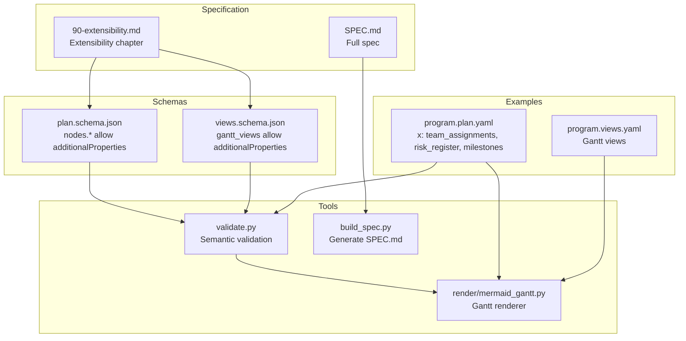
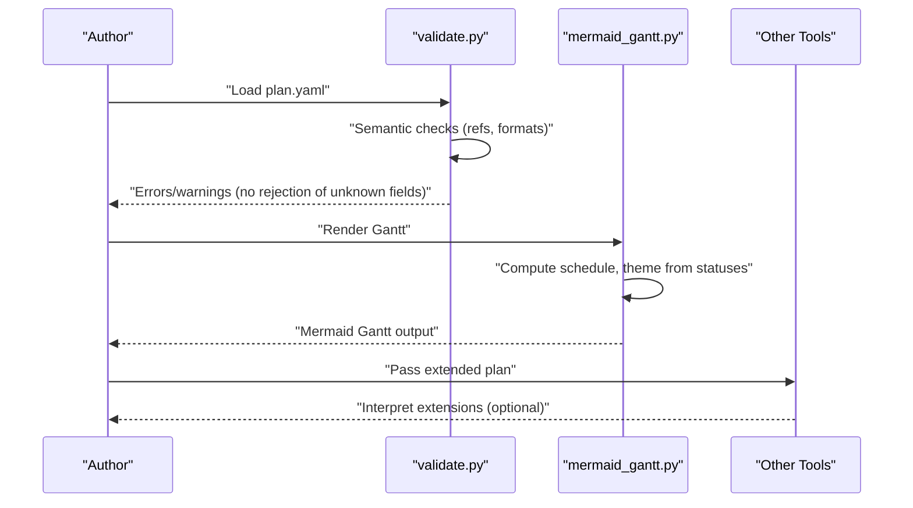
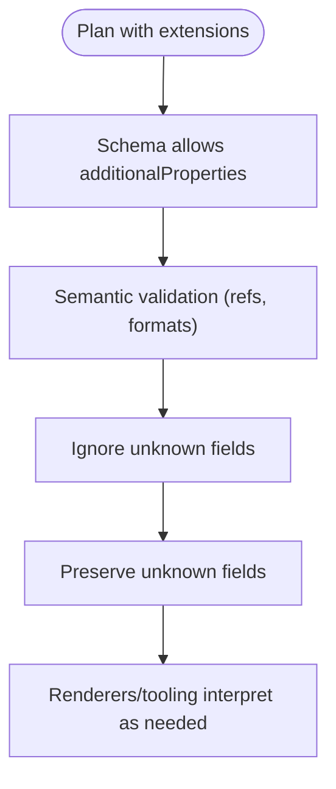
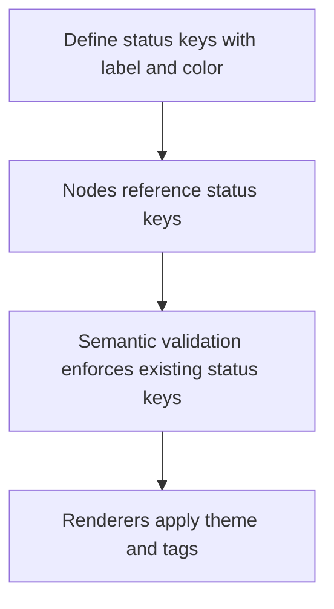
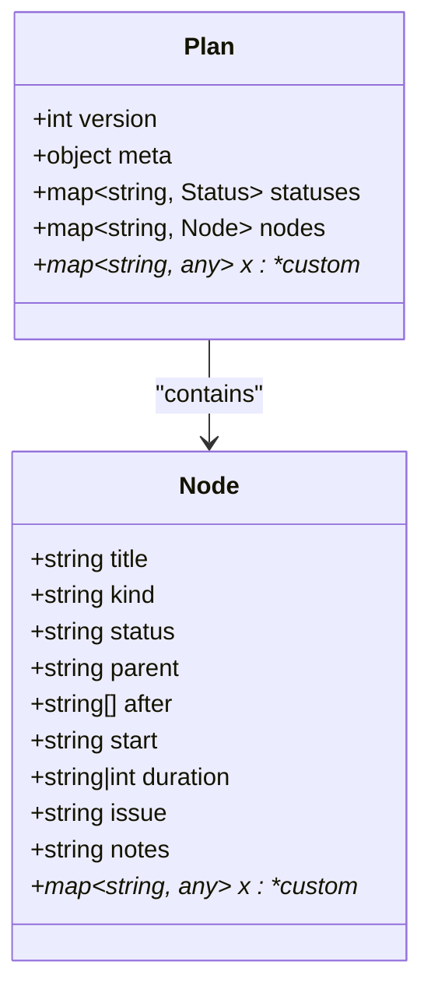
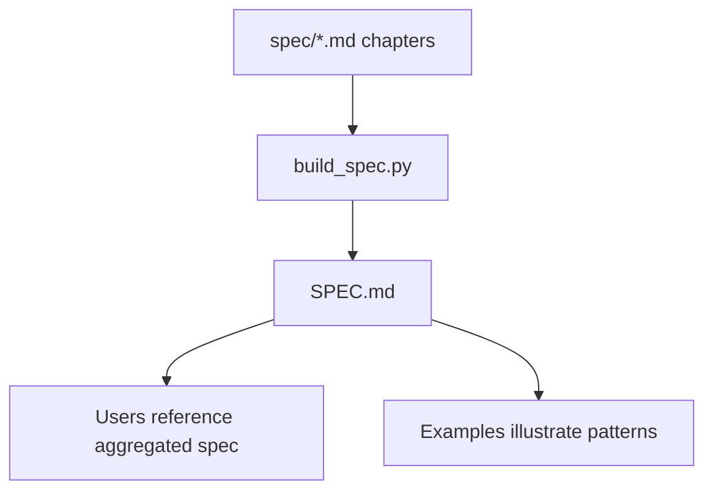
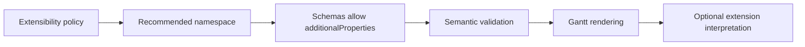

# Extension Mechanisms

<cite>
**Referenced Files in This Document**
- [SPEC.md](file://specs/v1/SPEC.md)
- [90-extensibility.md](file://specs/v1/spec/90-extensibility.md)
- [plan.schema.json](file://specs/v1/schemas/plan.schema.json)
- [views.schema.json](file://specs/v1/schemas/views.schema.json)
- [validate.py](file://specs/v1/tools/validate.py)
- [mermaid_gantt.py](file://specs/v1/tools/render/mermaid_gantt.py)
- [program.plan.yaml](file://specs/v1/examples/advanced/program.plan.yaml)
- [program.views.yaml](file://specs/v1/examples/advanced/program.views.yaml)
- [examples README](file://specs/v1/examples/README.md)
- [build_spec.py](file://specs/v1/tools/build_spec.py)
- [CONTRIBUTING.md](file://CONTRIBUTING.md)
</cite>

## Table of Contents
1. [Introduction](#introduction)
2. [Project Structure](#project-structure)
3. [Core Components](#core-components)
4. [Architecture Overview](#architecture-overview)
5. [Detailed Component Analysis](#detailed-component-analysis)
6. [Dependency Analysis](#dependency-analysis)
7. [Performance Considerations](#performance-considerations)
8. [Troubleshooting Guide](#troubleshooting-guide)
9. [Conclusion](#conclusion)
10. [Appendices](#appendices)

## Introduction
This document explains how to extend Opskarta’s operational map format safely and compatibly. It focuses on the extension field system using the reserved top-level namespace for custom properties and how to evolve node-level metadata without breaking existing tooling. You will learn:
- How to define custom status semantics and domain-specific metadata
- How to extend node properties beyond the core specification
- Validation rules, naming conventions, and backward compatibility guarantees
- Popular extension patterns (risk indicators, resource allocation, custom workflow markers)
- Extension discovery, documentation generation, and community contribution guidelines
- Best practices for seamless integration with existing operational maps

## Project Structure
The extension mechanism is defined across the specification, schemas, and examples:
- Specification chapters describe the extensibility policy and recommended namespaces
- JSON Schemas declare optional and additional properties
- Tools enforce validation and render Gantt diagrams
- Examples demonstrate real-world extension patterns

**Diagram sources**
- [SPEC.md](file://specs/v1/SPEC.md#L383-L407)
- [90-extensibility.md](file://specs/v1/spec/90-extensibility.md#L1-L26)
- [plan.schema.json](file://specs/v1/schemas/plan.schema.json#L38-L82)
- [views.schema.json](file://specs/v1/schemas/views.schema.json#L19-L23)
- [validate.py](file://specs/v1/tools/validate.py#L135-L329)
- [mermaid_gantt.py](file://specs/v1/tools/render/mermaid_gantt.py#L349-L433)
- [program.plan.yaml](file://specs/v1/examples/advanced/program.plan.yaml#L296-L326)
- [program.views.yaml](file://specs/v1/examples/advanced/program.views.yaml#L1-L93)
- [build_spec.py](file://specs/v1/tools/build_spec.py#L1-L240)

**Section sources**
- [SPEC.md](file://specs/v1/SPEC.md#L383-L407)
- [90-extensibility.md](file://specs/v1/spec/90-extensibility.md#L1-L26)
- [plan.schema.json](file://specs/v1/schemas/plan.schema.json#L38-L82)
- [views.schema.json](file://specs/v1/schemas/views.schema.json#L19-L23)
- [examples README](file://specs/v1/examples/README.md#L1-L34)

## Core Components
- Extensibility policy: The format intentionally allows additional fields. Unknown fields must be ignored by base tools and preserved when formatting is involved.
- Recommended namespace: Group user-defined fields under a dedicated top-level key to avoid conflicts when multiple parties extend the format.
- Schema support: Both plan and views schemas permit additional properties, enabling extensions without schema violations.
- Validation behavior: The semantic validator checks core references and formats but does not reject unknown fields; unknown fields are not enforced by schema unless explicitly declared.

Key references:
- Extensibility rule and recommended grouping under a namespace
- Plan and views schemas allowing additional properties
- Tool behavior: unknown fields are preserved and not rejected

**Section sources**
- [90-extensibility.md](file://specs/v1/spec/90-extensibility.md#L5-L11)
- [SPEC.md](file://specs/v1/SPEC.md#L383-L407)
- [plan.schema.json](file://specs/v1/schemas/plan.schema.json#L32-L37)
- [plan.schema.json](file://specs/v1/schemas/plan.schema.json#L80-L82)
- [views.schema.json](file://specs/v1/schemas/views.schema.json#L21-L22)
- [validate.py](file://specs/v1/tools/validate.py#L135-L329)

## Architecture Overview
The extension architecture centers on a layered validation pipeline:
- Base validation ensures core correctness (references, formats)
- Additional properties are allowed and preserved
- Rendering and tooling can interpret extensions at their discretion

**Diagram sources**
- [validate.py](file://specs/v1/tools/validate.py#L135-L329)
- [mermaid_gantt.py](file://specs/v1/tools/render/mermaid_gantt.py#L349-L433)

## Detailed Component Analysis

### Extension Field System and Namespace Strategy
- Policy: Additional fields are permitted; base tools must ignore unknown fields and preserve them when formatting.
- Recommended grouping: Place related custom fields under a single top-level key to reduce collisions and improve discoverability.
- Practical example: The advanced example demonstrates a top-level extension block containing team assignments, a risk register, and milestones.

**Diagram sources**
- [90-extensibility.md](file://specs/v1/spec/90-extensibility.md#L5-L11)
- [plan.schema.json](file://specs/v1/schemas/plan.schema.json#L32-L37)
- [plan.schema.json](file://specs/v1/schemas/plan.schema.json#L80-L82)
- [validate.py](file://specs/v1/tools/validate.py#L135-L329)

**Section sources**
- [90-extensibility.md](file://specs/v1/spec/90-extensibility.md#L12-L25)
- [SPEC.md](file://specs/v1/SPEC.md#L383-L407)
- [program.plan.yaml](file://specs/v1/examples/advanced/program.plan.yaml#L296-L326)

### Defining Custom Status Types
- Status semantics are domain-specific. Define new keys in the statuses dictionary with human-readable labels and colors.
- Nodes can reference any status key present in the statuses map; unknown status keys are invalid per semantic rules.
- Rendering respects status-to-theme mapping and emoji for clarity.

**Diagram sources**
- [SPEC.md](file://specs/v1/SPEC.md#L134-L156)
- [validate.py](file://specs/v1/tools/validate.py#L279-L297)
- [mermaid_gantt.py](file://specs/v1/tools/render/mermaid_gantt.py#L300-L314)

**Section sources**
- [SPEC.md](file://specs/v1/SPEC.md#L134-L156)
- [validate.py](file://specs/v1/tools/validate.py#L279-L297)
- [mermaid_gantt.py](file://specs/v1/tools/render/mermaid_gantt.py#L300-L314)

### Adding Domain-Specific Metadata to Nodes
- Core node fields include title, kind, status, parent, after, start, duration, issue, notes.
- Extensions can augment nodes with additional properties (e.g., tags, owner, risk, links) without schema rejection.
- Unknown fields are preserved and can be consumed by downstream tooling.

**Diagram sources**
- [SPEC.md](file://specs/v1/SPEC.md#L59-L96)
- [plan.schema.json](file://specs/v1/schemas/plan.schema.json#L38-L82)

**Section sources**
- [SPEC.md](file://specs/v1/SPEC.md#L59-L96)
- [plan.schema.json](file://specs/v1/schemas/plan.schema.json#L38-L82)
- [validate.py](file://specs/v1/tools/validate.py#L200-L324)

### Extension Discovery and Documentation
- The specification is built from modular chapters and assembled into a single document. This enables consistent documentation of extension points.
- The examples show practical extension patterns that can serve as templates for new extensions.

**Diagram sources**
- [build_spec.py](file://specs/v1/tools/build_spec.py#L147-L171)
- [SPEC.md](file://specs/v1/SPEC.md#L1-L20)

**Section sources**
- [build_spec.py](file://specs/v1/tools/build_spec.py#L1-L240)
- [SPEC.md](file://specs/v1/SPEC.md#L1-L20)
- [examples README](file://specs/v1/examples/README.md#L1-L34)

### Popular Extension Patterns
- Risk indicators: Maintain a registry of risks with identifiers, descriptions, probabilities, impacts, and mitigations.
- Resource allocation fields: Assign owners or teams to tracks or nodes.
- Custom workflow markers: Add milestone lists or custom status categories.

These patterns appear in the advanced example plan under a top-level extension block.

**Section sources**
- [program.plan.yaml](file://specs/v1/examples/advanced/program.plan.yaml#L296-L326)

### Validation Rules for Extension Fields
- Unknown fields are not rejected by schema; semantic validation does not enforce presence of unknown fields.
- Unknown fields are preserved during parsing and emission when formatting is involved.
- Semantic validation still enforces correctness of core references and formats; extensions do not bypass these rules.

**Section sources**
- [90-extensibility.md](file://specs/v1/spec/90-extensibility.md#L5-L11)
- [plan.schema.json](file://specs/v1/schemas/plan.schema.json#L32-L37)
- [plan.schema.json](file://specs/v1/schemas/plan.schema.json#L80-L82)
- [validate.py](file://specs/v1/tools/validate.py#L135-L329)

### Naming Conventions and Backward Compatibility
- Use a reserved top-level namespace to group extensions and avoid collisions.
- Keep extension keys descriptive and stable to maintain compatibility across versions.
- Treat extension fields as optional; do not introduce breaking changes to core fields for extension adoption.

**Section sources**
- [90-extensibility.md](file://specs/v1/spec/90-extensibility.md#L12-L25)
- [SPEC.md](file://specs/v1/SPEC.md#L383-L407)

### Extension Discovery, Documentation Generation, and Community Contribution
- The specification is generated from modular chapters, ensuring documentation remains synchronized with changes.
- Contributions should propose small, focused changes that improve clarity and compatibility.
- New fields must be optional (unless introducing a new major version), well-described in the spec, and aligned with the principle that tools must ignore unknown fields.

**Section sources**
- [build_spec.py](file://specs/v1/tools/build_spec.py#L1-L240)
- [CONTRIBUTING.md](file://CONTRIBUTING.md#L14-L27)

## Dependency Analysis
Extensions rely on:
- The extensibility policy and recommended namespace
- Schema allowances for additional properties
- Tool behavior that ignores and preserves unknown fields
- Rendering that interprets known status semantics

**Diagram sources**
- [90-extensibility.md](file://specs/v1/spec/90-extensibility.md#L5-L11)
- [plan.schema.json](file://specs/v1/schemas/plan.schema.json#L32-L37)
- [plan.schema.json](file://specs/v1/schemas/plan.schema.json#L80-L82)
- [validate.py](file://specs/v1/tools/validate.py#L135-L329)
- [mermaid_gantt.py](file://specs/v1/tools/render/mermaid_gantt.py#L349-L433)

**Section sources**
- [90-extensibility.md](file://specs/v1/spec/90-extensibility.md#L5-L11)
- [plan.schema.json](file://specs/v1/schemas/plan.schema.json#L32-L37)
- [plan.schema.json](file://specs/v1/schemas/plan.schema.json#L80-L82)
- [validate.py](file://specs/v1/tools/validate.py#L135-L329)
- [mermaid_gantt.py](file://specs/v1/tools/render/mermaid_gantt.py#L349-L433)

## Performance Considerations
- Unknown fields do not affect validation performance; they are ignored and preserved.
- Rendering performance depends on the number of nodes and computed schedules; extensions do not change this unless custom tooling processes them.

[No sources needed since this section provides general guidance]

## Troubleshooting Guide
Common issues and resolutions:
- Unknown fields cause errors: They are not rejected by schema or semantic validation; ensure downstream tooling supports the extension.
- Extension not visible in renders: Renders focus on core scheduling and status semantics; extensions require custom tooling to interpret.
- Extension conflicts: Use the recommended top-level namespace to avoid collisions.

**Section sources**
- [90-extensibility.md](file://specs/v1/spec/90-extensibility.md#L5-L11)
- [validate.py](file://specs/v1/tools/validate.py#L135-L329)
- [mermaid_gantt.py](file://specs/v1/tools/render/mermaid_gantt.py#L349-L433)

## Conclusion
Opskarta’s extension mechanism is designed for safe, incremental evolution. By grouping extensions under a reserved namespace, leveraging schema allowances, and adhering to the principle that tools must ignore unknown fields, teams can add domain-specific metadata and custom semantics without breaking compatibility. The examples and tools demonstrate how to adopt extensions today and integrate them into operational workflows.

[No sources needed since this section summarizes without analyzing specific files]

## Appendices

### Appendix A: Example Reference Paths
- Advanced plan with extensions: [program.plan.yaml](file://specs/v1/examples/advanced/program.plan.yaml#L296-L326)
- Views referencing nodes: [program.views.yaml](file://specs/v1/examples/advanced/program.views.yaml#L1-L93)
- Running validation and rendering: [examples README](file://specs/v1/examples/README.md#L13-L28)

**Section sources**
- [program.plan.yaml](file://specs/v1/examples/advanced/program.plan.yaml#L296-L326)
- [program.views.yaml](file://specs/v1/examples/advanced/program.views.yaml#L1-L93)
- [examples README](file://specs/v1/examples/README.md#L13-L28)