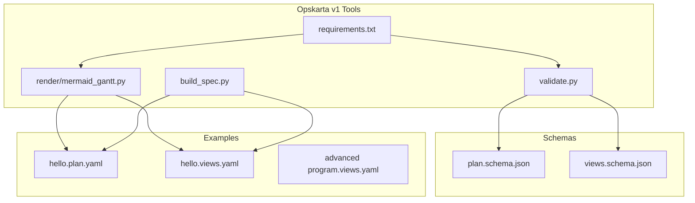
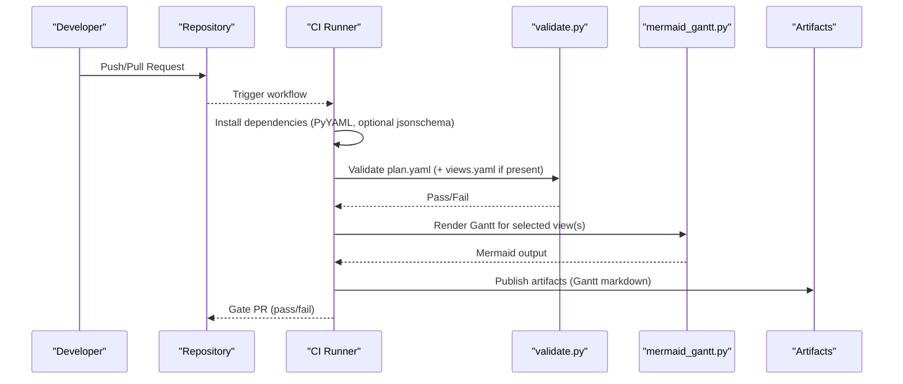
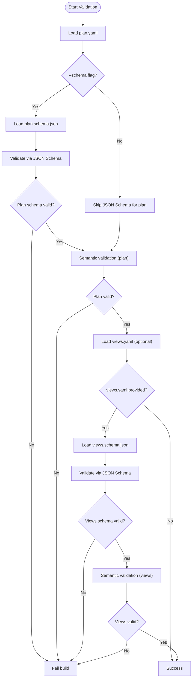
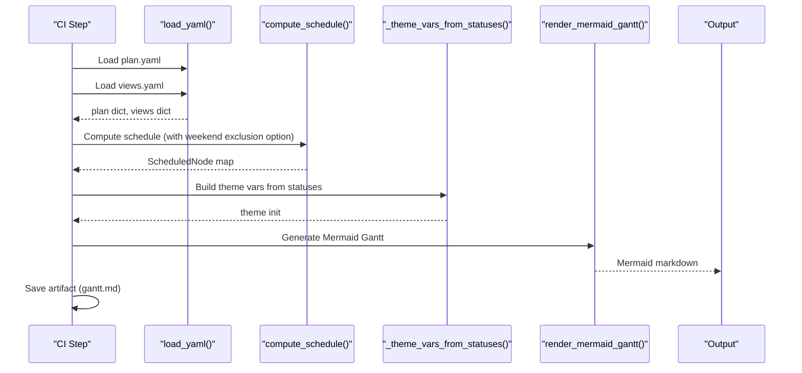
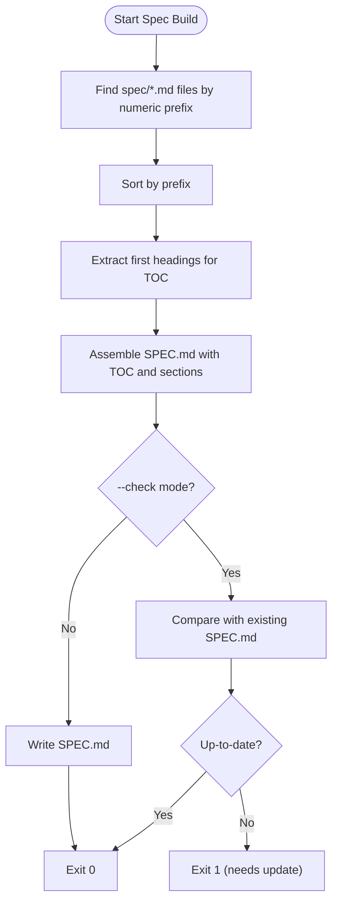
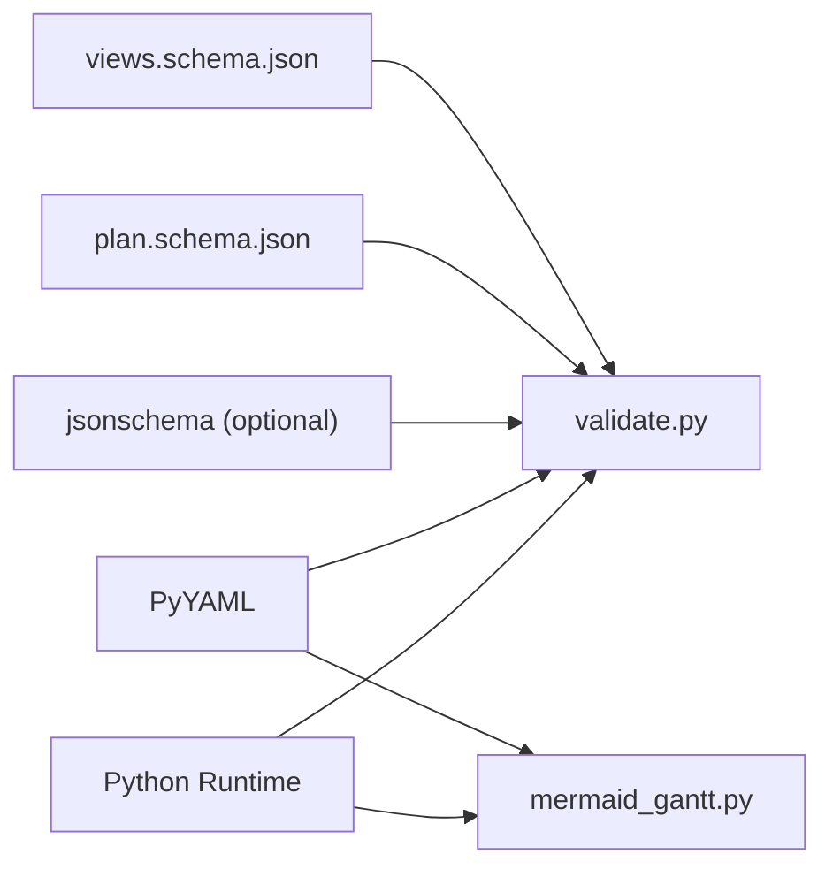

# CI/CD Pipeline Integration

<cite>
**Referenced Files in This Document**
- [README.md](file://README.md)
- [specs/v1/README.md](file://specs/v1/README.md)
- [specs/v1/tools/validate.py](file://specs/v1/tools/validate.py)
- [specs/v1/tools/render/mermaid_gantt.py](file://specs/v1/tools/render/mermaid_gantt.py)
- [specs/v1/tools/build_spec.py](file://specs/v1/tools/build_spec.py)
- [specs/v1/tools/requirements.txt](file://specs/v1/tools/requirements.txt)
- [specs/v1/schemas/plan.schema.json](file://specs/v1/schemas/plan.schema.json)
- [specs/v1/schemas/views.schema.json](file://specs/v1/schemas/views.schema.json)
- [specs/v1/examples/hello/hello.plan.yaml](file://specs/v1/examples/hello/hello.plan.yaml)
- [specs/v1/examples/hello/hello.views.yaml](file://specs/v1/examples/hello/hello.views.yaml)
- [specs/v1/examples/advanced/program.views.yaml](file://specs/v1/examples/advanced/program.views.yaml)
- [specs/v1/examples/advanced/README.md](file://specs/v1/examples/advanced/README.md)
- [specs/v1/SPEC.md](file://specs/v1/SPEC.md)
</cite>

## Table of Contents
1. [Introduction](#introduction)
2. [Project Structure](#project-structure)
3. [Core Components](#core-components)
4. [Architecture Overview](#architecture-overview)
5. [Detailed Component Analysis](#detailed-component-analysis)
6. [Dependency Analysis](#dependency-analysis)
7. [Performance Considerations](#performance-considerations)
8. [Troubleshooting Guide](#troubleshooting-guide)
9. [Conclusion](#conclusion)
10. [Appendices](#appendices)

## Introduction
This document explains how to integrate Opskarta validation and rendering into CI/CD pipelines. It covers automated validation steps (syntax, schema, and semantic checks), automated rendering of Gantt charts and other visualizations during builds, quality gates, failure notifications, artifact generation, and integration with deployment processes. Concrete pipeline configurations are provided for GitHub Actions, Jenkins, and GitLab CI.

## Project Structure
Opskarta’s validation and rendering capabilities live under specs/v1/tools. The primary scripts are:
- Validation: tools/validate.py
- Rendering: tools/render/mermaid_gantt.py
- Spec building: tools/build_spec.py
- Dependencies: tools/requirements.txt
- JSON Schemas: schemas/plan.schema.json, schemas/views.schema.json
- Examples: examples/hello and examples/advanced demonstrate plan and views usage

**Diagram sources**
- [specs/v1/tools/validate.py](file://specs/v1/tools/validate.py#L624-L752)
- [specs/v1/tools/render/mermaid_gantt.py](file://specs/v1/tools/render/mermaid_gantt.py#L439-L549)
- [specs/v1/tools/build_spec.py](file://specs/v1/tools/build_spec.py#L174-L240)
- [specs/v1/tools/requirements.txt](file://specs/v1/tools/requirements.txt#L1-L10)
- [specs/v1/schemas/plan.schema.json](file://specs/v1/schemas/plan.schema.json#L1-L86)
- [specs/v1/schemas/views.schema.json](file://specs/v1/schemas/views.schema.json#L1-L26)
- [specs/v1/examples/hello/hello.plan.yaml](file://specs/v1/examples/hello/hello.plan.yaml#L1-L44)
- [specs/v1/examples/hello/hello.views.yaml](file://specs/v1/examples/hello/hello.views.yaml#L1-L13)
- [specs/v1/examples/advanced/program.views.yaml](file://specs/v1/examples/advanced/program.views.yaml#L1-L93)

**Section sources**
- [specs/v1/README.md](file://specs/v1/README.md#L1-L27)
- [README.md](file://README.md#L68-L84)

## Core Components
- Validation script: validates YAML syntax, optional JSON Schema compliance, and semantic integrity (referential integrity, business rules). It supports plan-only and plan+views validation and can optionally validate via JSON Schema.
- Rendering script: generates Mermaid Gantt diagrams from a plan and a selected views view, with calendar exclusions and lane filtering.
- Spec builder: aggregates specification fragments into a single SPEC.md and can check whether the built spec is up-to-date.
- Requirements: lists Python dependencies for YAML parsing and optional JSON Schema validation.

Key capabilities for CI:
- Fail builds on invalid plans or views.
- Generate artifacts (Mermaid Gantt) for review and documentation.
- Enforce quality gates (syntax, schema, semantics).
- Integrate with deployment by gating on validation and rendering success.

**Section sources**
- [specs/v1/tools/validate.py](file://specs/v1/tools/validate.py#L634-L752)
- [specs/v1/tools/render/mermaid_gantt.py](file://specs/v1/tools/render/mermaid_gantt.py#L439-L549)
- [specs/v1/tools/build_spec.py](file://specs/v1/tools/build_spec.py#L174-L240)
- [specs/v1/tools/requirements.txt](file://specs/v1/tools/requirements.txt#L1-L10)

## Architecture Overview
The CI pipeline orchestrates three stages:
1. Install dependencies
2. Validate plans and views
3. Render visualizations and publish artifacts

**Diagram sources**
- [specs/v1/tools/validate.py](file://specs/v1/tools/validate.py#L634-L752)
- [specs/v1/tools/render/mermaid_gantt.py](file://specs/v1/tools/render/mermaid_gantt.py#L439-L549)
- [specs/v1/tools/requirements.txt](file://specs/v1/tools/requirements.txt#L1-L10)

## Detailed Component Analysis

### Validation Workflow
Validation performs:
- YAML syntax check
- Optional JSON Schema validation (plan and views)
- Semantic validation (referential integrity, business rules)

**Diagram sources**
- [specs/v1/tools/validate.py](file://specs/v1/tools/validate.py#L690-L732)
- [specs/v1/schemas/plan.schema.json](file://specs/v1/schemas/plan.schema.json#L1-L86)
- [specs/v1/schemas/views.schema.json](file://specs/v1/schemas/views.schema.json#L1-L26)

**Section sources**
- [specs/v1/tools/validate.py](file://specs/v1/tools/validate.py#L634-L752)
- [specs/v1/schemas/plan.schema.json](file://specs/v1/schemas/plan.schema.json#L1-L86)
- [specs/v1/schemas/views.schema.json](file://specs/v1/schemas/views.schema.json#L1-L26)

### Rendering Workflow
Rendering produces Mermaid Gantt diagrams from a selected view. It computes schedules, applies calendar exclusions, and emits a fenced Mermaid block.

**Diagram sources**
- [specs/v1/tools/render/mermaid_gantt.py](file://specs/v1/tools/render/mermaid_gantt.py#L439-L549)
- [specs/v1/tools/render/mermaid_gantt.py](file://specs/v1/tools/render/mermaid_gantt.py#L217-L294)
- [specs/v1/tools/render/mermaid_gantt.py](file://specs/v1/tools/render/mermaid_gantt.py#L349-L433)

**Section sources**
- [specs/v1/tools/render/mermaid_gantt.py](file://specs/v1/tools/render/mermaid_gantt.py#L439-L549)

### Spec Building Workflow
The spec builder aggregates specification fragments into a single SPEC.md and can check whether the built spec matches the assembled content.

**Diagram sources**
- [specs/v1/tools/build_spec.py](file://specs/v1/tools/build_spec.py#L174-L240)

**Section sources**
- [specs/v1/tools/build_spec.py](file://specs/v1/tools/build_spec.py#L174-L240)
- [specs/v1/SPEC.md](file://specs/v1/SPEC.md#L1-L200)

## Dependency Analysis
- Python runtime and PyYAML are required for both validation and rendering.
- Optional JSON Schema validation requires jsonschema.
- Validation depends on plan and views schemas for schema-level checks.
- Rendering depends on plan statuses to derive Mermaid theme variables.

**Diagram sources**
- [specs/v1/tools/requirements.txt](file://specs/v1/tools/requirements.txt#L1-L10)
- [specs/v1/tools/validate.py](file://specs/v1/tools/validate.py#L599-L618)
- [specs/v1/schemas/plan.schema.json](file://specs/v1/schemas/plan.schema.json#L1-L86)
- [specs/v1/schemas/views.schema.json](file://specs/v1/schemas/views.schema.json#L1-L26)

**Section sources**
- [specs/v1/tools/requirements.txt](file://specs/v1/tools/requirements.txt#L1-L10)
- [specs/v1/tools/validate.py](file://specs/v1/tools/validate.py#L599-L618)

## Performance Considerations
- Large operational maps with many nodes and cross-track dependencies can increase rendering time. To optimize:
  - Limit the number of lanes and nodes per view in CI to reduce computation.
  - Use targeted views (e.g., critical path) for CI runs, and reserve full views for manual review.
  - Cache Python virtual environments and installed packages between runs.
  - Run validation and rendering in parallel stages when supported by your CI provider.
- Calendar exclusions (weekends and holidays) affect schedule computation; keep exclusions concise to avoid unnecessary overhead.

[No sources needed since this section provides general guidance]

## Troubleshooting Guide
Common issues and resolutions:
- Missing PyYAML: Install dependencies using the requirements file.
- Missing jsonschema: Install optional dependency for schema-level validation.
- Invalid YAML: Fix syntax errors reported by the validator.
- Schema mismatch: Align plan or views fields with plan.schema.json or views.schema.json.
- Semantic errors: Fix referential integrity issues (parent, after, status) and ensure acyclic dependencies.
- Rendering errors: Verify the selected view exists and references only existing nodes.

**Section sources**
- [specs/v1/tools/requirements.txt](file://specs/v1/tools/requirements.txt#L1-L10)
- [specs/v1/tools/validate.py](file://specs/v1/tools/validate.py#L79-L87)
- [specs/v1/tools/validate.py](file://specs/v1/tools/validate.py#L602-L605)
- [specs/v1/tools/render/mermaid_gantt.py](file://specs/v1/tools/render/mermaid_gantt.py#L62-L77)

## Conclusion
By integrating Opskarta validation and rendering into CI/CD, teams can enforce quality gates early, automate artifact generation for Gantt visualizations, and streamline documentation updates. Use the provided scripts and schemas to validate, render, and build the spec, and configure your pipeline to gate merges on successful validation and rendering.

[No sources needed since this section summarizes without analyzing specific files]

## Appendices

### CI/CD Pipeline Configurations

#### GitHub Actions
- Install dependencies (PyYAML and optional jsonschema)
- Run validation for plan and views
- Render Gantt for selected views and upload artifacts
- Gate pull requests on success

Example outline:
- Job: Validate
  - Steps: checkout, setup Python, install dependencies, validate plan and views
- Job: Render
  - Steps: checkout, setup Python, install dependencies, render Gantt, upload artifacts
- Workflow: require both jobs to pass

[No sources needed since this section provides a conceptual configuration outline]

#### Jenkins
- Pipeline stage: Install dependencies
- Stage: Validate
- Stage: Render Gantt
- Post-build: Archive artifacts and set build status

[No sources needed since this section provides a conceptual configuration outline]

#### GitLab CI
- Job: install-dependencies
- Job: validate
- Job: render
- Artifacts: publish rendered Gantt markdown

[No sources needed since this section provides a conceptual configuration outline]

### Quality Gates and Notifications
- Quality gates:
  - Validation must pass
  - Rendering must succeed and produce artifacts
- Notifications:
  - Post job results to chat or issue comments
  - Block merge until gates pass

[No sources needed since this section provides general guidance]

### Artifact Generation
- Rendered Gantt outputs can be saved as artifacts for review and documentation.
- Use CI-specific artifact storage and retrieval mechanisms.

[No sources needed since this section provides general guidance]

### Integration with Deployment
- Gate deployments behind successful validation and rendering.
- Publish artifacts to documentation sites or internal wikis.

[No sources needed since this section provides general guidance]