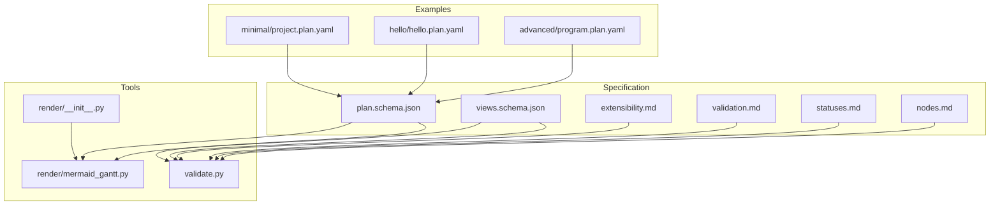
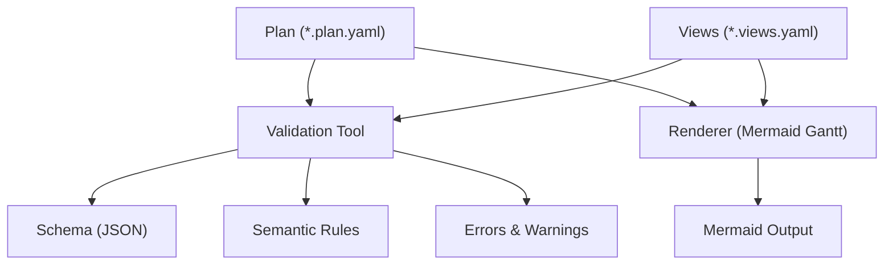
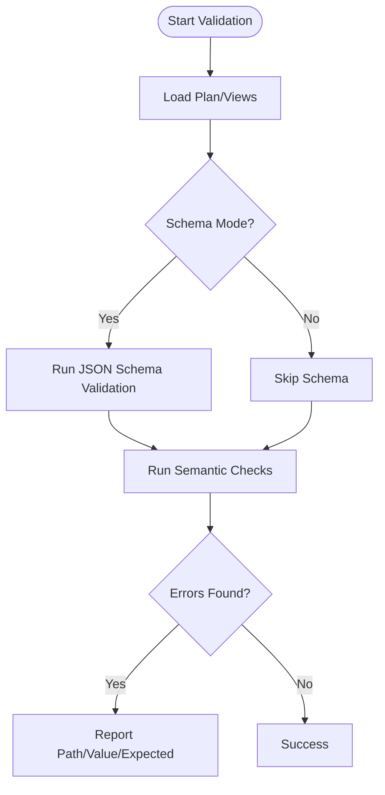
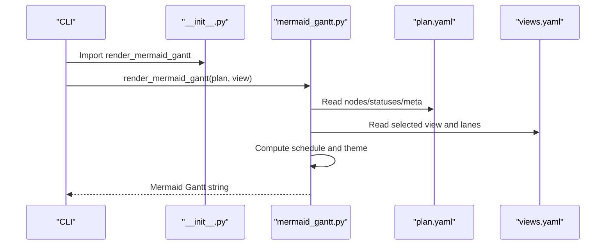
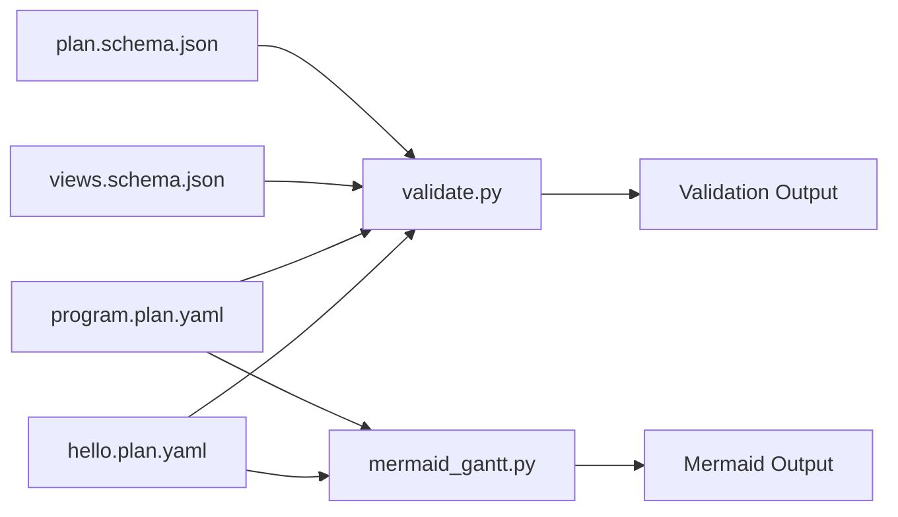

# Custom Extension Development

<cite>
**Referenced Files in This Document**
- [extensibility.md](file://specs/v1/spec/90-extensibility.md)
- [validation.md](file://specs/v1/spec/60-validation.md)
- [statuses.md](file://specs/v1/spec/40-statuses.md)
- [nodes.md](file://specs/v1/spec/20-nodes.md)
- [plan.schema.json](file://specs/v1/schemas/plan.schema.json)
- [views.schema.json](file://specs/v1/schemas/views.schema.json)
- [validate.py](file://specs/v1/tools/validate.py)
- [mermaid_gantt.py](file://specs/v1/tools/render/mermaid_gantt.py)
- [__init__.py](file://specs/v1/tools/render/__init__.py)
- [program.plan.yaml](file://specs/v1/examples/advanced/program.plan.yaml)
- [hello.plan.yaml](file://specs/v1/examples/hello/hello.plan.yaml)
- [CONTRIBUTING.md](file://CONTRIBUTING.md)
</cite>

## Table of Contents
1. [Introduction](#introduction)
2. [Project Structure](#project-structure)
3. [Core Components](#core-components)
4. [Architecture Overview](#architecture-overview)
5. [Detailed Component Analysis](#detailed-component-analysis)
6. [Dependency Analysis](#dependency-analysis)
7. [Performance Considerations](#performance-considerations)
8. [Troubleshooting Guide](#troubleshooting-guide)
9. [Conclusion](#conclusion)
10. [Appendices](#appendices)

## Introduction
This document explains how to develop custom extensions for Opskarta using the extensibility framework. It focuses on the recommended namespace for custom fields, building validation rules and renderers, integrating with external systems, and maintaining backward compatibility. It also covers extension registration patterns, versioning considerations, and contribution guidelines.

## Project Structure
Opskarta’s extensibility is centered around:
- A core specification and schema-driven format for plans and views
- A validation tool that enforces schema and semantic rules
- A reference renderer that transforms plan and view data into Mermaid Gantt
- An extensibility rule allowing arbitrary custom fields under a dedicated namespace

**Diagram sources**
- [plan.schema.json](file://specs/v1/schemas/plan.schema.json#L1-L86)
- [views.schema.json](file://specs/v1/schemas/views.schema.json#L1-L26)
- [extensibility.md](file://specs/v1/spec/90-extensibility.md#L1-L26)
- [validation.md](file://specs/v1/spec/60-validation.md#L1-L140)
- [statuses.md](file://specs/v1/spec/40-statuses.md#L1-L23)
- [nodes.md](file://specs/v1/spec/20-nodes.md#L1-L37)
- [validate.py](file://specs/v1/tools/validate.py#L1-L752)
- [__init__.py](file://specs/v1/tools/render/__init__.py#L1-L14)
- [mermaid_gantt.py](file://specs/v1/tools/render/mermaid_gantt.py#L1-L549)
- [program.plan.yaml](file://specs/v1/examples/advanced/program.plan.yaml#L1-L326)
- [hello.plan.yaml](file://specs/v1/examples/hello/hello.plan.yaml#L1-L44)

**Section sources**
- [plan.schema.json](file://specs/v1/schemas/plan.schema.json#L1-L86)
- [views.schema.json](file://specs/v1/schemas/views.schema.json#L1-L26)
- [extensibility.md](file://specs/v1/spec/90-extensibility.md#L1-L26)
- [validation.md](file://specs/v1/spec/60-validation.md#L1-L140)
- [statuses.md](file://specs/v1/spec/40-statuses.md#L1-L23)
- [nodes.md](file://specs/v1/spec/20-nodes.md#L1-L37)
- [validate.py](file://specs/v1/tools/validate.py#L1-L752)
- [__init__.py](file://specs/v1/tools/render/__init__.py#L1-L14)
- [mermaid_gantt.py](file://specs/v1/tools/render/mermaid_gantt.py#L1-L549)
- [program.plan.yaml](file://specs/v1/examples/advanced/program.plan.yaml#L1-L326)
- [hello.plan.yaml](file://specs/v1/examples/hello/hello.plan.yaml#L1-L44)

## Core Components
- Extensibility rule: Arbitrary fields are allowed and ignored by base tooling unless they influence formatting. A recommended namespace is provided for grouping custom fields.
- Validation tool: Enforces schema and semantic rules, produces human-readable errors with path, value, and expected information.
- Reference renderer: Generates Mermaid Gantt diagrams from plan and views, mapping statuses to Mermaid tags and deriving theme variables from status colors.
- Schemas: JSON Schemas define allowed fields and permit additional properties, enabling extensions without breaking core validation.

Key extension points:
- Custom node-level fields under a dedicated namespace
- Custom status definitions and labels/colors
- Additional properties in plan metadata and views
- Renderer plugins and validation extensions

**Section sources**
- [extensibility.md](file://specs/v1/spec/90-extensibility.md#L1-L26)
- [validation.md](file://specs/v1/spec/60-validation.md#L1-L140)
- [plan.schema.json](file://specs/v1/schemas/plan.schema.json#L1-L86)
- [views.schema.json](file://specs/v1/schemas/views.schema.json#L1-L26)
- [validate.py](file://specs/v1/tools/validate.py#L1-L752)
- [mermaid_gantt.py](file://specs/v1/tools/render/mermaid_gantt.py#L1-L549)

## Architecture Overview
The extensibility architecture separates concerns:
- Specification defines the canonical schema and recommended fields
- Validation ensures schema compliance and semantic correctness
- Rendering consumes validated data to produce visual outputs
- Extensions live outside core logic and are preserved during parse/emit

**Diagram sources**
- [validate.py](file://specs/v1/tools/validate.py#L1-L752)
- [plan.schema.json](file://specs/v1/schemas/plan.schema.json#L1-L86)
- [views.schema.json](file://specs/v1/schemas/views.schema.json#L1-L26)
- [mermaid_gantt.py](file://specs/v1/tools/render/mermaid_gantt.py#L1-L549)

## Detailed Component Analysis

### Extensibility Framework and Namespace
- Arbitrary fields are permitted at all levels; unknown fields are ignored by base tooling.
- A recommended namespace groups custom fields under a dedicated key to avoid conflicts.
- Examples demonstrate custom top-level fields grouped under the namespace.

Practical guidance:
- Place related custom fields under a single namespace key for clarity and maintainability.
- Keep custom fields optional to preserve backward compatibility.
- Document custom fields in the specification to aid interoperability.

**Section sources**
- [extensibility.md](file://specs/v1/spec/90-extensibility.md#L1-L26)
- [program.plan.yaml](file://specs/v1/examples/advanced/program.plan.yaml#L295-L326)

### Custom Status Definitions and Rendering
- Statuses are free-form dictionaries; recommended keys improve compatibility.
- Renderers can map statuses to visual attributes (e.g., Mermaid tags and theme variables).
- Example programs show extended status sets with labels and colors.

Implementation tips:
- Define status semantics in your tooling and document mappings.
- Derive visual themes from status colors to keep visuals consistent.

**Section sources**
- [statuses.md](file://specs/v1/spec/40-statuses.md#L1-L23)
- [program.plan.yaml](file://specs/v1/examples/advanced/program.plan.yaml#L7-L14)
- [mermaid_gantt.py](file://specs/v1/tools/render/mermaid_gantt.py#L300-L347)

### Additional Node Properties and Custom Fields
- Nodes support recommended fields (kind, status, parent, after, scheduling, issue, notes).
- Schemas allow additional properties at node level and elsewhere, enabling extensions.
- Examples illustrate extended node metadata and custom top-level structures.

Guidelines:
- Add optional fields to avoid breaking older consumers.
- Use the recommended namespace for grouping custom node-level extensions.

**Section sources**
- [nodes.md](file://specs/v1/spec/20-nodes.md#L1-L37)
- [plan.schema.json](file://specs/v1/schemas/plan.schema.json#L38-L82)
- [hello.plan.yaml](file://specs/v1/examples/hello/hello.plan.yaml#L13-L44)
- [program.plan.yaml](file://specs/v1/examples/advanced/program.plan.yaml#L16-L326)

### Validation Extensions and Semantics
- Validation enforces schema and semantic rules, including cross-references and cycles.
- Errors include path, value, and expected/available information for clarity.
- Optional schema mode adds JSON Schema checks.

Extension patterns:
- Extend validation to enforce domain-specific rules while preserving base semantics.
- Keep new rules optional to maintain backward compatibility.

**Diagram sources**
- [validate.py](file://specs/v1/tools/validate.py#L586-L618)
- [validate.py](file://specs/v1/tools/validate.py#L135-L329)
- [validate.py](file://specs/v1/tools/validate.py#L431-L579)

**Section sources**
- [validation.md](file://specs/v1/spec/60-validation.md#L1-L140)
- [validate.py](file://specs/v1/tools/validate.py#L1-L752)

### Plugin Architecture and Renderer Integration
- Renderers are separate modules imported via a package initializer.
- The Mermaid Gantt renderer demonstrates how to consume plan and views, compute schedules, and produce Mermaid output.
- Renderer plugins can be added independently without changing core logic.

**Diagram sources**
- [__init__.py](file://specs/v1/tools/render/__init__.py#L1-L14)
- [mermaid_gantt.py](file://specs/v1/tools/render/mermaid_gantt.py#L439-L549)

**Section sources**
- [__init__.py](file://specs/v1/tools/render/__init__.py#L1-L14)
- [mermaid_gantt.py](file://specs/v1/tools/render/mermaid_gantt.py#L1-L549)

### Third-Party Integrations and External Systems
- The format supports linking tasks to external issue trackers via a dedicated field.
- Extensions can integrate with external systems by adding custom fields and writing adapters that translate between external formats and the Opskarta schema.

Recommendations:
- Model external identifiers in the schema using optional fields.
- Provide adapters that transform external data into the Opskarta plan and views.

**Section sources**
- [nodes.md](file://specs/v1/spec/20-nodes.md#L29-L31)
- [plan.schema.json](file://specs/v1/schemas/plan.schema.json#L73-L75)

### Backward Compatibility and Versioning
- Base tooling ignores unknown fields and preserves them during parse/emit.
- Schemas allow additional properties, enabling extensions without schema churn.
- Contribution guidelines emphasize small, isolated changes and optional fields.

Best practices:
- Treat new fields as optional until a major version bump.
- Keep extension namespaces stable and documented.
- Provide migration paths for evolving extensions.

**Section sources**
- [extensibility.md](file://specs/v1/spec/90-extensibility.md#L1-L26)
- [plan.schema.json](file://specs/v1/schemas/plan.schema.json#L32-L84)
- [CONTRIBUTING.md](file://CONTRIBUTING.md#L1-L35)

### Community Contribution Guidelines
- The project prioritizes clarity, compatibility, and small, isolated tools.
- Changes to the format should include examples and clear semantics.
- Code contributions should target Python 3.11+, use formatting/linting, and include tests when logic is non-trivial.

**Section sources**
- [CONTRIBUTING.md](file://CONTRIBUTING.md#L1-L35)

## Dependency Analysis
Extensibility relies on:
- Schemas permitting additional properties
- Validation enforcing schema and semantics
- Renderers consuming validated data and mapping statuses to visuals
- Examples demonstrating custom namespaces and extended statuses

**Diagram sources**
- [plan.schema.json](file://specs/v1/schemas/plan.schema.json#L1-L86)
- [views.schema.json](file://specs/v1/schemas/views.schema.json#L1-L26)
- [validate.py](file://specs/v1/tools/validate.py#L1-L752)
- [mermaid_gantt.py](file://specs/v1/tools/render/mermaid_gantt.py#L1-L549)
- [program.plan.yaml](file://specs/v1/examples/advanced/program.plan.yaml#L1-L326)
- [hello.plan.yaml](file://specs/v1/examples/hello/hello.plan.yaml#L1-L44)

**Section sources**
- [plan.schema.json](file://specs/v1/schemas/plan.schema.json#L1-L86)
- [views.schema.json](file://specs/v1/schemas/views.schema.json#L1-L26)
- [validate.py](file://specs/v1/tools/validate.py#L1-L752)
- [mermaid_gantt.py](file://specs/v1/tools/render/mermaid_gantt.py#L1-L549)
- [program.plan.yaml](file://specs/v1/examples/advanced/program.plan.yaml#L1-L326)
- [hello.plan.yaml](file://specs/v1/examples/hello/hello.plan.yaml#L1-L44)

## Performance Considerations
- Validation performs schema checks and semantic graph traversals; keep custom validations efficient and avoid heavy computations.
- Renderers compute schedules and theme variables; cache where appropriate and minimize repeated parsing.
- Use optional fields to reduce unnecessary processing in downstream tools.

[No sources needed since this section provides general guidance]

## Troubleshooting Guide
Common issues and resolutions:
- Unknown fields cause no errors but may be ignored; ensure they are placed under the recommended namespace if intended for consumption by downstream tools.
- Schema mismatches: validate with both semantic and schema modes to catch type and structure issues.
- Cross-reference errors: verify parent/after/status references exist and acyclic.
- Rendering failures: confirm statuses and colors are present; ensure the selected view references existing nodes.

**Section sources**
- [validation.md](file://specs/v1/spec/60-validation.md#L1-L140)
- [validate.py](file://specs/v1/tools/validate.py#L1-L752)
- [mermaid_gantt.py](file://specs/v1/tools/render/mermaid_gantt.py#L1-L549)

## Conclusion
Opskarta’s extensibility model enables robust customization without sacrificing core compatibility. By leveraging the recommended namespace, JSON Schemas, and modular validation and rendering tools, developers can introduce custom fields, statuses, and integrations while maintaining backward compatibility and clear contribution practices.

[No sources needed since this section summarizes without analyzing specific files]

## Appendices

### A. Recommended Extension Patterns
- Group custom fields under a single namespace key for clarity and isolation.
- Keep new fields optional until a major version change.
- Document mappings from statuses to visual attributes in renderers.

**Section sources**
- [extensibility.md](file://specs/v1/spec/90-extensibility.md#L1-L26)
- [statuses.md](file://specs/v1/spec/40-statuses.md#L1-L23)
- [mermaid_gantt.py](file://specs/v1/tools/render/mermaid_gantt.py#L300-L347)

### B. Example References
- Minimal plan: [project.plan.yaml](file://specs/v1/examples/minimal/project.plan.yaml#L1-L6)
- Hello example with statuses and nodes: [hello.plan.yaml](file://specs/v1/examples/hello/hello.plan.yaml#L1-L44)
- Advanced program with extended statuses and custom namespace: [program.plan.yaml](file://specs/v1/examples/advanced/program.plan.yaml#L1-L326)

**Section sources**
- [program.plan.yaml](file://specs/v1/examples/advanced/program.plan.yaml#L1-L326)
- [hello.plan.yaml](file://specs/v1/examples/hello/hello.plan.yaml#L1-L44)
- [project.plan.yaml](file://specs/v1/examples/minimal/project.plan.yaml#L1-L6)