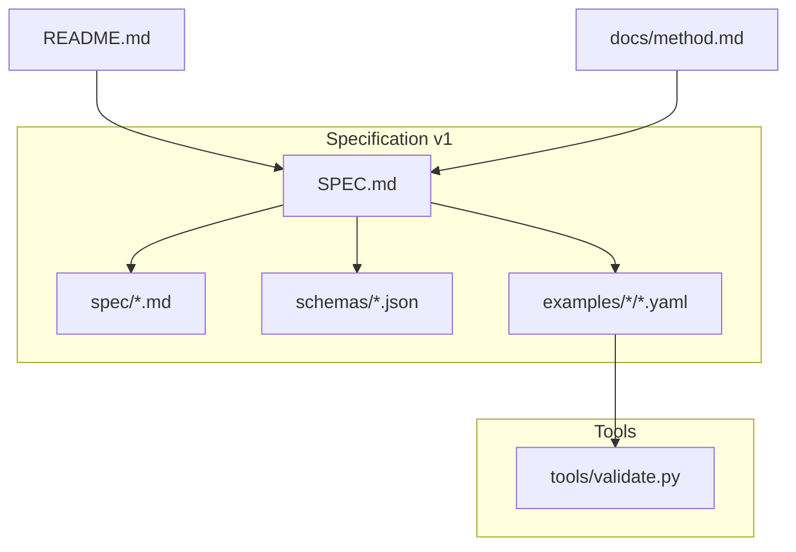
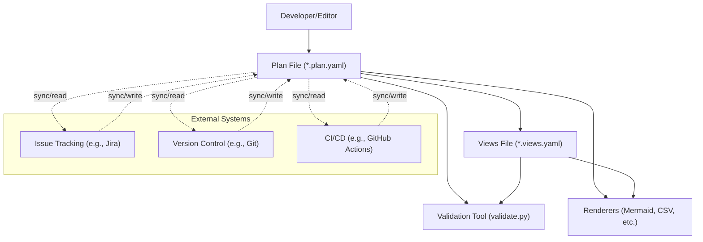
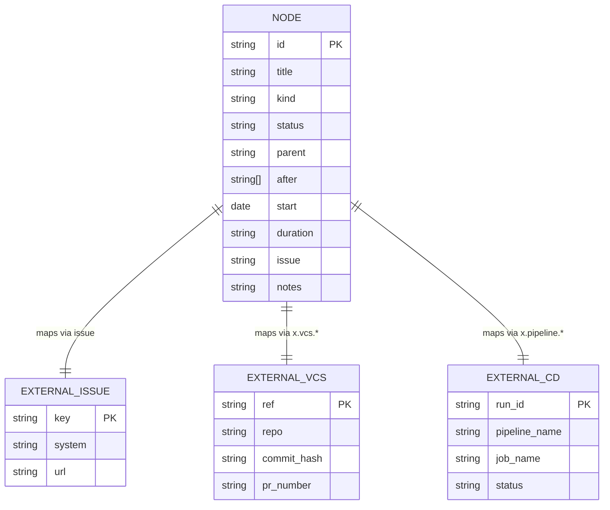
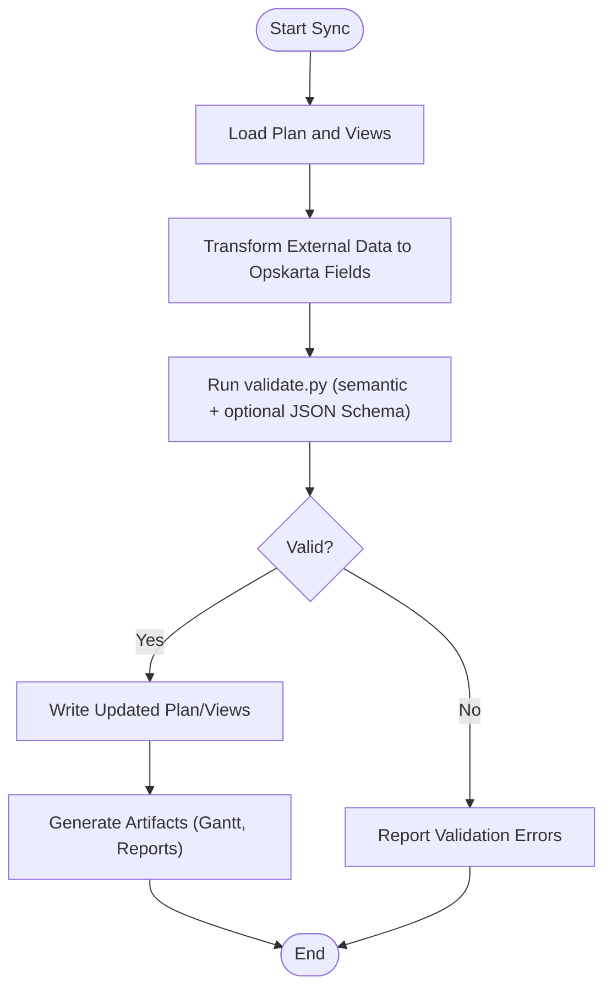
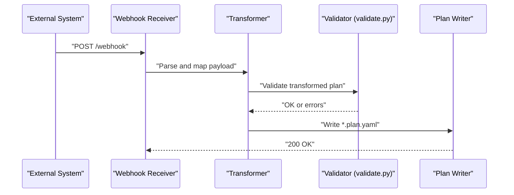
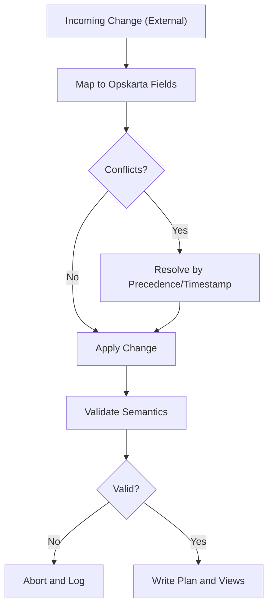
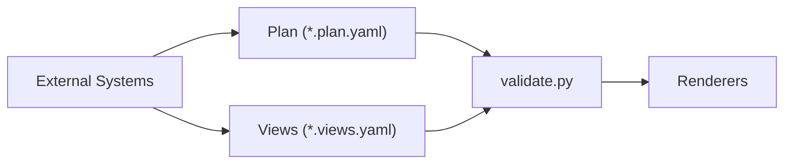

# External System Integration

<cite>
**Referenced Files in This Document**
- [README.md](file://README.md)
- [docs/method.md](file://docs/method.md)
- [specs/v1/README.md](file://specs/v1/README.md)
- [specs/v1/SPEC.md](file://specs/v1/SPEC.md)
- [specs/v1/spec/00-introduction.md](file://specs/v1/spec/00-introduction.md)
- [specs/v1/spec/20-nodes.md](file://specs/v1/spec/20-nodes.md)
- [specs/v1/spec/40-statuses.md](file://specs/v1/spec/40-statuses.md)
- [specs/v1/spec/90-extensibility.md](file://specs/v1/spec/90-extensibility.md)
- [specs/v1/schemas/plan.schema.json](file://specs/v1/schemas/plan.schema.json)
- [specs/v1/schemas/views.schema.json](file://specs/v1/schemas/views.schema.json)
- [specs/v1/examples/hello/hello.plan.yaml](file://specs/v1/examples/hello/hello.plan.yaml)
- [specs/v1/examples/hello/hello.views.yaml](file://specs/v1/examples/hello/hello.views.yaml)
- [specs/v1/examples/advanced/README.md](file://specs/v1/examples/advanced/README.md)
- [specs/v1/tools/validate.py](file://specs/v1/tools/validate.py)
</cite>

## Table of Contents
1. [Introduction](#introduction)
2. [Project Structure](#project-structure)
3. [Core Components](#core-components)
4. [Architecture Overview](#architecture-overview)
5. [Detailed Component Analysis](#detailed-component-analysis)
6. [Dependency Analysis](#dependency-analysis)
7. [Performance Considerations](#performance-considerations)
8. [Troubleshooting Guide](#troubleshooting-guide)
9. [Conclusion](#conclusion)
10. [Appendices](#appendices)

## Introduction
This document describes how to integrate external systems with Opskarta. It focuses on mapping operational map nodes to external entities (issue tracking, version control, CI/CD), designing synchronization strategies, and managing bidirectional updates. It also covers data transformation, conflict resolution, authentication, and performance considerations, grounded in the opskarta v1 specification and included tooling.

Opskarta is a plan-as-code format centered on a single source of truth: a versioned plan file. External systems are integrated by aligning their entities to opskarta nodes and statuses, and by orchestrating synchronization via scripts or services that read/write plan and views files.

## Project Structure
The repository provides:
- A formal specification and examples for opskarta v1
- JSON Schemas for plan and views files
- Validation tools and rendering utilities
- Example plans and views demonstrating node kinds, scheduling, and extensibility

**Diagram sources**
- [specs/v1/SPEC.md](file://specs/v1/SPEC.md#L1-L407)
- [specs/v1/spec/00-introduction.md](file://specs/v1/spec/00-introduction.md#L1-L10)
- [specs/v1/schemas/plan.schema.json](file://specs/v1/schemas/plan.schema.json#L1-L86)
- [specs/v1/schemas/views.schema.json](file://specs/v1/schemas/views.schema.json#L1-L26)
- [specs/v1/examples/hello/hello.plan.yaml](file://specs/v1/examples/hello/hello.plan.yaml#L1-L44)
- [specs/v1/examples/hello/hello.views.yaml](file://specs/v1/examples/hello/hello.views.yaml#L1-L13)
- [specs/v1/tools/validate.py](file://specs/v1/tools/validate.py#L1-L752)
- [README.md](file://README.md#L1-L96)
- [docs/method.md](file://docs/method.md#L73-L97)

**Section sources**
- [README.md](file://README.md#L1-L96)
- [specs/v1/README.md](file://specs/v1/README.md#L1-L27)

## Core Components
- Plan file (`.plan.yaml`): Defines version, metadata, statuses, and nodes. Nodes support mapping to external entities via the issue field and can carry arbitrary extension fields.
- Views file (`.views.yaml`): Describes how to render the plan (e.g., Gantt lanes) and links to nodes by ID.
- Validation tool: Validates plan and views against both JSON Schema and semantic rules (references, cycles, formats).
- Extensibility: Users can add custom fields under a namespace to carry integration-specific attributes.

Key integration-relevant fields:
- Node fields: title, kind, status, parent, after, start, duration, issue, notes, and extension fields.
- Statuses: a dictionary of status keys with label and color.
- Views: project linkage to plan meta.id and lanes/nodes mapping.

**Section sources**
- [specs/v1/spec/20-nodes.md](file://specs/v1/spec/20-nodes.md#L1-L37)
- [specs/v1/spec/40-statuses.md](file://specs/v1/spec/40-statuses.md#L1-L23)
- [specs/v1/schemas/plan.schema.json](file://specs/v1/schemas/plan.schema.json#L1-L86)
- [specs/v1/schemas/views.schema.json](file://specs/v1/schemas/views.schema.json#L1-L26)
- [specs/v1/tools/validate.py](file://specs/v1/tools/validate.py#L135-L329)

## Architecture Overview
The integration architecture centers on the plan file as the canonical source of truth. External systems are synchronized by:
- Reading/writing plan and views files
- Resolving node-to-entity mappings (issue tracking, VCS, CI/CD)
- Applying transformations and conflict resolution policies
- Emitting artifacts (renderings, reports) from validated plans

[No sources needed since this diagram shows conceptual workflow, not actual code structure]

## Detailed Component Analysis

### Node Mapping to External Entities
- Issue tracking: Use the node’s issue field to store external identifiers (e.g., Jira keys). This enables unidirectional sync from external systems to update statuses and notes, or bidirectional sync with conflict handling.
- Version control: Map nodes to VCS activities (branches, commits, PRs) via extension fields (e.g., x.vcs.ref). This supports synchronization of commit statuses and branch lifecycles.
- CI/CD: Map nodes to pipeline runs and stages via extension fields (e.g., x.pipeline.run_id). This enables sync of job statuses and logs.

**Diagram sources**
- [specs/v1/spec/20-nodes.md](file://specs/v1/spec/20-nodes.md#L29-L31)
- [specs/v1/spec/90-extensibility.md](file://specs/v1/spec/90-extensibility.md#L1-L26)
- [specs/v1/schemas/plan.schema.json](file://specs/v1/schemas/plan.schema.json#L73-L78)

**Section sources**
- [specs/v1/spec/20-nodes.md](file://specs/v1/spec/20-nodes.md#L29-L31)
- [specs/v1/spec/90-extensibility.md](file://specs/v1/spec/90-extensibility.md#L12-L23)
- [specs/v1/schemas/plan.schema.json](file://specs/v1/schemas/plan.schema.json#L73-L78)

### Data Synchronization Strategies
- Pull-first sync: Periodically fetch external state and update plan nodes (status, dates, notes). Validate before writing.
- Push-first sync: On external events, compute plan changes and write to plan; validate and render.
- Hybrid: Use pull for baseline, push for real-time updates, reconcile periodically.

Recommended flow:
1. Load plan and views
2. Apply transformations to map external fields to opskarta fields
3. Validate with validate.py (semantic and optional JSON Schema)
4. Write plan and views if valid
5. Trigger renderers to produce artifacts

**Diagram sources**
- [specs/v1/tools/validate.py](file://specs/v1/tools/validate.py#L634-L752)
- [specs/v1/schemas/plan.schema.json](file://specs/v1/schemas/plan.schema.json#L1-L86)
- [specs/v1/schemas/views.schema.json](file://specs/v1/schemas/views.schema.json#L1-L26)

**Section sources**
- [specs/v1/tools/validate.py](file://specs/v1/tools/validate.py#L135-L329)
- [specs/v1/tools/validate.py](file://specs/v1/tools/validate.py#L431-L579)

### Webhook and Real-Time Update Mechanisms
- Webhooks: Subscribe to external system webhooks (e.g., issue transitions, VCS pushes, CI job completion). Deserialize payload, transform to opskarta node updates, validate, and write.
- Polling fallback: For systems without webhooks, poll for changes at intervals and apply the same transformation/validation pipeline.
- Idempotency: Store last-seen external event IDs to avoid duplicate processing.
- Conflict handling: Prefer external source for incoming events; for bidirectional changes, use timestamps or version fields to decide precedence.

[No sources needed since this diagram shows conceptual workflow, not actual code structure]

### Bidirectional Synchronization and Conflict Resolution
- Status mapping: Map external statuses to opskarta statuses (recommend using a stable mapping table).
- Timestamp precedence: When both sides change, prefer the latest timestamp or external version number.
- Merge notes and metadata: Concatenate or merge external notes into node notes, preserving context.
- Dependency integrity: Preserve after and parent relationships; detect and prevent cycles during reconciliation.

**Diagram sources**
- [specs/v1/tools/validate.py](file://specs/v1/tools/validate.py#L325-L403)
- [specs/v1/spec/20-nodes.md](file://specs/v1/spec/20-nodes.md#L25-L31)

**Section sources**
- [specs/v1/tools/validate.py](file://specs/v1/tools/validate.py#L325-L403)
- [specs/v1/spec/20-nodes.md](file://specs/v1/spec/20-nodes.md#L25-L31)

### Authentication Methods
- Issue tracking (e.g., Jira): Use API tokens or OAuth apps. Configure credentials in environment variables or secure secret stores.
- Version control (e.g., Git): Use personal access tokens or deploy keys for read/write access to repositories.
- CI/CD (e.g., GitHub Actions): Use repository-scoped tokens or service accounts with least privilege.

[No sources needed since this section provides general guidance]

### Concrete Integration Configurations
- Plan and views locations:
  - Plan: project-root/your.project.plan.yaml
  - Views: project-root/your.project.views.yaml
- Example plan and views files demonstrate structure and node kinds.
- Use validate.py to check files before and after integration writes.

**Section sources**
- [specs/v1/examples/hello/hello.plan.yaml](file://specs/v1/examples/hello/hello.plan.yaml#L1-L44)
- [specs/v1/examples/hello/hello.views.yaml](file://specs/v1/examples/hello/hello.views.yaml#L1-L13)
- [specs/v1/tools/validate.py](file://specs/v1/tools/validate.py#L634-L752)

### API Endpoints and Payloads
- Webhook receiver: Implement a simple HTTP endpoint to accept external system events. Deserialize JSON payload, map fields, validate, and persist.
- Rendering endpoints: Expose endpoints to regenerate artifacts from the current plan/views (e.g., Gantt, CSV). Validate inputs and return appropriate HTTP status codes.

[No sources needed since this section provides general guidance]

## Dependency Analysis
Opskarta integrates with external systems through plan and views files. The validator enforces schema and semantic correctness, ensuring reliable integrations.

**Diagram sources**
- [specs/v1/tools/validate.py](file://specs/v1/tools/validate.py#L634-L752)
- [specs/v1/schemas/plan.schema.json](file://specs/v1/schemas/plan.schema.json#L1-L86)
- [specs/v1/schemas/views.schema.json](file://specs/v1/schemas/views.schema.json#L1-L26)

**Section sources**
- [specs/v1/tools/validate.py](file://specs/v1/tools/validate.py#L634-L752)
- [specs/v1/schemas/plan.schema.json](file://specs/v1/schemas/plan.schema.json#L1-L86)
- [specs/v1/schemas/views.schema.json](file://specs/v1/schemas/views.schema.json#L1-L26)

## Performance Considerations
- Batch external reads: Group changes per tick to minimize filesystem writes.
- Incremental writes: Only rewrite changed nodes to reduce I/O.
- Parallelization: Run validations and renders in parallel where safe.
- Caching: Cache external metadata (e.g., issue details) to reduce API calls.
- Debouncing: Coalesce rapid-fire events to avoid thrashing.

[No sources needed since this section provides general guidance]

## Troubleshooting Guide
Common issues and resolutions:
- Validation failures:
  - Symptom: Errors about missing fields, invalid formats, or broken references.
  - Action: Use validate.py to identify the exact path and expected values; fix plan or views accordingly.
- Cycle detection:
  - Symptom: Errors indicating cyclic parent or after dependencies.
  - Action: Remove or adjust dependencies to form an acyclic graph.
- Status mismatch:
  - Symptom: Node status not found in statuses dictionary.
  - Action: Add the status key to statuses or update the node to a known status.
- Views mismatch:
  - Symptom: Lane nodes not present in plan.
  - Action: Ensure all nodes referenced in views exist in the plan.

**Section sources**
- [specs/v1/tools/validate.py](file://specs/v1/tools/validate.py#L135-L329)
- [specs/v1/tools/validate.py](file://specs/v1/tools/validate.py#L431-L579)

## Conclusion
Opskarta’s plan-as-code model provides a robust foundation for integrating with external systems. By mapping nodes to external entities, validating changes rigorously, and applying disciplined synchronization strategies, teams can maintain accurate, up-to-date operational maps while leveraging existing issue trackers, VCS, and CI/CD platforms.

[No sources needed since this section summarizes without analyzing specific files]

## Appendices

### Appendix A: Node Field Reference
- Required: title
- Recommended: kind, status, parent, after, start, duration, issue, notes
- Extensible: Arbitrary fields under x: for custom integrations

**Section sources**
- [specs/v1/spec/20-nodes.md](file://specs/v1/spec/20-nodes.md#L5-L31)
- [specs/v1/spec/90-extensibility.md](file://specs/v1/spec/90-extensibility.md#L5-L23)
- [specs/v1/schemas/plan.schema.json](file://specs/v1/schemas/plan.schema.json#L46-L78)

### Appendix B: Example Files
- Minimal plan and views examples demonstrate structure and usage.

**Section sources**
- [specs/v1/examples/hello/hello.plan.yaml](file://specs/v1/examples/hello/hello.plan.yaml#L1-L44)
- [specs/v1/examples/hello/hello.views.yaml](file://specs/v1/examples/hello/hello.views.yaml#L1-L13)

### Appendix C: Methodology Notes
- The opskarta philosophy emphasizes treating the plan file as the source of truth and generating views/artifacts from it.

**Section sources**
- [docs/method.md](file://docs/method.md#L73-L97)