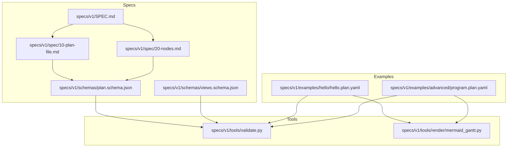
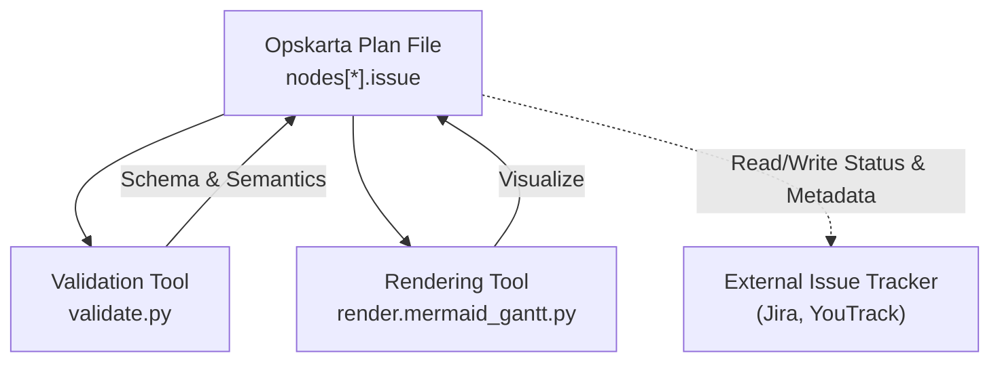
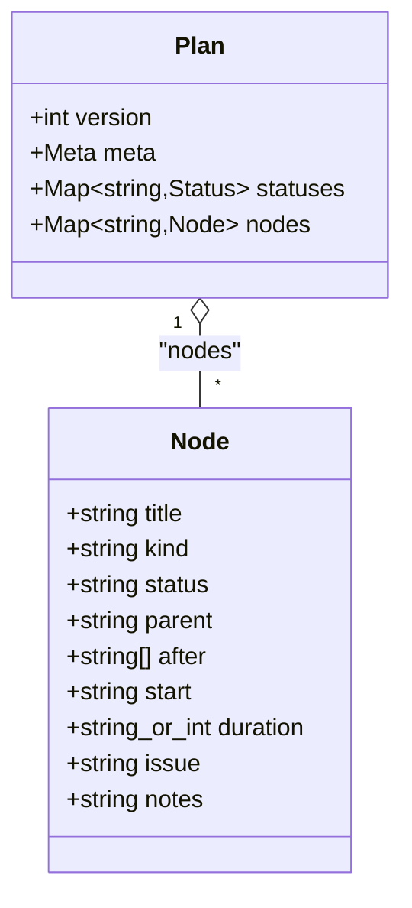
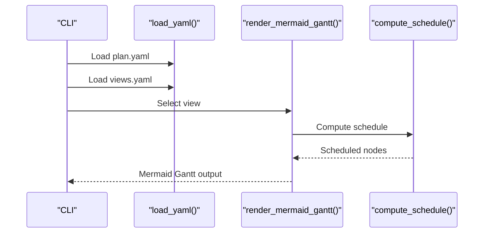
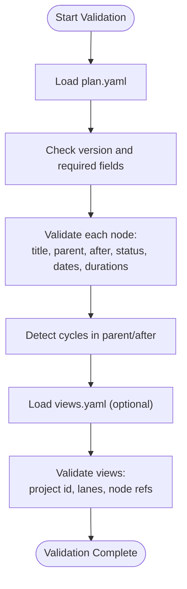
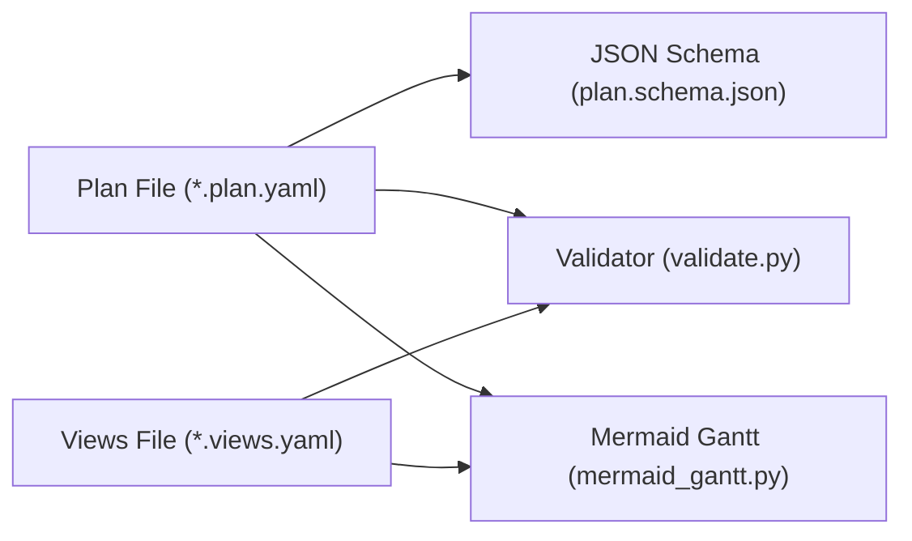

# Issue Tracking System Integration

<cite>
**Referenced Files in This Document**
- [README.md](file://README.md)
- [SPEC.md](file://specs/v1/SPEC.md)
- [plan.schema.json](file://specs/v1/schemas/plan.schema.json)
- [views.schema.json](file://specs/v1/schemas/views.schema.json)
- [20-nodes.md](file://specs/v1/spec/20-nodes.md)
- [10-plan-file.md](file://specs/v1/spec/10-plan-file.md)
- [validate.py](file://specs/v1/tools/validate.py)
- [mermaid_gantt.py](file://specs/v1/tools/render/mermaid_gantt.py)
- [hello.plan.yaml](file://specs/v1/examples/hello/hello.plan.yaml)
- [program.plan.yaml](file://specs/v1/examples/advanced/program.plan.yaml)
</cite>

## Table of Contents
1. [Introduction](#introduction)
2. [Project Structure](#project-structure)
3. [Core Components](#core-components)
4. [Architecture Overview](#architecture-overview)
5. [Detailed Component Analysis](#detailed-component-analysis)
6. [Integration Patterns with Issue Trackers](#integration-patterns-with-issue-trackers)
7. [Bidirectional Synchronization Strategies](#bidirectional-synchronization-strategies)
8. [Authentication and API Endpoints](#authentication-and-api-endpoints)
9. [Dependency Analysis](#dependency-analysis)
10. [Performance Considerations](#performance-considerations)
11. [Troubleshooting Guide](#troubleshooting-guide)
12. [Conclusion](#conclusion)

## Introduction
This document describes how to integrate Opskarta operational plans with external issue tracking systems such as Jira and YouTrack. It explains how to map operational map nodes to external entities via the issue field in plan files, outlines bidirectional synchronization strategies, and provides guidance on authentication, API endpoints, and common integration challenges.

Opskarta defines a plan file format that captures hierarchical work items, scheduling, status, and optional issue identifiers. The repository’s specification and tooling provide the foundation for building integrations that synchronize status, dependencies, and metadata between Opskarta and external systems.

## Project Structure
The repository organizes the Opskarta specification and tooling under specs/v1/. Key areas for integration:
- Plan and views schemas define the data contract for nodes, statuses, scheduling, and the optional issue field.
- Example plan files demonstrate practical usage of nodes, scheduling, and the issue field.
- Validation and rendering tools show how the format is processed and validated.

**Diagram sources**
- [SPEC.md](file://specs/v1/SPEC.md#L1-L407)
- [10-plan-file.md](file://specs/v1/spec/10-plan-file.md#L1-L30)
- [20-nodes.md](file://specs/v1/spec/20-nodes.md#L1-L37)
- [plan.schema.json](file://specs/v1/schemas/plan.schema.json#L1-L86)
- [views.schema.json](file://specs/v1/schemas/views.schema.json#L1-L26)
- [validate.py](file://specs/v1/tools/validate.py#L1-L752)
- [mermaid_gantt.py](file://specs/v1/tools/render/mermaid_gantt.py#L1-L549)
- [hello.plan.yaml](file://specs/v1/examples/hello/hello.plan.yaml#L1-L44)
- [program.plan.yaml](file://specs/v1/examples/advanced/program.plan.yaml#L1-L326)

**Section sources**
- [README.md](file://README.md#L1-L96)
- [SPEC.md](file://specs/v1/SPEC.md#L1-L407)

## Core Components
- Plan file: Defines version, metadata, statuses, and nodes. Nodes support scheduling, hierarchy, and the optional issue field.
- Views file: Describes how to render plans (e.g., Gantt lanes) and links to a plan via project id.
- Validation tool: Enforces schema and semantic rules for plan and views files.
- Rendering tool: Produces Mermaid Gantt output from a selected view.

Key integration enablers:
- The issue field in nodes allows mapping to external system identifiers.
- The extensibility mechanism supports additional fields without breaking compatibility.

**Section sources**
- [10-plan-file.md](file://specs/v1/spec/10-plan-file.md#L1-L30)
- [20-nodes.md](file://specs/v1/spec/20-nodes.md#L1-L37)
- [plan.schema.json](file://specs/v1/schemas/plan.schema.json#L1-L86)
- [views.schema.json](file://specs/v1/schemas/views.schema.json#L1-L26)
- [validate.py](file://specs/v1/tools/validate.py#L135-L329)
- [mermaid_gantt.py](file://specs/v1/tools/render/mermaid_gantt.py#L349-L432)

## Architecture Overview
The integration architecture centers on the plan file as the single source of truth for operational work. External systems (e.g., Jira, YouTrack) are treated as consumers or producers of status and dependency updates. The issue field in nodes serves as the canonical link between Opskarta and external systems.

**Diagram sources**
- [validate.py](file://specs/v1/tools/validate.py#L135-L329)
- [mermaid_gantt.py](file://specs/v1/tools/render/mermaid_gantt.py#L349-L432)
- [plan.schema.json](file://specs/v1/schemas/plan.schema.json#L73-L75)
- [20-nodes.md](file://specs/v1/spec/20-nodes.md#L29-L29)

## Detailed Component Analysis

### Plan File and Node Model
- The plan file defines nodes with optional scheduling and the issue field.
- The JSON schema explicitly includes the issue property, confirming its presence in the data model.
- The specification documents the recommended node kinds and the semantics of the issue field.

**Diagram sources**
- [plan.schema.json](file://specs/v1/schemas/plan.schema.json#L11-L82)
- [20-nodes.md](file://specs/v1/spec/20-nodes.md#L5-L31)

**Section sources**
- [10-plan-file.md](file://specs/v1/spec/10-plan-file.md#L1-L30)
- [20-nodes.md](file://specs/v1/spec/20-nodes.md#L1-L37)
- [plan.schema.json](file://specs/v1/schemas/plan.schema.json#L73-L75)

### Views File and Rendering
- Views files link to a plan via project id and define Gantt lanes.
- The rendering tool consumes a selected view to produce Mermaid Gantt output.
- While rendering does not directly write to external systems, it demonstrates how nodes and statuses are interpreted for visualization.

**Diagram sources**
- [mermaid_gantt.py](file://specs/v1/tools/render/mermaid_gantt.py#L439-L549)
- [mermaid_gantt.py](file://specs/v1/tools/render/mermaid_gantt.py#L349-L432)
- [mermaid_gantt.py](file://specs/v1/tools/render/mermaid_gantt.py#L279-L293)

**Section sources**
- [SPEC.md](file://specs/v1/SPEC.md#L98-L131)
- [views.schema.json](file://specs/v1/schemas/views.schema.json#L1-L26)
- [mermaid_gantt.py](file://specs/v1/tools/render/mermaid_gantt.py#L349-L432)

### Validation Pipeline
- The validator checks schema compliance and semantic correctness (references, cycles).
- It ensures that nodes, statuses, and scheduling fields conform to expectations, including the presence of the issue field when used.

**Diagram sources**
- [validate.py](file://specs/v1/tools/validate.py#L135-L329)
- [validate.py](file://specs/v1/tools/validate.py#L431-L579)

**Section sources**
- [validate.py](file://specs/v1/tools/validate.py#L135-L329)
- [validate.py](file://specs/v1/tools/validate.py#L431-L579)

## Integration Patterns with Issue Trackers
This section outlines integration patterns for mapping Opskarta nodes to external issue tracking systems. These patterns are derived from the presence of the issue field and the extensibility mechanism.

- Node-to-issue mapping
  - Use the issue field in nodes to store external system identifiers (e.g., Jira keys or YouTrack issue ids).
  - Example references:
    - Node issue field definition: [20-nodes.md](file://specs/v1/spec/20-nodes.md#L29-L29)
    - JSON schema for issue: [plan.schema.json](file://specs/v1/schemas/plan.schema.json#L73-L75)
    - Example plan with scheduling and issue-like fields: [hello.plan.yaml](file://specs/v1/examples/hello/hello.plan.yaml#L13-L44), [program.plan.yaml](file://specs/v1/examples/advanced/program.plan.yaml#L16-L326)

- Extending node metadata
  - Add custom fields (e.g., external URLs, labels) using the extensibility namespace to carry system-specific attributes alongside the issue identifier.
  - Reference: [SPEC.md](file://specs/v1/SPEC.md#L383-L407)

- Views alignment
  - Use views to group nodes for reporting and dashboards, enabling cross-references between Opskarta lanes and external tracker views.

**Section sources**
- [20-nodes.md](file://specs/v1/spec/20-nodes.md#L29-L29)
- [plan.schema.json](file://specs/v1/schemas/plan.schema.json#L73-L75)
- [SPEC.md](file://specs/v1/SPEC.md#L383-L407)
- [hello.plan.yaml](file://specs/v1/examples/hello/hello.plan.yaml#L13-L44)
- [program.plan.yaml](file://specs/v1/examples/advanced/program.plan.yaml#L16-L326)

## Bidirectional Synchronization Strategies
The repository does not prescribe specific synchronization logic; however, the data model supports robust synchronization strategies.

- Status synchronization
  - Map Opskarta statuses to external tracker workflows. For example, map in_progress and done to corresponding states in Jira or YouTrack.
  - Use the issue field to correlate records and update status in both directions.
  - Reference statuses definition: [SPEC.md](file://specs/v1/SPEC.md#L134-L156)

- Dependency mapping
  - Use the after field to represent finish-to-start dependencies. Synchronize these dependencies to external trackers that support linked issues or subtasks.
  - Reference dependency semantics: [SPEC.md](file://specs/v1/SPEC.md#L159-L238)

- Data transformation
  - Transform scheduling fields (start, duration) into external tracker equivalents (planned start, story points, or time estimates).
  - Reference scheduling fields: [20-nodes.md](file://specs/v1/spec/20-nodes.md#L25-L28)

- Conflict resolution
  - Establish precedence rules for concurrent edits (e.g., external system wins, Opskarta wins, or manual override).
  - Use the issue field as a conflict anchor to reconcile differences.

- Change detection
  - Compare last-modified timestamps or change lists to minimize unnecessary writes.
  - Maintain a local cache keyed by the issue field for efficient lookup.

[No sources needed since this section synthesizes patterns from referenced files without quoting code]

## Authentication and API Endpoints
The repository does not include specific API endpoint definitions or authentication mechanisms for Jira or YouTrack. To implement integration:
- Determine the target system’s REST API and authentication method (e.g., basic auth, personal access tokens, OAuth).
- Define endpoints for reading/updating issues, transitions, comments, and attachments.
- Apply rate limiting and retry policies appropriate for the external system.

[No sources needed since this section provides general guidance]

## Dependency Analysis
The integration depends on the plan file’s structure and the validation pipeline to ensure data integrity.

**Diagram sources**
- [plan.schema.json](file://specs/v1/schemas/plan.schema.json#L1-L86)
- [validate.py](file://specs/v1/tools/validate.py#L135-L329)
- [mermaid_gantt.py](file://specs/v1/tools/render/mermaid_gantt.py#L349-L432)
- [views.schema.json](file://specs/v1/schemas/views.schema.json#L1-L26)

**Section sources**
- [plan.schema.json](file://specs/v1/schemas/plan.schema.json#L1-L86)
- [validate.py](file://specs/v1/tools/validate.py#L135-L329)
- [mermaid_gantt.py](file://specs/v1/tools/render/mermaid_gantt.py#L349-L432)
- [views.schema.json](file://specs/v1/schemas/views.schema.json#L1-L26)

## Performance Considerations
- Minimize API calls by batching reads/writes and caching external records keyed by the issue field.
- Use incremental synchronization to avoid scanning entire projects.
- Respect external system rate limits and implement exponential backoff.
- Validate locally before bulk operations to reduce remote failures.

[No sources needed since this section provides general guidance]

## Troubleshooting Guide
Common integration issues and remedies grounded in the repository’s validation and rendering tools:

- Invalid references or cycles
  - Symptoms: Validation errors indicating invalid parent/after references or cyclic dependencies.
  - Actions: Fix node references and remove cycles; re-run validation.
  - References: [validate.py](file://specs/v1/tools/validate.py#L230-L297), [validate.py](file://specs/v1/tools/validate.py#L325-L403)

- Incorrect date or duration formats
  - Symptoms: Validation errors for start or duration fields.
  - Actions: Ensure start follows YYYY-MM-DD and duration follows <number>d or integer days.
  - References: [validate.py](file://specs/v1/tools/validate.py#L299-L324), [SPEC.md](file://specs/v1/SPEC.md#L159-L238)

- Views mismatch with plan
  - Symptoms: Errors indicating project id mismatch or missing node references in views.
  - Actions: Align views.project with plan.meta.id and ensure all node ids in lanes exist in the plan.
  - References: [validate.py](file://specs/v1/tools/validate.py#L431-L579), [views.schema.json](file://specs/v1/schemas/views.schema.json#L15-L18)

- Rendering failures
  - Symptoms: Scheduling errors when computing start/finish dates or missing schedule for container nodes.
  - Actions: Provide explicit start/duration for nodes requiring scheduling; confirm statuses and emojis are supported by the renderer.
  - References: [mermaid_gantt.py](file://specs/v1/tools/render/mermaid_gantt.py#L349-L432), [mermaid_gantt.py](file://specs/v1/tools/render/mermaid_gantt.py#L279-L293)

**Section sources**
- [validate.py](file://specs/v1/tools/validate.py#L230-L403)
- [validate.py](file://specs/v1/tools/validate.py#L431-L579)
- [SPEC.md](file://specs/v1/SPEC.md#L159-L238)
- [mermaid_gantt.py](file://specs/v1/tools/render/mermaid_gantt.py#L349-L432)
- [mermaid_gantt.py](file://specs/v1/tools/render/mermaid_gantt.py#L279-L293)

## Conclusion
Opskarta’s plan file format, with the issue field and extensibility mechanism, provides a solid foundation for integrating with external issue tracking systems. By aligning statuses, dependencies, and scheduling data, teams can achieve reliable bidirectional synchronization. The included validation and rendering tools help ensure data integrity and enable effective reporting. Implementers should focus on robust conflict resolution, careful authentication, and performance-aware batch operations to maintain consistency and responsiveness.