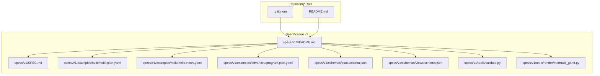
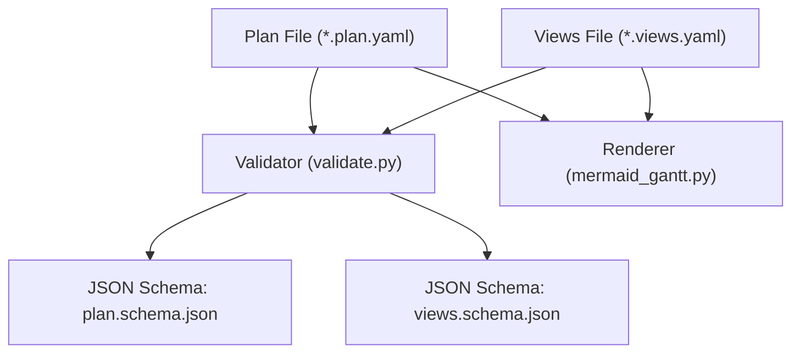
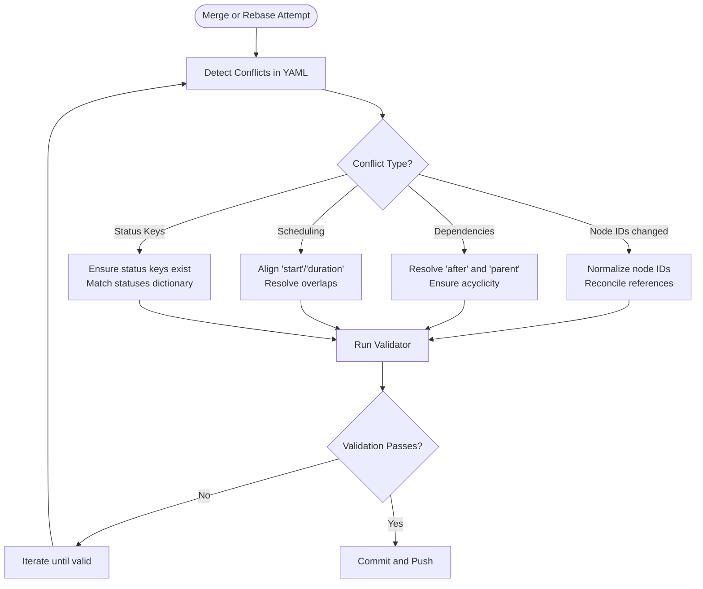
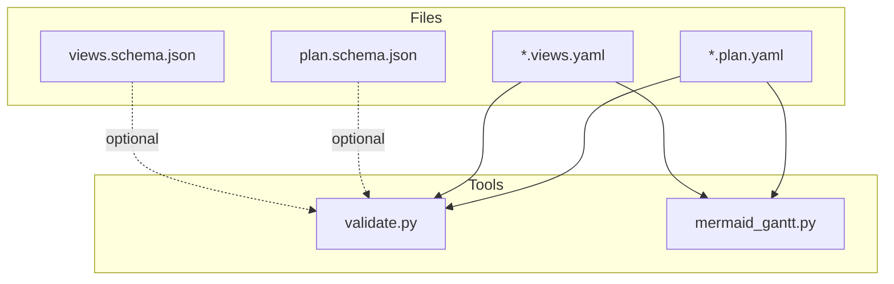

# Version Control System Integration

<cite>
**Referenced Files in This Document**
- [.gitignore](file://.gitignore)
- [README.md](file://README.md)
- [specs/v1/README.md](file://specs/v1/README.md)
- [specs/v1/SPEC.md](file://specs/v1/SPEC.md)
- [specs/v1/examples/hello/hello.plan.yaml](file://specs/v1/examples/hello/hello.plan.yaml)
- [specs/v1/examples/hello/hello.views.yaml](file://specs/v1/examples/hello/hello.views.yaml)
- [specs/v1/examples/advanced/program.plan.yaml](file://specs/v1/examples/advanced/program.plan.yaml)
- [specs/v1/schemas/plan.schema.json](file://specs/v1/schemas/plan.schema.json)
- [specs/v1/schemas/views.schema.json](file://specs/v1/schemas/views.schema.json)
- [specs/v1/tools/validate.py](file://specs/v1/tools/validate.py)
- [specs/v1/tools/render/mermaid_gantt.py](file://specs/v1/tools/render/mermaid_gantt.py)
</cite>

## Table of Contents
1. [Introduction](#introduction)
2. [Project Structure](#project-structure)
3. [Core Components](#core-components)
4. [Architecture Overview](#architecture-overview)
5. [Detailed Component Analysis](#detailed-component-analysis)
6. [Dependency Analysis](#dependency-analysis)
7. [Performance Considerations](#performance-considerations)
8. [Troubleshooting Guide](#troubleshooting-guide)
9. [Conclusion](#conclusion)
10. [Appendices](#appendices)

## Introduction
This document provides practical guidance for integrating Opskarta operational map files with a version control system (VCS), focusing on Git. It explains how to store plan and views files, manage branching for alternative scenarios (“what if”), leverage Git’s diff capabilities for change tracking, coordinate concurrent edits, maintain a clear version history, resolve conflicts, automate backups, and integrate with CI/CD pipelines. The guidance is grounded in the repository’s YAML-based operational map format and the included validation and rendering tools.

## Project Structure
Opskarta operational maps consist of two primary file types:
- Plan files (`.plan.yaml`): Define the project structure, statuses, nodes, scheduling, and metadata.
- Views files (`.views.yaml`): Define how to render the plan (e.g., Gantt lanes and exclusions).

These files are stored alongside the specification and tooling under the v1 specification directory. The repository also includes JSON Schemas for machine-readable validation and a validator/renderer toolchain.

**Diagram sources**
- [.gitignore](file://.gitignore#L1-L37)
- [README.md](file://README.md#L1-L96)
- [specs/v1/README.md](file://specs/v1/README.md#L1-L27)
- [specs/v1/SPEC.md](file://specs/v1/SPEC.md#L1-L407)
- [specs/v1/examples/hello/hello.plan.yaml](file://specs/v1/examples/hello/hello.plan.yaml#L1-L44)
- [specs/v1/examples/hello/hello.views.yaml](file://specs/v1/examples/hello/hello.views.yaml#L1-L13)
- [specs/v1/examples/advanced/program.plan.yaml](file://specs/v1/examples/advanced/program.plan.yaml#L1-L326)
- [specs/v1/schemas/plan.schema.json](file://specs/v1/schemas/plan.schema.json#L1-L86)
- [specs/v1/schemas/views.schema.json](file://specs/v1/schemas/views.schema.json#L1-L26)
- [specs/v1/tools/validate.py](file://specs/v1/tools/validate.py#L1-L752)
- [specs/v1/tools/render/mermaid_gantt.py](file://specs/v1/tools/render/mermaid_gantt.py#L1-L549)

**Section sources**
- [.gitignore](file://.gitignore#L1-L37)
- [README.md](file://README.md#L1-L96)
- [specs/v1/README.md](file://specs/v1/README.md#L1-L27)

## Core Components
- Plan files define the operational map: version, metadata, statuses, and nodes with hierarchical and temporal relationships.
- Views files define rendering targets (e.g., Gantt views) and link to nodes in the plan.
- Validation and rendering tools operate on these files to ensure correctness and produce outputs (e.g., Mermaid Gantt).

Key operational map concepts relevant to VCS:
- Nodes are identified by stable IDs; changing IDs can cause diffs and break links.
- Dependencies via `after` and hierarchy via `parent` form acyclic graphs; cycles are invalid.
- Scheduling fields (`start`, `duration`) drive temporal rendering and diffs.
- Status keys must match those declared in the statuses dictionary.

**Section sources**
- [specs/v1/SPEC.md](file://specs/v1/SPEC.md#L27-L96)
- [specs/v1/SPEC.md](file://specs/v1/SPEC.md#L98-L156)
- [specs/v1/SPEC.md](file://specs/v1/SPEC.md#L159-L238)
- [specs/v1/SPEC.md](file://specs/v1/SPEC.md#L241-L380)
- [specs/v1/examples/hello/hello.plan.yaml](file://specs/v1/examples/hello/hello.plan.yaml#L1-L44)
- [specs/v1/examples/hello/hello.views.yaml](file://specs/v1/examples/hello/hello.views.yaml#L1-L13)

## Architecture Overview
The following diagram shows how Opskarta files relate to each other and how Git tracks them.

**Diagram sources**
- [specs/v1/schemas/plan.schema.json](file://specs/v1/schemas/plan.schema.json#L1-L86)
- [specs/v1/schemas/views.schema.json](file://specs/v1/schemas/views.schema.json#L1-L26)
- [specs/v1/tools/validate.py](file://specs/v1/tools/validate.py#L1-L752)
- [specs/v1/tools/render/mermaid_gantt.py](file://specs/v1/tools/render/mermaid_gantt.py#L1-L549)

## Detailed Component Analysis

### Git Workflows for Opskarta Files
Recommended workflows for managing operational maps in Git:

- Feature editing workflow
  - Create a feature branch per change or scenario.
  - Edit plan and views files locally; validate with the provided validator.
  - Commit small, focused changes; push the branch.
  - Open a pull request for review; address comments by amending commits.
  - Merge via squash-and-merge or rebase-merge to keep history linear.

- Scenario branching workflow
  - Create scenario branches prefixed with a convention like scenario/<scenario-name>.
  - Use scenario branches to explore alternative plans (e.g., alternate roll-out strategies).
  - Merge approved scenarios into main via pull requests.

- Collaborative planning workflow
  - Assign ownership to lanes/nodes via custom fields (see spec) to reduce contention.
  - Use short-lived feature branches; rebase frequently to minimize conflicts.
  - Validate before pushing; enforce pre-commit checks in CI.

- Backup and disaster recovery
  - Keep a remote origin (e.g., main branch protected).
  - Tag releases with meaningful tags (e.g., v1.0.0) to mark stable snapshots.
  - Periodically export rendered outputs (e.g., Mermaid) for archival.

- CI/CD integration
  - Run validation on pull requests to prevent invalid merges.
  - Optionally run rendering to generate artifacts (e.g., Gantt diagrams) for review.
  - Gate merges on successful validation and approvals.

Branch naming conventions for scenarios:
- scenario/<brief-description-of-the-scenario>
- Examples: scenario/alternate-rollout, scenario/higher-risk-path, scenario/with-fallback

Merge strategies:
- Prefer fast-forward merges for linear history.
- Use squash-and-merge for PRs to consolidate changes.
- For scenarios, merge approved branches into main or a dedicated scenario branch.

Conflict resolution:
- Resolve conflicts by editing the affected nodes and dependencies.
- Re-run validation to ensure acyclicity and referential integrity.
- If conflicts arise in scheduling fields, align dates and durations to a single source of truth.

Automated backup strategies:
- Back up plan and views files to a secondary remote or archive branch.
- Export rendered outputs periodically for immutable records.

**Section sources**
- [specs/v1/README.md](file://specs/v1/README.md#L1-L27)
- [specs/v1/SPEC.md](file://specs/v1/SPEC.md#L241-L380)
- [specs/v1/tools/validate.py](file://specs/v1/tools/validate.py#L634-L752)

### Leveraging Git Diff for Operational Map Changes
- YAML structure changes: diffs highlight additions, deletions, and modifications to nodes, statuses, and dependencies.
- Dependency changes: diffs clearly show updates to `after`, `parent`, and scheduling fields.
- Status and metadata changes: diffs surface updates to status definitions and node status assignments.
- Views linkage: diffs reveal changes to lanes and node references in views.

Best practices:
- Keep related changes in the same commit to improve diff readability.
- Use descriptive commit messages that explain the intent and impact of changes.
- Review diffs carefully for unintended cycles or broken references.

**Section sources**
- [specs/v1/examples/hello/hello.plan.yaml](file://specs/v1/examples/hello/hello.plan.yaml#L1-L44)
- [specs/v1/examples/hello/hello.views.yaml](file://specs/v1/examples/hello/hello.views.yaml#L1-L13)
- [specs/v1/SPEC.md](file://specs/v1/SPEC.md#L241-L380)

### Managing Concurrent Modifications
- Use feature branches to isolate changes.
- Rebase frequently to incorporate upstream changes and avoid divergence.
- Validate locally before merging to catch errors early.
- For shared nodes or lanes, communicate ownership and coordinate edits.

**Section sources**
- [specs/v1/tools/validate.py](file://specs/v1/tools/validate.py#L634-L752)

### Maintaining Version History
- Use semantic commit messages and concise summaries.
- Tag releases to mark stable snapshots.
- Keep a changelog or rely on Git history for auditability.

**Section sources**
- [README.md](file://README.md#L85-L96)

### Conflict Resolution Patterns

**Diagram sources**
- [specs/v1/tools/validate.py](file://specs/v1/tools/validate.py#L135-L425)
- [specs/v1/SPEC.md](file://specs/v1/SPEC.md#L241-L380)

**Section sources**
- [specs/v1/tools/validate.py](file://specs/v1/tools/validate.py#L135-L425)
- [specs/v1/SPEC.md](file://specs/v1/SPEC.md#L241-L380)

### Example Git Workflows for Opskarta

- Workflow: Adding a new phase with tasks
  - Create branch: git checkout -b feature/add-new-phase
  - Edit plan to add nodes and dependencies
  - Validate: python tools/validate.py *.plan.yaml *.views.yaml
  - Commit and push; open PR; merge after review

- Workflow: Exploring a scenario
  - Create branch: git checkout -b scenario/alternate-rollout
  - Modify plan to reflect alternate strategy
  - Validate and render Gantt for review
  - Merge approved scenario into main

- Workflow: Coordinated edit on shared lane
  - One person owns the lane; others coordinate edits
  - Rebase branch regularly; resolve conflicts locally
  - Validate and push

**Section sources**
- [specs/v1/examples/hello/README.md](file://specs/v1/examples/hello/README.md#L28-L53)
- [specs/v1/tools/validate.py](file://specs/v1/tools/validate.py#L634-L752)
- [specs/v1/tools/render/mermaid_gantt.py](file://specs/v1/tools/render/mermaid_gantt.py#L439-L549)

## Dependency Analysis
The following diagram shows how the validator and renderer depend on plan and views files and their schemas.

**Diagram sources**
- [specs/v1/tools/validate.py](file://specs/v1/tools/validate.py#L1-L752)
- [specs/v1/tools/render/mermaid_gantt.py](file://specs/v1/tools/render/mermaid_gantt.py#L1-L549)
- [specs/v1/schemas/plan.schema.json](file://specs/v1/schemas/plan.schema.json#L1-L86)
- [specs/v1/schemas/views.schema.json](file://specs/v1/schemas/views.schema.json#L1-L26)

**Section sources**
- [specs/v1/tools/validate.py](file://specs/v1/tools/validate.py#L1-L752)
- [specs/v1/tools/render/mermaid_gantt.py](file://specs/v1/tools/render/mermaid_gantt.py#L1-L549)
- [specs/v1/schemas/plan.schema.json](file://specs/v1/schemas/plan.schema.json#L1-L86)
- [specs/v1/schemas/views.schema.json](file://specs/v1/schemas/views.schema.json#L1-L26)

## Performance Considerations
- Keep files modular: split large plans into smaller, cohesive units when feasible.
- Prefer incremental changes to reduce merge conflicts and diff sizes.
- Use the validator to catch issues early, avoiding expensive re-renders.

[No sources needed since this section provides general guidance]

## Troubleshooting Guide
Common issues and resolutions:
- Validation failures due to missing or invalid fields
  - Ensure required fields are present and formatted correctly.
  - Verify status keys and node IDs referenced in dependencies and views.
- Cyclic dependencies
  - Remove or adjust `after` or `parent` links to form an acyclic graph.
- Schema mismatches
  - Align with JSON Schemas for plan and views to ensure compatibility.
- Rendering errors
  - Confirm that views reference existing nodes and that scheduling is consistent.

Recommended commands:
- Validate: python tools/validate.py *.plan.yaml *.views.yaml
- List views: python -m render.mermaid_gantt --plan *.plan.yaml --views *.views.yaml --list-views
- Render Gantt: python -m render.mermaid_gantt --plan *.plan.yaml --views *.views.yaml --view <view-id> [--output out.md]

**Section sources**
- [specs/v1/tools/validate.py](file://specs/v1/tools/validate.py#L634-L752)
- [specs/v1/tools/render/mermaid_gantt.py](file://specs/v1/tools/render/mermaid_gantt.py#L439-L549)
- [specs/v1/schemas/plan.schema.json](file://specs/v1/schemas/plan.schema.json#L1-L86)
- [specs/v1/schemas/views.schema.json](file://specs/v1/schemas/views.schema.json#L1-L26)

## Conclusion
By adopting structured Git workflows, validating changes before merging, and leveraging Git’s diff capabilities, teams can effectively collaborate on Opskarta operational maps. Scenario branches enable safe experimentation, while CI/CD integration ensures quality and consistency. Clear branching conventions, conflict resolution procedures, and automated validation form the backbone of a robust version-controlled operational planning process.

[No sources needed since this section summarizes without analyzing specific files]

## Appendices

### Appendix A: Example Files Overview
- Minimal plan: demonstrates the simplest valid plan structure.
- Hello example: shows a basic plan with phases and tasks, plus a views file for Gantt rendering.
- Advanced program plan: illustrates a multi-track, multi-epic plan with extensive dependencies and custom extensions.

**Section sources**
- [specs/v1/examples/minimal/project.plan.yaml](file://specs/v1/examples/minimal/project.plan.yaml#L1-L6)
- [specs/v1/examples/hello/hello.plan.yaml](file://specs/v1/examples/hello/hello.plan.yaml#L1-L44)
- [specs/v1/examples/hello/hello.views.yaml](file://specs/v1/examples/hello/hello.views.yaml#L1-L13)
- [specs/v1/examples/advanced/program.plan.yaml](file://specs/v1/examples/advanced/program.plan.yaml#L1-L326)