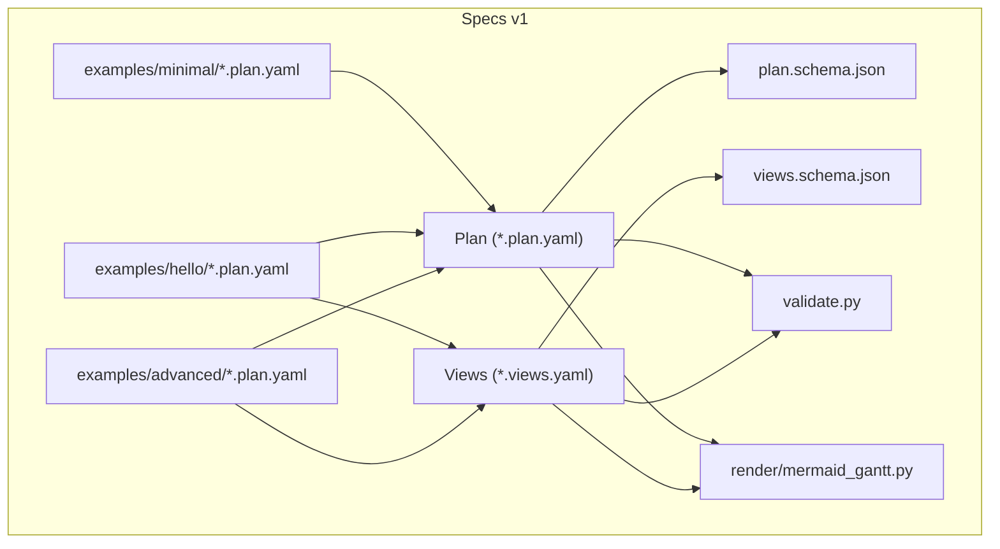
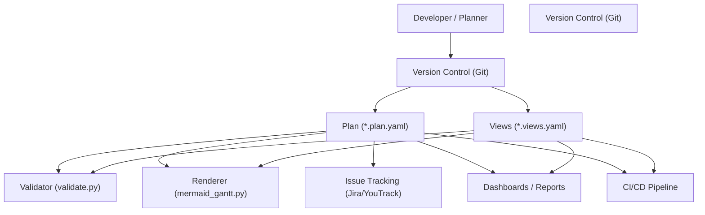
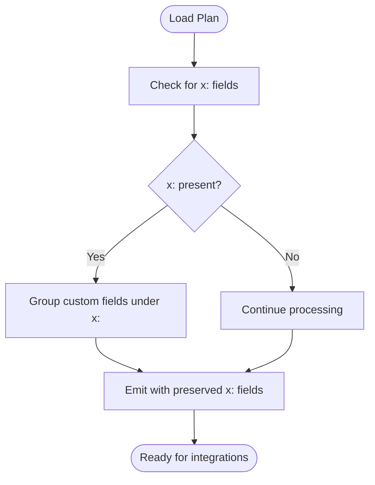
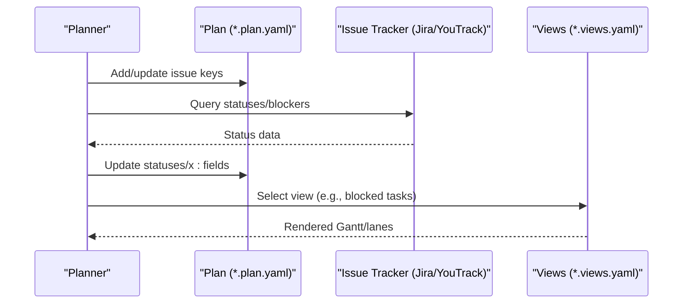
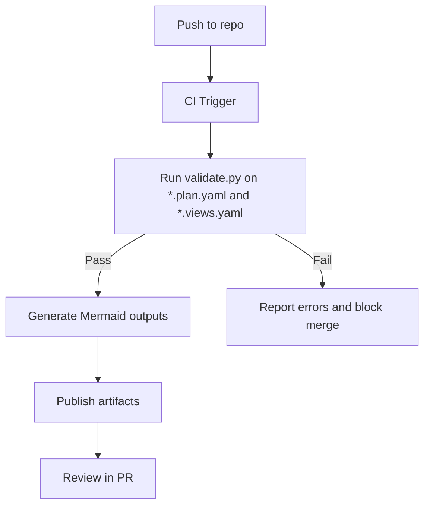
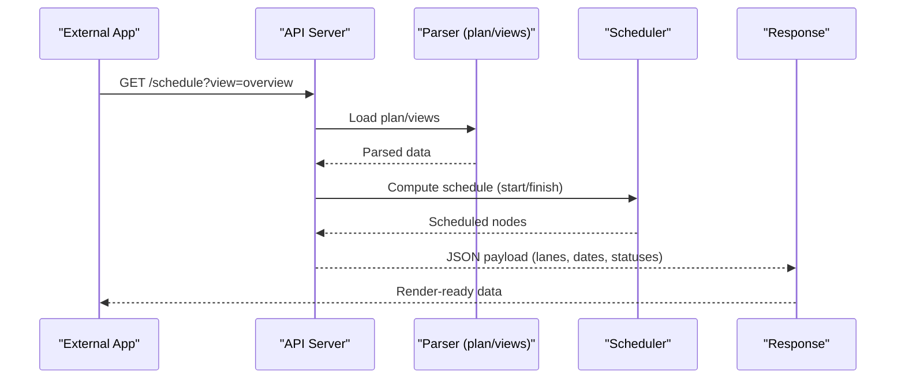
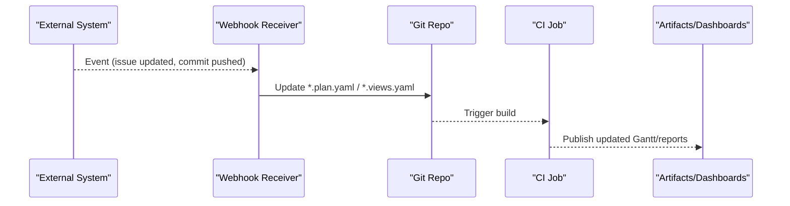
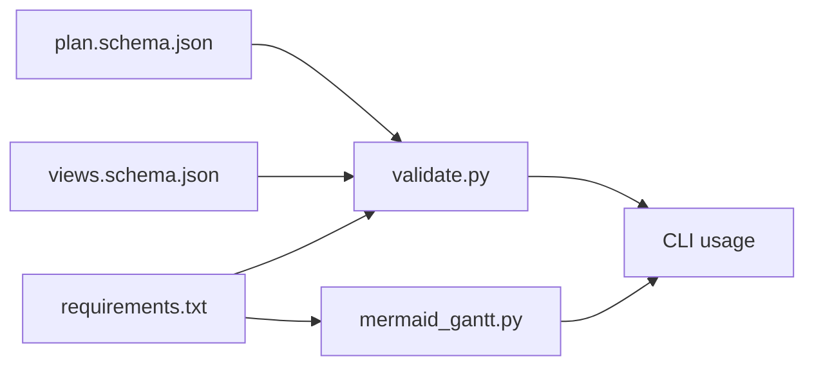
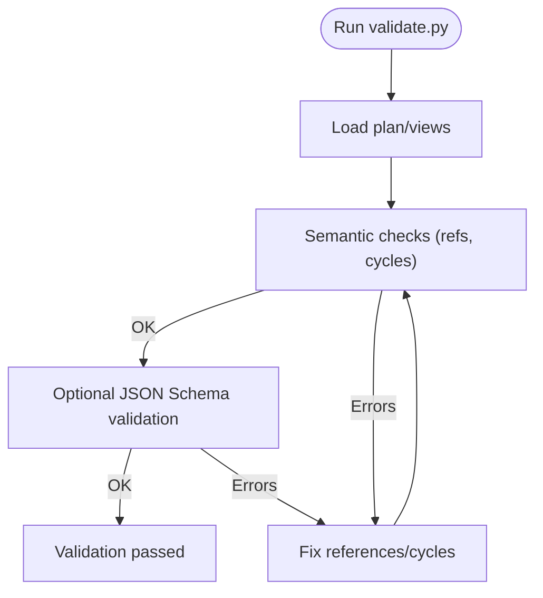

# Integration Guide

<cite>
**Referenced Files in This Document**
- [README.md](file://README.md)
- [SPEC.md](file://specs/v1/SPEC.md)
- [plan.schema.json](file://specs/v1/schemas/plan.schema.json)
- [views.schema.json](file://specs/v1/schemas/views.schema.json)
- [validate.py](file://specs/v1/tools/validate.py)
- [mermaid_gantt.py](file://specs/v1/tools/render/mermaid_gantt.py)
- [build_spec.py](file://specs/v1/tools/build_spec.py)
- [requirements.txt](file://specs/v1/tools/requirements.txt)
- [method.md](file://docs/method.md)
- [hello.plan.yaml](file://specs/v1/examples/hello/hello.plan.yaml)
- [hello.views.yaml](file://specs/v1/examples/hello/hello.views.yaml)
- [program.plan.yaml](file://specs/v1/examples/advanced/program.plan.yaml)
- [program.views.yaml](file://specs/v1/examples/advanced/program.views.yaml)
- [SECURITY.md](file://SECURITY.md)
</cite>

## Table of Contents
1. [Introduction](#introduction)
2. [Project Structure](#project-structure)
3. [Core Components](#core-components)
4. [Architecture Overview](#architecture-overview)
5. [Detailed Component Analysis](#detailed-component-analysis)
6. [Dependency Analysis](#dependency-analysis)
7. [Performance Considerations](#performance-considerations)
8. [Troubleshooting Guide](#troubleshooting-guide)
9. [Conclusion](#conclusion)
10. [Appendices](#appendices)

## Introduction
This guide explains how to integrate Opskarta operational maps with external systems and workflows. It focuses on:
- Connecting operational maps to issue tracking systems (Jira, YouTrack) and version control (Git)
- Integrating with CI/CD pipelines
- Using the extension field system with the x: namespace for custom properties and third-party integrations
- Exposing operational map data via APIs and rendering pipelines
- Implementing webhooks, synchronization strategies, and real-time update patterns
- Best practices for collaborative environments, concurrent edits, security, access control, and audit trails

Opskarta separates the authoritative model (plan) from views, enabling flexible rendering and integration with external tools while preserving a single source of truth in version control.

## Project Structure
The repository organizes specification, schemas, examples, and tooling under specs/v1/. The key artifacts for integration are:
- Plan files (*.plan.yaml): the authoritative model of works, hierarchy, dependencies, and optional issue links
- Views files (*.views.yaml): declarative views over the plan for rendering and dashboards
- Schemas: JSON Schema definitions for plan and views
- Tools: validators and renderers for plan and views
- Examples: minimal and advanced plans and views demonstrating integration patterns

**Diagram sources**
- [SPEC.md](file://specs/v1/SPEC.md#L27-L131)
- [plan.schema.json](file://specs/v1/schemas/plan.schema.json#L1-L86)
- [views.schema.json](file://specs/v1/schemas/views.schema.json#L1-L26)
- [validate.py](file://specs/v1/tools/validate.py#L624-L752)
- [mermaid_gantt.py](file://specs/v1/tools/render/mermaid_gantt.py#L439-L549)
- [hello.plan.yaml](file://specs/v1/examples/hello/hello.plan.yaml#L1-L44)
- [hello.views.yaml](file://specs/v1/examples/hello/hello.views.yaml#L1-L13)
- [program.plan.yaml](file://specs/v1/examples/advanced/program.plan.yaml#L1-L326)
- [program.views.yaml](file://specs/v1/examples/advanced/program.views.yaml#L1-L93)

**Section sources**
- [SPEC.md](file://specs/v1/SPEC.md#L27-L131)
- [README.md](file://README.md#L1-L96)

## Core Components
- Plan model: defines version, metadata, statuses, and nodes with hierarchical and dependency relationships. Nodes can link to external issues and carry custom fields.
- Views: define how to render the plan (e.g., Gantt lanes) and enable multiple audiences without duplicating the model.
- Schemas: enforce structural and semantic constraints for plan and views.
- Validation and rendering tools: validate inputs and produce Mermaid Gantt outputs; can be extended to support other renderers and API exports.

Key integration hooks:
- issue field in nodes for linking to external systems
- x: namespace for custom properties and third-party integrations
- views for audience-specific rendering and dashboards

**Section sources**
- [SPEC.md](file://specs/v1/SPEC.md#L27-L131)
- [plan.schema.json](file://specs/v1/schemas/plan.schema.json#L11-L82)
- [views.schema.json](file://specs/v1/schemas/views.schema.json#L6-L25)
- [validate.py](file://specs/v1/tools/validate.py#L135-L329)
- [mermaid_gantt.py](file://specs/v1/tools/render/mermaid_gantt.py#L349-L433)

## Architecture Overview
The integration architecture centers on the plan as the single source of truth, with views and tools supporting downstream consumers.

**Diagram sources**
- [validate.py](file://specs/v1/tools/validate.py#L634-L752)
- [mermaid_gantt.py](file://specs/v1/tools/render/mermaid_gantt.py#L439-L549)
- [SPEC.md](file://specs/v1/SPEC.md#L27-L131)

## Detailed Component Analysis

### Extension Field System (x: namespace)
Opskarta supports arbitrary fields in nodes and top-level extensions. The recommended x: grouping avoids conflicts when multiple teams extend the format.

- Recommended usage: group custom fields under x: in nodes or at the top level of the plan
- Base tools must ignore unknown fields and preserve them during parse → emit when formatting requires it

**Diagram sources**
- [SPEC.md](file://specs/v1/SPEC.md#L383-L407)
- [program.plan.yaml](file://specs/v1/examples/advanced/program.plan.yaml#L296-L326)

**Section sources**
- [SPEC.md](file://specs/v1/SPEC.md#L383-L407)
- [program.plan.yaml](file://specs/v1/examples/advanced/program.plan.yaml#L296-L326)

### Integration Patterns with Issue Tracking Systems (Jira, YouTrack)
- Link external issues via the issue field in nodes
- Use the plan’s statuses to represent local interpretation; keep synchronization explicit and auditable
- Example pattern:
  - Onboarding: populate issue keys in nodes
  - Sync: periodically reconcile statuses and blockers from the issue tracker into the plan’s statuses or x: fields
  - Render: views can highlight blocked tasks or filter by issue labels/tags

**Diagram sources**
- [SPEC.md](file://specs/v1/SPEC.md#L87-L89)
- [hello.plan.yaml](file://specs/v1/examples/hello/hello.plan.yaml#L13-L44)
- [hello.views.yaml](file://specs/v1/examples/hello/hello.views.yaml#L4-L13)

**Section sources**
- [SPEC.md](file://specs/v1/SPEC.md#L87-L89)
- [hello.plan.yaml](file://specs/v1/examples/hello/hello.plan.yaml#L13-L44)
- [hello.views.yaml](file://specs/v1/examples/hello/hello.views.yaml#L4-L13)

### Version Control Integration (Git)
- Keep *.plan.yaml and *.views.yaml under version control
- Use branches for alternate scenarios (“what if”), experiments, and parallel plans
- Use diffs to track structural changes and maintain auditability

Recommended Git workflow:
- Feature branch per plan change
- Pull request with rendered diffs (e.g., Mermaid outputs) for review
- Merge to main with clear commit messages referencing related issues

**Section sources**
- [method.md](file://docs/method.md#L49-L54)
- [README.md](file://README.md#L72-L83)

### CI/CD Pipeline Integration
- Validate plans and views on every push or PR
- Generate artifacts (Mermaid, reports) as part of the pipeline
- Gate merges on successful validation and rendering

**Diagram sources**
- [validate.py](file://specs/v1/tools/validate.py#L634-L752)
- [mermaid_gantt.py](file://specs/v1/tools/render/mermaid_gantt.py#L439-L549)
- [requirements.txt](file://specs/v1/tools/requirements.txt#L1-L10)

**Section sources**
- [validate.py](file://specs/v1/tools/validate.py#L634-L752)
- [mermaid_gantt.py](file://specs/v1/tools/render/mermaid_gantt.py#L439-L549)
- [requirements.txt](file://specs/v1/tools/requirements.txt#L1-L10)

### API Development Patterns for Operational Map Data
While the repository does not include a built-in API server, you can expose operational map data using the following patterns:
- Parse plan and views with the provided tools
- Build lightweight API endpoints that serve computed schedules, filtered lanes, or aggregated metrics
- Use the x: namespace to surface integration-specific attributes (e.g., owners, risk, sync timestamps)

**Diagram sources**
- [mermaid_gantt.py](file://specs/v1/tools/render/mermaid_gantt.py#L217-L294)
- [validate.py](file://specs/v1/tools/validate.py#L135-L329)

**Section sources**
- [mermaid_gantt.py](file://specs/v1/tools/render/mermaid_gantt.py#L217-L294)
- [validate.py](file://specs/v1/tools/validate.py#L135-L329)

### Webhook Implementations and Real-Time Updates
- Webhook pattern: when external systems (e.g., Jira, Git) change, trigger a job that updates the plan’s statuses or x: fields, then re-renders views
- Real-time dashboards: publish rendered outputs to static hosting or internal dashboards; refresh on schedule or on-demand
- Git-based triggers: use Git hooks or CI events to regenerate artifacts when *.plan.yaml or *.views.yaml change

**Diagram sources**
- [SPEC.md](file://specs/v1/SPEC.md#L27-L131)
- [validate.py](file://specs/v1/tools/validate.py#L634-L752)

**Section sources**
- [SPEC.md](file://specs/v1/SPEC.md#L27-L131)
- [validate.py](file://specs/v1/tools/validate.py#L634-L752)

### Data Synchronization Strategies
- Pull-based sync: periodically fetch statuses from issue trackers and update plan statuses or x: fields
- Push-based sync: external systems notify via webhooks to update the plan
- Conflict resolution: prefer explicit reconciliation steps; record sync timestamps and last-known states in x: fields
- Idempotency: ensure repeated syncs do not cause drift; compare and merge only changed fields

**Section sources**
- [SPEC.md](file://specs/v1/SPEC.md#L87-L89)
- [program.plan.yaml](file://specs/v1/examples/advanced/program.plan.yaml#L296-L326)

### Collaborative Environments and Concurrent Modifications
- Single source of truth in Git; avoid real-time concurrent edits to the same files
- Branch-per-scenario to explore alternatives safely
- Use pull requests to review structural changes; include rendered diffs for clarity
- Keep views minimal and focused to reduce merge conflicts

**Section sources**
- [method.md](file://docs/method.md#L73-L98)
- [README.md](file://README.md#L72-L83)

### Security Considerations, Access Control, and Audit Trails
- Treat *.plan.yaml and *.views.yaml as sensitive configuration; restrict write access appropriately
- Use CI gates to enforce validation and rendering before merging
- Record audit events (who changed what, when) in Git history; optionally augment x: fields with metadata for integrations
- Follow responsible disclosure for security issues

**Section sources**
- [SECURITY.md](file://SECURITY.md#L1-L10)
- [validate.py](file://specs/v1/tools/validate.py#L634-L752)

## Dependency Analysis
The tools depend on PyYAML for parsing; optional JSON Schema validation requires jsonschema. The plan and views schemas define the contract for validation.

**Diagram sources**
- [plan.schema.json](file://specs/v1/schemas/plan.schema.json#L1-L86)
- [views.schema.json](file://specs/v1/schemas/views.schema.json#L1-L26)
- [validate.py](file://specs/v1/tools/validate.py#L634-L752)
- [mermaid_gantt.py](file://specs/v1/tools/render/mermaid_gantt.py#L439-L549)
- [requirements.txt](file://specs/v1/tools/requirements.txt#L1-L10)

**Section sources**
- [plan.schema.json](file://specs/v1/schemas/plan.schema.json#L1-L86)
- [views.schema.json](file://specs/v1/schemas/views.schema.json#L1-L26)
- [validate.py](file://specs/v1/tools/validate.py#L634-L752)
- [mermaid_gantt.py](file://specs/v1/tools/render/mermaid_gantt.py#L439-L549)
- [requirements.txt](file://specs/v1/tools/requirements.txt#L1-L10)

## Performance Considerations
- Prefer batch operations for syncing statuses from external systems
- Cache rendered outputs and invalidate only affected views
- Use views to limit rendering scope for large plans
- Keep x: fields concise to minimize parse/emit overhead

## Troubleshooting Guide
Common issues and resolutions:
- Validation errors for missing or invalid fields: ensure version, nodes, and required node.title are present; check parent/after/status references
- Cycle detection in parent or after dependencies: resolve cycles before validating or rendering
- JSON Schema validation failures: install optional jsonschema dependency and validate against the provided schemas
- Rendering errors: confirm the selected view exists and references valid node IDs

**Diagram sources**
- [validate.py](file://specs/v1/tools/validate.py#L634-L752)

**Section sources**
- [validate.py](file://specs/v1/tools/validate.py#L135-L329)
- [validate.py](file://specs/v1/tools/validate.py#L586-L618)
- [validate.py](file://specs/v1/tools/validate.py#L634-L752)

## Conclusion
Opskarta provides a robust, extensible foundation for operational map integration. By keeping the plan as the single source of truth, leveraging the x: namespace for custom integrations, and using views for audience-specific rendering, teams can connect Opskarta to issue trackers, version control, and CI/CD pipelines effectively. Adopt the recommended patterns for synchronization, collaboration, and security to maintain reliable, auditable, and real-time operational visibility.

## Appendices

### Example Integration Scenarios
- Scenario A: Jira sync
  - Populate issue keys in nodes
  - Periodically reconcile statuses into plan statuses or x: fields
  - Render views highlighting blocked items
- Scenario B: Git-driven artifact generation
  - CI validates plan and views on every push
  - Renders Mermaid outputs and publishes to dashboards
- Scenario C: Cross-team collaboration
  - Use branches for alternate plans
  - Review structural changes with rendered diffs in pull requests

**Section sources**
- [SPEC.md](file://specs/v1/SPEC.md#L87-L89)
- [hello.plan.yaml](file://specs/v1/examples/hello/hello.plan.yaml#L13-L44)
- [hello.views.yaml](file://specs/v1/examples/hello/hello.views.yaml#L4-L13)
- [program.views.yaml](file://specs/v1/examples/advanced/program.views.yaml#L1-L93)
- [method.md](file://docs/method.md#L73-L98)