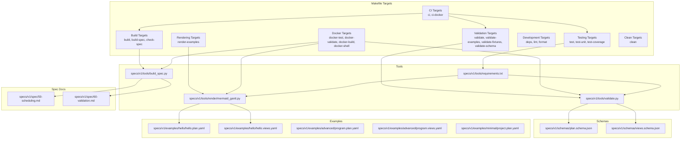
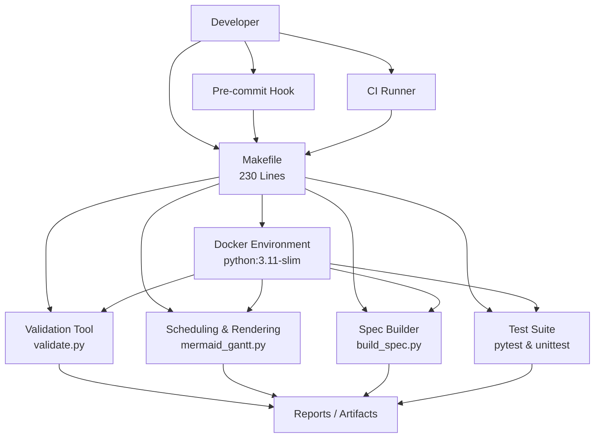
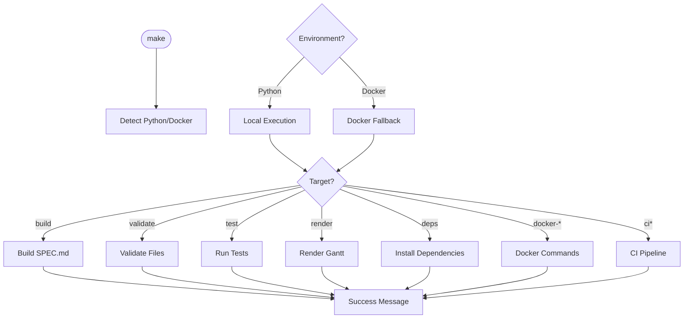
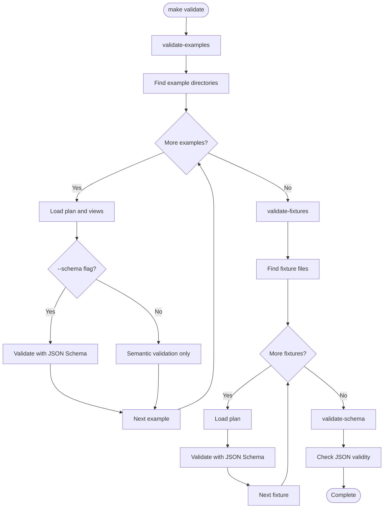
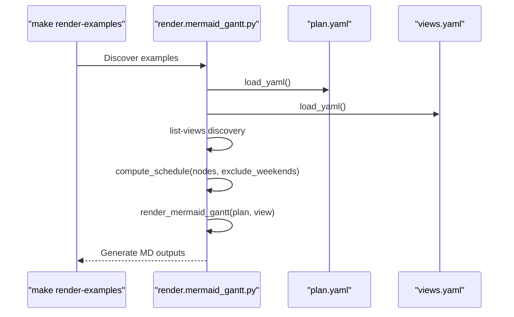
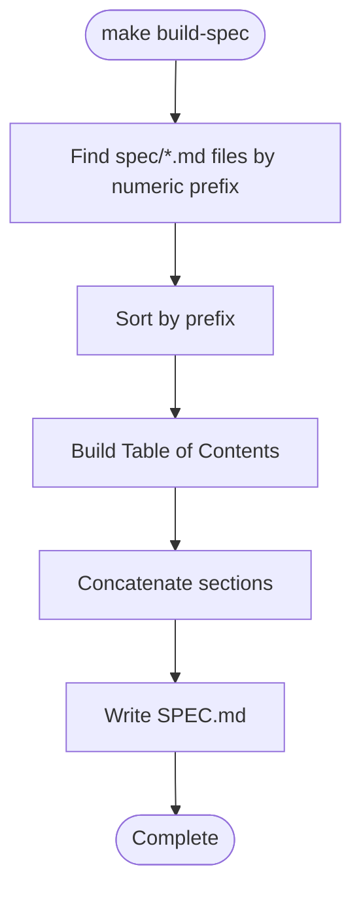
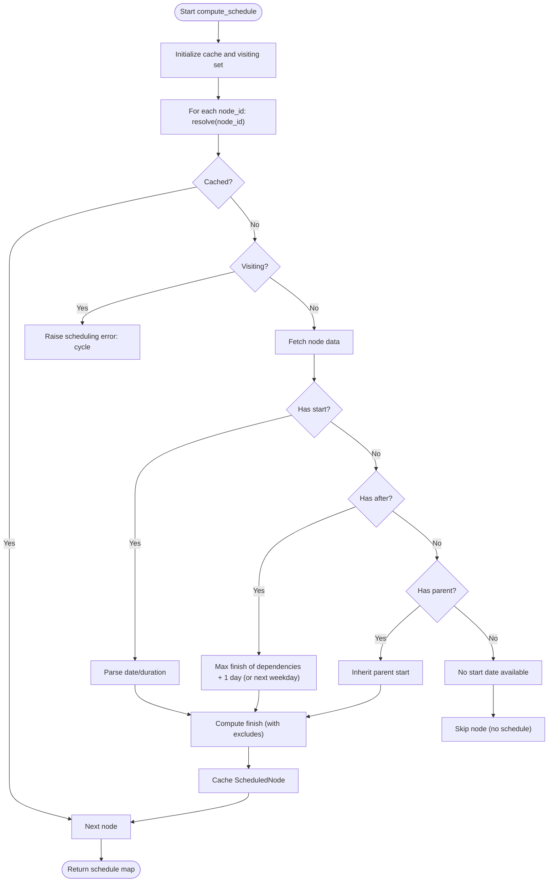
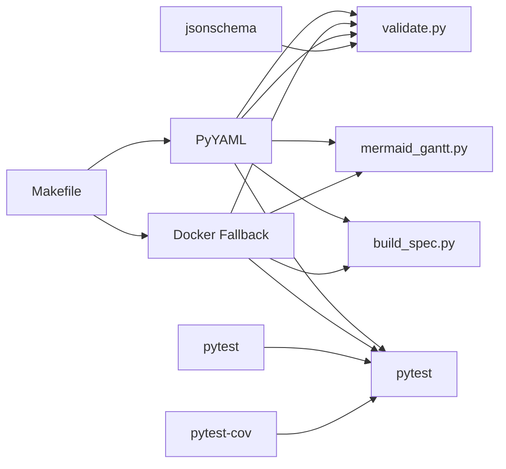

# Workflow Automation

<cite>
**Referenced Files in This Document**
- [Makefile](file://Makefile)
- [README.md](file://README.md)
- [CONTRIBUTING.md](file://CONTRIBUTING.md)
- [specs/v1/tools/validate.py](file://specs/v1/tools/validate.py)
- [specs/v1/tools/build_spec.py](file://specs/v1/tools/build_spec.py)
- [specs/v1/tools/render/mermaid_gantt.py](file://specs/v1/tools/render/mermaid_gantt.py)
- [specs/v1/tools/requirements.txt](file://specs/v1/tools/requirements.txt)
- [specs/v1/schemas/plan.schema.json](file://specs/v1/schemas/plan.schema.json)
- [specs/v1/schemas/views.schema.json](file://specs/v1/schemas/views.schema.json)
- [specs/v1/spec/50-scheduling.md](file://specs/v1/spec/50-scheduling.md)
- [specs/v1/spec/60-validation.md](file://specs/v1/spec/60-validation.md)
- [specs/v1/examples/hello/hello.plan.yaml](file://specs/v1/examples/hello/hello.plan.yaml)
- [specs/v1/examples/hello/hello.views.yaml](file://specs/v1/examples/hello/hello.views.yaml)
- [specs/v1/examples/advanced/program.plan.yaml](file://specs/v1/examples/advanced/program.plan.yaml)
- [specs/v1/examples/advanced/program.views.yaml](file://specs/v1/examples/advanced/program.views.yaml)
- [specs/v1/examples/minimal/project.plan.yaml](file://specs/v1/examples/minimal/project.plan.yaml)
- [specs/v1/tests/test_scheduling.py](file://specs/v1/tests/test_scheduling.py)
</cite>

## Update Summary
**Changes Made**
- Added comprehensive Makefile automation with 230 lines of build targets
- Enhanced CI/CD integration with Docker support and automated validation
- Added dependency management, linting, and formatting capabilities
- Integrated testing with coverage reporting and Docker-based testing
- Implemented rendering automation for Gantt diagrams
- Added clean and development utilities

## Table of Contents
1. [Introduction](#introduction)
2. [Project Structure](#project-structure)
3. [Core Components](#core-components)
4. [Architecture Overview](#architecture-overview)
5. [Detailed Component Analysis](#detailed-component-analysis)
6. [Dependency Analysis](#dependency-analysis)
7. [Performance Considerations](#performance-considerations)
8. [Troubleshooting Guide](#troubleshooting-guide)
9. [Conclusion](#conclusion)
10. [Appendices](#appendices)

## Introduction
This document describes workflow automation for Opskarta, focusing on:
- Automated validation in CI/CD pipelines (pre-commit hooks, pull request validation, continuous integration checks)
- Scheduling automation for periodic report generation, status updates, and dependency resolution
- Webhook implementations for real-time operational map updates, external system notifications, and automated data synchronization
- Examples of automation scripts, cron job configurations, and containerized deployment patterns
- Error handling strategies, retry mechanisms, and monitoring approaches
- Troubleshooting guidance for common automation issues

The repository now provides comprehensive Makefile automation with 230 lines of build targets covering documentation, validation, testing, and CI/CD integration. Enhanced with Docker support, extensive dependency management, and automated workflows for all development tasks.

## Project Structure
The automation-relevant parts of the repository are organized around:
- Comprehensive Makefile with build, validation, testing, rendering, development, Docker, and CI targets
- Reference tools under specs/v1/tools/ for validation, rendering, and spec building
- JSON Schemas under specs/v1/schemas/ for optional JSON Schema validation
- Specification documents under specs/v1/spec/ describing scheduling and validation rules
- Example plan and views files under specs/v1/examples/ for testing and demonstration
- Test suite under specs/v1/tests/ for scheduling and validation testing

**Diagram sources**
- [Makefile](file://Makefile#L1-L230)
- [specs/v1/tools/validate.py](file://specs/v1/tools/validate.py#L1-L782)
- [specs/v1/tools/render/mermaid_gantt.py](file://specs/v1/tools/render/mermaid_gantt.py#L1-L549)
- [specs/v1/tools/build_spec.py](file://specs/v1/tools/build_spec.py#L1-L240)
- [specs/v1/tools/requirements.txt](file://specs/v1/tools/requirements.txt#L1-L10)
- [specs/v1/schemas/plan.schema.json](file://specs/v1/schemas/plan.schema.json#L1-L86)
- [specs/v1/schemas/views.schema.json](file://specs/v1/schemas/views.schema.json#L1-L26)
- [specs/v1/spec/50-scheduling.md](file://specs/v1/spec/50-scheduling.md#L1-L80)
- [specs/v1/spec/60-validation.md](file://specs/v1/spec/60-validation.md#L1-L140)
- [specs/v1/examples/hello/hello.plan.yaml](file://specs/v1/examples/hello/hello.plan.yaml#L1-L44)
- [specs/v1/examples/hello/hello.views.yaml](file://specs/v1/examples/hello/hello.views.yaml#L1-L13)
- [specs/v1/examples/advanced/program.plan.yaml](file://specs/v1/examples/advanced/program.plan.yaml#L1-L326)
- [specs/v1/examples/advanced/program.views.yaml](file://specs/v1/examples/advanced/program.views.yaml#L1-L93)
- [specs/v1/examples/minimal/project.plan.yaml](file://specs/v1/examples/minimal/project.plan.yaml#L1-L6)

**Section sources**
- [Makefile](file://Makefile#L1-L230)
- [README.md](file://README.md#L1-L96)
- [specs/v1/tools/validate.py](file://specs/v1/tools/validate.py#L1-L782)
- [specs/v1/tools/render/mermaid_gantt.py](file://specs/v1/tools/render/mermaid_gantt.py#L1-L549)
- [specs/v1/tools/build_spec.py](file://specs/v1/tools/build_spec.py#L1-L240)
- [specs/v1/tools/requirements.txt](file://specs/v1/tools/requirements.txt#L1-L10)
- [specs/v1/schemas/plan.schema.json](file://specs/v1/schemas/plan.schema.json#L1-L86)
- [specs/v1/schemas/views.schema.json](file://specs/v1/schemas/views.schema.json#L1-L26)
- [specs/v1/spec/50-scheduling.md](file://specs/v1/spec/50-scheduling.md#L1-L80)
- [specs/v1/spec/60-validation.md](file://specs/v1/spec/60-validation.md#L1-L140)
- [specs/v1/examples/hello/hello.plan.yaml](file://specs/v1/examples/hello/hello.plan.yaml#L1-L44)
- [specs/v1/examples/hello/hello.views.yaml](file://specs/v1/examples/hello/hello.views.yaml#L1-L13)
- [specs/v1/examples/advanced/program.plan.yaml](file://specs/v1/examples/advanced/program.plan.yaml#L1-L326)
- [specs/v1/examples/advanced/program.views.yaml](file://specs/v1/examples/advanced/program.views.yaml#L1-L93)
- [specs/v1/examples/minimal/project.plan.yaml](file://specs/v1/examples/minimal/project.plan.yaml#L1-L6)

## Core Components
- **Makefile Automation**: Comprehensive 230-line Makefile providing unified build system with targets for documentation, validation, testing, rendering, development, Docker, and CI/CD integration
- **Validation tool**: validates plan and views files, supports semantic and optional JSON Schema validation, and reports actionable errors with paths and suggestions
- **Rendering tool**: generates Mermaid Gantt diagrams from plan and views, computing schedules with support for weekdays-only calculations and exclusions
- **Spec builder**: aggregates specification sections into a single document and can check whether the built document is up-to-date
- **Schemas**: JSON Schema definitions for plan and views enable machine-readable validation
- **Examples**: minimal, hello, and advanced example files demonstrate practical usage patterns
- **Test Suite**: comprehensive unit tests for scheduling logic and validation functionality

Key automation enablers:
- Unified Makefile targets for consistent development workflows across different environments
- Automatic dependency detection and Docker fallback for isolated execution
- Comprehensive CI/CD integration with Docker-based testing and validation
- Automated artifact generation for documentation, validation reports, and rendering outputs
- Integrated linting and formatting tools for code quality assurance

**Section sources**
- [Makefile](file://Makefile#L1-L230)
- [specs/v1/tools/validate.py](file://specs/v1/tools/validate.py#L1-L782)
- [specs/v1/tools/render/mermaid_gantt.py](file://specs/v1/tools/render/mermaid_gantt.py#L1-L549)
- [specs/v1/tools/build_spec.py](file://specs/v1/tools/build_spec.py#L1-L240)
- [specs/v1/schemas/plan.schema.json](file://specs/v1/schemas/plan.schema.json#L1-L86)
- [specs/v1/schemas/views.schema.json](file://specs/v1/schemas/views.schema.json#L1-L26)
- [specs/v1/spec/50-scheduling.md](file://specs/v1/spec/50-scheduling.md#L1-L80)
- [specs/v1/spec/60-validation.md](file://specs/v1/spec/60-validation.md#L1-L140)
- [specs/v1/examples/hello/hello.plan.yaml](file://specs/v1/examples/hello/hello.plan.yaml#L1-L44)
- [specs/v1/examples/advanced/program.plan.yaml](file://specs/v1/examples/advanced/program.plan.yaml#L1-L326)
- [specs/v1/tests/test_scheduling.py](file://specs/v1/tests/test_scheduling.py#L1-L305)

## Architecture Overview
The automation architecture centers on four pillars with comprehensive Makefile integration:
- **Unified Build System**: Single Makefile orchestrating all development tasks with environment detection and Docker fallback
- **Validation Pipeline**: Pre-commit hook and CI steps validate YAML syntax, JSON Schema compliance (optional), and semantic correctness (references, cycles, formats)
- **Rendering Pipeline**: Scheduled runs compute schedules and render Gantt diagrams for reporting and dashboards
- **Spec Maintenance Pipeline**: Automated checks ensure SPEC.md stays in sync with spec sections
- **CI/CD Integration**: Complete pipeline with Docker support, dependency management, and artifact generation

**Diagram sources**
- [Makefile](file://Makefile#L1-L230)
- [specs/v1/tools/validate.py](file://specs/v1/tools/validate.py#L1-L782)
- [specs/v1/tools/render/mermaid_gantt.py](file://specs/v1/tools/render/mermaid_gantt.py#L1-L549)
- [specs/v1/tools/build_spec.py](file://specs/v1/tools/build_spec.py#L1-L240)
- [specs/v1/tests/test_scheduling.py](file://specs/v1/tests/test_scheduling.py#L1-L305)

## Detailed Component Analysis

### Makefile Automation System
The comprehensive 230-line Makefile provides unified automation across all development domains:

**Build Targets**
- `build`: Orchestrates complete artifact generation including SPEC.md creation
- `build-spec`: Generates SPEC.md from spec/ sources with automatic formatting
- `check-spec`: Validates SPEC.md freshness without overwriting

**Validation Targets**
- `validate`: Comprehensive validation of examples and fixtures
- `validate-examples`: Validates all example files with automatic discovery
- `validate-fixtures`: Validates test fixture files
- `validate-schema`: Ensures JSON schemas are valid JSON

**Testing Targets**
- `test`: Runs complete test suite with fallback mechanisms
- `test-unit`: Executes unit tests only
- `test-coverage`: Runs tests with coverage reporting

**Rendering Targets**
- `render-examples`: Automatically renders Gantt diagrams for all examples with view discovery

**Development Targets**
- `deps`: Installs Python dependencies (PyYAML, jsonschema, pytest, pytest-cov)
- `lint`: Code linting with ruff (optional)
- `format`: Code formatting with ruff (optional)

**Docker Integration**
- `docker-test`: Runs tests in isolated Docker container
- `docker-validate`: Validates files in Docker environment
- `docker-build`: Builds SPEC.md in Docker container
- `docker-shell`: Opens interactive Docker shell

**CI/CD Targets**
- `ci`: Complete CI pipeline running all checks
- `ci-docker`: Docker-based CI execution

**Clean Targets**
- `clean`: Removes generated files and cache directories

**Diagram sources**
- [Makefile](file://Makefile#L14-L28)
- [Makefile](file://Makefile#L49-L230)

**Section sources**
- [Makefile](file://Makefile#L1-L230)

### Validation Pipeline
The validation tool performs comprehensive validation with Makefile integration:
- Syntax validation via YAML parsing
- Optional JSON Schema validation against plan and views schemas
- Semantic validation including required fields, reference integrity, status validity, date/duration formats, and cycle detection
- Automated discovery and validation of all example and fixture files

**Diagram sources**
- [Makefile](file://Makefile#L70-L105)
- [specs/v1/tools/validate.py](file://specs/v1/tools/validate.py#L1-L782)
- [specs/v1/schemas/plan.schema.json](file://specs/v1/schemas/plan.schema.json#L1-L86)
- [specs/v1/schemas/views.schema.json](file://specs/v1/schemas/views.schema.json#L1-L26)

**Section sources**
- [Makefile](file://Makefile#L67-L105)
- [specs/v1/tools/validate.py](file://specs/v1/tools/validate.py#L1-L782)
- [specs/v1/schemas/plan.schema.json](file://specs/v1/schemas/plan.schema.json#L1-L86)
- [specs/v1/schemas/views.schema.json](file://specs/v1/schemas/views.schema.json#L1-L26)
- [specs/v1/spec/60-validation.md](file://specs/v1/spec/60-validation.md#L1-L140)

### Rendering Pipeline (Gantt Generation)
The rendering tool computes schedules and produces Mermaid Gantt output with automated view discovery:
- Parses dates and durations
- Resolves start dates from explicit values, dependencies, or parent inheritance
- Supports weekday-only calculations and calendar exclusions
- Renders lanes and tasks with status-based theming
- Automatically discovers available views for each example

**Diagram sources**
- [Makefile](file://Makefile#L132-L151)
- [specs/v1/tools/render/mermaid_gantt.py](file://specs/v1/tools/render/mermaid_gantt.py#L1-L549)
- [specs/v1/spec/50-scheduling.md](file://specs/v1/spec/50-scheduling.md#L1-L80)

**Section sources**
- [Makefile](file://Makefile#L132-L151)
- [specs/v1/tools/render/mermaid_gantt.py](file://specs/v1/tools/render/mermaid_gantt.py#L1-L549)
- [specs/v1/spec/50-scheduling.md](file://specs/v1/spec/50-scheduling.md#L1-L80)

### Spec Maintenance Pipeline
The spec builder aggregates spec sections into a single document and can verify freshness with Makefile integration.

**Diagram sources**
- [Makefile](file://Makefile#L52-L56)
- [specs/v1/tools/build_spec.py](file://specs/v1/tools/build_spec.py#L1-L240)

**Section sources**
- [Makefile](file://Makefile#L52-L62)
- [specs/v1/tools/build_spec.py](file://specs/v1/tools/build_spec.py#L1-L240)

### Scheduling Logic
Scheduling supports:
- Explicit start dates and durations
- Dependencies via after lists
- Parent inheritance for implicit start dates
- Weekday-only calculations and calendar exclusions
- Cycle detection to prevent invalid plans

**Diagram sources**
- [specs/v1/tools/render/mermaid_gantt.py](file://specs/v1/tools/render/mermaid_gantt.py#L217-L294)
- [specs/v1/spec/50-scheduling.md](file://specs/v1/spec/50-scheduling.md#L1-L80)

**Section sources**
- [specs/v1/tools/render/mermaid_gantt.py](file://specs/v1/tools/render/mermaid_gantt.py#L1-L549)
- [specs/v1/spec/50-scheduling.md](file://specs/v1/spec/50-scheduling.md#L1-L80)

## Dependency Analysis
- **Makefile Dependencies**: Comprehensive dependency management with Python detection and Docker fallback
- **Tools Dependencies**: PyYAML for YAML parsing; optional jsonschema for strict validation; pytest and pytest-cov for testing
- **Validation Tool**: Consumes plan and views schemas to optionally enforce strict schema compliance
- **Rendering Tool**: Depends on scheduling logic and plan/views data to produce deterministic outputs
- **Test Dependencies**: Unit testing framework with comprehensive test coverage

**Diagram sources**
- [Makefile](file://Makefile#L14-L28)
- [specs/v1/tools/requirements.txt](file://specs/v1/tools/requirements.txt#L1-L10)
- [specs/v1/tools/validate.py](file://specs/v1/tools/validate.py#L1-L782)
- [specs/v1/schemas/plan.schema.json](file://specs/v1/schemas/plan.schema.json#L1-L86)
- [specs/v1/schemas/views.schema.json](file://specs/v1/schemas/views.schema.json#L1-L26)
- [specs/v1/tools/render/mermaid_gantt.py](file://specs/v1/tools/render/mermaid_gantt.py#L1-L549)
- [specs/v1/tests/test_scheduling.py](file://specs/v1/tests/test_scheduling.py#L1-L305)

**Section sources**
- [Makefile](file://Makefile#L14-L28)
- [specs/v1/tools/requirements.txt](file://specs/v1/tools/requirements.txt#L1-L10)
- [specs/v1/tools/validate.py](file://specs/v1/tools/validate.py#L1-L782)
- [specs/v1/schemas/plan.schema.json](file://specs/v1/schemas/plan.schema.json#L1-L86)
- [specs/v1/schemas/views.schema.json](file://specs/v1/schemas/views.schema.json#L1-L26)
- [specs/v1/tools/render/mermaid_gantt.py](file://specs/v1/tools/render/mermaid_gantt.py#L1-L549)
- [specs/v1/tests/test_scheduling.py](file://specs/v1/tests/test_scheduling.py#L1-L305)

## Performance Considerations
- **Makefile Optimization**: Centralized execution reduces process startup overhead and improves caching
- **Parallel Processing**: Multiple validation and rendering tasks can run concurrently within Makefile targets
- **Docker Isolation**: Containerized execution ensures consistent performance across different environments
- **Selective Validation**: Makefile targets allow targeted validation to reduce unnecessary processing
- **Artifact Caching**: Generated outputs can be cached and reused across CI/CD runs

## Troubleshooting Guide
Common automation issues and resolutions with Makefile-specific solutions:

**Environment Detection Issues**
- Symptom: Makefile fails to detect Python or Docker
- Resolution: Check PATH variables; ensure Python 3.9+ or Docker is installed; Makefile automatically falls back to Docker
- Evidence: Environment detection logic at lines 14-28

**Permission Problems**
- Symptom: write failures when generating SPEC.md or rendering outputs
- Resolution: ensure write permissions in target directories; Makefile handles PermissionError explicitly
- Evidence: Spec builder handles PermissionError explicitly

**Network Connectivity**
- Symptom: failures when fetching remote schemas or external resources
- Resolution: pre-fetch schemas; run in environments with network access; mirror artifacts internally
- Evidence: Docker-based execution bypasses local network issues

**Performance Bottlenecks**
- Symptom: slow validations or renders on large plans
- Resolution: split plans into smaller modules; use selective validation; cache rendered artifacts
- Evidence: Makefile provides targeted execution with `validate-examples` and `validate-fixtures`

**Schema Mismatches**
- Symptom: JSON Schema validation errors
- Resolution: align fields with schemas; use the provided schemas as references
- Evidence: `validate-schema` target specifically checks JSON schema validity

**Docker Execution Issues**
- Symptom: Docker commands fail or timeout
- Resolution: Ensure Docker daemon is running; check volume mounting permissions; verify Python 3.11 slim image availability
- Evidence: Docker targets at lines 179-204

**Section sources**
- [Makefile](file://Makefile#L14-L28)
- [Makefile](file://Makefile#L179-L204)
- [specs/v1/tools/build_spec.py](file://specs/v1/tools/build_spec.py#L230-L236)
- [specs/v1/tools/validate.py](file://specs/v1/tools/validate.py#L599-L618)
- [specs/v1/tools/render/mermaid_gantt.py](file://specs/v1/tools/render/mermaid_gantt.py#L236-L243)

## Conclusion
Opskarta's comprehensive Makefile automation provides a solid foundation for workflow automation:
- **Unified Build System**: Single Makefile orchestrates all development tasks with environment detection and Docker fallback
- **Automated Validation**: Comprehensive validation pipeline covering examples, fixtures, and schemas
- **Integrated Testing**: Complete test suite with coverage reporting and Docker-based execution
- **Enhanced Rendering**: Automated Gantt diagram generation with view discovery
- **CI/CD Ready**: Complete pipeline with Docker support and artifact generation
- **Developer Experience**: Consistent workflows across different environments with automatic dependency management

By integrating these Makefile targets into pre-commit hooks, CI pipelines, and scheduled jobs, teams can maintain high-quality operational maps and reliable automation with minimal configuration overhead.

## Appendices

### CI/CD Integration Patterns with Makefile
- **Pre-commit Hook**
  - Run `make validate` on staged YAML files to catch issues early
  - Example: `make validate` executes comprehensive validation pipeline
- **Pull Request Validation**
  - Validate both plan and views with `make validate`
  - Optionally run `make test-coverage` for code quality metrics
  - Fail fast on semantic or schema errors; surface actionable messages
- **Continuous Integration Checks**
  - Run `make ci` for complete CI pipeline including SPEC.md freshness
  - Use `make ci-docker` for isolated Docker-based execution
  - Validate examples and custom plans; render Gantt outputs for selected views
  - Publish artifacts (Markdown/GitHub Pages) for visibility

**Section sources**
- [Makefile](file://Makefile#L210-L217)
- [README.md](file://README.md#L72-L83)
- [specs/v1/tools/validate.py](file://specs/v1/tools/validate.py#L634-L782)
- [specs/v1/tools/render/mermaid_gantt.py](file://specs/v1/tools/render/mermaid_gantt.py#L439-L549)

### Scheduling Automation for Periodic Reports
- Compute schedules from plan data and render Gantt diagrams on a schedule
- Use weekday exclusions and calendar exceptions to reflect realistic timelines
- Store rendered outputs as artifacts or publish to documentation sites
- Leverage `make render-examples` for automated batch processing

**Section sources**
- [Makefile](file://Makefile#L132-L151)
- [specs/v1/spec/50-scheduling.md](file://specs/v1/spec/50-scheduling.md#L1-L80)
- [specs/v1/tools/render/mermaid_gantt.py](file://specs/v1/tools/render/mermaid_gantt.py#L1-L549)

### Webhook Implementations
- **Real-time operational map updates**
  - On push to main branch, trigger `make ci` or `make ci-docker` for validation and rendering
  - Post diffs to documentation or dashboards using generated artifacts
- **External system notifications**
  - On plan/view changes, notify downstream systems with sanitized summaries
  - Use `make validate` to ensure data integrity before external notifications
- **Automated data synchronization**
  - Sync plan metadata to external systems using `make build-spec` for documentation updates
  - Reconcile on conflict using plan's authoritative meta.id

**Section sources**
- [Makefile](file://Makefile#L210-L217)
- [specs/v1/tools/build_spec.py](file://specs/v1/tools/build_spec.py#L174-L240)

### Cron Job Configurations
- **Daily/Weekly schedules** to regenerate Gantt diagrams and update dashboards
  - Use `make render-examples` for automated batch processing
- **Bi-daily validation** of example plans to ensure compatibility across versions
  - Execute `make validate` for comprehensive validation
- **Monthly spec freshness checks** to keep SPEC.md up to date
  - Run `make check-spec` to verify SPEC.md freshness

**Section sources**
- [Makefile](file://Makefile#L132-L151)
- [Makefile](file://Makefile#L58-L62)

### Containerized Deployment Patterns
- **Docker-based Development**
  - Use `make docker-shell` for interactive development environment
  - Leverage `make docker-test`, `docker-validate`, and `docker-build` for isolated execution
- **Production Containerization**
  - Package tools in Python base image; install dependencies from requirements.txt
  - Use Docker targets for consistent execution across environments
- **Multi-stage Builds**
  - Use `make deps` for dependency installation in containerized environments
  - Minimize image size with Docker-based execution

**Section sources**
- [Makefile](file://Makefile#L179-L204)
- [specs/v1/tools/requirements.txt](file://specs/v1/tools/requirements.txt#L1-L10)
- [CONTRIBUTING.md](file://CONTRIBUTING.md#L27-L30)

### Example Automation Scripts (Makefile Targets)
- **Validate a plan and views pair**:
  - `make validate-examples` - Validates all example files automatically
  - `make validate-fixtures` - Validates test fixture files
- **Render a Gantt view**:
  - `make render-examples` - Renders all example Gantt diagrams with view discovery
- **Build or check SPEC.md**:
  - `make build-spec` - Generates SPEC.md from spec sources
  - `make check-spec` - Verifies SPEC.md freshness
- **Run comprehensive validation**:
  - `make validate` - Complete validation pipeline
  - `make test` - Full test suite execution
- **Docker-based execution**:
  - `make docker-validate` - Validation in Docker container
  - `make docker-test` - Testing in Docker container

**Section sources**
- [Makefile](file://Makefile#L67-L151)
- [Makefile](file://Makefile#L179-L204)

### Example Plans and Views
- **Minimal plan**:
  - [specs/v1/examples/minimal/project.plan.yaml](file://specs/v1/examples/minimal/project.plan.yaml#L1-L6)
- **Hello example**:
  - [specs/v1/examples/hello/hello.plan.yaml](file://specs/v1/examples/hello/hello.plan.yaml#L1-L44)
  - [specs/v1/examples/hello/hello.views.yaml](file://specs/v1/examples/hello/hello.views.yaml#L1-L13)
- **Advanced program**:
  - [specs/v1/examples/advanced/program.plan.yaml](file://specs/v1/examples/advanced/program.plan.yaml#L1-L326)
  - [specs/v1/examples/advanced/program.views.yaml](file://specs/v1/examples/advanced/program.views.yaml#L1-L93)

**Section sources**
- [specs/v1/examples/minimal/project.plan.yaml](file://specs/v1/examples/minimal/project.plan.yaml#L1-L6)
- [specs/v1/examples/hello/hello.plan.yaml](file://specs/v1/examples/hello/hello.plan.yaml#L1-L44)
- [specs/v1/examples/hello/hello.views.yaml](file://specs/v1/examples/hello/hello.views.yaml#L1-L13)
- [specs/v1/examples/advanced/program.plan.yaml](file://specs/v1/examples/advanced/program.plan.yaml#L1-L326)
- [specs/v1/examples/advanced/program.views.yaml](file://specs/v1/examples/advanced/program.views.yaml#L1-L93)