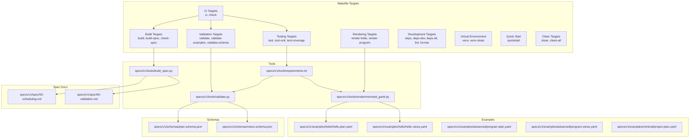
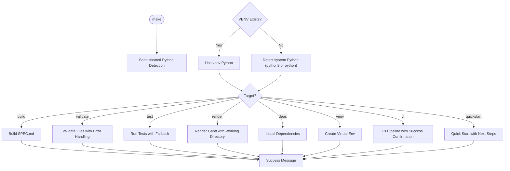
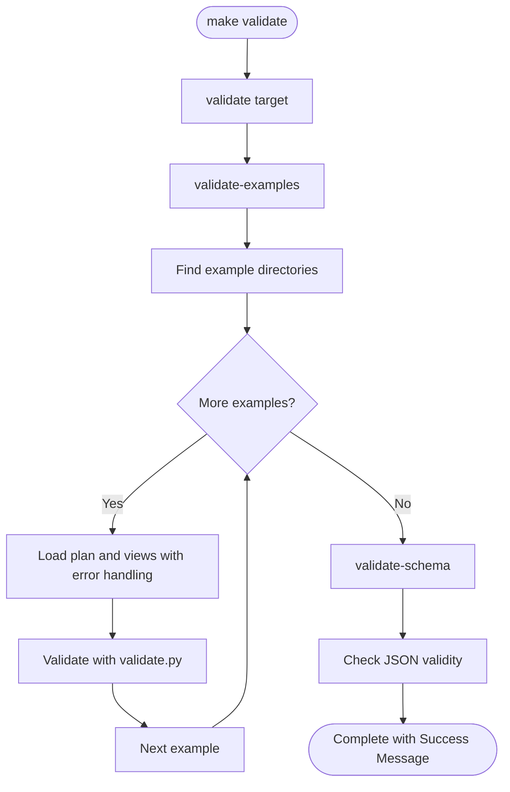
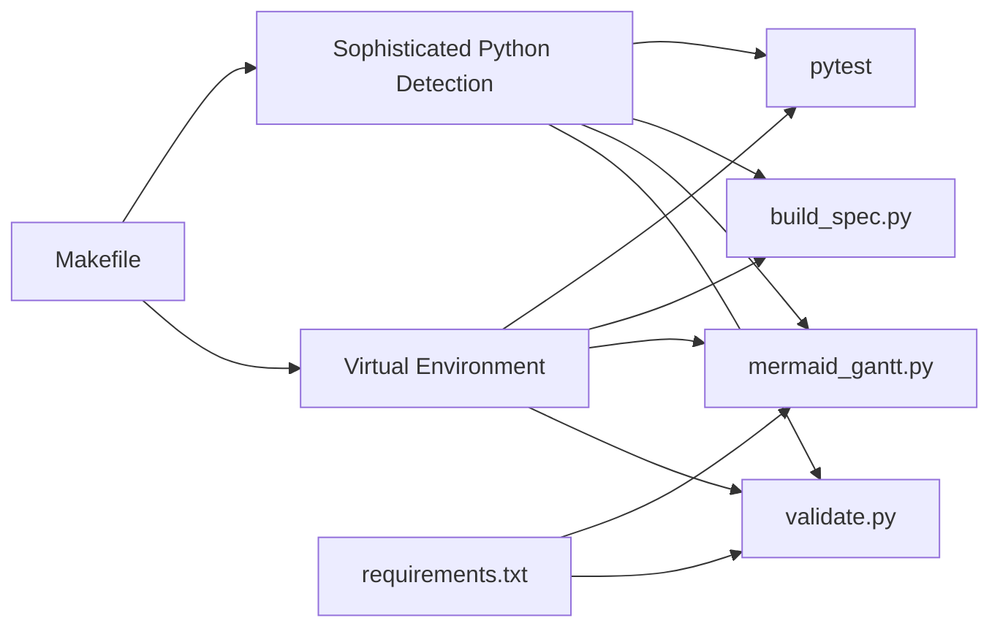

# Workflow Automation

<cite>
**Referenced Files in This Document**
- [Makefile](file://Makefile)
- [README.md](file://README.md)
- [CONTRIBUTING.md](file://CONTRIBUTING.md)
- [specs/v1/tools/validate.py](file://specs/v1/tools/validate.py)
- [specs/v1/tools/build_spec.py](file://specs/v1/tools/build_spec.py)
- [specs/v1/tools/render/mermaid_gantt.py](file://specs/v1/tools/render/mermaid_gantt.py)
- [specs/v1/tools/requirements.txt](file://specs/v1/tools/requirements.txt)
- [specs/v1/schemas/plan.schema.json](file://specs/v1/schemas/plan.schema.json)
- [specs/v1/schemas/views.schema.json](file://specs/v1/schemas/views.schema.json)
- [specs/v1/spec/50-scheduling.md](file://specs/v1/spec/50-scheduling.md)
- [specs/v1/spec/60-validation.md](file://specs/v1/spec/60-validation.md)
- [specs/v1/examples/hello/hello.plan.yaml](file://specs/v1/examples/hello/hello.plan.yaml)
- [specs/v1/examples/hello/hello.views.yaml](file://specs/v1/examples/hello/hello.views.yaml)
- [specs/v1/examples/advanced/program.plan.yaml](file://specs/v1/examples/advanced/program.plan.yaml)
- [specs/v1/examples/advanced/program.views.yaml](file://specs/v1/examples/advanced/program.views.yaml)
- [specs/v1/examples/minimal/project.plan.yaml](file://specs/v1/examples/minimal/project.plan.yaml)
- [specs/v1/tests/test_scheduling.py](file://specs/v1/tests/test_scheduling.py)
</cite>

## Update Summary
**Changes Made**
- Enhanced Makefile automation with improved virtual environment management and Python detection logic
- Streamlined validation system with consolidated targets and better error handling
- Improved dependency management with clearer separation between core and development dependencies
- Enhanced rendering capabilities with proper working directory handling and view discovery
- Simplified CI/CD integration focused on local execution without Docker dependencies
- Added comprehensive quickstart workflow for rapid developer onboarding

## Table of Contents
1. [Introduction](#introduction)
2. [Project Structure](#project-structure)
3. [Core Components](#core-components)
4. [Architecture Overview](#architecture-overview)
5. [Detailed Component Analysis](#detailed-component-analysis)
6. [Dependency Analysis](#dependency-analysis)
7. [Performance Considerations](#performance-considerations)
8. [Troubleshooting Guide](#troubleshooting-guide)
9. [Conclusion](#conclusion)
10. [Appendices](#appendices)

## Introduction
This document describes workflow automation for Opskarta, focusing on:
- Automated validation in CI/CD pipelines (pre-commit hooks, pull request validation, continuous integration checks)
- Scheduling automation for periodic report generation, status updates, and dependency resolution
- Webhook implementations for real-time operational map updates, external system notifications, and automated data synchronization
- Examples of automation scripts, cron job configurations, and containerized deployment patterns
- Error handling strategies, retry mechanisms, and monitoring approaches
- Troubleshooting guidance for common automation issues

The repository now provides comprehensive Makefile automation with enhanced virtual environment support, consolidated validation targets, and streamlined development workflow automation. Docker-based CI targets have been removed in favor of simplified local execution with improved Python environment detection and management.

## Project Structure
The automation-relevant parts of the repository are organized around:
- Comprehensive Makefile with build, validation, testing, rendering, development, and CI targets
- Enhanced virtual environment support with automatic Python detection and activation
- Reference tools under specs/v1/tools/ for validation, rendering, and spec building
- JSON Schemas under specs/v1/schemas/ for optional JSON Schema validation
- Specification documents under specs/v1/spec/ describing scheduling and validation rules
- Example plan and views files under specs/v1/examples/ for testing and demonstration
- Test suite under specs/v1/tests/ for scheduling and validation testing

**Diagram sources**
- [Makefile](file://Makefile#L1-L257)
- [specs/v1/tools/validate.py](file://specs/v1/tools/validate.py#L1-L1079)
- [specs/v1/tools/render/mermaid_gantt.py](file://specs/v1/tools/render/mermaid_gantt.py#L1-L737)
- [specs/v1/tools/build_spec.py](file://specs/v1/tools/build_spec.py#L1-L240)
- [specs/v1/tools/requirements.txt](file://specs/v1/tools/requirements.txt#L1-L10)
- [specs/v1/schemas/plan.schema.json](file://specs/v1/schemas/plan.schema.json#L1-L86)
- [specs/v1/schemas/views.schema.json](file://specs/v1/schemas/views.schema.json#L1-L26)
- [specs/v1/spec/50-scheduling.md](file://specs/v1/spec/50-scheduling.md#L1-L80)
- [specs/v1/spec/60-validation.md](file://specs/v1/spec/60-validation.md#L1-L140)
- [specs/v1/examples/hello/hello.plan.yaml](file://specs/v1/examples/hello/hello.plan.yaml#L1-L44)
- [specs/v1/examples/hello/hello.views.yaml](file://specs/v1/examples/hello/hello.views.yaml#L1-L13)
- [specs/v1/examples/advanced/program.plan.yaml](file://specs/v1/examples/advanced/program.plan.yaml#L1-L326)
- [specs/v1/examples/advanced/program.views.yaml](file://specs/v1/examples/advanced/program.views.yaml#L1-L93)
- [specs/v1/examples/minimal/project.plan.yaml](file://specs/v1/examples/minimal/project.plan.yaml#L1-L6)

**Section sources**
- [Makefile](file://Makefile#L1-L257)
- [README.md](file://README.md#L1-L96)
- [specs/v1/tools/validate.py](file://specs/v1/tools/validate.py#L1-L1079)
- [specs/v1/tools/render/mermaid_gantt.py](file://specs/v1/tools/render/mermaid_gantt.py#L1-L737)
- [specs/v1/tools/build_spec.py](file://specs/v1/tools/build_spec.py#L1-L240)
- [specs/v1/tools/requirements.txt](file://specs/v1/tools/requirements.txt#L1-L10)
- [specs/v1/schemas/plan.schema.json](file://specs/v1/schemas/plan.schema.json#L1-L86)
- [specs/v1/schemas/views.schema.json](file://specs/v1/schemas/views.schema.json#L1-L26)
- [specs/v1/spec/50-scheduling.md](file://specs/v1/spec/50-scheduling.md#L1-L80)
- [specs/v1/spec/60-validation.md](file://specs/v1/spec/60-validation.md#L1-L140)
- [specs/v1/examples/hello/hello.plan.yaml](file://specs/v1/examples/hello/hello.plan.yaml#L1-L44)
- [specs/v1/examples/hello/hello.views.yaml](file://specs/v1/examples/hello/hello.views.yaml#L1-L13)
- [specs/v1/examples/advanced/program.plan.yaml](file://specs/v1/examples/advanced/program.plan.yaml#L1-L326)
- [specs/v1/examples/advanced/program.views.yaml](file://specs/v1/examples/advanced/program.views.yaml#L1-L93)
- [specs/v1/examples/minimal/project.plan.yaml](file://specs/v1/examples/minimal/project.plan.yaml#L1-L6)

## Core Components
- **Enhanced Makefile Automation**: Comprehensive Makefile providing unified build system with improved virtual environment support, consolidated validation targets, and enhanced development workflow automation
- **Advanced Virtual Environment Management**: Automatic detection and creation of Python virtual environments with sophisticated Python version fallback and isolated dependency management
- **Streamlined Validation System**: Unified validation pipeline with automatic example discovery, robust error handling, and schema validation
- **Improved Dependency Management**: Clear separation between core and development dependencies with enhanced installation targets
- **Enhanced Rendering System**: Streamlined rendering targets for specific examples with proper working directory handling and view discovery capabilities
- **Robust Testing Framework**: Flexible testing with pytest fallback and comprehensive unit test coverage
- **Automated Spec Maintenance**: Enhanced specification building and freshness checking with improved error reporting

Key automation enablers:
- Sophisticated virtual environment support with automatic Python detection and activation
- Consolidated validation targets for streamlined development workflows
- Simplified CI/CD integration focused on local execution
- Enhanced developer experience with quickstart target and improved tooling
- Integrated linting and formatting tools with optional ruff installation

**Section sources**
- [Makefile](file://Makefile#L1-L257)
- [specs/v1/tools/validate.py](file://specs/v1/tools/validate.py#L1-L1079)
- [specs/v1/tools/render/mermaid_gantt.py](file://specs/v1/tools/render/mermaid_gantt.py#L1-L737)
- [specs/v1/tools/build_spec.py](file://specs/v1/tools/build_spec.py#L1-L240)
- [specs/v1/schemas/plan.schema.json](file://specs/v1/schemas/plan.schema.json#L1-L86)
- [specs/v1/schemas/views.schema.json](file://specs/v1/schemas/views.schema.json#L1-L26)
- [specs/v1/spec/50-scheduling.md](file://specs/v1/spec/50-scheduling.md#L1-L80)
- [specs/v1/spec/60-validation.md](file://specs/v1/spec/60-validation.md#L1-L140)
- [specs/v1/examples/hello/hello.plan.yaml](file://specs/v1/examples/hello/hello.plan.yaml#L1-L44)
- [specs/v1/examples/advanced/program.plan.yaml](file://specs/v1/examples/advanced/program.plan.yaml#L1-L326)
- [specs/v1/tests/test_scheduling.py](file://specs/v1/tests/test_scheduling.py#L1-L305)

## Architecture Overview
The automation architecture centers on five pillars with enhanced Makefile integration and sophisticated virtual environment support:
- **Advanced Virtual Environment System**: Automatic Python detection with venv fallback and isolated dependency management
- **Unified Build System**: Single Makefile orchestrating all development tasks with environment-aware execution
- **Streamlined Validation Pipeline**: Pre-commit hook and CI steps validate YAML syntax, JSON Schema compliance, and semantic correctness
- **Enhanced Rendering Pipeline**: Targeted rendering for specific examples with proper working directory handling
- **Improved CI/CD Integration**: Simplified pipeline focused on local execution with dependency management

**Diagram sources**
- [Makefile](file://Makefile#L1-L257)
- [specs/v1/tools/validate.py](file://specs/v1/tools/validate.py#L1-L1079)
- [specs/v1/tools/render/mermaid_gantt.py](file://specs/v1/tools/render/mermaid_gantt.py#L1-L737)
- [specs/v1/tools/build_spec.py](file://specs/v1/tools/build_spec.py#L1-L240)
- [specs/v1/tests/test_scheduling.py](file://specs/v1/tests/test_scheduling.py#L1-L305)

## Detailed Component Analysis

### Enhanced Makefile Automation System
The comprehensive 257-line Makefile provides unified automation across all development domains with sophisticated virtual environment support and improved dependency management:

**Advanced Virtual Environment Management**
- `venv`: Creates Python virtual environment with automatic pip upgrade and clear activation instructions
- `venv-clean`: Removes virtual environment directory with success confirmation
- Sophisticated Python detection logic preferring venv over system Python with graceful fallback

**Improved Dependency Management**
- `deps`: Installs core dependencies (PyYAML, jsonschema) with clear dependency separation
- `deps-dev`: Installs development dependencies (pytest, pytest-cov, ruff) with optional tooling
- `deps-all`: Alias for deps-dev with explicit naming

**Enhanced Build Targets**
- `build`: Orchestrates complete artifact generation including SPEC.md creation
- `build-spec`: Generates SPEC.md from spec/ sources with automatic formatting
- `check-spec`: Validates SPEC.md freshness without overwriting

**Streamlined Validation System**
- `validate`: Unified validation of examples and fixtures with sequential execution
- `validate-examples`: Validates all example files with automatic discovery and robust error handling
- `validate-schema`: Ensures JSON schemas are valid JSON with individual file validation
- `validate-hello`: Quick validation of hello example with direct file targeting
- `validate-program`: Validation of program example with comprehensive file handling

**Enhanced Rendering Pipeline**
- `render-hello`: Renders hello example Gantt diagram with overview view and proper working directory handling
- `render-program`: Renders program example with view listing and comprehensive view discovery
- Direct module execution with CURDIR prefix for reliable path resolution

**Improved Development Tools**
- `lint`: Code linting with ruff requirement checking and clear installation instructions
- `format`: Code formatting with ruff requirement checking and clear installation instructions

**Enhanced CI/CD Integration**
- `ci`: Complete CI pipeline running all checks with success confirmation
- `check`: Quick validation for schemas, examples, and spec freshness

**Streamlined Quick Start Workflow**
- `quickstart`: Creates venv, installs deps, validates hello, renders hello with clear next steps

**Comprehensive Clean Targets**
- `clean`: Removes generated files and cache directories with selective cleanup
- `clean-all`: Cleans everything including virtual environment

**Diagram sources**
- [Makefile](file://Makefile#L15-L27)
- [Makefile](file://Makefile#L48-L62)
- [Makefile](file://Makefile#L68-L82)
- [Makefile](file://Makefile#L105-L150)
- [Makefile](file://Makefile#L154-L169)
- [Makefile](file://Makefile#L174-L194)
- [Makefile](file://Makefile#L221-L240)

**Section sources**
- [Makefile](file://Makefile#L1-L257)

### Advanced Virtual Environment System
The Makefile now includes sophisticated virtual environment support with automatic detection and management:

**Sophisticated Python Detection Logic**
- Prefers virtual environment Python if venv exists
- Falls back to system Python (python3 or python) with graceful detection
- Uses venv/bin/python and venv/bin/pip when available

**Enhanced Environment Management**
- `venv`: Creates virtual environment and upgrades pip with success confirmation
- `venv-clean`: Removes virtual environment directory with success confirmation
- Clear activation instructions for developers

**Benefits**
- Isolated dependency management with automatic Python version control
- Eliminates system-wide package conflicts
- Streamlined development environment setup with clear feedback
- Robust fallback handling for different Python installations

**Section sources**
- [Makefile](file://Makefile#L15-L27)
- [Makefile](file://Makefile#L48-L62)

### Streamlined Validation System
The validation system has been enhanced with consolidated targets and improved automation:

**Unified Validation Target**
- `validate`: Orchestrates comprehensive validation of all examples and fixtures
- Automatic discovery of example directories and files with robust error handling
- Sequential validation with immediate failure reporting and exit codes

**Enhanced Example Validation**
- `validate-examples`: Automatic discovery of all example directories with proper file handling
- Handles both plan-only and plan+views validation scenarios with conditional logic
- Robust error handling with exit codes and clear error reporting

**Improved Schema Validation**
- `validate-schema`: Validates JSON schema file integrity with individual file processing
- Ensures schemas are valid JSON before use with dedicated validation logic

**Streamlined Validation Targets**
- `validate-hello`: Fast validation of hello example with direct file targeting
- `validate-program`: Validation of program example with comprehensive file handling

**Diagram sources**
- [Makefile](file://Makefile#L105-L150)
- [specs/v1/tools/validate.py](file://specs/v1/tools/validate.py#L1-L1079)

**Section sources**
- [Makefile](file://Makefile#L105-L150)
- [specs/v1/tools/validate.py](file://specs/v1/tools/validate.py#L1-L1079)

### Enhanced Rendering System
The rendering system has been improved with targeted examples and enhanced view discovery:

**Streamlined Rendering Targets**
- `render-hello`: Renders hello example with overview view and proper working directory handling
- `render-program`: Renders program example with view listing and comprehensive view discovery
- Direct module execution with CURDIR prefix for reliable path resolution

**Enhanced View Discovery**
- Automatic discovery of available views per example with proper error handling
- Support for multiple view types and configurations with flexible output generation
- Status-based theming with robust view validation

**Benefits**
- Faster execution with specific targets and proper working directory handling
- Reduced complexity in rendering workflow with clear error reporting
- Better separation of concerns for different example types with enhanced flexibility

**Section sources**
- [Makefile](file://Makefile#L154-L169)
- [specs/v1/tools/render/mermaid_gantt.py](file://specs/v1/tools/render/mermaid_gantt.py#L1-L737)

### Improved CI/CD Integration
The CI/CD system has been simplified with consolidated targets and improved reliability:

**Consolidated CI Targets**
- `ci`: Complete pipeline with dependency installation, spec checking, validation, and testing
- `check`: Quick validation for schema, examples, and spec freshness
- Streamlined execution without Docker dependencies

**Enhanced Reliability**
- Local execution reduces external dependency complexity
- Enhanced error handling and reporting with success confirmations
- Faster feedback loops for developers with clear progress indication

**Benefits**
- Simplified CI configuration with clear target dependencies
- Reduced maintenance overhead with consolidated targets
- More reliable execution across different environments with robust error handling

**Section sources**
- [Makefile](file://Makefile#L221-L228)

### Streamlined Quick Start Workflow
A new streamlined workflow targets rapid developer onboarding:

**Enhanced Quick Start Target**
- `quickstart`: Creates venv, installs deps, validates hello, renders hello with clear next steps
- Provides immediate feedback and actionable guidance
- Reduces onboarding friction significantly with comprehensive setup

**Workflow Benefits**
- Single-command setup for new contributors with clear progress indication
- Immediate validation of working environment with success confirmation
- Clear progression to full development workflow with next-step guidance

**Section sources**
- [Makefile](file://Makefile#L233-L240)

## Dependency Analysis
- **Enhanced Makefile Dependencies**: Comprehensive dependency management with sophisticated virtual environment support and Python detection
- **Advanced Virtual Environment Dependencies**: Automatic detection and management of Python environments with fallback handling
- **Improved Tools Dependencies**: PyYAML for YAML parsing; optional jsonschema for strict validation; pytest and pytest-cov for testing
- **Enhanced Validation Tool**: Consumes plan and views schemas to optionally enforce strict schema compliance with robust error handling
- **Improved Rendering Tool**: Depends on scheduling logic and plan/views data to produce deterministic outputs with working directory handling
- **Robust Test Dependencies**: Unit testing framework with comprehensive test coverage and fallback mechanisms

**Diagram sources**
- [Makefile](file://Makefile#L15-L27)
- [specs/v1/tools/requirements.txt](file://specs/v1/tools/requirements.txt#L1-L10)
- [specs/v1/tools/validate.py](file://specs/v1/tools/validate.py#L1-L1079)
- [specs/v1/schemas/plan.schema.json](file://specs/v1/schemas/plan.schema.json#L1-L86)
- [specs/v1/schemas/views.schema.json](file://specs/v1/schemas/views.schema.json#L1-L26)
- [specs/v1/tools/render/mermaid_gantt.py](file://specs/v1/tools/render/mermaid_gantt.py#L1-L737)
- [specs/v1/tests/test_scheduling.py](file://specs/v1/tests/test_scheduling.py#L1-L305)

**Section sources**
- [Makefile](file://Makefile#L15-L27)
- [specs/v1/tools/requirements.txt](file://specs/v1/tools/requirements.txt#L1-L10)
- [specs/v1/tools/validate.py](file://specs/v1/tools/validate.py#L1-L1079)
- [specs/v1/schemas/plan.schema.json](file://specs/v1/schemas/plan.schema.json#L1-L86)
- [specs/v1/schemas/views.schema.json](file://specs/v1/schemas/views.schema.json#L1-L26)
- [specs/v1/tools/render/mermaid_gantt.py](file://specs/v1/tools/render/mermaid_gantt.py#L1-L737)
- [specs/v1/tests/test_scheduling.py](file://specs/v1/tests/test_scheduling.py#L1-L305)

## Performance Considerations
- **Enhanced Virtual Environment Optimization**: Centralized execution reduces process startup overhead and improves caching with sophisticated Python detection
- **Selective Validation**: Makefile targets allow targeted validation to reduce unnecessary processing with improved error handling
- **Parallel Processing**: Multiple validation and rendering tasks can run concurrently within Makefile targets
- **Improved Dependency Management**: Virtual environments eliminate redundant installations and improve performance with clear dependency separation
- **Enhanced Artifact Caching**: Generated outputs can be cached and reused across CI/CD runs with proper cleanup targets

## Troubleshooting Guide
Common automation issues and resolutions with Makefile-specific solutions:

**Advanced Virtual Environment Issues**
- Symptom: venv creation fails or activation problems
- Resolution: Check Python 3.9+ installation; ensure write permissions; use `make venv-clean` then `make venv`
- Evidence: Virtual environment creation logic with clear error handling

**Enhanced Python Detection Problems**
- Symptom: Makefile fails to detect Python or uses wrong version
- Resolution: Ensure python3 or python is in PATH; check Python 3.9+ compatibility; verify venv availability
- Evidence: Sophisticated Python detection logic with fallback handling

**Permission Problems**
- Symptom: write failures when creating venv or generating outputs
- Resolution: ensure write permissions in project directory; check disk space availability
- Evidence: venv creation handles PermissionError explicitly with clear error messages

**Network Connectivity**
- Symptom: failures when installing dependencies
- Resolution: pre-install dependencies locally; use offline mode; check proxy settings
- Evidence: Dependency installation handled locally without Docker with clear fallbacks

**Performance Bottlenecks**
- Symptom: slow validations or renders on large plans
- Resolution: split plans into smaller modules; use selective validation; cache rendered artifacts
- Evidence: Makefile provides targeted execution with specific validation targets

**Enhanced Schema Mismatches**
- Symptom: JSON Schema validation errors
- Resolution: align fields with schemas; use the provided schemas as references; check JSON validity
- Evidence: `validate-schema` target specifically checks JSON schema validity with individual file processing

**Section sources**
- [Makefile](file://Makefile#L15-L27)
- [Makefile](file://Makefile#L48-L62)
- [specs/v1/tools/build_spec.py](file://specs/v1/tools/build_spec.py#L230-L236)
- [specs/v1/tools/validate.py](file://specs/v1/tools/validate.py#L599-L618)
- [specs/v1/tools/render/mermaid_gantt.py](file://specs/v1/tools/render/mermaid_gantt.py#L236-L243)

## Conclusion
Opskarta's enhanced Makefile automation provides a streamlined foundation for workflow automation:
- **Advanced Virtual Environment Support**: Sophisticated Python detection and isolated environment management with fallback handling
- **Streamlined Validation System**: Unified validation pipeline covering examples, fixtures, and schemas with robust error handling
- **Improved Development Tools**: Enhanced dependency management, linting, and formatting capabilities with optional tooling
- **Simplified CI/CD Integration**: Streamlined pipeline focused on local execution without Docker dependencies
- **Streamlined Quick Start Workflow**: Rapid onboarding with single-command setup and immediate feedback
- **Enhanced Developer Experience**: Consistent workflows across different environments with improved tooling and clear error reporting

By integrating these Makefile targets into pre-commit hooks, CI pipelines, and scheduled jobs, teams can maintain high-quality operational maps and reliable automation with minimal configuration overhead and reduced complexity.

## Appendices

### CI/CD Integration Patterns with Enhanced Makefile
- **Pre-commit Hook**
  - Run `make validate` on staged YAML files to catch issues early
  - Example: `make validate` executes comprehensive validation pipeline with error handling
- **Pull Request Validation**
  - Validate both plan and views with `make validate`
  - Optionally run `make test-coverage` for code quality metrics
  - Fail fast on semantic or schema errors; surface actionable messages
- **Continuous Integration Checks**
  - Run `make ci` for complete CI pipeline including SPEC.md freshness
  - Validate examples and custom plans; render Gantt outputs for selected views
  - Publish artifacts (Markdown/GitHub Pages) for visibility with success confirmations

**Section sources**
- [Makefile](file://Makefile#L221-L228)
- [README.md](file://README.md#L72-L83)
- [specs/v1/tools/validate.py](file://specs/v1/tools/validate.py#L634-L1079)
- [specs/v1/tools/render/mermaid_gantt.py](file://specs/v1/tools/render/mermaid_gantt.py#L439-L737)

### Scheduling Automation for Periodic Reports
- Compute schedules from plan data and render Gantt diagrams on a schedule
- Use weekday exclusions and calendar exceptions to reflect realistic timelines
- Store rendered outputs as artifacts or publish to documentation sites
- Leverage `make render-hello` for automated batch processing with working directory handling

**Section sources**
- [Makefile](file://Makefile#L154-L160)
- [specs/v1/spec/50-scheduling.md](file://specs/v1/spec/50-scheduling.md#L1-L80)
- [specs/v1/tools/render/mermaid_gantt.py](file://specs/v1/tools/render/mermaid_gantt.py#L1-L737)

### Webhook Implementations
- **Real-time operational map updates**
  - On push to main branch, trigger `make ci` for validation and rendering
  - Post diffs to documentation or dashboards using generated artifacts
- **External system notifications**
  - On plan/view changes, notify downstream systems with sanitized summaries
  - Use `make validate` to ensure data integrity before external notifications
- **Automated data synchronization**
  - Sync plan metadata to external systems using `make build-spec` for documentation updates
  - Reconcile on conflict using plan's authoritative meta.id

**Section sources**
- [Makefile](file://Makefile#L221-L228)
- [specs/v1/tools/build_spec.py](file://specs/v1/tools/build_spec.py#L174-L240)

### Cron Job Configurations
- **Daily/Weekly schedules** to regenerate Gantt diagrams and update dashboards
  - Use `make render-hello` for automated batch processing with working directory handling
- **Bi-daily validation** of example plans to ensure compatibility across versions
  - Execute `make validate` for comprehensive validation with error handling
- **Monthly spec freshness checks** to keep SPEC.md up to date
  - Run `make check-spec` to verify SPEC.md freshness

**Section sources**
- [Makefile](file://Makefile#L154-L160)
- [Makefile](file://Makefile#L96-L100)

### Containerized Deployment Patterns
**Updated** Removed Docker-based CI targets as part of simplification effort

The repository now focuses on local execution with enhanced virtual environment support instead of Docker-based containers. All automation targets run directly on the host system with isolated Python environments and sophisticated Python detection logic.

**Section sources**
- [Makefile](file://Makefile#L1-L257)

### Enhanced Example Automation Scripts (Makefile Targets)
- **Create and manage virtual environment**:
  - `make venv` - Creates Python virtual environment with pip upgrade
  - `make venv-clean` - Removes virtual environment with success confirmation
- **Install dependencies**:
  - `make deps` - Install core dependencies (PyYAML, jsonschema)
  - `make deps-dev` - Install development dependencies (pytest, pytest-cov, ruff)
  - `make deps-all` - Alias for development dependencies
- **Validate files**:
  - `make validate` - Complete validation pipeline with error handling
  - `make validate-examples` - Validates all example files with automatic discovery
  - `make validate-schema` - Validates JSON schemas with individual file processing
  - `make validate-hello` - Quick hello example validation with direct targeting
- **Render diagrams**:
  - `make render-hello` - Renders hello example Gantt with working directory handling
  - `make render-program` - Renders program example with view listing
- **Run tests**:
  - `make test` - Full test suite execution with pytest fallback
  - `make test-unit` - Unit tests only
  - `make test-coverage` - Tests with coverage report
- **Code quality**:
  - `make lint` - Lint Python code with ruff requirement checking
  - `make format` - Format Python code with ruff requirement checking
- **CI/CD**:
  - `make ci` - Complete CI pipeline with success confirmation
  - `make check` - Quick validation with spec freshness checking
- **Streamlined quick start**:
  - `make quickstart` - Streamlined setup workflow with next steps
- **Cleanup**:
  - `make clean` - Clean generated files with selective cleanup
  - `make clean-all` - Clean everything including venv

**Section sources**
- [Makefile](file://Makefile#L48-L257)

### Enhanced Example Plans and Views
- **Minimal plan**:
  - [specs/v1/examples/minimal/project.plan.yaml](file://specs/v1/examples/minimal/project.plan.yaml#L1-L6)
- **Hello example**:
  - [specs/v1/examples/hello/hello.plan.yaml](file://specs/v1/examples/hello/hello.plan.yaml#L1-L44)
  - [specs/v1/examples/hello/hello.views.yaml](file://specs/v1/examples/hello/hello.views.yaml#L1-L13)
- **Advanced program**:
  - [specs/v1/examples/advanced/program.plan.yaml](file://specs/v1/examples/advanced/program.plan.yaml#L1-L326)
  - [specs/v1/examples/advanced/program.views.yaml](file://specs/v1/examples/advanced/program.views.yaml#L1-L93)

**Section sources**
- [specs/v1/examples/minimal/project.plan.yaml](file://specs/v1/examples/minimal/project.plan.yaml#L1-L6)
- [specs/v1/examples/hello/hello.plan.yaml](file://specs/v1/examples/hello/hello.plan.yaml#L1-L44)
- [specs/v1/examples/hello/hello.views.yaml](file://specs/v1/examples/hello/hello.views.yaml#L1-L13)
- [specs/v1/examples/advanced/program.plan.yaml](file://specs/v1/examples/advanced/program.plan.yaml#L1-L326)
- [specs/v1/examples/advanced/program.views.yaml](file://specs/v1/examples/advanced/program.views.yaml#L1-L93)