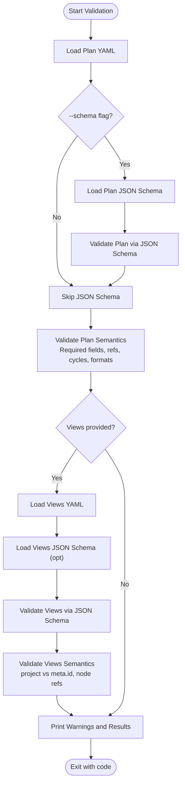

# Workflow Automation

<cite>
**Referenced Files in This Document**
- [README.md](file://README.md)
- [CONTRIBUTING.md](file://CONTRIBUTING.md)
- [specs/v1/tools/validate.py](file://specs/v1/tools/validate.py)
- [specs/v1/tools/build_spec.py](file://specs/v1/tools/build_spec.py)
- [specs/v1/tools/render/mermaid_gantt.py](file://specs/v1/tools/render/mermaid_gantt.py)
- [specs/v1/tools/requirements.txt](file://specs/v1/tools/requirements.txt)
- [specs/v1/schemas/plan.schema.json](file://specs/v1/schemas/plan.schema.json)
- [specs/v1/schemas/views.schema.json](file://specs/v1/schemas/views.schema.json)
- [specs/v1/spec/50-scheduling.md](file://specs/v1/spec/50-scheduling.md)
- [specs/v1/spec/60-validation.md](file://specs/v1/spec/60-validation.md)
- [specs/v1/examples/hello/hello.plan.yaml](file://specs/v1/examples/hello/hello.plan.yaml)
- [specs/v1/examples/hello/hello.views.yaml](file://specs/v1/examples/hello/hello.views.yaml)
- [specs/v1/examples/advanced/program.plan.yaml](file://specs/v1/examples/advanced/program.plan.yaml)
- [specs/v1/examples/advanced/program.views.yaml](file://specs/v1/examples/advanced/program.views.yaml)
- [specs/v1/examples/minimal/project.plan.yaml](file://specs/v1/examples/minimal/project.plan.yaml)
</cite>

## Table of Contents
1. [Introduction](#introduction)
2. [Project Structure](#project-structure)
3. [Core Components](#core-components)
4. [Architecture Overview](#architecture-overview)
5. [Detailed Component Analysis](#detailed-component-analysis)
6. [Dependency Analysis](#dependency-analysis)
7. [Performance Considerations](#performance-considerations)
8. [Troubleshooting Guide](#troubleshooting-guide)
9. [Conclusion](#conclusion)
10. [Appendices](#appendices)

## Introduction
This document describes workflow automation for Opskarta, focusing on:
- Automated validation in CI/CD pipelines (pre-commit hooks, pull request validation, continuous integration checks)
- Scheduling automation for periodic report generation, status updates, and dependency resolution
- Webhook implementations for real-time operational map updates, external system notifications, and automated data synchronization
- Examples of automation scripts, cron job configurations, and containerized deployment patterns
- Error handling strategies, retry mechanisms, and monitoring approaches
- Troubleshooting guidance for common automation issues

The repository provides reference tooling for validating plans and views, rendering Gantt diagrams, and building the specification. These tools form the foundation for building robust automation workflows.

## Project Structure
The automation-relevant parts of the repository are organized around:
- Reference tools under specs/v1/tools/ for validation, rendering, and spec building
- JSON Schemas under specs/v1/schemas/ for optional JSON Schema validation
- Specification documents under specs/v1/spec/ describing scheduling and validation rules
- Example plan and views files under specs/v1/examples/ for testing and demonstration

**Diagram sources**
- [specs/v1/tools/validate.py](file://specs/v1/tools/validate.py#L1-L752)
- [specs/v1/tools/render/mermaid_gantt.py](file://specs/v1/tools/render/mermaid_gantt.py#L1-L549)
- [specs/v1/tools/build_spec.py](file://specs/v1/tools/build_spec.py#L1-L240)
- [specs/v1/tools/requirements.txt](file://specs/v1/tools/requirements.txt#L1-L10)
- [specs/v1/schemas/plan.schema.json](file://specs/v1/schemas/plan.schema.json#L1-L86)
- [specs/v1/schemas/views.schema.json](file://specs/v1/schemas/views.schema.json#L1-L26)
- [specs/v1/spec/50-scheduling.md](file://specs/v1/spec/50-scheduling.md#L1-L80)
- [specs/v1/spec/60-validation.md](file://specs/v1/spec/60-validation.md#L1-L140)
- [specs/v1/examples/hello/hello.plan.yaml](file://specs/v1/examples/hello/hello.plan.yaml#L1-L44)
- [specs/v1/examples/hello/hello.views.yaml](file://specs/v1/examples/hello/hello.views.yaml#L1-L13)
- [specs/v1/examples/advanced/program.plan.yaml](file://specs/v1/examples/advanced/program.plan.yaml#L1-L326)
- [specs/v1/examples/advanced/program.views.yaml](file://specs/v1/examples/advanced/program.views.yaml#L1-L93)
- [specs/v1/examples/minimal/project.plan.yaml](file://specs/v1/examples/minimal/project.plan.yaml#L1-L6)

**Section sources**
- [README.md](file://README.md#L1-L96)
- [specs/v1/tools/validate.py](file://specs/v1/tools/validate.py#L1-L752)
- [specs/v1/tools/render/mermaid_gantt.py](file://specs/v1/tools/render/mermaid_gantt.py#L1-L549)
- [specs/v1/tools/build_spec.py](file://specs/v1/tools/build_spec.py#L1-L240)
- [specs/v1/tools/requirements.txt](file://specs/v1/tools/requirements.txt#L1-L10)
- [specs/v1/schemas/plan.schema.json](file://specs/v1/schemas/plan.schema.json#L1-L86)
- [specs/v1/schemas/views.schema.json](file://specs/v1/schemas/views.schema.json#L1-L26)
- [specs/v1/spec/50-scheduling.md](file://specs/v1/spec/50-scheduling.md#L1-L80)
- [specs/v1/spec/60-validation.md](file://specs/v1/spec/60-validation.md#L1-L140)
- [specs/v1/examples/hello/hello.plan.yaml](file://specs/v1/examples/hello/hello.plan.yaml#L1-L44)
- [specs/v1/examples/hello/hello.views.yaml](file://specs/v1/examples/hello/hello.views.yaml#L1-L13)
- [specs/v1/examples/advanced/program.plan.yaml](file://specs/v1/examples/advanced/program.plan.yaml#L1-L326)
- [specs/v1/examples/advanced/program.views.yaml](file://specs/v1/examples/advanced/program.views.yaml#L1-L93)
- [specs/v1/examples/minimal/project.plan.yaml](file://specs/v1/examples/minimal/project.plan.yaml#L1-L6)

## Core Components
- Validation tool: validates plan and views files, supports semantic and optional JSON Schema validation, and reports actionable errors with paths and suggestions.
- Rendering tool: generates Mermaid Gantt diagrams from plan and views, computing schedules with support for weekdays-only calculations and exclusions.
- Spec builder: aggregates specification sections into a single document and can check whether the built document is up-to-date.
- Schemas: JSON Schema definitions for plan and views enable machine-readable validation.
- Examples: minimal, hello, and advanced example files demonstrate practical usage patterns.

Key automation enablers:
- Command-line interfaces in tools allow easy integration into CI/CD steps.
- Deterministic exit codes and structured error messages support reliable automation.
- Scheduling logic in the renderer computes dates from explicit start dates and dependencies, enabling repeatable report generation.

**Section sources**
- [specs/v1/tools/validate.py](file://specs/v1/tools/validate.py#L1-L752)
- [specs/v1/tools/render/mermaid_gantt.py](file://specs/v1/tools/render/mermaid_gantt.py#L1-L549)
- [specs/v1/tools/build_spec.py](file://specs/v1/tools/build_spec.py#L1-L240)
- [specs/v1/schemas/plan.schema.json](file://specs/v1/schemas/plan.schema.json#L1-L86)
- [specs/v1/schemas/views.schema.json](file://specs/v1/schemas/views.schema.json#L1-L26)
- [specs/v1/spec/50-scheduling.md](file://specs/v1/spec/50-scheduling.md#L1-L80)
- [specs/v1/spec/60-validation.md](file://specs/v1/spec/60-validation.md#L1-L140)
- [specs/v1/examples/hello/hello.plan.yaml](file://specs/v1/examples/hello/hello.plan.yaml#L1-L44)
- [specs/v1/examples/advanced/program.plan.yaml](file://specs/v1/examples/advanced/program.plan.yaml#L1-L326)

## Architecture Overview
The automation architecture centers on three pillars:
- Validation pipeline: pre-commit hook and CI steps validate YAML syntax, JSON Schema compliance (optional), and semantic correctness (references, cycles, formats).
- Rendering pipeline: scheduled runs compute schedules and render Gantt diagrams for reporting and dashboards.
- Spec maintenance pipeline: automated checks ensure SPEC.md stays in sync with spec sections.

**Diagram sources**
- [specs/v1/tools/validate.py](file://specs/v1/tools/validate.py#L634-L752)
- [specs/v1/tools/render/mermaid_gantt.py](file://specs/v1/tools/render/mermaid_gantt.py#L439-L549)
- [specs/v1/tools/build_spec.py](file://specs/v1/tools/build_spec.py#L174-L240)

## Detailed Component Analysis

### Validation Pipeline
The validation tool performs:
- Syntax validation via YAML parsing
- Optional JSON Schema validation against plan and views schemas
- Semantic validation including required fields, reference integrity, status validity, date/duration formats, and cycle detection

**Diagram sources**
- [specs/v1/tools/validate.py](file://specs/v1/tools/validate.py#L634-L752)
- [specs/v1/schemas/plan.schema.json](file://specs/v1/schemas/plan.schema.json#L1-L86)
- [specs/v1/schemas/views.schema.json](file://specs/v1/schemas/views.schema.json#L1-L26)
- [specs/v1/spec/60-validation.md](file://specs/v1/spec/60-validation.md#L1-L140)

**Section sources**
- [specs/v1/tools/validate.py](file://specs/v1/tools/validate.py#L1-L752)
- [specs/v1/schemas/plan.schema.json](file://specs/v1/schemas/plan.schema.json#L1-L86)
- [specs/v1/schemas/views.schema.json](file://specs/v1/schemas/views.schema.json#L1-L26)
- [specs/v1/spec/60-validation.md](file://specs/v1/spec/60-validation.md#L1-L140)

### Rendering Pipeline (Gantt Generation)
The rendering tool computes schedules and produces Mermaid Gantt output:
- Parses dates and durations
- Resolves start dates from explicit values, dependencies, or parent inheritance
- Supports weekday-only calculations and calendar exclusions
- Renders lanes and tasks with status-based theming

**Diagram sources**
- [specs/v1/tools/render/mermaid_gantt.py](file://specs/v1/tools/render/mermaid_gantt.py#L439-L549)
- [specs/v1/spec/50-scheduling.md](file://specs/v1/spec/50-scheduling.md#L1-L80)

**Section sources**
- [specs/v1/tools/render/mermaid_gantt.py](file://specs/v1/tools/render/mermaid_gantt.py#L1-L549)
- [specs/v1/spec/50-scheduling.md](file://specs/v1/spec/50-scheduling.md#L1-L80)

### Spec Maintenance Pipeline
The spec builder aggregates spec sections into a single document and can verify freshness.

**Diagram sources**
- [specs/v1/tools/build_spec.py](file://specs/v1/tools/build_spec.py#L174-L240)

**Section sources**
- [specs/v1/tools/build_spec.py](file://specs/v1/tools/build_spec.py#L1-L240)

### Scheduling Logic
Scheduling supports:
- Explicit start dates and durations
- Dependencies via after lists
- Parent inheritance for implicit start dates
- Weekday-only calculations and calendar exclusions
- Cycle detection to prevent invalid plans

**Diagram sources**
- [specs/v1/tools/render/mermaid_gantt.py](file://specs/v1/tools/render/mermaid_gantt.py#L217-L294)
- [specs/v1/spec/50-scheduling.md](file://specs/v1/spec/50-scheduling.md#L1-L80)

**Section sources**
- [specs/v1/tools/render/mermaid_gantt.py](file://specs/v1/tools/render/mermaid_gantt.py#L1-L549)
- [specs/v1/spec/50-scheduling.md](file://specs/v1/spec/50-scheduling.md#L1-L80)

## Dependency Analysis
- Tools depend on PyYAML for YAML parsing; optional JSON Schema validation depends on jsonschema.
- Validation tool consumes plan and views schemas to optionally enforce strict schema compliance.
- Rendering tool depends on scheduling logic and plan/views data to produce deterministic outputs.

**Diagram sources**
- [specs/v1/tools/requirements.txt](file://specs/v1/tools/requirements.txt#L1-L10)
- [specs/v1/tools/validate.py](file://specs/v1/tools/validate.py#L1-L752)
- [specs/v1/schemas/plan.schema.json](file://specs/v1/schemas/plan.schema.json#L1-L86)
- [specs/v1/schemas/views.schema.json](file://specs/v1/schemas/views.schema.json#L1-L26)
- [specs/v1/tools/render/mermaid_gantt.py](file://specs/v1/tools/render/mermaid_gantt.py#L1-L549)

**Section sources**
- [specs/v1/tools/requirements.txt](file://specs/v1/tools/requirements.txt#L1-L10)
- [specs/v1/tools/validate.py](file://specs/v1/tools/validate.py#L1-L752)
- [specs/v1/schemas/plan.schema.json](file://specs/v1/schemas/plan.schema.json#L1-L86)
- [specs/v1/schemas/views.schema.json](file://specs/v1/schemas/views.schema.json#L1-L26)
- [specs/v1/tools/render/mermaid_gantt.py](file://specs/v1/tools/render/mermaid_gantt.py#L1-L549)

## Performance Considerations
- Validation and rendering are linear in the number of nodes plus edges; keep plans modular to reduce validation time.
- JSON Schema validation adds overhead; enable it selectively (e.g., in CI) rather than locally.
- Rendering with weekday exclusions and many exclusions is O(N + E) with additional constant factors; cache outputs when feasible.
- Use targeted views (lanes) to limit rendering scope for large plans.

[No sources needed since this section provides general guidance]

## Troubleshooting Guide
Common automation issues and resolutions:
- Permission problems
  - Symptom: write failures when generating SPEC.md or rendering outputs.
  - Resolution: ensure write permissions in target directories; run with appropriate user/group.
  - Evidence: spec builder handles PermissionError explicitly.
- Network connectivity
  - Symptom: failures when fetching remote schemas or external resources.
  - Resolution: pre-fetch schemas; run in environments with network access; mirror artifacts internally.
- Performance bottlenecks
  - Symptom: slow validations or renders on large plans.
  - Resolution: split plans into smaller modules; use selective validation; cache rendered artifacts.
- Schema mismatches
  - Symptom: JSON Schema validation errors.
  - Resolution: align fields with schemas; use the provided schemas as references.
- Cyclic dependencies
  - Symptom: scheduling/validation errors indicating cycles.
  - Resolution: remove cycles in parent/after links; restructure plan hierarchy.

**Section sources**
- [specs/v1/tools/build_spec.py](file://specs/v1/tools/build_spec.py#L230-L236)
- [specs/v1/tools/validate.py](file://specs/v1/tools/validate.py#L599-L618)
- [specs/v1/tools/render/mermaid_gantt.py](file://specs/v1/tools/render/mermaid_gantt.py#L236-L243)

## Conclusion
Opskarta’s reference tools provide a solid foundation for workflow automation:
- Validation ensures data integrity early and often
- Rendering enables repeatable, schedule-driven reporting
- Spec building keeps documentation synchronized
By integrating these tools into pre-commit hooks, CI pipelines, and scheduled jobs, teams can maintain high-quality operational maps and reliable automation.

[No sources needed since this section summarizes without analyzing specific files]

## Appendices

### CI/CD Integration Patterns
- Pre-commit hook
  - Run validation on staged YAML files to catch issues early.
  - Example invocation pattern: see quick start usage in the repository’s README.
- Pull request validation
  - Validate both plan and views; optionally run JSON Schema validation.
  - Fail fast on semantic or schema errors; surface actionable messages.
- Continuous integration checks
  - Validate examples and custom plans; render Gantt outputs for selected views.
  - Publish artifacts (Markdown/GitHub Pages) for visibility.

**Section sources**
- [README.md](file://README.md#L72-L83)
- [specs/v1/tools/validate.py](file://specs/v1/tools/validate.py#L634-L752)
- [specs/v1/tools/render/mermaid_gantt.py](file://specs/v1/tools/render/mermaid_gantt.py#L439-L549)

### Scheduling Automation for Periodic Reports
- Compute schedules from plan data and render Gantt diagrams on a schedule.
- Use weekday exclusions and calendar exceptions to reflect realistic timelines.
- Store rendered outputs as artifacts or publish to documentation sites.

**Section sources**
- [specs/v1/spec/50-scheduling.md](file://specs/v1/spec/50-scheduling.md#L1-L80)
- [specs/v1/tools/render/mermaid_gantt.py](file://specs/v1/tools/render/mermaid_gantt.py#L1-L549)

### Webhook Implementations
- Real-time operational map updates
  - On push to main branch, trigger validation and rendering; post diffs to documentation or dashboards.
- External system notifications
  - On plan/view changes, notify downstream systems (e.g., project management tools) with sanitized summaries.
- Automated data synchronization
  - Sync plan metadata to external systems; reconcile on conflict using plan’s authoritative meta.id.

[No sources needed since this section provides general guidance]

### Cron Job Configurations
- Daily/weekly schedules to regenerate Gantt diagrams and update dashboards.
- Bi-daily validation of example plans to ensure compatibility across versions.
- Monthly spec freshness checks to keep SPEC.md up to date.

[No sources needed since this section provides general guidance]

### Containerized Deployment Patterns
- Package tools in a Python base image; install dependencies from requirements.txt.
- Mount volumes for plan and views; mount writable volume for generated artifacts.
- Use multi-stage builds to minimize image size; run non-root user inside containers.

**Section sources**
- [specs/v1/tools/requirements.txt](file://specs/v1/tools/requirements.txt#L1-L10)
- [CONTRIBUTING.md](file://CONTRIBUTING.md#L27-L30)

### Example Automation Scripts (paths only)
- Validate a plan and views pair:
  - [specs/v1/tools/validate.py](file://specs/v1/tools/validate.py#L634-L752)
- Render a Gantt view:
  - [specs/v1/tools/render/mermaid_gantt.py](file://specs/v1/tools/render/mermaid_gantt.py#L439-L549)
- Build or check SPEC.md:
  - [specs/v1/tools/build_spec.py](file://specs/v1/tools/build_spec.py#L174-L240)

**Section sources**
- [specs/v1/tools/validate.py](file://specs/v1/tools/validate.py#L634-L752)
- [specs/v1/tools/render/mermaid_gantt.py](file://specs/v1/tools/render/mermaid_gantt.py#L439-L549)
- [specs/v1/tools/build_spec.py](file://specs/v1/tools/build_spec.py#L174-L240)

### Example Plans and Views
- Minimal plan:
  - [specs/v1/examples/minimal/project.plan.yaml](file://specs/v1/examples/minimal/project.plan.yaml#L1-L6)
- Hello example:
  - [specs/v1/examples/hello/hello.plan.yaml](file://specs/v1/examples/hello/hello.plan.yaml#L1-L44)
  - [specs/v1/examples/hello/hello.views.yaml](file://specs/v1/examples/hello/hello.views.yaml#L1-L13)
- Advanced program:
  - [specs/v1/examples/advanced/program.plan.yaml](file://specs/v1/examples/advanced/program.plan.yaml#L1-L326)
  - [specs/v1/examples/advanced/program.views.yaml](file://specs/v1/examples/advanced/program.views.yaml#L1-L93)

**Section sources**
- [specs/v1/examples/minimal/project.plan.yaml](file://specs/v1/examples/minimal/project.plan.yaml#L1-L6)
- [specs/v1/examples/hello/hello.plan.yaml](file://specs/v1/examples/hello/hello.plan.yaml#L1-L44)
- [specs/v1/examples/hello/hello.views.yaml](file://specs/v1/examples/hello/hello.views.yaml#L1-L13)
- [specs/v1/examples/advanced/program.plan.yaml](file://specs/v1/examples/advanced/program.plan.yaml#L1-L326)
- [specs/v1/examples/advanced/program.views.yaml](file://specs/v1/examples/advanced/program.views.yaml#L1-L93)