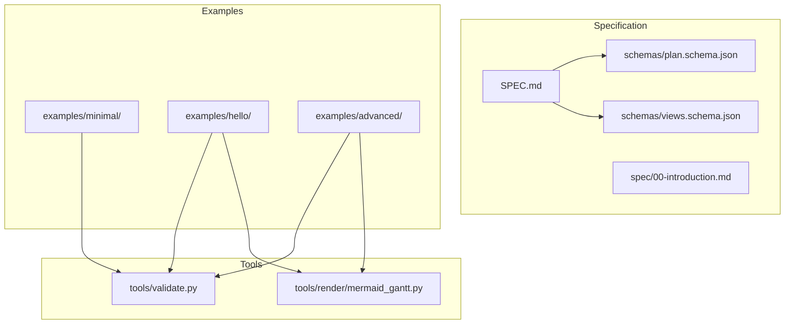
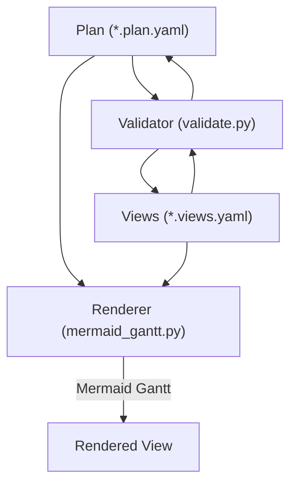
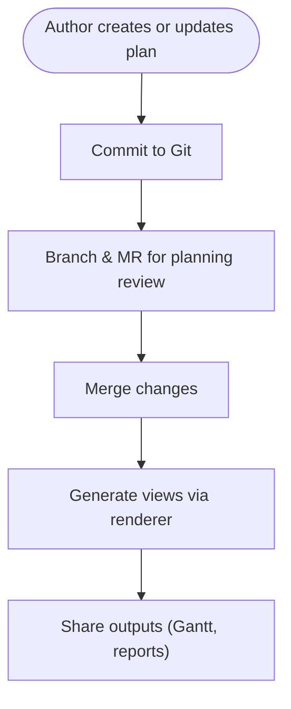
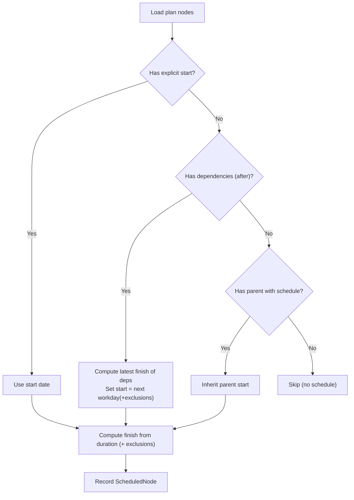
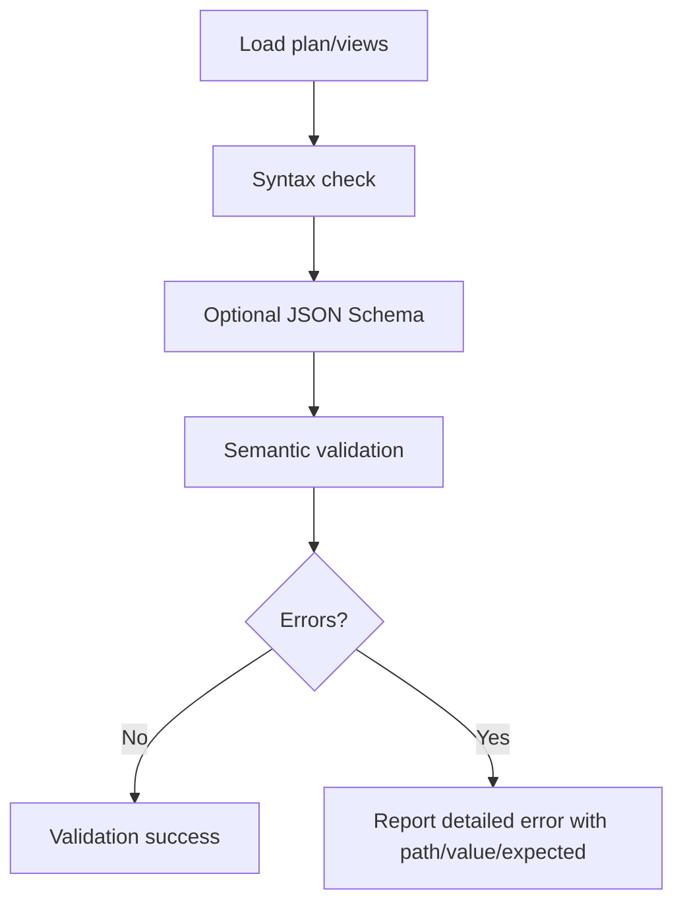
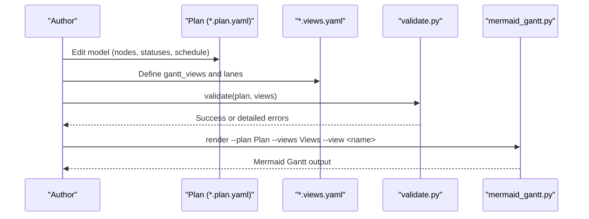
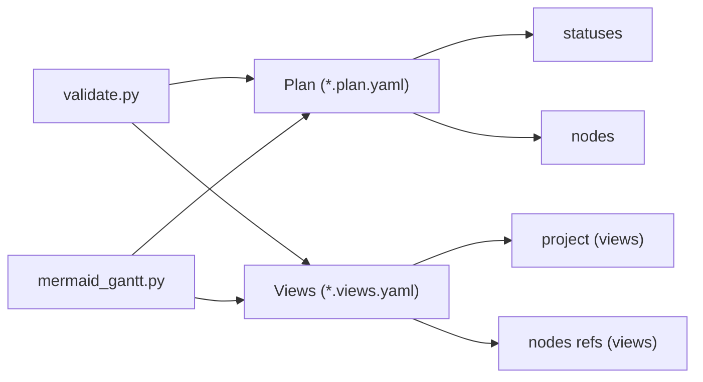

# Core Philosophy and Benefits

<cite>
**Referenced Files in This Document**
- [README.md](file://README.md)
- [docs/method.md](file://docs/method.md)
- [specs/v1/SPEC.md](file://specs/v1/SPEC.md)
- [specs/v1/spec/00-introduction.md](file://specs/v1/spec/00-introduction.md)
- [specs/v1/examples/hello/README.md](file://specs/v1/examples/hello/README.md)
- [specs/v1/examples/hello/hello.plan.yaml](file://specs/v1/examples/hello/hello.plan.yaml)
- [specs/v1/examples/hello/hello.views.yaml](file://specs/v1/examples/hello/hello.views.yaml)
- [specs/v1/examples/advanced/README.md](file://specs/v1/examples/advanced/README.md)
- [specs/v1/examples/advanced/program.plan.yaml](file://specs/v1/examples/advanced/program.plan.yaml)
- [specs/v1/examples/advanced/program.views.yaml](file://specs/v1/examples/advanced/program.views.yaml)
- [specs/v1/examples/minimal/README.md](file://specs/v1/examples/minimal/README.md)
- [specs/v1/examples/minimal/project.plan.yaml](file://specs/v1/examples/minimal/project.plan.yaml)
- [specs/v1/tools/validate.py](file://specs/v1/tools/validate.py)
- [specs/v1/tools/render/mermaid_gantt.py](file://specs/v1/tools/render/mermaid_gantt.py)
</cite>

## Table of Contents
1. [Introduction](#introduction)
2. [Project Structure](#project-structure)
3. [Core Components](#core-components)
4. [Architecture Overview](#architecture-overview)
5. [Detailed Component Analysis](#detailed-component-analysis)
6. [Dependency Analysis](#dependency-analysis)
7. [Performance Considerations](#performance-considerations)
8. [Troubleshooting Guide](#troubleshooting-guide)
9. [Conclusion](#conclusion)

## Introduction
Opskarta is a plan-as-code framework that turns project planning into a version-controlled, structured artifact. Instead of scattering planning across tools like spreadsheets, issue trackers, and wikis, Opskarta centralizes the “single source of truth” in a plain-text, machine-parseable file. This approach enables reproducible planning, automated validation, and flexible multi-view generation from a single canonical model.

Key benefits:
- Single source of truth: One canonical plan file replaces fragmented planning systems.
- Reproducible planning: Deterministic scheduling and dependency resolution produce consistent timelines.
- Automated validation: Built-in checks catch structural and semantic errors early.
- Multi-view generation: Separate views describe how to look at the plan, enabling many renderings from one model.

Compared to traditional tools:
- Jira, Excel, and Confluence often fragment the “truth,” require manual updates, and lack robust diffs. Opskarta stores planning as code, leveraging version control for history, branches, and collaboration.
- Opskarta’s separation of concerns (model vs. views) lets stakeholders see tailored perspectives without reworking the underlying model.

Practical examples:
- Version control enhances planning workflows by allowing branches for scenarios (“what if”), merge requests for planning reviews, and audit trails for decisions.
- Collaboration improves because planning is a shared, diffable artifact rather than scattered documents.

**Section sources**
- [README.md](file://README.md#L1-L96)
- [docs/method.md](file://docs/method.md#L1-L120)
- [specs/v1/SPEC.md](file://specs/v1/SPEC.md#L1-L407)

## Project Structure
The repository organizes specification, examples, and tooling around the plan-as-code principle:
- Specification and schema define the data model and validation rules.
- Examples demonstrate minimal, basic, and advanced usage.
- Tools provide validation and rendering capabilities.

**Diagram sources**
- [specs/v1/SPEC.md](file://specs/v1/SPEC.md#L1-L407)
- [specs/v1/spec/00-introduction.md](file://specs/v1/spec/00-introduction.md#L1-L10)
- [specs/v1/examples/hello/README.md](file://specs/v1/examples/hello/README.md#L1-L53)
- [specs/v1/examples/advanced/README.md](file://specs/v1/examples/advanced/README.md#L1-L172)
- [specs/v1/examples/minimal/README.md](file://specs/v1/examples/minimal/README.md#L1-L52)
- [specs/v1/tools/validate.py](file://specs/v1/tools/validate.py#L1-L752)
- [specs/v1/tools/render/mermaid_gantt.py](file://specs/v1/tools/render/mermaid_gantt.py#L1-L549)

**Section sources**
- [specs/v1/SPEC.md](file://specs/v1/SPEC.md#L1-L407)
- [specs/v1/examples/hello/README.md](file://specs/v1/examples/hello/README.md#L1-L53)
- [specs/v1/examples/advanced/README.md](file://specs/v1/examples/advanced/README.md#L1-L172)
- [specs/v1/examples/minimal/README.md](file://specs/v1/examples/minimal/README.md#L1-L52)
- [specs/v1/tools/validate.py](file://specs/v1/tools/validate.py#L1-L752)
- [specs/v1/tools/render/mermaid_gantt.py](file://specs/v1/tools/render/mermaid_gantt.py#L1-L549)

## Core Components
- Plan file: Canonical model of works, hierarchy, dependencies, and optional scheduling attributes. It is the single source of truth for planning.
- Views file: Describes how to render the plan (e.g., Gantt lanes, exclusions). Multiple views enable different stakeholder perspectives.
- Validation: Enforces structural and semantic correctness (required fields, referential integrity, cycles, formats).
- Rendering: Produces Mermaid Gantt diagrams and other outputs from the plan and selected view.

Benefits in practice:
- Single source of truth: The plan file is the authoritative artifact; views are derived.
- Reproducible planning: Scheduling computed deterministically from explicit start dates and dependencies.
- Automated validation: Early detection of invalid references, cycles, and formats.
- Multi-view generation: One model renders multiple views (executive overview, team detail, critical path).

**Section sources**
- [specs/v1/SPEC.md](file://specs/v1/SPEC.md#L27-L156)
- [specs/v1/SPEC.md](file://specs/v1/SPEC.md#L98-L132)
- [specs/v1/SPEC.md](file://specs/v1/SPEC.md#L241-L380)
- [specs/v1/tools/validate.py](file://specs/v1/tools/validate.py#L135-L329)
- [specs/v1/tools/validate.py](file://specs/v1/tools/validate.py#L431-L579)
- [specs/v1/tools/render/mermaid_gantt.py](file://specs/v1/tools/render/mermaid_gantt.py#L217-L294)

## Architecture Overview
Opskarta separates the planning model from presentation:
- Model (plan): Defines nodes, statuses, hierarchy, dependencies, and optional scheduling.
- Views: Define rendering scope and presentation details (e.g., lanes, exclusions).
- Tools: Validate and render.

**Diagram sources**
- [specs/v1/tools/validate.py](file://specs/v1/tools/validate.py#L135-L329)
- [specs/v1/tools/validate.py](file://specs/v1/tools/validate.py#L431-L579)
- [specs/v1/tools/render/mermaid_gantt.py](file://specs/v1/tools/render/mermaid_gantt.py#L349-L433)

**Section sources**
- [specs/v1/tools/validate.py](file://specs/v1/tools/validate.py#L135-L329)
- [specs/v1/tools/validate.py](file://specs/v1/tools/validate.py#L431-L579)
- [specs/v1/tools/render/mermaid_gantt.py](file://specs/v1/tools/render/mermaid_gantt.py#L349-L433)

## Detailed Component Analysis

### Plan-as-Code Philosophy
Opskarta treats planning as code:
- Stored as YAML/JSON, versioned in Git.
- Supports branching for scenarios (“what if”), merges for collaborative planning, and diffs for traceability.
- Keeps the model separate from systems-of-record (e.g., Jira), enabling independent evolution.

Practical advantages:
- No single point of failure: Planning is a shared artifact, not stored in one person’s head.
- Flexible structure: Add hypotheses, skeletons, and evolving plans without polluting operational systems.
- Tailored views: Different stakeholders consume the same model via different views.

**Section sources**
- [docs/method.md](file://docs/method.md#L22-L55)
- [docs/method.md](file://docs/method.md#L56-L92)
- [README.md](file://README.md#L8-L16)

### Single Source of Truth
The plan file is the authoritative source:
- Contains version, metadata, statuses, and nodes.
- Views link to the plan via a project identifier.
- Validation ensures referential integrity between plan and views.

**Diagram sources**
- [specs/v1/SPEC.md](file://specs/v1/SPEC.md#L27-L56)
- [specs/v1/SPEC.md](file://specs/v1/SPEC.md#L98-L132)
- [specs/v1/tools/validate.py](file://specs/v1/tools/validate.py#L431-L579)

**Section sources**
- [specs/v1/SPEC.md](file://specs/v1/SPEC.md#L27-L56)
- [specs/v1/SPEC.md](file://specs/v1/SPEC.md#L98-L132)
- [specs/v1/tools/validate.py](file://specs/v1/tools/validate.py#L431-L579)

### Reproducible Planning
Scheduling is deterministic:
- Explicit start dates and durations drive timeline computation.
- Dependencies (after) enforce ordering; parent relationships can propagate scheduling.
- Calendar exclusions (e.g., weekends) influence workday calculations.

**Diagram sources**
- [specs/v1/tools/render/mermaid_gantt.py](file://specs/v1/tools/render/mermaid_gantt.py#L217-L294)

**Section sources**
- [specs/v1/tools/render/mermaid_gantt.py](file://specs/v1/tools/render/mermaid_gantt.py#L217-L294)

### Automated Validation
Validation occurs at multiple levels:
- Syntax: YAML/JSON correctness.
- Schema: Field presence and types per JSON Schema.
- Semantics: Referential integrity, business rules, and cycle detection.

**Diagram sources**
- [specs/v1/tools/validate.py](file://specs/v1/tools/validate.py#L69-L129)
- [specs/v1/tools/validate.py](file://specs/v1/tools/validate.py#L135-L329)
- [specs/v1/tools/validate.py](file://specs/v1/tools/validate.py#L431-L579)

**Section sources**
- [specs/v1/tools/validate.py](file://specs/v1/tools/validate.py#L10-L16)
- [specs/v1/tools/validate.py](file://specs/v1/tools/validate.py#L135-L329)
- [specs/v1/tools/validate.py](file://specs/v1/tools/validate.py#L431-L579)

### Multi-View Generation
Views describe how to present the plan:
- Define Gantt views with lanes and node selections.
- Support calendar exclusions and titles.
- Renderer produces Mermaid Gantt output for each view.

**Diagram sources**
- [specs/v1/tools/validate.py](file://specs/v1/tools/validate.py#L634-L752)
- [specs/v1/tools/render/mermaid_gantt.py](file://specs/v1/tools/render/mermaid_gantt.py#L439-L549)

**Section sources**
- [specs/v1/SPEC.md](file://specs/v1/SPEC.md#L98-L132)
- [specs/v1/tools/render/mermaid_gantt.py](file://specs/v1/tools/render/mermaid_gantt.py#L349-L433)

### Practical Examples Demonstrating Version Control and Collaboration
- Minimal example: Absolute minimum plan with a single node, demonstrating the smallest valid structure.
- Hello example: Basic plan plus views, showing statuses, dependencies, scheduling, and notes.
- Advanced example: Full program plan with multiple tracks, cross-track dependencies, and extensive views.

Version control enhancements:
- Branches for alternate plans (“what if” scenarios).
- Pull/Merge Requests for planning reviews.
- Audit trail of decisions and changes.

Collaboration improvements:
- Everyone edits the same canonical model.
- Stakeholders consume tailored views without rework.
- Diff-friendly format supports precise change tracking.

**Section sources**
- [specs/v1/examples/minimal/README.md](file://specs/v1/examples/minimal/README.md#L1-L52)
- [specs/v1/examples/minimal/project.plan.yaml](file://specs/v1/examples/minimal/project.plan.yaml#L1-L6)
- [specs/v1/examples/hello/README.md](file://specs/v1/examples/hello/README.md#L1-L53)
- [specs/v1/examples/hello/hello.plan.yaml](file://specs/v1/examples/hello/hello.plan.yaml#L1-L44)
- [specs/v1/examples/hello/hello.views.yaml](file://specs/v1/examples/hello/hello.views.yaml#L1-L13)
- [specs/v1/examples/advanced/README.md](file://specs/v1/examples/advanced/README.md#L1-L172)
- [specs/v1/examples/advanced/program.plan.yaml](file://specs/v1/examples/advanced/program.plan.yaml#L1-L326)
- [specs/v1/examples/advanced/program.views.yaml](file://specs/v1/examples/advanced/program.views.yaml#L1-L93)

## Dependency Analysis
Opskarta’s design enforces clear boundaries:
- Plan depends on statuses and nodes; it may optionally include scheduling and notes.
- Views depend on the plan’s project identifier and node set.
- Tools depend on the plan and views schemas and produce rendered outputs.

**Diagram sources**
- [specs/v1/SPEC.md](file://specs/v1/SPEC.md#L27-L56)
- [specs/v1/SPEC.md](file://specs/v1/SPEC.md#L98-L132)
- [specs/v1/tools/validate.py](file://specs/v1/tools/validate.py#L431-L579)
- [specs/v1/tools/render/mermaid_gantt.py](file://specs/v1/tools/render/mermaid_gantt.py#L349-L433)

**Section sources**
- [specs/v1/SPEC.md](file://specs/v1/SPEC.md#L27-L56)
- [specs/v1/SPEC.md](file://specs/v1/SPEC.md#L98-L132)
- [specs/v1/tools/validate.py](file://specs/v1/tools/validate.py#L431-L579)
- [specs/v1/tools/render/mermaid_gantt.py](file://specs/v1/tools/render/mermaid_gantt.py#L349-L433)

## Performance Considerations
- Validation cost scales linearly with number of nodes and dependencies; cycle detection uses efficient graph traversal.
- Rendering cost is proportional to the number of nodes included in the selected view.
- Using calendar exclusions adds modest overhead during scheduling computations but improves realism for workday-based planning.

[No sources needed since this section provides general guidance]

## Troubleshooting Guide
Common issues and resolutions:
- Invalid references: Parent, after, or status keys must exist in the plan; validator reports exact path and available values.
- Cyclic dependencies: Both parent and after relationships are checked; validator surfaces the cycle path.
- Format errors: start must be YYYY-MM-DD; duration must be digits or digits followed by d/w.
- View-to-plan mismatch: project in views must match meta.id in plan; nodes in views must exist in plan.

Recommended workflow:
- Validate early and often.
- Use list-views mode to confirm available view names.
- Fix reported paths precisely; rerun validation until clean.

**Section sources**
- [specs/v1/tools/validate.py](file://specs/v1/tools/validate.py#L135-L329)
- [specs/v1/tools/validate.py](file://specs/v1/tools/validate.py#L431-L579)
- [specs/v1/tools/render/mermaid_gantt.py](file://specs/v1/tools/render/mermaid_gantt.py#L510-L524)

## Conclusion
Opskarta’s plan-as-code philosophy transforms project planning from ad-hoc, error-prone tools into a disciplined, version-controlled process. By separating the model from views, automating validation, and enabling reproducible scheduling, Opskarta delivers a single source of truth that supports collaboration, traceability, and flexible presentation. Compared to traditional tools, Opskarta leverages structured data formats and Git to improve reliability, repeatability, and stakeholder alignment.

[No sources needed since this section summarizes without analyzing specific files]