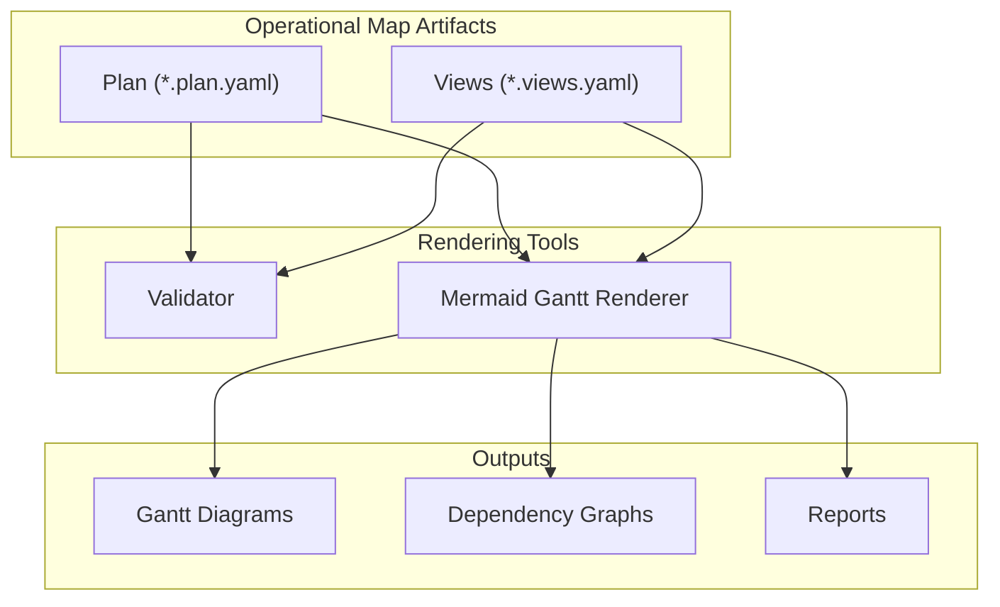
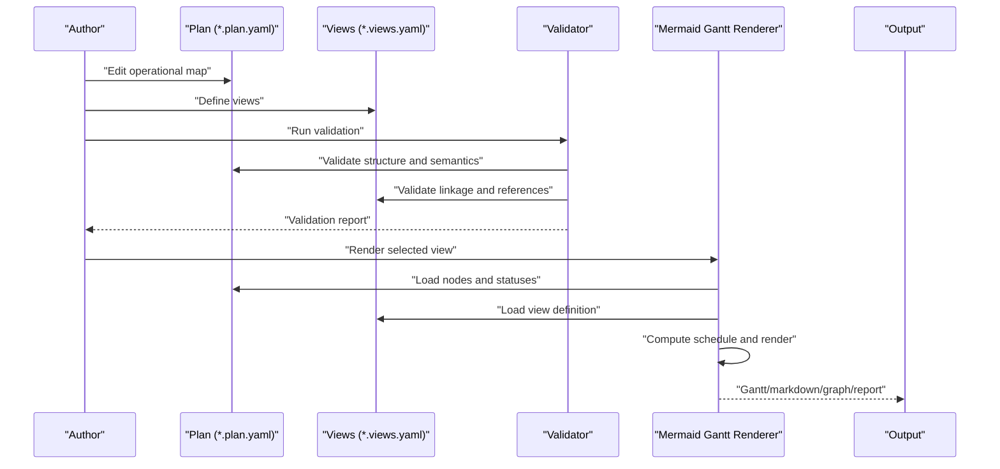
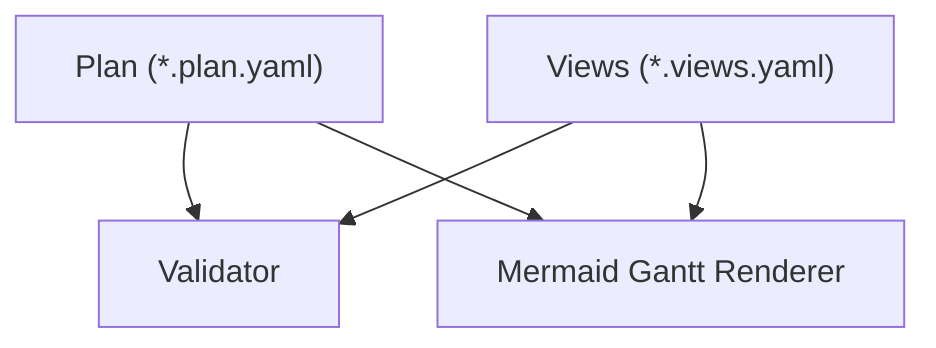

# Introduction to Operational Maps

<cite>
**Referenced Files in This Document**
- [README.md](file://README.md)
- [docs/method.md](file://docs/method.md)
- [specs/v1/SPEC.md](file://specs/v1/SPEC.md)
- [specs/v1/spec/00-introduction.md](file://specs/v1/spec/00-introduction.md)
- [specs/v1/tools/validate.py](file://specs/v1/tools/validate.py)
- [specs/v1/tools/render/mermaid_gantt.py](file://specs/v1/tools/render/mermaid_gantt.py)
- [specs/v1/examples/hello/hello.plan.yaml](file://specs/v1/examples/hello/hello.plan.yaml)
- [specs/v1/examples/hello/hello.views.yaml](file://specs/v1/examples/hello/hello.views.yaml)
- [specs/v1/examples/advanced/program.plan.yaml](file://specs/v1/examples/advanced/program.plan.yaml)
- [specs/v1/examples/advanced/program.views.yaml](file://specs/v1/examples/advanced/program.views.yaml)
</cite>

## Table of Contents
1. [Introduction](#introduction)
2. [Project Structure](#project-structure)
3. [Core Components](#core-components)
4. [Architecture Overview](#architecture-overview)
5. [Detailed Component Analysis](#detailed-component-analysis)
6. [Dependency Analysis](#dependency-analysis)
7. [Performance Considerations](#performance-considerations)
8. [Troubleshooting Guide](#troubleshooting-guide)
9. [Conclusion](#conclusion)

## Introduction
Operational maps are a way to capture the "what exists" of a program or project as a single, authoritative data model, and then derive multiple "how you look at it" views for different audiences and purposes. This separation enables version control, auditability, and multi-perspective analysis without duplicating work across tools.

At its core, an operational map is a structured representation of work items, their relationships, and optional temporal attributes. It is designed to be:
- A single source of truth for planning and coordination
- A stable, versionable artifact that lives alongside issue-tracking systems
- A model that can be rendered into multiple views (Gantt charts, dependency graphs, reports)

The philosophy is simple: separate the operational map (the data model) from views (the presentation layers). The operational map captures what exists; views describe how to look at it.

Why does this matter?
- You can keep one "manager's truth" and many renders
- You can version control the operational map and track changes over time
- You can generate multiple views for different stakeholders without rebuilding the picture manually
- You can integrate with external systems (e.g., sync statuses from Jira) while keeping the operational map as the canonical source

Practical example: a single operational map can generate:
- A high-level Gantt for leadership
- Team-specific Gantt lanes for backend, frontend, and infrastructure
- A critical path view focused on release blockers
- Dependency graphs for risk analysis
- Reports for stakeholder updates

Benefits:
- Version control: Track changes, compare diffs, and revert confidently
- Auditability: See who changed what and when
- Multi-perspective analysis: Different views for different audiences
- Extensibility: Add custom fields without breaking base compatibility

## Project Structure
The repository organizes operational maps around two complementary artifacts:
- Plan files (`.plan.yaml`): The operational map containing nodes, statuses, and optional scheduling metadata
- Views files (`.views.yaml`): Descriptions of how to render the plan into specific views (e.g., Gantt lanes)

**Diagram sources**
- [specs/v1/tools/validate.py](file://specs/v1/tools/validate.py#L634-L751)
- [specs/v1/tools/render/mermaid_gantt.py](file://specs/v1/tools/render/mermaid_gantt.py#L439-L548)

**Section sources**
- [README.md](file://README.md#L16-L96)
- [specs/v1/SPEC.md](file://specs/v1/SPEC.md#L27-L131)

## Core Components
- Operational map (plan): A YAML/JSON document that defines:
  - Versioning
  - Metadata (id, title)
  - Statuses (labels and colors)
  - Nodes (work items) with kinds, statuses, parents, dependencies, and optional scheduling attributes
- Views: A YAML/JSON document that defines:
  - Versioning and project linkage to the plan
  - Gantt views with titles, calendar exclusions, and lanes
  - Lane definitions that select subsets of nodes for rendering

These components are intentionally decoupled so that changing the operational map does not require updating every view, and vice versa.

**Section sources**
- [specs/v1/SPEC.md](file://specs/v1/SPEC.md#L27-L131)
- [specs/v1/spec/00-introduction.md](file://specs/v1/spec/00-introduction.md#L1-L10)

## Architecture Overview
The operational map architecture separates concerns between data and presentation:

- Data model (operational map): Captures structure, semantics, and optional scheduling
- Presentation model (views): Defines how to slice and render the data for specific audiences
- Rendering pipeline: Validates inputs, computes schedules, and emits outputs (e.g., Mermaid Gantt)

**Diagram sources**
- [specs/v1/tools/validate.py](file://specs/v1/tools/validate.py#L634-L751)
- [specs/v1/tools/render/mermaid_gantt.py](file://specs/v1/tools/render/mermaid_gantt.py#L439-L548)

## Detailed Component Analysis

### Operational Map (Plan)
The operational map is the single source of truth for program/project planning. It captures:
- Structural relationships: parent-child hierarchy for decomposition
- Dependencies: "after" relationships that define ordering
- Optional scheduling: start dates and durations
- Statuses: human-readable labels and colors
- Notes and cross-references: contextual information and links to external systems

Key characteristics:
- Separates "what exists" from "how you look at it"
- Supports version control and diff-friendly editing
- Allows custom extensions (e.g., team assignments, risks, milestones) without breaking base compatibility

Practical example: The hello example demonstrates a minimal operational map with a summary, phases, and tasks, while the advanced example shows a multi-track program with deep hierarchy, cross-track dependencies, and custom extensions.

**Section sources**
- [specs/v1/SPEC.md](file://specs/v1/SPEC.md#L27-L95)
- [specs/v1/examples/hello/hello.plan.yaml](file://specs/v1/examples/hello/hello.plan.yaml#L1-L44)
- [specs/v1/examples/advanced/program.plan.yaml](file://specs/v1/examples/advanced/program.plan.yaml#L1-L326)

### Views (Presentation)
Views describe how to look at the operational map. They include:
- Titles and calendar exclusions (e.g., weekends)
- Lanes that group nodes for rendering
- Links to the operational map via project id

Benefits:
- Enables multiple perspectives from a single data source
- Keeps presentation logic separate from the data model
- Simplifies maintenance when the underlying data changes

Practical example: The hello example includes a single-lane Gantt view, while the advanced example includes five distinct Gantt views (overview, backend-detail, frontend-detail, infrastructure-detail, critical-path).

**Section sources**
- [specs/v1/SPEC.md](file://specs/v1/SPEC.md#L98-L131)
- [specs/v1/examples/hello/hello.views.yaml](file://specs/v1/examples/hello/hello.views.yaml#L1-L13)
- [specs/v1/examples/advanced/program.views.yaml](file://specs/v1/examples/advanced/program.views.yaml#L1-L93)

### Validation Pipeline
The validation pipeline ensures data integrity and referential correctness:
- Syntax validation (YAML/JSON parsing)
- Schema validation (optional)
- Semantic validation (referential integrity, business rules)

Validation checks include:
- Required fields (version, nodes, title)
- Parent and dependency references
- Status references
- Date and duration formats
- Cycle detection in parent and dependency graphs

**Section sources**
- [specs/v1/tools/validate.py](file://specs/v1/tools/validate.py#L135-L329)
- [specs/v1/tools/validate.py](file://specs/v1/tools/validate.py#L431-L579)

### Rendering Pipeline
The rendering pipeline transforms validated plans and views into visual outputs:
- Loads plan and views
- Computes schedules (start dates, finishes, durations)
- Applies calendar exclusions
- Emits Mermaid Gantt diagrams with theme-aware coloring

Rendering features:
- Theme variables derived from statuses
- Lane-based grouping
- Calendar exclusion support
- Error handling for missing nodes and invalid references

**Section sources**
- [specs/v1/tools/render/mermaid_gantt.py](file://specs/v1/tools/render/mermaid_gantt.py#L217-L294)
- [specs/v1/tools/render/mermaid_gantt.py](file://specs/v1/tools/render/mermaid_gantt.py#L349-L433)

### Practical Examples
- Minimal example: Demonstrates the smallest valid operational map with a single node and optional views
- Hello example: Shows a basic operational map with statuses, scheduling, and a single Gantt view
- Advanced example: Illustrates a multi-track program with cross-track dependencies, extensive lanes, and custom extensions

These examples illustrate how a single operational map can generate multiple views tailored to different audiences and use cases.

**Section sources**
- [specs/v1/examples/minimal/README.md](file://specs/v1/examples/minimal/README.md#L1-L52)
- [specs/v1/examples/hello/README.md](file://specs/v1/examples/hello/README.md#L1-L53)
- [specs/v1/examples/advanced/README.md](file://specs/v1/examples/advanced/README.md#L1-L172)

## Dependency Analysis
The operational map architecture enforces clear boundaries and dependencies:
- Views depend on the operational map (project id must match plan meta id)
- Nodes depend on parent and dependency relationships
- Rendering depends on validated inputs and computed schedules

**Diagram sources**
- [specs/v1/tools/validate.py](file://specs/v1/tools/validate.py#L634-L751)
- [specs/v1/tools/render/mermaid_gantt.py](file://specs/v1/tools/render/mermaid_gantt.py#L439-L548)

**Section sources**
- [specs/v1/tools/validate.py](file://specs/v1/tools/validate.py#L431-L579)
- [specs/v1/tools/render/mermaid_gantt.py](file://specs/v1/tools/render/mermaid_gantt.py#L349-L433)

## Performance Considerations
- Validation cost scales with the number of nodes and dependencies; keep views scoped to reduce unnecessary computation
- Rendering performance improves when calendar exclusions and theme computations are minimized
- Use targeted views to limit the number of nodes processed during rendering

## Troubleshooting Guide
Common issues and resolutions:
- Missing or invalid fields: Ensure version, nodes, and title are present; verify parent and dependency references exist
- Status mismatches: Confirm node statuses reference keys defined in the statuses section
- Date and duration formats: Use supported formats (YYYY-MM-DD for dates, <number>d or <number>w for durations)
- Calendar exclusions: Verify exclusions align with intended business calendars
- View linkage: Ensure project id in views matches meta.id in the plan

Diagnostic tips:
- Run the validator to receive detailed error messages with paths and expected values
- Use the renderer's list-views mode to confirm available view names
- Review examples for correct structure and field usage

**Section sources**
- [specs/v1/tools/validate.py](file://specs/v1/tools/validate.py#L30-L63)
- [specs/v1/tools/validate.py](file://specs/v1/tools/validate.py#L691-L747)
- [specs/v1/tools/render/mermaid_gantt.py](file://specs/v1/tools/render/mermaid_gantt.py#L510-L524)

## Conclusion
Operational maps provide a powerful approach to program/project planning by separating the "what exists" from the "how you look at it." This separation enables version control, auditability, and multi-perspective analysis through a single, authoritative operational map. By structuring work items, dependencies, and optional scheduling in a plan file, and describing how to render them in views, teams can generate multiple outputs (Gantt charts, dependency graphs, reports) tailored to different stakeholders. The included tools demonstrate validation and rendering workflows, while the examples show how to apply this approach to simple and complex scenarios alike.