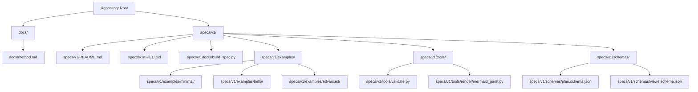
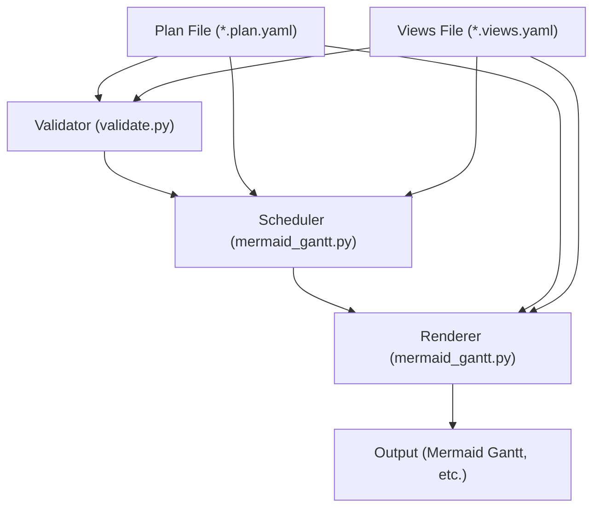
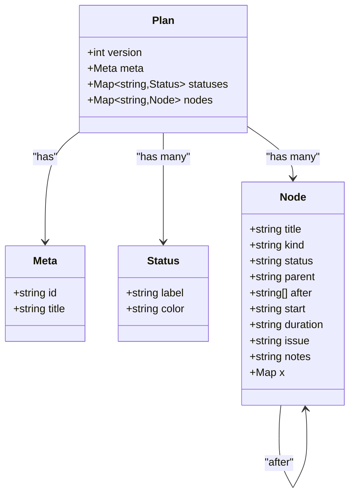
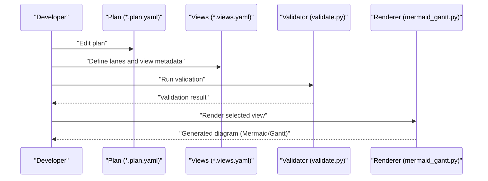
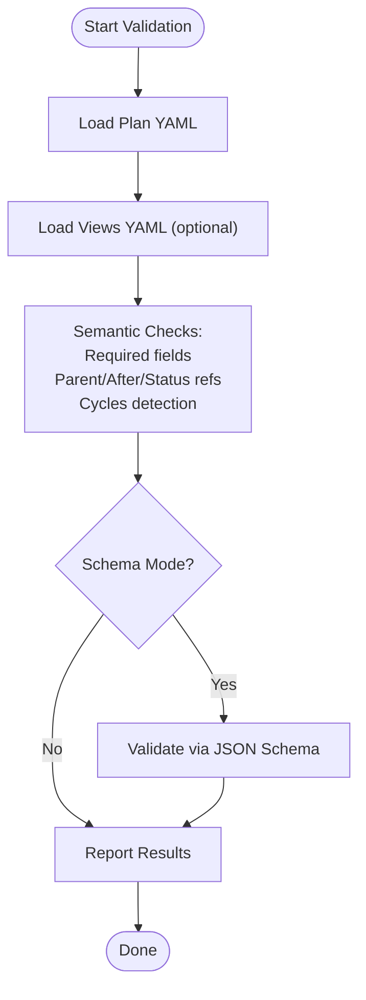
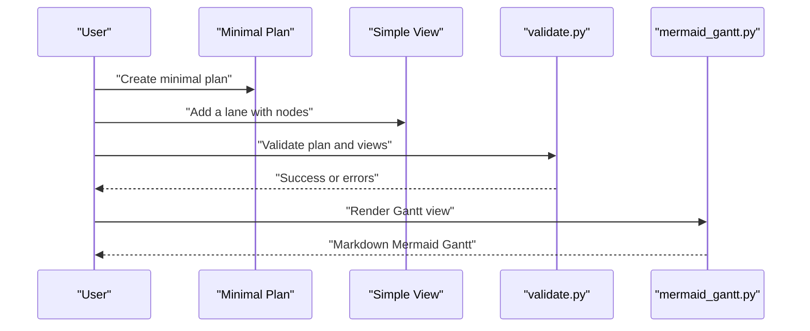
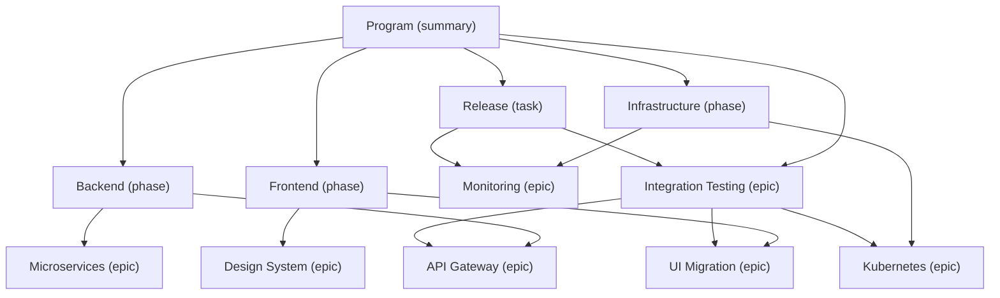
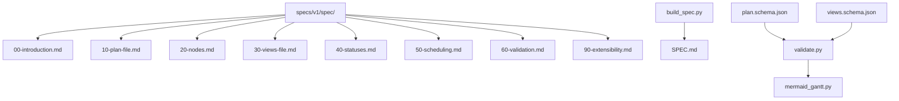

# Project Overview

<cite>
**Referenced Files in This Document**
- [README.md](file://README.md)
- [specs/v1/README.md](file://specs/v1/README.md)
- [specs/v1/SPEC.md](file://specs/v1/SPEC.md)
- [specs/v1/spec/00-introduction.md](file://specs/v1/spec/00-introduction.md)
- [specs/v1/examples/minimal/README.md](file://specs/v1/examples/minimal/README.md)
- [specs/v1/examples/minimal/project.plan.yaml](file://specs/v1/examples/minimal/project.plan.yaml)
- [specs/v1/examples/hello/hello.plan.yaml](file://specs/v1/examples/hello/hello.plan.yaml)
- [specs/v1/examples/hello/hello.views.yaml](file://specs/v1/examples/hello/hello.views.yaml)
- [specs/v1/examples/advanced/README.md](file://specs/v1/examples/advanced/README.md)
- [specs/v1/examples/advanced/program.plan.yaml](file://specs/v1/examples/advanced/program.plan.yaml)
- [specs/v1/examples/advanced/program.views.yaml](file://specs/v1/examples/advanced/program.views.yaml)
- [specs/v1/tools/validate.py](file://specs/v1/tools/validate.py)
- [specs/v1/tools/render/mermaid_gantt.py](file://specs/v1/tools/render/mermaid_gantt.py)
- [specs/v1/schemas/plan.schema.json](file://specs/v1/schemas/plan.schema.json)
- [specs/v1/schemas/views.schema.json](file://specs/v1/schemas/views.schema.json)
- [specs/v1/tools/build_spec.py](file://specs/v1/tools/build_spec.py)
- [docs/method.md](file://docs/method.md)
</cite>

## Table of Contents
1. [Introduction](#introduction)
2. [Project Structure](#project-structure)
3. [Core Components](#core-components)
4. [Architecture Overview](#architecture-overview)
5. [Detailed Component Analysis](#detailed-component-analysis)
6. [Dependency Analysis](#dependency-analysis)
7. [Performance Considerations](#performance-considerations)
8. [Troubleshooting Guide](#troubleshooting-guide)
9. [Conclusion](#conclusion)
10. [Appendices](#appendices)

## Introduction
Opskarta is an open data format for operational program/cartography built around the principle of plan-as-code. It defines a simple, versioned, and extensible specification for describing operational plans and generating multiple views (renderings) from a single source of truth. The project’s goal is to separate the “model” (the plan) from the “views” (how you look at the plan), enabling version-controlled planning, flexible rendering, and collaboration across teams and tools.

Key ideas:
- Operational map: a structured graph of works with hierarchy, dependencies, and optional scheduling attributes.
- Plan-as-code: keep your operational interpretation in a versioned YAML/JSON file that diffs well and supports branching.
- Views: define multiple renderings (e.g., Gantt lanes, dependency graphs) from the same plan.
- Rendering: transform the plan into diagrams, reports, or integrations via tools and plugins.

This overview introduces both the conceptual foundations for beginners and the technical specification for developers, including the v1 specification, examples, and tooling.

**Section sources**
- [README.md](file://README.md#L1-L96)
- [docs/method.md](file://docs/method.md#L1-L120)
- [specs/v1/README.md](file://specs/v1/README.md#L1-L27)

## Project Structure
At a high level, the repository organizes the specification, examples, schemas, and tooling under specs/v1/. The top-level README demonstrates quick start usage and links to documentation and examples. The v1 specification is composed from modular Markdown chapters and assembled into a single SPEC.md via a build script.

**Diagram sources**
- [README.md](file://README.md#L1-L96)
- [specs/v1/README.md](file://specs/v1/README.md#L1-L27)
- [specs/v1/tools/build_spec.py](file://specs/v1/tools/build_spec.py#L1-L240)

**Section sources**
- [README.md](file://README.md#L1-L96)
- [specs/v1/README.md](file://specs/v1/README.md#L1-L27)
- [specs/v1/tools/build_spec.py](file://specs/v1/tools/build_spec.py#L1-L240)

## Core Components
- Operational map: a hierarchical graph of works described in a plan file. Each node carries metadata such as title, kind, status, parent, dependencies (after), and optional scheduling attributes (start, duration).
- Views: a companion file that describes how to render the plan into multiple views (e.g., Gantt lanes), including calendar exclusions and lane composition.
- Rendering: a process that transforms plan and views into diagrams (e.g., Mermaid Gantt) or other artifacts.
- Validation: a semantic validator that checks required fields, referential integrity, and business rules; optionally augmented by JSON Schema.
- Extensibility: reserved namespaces (x:) to carry custom fields without breaking compatibility.

Practical example (conceptual):
- Create a minimal plan with a single node.
- Add a views file that selects a subset of nodes for a lane.
- Validate both files.
- Render a Gantt view.

**Section sources**
- [specs/v1/SPEC.md](file://specs/v1/SPEC.md#L27-L96)
- [specs/v1/SPEC.md](file://specs/v1/SPEC.md#L98-L132)
- [specs/v1/SPEC.md](file://specs/v1/SPEC.md#L134-L156)
- [specs/v1/SPEC.md](file://specs/v1/SPEC.md#L159-L238)
- [specs/v1/SPEC.md](file://specs/v1/SPEC.md#L241-L380)
- [specs/v1/SPEC.md](file://specs/v1/SPEC.md#L383-L407)
- [specs/v1/examples/minimal/README.md](file://specs/v1/examples/minimal/README.md#L1-L52)
- [specs/v1/examples/hello/hello.plan.yaml](file://specs/v1/examples/hello/hello.plan.yaml#L1-L44)
- [specs/v1/examples/hello/hello.views.yaml](file://specs/v1/examples/hello/hello.views.yaml#L1-L13)
- [specs/v1/tools/validate.py](file://specs/v1/tools/validate.py#L1-L752)
- [specs/v1/tools/render/mermaid_gantt.py](file://specs/v1/tools/render/mermaid_gantt.py#L1-L549)

## Architecture Overview
The Opskarta architecture separates concerns between the plan (model) and views (rendering configuration). A plan file defines the operational map. Views describe how to render subsets of the plan. Validation ensures correctness before rendering. Rendering produces diagrams or artifacts.

**Diagram sources**
- [specs/v1/tools/validate.py](file://specs/v1/tools/validate.py#L1-L752)
- [specs/v1/tools/render/mermaid_gantt.py](file://specs/v1/tools/render/mermaid_gantt.py#L1-L549)

**Section sources**
- [specs/v1/tools/validate.py](file://specs/v1/tools/validate.py#L1-L752)
- [specs/v1/tools/render/mermaid_gantt.py](file://specs/v1/tools/render/mermaid_gantt.py#L1-L549)

## Detailed Component Analysis

### Operational Map (Plan)
An operational map is a hierarchical collection of nodes with semantics for kinds, statuses, parents, dependencies, and scheduling. The plan file also includes metadata and optional custom fields.

**Diagram sources**
- [specs/v1/SPEC.md](file://specs/v1/SPEC.md#L27-L96)
- [specs/v1/SPEC.md](file://specs/v1/SPEC.md#L134-L156)
- [specs/v1/SPEC.md](file://specs/v1/SPEC.md#L159-L238)

**Section sources**
- [specs/v1/SPEC.md](file://specs/v1/SPEC.md#L27-L96)
- [specs/v1/SPEC.md](file://specs/v1/SPEC.md#L134-L156)
- [specs/v1/SPEC.md](file://specs/v1/SPEC.md#L159-L238)

### Views and Rendering
Views define how to render the plan into diagrams (e.g., Gantt lanes). They include project linkage, view metadata, and lane definitions. Rendering consumes plan and views to produce diagrams.

**Diagram sources**
- [specs/v1/examples/hello/hello.plan.yaml](file://specs/v1/examples/hello/hello.plan.yaml#L1-L44)
- [specs/v1/examples/hello/hello.views.yaml](file://specs/v1/examples/hello/hello.views.yaml#L1-L13)
- [specs/v1/tools/validate.py](file://specs/v1/tools/validate.py#L1-L752)
- [specs/v1/tools/render/mermaid_gantt.py](file://specs/v1/tools/render/mermaid_gantt.py#L1-L549)

**Section sources**
- [specs/v1/SPEC.md](file://specs/v1/SPEC.md#L98-L132)
- [specs/v1/examples/hello/hello.views.yaml](file://specs/v1/examples/hello/hello.views.yaml#L1-L13)
- [specs/v1/tools/render/mermaid_gantt.py](file://specs/v1/tools/render/mermaid_gantt.py#L1-L549)

### Validation Workflow
The validator performs syntax, schema, and semantic checks. It verifies required fields, referential integrity (parent/after/status), and business rules, and can optionally validate against JSON Schemas.

**Diagram sources**
- [specs/v1/tools/validate.py](file://specs/v1/tools/validate.py#L1-L752)
- [specs/v1/schemas/plan.schema.json](file://specs/v1/schemas/plan.schema.json#L1-L86)
- [specs/v1/schemas/views.schema.json](file://specs/v1/schemas/views.schema.json#L1-L26)

**Section sources**
- [specs/v1/tools/validate.py](file://specs/v1/tools/validate.py#L1-L752)
- [specs/v1/schemas/plan.schema.json](file://specs/v1/schemas/plan.schema.json#L1-L86)
- [specs/v1/schemas/views.schema.json](file://specs/v1/schemas/views.schema.json#L1-L26)

### Practical Workflow: From Plan to Multiple Views
Beginners: Start with a minimal plan and a simple view, then iterate.
Experienced developers: Use advanced plans with cross-track dependencies, multiple views, and custom extensions.

**Diagram sources**
- [specs/v1/examples/minimal/README.md](file://specs/v1/examples/minimal/README.md#L1-L52)
- [specs/v1/examples/minimal/project.plan.yaml](file://specs/v1/examples/minimal/project.plan.yaml#L1-L6)
- [specs/v1/examples/hello/hello.views.yaml](file://specs/v1/examples/hello/hello.views.yaml#L1-L13)
- [specs/v1/tools/validate.py](file://specs/v1/tools/validate.py#L1-L752)
- [specs/v1/tools/render/mermaid_gantt.py](file://specs/v1/tools/render/mermaid_gantt.py#L1-L549)

**Section sources**
- [specs/v1/examples/minimal/README.md](file://specs/v1/examples/minimal/README.md#L1-L52)
- [specs/v1/examples/hello/hello.plan.yaml](file://specs/v1/examples/hello/hello.plan.yaml#L1-L44)
- [specs/v1/examples/hello/hello.views.yaml](file://specs/v1/examples/hello/hello.views.yaml#L1-L13)
- [specs/v1/tools/validate.py](file://specs/v1/tools/validate.py#L1-L752)
- [specs/v1/tools/render/mermaid_gantt.py](file://specs/v1/tools/render/mermaid_gantt.py#L1-L549)

### Advanced Example: Multi-Team Program
The advanced example demonstrates a multi-track program with cross-team dependencies, multiple views, calendar exclusions, and custom extensions.

**Diagram sources**
- [specs/v1/examples/advanced/program.plan.yaml](file://specs/v1/examples/advanced/program.plan.yaml#L1-L326)

**Section sources**
- [specs/v1/examples/advanced/README.md](file://specs/v1/examples/advanced/README.md#L1-L172)
- [specs/v1/examples/advanced/program.plan.yaml](file://specs/v1/examples/advanced/program.plan.yaml#L1-L326)
- [specs/v1/examples/advanced/program.views.yaml](file://specs/v1/examples/advanced/program.views.yaml#L1-L93)

## Dependency Analysis
The v1 specification is organized into modular chapters assembled into a single document. The validator depends on JSON Schema files for schema-level checks. The renderer depends on the plan and views to produce diagrams.

**Diagram sources**
- [specs/v1/tools/build_spec.py](file://specs/v1/tools/build_spec.py#L1-L240)
- [specs/v1/SPEC.md](file://specs/v1/SPEC.md#L1-L407)
- [specs/v1/schemas/plan.schema.json](file://specs/v1/schemas/plan.schema.json#L1-L86)
- [specs/v1/schemas/views.schema.json](file://specs/v1/schemas/views.schema.json#L1-L26)
- [specs/v1/tools/validate.py](file://specs/v1/tools/validate.py#L1-L752)
- [specs/v1/tools/render/mermaid_gantt.py](file://specs/v1/tools/render/mermaid_gantt.py#L1-L549)

**Section sources**
- [specs/v1/tools/build_spec.py](file://specs/v1/tools/build_spec.py#L1-L240)
- [specs/v1/SPEC.md](file://specs/v1/SPEC.md#L1-L407)
- [specs/v1/schemas/plan.schema.json](file://specs/v1/schemas/plan.schema.json#L1-L86)
- [specs/v1/schemas/views.schema.json](file://specs/v1/schemas/views.schema.json#L1-L26)
- [specs/v1/tools/validate.py](file://specs/v1/tools/validate.py#L1-L752)
- [specs/v1/tools/render/mermaid_gantt.py](file://specs/v1/tools/render/mermaid_gantt.py#L1-L549)

## Performance Considerations
- Validation cost scales with the number of nodes and dependencies; keep views scoped to reduce rendering workload.
- Calendar exclusion logic (e.g., weekends) affects scheduling computations; use appropriate exclusions to avoid unnecessary recalculations.
- JSON Schema validation adds overhead but improves early failure detection; use it selectively during development.
- Rendering performance depends on the number of nodes per lane and the complexity of the diagram; split views into focused lanes.

[No sources needed since this section provides general guidance]

## Troubleshooting Guide
Common issues and remedies:
- Missing or invalid fields: ensure version, nodes, and required node.title are present; check formats for start and duration.
- Referential errors: verify parent and after references exist and form acyclic graphs.
- Status mismatch: confirm node status keys exist in the statuses dictionary.
- View linkage: ensure project matches meta.id from the plan.
- Calendar exclusions: confirm supported exclusions and correct date formats.

Useful commands:
- Validate a plan: python tools/validate.py examples/minimal/project.plan.yaml
- Validate plan and views: python tools/validate.py examples/hello/hello.plan.yaml examples/hello/hello.views.yaml
- Render a Gantt view: python -m tools.render.mermaid_gantt --plan ... --views ... --view overview

**Section sources**
- [specs/v1/tools/validate.py](file://specs/v1/tools/validate.py#L1-L752)
- [specs/v1/SPEC.md](file://specs/v1/SPEC.md#L241-L380)
- [README.md](file://README.md#L68-L91)

## Conclusion
Opskarta offers a pragmatic, open, and extensible format for operational program/cartography. By embracing plan-as-code, separating the model from views, and providing robust validation and rendering tooling, it enables teams to maintain a single source of truth, generate multiple perspectives, and integrate with diverse systems and tools. The v1 specification establishes a solid foundation, and the included examples and tools demonstrate real-world usage patterns.

[No sources needed since this section summarizes without analyzing specific files]

## Appendices

### Beginner’s Conceptual Overview
- What is an operational map? A structured representation of works with hierarchy, dependencies, and optional scheduling.
- Why separate plan and views? One model, many renderings tailored to different audiences.
- How does plan-as-code help? Version control, diffs, branches, and collaborative editing without external tools.

**Section sources**
- [docs/method.md](file://docs/method.md#L35-L72)

### Developer Reference: v1 Specification Highlights
- Serialization: YAML recommended; JSON supported.
- Versioning: version field at the root.
- Nodes: title required; kind, status, parent, after, start, duration, issue, notes optional.
- Views: project must match meta.id; gantt_views define lanes and exclusions.
- Validation: required fields, referential integrity, and business rules; optional JSON Schema.
- Extensibility: reserved x: namespace for custom fields.

**Section sources**
- [specs/v1/spec/00-introduction.md](file://specs/v1/spec/00-introduction.md#L1-L10)
- [specs/v1/SPEC.md](file://specs/v1/SPEC.md#L27-L96)
- [specs/v1/SPEC.md](file://specs/v1/SPEC.md#L98-L132)
- [specs/v1/SPEC.md](file://specs/v1/SPEC.md#L134-L156)
- [specs/v1/SPEC.md](file://specs/v1/SPEC.md#L159-L238)
- [specs/v1/SPEC.md](file://specs/v1/SPEC.md#L241-L380)
- [specs/v1/SPEC.md](file://specs/v1/SPEC.md#L383-L407)