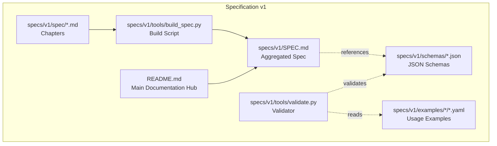
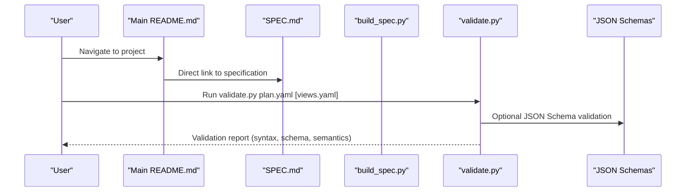
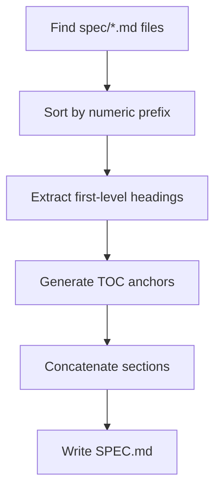
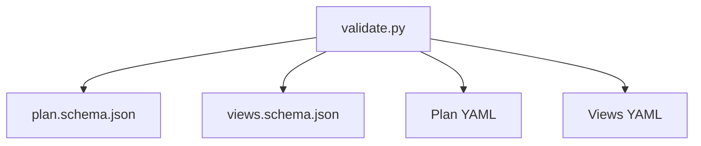

# Specification Versions and Evolution

<cite>
**Referenced Files in This Document**
- [README.md](file://README.md)
- [specs/v1/README.md](file://specs/v1/README.md)
- [specs/v1/SPEC.md](file://specs/v1/SPEC.md)
- [specs/v1/spec/00-introduction.md](file://specs/v1/spec/00-introduction.md)
- [specs/v1/spec/10-plan-file.md](file://specs/v1/spec/10-plan-file.md)
- [specs/v1/spec/20-nodes.md](file://specs/v1/spec/20-nodes.md)
- [specs/v1/spec/30-views-file.md](file://specs/v1/spec/30-views-file.md)
- [specs/v1/spec/40-statuses.md](file://specs/v1/spec/40-statuses.md)
- [specs/v1/spec/50-scheduling.md](file://specs/v1/spec/50-scheduling.md)
- [specs/v1/spec/60-validation.md](file://specs/v1/spec/60-validation.md)
- [specs/v1/tools/build_spec.py](file://specs/v1/tools/build_spec.py)
- [specs/v1/tools/validate.py](file://specs/v1/tools/validate.py)
- [specs/v1/schemas/plan.schema.json](file://specs/v1/schemas/plan.schema.json)
- [specs/v1/schemas/views.schema.json](file://specs/v1/schemas/views.schema.json)
- [specs/v1/examples/minimal/project.plan.yaml](file://specs/v1/examples/minimal/project.plan.yaml)
- [specs/v1/examples/hello/hello.plan.yaml](file://specs/v1/examples/hello/hello.plan.yaml)
- [specs/v1/examples/hello/hello.views.yaml](file://specs/v1/examples/hello/hello.views.yaml)
</cite>

## Update Summary
**Changes Made**
- Enhanced documentation to reflect improved markdown formatting in the version table rendering
- Updated the "Project Structure" section to emphasize the streamlined documentation access pattern
- Added emphasis on the direct link from the main README.md to SPEC.md for better user experience
- Improved accessibility to specification details through enhanced documentation linking structure

## Table of Contents
1. [Introduction](#introduction)
2. [Project Structure](#project-structure)
3. [Core Components](#core-components)
4. [Architecture Overview](#architecture-overview)
5. [Detailed Component Analysis](#detailed-component-analysis)
6. [Dependency Analysis](#dependency-analysis)
7. [Performance Considerations](#performance-considerations)
8. [Troubleshooting Guide](#troubleshooting-guide)
9. [Conclusion](#conclusion)

## Introduction
This document explains the evolution and current state of the Opskarta specification, focusing on the v1 specification. It covers the versioning strategy, current alpha status, roadmap considerations, backward compatibility, building process, feature introduction, migration guidance, and practical advice for selecting the right version for different use cases.

**Updated** Enhanced accessibility to specification details through improved documentation linking structure and proper markdown formatting for version table rendering, making v1 specification resources more discoverable for users.

## Project Structure
The Opskarta specification v1 is organized as a modular, documentation-driven specification with supporting tools and schemas:
- Specification chapters are authored in separate Markdown files under specs/v1/spec/.
- A build script aggregates these chapters into a single specification document.
- JSON Schemas define formal validation rules for plan and views files.
- A validator enforces both schema-level and semantic rules.
- Examples demonstrate minimal and advanced usage patterns.
- **Enhanced Documentation Access**: The main README.md now provides direct links to SPEC.md for immediate access to specification details, with improved markdown formatting for better table rendering.

**Diagram sources**
- [specs/v1/tools/build_spec.py](file://specs/v1/tools/build_spec.py#L1-L240)
- [specs/v1/SPEC.md](file://specs/v1/SPEC.md#L1-L407)
- [specs/v1/schemas/plan.schema.json](file://specs/v1/schemas/plan.schema.json#L1-L86)
- [specs/v1/schemas/views.schema.json](file://specs/v1/schemas/views.schema.json#L1-L26)
- [specs/v1/tools/validate.py](file://specs/v1/tools/validate.py#L1-L752)
- [README.md](file://README.md#L10-L14)

**Section sources**
- [specs/v1/SPEC.md](file://specs/v1/SPEC.md#L1-L407)
- [specs/v1/README.md](file://specs/v1/README.md#L1-L27)
- [README.md](file://README.md#L10-L14)
- [specs/v1/tools/build_spec.py](file://specs/v1/tools/build_spec.py#L1-L240)
- [specs/v1/tools/validate.py](file://specs/v1/tools/validate.py#L1-L752)

## Core Components
- Versioning strategy: Both plan and views files include a version integer at the root. The validator currently supports version 1 and will warn for other values.
- Current status: The v1 specification is marked as Alpha and Draft, indicating early adoption and potential changes.
- Building process: The build_spec.py script compiles chapter files into a unified specification document and can check whether the generated SPEC.md matches the latest chapter content.
- Validation pipeline: The validate.py script performs YAML parsing, optional JSON Schema validation, and semantic checks (referential integrity, business rules).
- Schemas: JSON Schemas define required fields and types for plan and views files, enabling automated validation.
- **Enhanced Accessibility**: Direct links from the main README.md to SPEC.md improve user navigation and reduce friction in accessing specification details, with properly formatted version tables for better readability.

Key artifacts:
- Aggregated specification: [specs/v1/SPEC.md](file://specs/v1/SPEC.md#L1-L407)
- Build tool: [specs/v1/tools/build_spec.py](file://specs/v1/tools/build_spec.py#L1-L240)
- Validator: [specs/v1/tools/validate.py](file://specs/v1/tools/validate.py#L1-L752)
- Plan schema: [specs/v1/schemas/plan.schema.json](file://specs/v1/schemas/plan.schema.json#L1-L86)
- Views schema: [specs/v1/schemas/views.schema.json](file://specs/v1/schemas/views.schema.json#L1-L26)
- Examples: [specs/v1/examples/minimal/project.plan.yaml](file://specs/v1/examples/minimal/project.plan.yaml#L1-L6), [specs/v1/examples/hello/hello.plan.yaml](file://specs/v1/examples/hello/hello.plan.yaml#L1-L44), [specs/v1/examples/hello/hello.views.yaml](file://specs/v1/examples/hello/hello.views.yaml#L1-L13)

**Section sources**
- [specs/v1/SPEC.md](file://specs/v1/SPEC.md#L15-L25)
- [specs/v1/README.md](file://specs/v1/README.md#L3-L4)
- [README.md](file://README.md#L10-L14)
- [specs/v1/tools/build_spec.py](file://specs/v1/tools/build_spec.py#L1-L240)
- [specs/v1/tools/validate.py](file://specs/v1/tools/validate.py#L1-L752)
- [specs/v1/schemas/plan.schema.json](file://specs/v1/schemas/plan.schema.json#L1-L86)
- [specs/v1/schemas/views.schema.json](file://specs/v1/schemas/views.schema.json#L1-L26)

## Architecture Overview
The specification lifecycle integrates authoring, assembly, validation, and usage:
- Authoring: Chapters in specs/v1/spec/ describe plan, nodes, views, statuses, scheduling, validation rules, and extensibility.
- Assembly: build_spec.py scans chapter files, extracts headings, generates a table of contents, and produces SPEC.md.
- Validation: validate.py loads YAML, optionally validates via JSON Schema, and enforces semantic rules (referential integrity, date/time formats).
- Usage: Examples show minimal and advanced configurations for plans and views.
- **Enhanced User Experience**: Direct links from the main documentation hub to the specification enable users to quickly access detailed specification information without navigating through multiple intermediate pages, with improved markdown formatting for better presentation.

**Diagram sources**
- [README.md](file://README.md#L10-L14)
- [specs/v1/SPEC.md](file://specs/v1/SPEC.md#L1-L407)
- [specs/v1/tools/build_spec.py](file://specs/v1/tools/build_spec.py#L1-L240)
- [specs/v1/tools/validate.py](file://specs/v1/tools/validate.py#L1-L752)
- [specs/v1/schemas/plan.schema.json](file://specs/v1/schemas/plan.schema.json#L1-L86)
- [specs/v1/schemas/views.schema.json](file://specs/v1/schemas/views.schema.json#L1-L26)

## Detailed Component Analysis

### Versioning Strategy
- Root version field: Both plan and views files include a version integer at the root.
- Validator behavior: The validator checks the version field and warns if it differs from the supported version (v1).
- Backward compatibility: The specification emphasizes extensibility and ignores unknown fields during basic processing, facilitating forward-compatible evolution.

**Diagram sources**
- [specs/v1/tools/validate.py](file://specs/v1/tools/validate.py#L153-L172)
- [specs/v1/SPEC.md](file://specs/v1/SPEC.md#L31-L32)

**Section sources**
- [specs/v1/SPEC.md](file://specs/v1/SPEC.md#L19-L21)
- [specs/v1/SPEC.md](file://specs/v1/SPEC.md#L245-L251)
- [specs/v1/SPEC.md](file://specs/v1/SPEC.md#L322-L328)
- [specs/v1/tools/validate.py](file://specs/v1/tools/validate.py#L153-L172)

### Current Alpha Status of v1
- Status indicators: The v1 README marks the release as Alpha and Draft.
- Scope: v1 defines the minimal compatible set of fields and core capabilities (hierarchical nodes, statuses, scheduling, multiple views, and extensibility).
- **Enhanced Documentation**: Direct link from main README.md to SPEC.md ensures users can immediately access the detailed specification when they encounter the Alpha/Draft status indicator, with improved markdown formatting for better presentation.

**Section sources**
- [specs/v1/README.md](file://specs/v1/README.md#L3-L4)
- [specs/v1/SPEC.md](file://specs/v1/SPEC.md#L17-L23)
- [README.md](file://README.md#L10-L14)

### Roadmap Considerations
- Extensibility-first design: The specification encourages adding custom fields and namespaces, enabling incremental feature additions without breaking base compatibility.
- Version field presence: The version field allows future major versions to introduce breaking changes while maintaining a clear upgrade path.
- **Improved Documentation Flow**: The direct link structure supports users who want to understand the roadmap implications by accessing the full specification details immediately, with enhanced markdown formatting for better readability.

**Section sources**
- [specs/v1/SPEC.md](file://specs/v1/SPEC.md#L385-L407)
- [specs/v1/SPEC.md](file://specs/v1/SPEC.md#L19-L21)
- [README.md](file://README.md#L10-L14)

### Relationship Between Versions and Backward Compatibility
- Unknown fields: Base tools must ignore unknown fields and preserve them through parse-emit cycles when formatting requires it.
- Recommended namespace grouping: Users can group custom fields under a dedicated namespace to avoid conflicts when multiple parties extend the format.

**Section sources**
- [specs/v1/SPEC.md](file://specs/v1/SPEC.md#L389-L393)
- [specs/v1/SPEC.md](file://specs/v1/SPEC.md#L396-L405)

### Specification Building Process
- Chapter organization: Each chapter file starts with a numeric prefix and a descriptive name; build_spec.py sorts them numerically and extracts first-level headings for the table of contents.
- Output generation: The script writes a unified SPEC.md with automatic header comments and a generated table of contents.
- Integrity checks: The script detects duplicate prefixes and missing spec directories, and can check whether SPEC.md is up-to-date without rewriting.

**Diagram sources**
- [specs/v1/tools/build_spec.py](file://specs/v1/tools/build_spec.py#L46-L86)
- [specs/v1/tools/build_spec.py](file://specs/v1/tools/build_spec.py#L123-L144)
- [specs/v1/tools/build_spec.py](file://specs/v1/tools/build_spec.py#L147-L171)

**Section sources**
- [specs/v1/tools/build_spec.py](file://specs/v1/tools/build_spec.py#L1-L240)

### How New Features Are Introduced
- Extensibility rule: Nodes may include additional fields; base tools must ignore unknown fields and preserve them when formatting.
- Namespace recommendation: Grouping custom fields under a dedicated namespace reduces collision risks.

**Section sources**
- [specs/v1/SPEC.md](file://specs/v1/SPEC.md#L389-L393)
- [specs/v1/SPEC.md](file://specs/v1/SPEC.md#L396-L405)

### Migration Guidance
- From v1 to future versions: Since v1 is the first version, there is no prior version to migrate from. Future major versions may introduce breaking changes signaled by a higher version number.
- Version alignment: Ensure both plan and views files declare version 1; mismatches will trigger validation errors.
- Semantic integrity: Fix referential errors (parent, after, status) and format violations (date, duration) before upgrading expectations.

**Section sources**
- [specs/v1/README.md](file://specs/v1/README.md#L17-L19)
- [specs/v1/SPEC.md](file://specs/v1/SPEC.md#L245-L251)
- [specs/v1/SPEC.md](file://specs/v1/SPEC.md#L322-L328)
- [specs/v1/tools/validate.py](file://specs/v1/tools/validate.py#L153-L172)

### Choosing the Right Specification Version
- Use v1 for:
  - Early experimentation and prototyping.
  - Environments requiring a small, stable baseline with clear extensibility.
  - Projects needing hierarchical work breakdown, scheduling, and multiple views.
- Considerations:
  - v1 is Alpha/Draft; expect changes as the ecosystem evolves.
  - Adopt custom fields cautiously and consider namespace grouping to ease future updates.
  - **Enhanced Access**: Direct links from the main documentation make it easier to access detailed specification information when making version selection decisions, with improved markdown formatting for better user experience.

**Section sources**
- [specs/v1/README.md](file://specs/v1/README.md#L6-L16)
- [specs/v1/SPEC.md](file://specs/v1/SPEC.md#L17-L23)
- [README.md](file://README.md#L10-L14)

## Dependency Analysis
The validator depends on JSON Schemas for structural validation and on the plan/views content for semantic checks. The build tool depends on chapter files and generates the aggregated specification.

**Diagram sources**
- [specs/v1/tools/validate.py](file://specs/v1/tools/validate.py#L586-L618)
- [specs/v1/schemas/plan.schema.json](file://specs/v1/schemas/plan.schema.json#L1-L86)
- [specs/v1/schemas/views.schema.json](file://specs/v1/schemas/views.schema.json#L1-L26)

**Section sources**
- [specs/v1/tools/validate.py](file://specs/v1/tools/validate.py#L1-L752)
- [specs/v1/schemas/plan.schema.json](file://specs/v1/schemas/plan.schema.json#L1-L86)
- [specs/v1/schemas/views.schema.json](file://specs/v1/schemas/views.schema.json#L1-L26)

## Performance Considerations
- Validation levels: The validator runs multiple passes (syntax, schema, semantics). For large documents, prefer schema validation only when necessary, and rely on semantic checks for critical integrity.
- Cyclic dependency detection: The validator performs depth-first searches for parent and after relationships; keep node graphs acyclic to avoid expensive cycles.
- **Documentation Access Efficiency**: The direct link structure reduces navigation overhead for users seeking specification details, improving overall user experience with enhanced markdown formatting for better presentation.

## Troubleshooting Guide
Common validation issues and remedies:
- Missing version field: Add version: 1 to plan and views files.
- Incorrect types: Ensure version is an integer and required fields are present.
- Referential errors:
  - parent must reference an existing node ID.
  - after must reference existing node IDs.
  - status must reference an existing status key.
- Date and duration formats:
  - start must follow YYYY-MM-DD.
  - duration must follow <number>d or <number>w.
- Project mismatch: project in views must equal meta.id in plan.
- Cyclic dependencies: Remove cycles in parent or after relationships.

Diagnostic output includes:
- Field path, value, expected format, and available alternatives for quick fixes.

**Section sources**
- [specs/v1/SPEC.md](file://specs/v1/SPEC.md#L245-L251)
- [specs/v1/SPEC.md](file://specs/v1/SPEC.md#L276-L295)
- [specs/v1/SPEC.md](file://specs/v1/SPEC.md#L317-L321)
- [specs/v1/SPEC.md](file://specs/v1/SPEC.md#L329-L340)
- [specs/v1/SPEC.md](file://specs/v1/SPEC.md#L342-L354)
- [specs/v1/SPEC.md](file://specs/v1/SPEC.md#L356-L380)
- [specs/v1/tools/validate.py](file://specs/v1/tools/validate.py#L153-L172)
- [specs/v1/tools/validate.py](file://specs/v1/tools/validate.py#L230-L324)
- [specs/v1/tools/validate.py](file://specs/v1/tools/validate.py#L448-L492)
- [specs/v1/tools/validate.py](file://specs/v1/tools/validate.py#L561-L577)

## Conclusion
Opskarta v1 establishes a compact, extensible foundation for work planning and visualization. Its Alpha/Draft status signals readiness for early adopters while preserving flexibility for future evolution. The version field, JSON Schemas, and robust validator support reliable authoring and validation. The enhanced documentation structure with direct links to SPEC.md improves accessibility and user experience, making the specification details more discoverable for users at different stages of adoption. The improved markdown formatting in the version table and overall documentation structure enhances readability and professional presentation. For most current use cases, v1 provides sufficient capability with clear pathways for extension and eventual upgrades.

**Updated** Enhanced documentation accessibility through improved linking structure and proper markdown formatting for version table rendering, supporting better user onboarding and specification discovery with enhanced presentation quality.