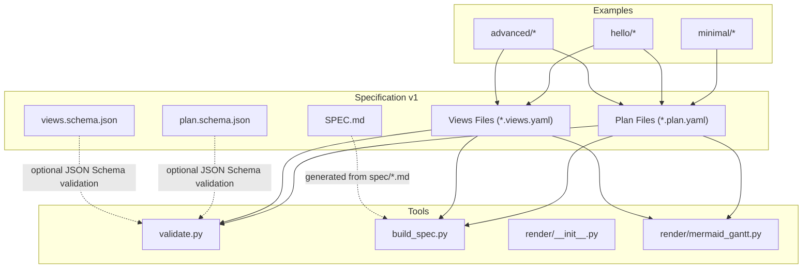
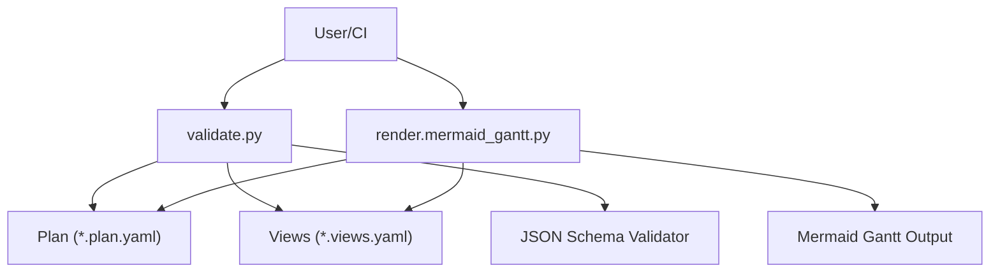
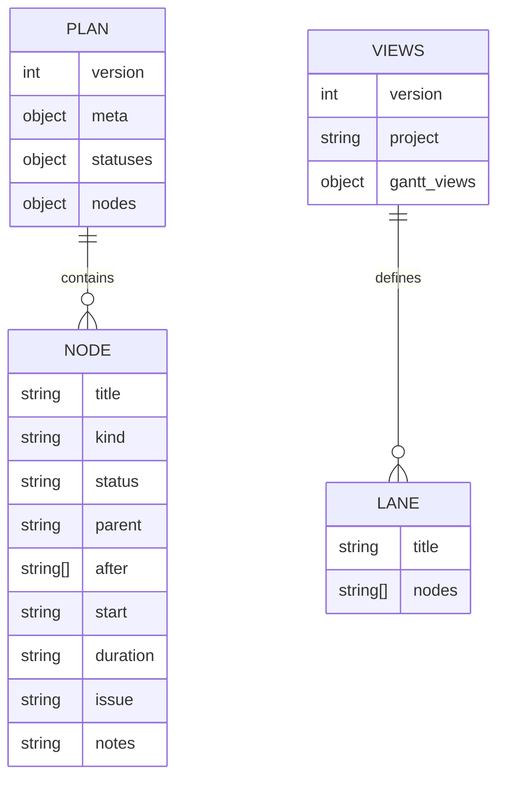
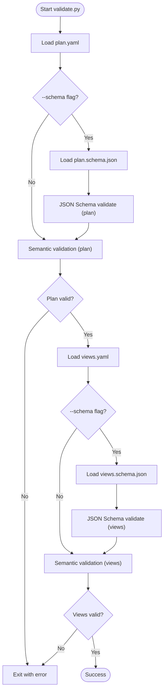
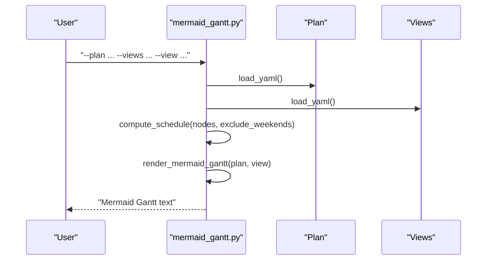
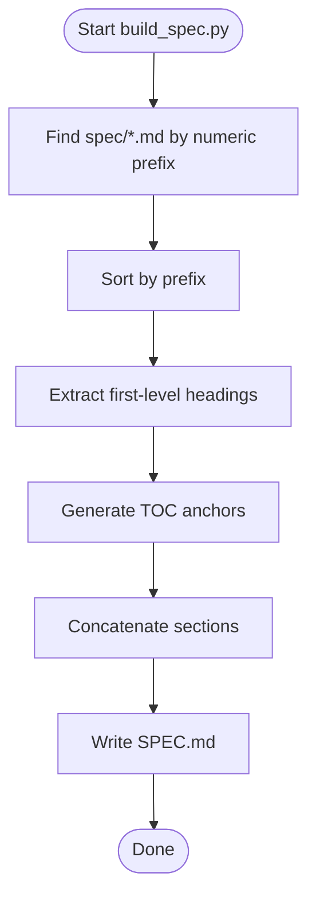
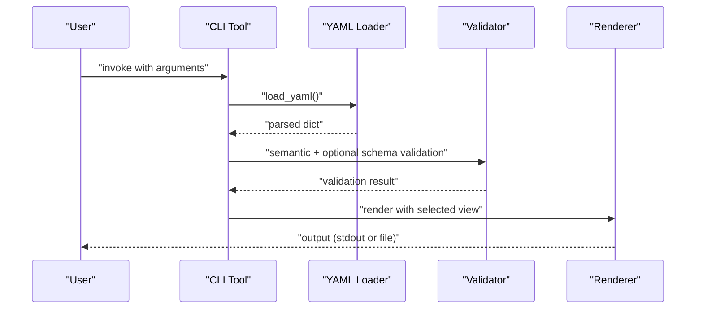
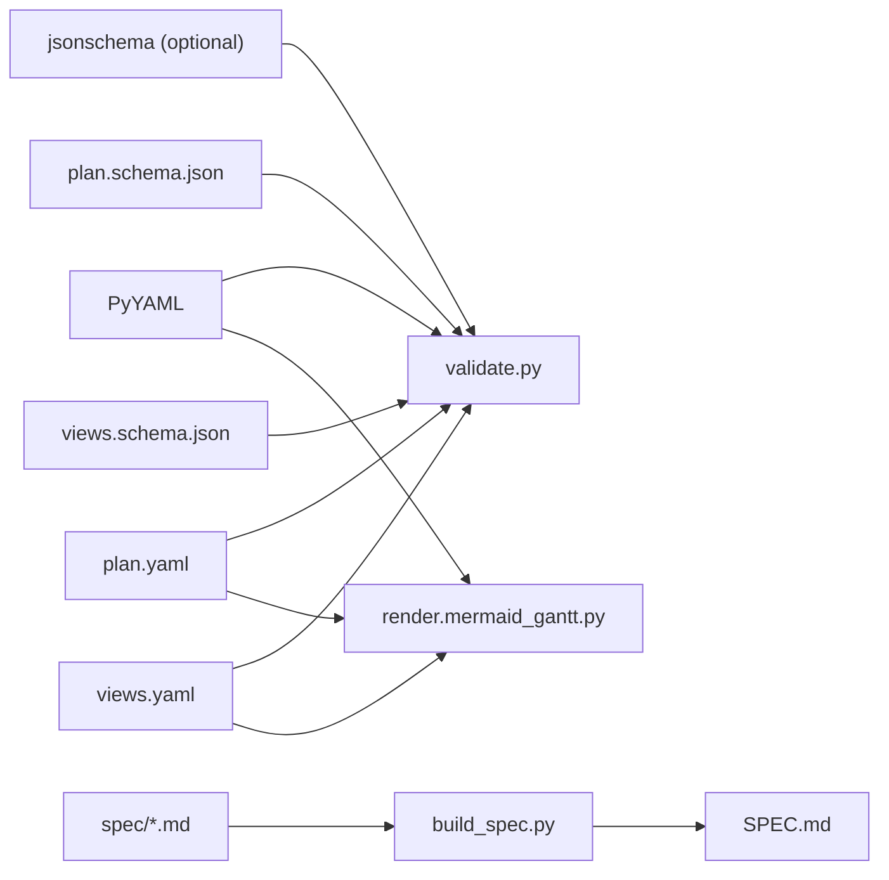

# System Architecture Overview

<cite>
**Referenced Files in This Document**
- [README.md](file://README.md)
- [specs/v1/README.md](file://specs/v1/README.md)
- [specs/v1/SPEC.md](file://specs/v1/SPEC.md)
- [specs/v1/tools/README.md](file://specs/v1/tools/README.md)
- [specs/v1/tools/validate.py](file://specs/v1/tools/validate.py)
- [specs/v1/tools/build_spec.py](file://specs/v1/tools/build_spec.py)
- [specs/v1/tools/render/mermaid_gantt.py](file://specs/v1/tools/render/mermaid_gantt.py)
- [specs/v1/tools/render/__init__.py](file://specs/v1/tools/render/__init__.py)
- [specs/v1/schemas/plan.schema.json](file://specs/v1/schemas/plan.schema.json)
- [specs/v1/schemas/views.schema.json](file://specs/v1/schemas/views.schema.json)
- [specs/v1/examples/hello/hello.plan.yaml](file://specs/v1/examples/hello/hello.plan.yaml)
- [specs/v1/examples/hello/hello.views.yaml](file://specs/v1/examples/hello/hello.views.yaml)
- [specs/v1/examples/advanced/program.plan.yaml](file://specs/v1/examples/advanced/program.plan.yaml)
- [specs/v1/examples/advanced/program.views.yaml](file://specs/v1/examples/advanced/program.views.yaml)
- [specs/v1/tools/requirements.txt](file://specs/v1/tools/requirements.txt)
</cite>

## Table of Contents
1. [Introduction](#introduction)
2. [Project Structure](#project-structure)
3. [Core Components](#core-components)
4. [Architecture Overview](#architecture-overview)
5. [Detailed Component Analysis](#detailed-component-analysis)
6. [Dependency Analysis](#dependency-analysis)
7. [Performance Considerations](#performance-considerations)
8. [Troubleshooting Guide](#troubleshooting-guide)
9. [Conclusion](#conclusion)

## Introduction
This document describes the high-level architecture of the Opskarta system with a focus on how operational maps (data model) and views (presentation) are separated and maintained. It explains the tooling architecture that supports validation, rendering, and specification building, and documents the end-to-end data flow from plan files through validation to various output formats. It also highlights the role of JSON schemas in validation, the modular design enabling extensibility, and the CLI interface architecture that integrates tools with the core specification.

## Project Structure
The repository is organized around a single specification version (v1) with three primary areas:
- Data model and specification: plan and views files define the operational map and presentation views.
- Validation and rendering tools: Python scripts provide CLI-based validation and Mermaid Gantt rendering.
- JSON schemas: formal validation contracts for plan and views files.
- Examples: minimal, hello, and advanced examples demonstrate usage patterns.

**Diagram sources**
- [specs/v1/tools/validate.py](file://specs/v1/tools/validate.py#L634-L752)
- [specs/v1/tools/build_spec.py](file://specs/v1/tools/build_spec.py#L174-L240)
- [specs/v1/tools/render/mermaid_gantt.py](file://specs/v1/tools/render/mermaid_gantt.py#L439-L549)
- [specs/v1/schemas/plan.schema.json](file://specs/v1/schemas/plan.schema.json#L1-L86)
- [specs/v1/schemas/views.schema.json](file://specs/v1/schemas/views.schema.json#L1-L26)
- [specs/v1/examples/hello/hello.plan.yaml](file://specs/v1/examples/hello/hello.plan.yaml#L1-L44)
- [specs/v1/examples/hello/hello.views.yaml](file://specs/v1/examples/hello/hello.views.yaml#L1-L13)
- [specs/v1/examples/advanced/program.plan.yaml](file://specs/v1/examples/advanced/program.plan.yaml#L1-L326)
- [specs/v1/examples/advanced/program.views.yaml](file://specs/v1/examples/advanced/program.views.yaml#L1-L93)

**Section sources**
- [specs/v1/README.md](file://specs/v1/README.md#L1-L27)
- [specs/v1/tools/README.md](file://specs/v1/tools/README.md#L1-L126)

## Core Components
- Plan and Views data model
  - Plan files define versioned metadata, statuses, and hierarchical nodes with scheduling and dependency fields.
  - Views files define project linkage and Gantt views with lanes and node selections.
- Validation tool
  - Performs syntax, optional JSON Schema, and semantic validation (referential integrity, cycles, formats).
- Rendering tool
  - Generates Mermaid Gantt diagrams from plan and selected view, computing schedules and applying theme colors.
- Specification builder
  - Assembles spec/*.md into a single SPEC.md with automated table of contents.
- JSON schemas
  - Formal contracts for plan and views ensuring structural correctness.

**Section sources**
- [specs/v1/SPEC.md](file://specs/v1/SPEC.md#L27-L156)
- [specs/v1/SPEC.md](file://specs/v1/SPEC.md#L98-L131)
- [specs/v1/tools/validate.py](file://specs/v1/tools/validate.py#L135-L329)
- [specs/v1/tools/validate.py](file://specs/v1/tools/validate.py#L431-L579)
- [specs/v1/tools/validate.py](file://specs/v1/tools/validate.py#L586-L618)
- [specs/v1/tools/render/mermaid_gantt.py](file://specs/v1/tools/render/mermaid_gantt.py#L349-L433)
- [specs/v1/tools/build_spec.py](file://specs/v1/tools/build_spec.py#L147-L172)
- [specs/v1/schemas/plan.schema.json](file://specs/v1/schemas/plan.schema.json#L1-L86)
- [specs/v1/schemas/views.schema.json](file://specs/v1/schemas/views.schema.json#L1-L26)

## Architecture Overview
The system enforces a strict separation between data model and presentation:
- Data model (plan): immutable, versioned, and validated independently.
- Presentation (views): declarative overlays that select and organize nodes for specific outputs.
- Tooling: modular CLI tools that consume plan and views, validate them, and produce outputs.

**Diagram sources**
- [specs/v1/tools/validate.py](file://specs/v1/tools/validate.py#L634-L752)
- [specs/v1/tools/render/mermaid_gantt.py](file://specs/v1/tools/render/mermaid_gantt.py#L439-L549)

## Detailed Component Analysis

### Data Model: Plan and Views
- Plan file structure
  - Root fields: version, meta (id, title), statuses, nodes.
  - Nodes support title, kind, status, parent, after, start, duration, issue, notes, and extension fields via x:.
- Views file structure
  - Root fields: version, project, gantt_views.
  - Gantt view includes title, excludes calendar items, and lanes with node lists.

**Diagram sources**
- [specs/v1/SPEC.md](file://specs/v1/SPEC.md#L27-L96)
- [specs/v1/SPEC.md](file://specs/v1/SPEC.md#L98-L131)
- [specs/v1/examples/hello/hello.plan.yaml](file://specs/v1/examples/hello/hello.plan.yaml#L1-L44)
- [specs/v1/examples/hello/hello.views.yaml](file://specs/v1/examples/hello/hello.views.yaml#L1-L13)

**Section sources**
- [specs/v1/SPEC.md](file://specs/v1/SPEC.md#L27-L156)
- [specs/v1/SPEC.md](file://specs/v1/SPEC.md#L98-L131)
- [specs/v1/examples/hello/hello.plan.yaml](file://specs/v1/examples/hello/hello.plan.yaml#L1-L44)
- [specs/v1/examples/hello/hello.views.yaml](file://specs/v1/examples/hello/hello.views.yaml#L1-L13)
- [specs/v1/examples/advanced/program.plan.yaml](file://specs/v1/examples/advanced/program.plan.yaml#L1-L326)
- [specs/v1/examples/advanced/program.views.yaml](file://specs/v1/examples/advanced/program.views.yaml#L1-L93)

### Validation Tooling
- Levels of validation
  - Syntax: YAML parsing checks.
  - Schema: optional JSON Schema validation using provided schemas.
  - Semantics: referential integrity (parent, after, status), absence of cycles, and field formats.
- Error reporting
  - Structured messages with path, value, expected, and available choices.

**Diagram sources**
- [specs/v1/tools/validate.py](file://specs/v1/tools/validate.py#L634-L752)
- [specs/v1/tools/validate.py](file://specs/v1/tools/validate.py#L586-L618)
- [specs/v1/tools/validate.py](file://specs/v1/tools/validate.py#L135-L329)
- [specs/v1/tools/validate.py](file://specs/v1/tools/validate.py#L431-L579)

**Section sources**
- [specs/v1/tools/validate.py](file://specs/v1/tools/validate.py#L10-L16)
- [specs/v1/tools/validate.py](file://specs/v1/tools/validate.py#L634-L752)
- [specs/v1/tools/validate.py](file://specs/v1/tools/validate.py#L586-L618)
- [specs/v1/schemas/plan.schema.json](file://specs/v1/schemas/plan.schema.json#L1-L86)
- [specs/v1/schemas/views.schema.json](file://specs/v1/schemas/views.schema.json#L1-L26)

### Rendering Tooling (Mermaid Gantt)
- Inputs: plan and views files plus a chosen view name.
- Processing:
  - Parse YAML.
  - Compute schedule from explicit start/duration and after dependencies, optionally excluding weekends.
  - Render Mermaid Gantt with theme variables derived from statuses.
- Outputs: Mermaid-formatted Gantt text to stdout or file.

**Diagram sources**
- [specs/v1/tools/render/mermaid_gantt.py](file://specs/v1/tools/render/mermaid_gantt.py#L439-L549)
- [specs/v1/tools/render/mermaid_gantt.py](file://specs/v1/tools/render/mermaid_gantt.py#L217-L294)
- [specs/v1/tools/render/mermaid_gantt.py](file://specs/v1/tools/render/mermaid_gantt.py#L349-L433)

**Section sources**
- [specs/v1/tools/render/mermaid_gantt.py](file://specs/v1/tools/render/mermaid_gantt.py#L1-L14)
- [specs/v1/tools/render/mermaid_gantt.py](file://specs/v1/tools/render/mermaid_gantt.py#L439-L549)
- [specs/v1/tools/render/mermaid_gantt.py](file://specs/v1/tools/render/mermaid_gantt.py#L217-L294)
- [specs/v1/tools/render/mermaid_gantt.py](file://specs/v1/tools/render/mermaid_gantt.py#L349-L433)

### Specification Building Tool
- Purpose: assemble spec/*.md into a single SPEC.md with a generated table of contents.
- Behavior: finds files by numeric prefix, extracts first-level headings, builds TOC anchors, and concatenates sections.

**Diagram sources**
- [specs/v1/tools/build_spec.py](file://specs/v1/tools/build_spec.py#L46-L87)
- [specs/v1/tools/build_spec.py](file://specs/v1/tools/build_spec.py#L89-L99)
- [specs/v1/tools/build_spec.py](file://specs/v1/tools/build_spec.py#L123-L145)
- [specs/v1/tools/build_spec.py](file://specs/v1/tools/build_spec.py#L147-L172)

**Section sources**
- [specs/v1/tools/build_spec.py](file://specs/v1/tools/build_spec.py#L1-L14)
- [specs/v1/tools/build_spec.py](file://specs/v1/tools/build_spec.py#L174-L240)

### CLI Interface Architecture
- validate.py
  - Accepts plan and optional views files.
  - Supports optional JSON Schema validation and custom schema paths.
  - Emits structured errors and warnings.
- render.mermaid_gantt.py
  - Accepts plan and views, requires a view name or lists available views.
  - Outputs Mermaid Gantt to stdout or a file.
- build_spec.py
  - Generates or checks SPEC.md from spec/*.md.

**Diagram sources**
- [specs/v1/tools/validate.py](file://specs/v1/tools/validate.py#L634-L752)
- [specs/v1/tools/render/mermaid_gantt.py](file://specs/v1/tools/render/mermaid_gantt.py#L439-L549)
- [specs/v1/tools/build_spec.py](file://specs/v1/tools/build_spec.py#L174-L240)

**Section sources**
- [specs/v1/tools/README.md](file://specs/v1/tools/README.md#L14-L126)
- [specs/v1/tools/validate.py](file://specs/v1/tools/validate.py#L634-L752)
- [specs/v1/tools/render/mermaid_gantt.py](file://specs/v1/tools/render/mermaid_gantt.py#L439-L549)
- [specs/v1/tools/build_spec.py](file://specs/v1/tools/build_spec.py#L174-L240)

## Dependency Analysis
- Runtime dependencies
  - PyYAML is required for YAML parsing across tools.
  - Optional jsonschema enables schema-level validation.
- Internal dependencies
  - validate.py depends on plan.schema.json and views.schema.json when --schema is used.
  - render.mermaid_gantt.py depends on plan and views to compute schedules and render outputs.
  - build_spec.py depends on spec/*.md files to generate SPEC.md.

**Diagram sources**
- [specs/v1/tools/requirements.txt](file://specs/v1/tools/requirements.txt#L4-L10)
- [specs/v1/tools/validate.py](file://specs/v1/tools/validate.py#L634-L752)
- [specs/v1/tools/render/mermaid_gantt.py](file://specs/v1/tools/render/mermaid_gantt.py#L439-L549)
- [specs/v1/tools/build_spec.py](file://specs/v1/tools/build_spec.py#L174-L240)
- [specs/v1/schemas/plan.schema.json](file://specs/v1/schemas/plan.schema.json#L1-L86)
- [specs/v1/schemas/views.schema.json](file://specs/v1/schemas/views.schema.json#L1-L26)

**Section sources**
- [specs/v1/tools/requirements.txt](file://specs/v1/tools/requirements.txt#L1-L10)
- [specs/v1/tools/validate.py](file://specs/v1/tools/validate.py#L634-L752)
- [specs/v1/tools/render/mermaid_gantt.py](file://specs/v1/tools/render/mermaid_gantt.py#L439-L549)
- [specs/v1/tools/build_spec.py](file://specs/v1/tools/build_spec.py#L174-L240)

## Performance Considerations
- Validation
  - Semantic checks traverse nodes and dependencies; complexity is linear in the number of nodes and edges.
  - Cycle detection uses DFS for after dependencies and iterative traversal for parent links.
- Rendering
  - Schedule computation caches resolved dates per node; recursive resolution avoids repeated work.
  - Date arithmetic and weekend exclusion are O(n) in the number of days adjusted.
- Specification building
  - File discovery and sorting are O(n log n) by prefix; TOC generation is O(n) in number of sections.

[No sources needed since this section provides general guidance]

## Troubleshooting Guide
- Validation errors
  - Syntax errors: ensure YAML is well-formed; the loader reports parsing failures.
  - Schema mismatches: enable --schema and review messages indicating absolute paths and expected types.
  - Semantic errors: invalid references (parent, after, status), cyclic dependencies, incorrect date/duration formats.
- Rendering errors
  - Missing or invalid view name: use --list-views to discover available views.
  - Scheduling errors: missing start and after causing unresolved dates; ensure dependencies form a DAG and durations are positive.
- General tips
  - Use examples as templates for plan and views.
  - Keep project IDs consistent between meta.id and views.project.
  - Leverage x: fields for extensions without breaking base compatibility.

**Section sources**
- [specs/v1/tools/validate.py](file://specs/v1/tools/validate.py#L30-L63)
- [specs/v1/tools/validate.py](file://specs/v1/tools/validate.py#L135-L329)
- [specs/v1/tools/validate.py](file://specs/v1/tools/validate.py#L431-L579)
- [specs/v1/tools/validate.py](file://specs/v1/tools/validate.py#L586-L618)
- [specs/v1/tools/render/mermaid_gantt.py](file://specs/v1/tools/render/mermaid_gantt.py#L30-L43)
- [specs/v1/tools/render/mermaid_gantt.py](file://specs/v1/tools/render/mermaid_gantt.py#L217-L294)
- [specs/v1/tools/render/mermaid_gantt.py](file://specs/v1/tools/render/mermaid_gantt.py#L439-L549)

## Conclusion
Opskarta’s architecture cleanly separates the operational map (plan) from presentation (views), enforcing modularity and extensibility. The tooling stack—validation, rendering, and specification building—supports robust, repeatable workflows. JSON schemas provide optional structural guarantees, while the modular design allows new renderers and validators to integrate seamlessly. The CLI tools expose clear interfaces for validation and rendering, and the examples demonstrate practical usage patterns across simple and advanced scenarios.