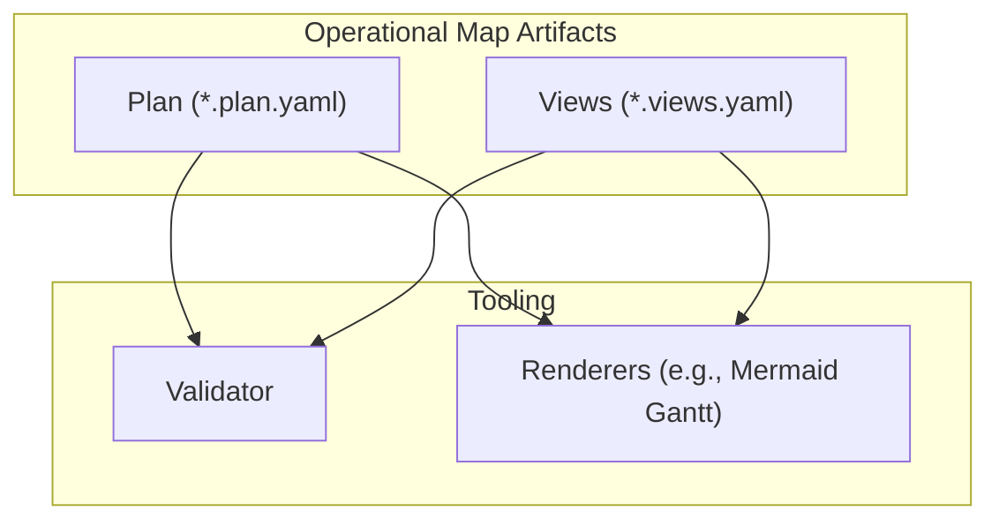
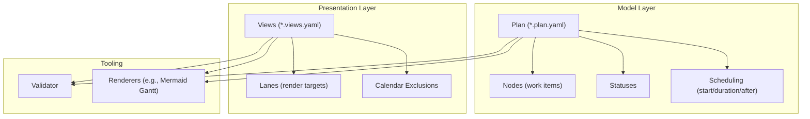
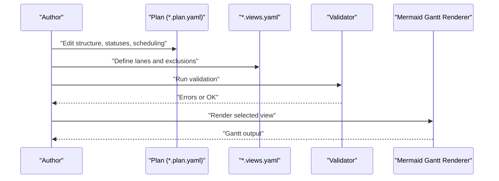
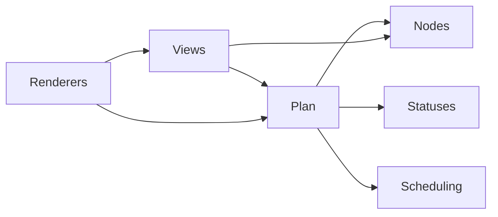

# Core Concepts

<cite>
**Referenced Files in This Document**
- [README.md](file://README.md)
- [docs/method.md](file://docs/method.md)
- [specs/v1/SPEC.md](file://specs/v1/SPEC.md)
- [specs/v1/spec/00-introduction.md](file://specs/v1/spec/00-introduction.md)
- [specs/v1/spec/10-plan-file.md](file://specs/v1/spec/10-plan-file.md)
- [specs/v1/spec/30-views-file.md](file://specs/v1/spec/30-views-file.md)
- [specs/v1/spec/50-scheduling.md](file://specs/v1/spec/50-scheduling.md)
- [specs/v1/spec/90-extensibility.md](file://specs/v1/spec/90-extensibility.md)
- [specs/v1/schemas/plan.schema.json](file://specs/v1/schemas/plan.schema.json)
- [specs/v1/schemas/views.schema.json](file://specs/v1/schemas/views.schema.json)
- [specs/v1/examples/hello/README.md](file://specs/v1/examples/hello/README.md)
- [specs/v1/examples/hello/hello.plan.yaml](file://specs/v1/examples/hello/hello.plan.yaml)
- [specs/v1/examples/hello/hello.views.yaml](file://specs/v1/examples/hello/hello.views.yaml)
- [specs/v1/examples/advanced/README.md](file://specs/v1/examples/advanced/README.md)
- [specs/v1/tools/render/mermaid_gantt.py](file://specs/v1/tools/render/mermaid_gantt.py)
</cite>

## Table of Contents
1. [Introduction](#introduction)
2. [Project Structure](#project-structure)
3. [Core Components](#core-components)
4. [Architecture Overview](#architecture-overview)
5. [Detailed Component Analysis](#detailed-component-analysis)
6. [Dependency Analysis](#dependency-analysis)
7. [Performance Considerations](#performance-considerations)
8. [Troubleshooting Guide](#troubleshooting-guide)
9. [Conclusion](#conclusion)
10. [Appendices](#appendices)

## Introduction
Operational maps in opskarta represent a principled approach to capturing and communicating program-level work: a single source of truth that separates what exists (the plan) from how you look at it (views). This distinction enables version control-friendly, multi-perspective, and extensible planning. The methodology emphasizes:
- Model once, render many views
- Plan-as-code with YAML/JSON
- Separation of concerns between structure and presentation
- Extensibility without breaking compatibility

This document explains the philosophy, the fundamental principles, and the practical implications of operational maps compared to traditional project management tools. It also outlines the mental model shift required to adopt this approach and highlights common misconceptions to avoid.

## Project Structure
The repository organizes operational maps around two complementary artifacts:
- Plan files (*.plan.yaml): the authoritative model of work, structure, and optional scheduling
- Views files (*.views.yaml): declarative definitions of how to render the plan into various views (e.g., Gantt lanes)

**Diagram sources**
- [specs/v1/spec/10-plan-file.md](file://specs/v1/spec/10-plan-file.md#L1-L30)
- [specs/v1/spec/30-views-file.md](file://specs/v1/spec/30-views-file.md#L1-L34)
- [specs/v1/tools/render/mermaid_gantt.py](file://specs/v1/tools/render/mermaid_gantt.py)

**Section sources**
- [README.md](file://README.md#L16-L96)
- [specs/v1/SPEC.md](file://specs/v1/SPEC.md#L27-L132)
- [specs/v1/spec/00-introduction.md](file://specs/v1/spec/00-introduction.md#L1-L10)

## Core Components
Operational maps are built on three pillars:
- The plan: a structured, versioned model of work
- The views: flexible, declarative rendering definitions
- Scheduling: optional temporal attributes and dependency semantics

Key ideas:
- The plan encodes hierarchy (parent), kinds/types (summary, phase, epic, task), statuses, and optional scheduling (start, duration, after)
- Views separate “what exists” from “how to see it,” enabling multiple renderings from a single model
- Temporal planning is optional but powerful for Gantt-style visualizations and dependency arrows

Benefits:
- Version control friendly: plain-text, diffable, branchable
- Multi-perspective visualization: one model, many views
- Extensibility: unknown fields are preserved and ignored by base tooling

**Section sources**
- [docs/method.md](file://docs/method.md#L22-L72)
- [specs/v1/spec/10-plan-file.md](file://specs/v1/spec/10-plan-file.md#L1-L30)
- [specs/v1/spec/30-views-file.md](file://specs/v1/spec/30-views-file.md#L1-L34)
- [specs/v1/spec/50-scheduling.md](file://specs/v1/spec/50-scheduling.md#L1-L80)
- [specs/v1/spec/90-extensibility.md](file://specs/v1/spec/90-extensibility.md#L1-L26)

## Architecture Overview
The operational maps architecture centers on the separation between plan and views, with optional scheduling and extensibility.

**Diagram sources**
- [specs/v1/spec/10-plan-file.md](file://specs/v1/spec/10-plan-file.md#L1-L30)
- [specs/v1/spec/30-views-file.md](file://specs/v1/spec/30-views-file.md#L1-L34)
- [specs/v1/spec/50-scheduling.md](file://specs/v1/spec/50-scheduling.md#L1-L80)
- [specs/v1/schemas/plan.schema.json](file://specs/v1/schemas/plan.schema.json#L1-L86)
- [specs/v1/schemas/views.schema.json](file://specs/v1/schemas/views.schema.json#L1-L26)

## Detailed Component Analysis

### Philosophy: Plan vs. Views
- The plan is the “truth” of structure, meaning, and optional schedule
- Views are “how to look at it”: lanes, exclusions, and titles tailored to different audiences
- This separation allows a single source of truth with many renderings

Practical implications:
- One model, many dashboards
- Easier to maintain and evolve structure independently of presentation
- Supports scenario planning and “what-if” branches via version control

**Section sources**
- [docs/method.md](file://docs/method.md#L56-L72)
- [specs/v1/spec/30-views-file.md](file://specs/v1/spec/30-views-file.md#L1-L34)

### Work Representation and Hierarchical Relationships
- Nodes carry human-readable titles and optional kinds (summary, phase, epic, task)
- Parent-child relationships form a strict hierarchy
- Statuses are user-defined and decoupled from external systems

Design notes:
- Kinds inform downstream visualizations and tooling
- Statuses enable lightweight progress tracking aligned with the manager’s interpretation
- Notes and issue links preserve context and traceability

**Section sources**
- [specs/v1/spec/10-plan-file.md](file://specs/v1/spec/10-plan-file.md#L1-L30)
- [specs/v1/spec/50-scheduling.md](file://specs/v1/spec/50-scheduling.md#L1-L80)
- [specs/v1/examples/hello/hello.plan.yaml](file://specs/v1/examples/hello/hello.plan.yaml#L13-L44)

### Dependency Modeling
- Dependencies are expressed via “after” lists: a node starts only after all listed nodes finish
- Multiple dependencies are supported
- Computationally, this defines a precedence graph suitable for topological ordering and critical path analysis

Temporal implications:
- If a node lacks explicit start but has dependencies, its start is computed as the latest completion time among dependencies
- Without start or dependencies, a node is considered non-temporal for scheduling

**Section sources**
- [specs/v1/spec/50-scheduling.md](file://specs/v1/spec/50-scheduling.md#L15-L79)

### Temporal Planning
- Optional start dates and durations enable Gantt-like visualizations
- Calendar exclusions (e.g., weekends) influence duration-based scheduling
- Duration-only estimates can be used for effort modeling even without fixed start dates

Rendering linkage:
- Renderers consume start/duration and after to produce timelines and dependency arrows
- Views configure lanes and exclusions to tailor the output

**Section sources**
- [specs/v1/spec/50-scheduling.md](file://specs/v1/spec/50-scheduling.md#L67-L79)
- [specs/v1/examples/hello/hello.views.yaml](file://specs/v1/examples/hello/hello.views.yaml#L4-L13)

### Multi-Perspective Visualization
- Views define lanes and titles to slice and dice the plan for different stakeholders
- Multiple views can focus on different tracks, teams, or critical path
- Calendar exclusions adjust scheduling assumptions per organizational context

Example scope:
- Overview for leadership
- Track-specific details for leads
- Critical path highlighting for blockers

**Section sources**
- [specs/v1/examples/advanced/README.md](file://specs/v1/examples/advanced/README.md#L72-L81)
- [specs/v1/examples/advanced/program.views.yaml](file://specs/v1/examples/advanced/program.views.yaml)

### Extensibility and Open Spec
- Unknown fields are preserved by base tooling and ignored when not understood
- Users can annotate nodes with custom metadata (e.g., tags, owners, risks)
- A recommended namespace (x:) groups user extensions to avoid conflicts

Why it matters:
- Enables community-driven tooling and integrations
- Keeps the core schema minimal while allowing rich domain-specific data

**Section sources**
- [specs/v1/spec/90-extensibility.md](file://specs/v1/spec/90-extensibility.md#L1-L26)
- [specs/v1/examples/advanced/README.md](file://specs/v1/examples/advanced/README.md#L117-L142)

### Validation and Data Contracts
- JSON Schemas define required fields and types for plans and views
- Validation covers syntax, schema compliance, and semantic integrity (references, cycles)
- Clear error messages guide corrections

Validation levels:
- Syntax: valid YAML/JSON
- Schema: field types and presence
- Semantics: referential integrity and business rules

**Section sources**
- [specs/v1/schemas/plan.schema.json](file://specs/v1/schemas/plan.schema.json#L1-L86)
- [specs/v1/schemas/views.schema.json](file://specs/v1/schemas/views.schema.json#L1-L26)
- [specs/v1/SPEC.md](file://specs/v1/SPEC.md#L241-L380)

### Rendering Workflow

**Diagram sources**
- [specs/v1/examples/hello/README.md](file://specs/v1/examples/hello/README.md#L28-L45)
- [specs/v1/tools/render/mermaid_gantt.py](file://specs/v1/tools/render/mermaid_gantt.py)

## Dependency Analysis
Operational maps rely on a small set of interdependent concepts:
- Plan depends on nodes, statuses, and optional scheduling
- Views depend on plan identity and node IDs
- Renderers depend on plan and view semantics

**Diagram sources**
- [specs/v1/spec/10-plan-file.md](file://specs/v1/spec/10-plan-file.md#L1-L30)
- [specs/v1/spec/30-views-file.md](file://specs/v1/spec/30-views-file.md#L1-L34)
- [specs/v1/spec/50-scheduling.md](file://specs/v1/spec/50-scheduling.md#L1-L80)

**Section sources**
- [specs/v1/SPEC.md](file://specs/v1/SPEC.md#L241-L380)

## Performance Considerations
- Parsing and validation scale linearly with the number of nodes and dependencies
- Topological sorting for dependency resolution is efficient for sparse graphs typical in program planning
- Rendering performance depends on the number of lanes and nodes per lane; filtering via views reduces payload

[No sources needed since this section provides general guidance]

## Troubleshooting Guide
Common issues and resolutions:
- Reference errors: ensure parent and after IDs exist in nodes; avoid cycles
- Status mismatch: confirm node status keys exist in statuses
- View-node mismatch: verify all nodes listed in lanes exist in the plan
- Calendar exclusions: align view exclusions with organizational calendars
- Unknown fields: remember base tooling ignores them; use the recommended namespace for extensions

**Section sources**
- [specs/v1/SPEC.md](file://specs/v1/SPEC.md#L241-L380)
- [specs/v1/schemas/plan.schema.json](file://specs/v1/schemas/plan.schema.json#L1-L86)
- [specs/v1/schemas/views.schema.json](file://specs/v1/schemas/views.schema.json#L1-L26)

## Conclusion
Operational maps offer a principled alternative to traditional project management tools by:
- Treating the plan as a single source of truth separate from views
- Enabling multi-perspective visualization from one model
- Supporting version control-friendly, extensible, and semantically rich planning

Adopting operational maps requires shifting from “systems of record” to “maps of meaning.” This mental model change unlocks better collaboration, traceability, and adaptability.

[No sources needed since this section summarizes without analyzing specific files]

## Appendices

### How Operational Maps Differ From Traditional Tools
- Gantt charts: often static, tool-bound; operational maps generate Gantt from a plan and views
- Kanban boards: focus on flow and WIP; operational maps capture structure, dependencies, and optional schedules
- Project management suites: centralized systems with rigid workflows; operational maps are plan-as-code with flexible renderings

Philosophical contrast:
- Traditional tools often conflate structure, status, and presentation
- Operational maps separate model (plan) from presentation (views), enabling independent evolution and reuse

**Section sources**
- [docs/method.md](file://docs/method.md#L99-L120)
- [specs/v1/examples/hello/README.md](file://specs/v1/examples/hello/README.md#L1-L53)
- [specs/v1/examples/advanced/README.md](file://specs/v1/examples/advanced/README.md#L1-L172)

### Mental Model Shift and Misconceptions
Mental model shift:
- From “enter tasks here” to “model the program”
- From “update status in the system” to “annotate meaning and progress”

Common misconceptions to avoid:
- Thinking operational maps replace systems of record (they complement them)
- Expecting real-time conflict resolution across multiple authors (use version control)
- Assuming automatic scheduling akin to desktop tools (planning is optional and explicit)
- Believing views must mirror every system detail (views are curated slices)

**Section sources**
- [docs/method.md](file://docs/method.md#L99-L120)