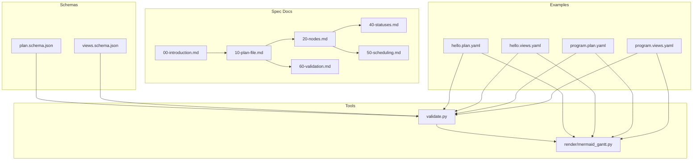
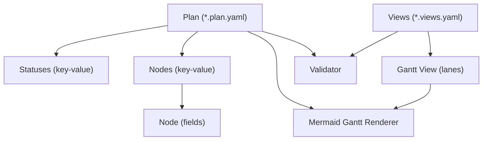
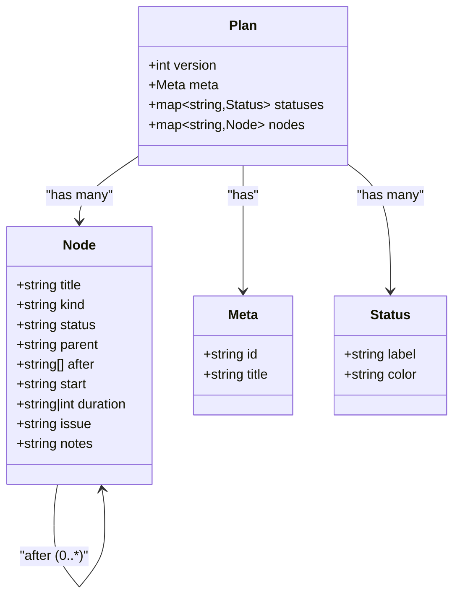
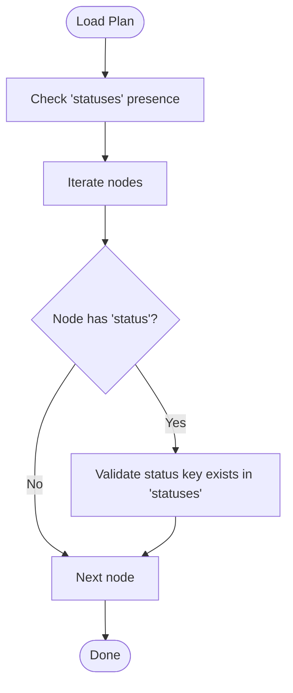
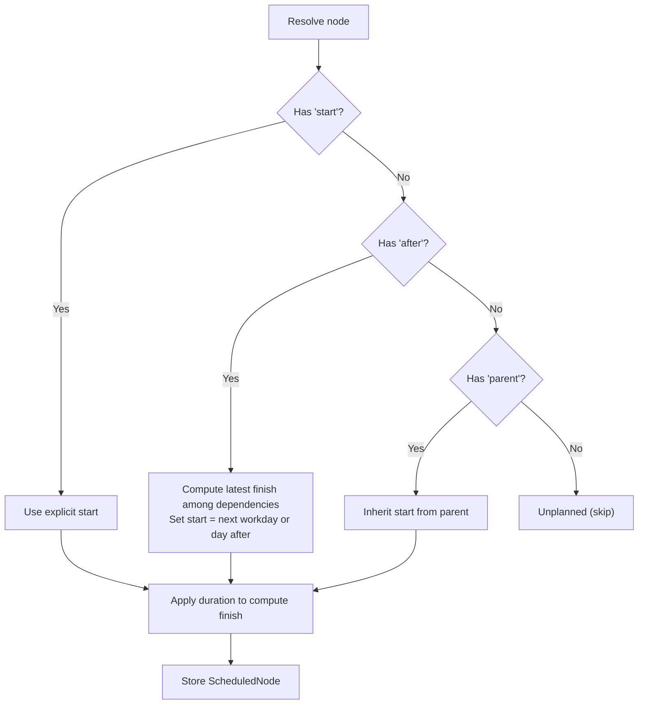
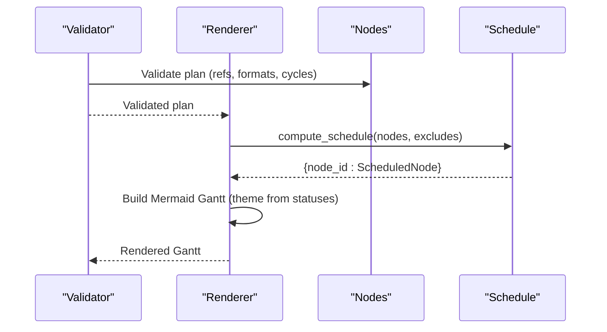
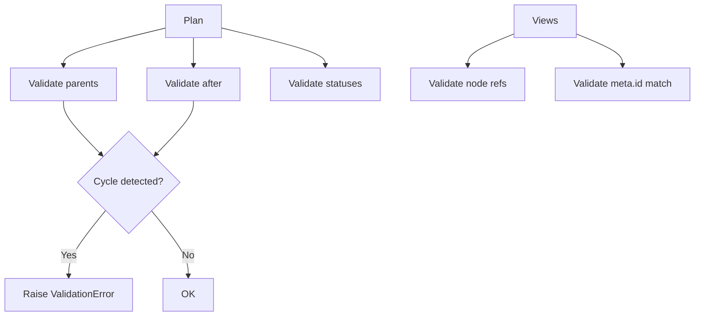

# Data Models

<cite>
**Referenced Files in This Document**
- [SPEC.md](file://specs/v1/SPEC.md)
- [00-introduction.md](file://specs/v1/spec/00-introduction.md)
- [10-plan-file.md](file://specs/v1/spec/10-plan-file.md)
- [20-nodes.md](file://specs/v1/spec/20-nodes.md)
- [40-statuses.md](file://specs/v1/spec/40-statuses.md)
- [50-scheduling.md](file://specs/v1/spec/50-scheduling.md)
- [60-validation.md](file://specs/v1/spec/60-validation.md)
- [plan.schema.json](file://specs/v1/schemas/plan.schema.json)
- [views.schema.json](file://specs/v1/schemas/views.schema.json)
- [validate.py](file://specs/v1/tools/validate.py)
- [mermaid_gantt.py](file://specs/v1/tools/render/mermaid_gantt.py)
- [hello.plan.yaml](file://specs/v1/examples/hello/hello.plan.yaml)
- [hello.views.yaml](file://specs/v1/examples/hello/hello.views.yaml)
- [program.plan.yaml](file://specs/v1/examples/advanced/program.plan.yaml)
- [program.views.yaml](file://specs/v1/examples/advanced/program.views.yaml)
</cite>

## Table of Contents
1. [Introduction](#introduction)
2. [Project Structure](#project-structure)
3. [Core Components](#core-components)
4. [Architecture Overview](#architecture-overview)
5. [Detailed Component Analysis](#detailed-component-analysis)
6. [Dependency Analysis](#dependency-analysis)
7. [Performance Considerations](#performance-considerations)
8. [Troubleshooting Guide](#troubleshooting-guide)
9. [Conclusion](#conclusion)
10. [Appendices](#appendices)

## Introduction
This document describes the core data models for operational maps in opskarta v1. It focuses on:
- Node types and hierarchy (summary, phase, epic, task)
- Status definitions, labels, and colors
- Temporal planning (start dates, durations, and dependencies)
- Validation rules and referential integrity
- Rendering and scheduling algorithms used to produce Gantt diagrams
- Entity relationship diagrams and transformation/computed properties
- Practical examples from the repository

## Project Structure
The opskarta specification is organized around two primary artifacts:
- Plan files (*.plan.yaml): define nodes, statuses, and temporal metadata
- Views files (*.views.yaml): define presentation layers (e.g., Gantt views) over plan data



**Diagram sources**
- [00-introduction.md](file://specs/v1/spec/00-introduction.md#L1-L10)
- [10-plan-file.md](file://specs/v1/spec/10-plan-file.md#L1-L30)
- [20-nodes.md](file://specs/v1/spec/20-nodes.md#L1-L37)
- [40-statuses.md](file://specs/v1/spec/40-statuses.md#L1-L23)
- [50-scheduling.md](file://specs/v1/spec/50-scheduling.md#L1-L80)
- [60-validation.md](file://specs/v1/spec/60-validation.md#L1-L140)
- [plan.schema.json](file://specs/v1/schemas/plan.schema.json#L1-L86)
- [views.schema.json](file://specs/v1/schemas/views.schema.json#L1-L26)
- [validate.py](file://specs/v1/tools/validate.py#L1-L752)
- [mermaid_gantt.py](file://specs/v1/tools/render/mermaid_gantt.py#L1-L549)
- [hello.plan.yaml](file://specs/v1/examples/hello/hello.plan.yaml#L1-L44)
- [hello.views.yaml](file://specs/v1/examples/hello/hello.views.yaml#L1-L13)
- [program.plan.yaml](file://specs/v1/examples/advanced/program.plan.yaml#L1-L326)
- [program.views.yaml](file://specs/v1/examples/advanced/program.views.yaml#L1-L93)

**Section sources**
- [00-introduction.md](file://specs/v1/spec/00-introduction.md#L1-L10)
- [10-plan-file.md](file://specs/v1/spec/10-plan-file.md#L1-L30)
- [20-nodes.md](file://specs/v1/spec/20-nodes.md#L1-L37)
- [40-statuses.md](file://specs/v1/spec/40-statuses.md#L1-L23)
- [50-scheduling.md](file://specs/v1/spec/50-scheduling.md#L1-L80)
- [60-validation.md](file://specs/v1/spec/60-validation.md#L1-L140)
- [plan.schema.json](file://specs/v1/schemas/plan.schema.json#L1-L86)
- [views.schema.json](file://specs/v1/schemas/views.schema.json#L1-L26)
- [validate.py](file://specs/v1/tools/validate.py#L1-L752)
- [mermaid_gantt.py](file://specs/v1/tools/render/mermaid_gantt.py#L1-L549)
- [hello.plan.yaml](file://specs/v1/examples/hello/hello.plan.yaml#L1-L44)
- [hello.views.yaml](file://specs/v1/examples/hello/hello.views.yaml#L1-L13)
- [program.plan.yaml](file://specs/v1/examples/advanced/program.plan.yaml#L1-L326)
- [program.views.yaml](file://specs/v1/examples/advanced/program.views.yaml#L1-L93)

## Core Components
This section defines the core entities and their properties, constraints, and relationships.

- Plan root
  - version: integer (required)
  - meta: object (required)
    - id: string (required, non-empty)
    - title: string (required, non-empty)
  - statuses: object (optional)
  - nodes: object (required, may be empty)

- Node
  - title: string (required)
  - kind: string (recommended values: summary, phase, epic, user_story, task)
  - status: string (must reference a key in statuses if present)
  - parent: string (must reference an existing node_id)
  - after: array[string] (each element must reference an existing node_id)
  - start: string (ISO date YYYY-MM-DD)
  - duration: string|int (string format "<number>d" or "<number>w"; int means calendar days)
  - issue: string (external ticket identifier)
  - notes: string (freeform context)

- Status
  - label: string (human-readable)
  - color: string (hex color)

- Views root
  - version: integer (required)
  - project: string (required, must match meta.id)
  - gantt_views: object (optional)

- Gantt view
  - title: string
  - excludes: array[string] (supported: weekends; may include specific dates)
  - lanes: object
    - title: string
    - nodes: array[string] (each must exist in nodes)

Constraints and rules
- Referential integrity
  - parent must reference an existing node_id
  - each after item must reference an existing node_id
  - status must reference an existing key in statuses if statuses exists
- No cycles
  - parent chain must be acyclic
  - after graph must be acyclic
- Date and duration formats
  - start must match YYYY-MM-DD
  - duration must match <digits>d or <digits>w or digits
- Unplanned nodes
  - If neither start nor after is specified, a node is considered unplanned and typically not rendered on timelines

Computed and derived properties
- Planned start date
  - Explicit: use start if present
  - Implicit via dependencies: start after completion of all dependencies (after)
  - Inheritance: if no start/after, inherit from parent if parent is planned
- Planned finish date
  - finish = start + duration - 1 day (with working-day adjustments when excluding weekends)
- Gantt rendering
  - Nodes without explicit start/finish are skipped from timeline lanes
  - Status colors influence Mermaid theme variables for rendering

**Section sources**
- [10-plan-file.md](file://specs/v1/spec/10-plan-file.md#L1-L30)
- [20-nodes.md](file://specs/v1/spec/20-nodes.md#L1-L37)
- [40-statuses.md](file://specs/v1/spec/40-statuses.md#L1-L23)
- [50-scheduling.md](file://specs/v1/spec/50-scheduling.md#L1-L80)
- [60-validation.md](file://specs/v1/spec/60-validation.md#L1-L140)
- [plan.schema.json](file://specs/v1/schemas/plan.schema.json#L1-L86)
- [views.schema.json](file://specs/v1/schemas/views.schema.json#L1-L26)
- [hello.plan.yaml](file://specs/v1/examples/hello/hello.plan.yaml#L1-L44)
- [program.plan.yaml](file://specs/v1/examples/advanced/program.plan.yaml#L1-L326)

## Architecture Overview
The opskarta data model centers on a plan-driven graph of nodes with optional temporal metadata and explicit dependencies. Views consume the plan to produce Gantt diagrams.



**Diagram sources**
- [10-plan-file.md](file://specs/v1/spec/10-plan-file.md#L1-L30)
- [20-nodes.md](file://specs/v1/spec/20-nodes.md#L1-L37)
- [50-scheduling.md](file://specs/v1/spec/50-scheduling.md#L1-L80)
- [60-validation.md](file://specs/v1/spec/60-validation.md#L1-L140)
- [validate.py](file://specs/v1/tools/validate.py#L135-L329)
- [mermaid_gantt.py](file://specs/v1/tools/render/mermaid_gantt.py#L349-L433)

## Detailed Component Analysis

### Node Types and Hierarchy
- summary: top-level container
- phase: stage/phase
- epic: major system component
- user_story: value story
- task: concrete work item

Parent-child relationships form a strict tree (no cycles). Nodes may carry kind to guide visualization and reporting.



**Diagram sources**
- [20-nodes.md](file://specs/v1/spec/20-nodes.md#L1-L37)
- [10-plan-file.md](file://specs/v1/spec/10-plan-file.md#L1-L30)
- [40-statuses.md](file://specs/v1/spec/40-statuses.md#L1-L23)

**Section sources**
- [20-nodes.md](file://specs/v1/spec/20-nodes.md#L11-L16)
- [hello.plan.yaml](file://specs/v1/examples/hello/hello.plan.yaml#L13-L44)
- [program.plan.yaml](file://specs/v1/examples/advanced/program.plan.yaml#L16-L326)

### Status Management
- statuses is a dictionary of arbitrary keys to status objects
- Each status object has label and color
- Recommended keys include not_started, in_progress, done, blocked



**Diagram sources**
- [60-validation.md](file://specs/v1/spec/60-validation.md#L57-L75)
- [40-statuses.md](file://specs/v1/spec/40-statuses.md#L1-L23)

**Section sources**
- [40-statuses.md](file://specs/v1/spec/40-statuses.md#L1-L23)
- [60-validation.md](file://specs/v1/spec/60-validation.md#L57-L75)
- [hello.plan.yaml](file://specs/v1/examples/hello/hello.plan.yaml#L7-L11)
- [program.plan.yaml](file://specs/v1/examples/advanced/program.plan.yaml#L7-L14)

### Temporal Planning and Dependencies
- start: explicit start date (YYYY-MM-DD)
- duration: days or weeks (e.g., 5d, 2w) or integer days
- after: list of dependencies; node starts after all dependencies finish
- Working-day arithmetic supports weekend exclusions



**Diagram sources**
- [50-scheduling.md](file://specs/v1/spec/50-scheduling.md#L1-L80)
- [mermaid_gantt.py](file://specs/v1/tools/render/mermaid_gantt.py#L217-L294)

**Section sources**
- [50-scheduling.md](file://specs/v1/spec/50-scheduling.md#L1-L80)
- [mermaid_gantt.py](file://specs/v1/tools/render/mermaid_gantt.py#L92-L207)
- [mermaid_gantt.py](file://specs/v1/tools/render/mermaid_gantt.py#L217-L294)

### Entity Relationship Diagram (ERD)
This diagram shows how nodes relate to each other and to statuses.

```mermaid
erDiagram
NODE {
string id PK
string title
string kind
string status
string parent
string[] after
string start
string|int duration
string issue
string notes
}
STATUS {
string key PK
string label
string color
}
PLAN {
int version
string meta_id
string meta_title
}
PLAN ||--o{ NODE : "contains"
NODE }o--|| STATUS : "uses"
NODE }o--|| NODE : "parent"
NODE }o--o{ NODE : "after"
```

**Diagram sources**
- [20-nodes.md](file://specs/v1/spec/20-nodes.md#L1-L37)
- [40-statuses.md](file://specs/v1/spec/40-statuses.md#L1-L23)
- [10-plan-file.md](file://specs/v1/spec/10-plan-file.md#L1-L30)
- [plan.schema.json](file://specs/v1/schemas/plan.schema.json#L38-L82)

**Section sources**
- [20-nodes.md](file://specs/v1/spec/20-nodes.md#L1-L37)
- [40-statuses.md](file://specs/v1/spec/40-statuses.md#L1-L23)
- [10-plan-file.md](file://specs/v1/spec/10-plan-file.md#L1-L30)
- [plan.schema.json](file://specs/v1/schemas/plan.schema.json#L1-L86)

### Data Transformation and Computed Properties
- Computed schedule per node: start, finish, duration_days
- Theme variables for Mermaid Gantt generated from status colors
- Status-to-Mermaid tag mapping for rendering



**Diagram sources**
- [validate.py](file://specs/v1/tools/validate.py#L135-L329)
- [mermaid_gantt.py](file://specs/v1/tools/render/mermaid_gantt.py#L217-L294)
- [mermaid_gantt.py](file://specs/v1/tools/render/mermaid_gantt.py#L349-L433)

**Section sources**
- [validate.py](file://specs/v1/tools/validate.py#L135-L329)
- [mermaid_gantt.py](file://specs/v1/tools/render/mermaid_gantt.py#L317-L347)
- [mermaid_gantt.py](file://specs/v1/tools/render/mermaid_gantt.py#L349-L433)

## Dependency Analysis
- Referential integrity checks ensure parent and after references exist
- Acyclicity enforced via DFS traversal for after and iterative traversal for parent
- Views must reference existing node IDs and align project with meta.id



**Diagram sources**
- [validate.py](file://specs/v1/tools/validate.py#L332-L403)
- [validate.py](file://specs/v1/tools/validate.py#L431-L579)
- [60-validation.md](file://specs/v1/spec/60-validation.md#L13-L115)

**Section sources**
- [validate.py](file://specs/v1/tools/validate.py#L332-L403)
- [validate.py](file://specs/v1/tools/validate.py#L431-L579)
- [60-validation.md](file://specs/v1/spec/60-validation.md#L13-L115)

## Performance Considerations
- Scheduling computation uses memoization (cache) to avoid recomputation during recursive resolution
- Topological constraints (acyclic parent and after) prevent infinite loops and ensure linear-time traversal
- Large operational maps benefit from:
  - Pre-validating plans to catch cycles early
  - Limiting view scope to subsets of nodes to reduce rendering overhead
  - Using integer durations where possible to minimize parsing overhead

[No sources needed since this section provides general guidance]

## Troubleshooting Guide
Common issues and resolutions:
- Invalid reference errors
  - Parent or after references missing node_id
  - Status references missing key in statuses
  - View lanes reference missing node_id
- Format errors
  - start not matching YYYY-MM-DD
  - duration not matching supported formats
- Cycle detection
  - parent chain forming cycles
  - after graph forming cycles
- Messages
  - Validators provide path, value, expected, and available suggestions

**Section sources**
- [60-validation.md](file://specs/v1/spec/60-validation.md#L124-L140)
- [validate.py](file://specs/v1/tools/validate.py#L30-L63)
- [validate.py](file://specs/v1/tools/validate.py#L230-L324)
- [validate.py](file://specs/v1/tools/validate.py#L332-L403)
- [validate.py](file://specs/v1/tools/validate.py#L431-L579)

## Conclusion
The opskarta v1 data model provides a compact, extensible foundation for operational maps:
- Hierarchical decomposition via summary, phase, epic, and task
- Flexible status definitions with labels and colors
- Robust temporal planning with explicit start dates, durations, and dependency edges
- Strong validation rules ensuring referential integrity and acyclicity
- Practical rendering pipeline producing Gantt diagrams with working-day-aware scheduling

[No sources needed since this section summarizes without analyzing specific files]

## Appendices

### Example References
- Minimal plan with a single root node
  - [project.plan.yaml](file://specs/v1/examples/minimal/project.plan.yaml#L1-L6)
- Hello upgrade program with phases, tasks, and dependencies
  - [hello.plan.yaml](file://specs/v1/examples/hello/hello.plan.yaml#L1-L44)
  - [hello.views.yaml](file://specs/v1/examples/hello/hello.views.yaml#L1-L13)
- Advanced program with multiple tracks, cross-track dependencies, and milestones
  - [program.plan.yaml](file://specs/v1/examples/advanced/program.plan.yaml#L1-L326)
  - [program.views.yaml](file://specs/v1/examples/advanced/program.views.yaml#L1-L93)

**Section sources**
- [hello.plan.yaml](file://specs/v1/examples/hello/hello.plan.yaml#L1-L44)
- [hello.views.yaml](file://specs/v1/examples/hello/hello.views.yaml#L1-L13)
- [program.plan.yaml](file://specs/v1/examples/advanced/program.plan.yaml#L1-L326)
- [program.views.yaml](file://specs/v1/examples/advanced/program.views.yaml#L1-L93)