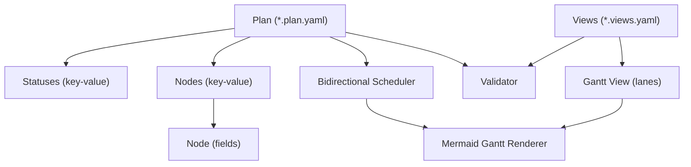
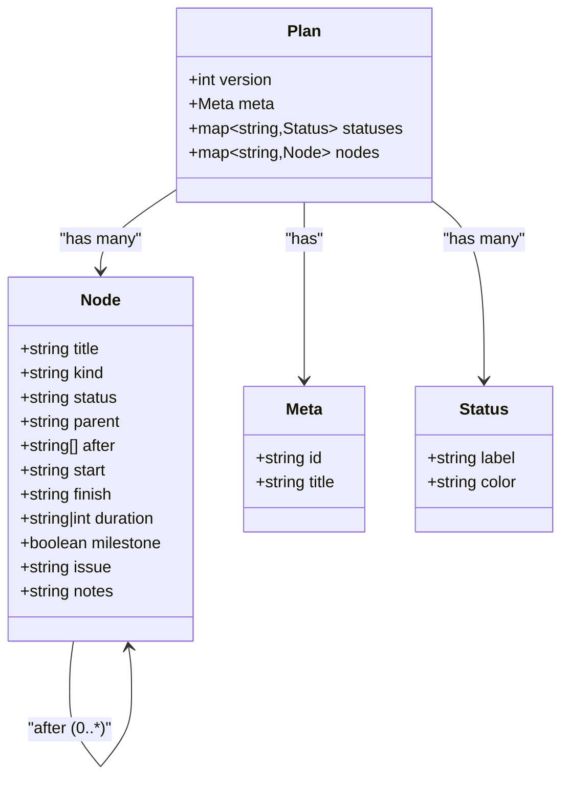
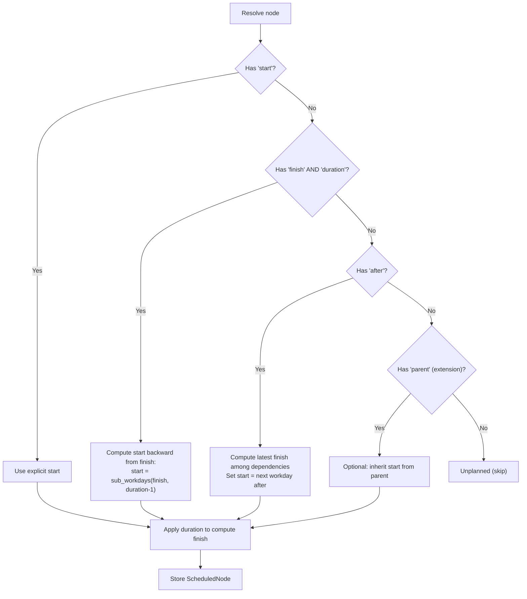
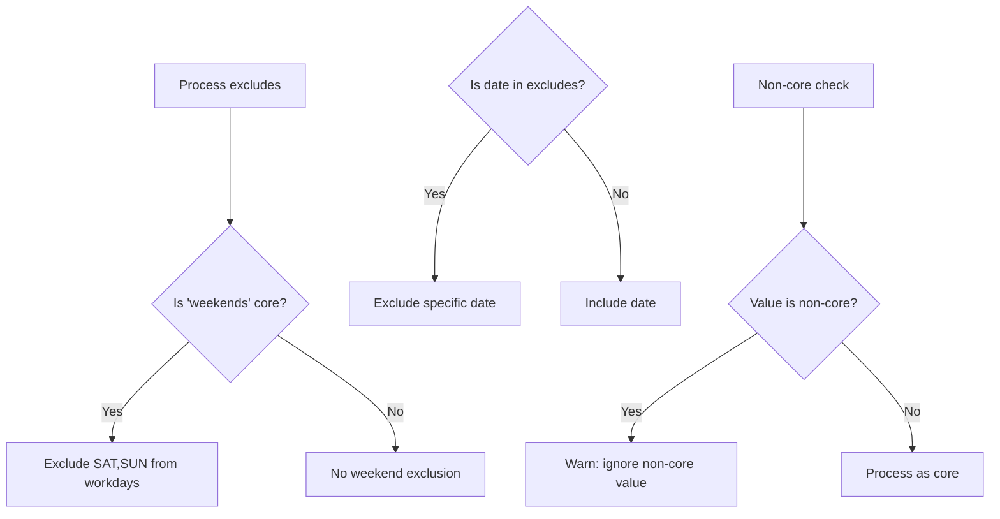
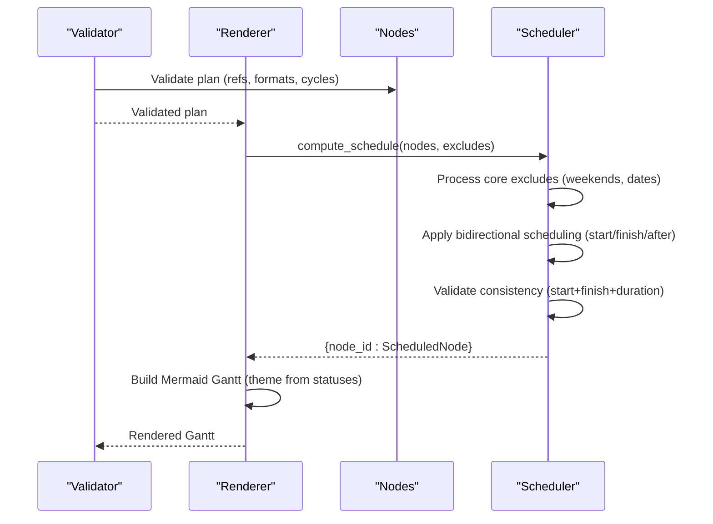
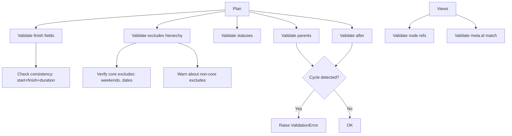

# Data Models

<cite>
**Referenced Files in This Document**
- [SPEC.md](file://specs/v1/SPEC.md)
- [00-introduction.md](file://specs/v1/spec/00-introduction.md)
- [10-plan-file.md](file://specs/v1/spec/10-plan-file.md)
- [20-nodes.md](file://specs/v1/spec/20-nodes.md)
- [40-statuses.md](file://specs/v1/spec/40-statuses.md)
- [50-scheduling.md](file://specs/v1/spec/50-scheduling.md)
- [60-validation.md](file://specs/v1/spec/60-validation.md)
- [plan.schema.json](file://specs/v1/schemas/plan.schema.json)
- [views.schema.json](file://specs/v1/schemas/views.schema.json)
- [validate.py](file://specs/v1/tools/validate.py)
- [mermaid_gantt.py](file://specs/v1/tools/render/mermaid_gantt.py)
- [hello.plan.yaml](file://specs/v1/examples/hello/hello.plan.yaml)
- [hello.views.yaml](file://specs/v1/examples/hello/hello.views.yaml)
- [program.plan.yaml](file://specs/v1/examples/advanced/program.plan.yaml)
- [program.views.yaml](file://specs/v1/examples/advanced/program.views.yaml)
- [finish_field.plan.yaml](file://specs/v1/tests/finish_field.plan.yaml)
- [date_excludes.plan.yaml](file://specs/v1/tests/date_excludes.plan.yaml)
- [test_scheduling.py](file://specs/v1/tests/test_scheduling.py)
</cite>

## Update Summary
**Changes Made**
- Enhanced temporal planning data model with new finish field requirements and validation rules
- Added backward scheduling capabilities (bidirectional scheduling from finish)
- Updated calendar exclusion hierarchies with core vs non-core distinction
- Expanded scheduling algorithm to support both forward and backward planning modes
- Added comprehensive validation rules for start/finish/duration consistency
- Updated node scheduling data structures to handle bidirectional scheduling scenarios

## Table of Contents
1. [Introduction](#introduction)
2. [Project Structure](#project-structure)
3. [Core Components](#core-components)
4. [Architecture Overview](#architecture-overview)
5. [Detailed Component Analysis](#detailed-component-analysis)
6. [Dependency Analysis](#dependency-analysis)
7. [Performance Considerations](#performance-considerations)
8. [Troubleshooting Guide](#troubleshooting-guide)
9. [Conclusion](#conclusion)
10. [Appendices](#appendices)

## Introduction
This document describes the core data models for operational maps in opskarta v1. It focuses on:
- Node types and hierarchy (summary, phase, epic, task)
- Status definitions, labels, and colors
- Enhanced temporal planning with bidirectional scheduling (forward from start OR backward from finish)
- Calendar exclusion hierarchies (core vs non-core excludes)
- Validation rules and referential integrity
- Rendering and scheduling algorithms used to produce Gantt diagrams
- Entity relationship diagrams and transformation/computed properties
- Practical examples from the repository

## Project Structure
The opskarta specification is organized around two primary artifacts:
- Plan files (*.plan.yaml): define nodes, statuses, and temporal metadata
- Views files (*.views.yaml): define presentation layers (e.g., Gantt views) over plan data


**Diagram sources**
- [00-introduction.md](file://specs/v1/spec/00-introduction.md#L1-L10)
- [10-plan-file.md](file://specs/v1/spec/10-plan-file.md#L1-L30)
- [20-nodes.md](file://specs/v1/spec/20-nodes.md#L1-L37)
- [40-statuses.md](file://specs/v1/spec/40-statuses.md#L1-L23)
- [50-scheduling.md](file://specs/v1/spec/50-scheduling.md#L1-L80)
- [60-validation.md](file://specs/v1/spec/60-validation.md#L1-L140)
- [plan.schema.json](file://specs/v1/schemas/plan.schema.json#L1-L86)
- [views.schema.json](file://specs/v1/schemas/views.schema.json#L1-L26)
- [validate.py](file://specs/v1/tools/validate.py#L1-L752)
- [mermaid_gantt.py](file://specs/v1/tools/render/mermaid_gantt.py#L1-L549)
- [hello.plan.yaml](file://specs/v1/examples/hello/hello.plan.yaml#L1-L44)
- [hello.views.yaml](file://specs/v1/examples/hello/hello.views.yaml#L1-L13)
- [program.plan.yaml](file://specs/v1/examples/advanced/program.plan.yaml#L1-L326)
- [program.views.yaml](file://specs/v1/examples/advanced/program.views.yaml#L1-L93)

**Section sources**
- [00-introduction.md](file://specs/v1/spec/00-introduction.md#L1-L10)
- [10-plan-file.md](file://specs/v1/spec/10-plan-file.md#L1-L30)
- [20-nodes.md](file://specs/v1/spec/20-nodes.md#L1-L37)
- [40-statuses.md](file://specs/v1/spec/40-statuses.md#L1-L23)
- [50-scheduling.md](file://specs/v1/spec/50-scheduling.md#L1-L80)
- [60-validation.md](file://specs/v1/spec/60-validation.md#L1-L140)
- [plan.schema.json](file://specs/v1/schemas/plan.schema.json#L1-L86)
- [views.schema.json](file://specs/v1/schemas/views.schema.json#L1-L26)
- [validate.py](file://specs/v1/tools/validate.py#L1-L752)
- [mermaid_gantt.py](file://specs/v1/tools/render/mermaid_gantt.py#L1-L549)
- [hello.plan.yaml](file://specs/v1/examples/hello/hello.plan.yaml#L1-L44)
- [hello.views.yaml](file://specs/v1/examples/hello/hello.views.yaml#L1-L13)
- [program.plan.yaml](file://specs/v1/examples/advanced/program.plan.yaml#L1-L326)
- [program.views.yaml](file://specs/v1/examples/advanced/program.views.yaml#L1-L93)

## Core Components
This section defines the core entities and their properties, constraints, and relationships.

- Plan root
  - version: integer (required)
  - meta: object (required)
    - id: string (required, non-empty)
    - title: string (required, non-empty)
  - statuses: object (optional)
  - nodes: object (required, may be empty)

- Node
  - title: string (required)
  - kind: string (recommended values: summary, phase, epic, user_story, task)
  - status: string (must reference a key in statuses if present)
  - parent: string (must reference an existing node_id)
  - after: array[string] (each element must reference an existing node_id)
  - start: string (ISO date YYYY-MM-DD)
  - finish: string (ISO date YYYY-MM-DD) - **NEW**: target completion date or deadline
  - duration: string|int (string format "<number>d" or "<number>w"; int means calendar days)
  - milestone: boolean (optional, if true node is a point in time)
  - issue: string (external ticket identifier)
  - notes: string (freeform context)

- Status
  - label: string (human-readable)
  - color: string (hex color)

- Views root
  - version: integer (required)
  - project: string (required, must match meta.id)
  - gantt_views: object (optional)

- Gantt view
  - title: string
  - excludes: array[string] (core: weekends; may include specific dates; non-core values ignored)
  - lanes: object
    - title: string
    - nodes: array[string] (each must exist in nodes)

**Updated** Enhanced temporal planning with finish field and bidirectional scheduling support

Constraints and rules
- Referential integrity
  - parent must reference an existing node_id
  - each after item must reference an existing node_id
  - status must reference an existing key in statuses if statuses exists
- No cycles
  - parent chain must be acyclic
  - after graph must be acyclic
- Date and duration formats
  - start must match YYYY-MM-DD
  - finish must match YYYY-MM-DD
  - duration must match <digits>d or <digits>w or digits
- **NEW**: Consistency validation
  - If all three (start, finish, duration) are specified, they must be consistent
  - start/finish/duration validation ensures mathematical correctness
- **NEW**: Calendar exclusion hierarchy
  - Core excludes: "weekends" and specific dates YYYY-MM-DD (influences calculations)
  - Non-core excludes: other values (ignored with warnings)
- Unplanned nodes
  - If neither start nor finish nor after is specified, a node is considered unplanned and typically not rendered on timelines

Computed and derived properties
- Planned start date
  - Explicit: use start if present
  - **NEW**: Backward from finish: compute start = sub_workdays(finish, duration-1) if finish present
  - Implicit via dependencies: start after completion of all dependencies (after)
  - Inheritance: if no start/finish/after, inherit from parent if parent is planned
- Planned finish date
  - finish = start + duration - 1 day (with working-day adjustments when excluding weekends)
  - **NEW**: Can be computed from start + duration if finish not specified
- **NEW**: Duration inference
  - If duration not specified for scheduled node, defaults to 1d
  - If start and finish specified without duration, duration computed as workdays between dates
- Gantt rendering
  - Nodes without explicit start/finish/after are skipped from timeline lanes
  - Status colors influence Mermaid theme variables for rendering
  - **NEW**: Non-core excludes are ignored in calculations but may be warned about

**Section sources**
- [10-plan-file.md](file://specs/v1/spec/10-plan-file.md#L1-L30)
- [20-nodes.md](file://specs/v1/spec/20-nodes.md#L1-L37)
- [40-statuses.md](file://specs/v1/spec/40-statuses.md#L1-L23)
- [50-scheduling.md](file://specs/v1/spec/50-scheduling.md#L56-L73)
- [60-validation.md](file://specs/v1/spec/60-validation.md#L117-L122)
- [60-validation.md](file://specs/v1/spec/60-validation.md#L236-L237)
- [plan.schema.json](file://specs/v1/schemas/plan.schema.json#L68-L72)
- [plan.schema.json](file://specs/v1/schemas/plan.schema.json#L78-L81)
- [hello.plan.yaml](file://specs/v1/examples/hello/hello.plan.yaml#L1-L44)
- [program.plan.yaml](file://specs/v1/examples/advanced/program.plan.yaml#L1-L326)

## Architecture Overview
The opskarta data model centers on a plan-driven graph of nodes with enhanced temporal metadata and explicit dependencies. Views consume the plan to produce Gantt diagrams with bidirectional scheduling capabilities.



**Diagram sources**
- [10-plan-file.md](file://specs/v1/spec/10-plan-file.md#L1-L30)
- [20-nodes.md](file://specs/v1/spec/20-nodes.md#L1-L37)
- [50-scheduling.md](file://specs/v1/spec/50-scheduling.md#L1-L80)
- [60-validation.md](file://specs/v1/spec/60-validation.md#L1-L140)
- [validate.py](file://specs/v1/tools/validate.py#L135-L329)
- [mermaid_gantt.py](file://specs/v1/tools/render/mermaid_gantt.py#L349-L433)

## Detailed Component Analysis

### Node Types and Hierarchy
- summary: top-level container
- phase: stage/phase
- epic: major system component
- user_story: value story
- task: concrete work item

Parent-child relationships form a strict tree (no cycles). Nodes may carry kind to guide visualization and reporting.



**Diagram sources**
- [20-nodes.md](file://specs/v1/spec/20-nodes.md#L1-L37)
- [10-plan-file.md](file://specs/v1/spec/10-plan-file.md#L1-L30)
- [40-statuses.md](file://specs/v1/spec/40-statuses.md#L1-L23)

**Section sources**
- [20-nodes.md](file://specs/v1/spec/20-nodes.md#L11-L16)
- [hello.plan.yaml](file://specs/v1/examples/hello/hello.plan.yaml#L13-L44)
- [program.plan.yaml](file://specs/v1/examples/advanced/program.plan.yaml#L16-L326)

### Status Management
- statuses is a dictionary of arbitrary keys to status objects
- Each status object has label and color
- Recommended keys include not_started, in_progress, done, blocked


**Diagram sources**
- [60-validation.md](file://specs/v1/spec/60-validation.md#L57-L75)
- [40-statuses.md](file://specs/v1/spec/40-statuses.md#L1-L23)

**Section sources**
- [40-statuses.md](file://specs/v1/spec/40-statuses.md#L1-L23)
- [60-validation.md](file://specs/v1/spec/60-validation.md#L57-L75)
- [hello.plan.yaml](file://specs/v1/examples/hello/hello.plan.yaml#L7-L11)
- [program.plan.yaml](file://specs/v1/examples/advanced/program.plan.yaml#L7-L14)

### Enhanced Temporal Planning and Bidirectional Scheduling
**Updated** The temporal planning system now supports bidirectional scheduling with enhanced validation rules.

- start: explicit start date (YYYY-MM-DD)
- finish: **NEW** target completion date or deadline (YYYY-MM-DD)
- duration: days or weeks (e.g., 5d, 2w) or integer days
- after: list of dependencies; node starts after all dependencies finish
- **NEW**: Priority-based scheduling algorithm:
  1. Explicit start (highest priority)
  2. **NEW**: Finish + duration (backward scheduling)
  3. Dependencies after (forward scheduling)
  4. Parent inheritance (optional extension)
- **NEW**: Consistency validation: start + finish + duration must be mathematically consistent
- Working-day arithmetic supports weekend exclusions and specific date exclusions



**Diagram sources**
- [50-scheduling.md](file://specs/v1/spec/50-scheduling.md#L198-L213)
- [50-scheduling.md](file://specs/v1/spec/50-scheduling.md#L450-L458)
- [mermaid_gantt.py](file://specs/v1/tools/render/mermaid_gantt.py#L324-L471)

**Section sources**
- [50-scheduling.md](file://specs/v1/spec/50-scheduling.md#L56-L73)
- [50-scheduling.md](file://specs/v1/spec/50-scheduling.md#L198-L213)
- [50-scheduling.md](file://specs/v1/spec/50-scheduling.md#L450-L458)
- [mermaid_gantt.py](file://specs/v1/tools/render/mermaid_gantt.py#L324-L471)
- [mermaid_gantt.py](file://specs/v1/tools/render/mermaid_gantt.py#L219-L237)
- [mermaid_gantt.py](file://specs/v1/tools/render/mermaid_gantt.py#L240-L262)

### Calendar Exclusion Hierarchies
**Updated** Enhanced calendar exclusion system with core vs non-core distinction.

- Core excludes (influence calculations):
  - "weekends" - excludes Saturdays and Sundays
  - Specific dates YYYY-MM-DD - excludes individual holidays/partial closures
- Non-core excludes (ignored with warnings):
  - Arbitrary tokens like "monday", custom day names
  - Renderer-specific extensions (must be documented)
- **NEW**: Core excludes determine working day calculations
- **NEW**: Non-core excludes are ignored but warned about



**Diagram sources**
- [50-scheduling.md](file://specs/v1/spec/50-scheduling.md#L239-L279)
- [60-validation.md](file://specs/v1/spec/60-validation.md#L189-L205)
- [mermaid_gantt.py](file://specs/v1/tools/render/mermaid_gantt.py#L286-L313)

**Section sources**
- [50-scheduling.md](file://specs/v1/spec/50-scheduling.md#L239-L279)
- [60-validation.md](file://specs/v1/spec/60-validation.md#L189-L205)
- [mermaid_gantt.py](file://specs/v1/tools/render/mermaid_gantt.py#L286-L313)

### Entity Relationship Diagram (ERD)
This diagram shows how nodes relate to each other and to statuses, including the new finish field.

```mermaid
erDiagram
NODE {
string id PK
string title
string kind
string status
string parent
string[] after
string start
string finish
string|int duration
boolean milestone
string issue
string notes
}
STATUS {
string key PK
string label
string color
}
PLAN {
int version
string meta_id
string meta_title
}
PLAN ||--o{ NODE : "contains"
NODE }o--|| STATUS : "uses"
NODE }o--|| NODE : "parent"
NODE }o--o{ NODE : "after"
```

**Diagram sources**
- [20-nodes.md](file://specs/v1/spec/20-nodes.md#L1-L37)
- [40-statuses.md](file://specs/v1/spec/40-statuses.md#L1-L23)
- [10-plan-file.md](file://specs/v1/spec/10-plan-file.md#L1-L30)
- [plan.schema.json](file://specs/v1/schemas/plan.schema.json#L38-L82)

**Section sources**
- [20-nodes.md](file://specs/v1/spec/20-nodes.md#L1-L37)
- [40-statuses.md](file://specs/v1/spec/40-statuses.md#L1-L23)
- [10-plan-file.md](file://specs/v1/spec/10-plan-file.md#L1-L30)
- [plan.schema.json](file://specs/v1/schemas/plan.schema.json#L1-L86)

### Data Transformation and Computed Properties
**Updated** Enhanced transformation pipeline with bidirectional scheduling and calendar exclusion processing.

- Computed schedule per node: start, finish, duration_days
- **NEW**: Bidirectional scheduling with priority-based resolution
- **NEW**: Calendar exclusion hierarchy processing (core vs non-core)
- Theme variables for Mermaid Gantt generated from status colors
- Status-to-Mermaid tag mapping for rendering



**Diagram sources**
- [validate.py](file://specs/v1/tools/validate.py#L135-L329)
- [mermaid_gantt.py](file://specs/v1/tools/render/mermaid_gantt.py#L324-L471)
- [mermaid_gantt.py](file://specs/v1/tools/render/mermaid_gantt.py#L527-L600)

**Section sources**
- [validate.py](file://specs/v1/tools/validate.py#L135-L329)
- [mermaid_gantt.py](file://specs/v1/tools/render/mermaid_gantt.py#L317-L347)
- [mermaid_gantt.py](file://specs/v1/tools/render/mermaid_gantt.py#L349-L433)

## Dependency Analysis
**Updated** Enhanced dependency analysis with new finish field validation and calendar exclusion rules.

- Referential integrity checks ensure parent and after references exist
- Acyclicity enforced via DFS traversal for after and iterative traversal for parent
- **NEW**: Finish field validation ensures mathematical consistency
- **NEW**: Calendar exclusion hierarchy validation (core vs non-core)
- Views must reference existing node IDs and align project with meta.id



**Diagram sources**
- [validate.py](file://specs/v1/tools/validate.py#L332-L403)
- [validate.py](file://specs/v1/tools/validate.py#L431-L579)
- [60-validation.md](file://specs/v1/spec/60-validation.md#L13-L115)
- [60-validation.md](file://specs/v1/spec/60-validation.md#L117-L122)
- [60-validation.md](file://specs/v1/spec/60-validation.md#L189-L205)

**Section sources**
- [validate.py](file://specs/v1/tools/validate.py#L332-L403)
- [validate.py](file://specs/v1/tools/validate.py#L431-L579)
- [60-validation.md](file://specs/v1/spec/60-validation.md#L13-L115)
- [60-validation.md](file://specs/v1/spec/60-validation.md#L117-L122)
- [60-validation.md](file://specs/v1/spec/60-validation.md#L189-L205)

## Performance Considerations
**Updated** Performance optimizations for enhanced scheduling capabilities.

- Scheduling computation uses memoization (cache) to avoid recomputation during recursive resolution
- **NEW**: Bidirectional scheduling with priority-based caching reduces redundant calculations
- Topological constraints (acyclic parent and after) prevent infinite loops and ensure linear-time traversal
- **NEW**: Calendar exclusion hierarchy processing cached for repeated use
- Large operational maps benefit from:
  - Pre-validating plans to catch cycles early
  - Limiting view scope to subsets of nodes to reduce rendering overhead
  - Using integer durations where possible to minimize parsing overhead
  - **NEW**: Efficient core vs non-core exclude categorization

## Troubleshooting Guide
**Updated** Common issues and resolutions for enhanced temporal planning.

Common issues and resolutions:
- Invalid reference errors
  - Parent or after references missing node_id
  - Status references missing key in statuses
  - View lanes reference missing node_id
- Format errors
  - start not matching YYYY-MM-DD
  - finish not matching YYYY-MM-DD
  - duration not matching supported formats
- **NEW**: Consistency errors
  - start + finish + duration not mathematically consistent
  - finish field conflicts with explicit start
- **NEW**: Calendar exclusion issues
  - Non-core exclude values ignored with warnings
  - Core exclude validation failures
- Cycle detection
  - parent chain forming cycles
  - after graph forming cycles
- **NEW**: Bidirectional scheduling conflicts
  - Explicit start contradicts finish-based calculation
  - Multiple scheduling methods specified simultaneously
- Messages
  - Validators provide path, value, expected, and available suggestions
  - **NEW**: Specific warnings for non-core exclude values

**Section sources**
- [60-validation.md](file://specs/v1/spec/60-validation.md#L124-L140)
- [validate.py](file://specs/v1/tools/validate.py#L30-L63)
- [validate.py](file://specs/v1/tools/validate.py#L230-L324)
- [validate.py](file://specs/v1/tools/validate.py#L332-L403)
- [validate.py](file://specs/v1/tools/validate.py#L431-L579)
- [60-validation.md](file://specs/v1/spec/60-validation.md#L236-L241)

## Conclusion
**Updated** The opskarta v1 data model provides a robust, extensible foundation for operational maps with enhanced temporal planning capabilities:
- Hierarchical decomposition via summary, phase, epic, and task
- Flexible status definitions with labels and colors
- **NEW**: Bidirectional scheduling supporting both forward (start-based) and backward (finish-based) planning
- **Enhanced**: Core vs non-core calendar exclusion hierarchy with standardized behavior
- **NEW**: Comprehensive validation rules ensuring mathematical consistency and referential integrity
- Strong validation rules ensuring referential integrity and acyclicity
- Practical rendering pipeline producing Gantt diagrams with working-day-aware scheduling

## Appendices

### Example References
- Minimal plan with a single root node
  - [project.plan.yaml](file://specs/v1/examples/minimal/project.plan.yaml#L1-L6)
- Hello upgrade program with phases, tasks, and dependencies
  - [hello.plan.yaml](file://specs/v1/examples/hello/hello.plan.yaml#L1-L44)
  - [hello.views.yaml](file://specs/v1/examples/hello/hello.views.yaml#L1-L13)
- Advanced program with multiple tracks, cross-track dependencies, and milestones
  - [program.plan.yaml](file://specs/v1/examples/advanced/program.plan.yaml#L1-L326)
  - [program.views.yaml](file://specs/v1/examples/advanced/program.views.yaml#L1-L93)
- **NEW**: Finish field examples demonstrating backward scheduling
  - [finish_field.plan.yaml](file://specs/v1/tests/finish_field.plan.yaml#L1-L30)
- **NEW**: Date exclusion examples with holidays and weekend exclusions
  - [date_excludes.plan.yaml](file://specs/v1/tests/date_excludes.plan.yaml#L1-L31)
- **NEW**: Comprehensive scheduling test suite validating all scenarios
  - [test_scheduling.py](file://specs/v1/tests/test_scheduling.py#L1-L403)

**Section sources**
- [hello.plan.yaml](file://specs/v1/examples/hello/hello.plan.yaml#L1-L44)
- [hello.views.yaml](file://specs/v1/examples/hello/hello.views.yaml#L1-L13)
- [program.plan.yaml](file://specs/v1/examples/advanced/program.plan.yaml#L1-L326)
- [program.views.yaml](file://specs/v1/examples/advanced/program.views.yaml#L1-L93)
- [finish_field.plan.yaml](file://specs/v1/tests/finish_field.plan.yaml#L1-L30)
- [date_excludes.plan.yaml](file://specs/v1/tests/date_excludes.plan.yaml#L1-L31)
- [test_scheduling.py](file://specs/v1/tests/test_scheduling.py#L1-L403)