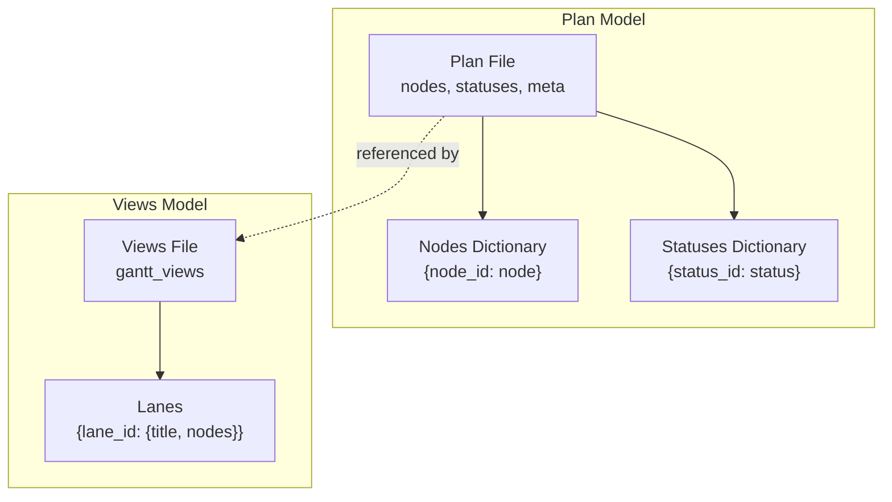
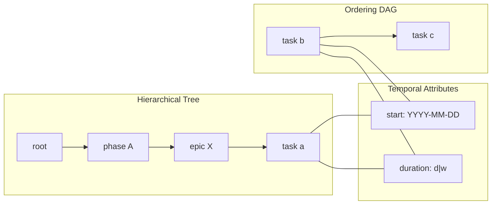
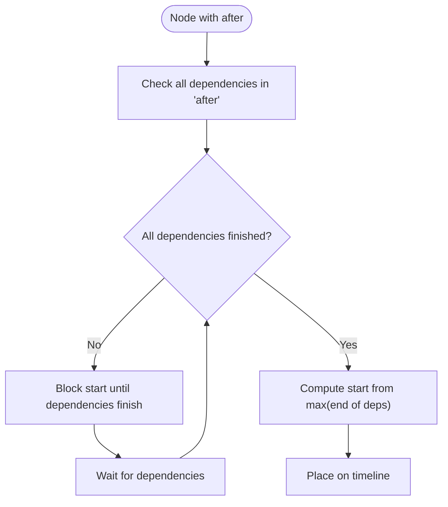
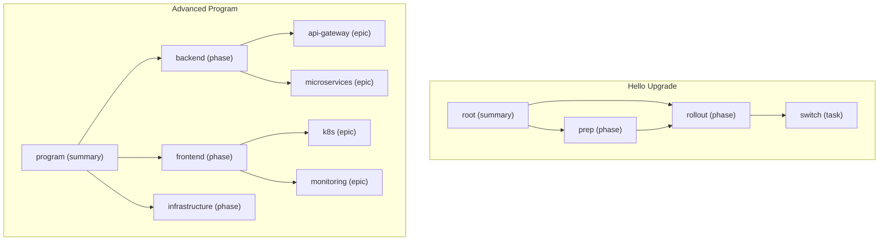
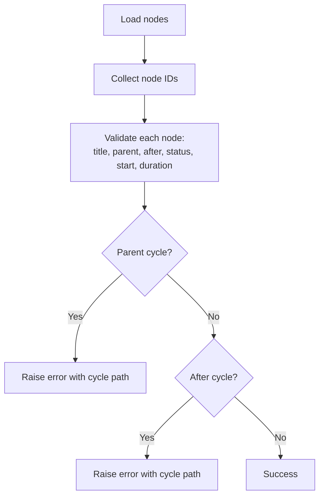
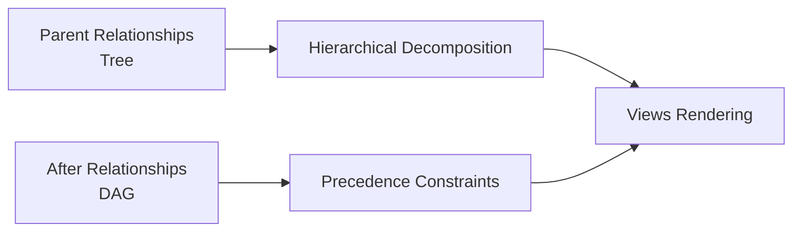

# Node Hierarchies and Relationships

<cite>
**Referenced Files in This Document**
- [README.md](file://README.md)
- [docs/method.md](file://docs/method.md)
- [specs/v1/spec/10-plan-file.md](file://specs/v1/spec/10-plan-file.md)
- [specs/v1/spec/20-nodes.md](file://specs/v1/spec/20-nodes.md)
- [specs/v1/spec/50-scheduling.md](file://specs/v1/spec/50-scheduling.md)
- [specs/v1/spec/60-validation.md](file://specs/v1/spec/60-validation.md)
- [specs/v1/schemas/plan.schema.json](file://specs/v1/schemas/plan.schema.json)
- [specs/v1/examples/hello/hello.plan.yaml](file://specs/v1/examples/hello/hello.plan.yaml)
- [specs/v1/examples/hello/hello.views.yaml](file://specs/v1/examples/hello/hello.views.yaml)
- [specs/v1/examples/advanced/program.plan.yaml](file://specs/v1/examples/advanced/program.plan.yaml)
- [specs/v1/examples/advanced/program.views.yaml](file://specs/v1/examples/advanced/program.views.yaml)
- [specs/v1/tools/validate.py](file://specs/v1/tools/validate.py)
</cite>

## Table of Contents
1. [Introduction](#introduction)
2. [Project Structure](#project-structure)
3. [Core Components](#core-components)
4. [Architecture Overview](#architecture-overview)
5. [Detailed Component Analysis](#detailed-component-analysis)
6. [Dependency Analysis](#dependency-analysis)
7. [Performance Considerations](#performance-considerations)
8. [Troubleshooting Guide](#troubleshooting-guide)
9. [Conclusion](#conclusion)
10. [Appendices](#appendices)

## Introduction
This document explains how node hierarchies and relationships are modeled in operational maps using the opskarta v1 specification. It focuses on the four primary node kinds (summary, phase, epic, task), how parent-child relationships decompose work, and how explicit dependency relationships using the after field differ from hierarchical relationships. It also documents validation rules, circular dependency detection, referential integrity, and best practices for organizing complex operational maps.

## Project Structure
The opskarta specification organizes operational maps around two core artifacts:
- Plan files (*.plan.yaml): define the canonical work graph with nodes, statuses, and scheduling metadata.
- Views files (*.views.yaml): define presentation slices (lanes) over the plan for rendering Gantt charts and other views.

**Diagram sources**
- [specs/v1/spec/10-plan-file.md](file://specs/v1/spec/10-plan-file.md#L1-L30)
- [specs/v1/examples/hello/hello.views.yaml](file://specs/v1/examples/hello/hello.views.yaml#L1-L13)
- [specs/v1/examples/advanced/program.views.yaml](file://specs/v1/examples/advanced/program.views.yaml#L1-L93)

**Section sources**
- [README.md](file://README.md#L1-L96)
- [docs/method.md](file://docs/method.md#L1-L120)
- [specs/v1/spec/10-plan-file.md](file://specs/v1/spec/10-plan-file.md#L1-L30)

## Core Components
- Node: the fundamental unit of work in an operational map. Each node has a stable machine-readable ID, a human-readable title, and optional attributes such as kind, status, parent, after, start, duration, issue, and notes.
- Node kinds: summary, phase, epic, user_story, task. These kinds guide semantic interpretation and rendering.
- Parent-child hierarchy: controlled by the parent field, establishing a strict tree-like decomposition of work.
- Dependencies: explicit ordering via the after field, allowing nodes to start only after all listed dependencies finish.
- Scheduling: optional start date and duration; when combined with after, they drive temporal placement in views.

Key node fields and semantics:
- title: required for every node.
- kind: recommended; supported kinds include summary, phase, epic, user_story, task.
- status: recommended; must reference a key in the statuses dictionary.
- parent: recommended; must reference an existing node ID; creates the hierarchical decomposition.
- after: recommended; list of node IDs; node starts after all dependencies finish.
- start: optional; ISO date string (YYYY-MM-DD).
- duration: optional; string format <number><unit> where unit is d (days) or w (weeks).
- issue: optional; link/key to external system (e.g., JIRA-123).
- notes: optional; multiline context.

**Section sources**
- [specs/v1/spec/20-nodes.md](file://specs/v1/spec/20-nodes.md#L1-L37)
- [specs/v1/spec/10-plan-file.md](file://specs/v1/spec/10-plan-file.md#L1-L30)
- [specs/v1/spec/50-scheduling.md](file://specs/v1/spec/50-scheduling.md#L1-L80)
- [specs/v1/schemas/plan.schema.json](file://specs/v1/schemas/plan.schema.json#L1-L86)

## Architecture Overview
The operational map is a directed acyclic graph (DAG) composed of:
- A hierarchical tree defined by parent relationships.
- An ordering DAG defined by after relationships.
- Optional temporal attributes (start, duration) enabling Gantt rendering.

**Diagram sources**
- [specs/v1/spec/20-nodes.md](file://specs/v1/spec/20-nodes.md#L20-L28)
- [specs/v1/spec/50-scheduling.md](file://specs/v1/spec/50-scheduling.md#L1-L80)
- [specs/v1/examples/hello/hello.plan.yaml](file://specs/v1/examples/hello/hello.plan.yaml#L13-L44)

## Detailed Component Analysis

### Node Types and Roles
- summary: top-level container for high-level decomposition.
- phase: stage or phase of work under a summary.
- epic: large capability or feature area under a phase.
- user_story: story/value-oriented unit (recommended kind).
- task: concrete work item under an epic or phase.

These kinds inform rendering and semantic interpretation. They do not enforce workflow; status is a label for the map.

**Section sources**
- [specs/v1/spec/20-nodes.md](file://specs/v1/spec/20-nodes.md#L11-L16)
- [specs/v1/spec/20-nodes.md](file://specs/v1/spec/20-nodes.md#L35-L36)

### Parent-Child Decomposition
Parent-child relationships form a strict tree:
- parent must reference an existing node ID.
- cycles in parent links are forbidden.
- nodes can be organized into tracks (e.g., backend, frontend, infrastructure) by assigning a common ancestor and using phases as containers.

Example decomposition patterns:
- Program summary contains multiple phases.
- Each phase contains epics and tasks.
- Tasks can themselves be grouped into epics.

**Section sources**
- [specs/v1/spec/20-nodes.md](file://specs/v1/spec/20-nodes.md#L20-L20)
- [specs/v1/spec/60-validation.md](file://specs/v1/spec/60-validation.md#L15-L18)
- [specs/v1/examples/advanced/program.plan.yaml](file://specs/v1/examples/advanced/program.plan.yaml#L16-L29)

### Explicit Dependencies Using the after Field
- after defines ordering constraints: a node can start only after all dependencies finish.
- after entries must reference existing node IDs.
- cycles in after relationships are forbidden.
- If start is omitted but after is present, the node’s start is computed as the maximum completion date of its dependencies.

**Diagram sources**
- [specs/v1/spec/50-scheduling.md](file://specs/v1/spec/50-scheduling.md#L77-L78)
- [specs/v1/spec/60-validation.md](file://specs/v1/spec/60-validation.md#L36-L39)

**Section sources**
- [specs/v1/spec/20-nodes.md](file://specs/v1/spec/20-nodes.md#L22-L23)
- [specs/v1/spec/50-scheduling.md](file://specs/v1/spec/50-scheduling.md#L15-L16)
- [specs/v1/spec/60-validation.md](file://specs/v1/spec/60-validation.md#L36-L39)

### Node Structures and Relationship Patterns
Concrete examples demonstrate:
- Minimal plan with a root node.
- Hello upgrade plan with summary, phases, and tasks, showing parent and after relationships.
- Advanced program plan with multiple tracks (backend, frontend, infrastructure), epics, and cross-track dependencies.

**Diagram sources**
- [specs/v1/examples/hello/hello.plan.yaml](file://specs/v1/examples/hello/hello.plan.yaml#L13-L44)
- [specs/v1/examples/advanced/program.plan.yaml](file://specs/v1/examples/advanced/program.plan.yaml#L16-L29)

**Section sources**
- [specs/v1/examples/minimal/project.plan.yaml](file://specs/v1/examples/minimal/project.plan.yaml#L1-L6)
- [specs/v1/examples/hello/hello.plan.yaml](file://specs/v1/examples/hello/hello.plan.yaml#L13-L44)
- [specs/v1/examples/advanced/program.plan.yaml](file://specs/v1/examples/advanced/program.plan.yaml#L16-L29)

### Validation Rules and Circular Dependency Detection
Validation enforces:
- Referential integrity:
  - parent must reference an existing node ID; cycles are disallowed.
  - after must reference existing node IDs; cycles are disallowed.
  - status must reference an existing status ID if present.
- Field format:
  - start must be ISO date (YYYY-MM-DD).
  - duration must be <number><unit> where unit is d or w.
- Error reporting includes path, value, expected, and available candidates.

Circular dependency detection:
- Parent cycles: detected by traversing parent links and detecting revisits.
- After cycles: detected using depth-first search with state tracking (unvisited, visiting, visited).

**Diagram sources**
- [specs/v1/tools/validate.py](file://specs/v1/tools/validate.py#L135-L329)
- [specs/v1/tools/validate.py](file://specs/v1/tools/validate.py#L332-L403)
- [specs/v1/spec/60-validation.md](file://specs/v1/spec/60-validation.md#L15-L18)
- [specs/v1/spec/60-validation.md](file://specs/v1/spec/60-validation.md#L36-L39)

**Section sources**
- [specs/v1/spec/60-validation.md](file://specs/v1/spec/60-validation.md#L7-L81)
- [specs/v1/tools/validate.py](file://specs/v1/tools/validate.py#L135-L329)
- [specs/v1/tools/validate.py](file://specs/v1/tools/validate.py#L332-L403)

### Inheritance and Property Resolution
The specification does not define property inheritance across the hierarchy. Instead, it emphasizes:
- Explicit node fields for each node.
- Status as a label for the map; it does not imply synchronization with external systems.
- Notes and issue fields as optional contextual information.

Best practice:
- Prefer explicit fields on each node to avoid ambiguity.
- Use statuses consistently across the plan to support downstream rendering and filtering.

**Section sources**
- [specs/v1/spec/20-nodes.md](file://specs/v1/spec/20-nodes.md#L35-L36)
- [specs/v1/spec/20-nodes.md](file://specs/v1/spec/20-nodes.md#L29-L29)

### Best Practices for Complex Operational Maps
- Decompose by tracks (backend, frontend, infrastructure) using summary and phase nodes.
- Group large capabilities into epics; break epics into tasks.
- Use after relationships to encode cross-phase or cross-track dependencies.
- Keep parent relationships simple and acyclic; use phases to separate concerns.
- Use statuses to reflect current state; keep them aligned with your process.
- Use notes sparingly for critical context; avoid overloading nodes with unstructured text.
- Leverage views to slice the plan for different audiences (executives, engineers, stakeholders).

**Section sources**
- [specs/v1/examples/advanced/program.plan.yaml](file://specs/v1/examples/advanced/program.plan.yaml#L16-L29)
- [specs/v1/examples/advanced/program.views.yaml](file://specs/v1/examples/advanced/program.views.yaml#L1-L93)
- [docs/method.md](file://docs/method.md#L73-L98)

## Dependency Analysis
The operational map combines two distinct dependency graphs:
- Hierarchical parent relationships: tree-like decomposition.
- Ordering after relationships: DAG of precedence constraints.

**Diagram sources**
- [specs/v1/spec/20-nodes.md](file://specs/v1/spec/20-nodes.md#L20-L23)
- [specs/v1/spec/60-validation.md](file://specs/v1/spec/60-validation.md#L15-L39)

**Section sources**
- [specs/v1/spec/20-nodes.md](file://specs/v1/spec/20-nodes.md#L20-L23)
- [specs/v1/spec/60-validation.md](file://specs/v1/spec/60-validation.md#L15-L39)

## Performance Considerations
- Validation complexity:
  - Referential checks: O(N) over nodes to collect IDs and validate each node’s parent/after.
  - Cycle detection:
    - Parent cycles: O(N) traversal.
    - After cycles: DFS with O(N + E) where E is the number of edges in after lists.
- Rendering:
  - Views rendering depends on the number of nodes and lanes; keep views focused to reduce computation.
- Recommendations:
  - Keep plans modular and avoid extremely deep hierarchies.
  - Limit after lists to essential dependencies to simplify cycle detection and rendering.

[No sources needed since this section provides general guidance]

## Troubleshooting Guide
Common issues and resolutions:
- Invalid parent reference:
  - Symptom: error indicating a non-existent parent ID.
  - Resolution: ensure parent references an existing node ID; remove cycles.
- Invalid after reference:
  - Symptom: error indicating a missing dependency ID.
  - Resolution: add the referenced node or remove it from after lists.
- Status not found:
  - Symptom: error indicating a status ID not present in statuses.
  - Resolution: add the status to the statuses dictionary or remove the status field.
- Date or duration format errors:
  - Symptom: errors about invalid date or duration format.
  - Resolution: conform to YYYY-MM-DD for start and <number>d or <number>w for duration.
- Circular dependencies:
  - Symptom: errors indicating cycles in parent or after relationships.
  - Resolution: break the cycle by adjusting parent or after fields.

Diagnostic tips:
- Use the validator’s error messages to locate the problematic field and available candidates.
- Validate plans and views separately to isolate issues.

**Section sources**
- [specs/v1/spec/60-validation.md](file://specs/v1/spec/60-validation.md#L13-L81)
- [specs/v1/tools/validate.py](file://specs/v1/tools/validate.py#L135-L329)
- [specs/v1/tools/validate.py](file://specs/v1/tools/validate.py#L332-L403)

## Conclusion
Opskarta v1 models operational maps as a combination of hierarchical decomposition and explicit ordering constraints. The four node kinds (summary, phase, epic, task) provide semantic clarity, while parent and after relationships define structure and precedence. Robust validation ensures referential integrity and acyclic dependencies, and views enable flexible presentation. Following the best practices outlined here helps manage complexity and maintain clarity across large-scale operational maps.

[No sources needed since this section summarizes without analyzing specific files]

## Appendices

### Appendix A: Example Node Structures
- Minimal plan: root node with minimal fields.
- Hello upgrade: summary, phases, and tasks with parent and after relationships.
- Advanced program: multi-track plan with epics and cross-track dependencies.

**Section sources**
- [specs/v1/examples/minimal/project.plan.yaml](file://specs/v1/examples/minimal/project.plan.yaml#L1-L6)
- [specs/v1/examples/hello/hello.plan.yaml](file://specs/v1/examples/hello/hello.plan.yaml#L13-L44)
- [specs/v1/examples/advanced/program.plan.yaml](file://specs/v1/examples/advanced/program.plan.yaml#L16-L29)

### Appendix B: Views Integration
- Views files reference nodes from the plan and group them into lanes for rendering.
- The project field in views must match meta.id in the plan.

**Section sources**
- [specs/v1/examples/hello/hello.views.yaml](file://specs/v1/examples/hello/hello.views.yaml#L1-L13)
- [specs/v1/examples/advanced/program.views.yaml](file://specs/v1/examples/advanced/program.views.yaml#L1-L93)
- [specs/v1/spec/60-validation.md](file://specs/v1/spec/60-validation.md#L89-L114)