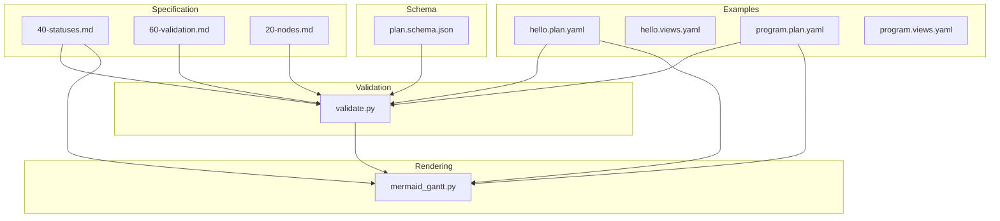
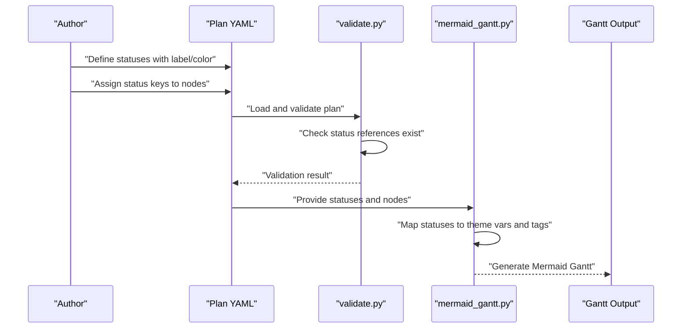
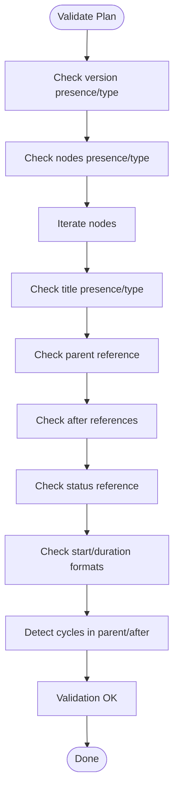
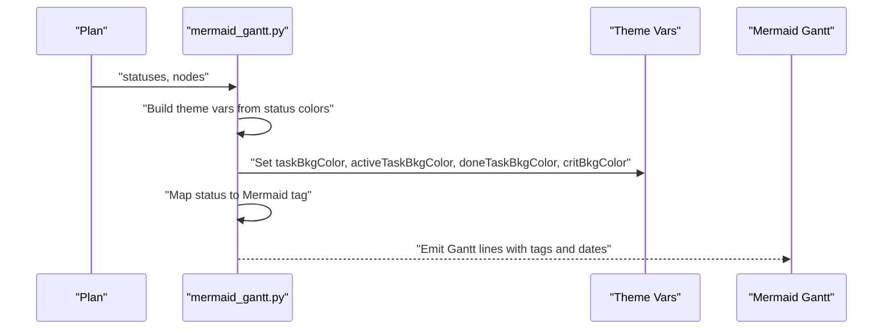
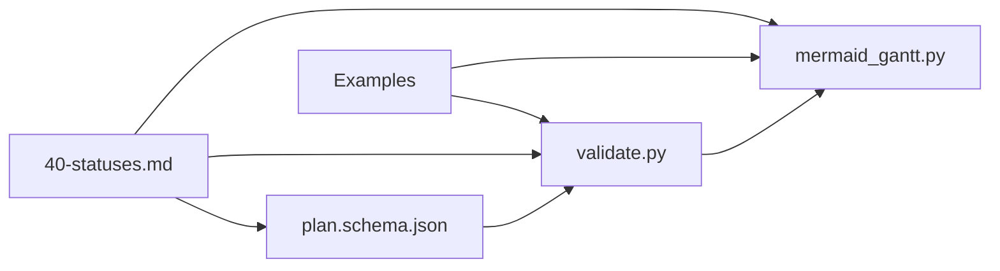

# Status Management System

<cite>
**Referenced Files in This Document**
- [40-statuses.md](file://specs/v1/spec/40-statuses.md)
- [60-validation.md](file://specs/v1/spec/60-validation.md)
- [20-nodes.md](file://specs/v1/spec/20-nodes.md)
- [plan.schema.json](file://specs/v1/schemas/plan.schema.json)
- [validate.py](file://specs/v1/tools/validate.py)
- [mermaid_gantt.py](file://specs/v1/tools/render/mermaid_gantt.py)
- [hello.plan.yaml](file://specs/v1/examples/hello/hello.plan.yaml)
- [hello.views.yaml](file://specs/v1/examples/hello/hello.views.yaml)
- [program.plan.yaml](file://specs/v1/examples/advanced/program.plan.yaml)
- [program.views.yaml](file://specs/v1/examples/advanced/program.views.yaml)
</cite>

## Table of Contents
1. [Introduction](#introduction)
2. [Project Structure](#project-structure)
3. [Core Components](#core-components)
4. [Architecture Overview](#architecture-overview)
5. [Detailed Component Analysis](#detailed-component-analysis)
6. [Dependency Analysis](#dependency-analysis)
7. [Performance Considerations](#performance-considerations)
8. [Troubleshooting Guide](#troubleshooting-guide)
9. [Conclusion](#conclusion)
10. [Appendices](#appendices)

## Introduction
This document explains the status management system used in operational maps. It covers how statuses are defined in the statuses section, how nodes reference them, and how status semantics integrate with rendering and validation. It also documents validation rules, referential integrity requirements, and best practices for designing consistent status sets across large operational maps.

## Project Structure
The status system spans specification, schema, validation, and rendering components:
- Specification defines status semantics and recommended keys
- JSON Schema describes structural constraints
- Validation enforces referential integrity and format rules
- Rendering maps statuses to visualization themes and tags

**Diagram sources**
- [40-statuses.md](file://specs/v1/spec/40-statuses.md#L1-L23)
- [60-validation.md](file://specs/v1/spec/60-validation.md#L1-L140)
- [20-nodes.md](file://specs/v1/spec/20-nodes.md#L1-L37)
- [plan.schema.json](file://specs/v1/schemas/plan.schema.json#L1-L86)
- [validate.py](file://specs/v1/tools/validate.py#L135-L329)
- [mermaid_gantt.py](file://specs/v1/tools/render/mermaid_gantt.py#L300-L432)
- [hello.plan.yaml](file://specs/v1/examples/hello/hello.plan.yaml#L1-L44)
- [program.plan.yaml](file://specs/v1/examples/advanced/program.plan.yaml#L1-L326)

**Section sources**
- [40-statuses.md](file://specs/v1/spec/40-statuses.md#L1-L23)
- [60-validation.md](file://specs/v1/spec/60-validation.md#L1-L140)
- [20-nodes.md](file://specs/v1/spec/20-nodes.md#L1-L37)
- [plan.schema.json](file://specs/v1/schemas/plan.schema.json#L1-L86)
- [validate.py](file://specs/v1/tools/validate.py#L135-L329)
- [mermaid_gantt.py](file://specs/v1/tools/render/mermaid_gantt.py#L300-L432)
- [hello.plan.yaml](file://specs/v1/examples/hello/hello.plan.yaml#L1-L44)
- [program.plan.yaml](file://specs/v1/examples/advanced/program.plan.yaml#L1-L326)

## Core Components
- Status definition dictionary: a map of status keys to status objects containing human-readable label and color for visualization.
- Node status reference: each node may reference a status key from the statuses dictionary.
- Validation rules: enforce that node status references exist in the statuses dictionary and that the statuses object conforms to the schema.
- Rendering integration: statuses are mapped to visualization themes and Mermaid tags for Gantt rendering.

Key properties:
- label: human-readable display name
- color: hex color used for visualization themes

Status keys:
- Recommended keys include not_started, in_progress, done, blocked for compatibility

**Section sources**
- [40-statuses.md](file://specs/v1/spec/40-statuses.md#L5-L16)
- [20-nodes.md](file://specs/v1/spec/20-nodes.md#L18-L18)
- [plan.schema.json](file://specs/v1/schemas/plan.schema.json#L34-L37)
- [60-validation.md](file://specs/v1/spec/60-validation.md#L57-L75)

## Architecture Overview
The status lifecycle:
1. Define statuses in the statuses section with label and color
2. Reference a status key in each node’s status field
3. Validate that node status references exist in statuses
4. Render Gantt diagrams using status-to-theme mapping

**Diagram sources**
- [validate.py](file://specs/v1/tools/validate.py#L135-L329)
- [mermaid_gantt.py](file://specs/v1/tools/render/mermaid_gantt.py#L349-L432)
- [40-statuses.md](file://specs/v1/spec/40-statuses.md#L12-L22)
- [20-nodes.md](file://specs/v1/spec/20-nodes.md#L18-L18)

## Detailed Component Analysis

### Status Definition and Properties
- Statuses are defined as a dictionary where each key is a status identifier and each value is an object with label and color.
- label is a human-readable string suitable for UI display.
- color is a hex color used for visualization themes and tags.

Recommended keys for interoperability:
- not_started
- in_progress
- done
- blocked

Example usage appears in the hello and advanced examples.

**Section sources**
- [40-statuses.md](file://specs/v1/spec/40-statuses.md#L12-L22)
- [hello.plan.yaml](file://specs/v1/examples/hello/hello.plan.yaml#L7-L11)
- [program.plan.yaml](file://specs/v1/examples/advanced/program.plan.yaml#L7-L14)

### Node Status References
- Nodes may include a status field referencing a key from the statuses dictionary.
- The specification explicitly recommends including status in nodes.

Validation ensures:
- If present, the status must be a string
- The referenced key must exist in the statuses dictionary

**Section sources**
- [20-nodes.md](file://specs/v1/spec/20-nodes.md#L18-L18)
- [60-validation.md](file://specs/v1/spec/60-validation.md#L57-L75)
- [validate.py](file://specs/v1/tools/validate.py#L279-L297)

### Status Validation Rules and Referential Integrity
Validation enforces:
- Presence and type checks for version and nodes
- Title requirement for each node
- Parent and after referential integrity (cycles prohibited)
- Status referential integrity: node.status must match an existing status key
- Date and duration format constraints

The validator builds sets of node IDs and status keys to verify references and detect cycles.

**Diagram sources**
- [validate.py](file://specs/v1/tools/validate.py#L135-L329)

**Section sources**
- [60-validation.md](file://specs/v1/spec/60-validation.md#L5-L140)
- [validate.py](file://specs/v1/tools/validate.py#L135-L329)

### Rendering Integration and Visualization
The renderer integrates statuses with visualization:
- Theme variables: Uses status colors to configure Mermaid theme variables for task backgrounds and borders
- Status-to-Mermaid tag mapping: Maps specific status keys to Mermaid tags (e.g., done, active, crit)
- Emoji mapping: Adds status emojis for visual cues in Gantt entries

**Diagram sources**
- [mermaid_gantt.py](file://specs/v1/tools/render/mermaid_gantt.py#L317-L432)

**Section sources**
- [mermaid_gantt.py](file://specs/v1/tools/render/mermaid_gantt.py#L300-L432)

### Flexible Status Workflows and Project Customization
- The specification explicitly states that opskarta does not dictate workflow; status is a label for your map.
- Recommended keys (not required) enable compatibility across projects.
- Projects can define additional status keys (e.g., planning, review, on_hold) as needed.

Examples demonstrate both minimal recommended keys and richer sets for complex programs.

**Section sources**
- [20-nodes.md](file://specs/v1/spec/20-nodes.md#L35-L35)
- [40-statuses.md](file://specs/v1/spec/40-statuses.md#L5-L11)
- [program.plan.yaml](file://specs/v1/examples/advanced/program.plan.yaml#L7-L14)

### Examples of Status Definitions and Node Usage
- Hello example: Defines four basic statuses and assigns them to nodes
- Advanced example: Defines seven statuses and assigns them across multiple tracks and phases

These examples illustrate how to structure statuses and apply them consistently across hierarchical node structures.

**Section sources**
- [hello.plan.yaml](file://specs/v1/examples/hello/hello.plan.yaml#L7-L11)
- [program.plan.yaml](file://specs/v1/examples/advanced/program.plan.yaml#L7-L14)

## Dependency Analysis
Status-related dependencies:
- Specification depends on recommended keys and property definitions
- Schema allows arbitrary statuses (additionalProperties)
- Validation depends on specification and schema to enforce referential integrity
- Rendering depends on status definitions to produce themed Gantt diagrams

**Diagram sources**
- [40-statuses.md](file://specs/v1/spec/40-statuses.md#L1-L23)
- [plan.schema.json](file://specs/v1/schemas/plan.schema.json#L34-L37)
- [validate.py](file://specs/v1/tools/validate.py#L135-L329)
- [mermaid_gantt.py](file://specs/v1/tools/render/mermaid_gantt.py#L349-L432)
- [hello.plan.yaml](file://specs/v1/examples/hello/hello.plan.yaml#L7-L11)
- [program.plan.yaml](file://specs/v1/examples/advanced/program.plan.yaml#L7-L14)

**Section sources**
- [40-statuses.md](file://specs/v1/spec/40-statuses.md#L1-L23)
- [plan.schema.json](file://specs/v1/schemas/plan.schema.json#L34-L37)
- [validate.py](file://specs/v1/tools/validate.py#L135-L329)
- [mermaid_gantt.py](file://specs/v1/tools/render/mermaid_gantt.py#L349-L432)
- [hello.plan.yaml](file://specs/v1/examples/hello/hello.plan.yaml#L7-L11)
- [program.plan.yaml](file://specs/v1/examples/advanced/program.plan.yaml#L7-L14)

## Performance Considerations
- Status validation performs O(N) scans over nodes to collect IDs and status keys
- Rendering computes theme variables once from statuses and applies them to Gantt lines
- Recommendations:
  - Keep status dictionaries small and focused
  - Reuse recommended keys to minimize maintenance overhead
  - Avoid excessive branching in status definitions to simplify rendering

[No sources needed since this section provides general guidance]

## Troubleshooting Guide
Common issues and resolutions:
- Status reference errors: Ensure node.status matches an existing key in statuses
- Schema mismatches: Verify statuses is an object and each status object has label and color
- Validation failures: Check for typos in status keys and ensure all referenced node IDs exist

Diagnostic messages include:
- Field path, expected values, and available alternatives

**Section sources**
- [60-validation.md](file://specs/v1/spec/60-validation.md#L124-L140)
- [validate.py](file://specs/v1/tools/validate.py#L30-L63)
- [validate.py](file://specs/v1/tools/validate.py#L279-L297)

## Conclusion
The status management system is intentionally flexible: define your own statuses, reference them from nodes, validate for integrity, and render with color-coded themes. Recommended keys improve compatibility, while custom keys support diverse workflows. Follow the validation and rendering integrations to keep status definitions consistent and visually meaningful across large operational maps.

[No sources needed since this section summarizes without analyzing specific files]

## Appendices

### Best Practices for Status Design
- Use consistent, human-readable labels
- Choose distinct, accessible colors
- Prefer recommended keys for interoperability
- Keep status sets scoped to project scope
- Avoid ambiguous or overlapping meanings

[No sources needed since this section provides general guidance]

### Naming Conventions
- Use lowercase, hyphenated or snake_case for status keys
- Align labels with team conventions
- Keep labels short but descriptive

[No sources needed since this section provides general guidance]

### Maintaining Consistency Across Large Maps
- Centralize status definitions in the statuses section
- Document status semantics alongside definitions
- Use validation to catch inconsistencies early
- Leverage rendering previews to verify visual consistency

[No sources needed since this section provides general guidance]