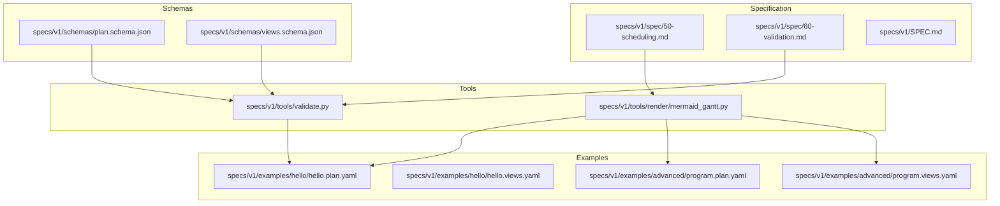
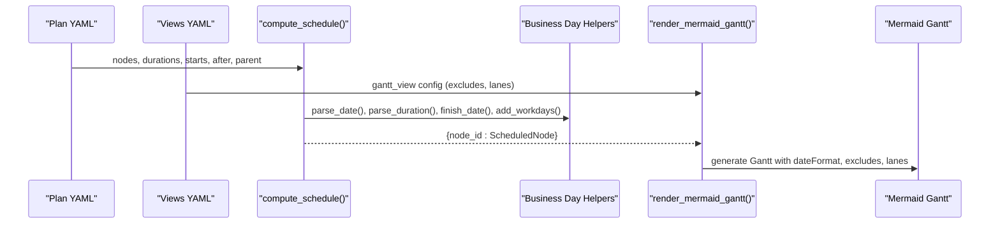
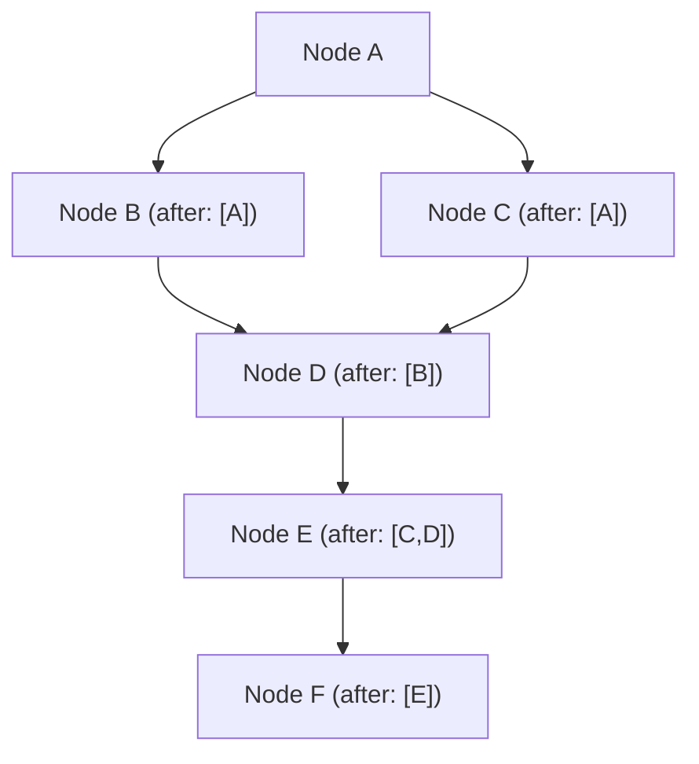
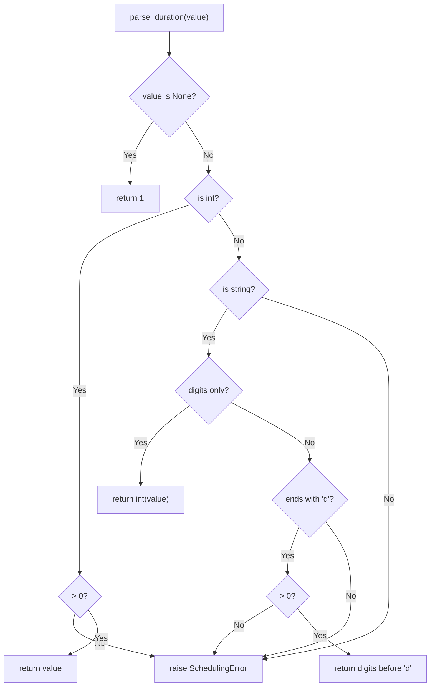
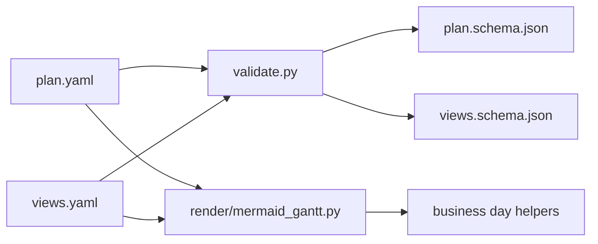

# Temporal Planning and Scheduling

<cite>
**Referenced Files in This Document**
- [SPEC.md](file://specs/v1/SPEC.md)
- [50-scheduling.md](file://specs/v1/spec/50-scheduling.md)
- [60-validation.md](file://specs/v1/spec/60-validation.md)
- [validate.py](file://specs/v1/tools/validate.py)
- [mermaid_gantt.py](file://specs/v1/tools/render/mermaid_gantt.py)
- [plan.schema.json](file://specs/v1/schemas/plan.schema.json)
- [views.schema.json](file://specs/v1/schemas/views.schema.json)
- [hello.plan.yaml](file://specs/v1/examples/hello/hello.plan.yaml)
- [hello.views.yaml](file://specs/v1/examples/hello/hello.views.yaml)
- [program.plan.yaml](file://specs/v1/examples/advanced/program.plan.yaml)
- [program.views.yaml](file://specs/v1/examples/advanced/program.views.yaml)
- [README.md (Advanced Examples)](file://specs/v1/examples/advanced/README.md)
</cite>

## Table of Contents
1. [Introduction](#introduction)
2. [Project Structure](#project-structure)
3. [Core Components](#core-components)
4. [Architecture Overview](#architecture-overview)
5. [Detailed Component Analysis](#detailed-component-analysis)
6. [Dependency Analysis](#dependency-analysis)
7. [Performance Considerations](#performance-considerations)
8. [Troubleshooting Guide](#troubleshooting-guide)
9. [Conclusion](#conclusion)
10. [Appendices](#appendices)

## Introduction
This document explains temporal planning and scheduling for operational maps in opskarta v1. It covers:
- Two scheduling approaches: explicit scheduling via start dates and durations, and implicit scheduling via dependency resolution.
- Automatic date calculation engine, including business day arithmetic and weekend exclusion logic.
- How dependencies drive schedule computation and critical path determination.
- Examples of schedule computation, date propagation through hierarchies, and conflict resolution.
- Scheduling validation rules, constraint checking, and performance considerations for large operational maps.
- Edge cases such as circular dependencies, missing dates, and schedule updates.

## Project Structure
The scheduling and rendering logic is implemented in Python tools under specs/v1/tools. The specification and examples live under specs/v1.

**Diagram sources**
- [50-scheduling.md](file://specs/v1/spec/50-scheduling.md#L1-L80)
- [60-validation.md](file://specs/v1/spec/60-validation.md#L1-L140)
- [validate.py](file://specs/v1/tools/validate.py#L135-L403)
- [mermaid_gantt.py](file://specs/v1/tools/render/mermaid_gantt.py#L217-L294)
- [plan.schema.json](file://specs/v1/schemas/plan.schema.json#L1-L86)
- [views.schema.json](file://specs/v1/schemas/views.schema.json#L1-L26)
- [hello.plan.yaml](file://specs/v1/examples/hello/hello.plan.yaml#L1-L44)
- [program.plan.yaml](file://specs/v1/examples/advanced/program.plan.yaml#L1-L326)

**Section sources**
- [SPEC.md](file://specs/v1/SPEC.md#L1-L407)
- [50-scheduling.md](file://specs/v1/spec/50-scheduling.md#L1-L80)
- [60-validation.md](file://specs/v1/spec/60-validation.md#L1-L140)

## Core Components
- Explicit scheduling: start date and duration define a task’s timeline segment.
- Implicit scheduling: start is derived from dependencies (after) and/or parent inheritance.
- Business day arithmetic: weekend exclusion and workday addition for duration calculation.
- Dependency graph validation: cycles and dangling references are detected during semantic validation.
- Rendering: Mermaid Gantt generation from computed schedules and view exclusions.

Key implementation references:
- Scheduling engine and business day helpers: [mermaid_gantt.py](file://specs/v1/tools/render/mermaid_gantt.py#L92-L207)
- Schedule computation with dependency resolution and parent inheritance: [mermaid_gantt.py](file://specs/v1/tools/render/mermaid_gantt.py#L217-L294)
- Validation of plan semantics (cycles, dangling refs, formats): [validate.py](file://specs/v1/tools/validate.py#L135-L403)
- Scheduling spec and notes: [50-scheduling.md](file://specs/v1/spec/50-scheduling.md#L1-L80), [SPEC.md](file://specs/v1/SPEC.md#L159-L239)

**Section sources**
- [mermaid_gantt.py](file://specs/v1/tools/render/mermaid_gantt.py#L92-L207)
- [mermaid_gantt.py](file://specs/v1/tools/render/mermaid_gantt.py#L217-L294)
- [validate.py](file://specs/v1/tools/validate.py#L135-L403)
- [50-scheduling.md](file://specs/v1/spec/50-scheduling.md#L1-L80)
- [SPEC.md](file://specs/v1/SPEC.md#L159-L239)

## Architecture Overview
The scheduling pipeline transforms plan nodes into scheduled segments using explicit dates, dependency resolution, and business-day arithmetic. Views configure calendar exclusions and lane selection for rendering.

**Diagram sources**
- [mermaid_gantt.py](file://specs/v1/tools/render/mermaid_gantt.py#L217-L294)
- [mermaid_gantt.py](file://specs/v1/tools/render/mermaid_gantt.py#L92-L207)
- [mermaid_gantt.py](file://specs/v1/tools/render/mermaid_gantt.py#L349-L433)

## Detailed Component Analysis

### Scheduling Engine and Business Day Arithmetic
The scheduling engine computes per-node start/finish/duration considering:
- Explicit start and duration.
- Dependencies (after) resolved transitively; start becomes latest dependency finish + 1 day (or next workday if excluding weekends).
- Parent inheritance: if no start/after, child may inherit parent start.
- Duration parsing supports integer days and “N[d|w]” format.
- Weekend exclusion toggled by view excludes.

**Diagram sources**
- [mermaid_gantt.py](file://specs/v1/tools/render/mermaid_gantt.py#L217-L294)
- [mermaid_gantt.py](file://specs/v1/tools/render/mermaid_gantt.py#L112-L207)

**Section sources**
- [mermaid_gantt.py](file://specs/v1/tools/render/mermaid_gantt.py#L217-L294)
- [mermaid_gantt.py](file://specs/v1/tools/render/mermaid_gantt.py#L92-L207)

### Dependency Resolution and Critical Path Determination
- Dependencies are modeled as a directed acyclic graph (DAG) via after lists.
- Critical path is the longest path in the DAG; it determines earliest possible completion of dependent tasks.
- The scheduler resolves each node by computing the latest finish among dependencies and advancing to the next working day when applicable.
- Cycles are prevented by validation and runtime checks.

**Diagram sources**
- [50-scheduling.md](file://specs/v1/spec/50-scheduling.md#L47-L66)
- [validate.py](file://specs/v1/tools/validate.py#L359-L403)

**Section sources**
- [50-scheduling.md](file://specs/v1/spec/50-scheduling.md#L47-L66)
- [validate.py](file://specs/v1/tools/validate.py#L359-L403)

### Automatic Date Calculation Engine
- Date parsing enforces ISO 8601 date strings.
- Duration parsing supports integers and “Nd”/“Nw” formats.
- Workday arithmetic:
  - Weekend detection uses weekday mapping.
  - Add workdays iterates calendar days, skipping weekends.
  - Finish date uses either inclusive-day semantics for 1-day duration or adds workdays minus 1.

**Diagram sources**
- [mermaid_gantt.py](file://specs/v1/tools/render/mermaid_gantt.py#L112-L152)

**Section sources**
- [mermaid_gantt.py](file://specs/v1/tools/render/mermaid_gantt.py#L92-L207)

### Schedule Computation Examples
- Example: Hello Upgrade program demonstrates explicit start and after dependencies with weekend exclusion.
- Example: Advanced Program shows cross-track dependencies and multiple lanes with holiday exclusions.

References:
- Hello plan and views: [hello.plan.yaml](file://specs/v1/examples/hello/hello.plan.yaml#L1-L44), [hello.views.yaml](file://specs/v1/examples/hello/hello.views.yaml#L1-L13)
- Advanced plan and views: [program.plan.yaml](file://specs/v1/examples/advanced/program.plan.yaml#L1-L326), [program.views.yaml](file://specs/v1/examples/advanced/program.views.yaml#L1-L93)

**Section sources**
- [hello.plan.yaml](file://specs/v1/examples/hello/hello.plan.yaml#L1-L44)
- [hello.views.yaml](file://specs/v1/examples/hello/hello.views.yaml#L1-L13)
- [program.plan.yaml](file://specs/v1/examples/advanced/program.plan.yaml#L1-L326)
- [program.views.yaml](file://specs/v1/examples/advanced/program.views.yaml#L1-L93)

### Conflict Resolution and Updates
- Conflicts arise when dependencies cannot be satisfied (e.g., cycles) or when required dates are missing.
- Resolution strategies:
  - Fix cycles in after dependencies.
  - Provide explicit start or resolve dependencies to establish a baseline.
  - Adjust durations or exclusions to meet constraints.
- Updates propagate forward: changing a dependency’s finish advances downstream nodes accordingly.

Validation ensures correctness before rendering.

**Section sources**
- [validate.py](file://specs/v1/tools/validate.py#L325-L403)
- [mermaid_gantt.py](file://specs/v1/tools/render/mermaid_gantt.py#L217-L294)

## Dependency Analysis
The scheduling and validation logic depends on:
- Plan schema for structural validation.
- Views schema for view-level constraints.
- Python YAML loader for parsing.
- Business day helpers for date arithmetic.

**Diagram sources**
- [validate.py](file://specs/v1/tools/validate.py#L135-L403)
- [mermaid_gantt.py](file://specs/v1/tools/render/mermaid_gantt.py#L217-L294)
- [plan.schema.json](file://specs/v1/schemas/plan.schema.json#L1-L86)
- [views.schema.json](file://specs/v1/schemas/views.schema.json#L1-L26)

**Section sources**
- [validate.py](file://specs/v1/tools/validate.py#L135-L403)
- [mermaid_gantt.py](file://specs/v1/tools/render/mermaid_gantt.py#L217-L294)
- [plan.schema.json](file://specs/v1/schemas/plan.schema.json#L1-L86)
- [views.schema.json](file://specs/v1/schemas/views.schema.json#L1-L26)

## Performance Considerations
- Topological resolution: The scheduler uses a recursive resolver with memoization and a visiting-state to detect cycles and avoid recomputation. Complexity is O(V + E) per node resolved, with caching reducing repeated work.
- Large maps: Prefer precomputing and caching schedules; avoid redundant passes over the graph.
- Exclusions: Weekend exclusion adds iteration per workday; keep exclusions minimal or precompute extended calendars for very large datasets.
- Rendering: Limit visible lanes and date ranges to reduce output size and improve readability.

[No sources needed since this section provides general guidance]

## Troubleshooting Guide
Common issues and resolutions:
- Circular dependencies in after lists: Detected by DFS with state tracking; fix by removing or altering edges.
- Non-existent parent or dependency references: Detected during validation; ensure all IDs exist in nodes.
- Invalid date or duration formats: Detected by format validators; correct to ISO date and “Nd”/“Nw”.
- Missing start and after: Node remains unscheduled; add explicit start or dependencies.
- Exclusions mismatch: Verify view excludes align with intended calendar behavior.

Validation messages include:
- Field path, value, expected format, and available options.

**Section sources**
- [validate.py](file://specs/v1/tools/validate.py#L135-L403)
- [60-validation.md](file://specs/v1/spec/60-validation.md#L1-L140)

## Conclusion
opskarta v1 provides a robust, extensible framework for temporal planning:
- Explicit scheduling for deterministic control.
- Implicit scheduling driven by dependencies and hierarchy.
- Business-day-aware calculations with weekend exclusion.
- Strong validation against cycles, dangling references, and format errors.
- Practical examples demonstrate cross-track dependencies, calendar exclusions, and critical path focus.

[No sources needed since this section summarizes without analyzing specific files]

## Appendices

### Scheduling Specification Highlights
- Fields: start (ISO date), duration (“Nd” or “Nw”), after (list of node IDs).
- Interaction with views: excludes (weekends and specific dates), lanes.
- Notes: If neither start nor after is present, a node is considered unscheduled.

**Section sources**
- [50-scheduling.md](file://specs/v1/spec/50-scheduling.md#L1-L80)
- [SPEC.md](file://specs/v1/SPEC.md#L159-L239)

### Example Workflows
- Hello Upgrade: Demonstrates phased work with after dependencies and weekend exclusion.
- Advanced Program: Cross-track dependencies, multiple views, and holiday exclusions.

**Section sources**
- [hello.plan.yaml](file://specs/v1/examples/hello/hello.plan.yaml#L1-L44)
- [hello.views.yaml](file://specs/v1/examples/hello/hello.views.yaml#L1-L13)
- [program.plan.yaml](file://specs/v1/examples/advanced/program.plan.yaml#L1-L326)
- [program.views.yaml](file://specs/v1/examples/advanced/program.views.yaml#L1-L93)
- [README.md (Advanced Examples)](file://specs/v1/examples/advanced/README.md#L82-L113)