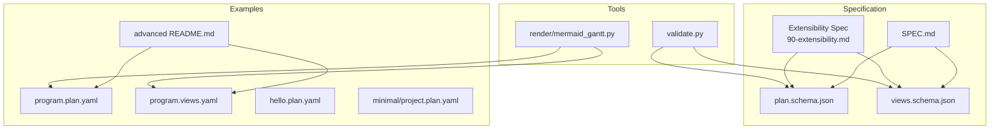
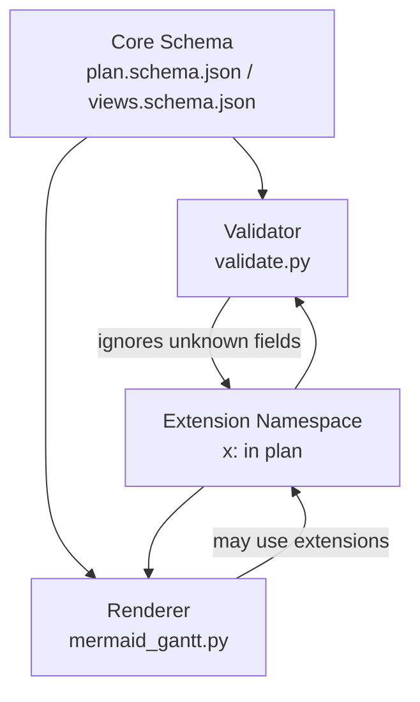
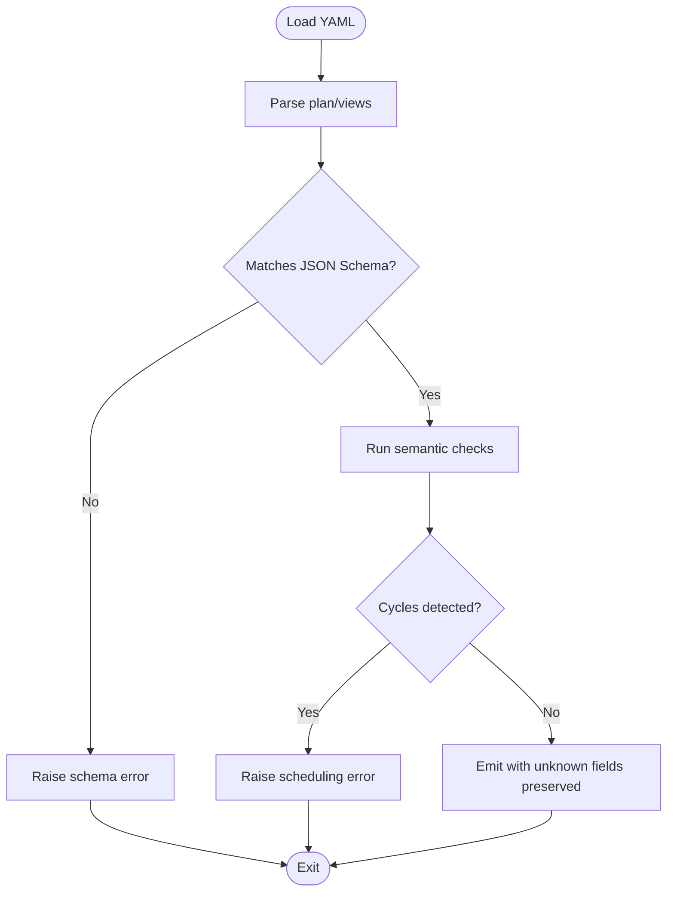
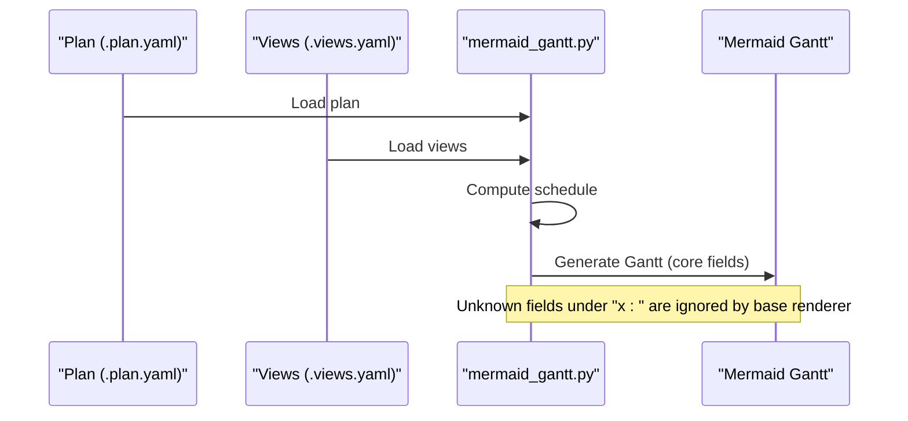
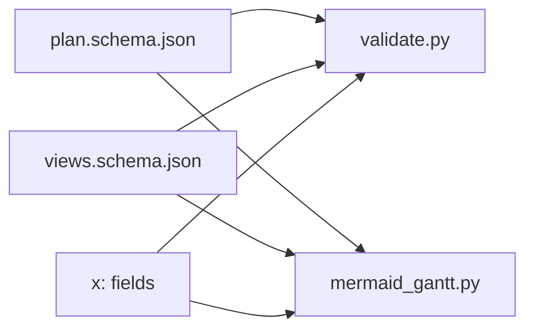

# Extensibility Mechanisms

<cite>
**Referenced Files in This Document**
- [README.md](file://README.md)
- [specs/v1/README.md](file://specs/v1/README.md)
- [specs/v1/SPEC.md](file://specs/v1/SPEC.md)
- [specs/v1/spec/90-extensibility.md](file://specs/v1/spec/90-extensibility.md)
- [specs/v1/schemas/plan.schema.json](file://specs/v1/schemas/plan.schema.json)
- [specs/v1/schemas/views.schema.json](file://specs/v1/schemas/views.schema.json)
- [specs/v1/tools/validate.py](file://specs/v1/tools/validate.py)
- [specs/v1/tools/render/mermaid_gantt.py](file://specs/v1/tools/render/mermaid_gantt.py)
- [specs/v1/examples/advanced/README.md](file://specs/v1/examples/advanced/README.md)
- [specs/v1/examples/advanced/program.plan.yaml](file://specs/v1/examples/advanced/program.plan.yaml)
- [specs/v1/examples/advanced/program.views.yaml](file://specs/v1/examples/advanced/program.views.yaml)
- [specs/v1/examples/hello/hello.plan.yaml](file://specs/v1/examples/hello/hello.plan.yaml)
- [specs/v1/examples/minimal/project.plan.yaml](file://specs/v1/examples/minimal/project.plan.yaml)
</cite>

## Table of Contents
1. [Introduction](#introduction)
2. [Project Structure](#project-structure)
3. [Core Components](#core-components)
4. [Architecture Overview](#architecture-overview)
5. [Detailed Component Analysis](#detailed-component-analysis)
6. [Dependency Analysis](#dependency-analysis)
7. [Performance Considerations](#performance-considerations)
8. [Troubleshooting Guide](#troubleshooting-guide)
9. [Conclusion](#conclusion)
10. [Appendices](#appendices)

## Introduction
This document explains opskarta’s extensibility mechanisms and how to design robust, interoperable extensions that integrate with external systems and custom requirements. It focuses on:
- The flexible extension system and the “x:” namespace for custom fields
- Extension field naming conventions and validation strategies
- Integration patterns with external systems (e.g., Jira, YouTrack, Git, CI/CD)
- Extension point architecture, plugin system possibilities, and third-party tool integration approaches
- Practical examples from the advanced examples
- Best practices for designing extensions, maintaining backward compatibility, and avoiding conflicts
- Security considerations, data validation for extensions, and performance implications
- Guidance on creating reusable extension libraries and community contribution patterns

## Project Structure
The extensibility model is defined in the specification and validated by tools. The key artifacts are:
- Plan files (`.plan.yaml`) and Views files (`.views.yaml`) define the operational map
- JSON Schemas define allowed structures and types
- Validation and rendering tools enforce rules and transform data into views

**Diagram sources**
- [specs/v1/SPEC.md](file://specs/v1/SPEC.md#L1-L407)
- [specs/v1/spec/90-extensibility.md](file://specs/v1/spec/90-extensibility.md#L1-L26)
- [specs/v1/schemas/plan.schema.json](file://specs/v1/schemas/plan.schema.json#L1-L86)
- [specs/v1/schemas/views.schema.json](file://specs/v1/schemas/views.schema.json#L1-L26)
- [specs/v1/examples/advanced/README.md](file://specs/v1/examples/advanced/README.md#L1-L172)
- [specs/v1/examples/advanced/program.plan.yaml](file://specs/v1/examples/advanced/program.plan.yaml#L1-L326)
- [specs/v1/examples/advanced/program.views.yaml](file://specs/v1/examples/advanced/program.views.yaml#L1-L93)
- [specs/v1/tools/validate.py](file://specs/v1/tools/validate.py#L1-L752)
- [specs/v1/tools/render/mermaid_gantt.py](file://specs/v1/tools/render/mermaid_gantt.py#L1-L549)

**Section sources**
- [specs/v1/README.md](file://specs/v1/README.md#L1-L27)
- [specs/v1/SPEC.md](file://specs/v1/SPEC.md#L1-L407)

## Core Components
- Extension namespace: The “x:” top-level section is reserved for user-defined data. It groups custom fields to reduce naming collisions and improve discoverability.
- Additional properties: Both plan and views schemas permit additional properties, enabling forward-compatible extension without breaking base tooling.
- Validation behavior: Unknown fields are ignored by base tools; they are preserved when parsing and emitting if they contribute to formatting or rendering.

Practical example locations:
- Advanced example demonstrates the “x:” section with team assignments, risk register, and milestones.
- Minimal and hello examples show baseline usage without extensions.

**Section sources**
- [specs/v1/spec/90-extensibility.md](file://specs/v1/spec/90-extensibility.md#L1-L26)
- [specs/v1/schemas/plan.schema.json](file://specs/v1/schemas/plan.schema.json#L32-L84)
- [specs/v1/schemas/views.schema.json](file://specs/v1/schemas/views.schema.json#L21-L25)
- [specs/v1/examples/advanced/README.md](file://specs/v1/examples/advanced/README.md#L117-L141)
- [specs/v1/examples/advanced/program.plan.yaml](file://specs/v1/examples/advanced/program.plan.yaml#L298-L326)
- [specs/v1/examples/minimal/project.plan.yaml](file://specs/v1/examples/minimal/project.plan.yaml#L1-L6)
- [specs/v1/examples/hello/hello.plan.yaml](file://specs/v1/examples/hello/hello.plan.yaml#L1-L44)

## Architecture Overview
The extensibility architecture centers on:
- A strict core schema that defines the canonical fields
- Permissive “additionalProperties” to accept custom fields
- A convention (“x:”) to group user data
- Tooling that ignores unknown fields but preserves them when emitting

**Diagram sources**
- [specs/v1/schemas/plan.schema.json](file://specs/v1/schemas/plan.schema.json#L32-L84)
- [specs/v1/schemas/views.schema.json](file://specs/v1/schemas/views.schema.json#L21-L25)
- [specs/v1/spec/90-extensibility.md](file://specs/v1/spec/90-extensibility.md#L1-L26)
- [specs/v1/tools/validate.py](file://specs/v1/tools/validate.py#L135-L329)
- [specs/v1/tools/render/mermaid_gantt.py](file://specs/v1/tools/render/mermaid_gantt.py#L349-L433)

## Detailed Component Analysis

### Extension Namespace and Field Naming Conventions
- Top-level grouping: Place user-defined fields under a dedicated “x:” section at the root of the plan. This reduces conflicts when multiple teams extend the format independently.
- Node-level grouping: You can also nest custom fields inside individual nodes under “x:” to keep data close to the work item.
- Backward compatibility: Base tools ignore unknown fields; they are preserved during parse → emit cycles if they influence formatting.

Practical example:
- Advanced example shows “x:” containing team assignments, risk register, and milestones.

**Section sources**
- [specs/v1/spec/90-extensibility.md](file://specs/v1/spec/90-extensibility.md#L12-L26)
- [specs/v1/examples/advanced/README.md](file://specs/v1/examples/advanced/README.md#L117-L141)
- [specs/v1/examples/advanced/program.plan.yaml](file://specs/v1/examples/advanced/program.plan.yaml#L298-L326)

### Validation Strategies for Extensions
- JSON Schema permits additional properties at multiple levels, so custom fields are allowed by schema.
- Semantic validation (implemented in the validator) checks core correctness (e.g., node references, scheduling rules). Unknown fields are not validated semantically; they are simply ignored.
- If you require stricter validation for extensions, implement custom validators or augment the existing validator with extension-aware checks.

**Diagram sources**
- [specs/v1/tools/validate.py](file://specs/v1/tools/validate.py#L135-L329)
- [specs/v1/schemas/plan.schema.json](file://specs/v1/schemas/plan.schema.json#L32-L84)
- [specs/v1/schemas/views.schema.json](file://specs/v1/schemas/views.schema.json#L21-L25)

**Section sources**
- [specs/v1/tools/validate.py](file://specs/v1/tools/validate.py#L135-L329)
- [specs/v1/schemas/plan.schema.json](file://specs/v1/schemas/plan.schema.json#L32-L84)
- [specs/v1/schemas/views.schema.json](file://specs/v1/schemas/views.schema.json#L21-L25)

### Rendering Pipeline and Extension Consumption
- The renderer computes schedules and generates Mermaid Gantt output from plan and views.
- The renderer reads core fields (e.g., node titles, statuses, scheduling) and ignores unknown fields.
- If extensions are needed for rendering (e.g., extra metadata for tooltips or lanes), implement a custom renderer that reads the “x:” section and augments the output.

**Diagram sources**
- [specs/v1/tools/render/mermaid_gantt.py](file://specs/v1/tools/render/mermaid_gantt.py#L349-L433)
- [specs/v1/examples/advanced/program.views.yaml](file://specs/v1/examples/advanced/program.views.yaml#L1-L93)
- [specs/v1/examples/advanced/program.plan.yaml](file://specs/v1/examples/advanced/program.plan.yaml#L1-L326)

**Section sources**
- [specs/v1/tools/render/mermaid_gantt.py](file://specs/v1/tools/render/mermaid_gantt.py#L349-L433)

### Integration Patterns with External Systems
- Jira/YouTrack: Use the “issue” field to link tasks to external tickets. For richer integrations, store additional metadata under “x:” (e.g., assignees, labels, risk indicators) and consume it in custom tooling or CI/CD steps.
- Git: Store commit SHAs or branch names under “x:” for traceability. Use CI/CD to validate that these references are present and consistent.
- CI/CD: Extend the validation pipeline to check required “x:” fields for automated gates (e.g., risk approvals, security tags).

Example locations:
- “issue” field is part of the core schema for linking to external systems.
- Advanced example shows how to store cross-track metadata under “x:” for downstream consumption.

**Section sources**
- [specs/v1/schemas/plan.schema.json](file://specs/v1/schemas/plan.schema.json#L73-L75)
- [specs/v1/examples/advanced/README.md](file://specs/v1/examples/advanced/README.md#L117-L141)
- [specs/v1/examples/advanced/program.plan.yaml](file://specs/v1/examples/advanced/program.plan.yaml#L298-L326)

### Extension Point Architecture and Plugin System Possibilities
- Extension points:
  - Plan-level “x:” for global metadata (e.g., risk register, milestones)
  - Node-level “x:” for per-task metadata (e.g., owners, tags)
- Plugin system:
  - Base tools ignore unknown fields; custom plugins can read and act on “x:” entries.
  - Implement a plugin interface that accepts the parsed plan and views, then emits additional artifacts (e.g., reports, dashboards, CI triggers).
- Third-party tool integration:
  - Provide a documented “x:” contract for your team or community.
  - Build adapters that translate “x:” fields into external system attributes.

**Section sources**
- [specs/v1/spec/90-extensibility.md](file://specs/v1/spec/90-extensibility.md#L1-L26)
- [specs/v1/schemas/plan.schema.json](file://specs/v1/schemas/plan.schema.json#L32-L84)
- [specs/v1/schemas/views.schema.json](file://specs/v1/schemas/views.schema.json#L21-L25)

### Practical Examples from Advanced Examples
- Team assignments: “x.team_assignments” organizes contributors by track.
- Risk register: “x.risk_register” stores risk IDs, descriptions, probabilities, impacts, and mitigations.
- Milestones: “x.milestones” lists significant dates and associated nodes.

These demonstrate how to:
- Group related metadata under “x:”
- Keep the data close to the plan for easy validation and rendering
- Enable downstream consumers (custom renderers, dashboards, CI) to interpret and act on the data

**Section sources**
- [specs/v1/examples/advanced/README.md](file://specs/v1/examples/advanced/README.md#L117-L141)
- [specs/v1/examples/advanced/program.plan.yaml](file://specs/v1/examples/advanced/program.plan.yaml#L298-L326)

## Dependency Analysis
The extensibility relies on:
- JSON Schema allowing additional properties
- Validator ignoring unknown fields while preserving them
- Renderer focusing on core fields and ignoring unknown fields

**Diagram sources**
- [specs/v1/schemas/plan.schema.json](file://specs/v1/schemas/plan.schema.json#L32-L84)
- [specs/v1/schemas/views.schema.json](file://specs/v1/schemas/views.schema.json#L21-L25)
- [specs/v1/tools/validate.py](file://specs/v1/tools/validate.py#L135-L329)
- [specs/v1/tools/render/mermaid_gantt.py](file://specs/v1/tools/render/mermaid_gantt.py#L349-L433)

**Section sources**
- [specs/v1/schemas/plan.schema.json](file://specs/v1/schemas/plan.schema.json#L32-L84)
- [specs/v1/schemas/views.schema.json](file://specs/v1/schemas/views.schema.json#L21-L25)
- [specs/v1/tools/validate.py](file://specs/v1/tools/validate.py#L135-L329)
- [specs/v1/tools/render/mermaid_gantt.py](file://specs/v1/tools/render/mermaid_gantt.py#L349-L433)

## Performance Considerations
- Unknown fields are ignored by base tools; they do not affect scheduling or rendering performance.
- If you implement custom renderers or plugins that process “x:” fields, ensure:
  - Lazy loading of extension data
  - Efficient caching for repeated access
  - Minimal overhead in hot paths (e.g., schedule computation)
- Large “x:” structures (e.g., risk registers) should be validated early to avoid expensive downstream processing.

[No sources needed since this section provides general guidance]

## Troubleshooting Guide
Common issues and resolutions:
- Unknown fields cause errors: They are intentionally ignored by base tools. If you expect them to be validated, implement custom checks or adjust your tooling.
- Extension data missing in output: Base renderer ignores unknown fields. Use a custom renderer or plugin to incorporate “x:” data into the output.
- Conflicts in naming: Use the “x:” namespace to group fields and avoid collisions across teams.

**Section sources**
- [specs/v1/tools/validate.py](file://specs/v1/tools/validate.py#L135-L329)
- [specs/v1/tools/render/mermaid_gantt.py](file://specs/v1/tools/render/mermaid_gantt.py#L349-L433)
- [specs/v1/spec/90-extensibility.md](file://specs/v1/spec/90-extensibility.md#L12-L26)

## Conclusion
opskarta’s extensibility model enables safe, forward-compatible customization through:
- A strict core schema with permissive additional properties
- A convention (“x:”) to group user-defined fields
- Tooling that ignores unknown fields while preserving them
This foundation supports robust integrations with external systems, plugin architectures, and community-driven extension libraries.

[No sources needed since this section summarizes without analyzing specific files]

## Appendices

### Best Practices for Designing Extensions
- Use the “x:” namespace to group fields and reduce naming conflicts
- Define clear contracts for “x:” fields to ensure interoperability
- Keep extension data close to the data it describes (node-level “x:” for per-task metadata)
- Validate extension fields early in your pipeline to fail fast
- Avoid heavy processing of “x:” fields in performance-critical paths

**Section sources**
- [specs/v1/spec/90-extensibility.md](file://specs/v1/spec/90-extensibility.md#L12-L26)

### Maintaining Backward Compatibility
- Treat “x:” fields as opt-in; base tools must ignore them
- Do not rely on “x:” fields for core functionality
- When evolving extension contracts, introduce new keys rather than changing existing ones

**Section sources**
- [specs/v1/spec/90-extensibility.md](file://specs/v1/spec/90-extensibility.md#L8-L11)

### Security Considerations
- Treat “x:” fields as untrusted input; sanitize and validate when consumed by custom tools
- Avoid embedding secrets directly in plan files; use secure secret management
- Restrict write permissions to plan files and ensure audit trails

[No sources needed since this section provides general guidance]

### Creating Reusable Extension Libraries
- Package shared “x:” schemas and validators as libraries
- Encourage community contributions with clear documentation and examples
- Provide adapters for popular tools (e.g., Jira, Git, CI/CD)

**Section sources**
- [specs/v1/examples/advanced/README.md](file://specs/v1/examples/advanced/README.md#L1-L172)