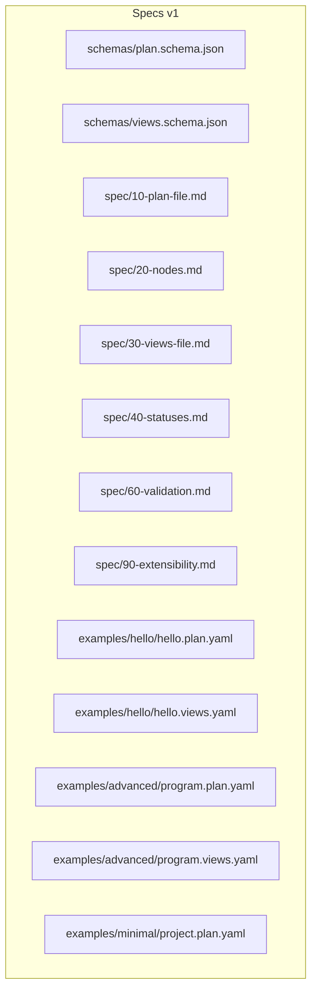

# File Formats

<cite>
**Referenced Files in This Document**
- [plan.schema.json](file://specs/v1/schemas/plan.schema.json)
- [views.schema.json](file://specs/v1/schemas/views.schema.json)
- [10-plan-file.md](file://specs/v1/spec/10-plan-file.md)
- [20-nodes.md](file://specs/v1/spec/20-nodes.md)
- [30-views-file.md](file://specs/v1/spec/30-views-file.md)
- [40-statuses.md](file://specs/v1/spec/40-statuses.md)
- [60-validation.md](file://specs/v1/spec/60-validation.md)
- [90-extensibility.md](file://specs/v1/spec/90-extensibility.md)
- [SPEC.md](file://specs/v1/SPEC.md)
- [hello.plan.yaml](file://specs/v1/examples/hello/hello.plan.yaml)
- [hello.views.yaml](file://specs/v1/examples/hello/hello.views.yaml)
- [program.plan.yaml](file://specs/v1/examples/advanced/program.plan.yaml)
- [program.views.yaml](file://specs/v1/examples/advanced/program.views.yaml)
- [project.plan.yaml](file://specs/v1/examples/minimal/project.plan.yaml)
</cite>

## Table of Contents
1. [Introduction](#introduction)
2. [Project Structure](#project-structure)
3. [Core Components](#core-components)
4. [Architecture Overview](#architecture-overview)
5. [Detailed Component Analysis](#detailed-component-analysis)
6. [Dependency Analysis](#dependency-analysis)
7. [Performance Considerations](#performance-considerations)
8. [Troubleshooting Guide](#troubleshooting-guide)
9. [Conclusion](#conclusion)
10. [Appendices](#appendices)

## Introduction
This document describes the opskarta v1 file formats that define operational maps:
- Plan files (*.plan.yaml): describe the work items, hierarchy, scheduling, statuses, and metadata.
- Views files (*.views.yaml): define how to present the plan (e.g., Gantt views) and organize lanes for visualization.

It explains the complete structure of both file types, their interplay, JSON Schema definitions, validation rules, recommended practices, and examples from the repository’s hello and advanced samples.

## Project Structure
The opskarta v1 specification organizes documentation and examples under specs/v1:
- schemas: JSON Schema definitions for plan and views files.
- spec: Markdown documents detailing each aspect of the format.
- examples: Minimal, hello, and advanced examples demonstrating usage.

**Diagram sources**
- [plan.schema.json](file://specs/v1/schemas/plan.schema.json#L1-L86)
- [views.schema.json](file://specs/v1/schemas/views.schema.json#L1-L26)
- [10-plan-file.md](file://specs/v1/spec/10-plan-file.md#L1-L30)
- [20-nodes.md](file://specs/v1/spec/20-nodes.md#L1-L37)
- [30-views-file.md](file://specs/v1/spec/30-views-file.md#L1-L34)
- [40-statuses.md](file://specs/v1/spec/40-statuses.md#L1-L23)
- [60-validation.md](file://specs/v1/spec/60-validation.md#L1-L140)
- [90-extensibility.md](file://specs/v1/spec/90-extensibility.md#L1-L26)
- [hello.plan.yaml](file://specs/v1/examples/hello/hello.plan.yaml#L1-L44)
- [hello.views.yaml](file://specs/v1/examples/hello/hello.views.yaml#L1-L13)
- [program.plan.yaml](file://specs/v1/examples/advanced/program.plan.yaml#L1-L326)
- [program.views.yaml](file://specs/v1/examples/advanced/program.views.yaml#L1-L93)
- [project.plan.yaml](file://specs/v1/examples/minimal/project.plan.yaml#L1-L6)

**Section sources**
- [SPEC.md](file://specs/v1/SPEC.md#L1-L407)

## Core Components
- Plan file (*.plan.yaml)
  - Root fields: version, meta, statuses, nodes.
  - Meta: id and title; id binds to views via project.
  - Statuses: arbitrary map of status keys to objects with label and color.
  - Nodes: map of node_id to node objects; each node requires title and supports kind, status, parent, after, start, duration, issue, notes.
- Views file (*.views.yaml)
  - Root fields: version, project, gantt_views.
  - project must match plan.meta.id.
  - gantt_views: named views with title, calendar excludes, and lanes.
  - lanes: per-view grouping of node_ids for visualization.

**Section sources**
- [10-plan-file.md](file://specs/v1/spec/10-plan-file.md#L1-L30)
- [20-nodes.md](file://specs/v1/spec/20-nodes.md#L1-L37)
- [30-views-file.md](file://specs/v1/spec/30-views-file.md#L1-L34)
- [40-statuses.md](file://specs/v1/spec/40-statuses.md#L1-L23)
- [60-validation.md](file://specs/v1/spec/60-validation.md#L1-L140)
- [SPEC.md](file://specs/v1/SPEC.md#L27-L56)

## Architecture Overview
Plan and views files work together to define an operational map:
- Plan defines the work model (metadata, statuses, hierarchical nodes, scheduling).
- Views define presentation layers (Gantt views, lanes) over the plan.
- Validation ensures referential integrity across files and within each file.

**Diagram sources**
- [plan.schema.json](file://specs/v1/schemas/plan.schema.json#L1-L86)
- [views.schema.json](file://specs/v1/schemas/views.schema.json#L1-L26)
- [60-validation.md](file://specs/v1/spec/60-validation.md#L82-L100)

## Detailed Component Analysis

### Plan File (*.plan.yaml)
Structure and semantics:
- version: integer ≥ 1.
- meta: object with id and title; both required.
- statuses: object; recommended keys include not_started, in_progress, done, blocked; each status object has label and color.
- nodes: object of node_id → node; each node requires title; recommended fields include kind, status, parent, after, start (YYYY-MM-DD), duration (<digits>d or <digits>w), issue, notes.

Optional and extension fields:
- additionalProperties allowed at top level and within meta, statuses, and nodes.
- Custom extensions can be added; see extensibility guidance.

Relationship to views:
- plan.meta.id is matched by views.project.

Practical examples:
- hello.plan.yaml demonstrates a small plan with statuses, nodes hierarchy, and scheduling.
- program.plan.yaml demonstrates a large, multi-track plan with extensive hierarchy and custom extensions under x.

Common pitfalls and fixes:
- Missing title in a node.
- Non-existing parent or after references.
- Non-existing status key.
- Incorrect date or duration formats.

**Diagram sources**
- [plan.schema.json](file://specs/v1/schemas/plan.schema.json#L6-L15)
- [plan.schema.json](file://specs/v1/schemas/plan.schema.json#L16-L33)
- [plan.schema.json](file://specs/v1/schemas/plan.schema.json#L38-L82)
- [20-nodes.md](file://specs/v1/spec/20-nodes.md#L5-L37)
- [60-validation.md](file://specs/v1/spec/60-validation.md#L7-L11)

**Section sources**
- [plan.schema.json](file://specs/v1/schemas/plan.schema.json#L1-L86)
- [10-plan-file.md](file://specs/v1/spec/10-plan-file.md#L3-L10)
- [20-nodes.md](file://specs/v1/spec/20-nodes.md#L5-L37)
- [40-statuses.md](file://specs/v1/spec/40-statuses.md#L12-L16)
- [60-validation.md](file://specs/v1/spec/60-validation.md#L5-L11)
- [SPEC.md](file://specs/v1/SPEC.md#L27-L56)

### Views File (*.views.yaml)
Structure and semantics:
- version: integer ≥ 1.
- project: string matching plan.meta.id.
- gantt_views: object of view_id → view; each view has title, excludes (list of calendar exclusions), and lanes.
- lanes: object of lane_id → lane; each lane has title and nodes (list of node_ids).

Multi-view support:
- Multiple named views can be defined (e.g., overview, backend-detail, frontend-detail, infrastructure-detail, critical-path).

Practical examples:
- hello.views.yaml shows a single overview view with lanes.
- program.views.yaml shows multiple views across tracks and a critical path view.

Validation rules:
- project must equal plan.meta.id.
- All node_ids in lanes must exist in the plan’s nodes.

**Diagram sources**
- [views.schema.json](file://specs/v1/schemas/views.schema.json#L6-L24)
- [30-views-file.md](file://specs/v1/spec/30-views-file.md#L11-L18)
- [60-validation.md](file://specs/v1/spec/60-validation.md#L82-L100)

**Section sources**
- [views.schema.json](file://specs/v1/schemas/views.schema.json#L1-L26)
- [30-views-file.md](file://specs/v1/spec/30-views-file.md#L5-L18)
- [60-validation.md](file://specs/v1/spec/60-validation.md#L82-L100)
- [SPEC.md](file://specs/v1/SPEC.md#L98-L131)

### JSON Schema Definitions

#### Plan Schema
- Top-level required: version, meta, nodes.
- meta.required: id, title.
- nodes: additionalProperties allowed; each node requires title; supports kind, status, parent, after (array of strings), start (date), duration (string or integer), issue, notes.
- Additional top-level properties allowed.

**Section sources**
- [plan.schema.json](file://specs/v1/schemas/plan.schema.json#L1-L86)

#### Views Schema
- Top-level required: version, project.
- gantt_views: object with additionalProperties allowed.
- Additional top-level properties allowed.

**Section sources**
- [views.schema.json](file://specs/v1/schemas/views.schema.json#L1-L26)

### Practical Examples

#### Hello Example
- Plan: minimal statuses, a root summary node, and child nodes with scheduling and notes.
- Views: single overview view with lanes and excluded weekends.

**Section sources**
- [hello.plan.yaml](file://specs/v1/examples/hello/hello.plan.yaml#L1-L44)
- [hello.views.yaml](file://specs/v1/examples/hello/hello.views.yaml#L1-L13)

#### Advanced Example
- Plan: multi-track program with backend, frontend, infrastructure, and cross-track dependencies; includes custom extensions under x.
- Views: multiple views (overview, track-specific details, critical path) with excluded dates and lanes.

**Section sources**
- [program.plan.yaml](file://specs/v1/examples/advanced/program.plan.yaml#L1-L326)
- [program.views.yaml](file://specs/v1/examples/advanced/program.views.yaml#L1-L93)

#### Minimal Example
- Plan: minimal viable plan with version and a single root node.

**Section sources**
- [project.plan.yaml](file://specs/v1/examples/minimal/project.plan.yaml#L1-L6)

## Dependency Analysis
- Referential integrity:
  - nodes.parent must reference an existing node_id.
  - nodes.after entries must reference existing node_ids.
  - nodes.status must reference a key in statuses.
  - views.project must equal plan.meta.id.
  - views.lanes[].nodes[] entries must reference existing node_ids.

**Diagram sources**
- [60-validation.md](file://specs/v1/spec/60-validation.md#L13-L75)
- [60-validation.md](file://specs/v1/spec/60-validation.md#L89-L100)
- [60-validation.md](file://specs/v1/spec/60-validation.md#L102-L104)

**Section sources**
- [60-validation.md](file://specs/v1/spec/60-validation.md#L13-L75)
- [60-validation.md](file://specs/v1/spec/60-validation.md#L89-L104)

## Performance Considerations
- Keep nodes flat or reasonably deep to simplify rendering and dependency resolution.
- Prefer explicit after dependencies for complex schedules to avoid ambiguous start calculations.
- Limit excessive custom extensions to reduce parsing overhead in downstream tools.

## Troubleshooting Guide
Common formatting errors and resolutions:
- Missing required fields:
  - Ensure plan.version, plan.meta.id/title, plan.nodes, and plan.nodes.*.title are present.
  - Ensure views.version, views.project, and views.gantt_views are present.
- Reference errors:
  - parent must exist in nodes.
  - after entries must exist in nodes.
  - status must be a key in statuses.
  - project must equal plan.meta.id.
  - lanes nodes must exist in nodes.
- Format errors:
  - start must be YYYY-MM-DD.
  - duration must be <digits>d or <digits>w.
- Validation messages:
  - Use clear error paths (e.g., nodes.task2.parent) and expected values.

**Section sources**
- [60-validation.md](file://specs/v1/spec/60-validation.md#L7-L11)
- [60-validation.md](file://specs/v1/spec/60-validation.md#L13-L75)
- [60-validation.md](file://specs/v1/spec/60-validation.md#L77-L81)
- [60-validation.md](file://specs/v1/spec/60-validation.md#L82-L100)
- [60-validation.md](file://specs/v1/spec/60-validation.md#L124-L139)

## Conclusion
The opskarta v1 file formats provide a compact, extensible foundation for operational maps:
- Plan files capture metadata, statuses, hierarchical nodes, and scheduling.
- Views files enable multiple presentations (e.g., Gantt) over the same plan.
- Strict validation rules ensure consistency across files and within each file.
- Extensibility allows teams to tailor the format to their needs while preserving compatibility.

## Appendices

### Best Practices
- Use meaningful node_id values and consistent naming conventions.
- Keep statuses aligned across related plans and views.
- Prefer explicit after dependencies for complex schedules.
- Group custom extensions under a dedicated namespace (e.g., x:) to avoid conflicts.
- Version both plan and views consistently and keep project identifiers synchronized.

### File Organization and Naming Conventions
- Plan files: *.plan.yaml
- Views files: *.views.yaml
- Place both files alongside the work items they describe; group by project or program.

### Version Control Integration
- Treat plan and views files as configuration; commit alongside source and documentation.
- Use pull requests to review changes to scheduling, dependencies, and statuses.
- Consider separate branches for major re-baselines or multi-program plans.

**Section sources**
- [90-extensibility.md](file://specs/v1/spec/90-extensibility.md#L12-L26)
- [SPEC.md](file://specs/v1/SPEC.md#L17-L23)