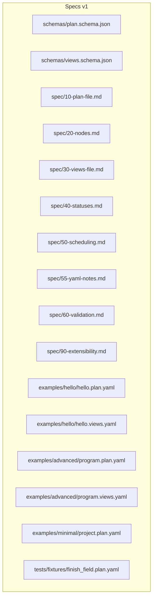
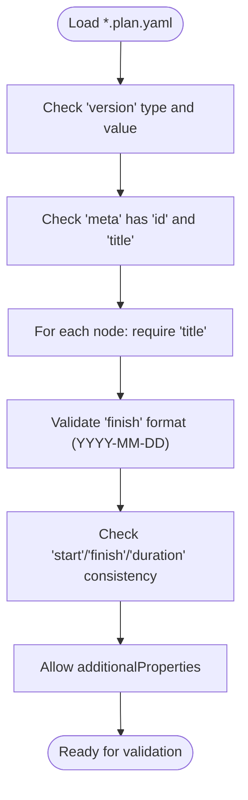
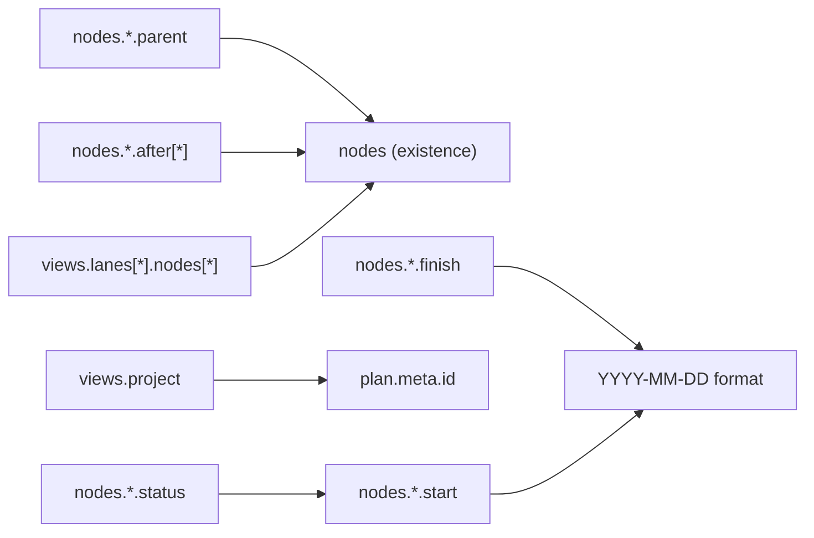

# File Formats

<cite>
**Referenced Files in This Document**
- [plan.schema.json](file://specs/v1/schemas/plan.schema.json)
- [views.schema.json](file://specs/v1/schemas/views.schema.json)
- [10-plan-file.md](file://specs/v1/spec/10-plan-file.md)
- [20-nodes.md](file://specs/v1/spec/20-nodes.md)
- [30-views-file.md](file://specs/v1/spec/30-views-file.md)
- [40-statuses.md](file://specs/v1/spec/40-statuses.md)
- [50-scheduling.md](file://specs/v1/spec/50-scheduling.md)
- [55-yaml-notes.md](file://specs/v1/spec/55-yaml-notes.md)
- [60-validation.md](file://specs/v1/spec/60-validation.md)
- [90-extensibility.md](file://specs/v1/spec/90-extensibility.md)
- [SPEC.md](file://specs/v1/SPEC.md)
- [hello.plan.yaml](file://specs/v1/examples/hello/hello.plan.yaml)
- [hello.views.yaml](file://specs/v1/examples/hello/hello.views.yaml)
- [program.plan.yaml](file://specs/v1/examples/advanced/program.plan.yaml)
- [program.views.yaml](file://specs/v1/examples/advanced/program.views.yaml)
- [project.plan.yaml](file://specs/v1/examples/minimal/project.plan.yaml)
- [finish_field.plan.yaml](file://specs/v1/tests/fixtures/finish_field.plan.yaml)
</cite>

## Update Summary
**Changes Made**
- Added comprehensive documentation for the new finish field requirement and validation rules
- Enhanced scheduling documentation with detailed finish field behavior and backward planning algorithms
- Updated validation rules to include finish field format validation and consistency checks
- Added practical examples demonstrating finish field usage in backward scheduling scenarios
- Updated YAML encoding guidelines to include finish field formatting recommendations

## Table of Contents
1. [Introduction](#introduction)
2. [Project Structure](#project-structure)
3. [Core Components](#core-components)
4. [Architecture Overview](#architecture-overview)
5. [Detailed Component Analysis](#detailed-component-analysis)
6. [Finish Field Specification](#finish-field-specification)
7. [YAML Encoding Guidelines](#yaml-encoding-guidelines)
8. [Enhanced Validation System](#enhanced-validation-system)
9. [Dependency Analysis](#dependency-analysis)
10. [Performance Considerations](#performance-considerations)
11. [Troubleshooting Guide](#troubleshooting-guide)
12. [Conclusion](#conclusion)
13. [Appendices](#appendices)

## Introduction
This document describes the opskarta v1 file formats that define operational maps:
- Plan files (*.plan.yaml): describe the work items, hierarchy, scheduling, statuses, and metadata.
- Views files (*.views.yaml): define how to present the plan (e.g., Gantt views) and organize lanes for visualization.

It explains the complete structure of both file types, their interplay, JSON Schema definitions, validation rules, recommended practices, and examples from the repository's hello and advanced samples. The documentation now includes comprehensive YAML encoding guidelines, enhanced validation system details, and detailed coverage of the new finish field specification.

## Project Structure
The opskarta v1 specification organizes documentation and examples under specs/v1:
- schemas: JSON Schema definitions for plan and views files.
- spec: Markdown documents detailing each aspect of the format, including new YAML encoding guidelines and finish field documentation.
- examples: Minimal, hello, and advanced examples demonstrating usage.
- tests: Fixtures and test cases validating finish field functionality.



**Diagram sources**
- [plan.schema.json](file://specs/v1/schemas/plan.schema.json#L1-L95)
- [views.schema.json](file://specs/v1/schemas/views.schema.json#L1-L78)
- [10-plan-file.md](file://specs/v1/spec/10-plan-file.md#L1-L30)
- [20-nodes.md](file://specs/v1/spec/20-nodes.md#L1-L37)
- [30-views-file.md](file://specs/v1/spec/30-views-file.md#L1-L34)
- [40-statuses.md](file://specs/v1/spec/40-statuses.md#L1-L23)
- [50-scheduling.md](file://specs/v1/spec/50-scheduling.md#L1-L474)
- [55-yaml-notes.md](file://specs/v1/spec/55-yaml-notes.md#L1-L137)
- [60-validation.md](file://specs/v1/spec/60-validation.md#L1-L377)
- [90-extensibility.md](file://specs/v1/spec/90-extensibility.md#L1-L26)
- [hello.plan.yaml](file://specs/v1/examples/hello/hello.plan.yaml#L1-L44)
- [hello.views.yaml](file://specs/v1/examples/hello/hello.views.yaml#L1-L13)
- [program.plan.yaml](file://specs/v1/examples/advanced/program.plan.yaml#L1-L331)
- [program.views.yaml](file://specs/v1/examples/advanced/program.views.yaml#L1-L93)
- [project.plan.yaml](file://specs/v1/examples/minimal/project.plan.yaml#L1-L6)
- [finish_field.plan.yaml](file://specs/v1/tests/fixtures/finish_field.plan.yaml#L1-L30)

**Section sources**
- [SPEC.md](file://specs/v1/SPEC.md#L1-L407)

## Core Components
- Plan file (*.plan.yaml)
  - Root fields: version, meta, statuses, nodes.
  - Meta: id and title; id binds to views via project.
  - Statuses: arbitrary map of status keys to objects with label and color.
  - Nodes: map of node_id to node objects; each node requires title and supports kind, status, parent, after, start, finish, duration, issue, notes.
- Views file (*.views.yaml)
  - Root fields: version, project, gantt_views.
  - project must match plan.meta.id.
  - gantt_views: named views with title, calendar excludes, and lanes.
  - lanes: per-view grouping of node_ids for visualization.

**Section sources**
- [10-plan-file.md](file://specs/v1/spec/10-plan-file.md#L1-L30)
- [20-nodes.md](file://specs/v1/spec/20-nodes.md#L1-L37)
- [30-views-file.md](file://specs/v1/spec/30-views-file.md#L1-L34)
- [40-statuses.md](file://specs/v1/spec/40-statuses.md#L1-L23)
- [60-validation.md](file://specs/v1/spec/60-validation.md#L1-L140)
- [SPEC.md](file://specs/v1/SPEC.md#L27-L56)

## Architecture Overview
Plan and views files work together to define an operational map:
- Plan defines the work model (metadata, statuses, hierarchical nodes, scheduling).
- Views define presentation layers (Gantt views, lanes) over the plan.
- Validation ensures referential integrity across files and within each file.


**Diagram sources**
- [plan.schema.json](file://specs/v1/schemas/plan.schema.json#L1-L95)
- [views.schema.json](file://specs/v1/schemas/views.schema.json#L1-L78)
- [60-validation.md](file://specs/v1/spec/60-validation.md#L82-L100)

## Detailed Component Analysis

### Plan File (*.plan.yaml)
Structure and semantics:
- version: integer ≥ 1.
- meta: object with id and title; both required.
- statuses: object; recommended keys include not_started, in_progress, done, blocked; each status object has label and color.
- nodes: object of node_id → node; each node requires title; recommended fields include kind, status, parent, after, start (YYYY-MM-DD), finish (YYYY-MM-DD), duration (<digits>d or <digits>w), issue, notes.

**Updated** Enhanced node specification to include the new finish field alongside existing scheduling fields.

Optional and extension fields:
- additionalProperties allowed at top level and within meta, statuses, and nodes.
- Custom extensions can be added; see extensibility guidance.

Relationship to views:
- plan.meta.id is matched by views.project.

Practical examples:
- hello.plan.yaml demonstrates a small plan with statuses, nodes hierarchy, and scheduling.
- program.plan.yaml demonstrates a large, multi-track plan with extensive hierarchy and custom extensions under x.

Common pitfalls and fixes:
- Missing title in a node.
- Non-existing parent or after references.
- Non-existing status key.
- Incorrect date or duration formats.
- **Updated** Finish field format validation and consistency checking.



**Diagram sources**
- [plan.schema.json](file://specs/v1/schemas/plan.schema.json#L6-L15)
- [plan.schema.json](file://specs/v1/schemas/plan.schema.json#L16-L33)
- [plan.schema.json](file://specs/v1/schemas/plan.schema.json#L38-L95)
- [20-nodes.md](file://specs/v1/spec/20-nodes.md#L5-L37)
- [60-validation.md](file://specs/v1/spec/60-validation.md#L7-L11)

**Section sources**
- [plan.schema.json](file://specs/v1/schemas/plan.schema.json#L1-L95)
- [10-plan-file.md](file://specs/v1/spec/10-plan-file.md#L3-L10)
- [20-nodes.md](file://specs/v1/spec/20-nodes.md#L5-L37)
- [40-statuses.md](file://specs/v1/spec/40-statuses.md#L12-L16)
- [60-validation.md](file://specs/v1/spec/60-validation.md#L5-L11)
- [SPEC.md](file://specs/v1/SPEC.md#L27-L56)

### Views File (*.views.yaml)
Structure and semantics:
- version: integer ≥ 1.
- project: string matching plan.meta.id.
- gantt_views: object of view_id → view; each view has title, excludes (list of calendar exclusions), and lanes.
- lanes: object of lane_id → lane; each lane has title and nodes (list of node_ids).

Multi-view support:
- Multiple named views can be defined (e.g., overview, backend-detail, frontend-detail, infrastructure-detail, critical-path).

Practical examples:
- hello.views.yaml shows a single overview view with lanes.
- program.views.yaml shows multiple views across tracks and a critical path view.

Validation rules:
- project must equal plan.meta.id.
- All node_ids in lanes must exist in the plan's nodes.


**Diagram sources**
- [views.schema.json](file://specs/v1/schemas/views.schema.json#L6-L24)
- [30-views-file.md](file://specs/v1/spec/30-views-file.md#L11-L18)
- [60-validation.md](file://specs/v1/spec/60-validation.md#L82-L100)

**Section sources**
- [views.schema.json](file://specs/v1/schemas/views.schema.json#L1-L78)
- [30-views-file.md](file://specs/v1/spec/30-views-file.md#L5-L18)
- [60-validation.md](file://specs/v1/spec/60-validation.md#L82-L100)
- [SPEC.md](file://specs/v1/SPEC.md#L98-L131)

### JSON Schema Definitions

#### Plan Schema
- Top-level required: version, meta, nodes.
- meta.required: id, title.
- nodes: additionalProperties allowed; each node requires title; supports kind, status, parent, after (array of strings), start (date), finish (date), duration (string or integer), issue, notes.
- Additional top-level properties allowed.

**Updated** Added finish field to the schema with the same format requirements as start (YYYY-MM-DD).

**Section sources**
- [plan.schema.json](file://specs/v1/schemas/plan.schema.json#L1-L95)

#### Views Schema
- Top-level required: version, project.
- gantt_views: object with additionalProperties allowed.
- Additional top-level properties allowed.

**Section sources**
- [views.schema.json](file://specs/v1/schemas/views.schema.json#L1-L78)

## Finish Field Specification

**New** The finish field provides target completion date or deadline functionality alongside the existing start and duration fields.

### Field Definition
- **Name**: finish
- **Type**: string
- **Format**: YYYY-MM-DD (ISO 8601 date)
- **Pattern**: `^\d{4}-\d{2}-\d{2}$`
- **Description**: Target completion date or deadline in YYYY-MM-DD format

### Behavior and Algorithms

#### Backward Scheduling (finish + duration → start)
When finish and duration are specified but start is omitted:
1. Calculate the number of working days from duration
2. Subtract working days from finish, moving backwards
3. Result is the calculated start date

**Algorithm**: `start = sub_workdays(finish, duration_days - 1)`

**Example**: `finish: "2024-03-15"`, `duration: "5d"` → `start: "2024-03-11"`

#### Forward Calculation (start + finish → duration)
When start and finish are specified but duration is omitted:
1. Calculate the number of working days between start and finish
2. Result is the calculated duration

**Algorithm**: `duration = working_days_between(start, finish)`

**Example**: `start: "2024-03-11"`, `finish: "2024-03-15"` → `duration: "5d"`

#### Consistency Validation (all three fields)
When start, finish, and duration are all specified:
- They must be mathematically consistent
- Calculated finish from start + duration must equal specified finish
- Inconsistency is considered an error

### Practical Examples

#### Backward Planning Scenario
```yaml
nodes:
  release_prep:
    title: "Release Preparation"
    finish: "2024-03-15"  # Deadline
    duration: "5d"
    # start calculated: 2024-03-11 (5 working days before finish)
```

#### Mixed Scheduling Scenario
```yaml
nodes:
  task_with_all_fields:
    title: "Task with All Fields"
    start: "2024-03-01"
    finish: "2024-03-05"
    duration: "5d"
    # All three fields consistent (5 working days)
```

#### Dependency with Finish Field
```yaml
nodes:
  dependent_task:
    title: "Dependent Task"
    after: [parent_task_with_finish]
    duration: "3d"
    # start = next working day after parent_task_with_finish.finish
```

**Section sources**
- [50-scheduling.md](file://specs/v1/spec/50-scheduling.md#L56-L83)
- [50-scheduling.md](file://specs/v1/spec/50-scheduling.md#L198-L226)
- [finish_field.plan.yaml](file://specs/v1/tests/fixtures/finish_field.plan.yaml#L1-L30)

## YAML Encoding Guidelines

**Updated** Enhanced YAML encoding guidelines to include finish field formatting recommendations.

The opskarta format supports both YAML and JSON serialization. YAML is recommended for human readability, while JSON provides machine-friendly interchange. Proper YAML encoding is crucial for reliable parsing and validation.

### Date Formatting (start and finish fields)
YAML parsers may automatically convert strings resembling dates into special date types. To prevent parsing issues, always quote date values in the `start` and `finish` fields.

**Recommended format:**
```yaml
nodes:
  task1:
    title: "Task"
    start: "2024-03-15"   # String in quotes (recommended)
    finish: "2024-03-20"  # String in quotes (recommended)
    duration: "5d"
```

**Potentially problematic format:**
```yaml
nodes:
  task1:
    title: "Task"
    start: 2024-03-15   # Without quotes - may be interpreted as date or number
    finish: 2024-03-20  # Without quotes - may cause parsing errors
    duration: 5d        # Without quotes - may cause parsing errors
```

### Duration Specifications (duration field)
The `duration` value MUST be a string in `<number><unit>` format (e.g., `5d`, `2w`).

**Correct examples:**
```yaml
duration: "5d"   # 5 days
duration: "2w"   # 2 weeks (= 10 working days)
duration: "10d"  # 10 days
```

**Incorrect examples:**
```yaml
duration: 5d     # Without quotes - may cause YAML parsing errors
duration: 5      # Number without unit - does not match format
duration: "0d"   # Zero is invalid
duration: "-1d"  # Negative values are invalid
```

### Multi-line Strings (notes field)
For multi-line notes, use literal blocks (`|`) or folded blocks (`>`):

**Literal block (preserves line breaks):**
```yaml
nodes:
  task1:
    title: "Task with notes"
    notes: |
      First line of note.
      Second line of note.
      
      Paragraph after empty line.
```

**Folded block (combines lines):**
```yaml
nodes:
  task1:
    title: "Task with notes"
    notes: >
      This is a long note that
      will be combined into a single line
      with spaces between parts.
```

### Special Characters
When using special characters in strings, quote them appropriately:

```yaml
nodes:
  task1:
    title: "Task: important!"      # Colon requires quotes
    issue: "JIRA-123"             # No problems
    notes: "Note with # symbol"   # Hash requires quotes
```

### YAML vs JSON Equivalence
The formats are fully interchangeable. Below are equivalent examples:

**YAML:**
```yaml
version: 1
meta:
  id: "my-project"
  title: "My Project"
nodes:
  task1:
    title: "First Task"
    start: "2024-03-01"
    finish: "2024-03-05"
    duration: "5d"
  task2:
    title: "Second Task"
    after:
      - task1
    duration: "3d"
```

**JSON (equivalent):**
```json
{
  "version": 1,
  "meta": {
    "id": "my-project",
    "title": "My Project"
  },
  "nodes": {
    "task1": {
      "title": "First Task",
      "start": "2024-03-01",
      "finish": "2024-03-05",
      "duration": "5d"
    },
    "task2": {
      "title": "Second Task",
      "after": ["task1"],
      "duration": "3d"
    }
  }
}
```

**Section sources**
- [55-yaml-notes.md](file://specs/v1/spec/55-yaml-notes.md#L1-L137)

## Enhanced Validation System

**Updated** Enhanced validation system with improved error messaging, finish field validation, and consistency checking.

The validation system operates on multiple levels to ensure data integrity and consistency across opskarta files.

### Validation Levels

1. **Syntax Level** - Validates correct YAML/JSON syntax
2. **Schema Level** - Ensures field types, required fields, and formats match JSON Schema
3. **Semantic Level** - Verifies referential integrity, business rules, and date correctness

### Error Message Standards

The validator must provide clear, actionable error messages containing:
- Path to the problematic field (e.g., `nodes.task2.parent`)
- Problem description
- Expected value or format

**Example error outputs:**
```
Error: Invalid reference in nodes.task2.parent
  Value: "nonexistent"
  Expected: existing node ID from nodes
  Available: root, task1
```

```
Error: Invalid duration format in nodes.task1.duration
  Value: "5"
  Expected: format <number><unit> where unit is 'd' or 'w'
  Pattern: ^[1-9][0-9]*[dw]$
```

### Schema Validation Details

Both plan and views files use comprehensive JSON Schema validation:

**Plan Schema Validation:**
- Required fields: version, nodes
- Meta validation: id and title must be non-empty strings
- Node validation: each node requires title; supports kind, status, parent, after, start (YYYY-MM-DD), finish (YYYY-MM-DD), duration (<digits>d or <digits>w), issue, notes
- Additional properties allowed throughout for extensibility

**Updated** Finish field validation now includes format checking and consistency validation with start/duration fields.

**Views Schema Validation:**
- Required fields: version, project
- Project validation: must match plan.meta.id
- Gantt view validation: supports title, excludes, and lanes
- Lane validation: each lane requires title and nodes list

### Cross-File Validation

The system validates relationships between plan and views files:
- project field must equal plan.meta.id
- All node_ids in views must exist in plan.nodes
- Duration formats must follow `<number><unit>` pattern
- Start and finish dates must follow YYYY-MM-DD format
- **Updated** Finish field format validation and consistency checking

**Section sources**
- [60-validation.md](file://specs/v1/spec/60-validation.md#L1-L377)
- [plan.schema.json](file://specs/v1/schemas/plan.schema.json#L1-L95)
- [views.schema.json](file://specs/v1/schemas/views.schema.json#L1-L78)

## Dependency Analysis
- Referential integrity:
  - nodes.parent must reference an existing node_id.
  - nodes.after entries must reference existing node_ids.
  - nodes.status must reference a key in statuses.
  - views.project must equal plan.meta.id.
  - views.lanes[].nodes[] entries must reference existing node_ids.

**Updated** Added finish field validation to ensure proper date format and consistency.



**Diagram sources**
- [60-validation.md](file://specs/v1/spec/60-validation.md#L13-L75)
- [60-validation.md](file://specs/v1/spec/60-validation.md#L89-L100)
- [60-validation.md](file://specs/v1/spec/60-validation.md#L102-L104)
- [plan.schema.json](file://specs/v1/schemas/plan.schema.json#L63-L72)

**Section sources**
- [60-validation.md](file://specs/v1/spec/60-validation.md#L13-L75)
- [60-validation.md](file://specs/v1/spec/60-validation.md#L89-L104)
- [plan.schema.json](file://specs/v1/schemas/plan.schema.json#L63-L72)

## Performance Considerations
- Keep nodes flat or reasonably deep to simplify rendering and dependency resolution.
- Prefer explicit after dependencies for complex schedules to avoid ambiguous start calculations.
- Limit excessive custom extensions to reduce parsing overhead in downstream tools.
- Use quoted strings for dates and durations to prevent YAML parsing overhead.
- **Updated** Finish field processing adds minimal computational overhead compared to start/duration calculations.

## Troubleshooting Guide

**Updated** Enhanced troubleshooting guide with finish field validation and backward planning considerations.

### Common YAML Formatting Errors and Resolutions

**Missing Required Fields:**
- Ensure plan.version, plan.meta.id/title, plan.nodes, and plan.nodes.*.title are present.
- Ensure views.version, views.project, and views.gantt_views are present.

**Reference Errors:**
- parent must exist in nodes.
- after entries must exist in nodes.
- status must be a key in statuses.
- project must equal plan.meta.id.
- lanes nodes must exist in nodes.

**Format Errors:**
- start must be YYYY-MM-DD (quoted).
- finish must be YYYY-MM-DD (quoted).
- duration must be <digits>d or <digits>w (quoted).
- Use proper YAML quoting for strings containing special characters.

**Finish Field Specific Issues:**
- **Format validation**: Both start and finish must follow YYYY-MM-DD pattern
- **Consistency validation**: When all three fields are present, they must be mathematically consistent
- **Backward planning**: finish + duration combinations trigger automatic start calculation
- **Forward calculation**: start + finish combinations trigger automatic duration calculation

**YAML-Specific Issues:**
- Date parsing: Always quote dates in start and finish fields to prevent automatic conversion to date types.
- Duration parsing: Always quote duration values to prevent YAML parser confusion.
- Multi-line strings: Use literal blocks (|) for preserved line breaks, folded blocks (>) for combined lines.
- Special characters: Quote strings containing colons, hash symbols, or other special characters.

**Enhanced Validation Messages:**
- Use clear error paths (e.g., nodes.task2.parent) and expected values.
- Pay attention to validation level indicators (syntax, schema, semantic).
- Check both plan and views file validation results.
- **Updated** Finish field validation provides specific error messages for format and consistency issues.

**Section sources**
- [60-validation.md](file://specs/v1/spec/60-validation.md#L7-L11)
- [60-validation.md](file://specs/v1/spec/60-validation.md#L13-L75)
- [60-validation.md](file://specs/v1/spec/60-validation.md#L77-L81)
- [60-validation.md](file://specs/v1/spec/60-validation.md#L82-L100)
- [60-validation.md](file://specs/v1/spec/60-validation.md#L124-L139)
- [55-yaml-notes.md](file://specs/v1/spec/55-yaml-notes.md#L5-L137)
- [50-scheduling.md](file://specs/v1/spec/50-scheduling.md#L56-L83)

## Conclusion
The opskarta v1 file formats provide a compact, extensible foundation for operational maps:
- Plan files capture metadata, statuses, hierarchical nodes, and scheduling.
- Views files enable multiple presentations (e.g., Gantt) over the same plan.
- Enhanced validation rules ensure consistency across files and within each file.
- Comprehensive YAML encoding guidelines prevent parsing issues and ensure reliable data interchange.
- **Updated** The new finish field specification enables flexible scheduling approaches including backward planning and deadline-driven project management.
- Extensibility allows teams to tailor the format to their needs while preserving compatibility.

## Appendices

### Best Practices

**YAML Encoding Best Practices:**
- Always quote date values (YYYY-MM-DD) in start and finish fields.
- Always quote duration values (<digits>d or <digits>w).
- Use literal blocks (|) for multi-line notes that preserve formatting.
- Use folded blocks (>) for multi-line notes that combine into single lines.
- Quote strings containing special characters (colons, hash symbols, etc.).

**Finish Field Best Practices:**
- Use finish field for deadline-driven scheduling when you know the target completion date.
- Combine finish + duration for backward planning scenarios.
- Use start + finish for milestone tracking and progress monitoring.
- Maintain consistency between all three scheduling fields when specifying all three.

**File Organization and Naming Conventions:**
- Plan files: *.plan.yaml
- Views files: *.views.yaml
- Place both files alongside the work items they describe; group by project or program.

**Version Control Integration:**
- Treat plan and views files as configuration; commit alongside source and documentation.
- Use pull requests to review changes to scheduling, dependencies, and statuses.
- Consider separate branches for major re-baselines or multi-program plans.

**Enhanced Validation Workflow:**
- Run syntax validation first to catch YAML/JSON parsing errors.
- Execute schema validation to ensure field types and formats are correct.
- Perform semantic validation to verify referential integrity and business rules.
- Review validation messages carefully, focusing on error paths and expected formats.
- **Updated** Include finish field validation in the comprehensive validation process.

**Section sources**
- [90-extensibility.md](file://specs/v1/spec/90-extensibility.md#L12-L26)
- [SPEC.md](file://specs/v1/SPEC.md#L17-L23)
- [55-yaml-notes.md](file://specs/v1/spec/55-yaml-notes.md#L1-L137)
- [60-validation.md](file://specs/v1/spec/60-validation.md#L197-L220)
- [50-scheduling.md](file://specs/v1/spec/50-scheduling.md#L56-L83)