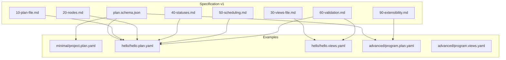
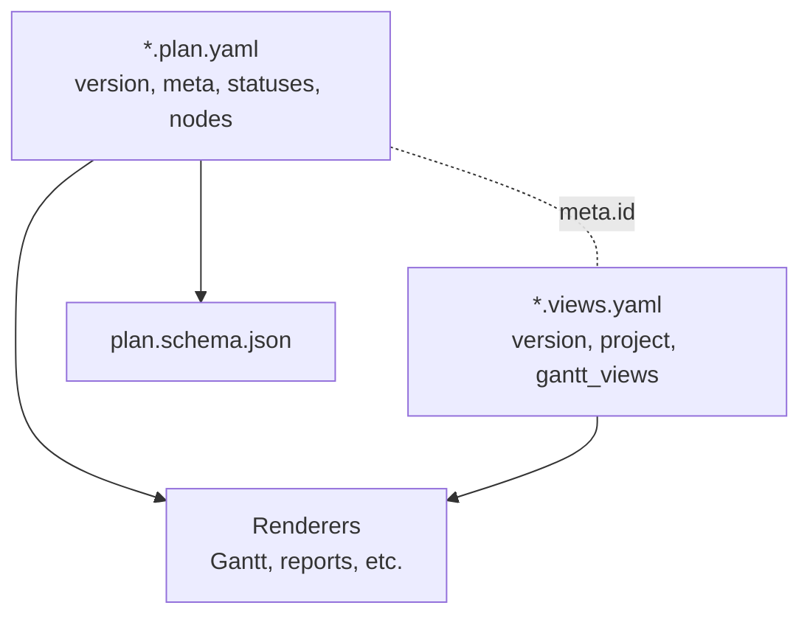
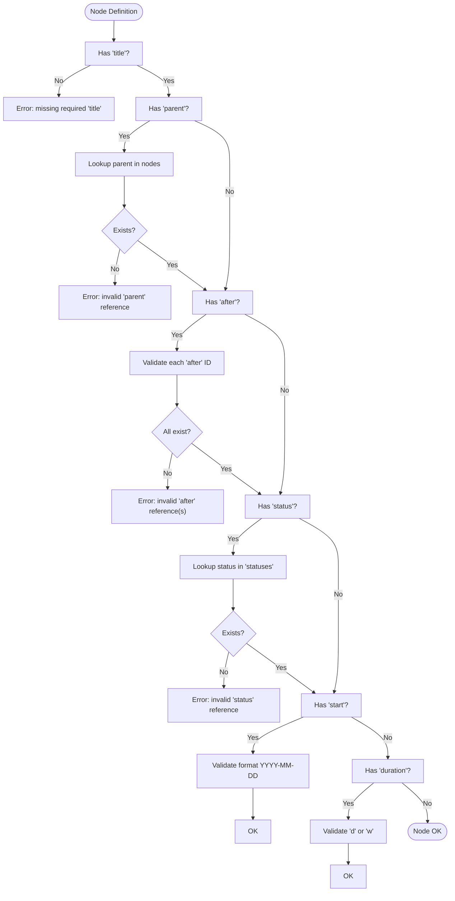
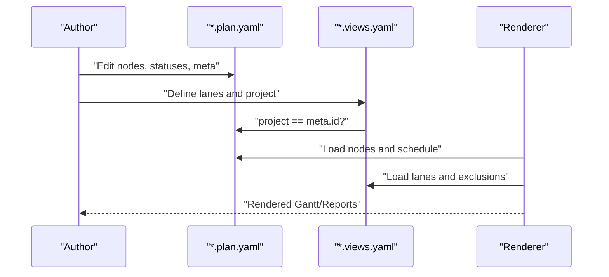
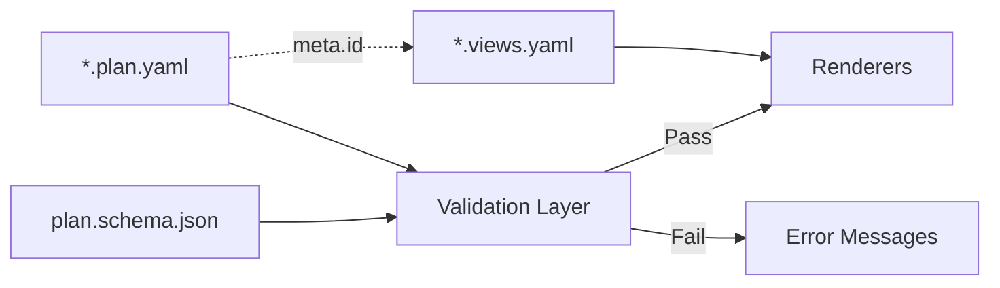

# Plan Files (*.plan.yaml)

<cite>
**Referenced Files in This Document**
- [README.md](file://README.md)
- [specs/v1/README.md](file://specs/v1/README.md)
- [specs/v1/spec/00-introduction.md](file://specs/v1/spec/00-introduction.md)
- [specs/v1/spec/10-plan-file.md](file://specs/v1/spec/10-plan-file.md)
- [specs/v1/spec/20-nodes.md](file://specs/v1/spec/20-nodes.md)
- [specs/v1/spec/30-views-file.md](file://specs/v1/spec/30-views-file.md)
- [specs/v1/spec/40-statuses.md](file://specs/v1/spec/40-statuses.md)
- [specs/v1/spec/50-scheduling.md](file://specs/v1/spec/50-scheduling.md)
- [specs/v1/spec/60-validation.md](file://specs/v1/spec/60-validation.md)
- [specs/v1/spec/90-extensibility.md](file://specs/v1/spec/90-extensibility.md)
- [specs/v1/schemas/plan.schema.json](file://specs/v1/schemas/plan.schema.json)
- [specs/v1/examples/hello/hello.plan.yaml](file://specs/v1/examples/hello/hello.plan.yaml)
- [specs/v1/examples/hello/hello.views.yaml](file://specs/v1/examples/hello/hello.views.yaml)
- [specs/v1/examples/advanced/program.plan.yaml](file://specs/v1/examples/advanced/program.plan.yaml)
- [specs/v1/examples/advanced/program.views.yaml](file://specs/v1/examples/advanced/program.views.yaml)
- [specs/v1/examples/minimal/project.plan.yaml](file://specs/v1/examples/minimal/project.plan.yaml)
</cite>

## Table of Contents
1. [Introduction](#introduction)
2. [Project Structure](#project-structure)
3. [Core Components](#core-components)
4. [Architecture Overview](#architecture-overview)
5. [Detailed Component Analysis](#detailed-component-analysis)
6. [Dependency Analysis](#dependency-analysis)
7. [Performance Considerations](#performance-considerations)
8. [Troubleshooting Guide](#troubleshooting-guide)
9. [Conclusion](#conclusion)
10. [Appendices](#appendices)

## Introduction
Plan files (*.plan.yaml) define the operational map for a program or project. They capture the version, metadata, statuses, and node hierarchy that describe work items, their relationships, and optional scheduling. These files are the single source of truth for planning and can be rendered into multiple views (for example, Gantt charts) via companion views files (*.views.yaml).

Key goals:
- Provide a compact, versioned, and human-readable representation of work structure and state.
- Enable deterministic rendering of timelines and dependencies.
- Allow extensibility for custom fields without breaking compatibility.

**Section sources**
- [README.md](file://README.md#L1-L96)
- [specs/v1/README.md](file://specs/v1/README.md#L1-L27)

## Project Structure
The plan file format is part of the opskarta v1 specification. It is accompanied by:
- A JSON Schema that defines required and optional fields and types.
- Companion views files that define how to render the plan (for example, Gantt lanes).
- Example files demonstrating minimal, hello, and advanced usage.

**Diagram sources**
- [specs/v1/schemas/plan.schema.json](file://specs/v1/schemas/plan.schema.json#L1-L86)
- [specs/v1/spec/10-plan-file.md](file://specs/v1/spec/10-plan-file.md#L1-L30)
- [specs/v1/spec/20-nodes.md](file://specs/v1/spec/20-nodes.md#L1-L37)
- [specs/v1/spec/30-views-file.md](file://specs/v1/spec/30-views-file.md#L1-L34)
- [specs/v1/spec/40-statuses.md](file://specs/v1/spec/40-statuses.md#L1-L23)
- [specs/v1/spec/50-scheduling.md](file://specs/v1/spec/50-scheduling.md#L1-L80)
- [specs/v1/spec/60-validation.md](file://specs/v1/spec/60-validation.md#L1-L140)
- [specs/v1/spec/90-extensibility.md](file://specs/v1/spec/90-extensibility.md#L1-L26)
- [specs/v1/examples/hello/hello.plan.yaml](file://specs/v1/examples/hello/hello.plan.yaml#L1-L44)
- [specs/v1/examples/hello/hello.views.yaml](file://specs/v1/examples/hello/hello.views.yaml#L1-L13)
- [specs/v1/examples/advanced/program.plan.yaml](file://specs/v1/examples/advanced/program.plan.yaml#L1-L326)
- [specs/v1/examples/advanced/program.views.yaml](file://specs/v1/examples/advanced/program.views.yaml#L1-L93)
- [specs/v1/examples/minimal/project.plan.yaml](file://specs/v1/examples/minimal/project.plan.yaml#L1-L6)

**Section sources**
- [specs/v1/README.md](file://specs/v1/README.md#L1-L27)
- [specs/v1/spec/00-introduction.md](file://specs/v1/spec/00-introduction.md#L1-L10)

## Core Components
This section documents the top-level structure and semantics of *.plan.yaml.

- version
  - Type: integer
  - Required: yes
  - Purpose: Identifies the schema version used by the file.
  - Validation: Must be a positive integer (minimum 1).
  - Notes: Used by tooling to select the appropriate schema and interpretation rules.

- meta
  - Type: object
  - Required: yes
  - Fields:
    - id: string, min length 1, required
      - Purpose: Unique identifier for the plan; used to link with *.views.yaml via project.
    - title: string, min length 1, required
      - Purpose: Human-readable name of the plan.
  - Additional properties: allowed (custom fields under meta are permitted).

- statuses
  - Type: object
  - Required: no
  - Purpose: Defines the set of status keys used across nodes.
  - Semantics: Each key is a status label; each value is an arbitrary object (recommended to include label and color for visualization).
  - Validation: Node status fields must reference keys present here.

- nodes
  - Type: object
  - Required: yes (can be empty)
  - Structure: Map of node_id -> node object
  - Node object fields:
    - title: string (required)
    - kind: string (optional)
    - status: string (optional; must match a key in statuses if present)
    - parent: string (optional; must reference an existing node_id)
    - after: array of string (optional; each item must reference an existing node_id)
    - start: string (optional; ISO date YYYY-MM-DD)
    - duration: string or integer (optional; string format "<number>d" or "<number>w")
    - issue: string (optional; external ticket identifier)
    - notes: string (optional; freeform text)
  - Additional properties: allowed (see Extensibility).

JSON Schema highlights:
- Root required fields: version, meta, nodes
- meta.required: id, title
- nodes.additionalProperties: node schema with required title and optional fields listed above
- additionalProperties: true at root and node levels (extensibility)

Practical examples:
- Minimal plan: [project.plan.yaml](file://specs/v1/examples/minimal/project.plan.yaml#L1-L6)
- Hello plan: [hello.plan.yaml](file://specs/v1/examples/hello/hello.plan.yaml#L1-L44)
- Advanced plan: [program.plan.yaml](file://specs/v1/examples/advanced/program.plan.yaml#L1-L326)

**Section sources**
- [specs/v1/spec/10-plan-file.md](file://specs/v1/spec/10-plan-file.md#L1-L30)
- [specs/v1/spec/20-nodes.md](file://specs/v1/spec/20-nodes.md#L1-L37)
- [specs/v1/spec/40-statuses.md](file://specs/v1/spec/40-statuses.md#L1-L23)
- [specs/v1/spec/50-scheduling.md](file://specs/v1/spec/50-scheduling.md#L1-L80)
- [specs/v1/schemas/plan.schema.json](file://specs/v1/schemas/plan.schema.json#L1-L86)
- [specs/v1/examples/minimal/project.plan.yaml](file://specs/v1/examples/minimal/project.plan.yaml#L1-L6)
- [specs/v1/examples/hello/hello.plan.yaml](file://specs/v1/examples/hello/hello.plan.yaml#L1-L44)
- [specs/v1/examples/advanced/program.plan.yaml](file://specs/v1/examples/advanced/program.plan.yaml#L1-L326)

## Architecture Overview
Plan files are the “source of truth” for operational maps. Views files consume plan data to produce specific renderings (for example, Gantt lanes). The relationship is enforced by linking meta.id in the plan with project in the views.

**Diagram sources**
- [specs/v1/spec/30-views-file.md](file://specs/v1/spec/30-views-file.md#L1-L34)
- [specs/v1/spec/60-validation.md](file://specs/v1/spec/60-validation.md#L82-L100)
- [specs/v1/schemas/plan.schema.json](file://specs/v1/schemas/plan.schema.json#L1-L86)

**Section sources**
- [specs/v1/spec/30-views-file.md](file://specs/v1/spec/30-views-file.md#L1-L34)
- [specs/v1/spec/60-validation.md](file://specs/v1/spec/60-validation.md#L82-L100)

## Detailed Component Analysis

### Version Field
- Purpose: Selects the schema and interpretation rules.
- Constraints: Integer >= 1.
- Impact: Tooling uses this to validate and process the file.

**Section sources**
- [specs/v1/spec/10-plan-file.md](file://specs/v1/spec/10-plan-file.md#L5-L6)
- [specs/v1/schemas/plan.schema.json](file://specs/v1/schemas/plan.schema.json#L12-L15)

### Meta Information (id, title)
- id: Links the plan to a views file (via project).
- title: Human-readable display name.
- Best practice: Keep id stable across iterations; update title for clarity.

**Section sources**
- [specs/v1/spec/10-plan-file.md](file://specs/v1/spec/10-plan-file.md#L7-L8)
- [specs/v1/spec/60-validation.md](file://specs/v1/spec/60-validation.md#L89-L91)

### Status Definitions
- Purpose: Define the vocabulary of statuses used across nodes.
- Recommended keys: not_started, in_progress, done, blocked (plus others as needed).
- Structure: Each status is an object; recommended fields include label and color for visualization.

**Section sources**
- [specs/v1/spec/40-statuses.md](file://specs/v1/spec/40-statuses.md#L1-L23)
- [specs/v1/spec/20-nodes.md](file://specs/v1/spec/20-nodes.md#L18-L18)

### Node Hierarchies and Relationships
- parent: Establishes containment and decomposition.
- after: Establishes precedence dependencies; the node starts after all listed nodes finish.
- start: ISO date (YYYY-MM-DD); optional but required for timeline rendering.
- duration: "<number>d" or "<number>w"; optional but meaningful with start/after.
- kind: Semantic type (for example, summary, phase, epic, task).
- issue: External tracker identifier.
- notes: Free-form context.

Validation rules:
- parent must reference an existing node_id.
- each element of after must reference an existing node_id.
- status must reference an existing key in statuses (if present).
- start must conform to YYYY-MM-DD.
- duration must conform to supported suffixes.

**Diagram sources**
- [specs/v1/spec/60-validation.md](file://specs/v1/spec/60-validation.md#L13-L81)
- [specs/v1/spec/20-nodes.md](file://specs/v1/spec/20-nodes.md#L25-L27)

**Section sources**
- [specs/v1/spec/20-nodes.md](file://specs/v1/spec/20-nodes.md#L1-L37)
- [specs/v1/spec/50-scheduling.md](file://specs/v1/spec/50-scheduling.md#L1-L80)
- [specs/v1/spec/60-validation.md](file://specs/v1/spec/60-validation.md#L13-L81)

### Practical Examples
- Minimal plan: [project.plan.yaml](file://specs/v1/examples/minimal/project.plan.yaml#L1-L6)
  - Demonstrates minimal viable structure with version and nodes.
- Hello plan: [hello.plan.yaml](file://specs/v1/examples/hello/hello.plan.yaml#L1-L44)
  - Includes meta, statuses, and a small hierarchy with parent and after relationships.
- Advanced plan: [program.plan.yaml](file://specs/v1/examples/advanced/program.plan.yaml#L1-L326)
  - Multi-track program with phases, epics, tasks, cross-track dependencies, and custom extensions under x.

**Section sources**
- [specs/v1/examples/minimal/project.plan.yaml](file://specs/v1/examples/minimal/project.plan.yaml#L1-L6)
- [specs/v1/examples/hello/hello.plan.yaml](file://specs/v1/examples/hello/hello.plan.yaml#L1-L44)
- [specs/v1/examples/advanced/program.plan.yaml](file://specs/v1/examples/advanced/program.plan.yaml#L1-L326)

### Relationship Between Plan and Views Files
- Link: views.project must equal plan.meta.id.
- Views define lanes and exclusions for rendering Gantt-like views.
- Example: [hello.views.yaml](file://specs/v1/examples/hello/hello.views.yaml#L1-L13) links to [hello.plan.yaml](file://specs/v1/examples/hello/hello.plan.yaml#L1-L44).
- Example: [program.views.yaml](file://specs/v1/examples/advanced/program.views.yaml#L1-L93) links to [program.plan.yaml](file://specs/v1/examples/advanced/program.plan.yaml#L1-L326).

**Diagram sources**
- [specs/v1/spec/30-views-file.md](file://specs/v1/spec/30-views-file.md#L1-L34)
- [specs/v1/spec/60-validation.md](file://specs/v1/spec/60-validation.md#L89-L100)

**Section sources**
- [specs/v1/spec/30-views-file.md](file://specs/v1/spec/30-views-file.md#L1-L34)
- [specs/v1/spec/60-validation.md](file://specs/v1/spec/60-validation.md#L89-L100)

### Node Inheritance Patterns and Hierarchical Organization
- parent establishes containment and decomposition.
- after encodes precedence; useful for cross-hierarchical dependencies.
- kind helps categorize semantic roles (summary, phase, epic, task).
- start and duration enable timeline computation.
- Notes: The spec does not enforce a strict taxonomy; choose kinds that improve readability and tooling support.

**Section sources**
- [specs/v1/spec/20-nodes.md](file://specs/v1/spec/20-nodes.md#L11-L16)
- [specs/v1/spec/50-scheduling.md](file://specs/v1/spec/50-scheduling.md#L1-L80)

### Custom Field Extensions
- Nodes and meta support additional properties.
- Recommended grouping under a dedicated namespace (for example, x:) to avoid conflicts.
- Tools must ignore unknown fields and preserve formatting when round-tripping.

**Section sources**
- [specs/v1/spec/90-extensibility.md](file://specs/v1/spec/90-extensibility.md#L1-L26)
- [specs/v1/schemas/plan.schema.json](file://specs/v1/schemas/plan.schema.json#L32-L33)
- [specs/v1/schemas/plan.schema.json](file://specs/v1/schemas/plan.schema.json#L80-L81)
- [specs/v1/examples/advanced/program.plan.yaml](file://specs/v1/examples/advanced/program.plan.yaml#L298-L326)

## Dependency Analysis
- Schema-driven validation ensures structural correctness.
- Runtime validation enforces referential integrity and semantic constraints.
- Rendering depends on both plan and views; mismatched project/meta.id leads to linkage failures.

**Diagram sources**
- [specs/v1/schemas/plan.schema.json](file://specs/v1/schemas/plan.schema.json#L1-L86)
- [specs/v1/spec/60-validation.md](file://specs/v1/spec/60-validation.md#L116-L140)
- [specs/v1/spec/30-views-file.md](file://specs/v1/spec/30-views-file.md#L1-L34)

**Section sources**
- [specs/v1/spec/60-validation.md](file://specs/v1/spec/60-validation.md#L116-L140)
- [specs/v1/spec/30-views-file.md](file://specs/v1/spec/30-views-file.md#L1-L34)

## Performance Considerations
- Keep nodes organized with clear parent/after relationships to simplify dependency resolution.
- Prefer coarse-grained durations (weeks) for long tracks to reduce rendering complexity.
- Limit excessive custom fields to minimize parsing overhead.
- Use views to focus rendering on subsets of nodes rather than reprocessing entire plans.

[No sources needed since this section provides general guidance]

## Troubleshooting Guide
Common validation errors and remedies:
- Missing required fields
  - Symptom: Missing version, meta, or nodes.
  - Fix: Add required fields according to schema.
- Invalid parent reference
  - Symptom: parent points to a non-existent node_id.
  - Fix: Ensure parent exists in nodes or remove the field.
- Invalid after references
  - Symptom: after contains IDs not present in nodes.
  - Fix: Remove or correct missing IDs.
- Invalid status reference
  - Symptom: status is not a key in statuses.
  - Fix: Define the status in statuses or change the value.
- Incorrect date or duration formats
  - Symptom: start not matching YYYY-MM-DD or duration not matching supported suffixes.
  - Fix: Align formats to accepted patterns.
- Mismatched project/meta.id
  - Symptom: views.project differs from plan.meta.id.
  - Fix: Make them identical.

Tooling guidance:
- Use the provided validator to check syntax, schema, and semantics.
- Error messages include the problematic path, current value, expectation, and available alternatives.

**Section sources**
- [specs/v1/spec/60-validation.md](file://specs/v1/spec/60-validation.md#L1-L140)

## Conclusion
Plan files (*.plan.yaml) provide a compact, versioned, and extensible foundation for operational maps. Combined with views files and a shared schema, they enable consistent planning, robust validation, and flexible rendering. Adopt stable ids, clear statuses, and disciplined scheduling to maximize maintainability and tooling support.

[No sources needed since this section summarizes without analyzing specific files]

## Appendices

### JSON Schema Summary (Required vs Optional)
- Required at root:
  - version
  - meta
  - nodes
- meta.required:
  - id
  - title
- Node-level required:
  - title
- Node-level optional:
  - kind, status, parent, after, start, duration, issue, notes
- Additional properties:
  - Allowed at root and node levels for extensibility.

**Section sources**
- [specs/v1/schemas/plan.schema.json](file://specs/v1/schemas/plan.schema.json#L6-L15)
- [specs/v1/schemas/plan.schema.json](file://specs/v1/schemas/plan.schema.json#L16-L33)
- [specs/v1/schemas/plan.schema.json](file://specs/v1/schemas/plan.schema.json#L38-L82)

### Practical Examples Index
- Minimal: [project.plan.yaml](file://specs/v1/examples/minimal/project.plan.yaml#L1-L6)
- Hello: [hello.plan.yaml](file://specs/v1/examples/hello/hello.plan.yaml#L1-L44), [hello.views.yaml](file://specs/v1/examples/hello/hello.views.yaml#L1-L13)
- Advanced: [program.plan.yaml](file://specs/v1/examples/advanced/program.plan.yaml#L1-L326), [program.views.yaml](file://specs/v1/examples/advanced/program.views.yaml#L1-L93)

**Section sources**
- [specs/v1/examples/minimal/project.plan.yaml](file://specs/v1/examples/minimal/project.plan.yaml#L1-L6)
- [specs/v1/examples/hello/hello.plan.yaml](file://specs/v1/examples/hello/hello.plan.yaml#L1-L44)
- [specs/v1/examples/hello/hello.views.yaml](file://specs/v1/examples/hello/hello.views.yaml#L1-L13)
- [specs/v1/examples/advanced/program.plan.yaml](file://specs/v1/examples/advanced/program.plan.yaml#L1-L326)
- [specs/v1/examples/advanced/program.views.yaml](file://specs/v1/examples/advanced/program.views.yaml#L1-L93)