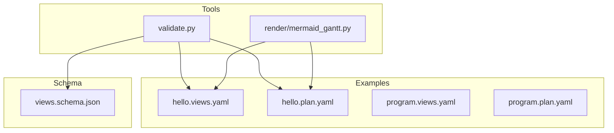
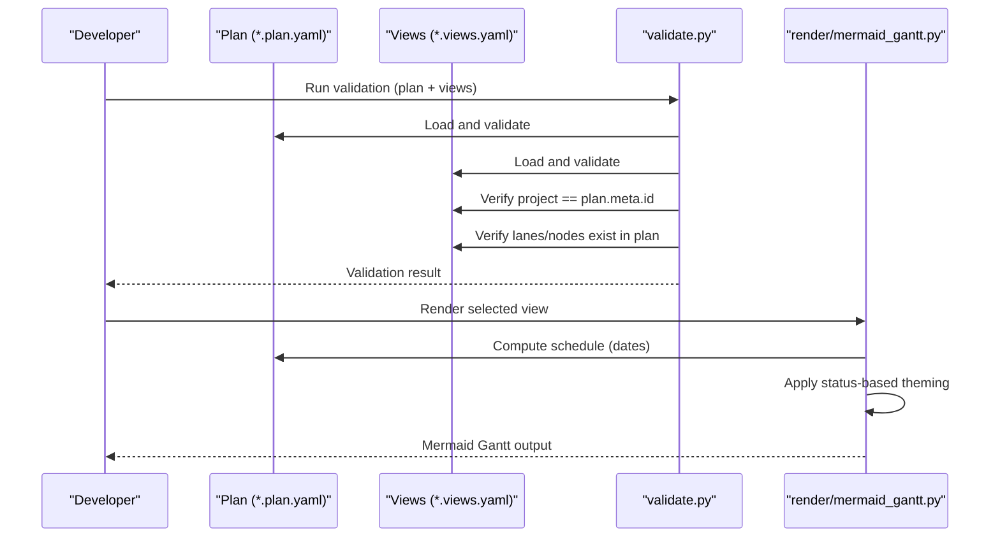
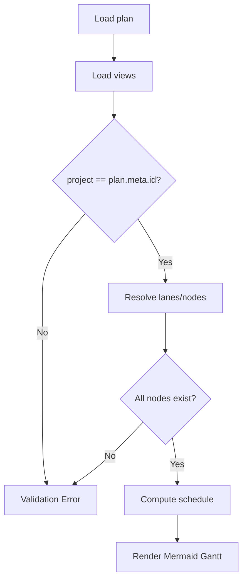
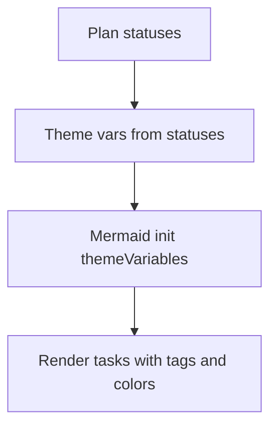
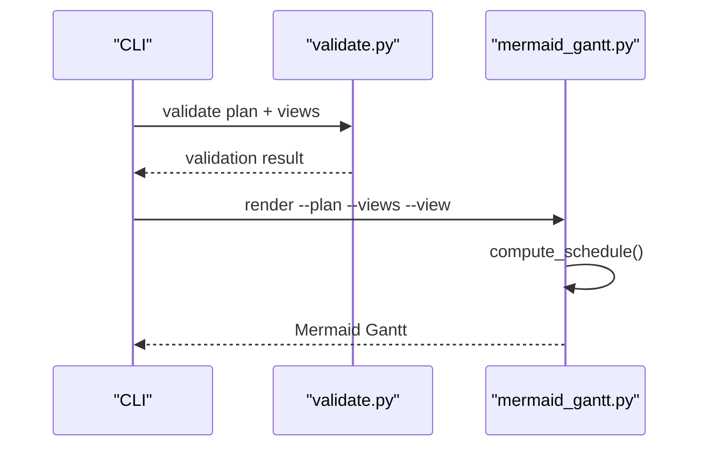
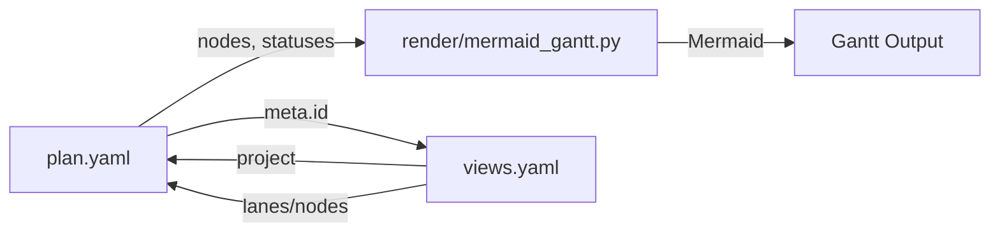

# Views Files (*.views.yaml)

<cite>
**Referenced Files in This Document**
- [views.schema.json](file://specs/v1/schemas/views.schema.json)
- [30-views-file.md](file://specs/v1/spec/30-views-file.md)
- [validate.py](file://specs/v1/tools/validate.py)
- [mermaid_gantt.py](file://specs/v1/tools/render/mermaid_gantt.py)
- [hello.views.yaml](file://specs/v1/examples/hello/hello.views.yaml)
- [hello.plan.yaml](file://specs/v1/examples/hello/hello.plan.yaml)
- [program.views.yaml](file://specs/v1/examples/advanced/program.views.yaml)
- [program.plan.yaml](file://specs/v1/examples/advanced/program.plan.yaml)
- [README.md (hello)](file://specs/v1/examples/hello/README.md)
- [README.md (advanced)](file://specs/v1/examples/advanced/README.md)
</cite>

## Table of Contents
1. [Introduction](#introduction)
2. [Project Structure](#project-structure)
3. [Core Components](#core-components)
4. [Architecture Overview](#architecture-overview)
5. [Detailed Component Analysis](#detailed-component-analysis)
6. [Dependency Analysis](#dependency-analysis)
7. [Performance Considerations](#performance-considerations)
8. [Troubleshooting Guide](#troubleshooting-guide)
9. [Conclusion](#conclusion)
10. [Appendices](#appendices)

## Introduction
This document explains the *.views.yaml format used to define visualization and presentation of operational plans. It covers the complete file structure, how views relate to plan files via the meta.id field, how gantt views and lanes organize operational data, and how to customize views for different stakeholders. It also documents the JSON Schema for validation, provides practical examples from the hello and advanced examples, and offers guidance on status-based coloring, timeline configuration, common errors, performance considerations, and best practices.

## Project Structure
The views file lives alongside plan files and is validated and rendered by dedicated tools. The hello and advanced examples demonstrate minimal and comprehensive usage respectively.

**Diagram sources**
- [hello.views.yaml](file://specs/v1/examples/hello/hello.views.yaml#L1-L13)
- [hello.plan.yaml](file://specs/v1/examples/hello/hello.plan.yaml#L1-L44)
- [program.views.yaml](file://specs/v1/examples/advanced/program.views.yaml#L1-L93)
- [program.plan.yaml](file://specs/v1/examples/advanced/program.plan.yaml#L1-L326)
- [validate.py](file://specs/v1/tools/validate.py#L427-L580)
- [mermaid_gantt.py](file://specs/v1/tools/render/mermaid_gantt.py#L439-L549)
- [views.schema.json](file://specs/v1/schemas/views.schema.json#L1-L26)

**Section sources**
- [hello.views.yaml](file://specs/v1/examples/hello/hello.views.yaml#L1-L13)
- [program.views.yaml](file://specs/v1/examples/advanced/program.views.yaml#L1-L93)
- [validate.py](file://specs/v1/tools/validate.py#L427-L580)
- [mermaid_gantt.py](file://specs/v1/tools/render/mermaid_gantt.py#L439-L549)
- [views.schema.json](file://specs/v1/schemas/views.schema.json#L1-L26)

## Core Components
- Root-level fields:
  - version: integer, minimum 1
  - project: string, must match plan.meta.id
  - gantt_views: object, optional, containing one or more named Gantt views
- Gantt view:
  - title: string
  - excludes: list of strings (calendar exclusions; weekends supported)
  - lanes: object, required, mapping lane_id to lane definitions
- Lane:
  - title: string
  - nodes: list of node_id strings present in the plan’s nodes map

These fields are enforced by both the JSON Schema and semantic validation.

**Section sources**
- [views.schema.json](file://specs/v1/schemas/views.schema.json#L1-L26)
- [30-views-file.md](file://specs/v1/spec/30-views-file.md#L1-L34)
- [validate.py](file://specs/v1/tools/validate.py#L446-L579)

## Architecture Overview
Views act as a presentation layer over the plan. They select which nodes to show, group them into lanes, and configure timeline behavior. Rendering converts views into Mermaid Gantt output, applying status-based theming.

**Diagram sources**
- [validate.py](file://specs/v1/tools/validate.py#L427-L580)
- [mermaid_gantt.py](file://specs/v1/tools/render/mermaid_gantt.py#L439-L549)

## Detailed Component Analysis

### JSON Schema and Field Definitions
- version: integer ≥ 1
- project: string, must equal plan.meta.id
- gantt_views: object with arbitrary keys (view names), each a view definition
- View definition:
  - title: string
  - excludes: list of strings (e.g., weekends)
  - lanes: object, required, with lane_id keys and lane objects
- Lane object:
  - title: string
  - nodes: list of node_id strings present in plan.nodes

Validation ensures:
- project equals plan.meta.id
- lanes and nodes exist in the plan
- gantt_views is a non-empty object when present

**Section sources**
- [views.schema.json](file://specs/v1/schemas/views.schema.json#L1-L26)
- [validate.py](file://specs/v1/tools/validate.py#L446-L579)

### Relationship Between Views and Plan Files
- The project field in views must match plan.meta.id
- Each lane.nodes references node_id entries from plan.nodes
- The renderer computes dates from plan nodes and applies status theming

**Diagram sources**
- [validate.py](file://specs/v1/tools/validate.py#L482-L579)
- [mermaid_gantt.py](file://specs/v1/tools/render/mermaid_gantt.py#L217-L294)

**Section sources**
- [validate.py](file://specs/v1/tools/validate.py#L482-L579)
- [program.plan.yaml](file://specs/v1/examples/advanced/program.plan.yaml#L3-L5)
- [program.views.yaml](file://specs/v1/examples/advanced/program.views.yaml#L1-L2)

### Gantt View Configuration
- title: displayed header in the generated Gantt
- excludes: calendar exclusions; weekends is supported
- lanes: grouping of nodes into horizontal tracks

Practical examples:
- hello overview view defines a single lane with several node_ids
- advanced program defines multiple views (overview, backend-detail, frontend-detail, infrastructure-detail, critical-path) each with distinct lanes and node selections

**Section sources**
- [hello.views.yaml](file://specs/v1/examples/hello/hello.views.yaml#L4-L13)
- [program.views.yaml](file://specs/v1/examples/advanced/program.views.yaml#L8-L28)
- [program.views.yaml](file://specs/v1/examples/advanced/program.views.yaml#L32-L44)
- [program.views.yaml](file://specs/v1/examples/advanced/program.views.yaml#L48-L59)
- [program.views.yaml](file://specs/v1/examples/advanced/program.views.yaml#L64-L76)
- [program.views.yaml](file://specs/v1/examples/advanced/program.views.yaml#L80-L93)

### Lane Organization
- Each lane groups related node_ids
- Lanes appear as sections in the Mermaid Gantt output
- Nodes without computed dates are skipped during rendering

Example organization patterns:
- Team-based lanes (backend, frontend, infrastructure)
- Feature-based lanes (design-system, ui-migration)
- Critical-path lanes focusing on key dependencies

**Section sources**
- [program.views.yaml](file://specs/v1/examples/advanced/program.views.yaml#L12-L28)
- [program.views.yaml](file://specs/v1/examples/advanced/program.views.yaml#L36-L44)
- [program.views.yaml](file://specs/v1/examples/advanced/program.views.yaml#L52-L60)
- [program.views.yaml](file://specs/v1/examples/advanced/program.views.yaml#L68-L76)
- [program.views.yaml](file://specs/v1/examples/advanced/program.views.yaml#L84-L93)

### Timeline Configuration
- excludes: supports weekends and explicit dates
- date_format and axis_format are recognized by the renderer
- The renderer computes start/finish dates from plan nodes and applies weekend exclusion when configured

**Section sources**
- [30-views-file.md](file://specs/v1/spec/30-views-file.md#L11-L18)
- [mermaid_gantt.py](file://specs/v1/tools/render/mermaid_gantt.py#L368-L396)

### Status-Based Coloring
- The renderer maps plan statuses to Mermaid tags and theme variables
- Supported built-in status mappings include done, in_progress, blocked
- Theme variables derive from plan statuses’ color fields

**Diagram sources**
- [mermaid_gantt.py](file://specs/v1/tools/render/mermaid_gantt.py#L317-L347)
- [mermaid_gantt.py](file://specs/v1/tools/render/mermaid_gantt.py#L349-L433)

**Section sources**
- [mermaid_gantt.py](file://specs/v1/tools/render/mermaid_gantt.py#L300-L315)
- [mermaid_gantt.py](file://specs/v1/tools/render/mermaid_gantt.py#L317-L347)
- [program.plan.yaml](file://specs/v1/examples/advanced/program.plan.yaml#L7-L14)

### Practical Examples

#### Hello Example
- Single view “overview” with one lane “main”
- Lane nodes reference top-level tasks from the plan

**Section sources**
- [hello.views.yaml](file://specs/v1/examples/hello/hello.views.yaml#L4-L13)
- [hello.plan.yaml](file://specs/v1/examples/hello/hello.plan.yaml#L13-L44)
- [README.md (hello)](file://specs/v1/examples/hello/README.md#L28-L45)

#### Advanced Example
- Five views: overview, backend-detail, frontend-detail, infrastructure-detail, critical-path
- Each view organizes nodes into lanes tailored to stakeholder needs
- Uses calendar excludes and cross-track dependencies

**Section sources**
- [program.views.yaml](file://specs/v1/examples/advanced/program.views.yaml#L1-L93)
- [program.plan.yaml](file://specs/v1/examples/advanced/program.plan.yaml#L1-L326)
- [README.md (advanced)](file://specs/v1/examples/advanced/README.md#L72-L113)

### Validation and Rendering Workflow
- Validation:
  - Loads YAML files
  - Optionally validates against JSON Schema
  - Semantically checks project vs plan.meta.id and node references
- Rendering:
  - Computes schedule from plan nodes
  - Applies status-based theming
  - Emits Mermaid Gantt output

**Diagram sources**
- [validate.py](file://specs/v1/tools/validate.py#L634-L752)
- [mermaid_gantt.py](file://specs/v1/tools/render/mermaid_gantt.py#L439-L549)

**Section sources**
- [validate.py](file://specs/v1/tools/validate.py#L634-L752)
- [mermaid_gantt.py](file://specs/v1/tools/render/mermaid_gantt.py#L439-L549)

## Dependency Analysis
Views depend on plan nodes and meta.id for correctness. The renderer depends on plan nodes and statuses for scheduling and theming.

**Diagram sources**
- [validate.py](file://specs/v1/tools/validate.py#L482-L579)
- [mermaid_gantt.py](file://specs/v1/tools/render/mermaid_gantt.py#L349-L433)

**Section sources**
- [validate.py](file://specs/v1/tools/validate.py#L482-L579)
- [mermaid_gantt.py](file://specs/v1/tools/render/mermaid_gantt.py#L349-L433)

## Performance Considerations
- Large datasets:
  - Prefer filtering nodes in views to reduce rendering workload
  - Limit the number of lanes and nodes per view
  - Use calendar excludes to skip non-working days efficiently
- Schedule computation:
  - The renderer computes schedules per node; avoid excessive node counts in a single view
  - Keep dependencies acyclic to prevent expensive cycles during scheduling
- Rendering:
  - Minimize repeated renders by caching outputs when feasible

[No sources needed since this section provides general guidance]

## Troubleshooting Guide
Common configuration errors and resolutions:
- project does not match plan.meta.id
  - Ensure views.project equals plan.meta.id
- Non-existent node references in lanes
  - Verify each lane.nodes entry exists in plan.nodes
- Invalid gantt_views structure
  - Ensure gantt_views is an object and lanes is a non-empty object
- Unsupported date formats
  - Use ISO date strings for start fields in plan nodes
- Unsupported duration formats
  - Use integers or "<number>d" for duration fields in plan nodes
- Excludes format
  - Use supported values (e.g., weekends); explicit dates are supported in advanced examples

Validation messages include the path, value, expected type, and available options to help fix issues.

**Section sources**
- [validate.py](file://specs/v1/tools/validate.py#L446-L579)
- [validate.py](file://specs/v1/tools/validate.py#L29-L63)

## Conclusion
Views files define how operational plans are presented as Gantt charts. By aligning project identifiers, organizing nodes into lanes, and configuring timeline exclusions, teams can create multiple, stakeholder-specific views of the same operational data. The JSON Schema and semantic validation ensure correctness, while the renderer produces Mermaid Gantt outputs with status-based theming.

[No sources needed since this section summarizes without analyzing specific files]

## Appendices

### Field Reference
- version: integer ≥ 1
- project: string, must equal plan.meta.id
- gantt_views: object, optional
  - view_id: object
    - title: string
    - excludes: list of strings (e.g., weekends)
    - lanes: object, required
      - lane_id: object
        - title: string
        - nodes: list of strings (node_id)

**Section sources**
- [views.schema.json](file://specs/v1/schemas/views.schema.json#L1-L26)
- [30-views-file.md](file://specs/v1/spec/30-views-file.md#L5-L18)

### Best Practices
- Align views.project with plan.meta.id
- Use descriptive view titles and lane titles
- Group nodes by functional or team ownership
- Limit nodes per lane to improve readability
- Use calendar excludes consistently across views
- Keep statuses aligned with plan statuses for accurate theming
- Organize multiple views for different audiences (executive, team leads, engineers)

[No sources needed since this section provides general guidance]