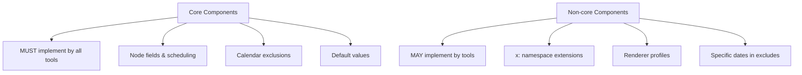
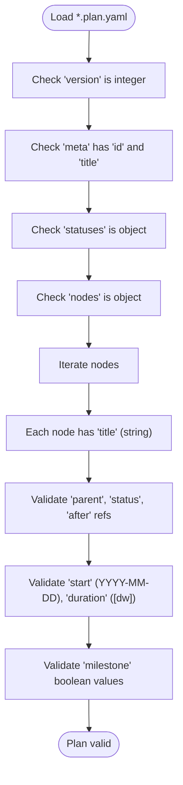
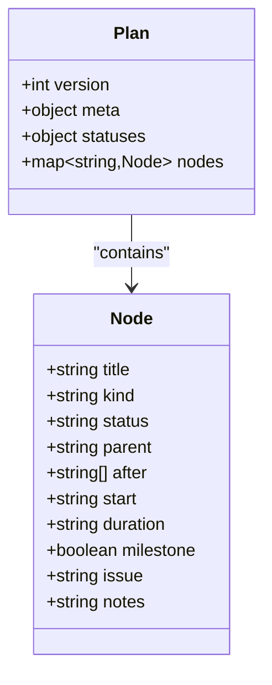
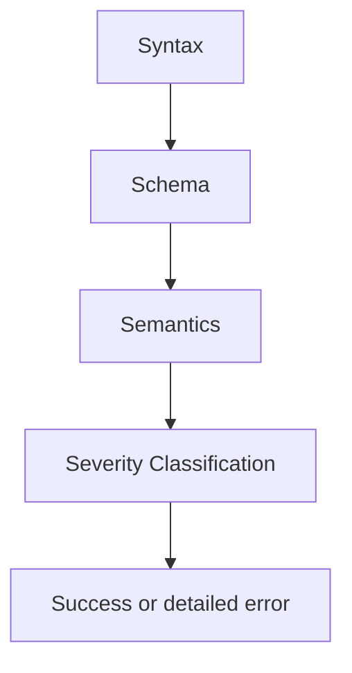

# Specification Reference

<cite>
**Referenced Files in This Document**
- [README.md](file://specs/v1/README.md)
- [SPEC.md](file://specs/v1/SPEC.md)
- [00-introduction.md](file://specs/v1/spec/00-introduction.md)
- [10-plan-file.md](file://specs/v1/spec/10-plan-file.md)
- [20-nodes.md](file://specs/v1/spec/20-nodes.md)
- [30-views-file.md](file://specs/v1/spec/30-views-file.md)
- [40-statuses.md](file://specs/v1/spec/40-statuses.md)
- [50-scheduling.md](file://specs/v1/spec/50-scheduling.md)
- [60-validation.md](file://specs/v1/spec/60-validation.md)
- [90-extensibility.md](file://specs/v1/spec/90-extensibility.md)
- [plan.schema.json](file://specs/v1/schemas/plan.schema.json)
- [views.schema.json](file://specs/v1/schemas/views.schema.json)
- [hello.plan.yaml](file://specs/v1/examples/hello/hello.plan.yaml)
- [hello.views.yaml](file://specs/v1/examples/hello/hello.views.yaml)
- [program.plan.yaml](file://specs/v1/examples/advanced/program.plan.yaml)
- [program.views.yaml](file://specs/v1/examples/advanced/program.views.yaml)
- [project.plan.yaml](file://specs/v1/examples/minimal/project.plan.yaml)
- [validate.py](file://specs/v1/tools/validate.py)
</cite>

## Update Summary
**Changes Made**
- Added comprehensive Core vs Non-core component distinction system
- Enhanced node identification guidelines with specific requirements and recommendations
- Expanded milestone handling documentation with detailed specifications
- Updated status definitions with structured status objects and validation rules
- Enhanced Gantt view documentation with renderer profile details
- Improved validation rules with severity levels and classification

## Table of Contents
1. [Introduction](#introduction)
2. [Project Structure](#project-structure)
3. [Core Components](#core-components)
4. [Architecture Overview](#architecture-overview)
5. [Detailed Component Analysis](#detailed-component-analysis)
6. [Dependency Analysis](#dependency-analysis)
7. [Performance Considerations](#performance-considerations)
8. [Troubleshooting Guide](#troubleshooting-guide)
9. [Conclusion](#conclusion)
10. [Appendices](#appendices)

## Introduction
This document is the comprehensive specification reference for Opskarta v1 operational maps. It defines how to model work as hierarchical plans and present them via multiple views. It covers:
- Operational map concepts: plans vs. views, node kinds, hierarchy, statuses, scheduling, and validation
- File formats: plan.yaml and views.yaml, their structures, required fields, and optional extensions
- JSON Schemas for machine-readable validation
- Extensibility and custom fields
- Examples from hello and advanced samples
- Troubleshooting and best practices

**Section sources**
- [README.md](file://specs/v1/README.md#L1-L27)
- [SPEC.md](file://specs/v1/SPEC.md#L15-L24)

## Project Structure
The specification is organized as:
- Specification chapters under specs/v1/spec
- JSON Schemas under specs/v1/schemas
- Example files under specs/v1/examples
- Validation tool under specs/v1/tools


**Diagram sources**
- [00-introduction.md](file://specs/v1/spec/00-introduction.md#L1-L10)
- [10-plan-file.md](file://specs/v1/spec/10-plan-file.md#L1-L30)
- [20-nodes.md](file://specs/v1/spec/20-nodes.md#L1-L37)
- [30-views-file.md](file://specs/v1/spec/30-views-file.md#L1-L34)
- [40-statuses.md](file://specs/v1/spec/40-statuses.md#L1-L23)
- [50-scheduling.md](file://specs/v1/spec/50-scheduling.md#L1-L80)
- [60-validation.md](file://specs/v1/spec/60-validation.md#L1-L140)
- [90-extensibility.md](file://specs/v1/spec/90-extensibility.md#L1-L26)
- [plan.schema.json](file://specs/v1/schemas/plan.schema.json#L1-L86)
- [views.schema.json](file://specs/v1/schemas/views.schema.json#L1-L26)
- [hello.plan.yaml](file://specs/v1/examples/hello/hello.plan.yaml#L1-L44)
- [hello.views.yaml](file://specs/v1/examples/hello/hello.views.yaml#L1-L13)
- [program.plan.yaml](file://specs/v1/examples/advanced/program.plan.yaml#L1-L326)
- [program.views.yaml](file://specs/v1/examples/advanced/program.views.yaml#L1-L93)
- [project.plan.yaml](file://specs/v1/examples/minimal/project.plan.yaml#L1-L6)
- [validate.py](file://specs/v1/tools/validate.py#L1-L752)

**Section sources**
- [README.md](file://specs/v1/README.md#L1-L27)
- [SPEC.md](file://specs/v1/SPEC.md#L4-L25)

## Core Components
- Plan file (*.plan.yaml): Defines the operational map's version, metadata, statuses dictionary, and nodes collection.
- Views file (*.views.yaml): Describes how to render the plan (e.g., Gantt views) and binds to a plan via project id.
- Nodes: Hierarchical work items with kinds, statuses, parents, scheduling, and optional custom fields.
- Statuses: Arbitrary key-value dictionaries with recommended keys and display attributes.
- Scheduling: Temporal attributes start (YYYY-MM-DD), duration (d or w), and after dependencies.
- Validation: Multi-level checks (syntax, schema, semantics) with precise error reporting.

**Section sources**
- [10-plan-file.md](file://specs/v1/spec/10-plan-file.md#L1-L30)
- [20-nodes.md](file://specs/v1/spec/20-nodes.md#L1-L37)
- [30-views-file.md](file://specs/v1/spec/30-views-file.md#L1-L34)
- [40-statuses.md](file://specs/v1/spec/40-statuses.md#L1-L23)
- [50-scheduling.md](file://specs/v1/spec/50-scheduling.md#L1-L80)
- [60-validation.md](file://specs/v1/spec/60-validation.md#L5-L140)

## Architecture Overview
The operational map architecture separates concerns:
- Plans capture the canonical work model (hierarchy, statuses, schedule).
- Views describe presentation and navigation (Gantt lanes, filters, exclusions).
- Validation ensures correctness across formats and links.


**Diagram sources**
- [validate.py](file://specs/v1/tools/validate.py#L634-L752)
- [plan.schema.json](file://specs/v1/schemas/plan.schema.json#L1-L86)
- [views.schema.json](file://specs/v1/schemas/views.schema.json#L1-L26)
- [10-plan-file.md](file://specs/v1/spec/10-plan-file.md#L1-L30)
- [30-views-file.md](file://specs/v1/spec/30-views-file.md#L1-L34)

## Detailed Component Analysis

### Core vs Non-core Component Distinctions

Opskarta v1 introduces a clear distinction between core and non-core components to separate normative requirements from optional extensions:

**Core Components (MUST implement)**
- Basic file structure for *.plan.yaml and *.views.yaml
- Node fields: title, kind, status, parent, after, start, duration, milestone
- Scheduling calculations: finish computation, start from after
- Calendar exclusions: "weekends" in excludes
- Default values: duration = 1d for scheduled nodes
- Validation rules and referential integrity

**Non-core Components (MAY implement)**
- Extensions via x: namespace (e.g., x.scheduling.anchor_to_parent_start)
- Renderer profiles (Mermaid Gantt, others)
- Renderer-specific view fields (date_format, axis_format, tick_interval)
- Specific dates in excludes (passed to renderer, don't affect core algorithm)
- Default status colors



**Diagram sources**
- [SPEC.md](file://specs/v1/SPEC.md#L27-L52)

**Section sources**
- [SPEC.md](file://specs/v1/SPEC.md#L27-L52)

### Plan File (*.plan.yaml)
- Root fields:
  - version (int)
  - meta: id (string), title (string)
  - statuses: arbitrary object
  - nodes: object of node_id -> node
- Node fields:
  - title (string, required)
  - kind (string), status (string), parent (string)
  - after (list[string]), start (YYYY-MM-DD), duration (<num>d|<num>w)
  - milestone (boolean), issue (string), notes (string)
  - Additional custom fields allowed (extensibility)



**Diagram sources**
- [validate.py](file://specs/v1/tools/validate.py#L135-L329)
- [10-plan-file.md](file://specs/v1/spec/10-plan-file.md#L3-L10)
- [20-nodes.md](file://specs/v1/spec/20-nodes.md#L5-L31)
- [60-validation.md](file://specs/v1/spec/60-validation.md#L7-L81)

**Section sources**
- [10-plan-file.md](file://specs/v1/spec/10-plan-file.md#L1-L30)
- [20-nodes.md](file://specs/v1/spec/20-nodes.md#L1-L37)
- [60-validation.md](file://specs/v1/spec/60-validation.md#L5-L81)
- [plan.schema.json](file://specs/v1/schemas/plan.schema.json#L1-L86)

### Views File (*.views.yaml)
- Root fields:
  - version (int)
  - project (string) matching plan.meta.id
  - gantt_views (object) of view_id -> view
- View fields:
  - title (string)
  - excludes (list[string]) calendar exclusions (e.g., weekends)
  - lanes (object) of lane_id -> { title, nodes: list[string] }
- Validation enforces:
  - project equals plan meta.id
  - lanes and nodes presence and types
  - nodes refer to existing node ids


**Diagram sources**
- [validate.py](file://specs/v1/tools/validate.py#L431-L579)
- [30-views-file.md](file://specs/v1/spec/30-views-file.md#L5-L17)
- [60-validation.md](file://specs/v1/spec/60-validation.md#L82-L115)

**Section sources**
- [30-views-file.md](file://specs/v1/spec/30-views-file.md#L1-L34)
- [60-validation.md](file://specs/v1/spec/60-validation.md#L82-L115)
- [views.schema.json](file://specs/v1/schemas/views.schema.json#L1-L26)

### Node Types and Hierarchy
- Recommended kinds: summary, phase, epic, user_story, task
- parent creates acyclic tree hierarchy
- status references keys in statuses dictionary
- after defines precedence graph among nodes



**Diagram sources**
- [20-nodes.md](file://specs/v1/spec/20-nodes.md#L11-L31)
- [10-plan-file.md](file://specs/v1/spec/10-plan-file.md#L5-L10)

**Section sources**
- [20-nodes.md](file://specs/v1/spec/20-nodes.md#L9-L31)
- [60-validation.md](file://specs/v1/spec/60-validation.md#L13-L75)

### Node Identification Guidelines

Opskarta v1 provides detailed guidelines for node identification:

**Requirements**
- node_id MUST be unique within nodes
- node_id MUST be a string

**Recommendations**
- Recommended format: `^[a-zA-Z][a-zA-Z0-9._-]*$`
  - Starts with a letter
  - Contains only letters, digits, dots, underscores, hyphens
- For Mermaid compatibility: avoid spaces, brackets, colons in identifiers

**Examples**
```yaml
# Good identifiers
nodes:
  kickoff: ...
  phase_1: ...
  backend-api: ...
  JIRA.123: ...

# Problematic identifiers (may not work in some renderers)
nodes:
  "task with spaces": ...     # Spaces
  "task:important": ...       # Colon
  123: ...                    # Starts with digit
```

**Section sources**
- [SPEC.md](file://specs/v1/SPEC.md#L91-L121)
- [20-nodes.md](file://specs/v1/spec/20-nodes.md#L5-L35)

### Milestone Handling

Milestones are event points on the timeline, not tasks with duration. They're used for key dates: releases, deadlines, checkpoints.

**Field `milestone`**
- milestone (boolean) - if true, node is displayed as a milestone

**Behavior**
- Milestone MUST have start or calculable start from after
- If duration not specified for milestone, uses 1d for calculations
- On Gantt diagram, milestone displays as point/diamond, not as a bar
- Milestones can have dependencies (after) and statuses (status)

**Section sources**
- [SPEC.md](file://specs/v1/SPEC.md#L151-L182)
- [20-nodes.md](file://specs/v1/spec/20-nodes.md#L65-L96)

### Status Management

**Structured Status Objects**
Statuses are now defined as structured objects with label and color fields:

**Structure**
- statuses is an arbitrary dictionary
- Each status object supports:
  - label (string) - human-readable name
  - color (string) - hex color format `^#[0-9a-fA-F]{6}$`

**Recommended Keys**
- not_started, in_progress, done, blocked

**Validation Rules**
- If status field exists on any node, statuses section becomes mandatory
- status values must reference existing keys in statuses dictionary
- color format must be valid hex color

**Section sources**
- [SPEC.md](file://specs/v1/SPEC.md#L266-L358)
- [40-statuses.md](file://specs/v1/spec/40-statuses.md#L1-L93)
- [60-validation.md](file://specs/v1/spec/60-validation.md#L57-L75)

### Scheduling Algorithms and Behavior
- start: fixed start date (YYYY-MM-DD)
- duration: <number>d or <number>w
- after: node can start only after all dependencies finish
- If start missing but after present: earliest completion of dependencies determines start
- If neither start nor after: node is not scheduled for timeline views
- Calendar excludes (e.g., weekends) influence duration-based scheduling


**Diagram sources**
- [50-scheduling.md](file://specs/v1/spec/50-scheduling.md#L75-L80)
- [validate.py](file://specs/v1/tools/validate.py#L312-L323)

**Section sources**
- [50-scheduling.md](file://specs/v1/spec/50-scheduling.md#L1-L80)
- [60-validation.md](file://specs/v1/spec/60-validation.md#L77-L81)

### Validation Rules and Levels
- Syntax: YAML/JSON parsing
- Schema: JSON Schema validation (types, required fields)
- Semantics: cross-references, cycles, formats, and business rules
- Error messages include path, value, expected, and available choices

**Severity Levels**
| Level | Description | Behavior |
|-------|-------------|----------|
| **error** | Critical error, makes file invalid | Validation fails (exit code ≠ 0) |
| **warn** | Potential problem requiring attention | Validation succeeds, but warning shown |
| **info** | Informational message | Validation succeeds |

**Classification of Problems**
| Problem | Severity |
|---------|----------|
| Missing required fields (version, nodes, title) | error |
| Non-existent references (parent, after, status) | error |
| Cyclic dependencies (parent, after) | error |
| Duplicate node_id in nodes | error |
| Invalid start or duration format | error |
| Invalid color format in statuses | error |
| Explicit start earlier than dependency finish | warn |
| Missing duration for scheduled node | warn |
| Specific dates in excludes (non-core) | info |
| Unscheduled nodes (don't appear on diagram) | info |



**Diagram sources**
- [60-validation.md](file://specs/v1/spec/60-validation.md#L116-L140)
- [validate.py](file://specs/v1/tools/validate.py#L586-L618)

**Section sources**
- [60-validation.md](file://specs/v1/spec/60-validation.md#L1-L140)
- [validate.py](file://specs/v1/tools/validate.py#L30-L63)

### Extensibility and Custom Fields
- Any node may include additional fields
- Base tools must ignore unknown fields and preserve formatting when emitting
- Recommended grouping under x: namespace for custom attributes

**Section sources**
- [90-extensibility.md](file://specs/v1/spec/90-extensibility.md#L1-L26)
- [program.plan.yaml](file://specs/v1/examples/advanced/program.plan.yaml#L296-L326)

### JSON Schema Definitions
- plan.schema.json validates plan structure and types
- views.schema.json validates views structure and types

**Section sources**
- [plan.schema.json](file://specs/v1/schemas/plan.schema.json#L1-L86)
- [views.schema.json](file://specs/v1/schemas/views.schema.json#L1-L26)

### Examples: Hello and Advanced
- Hello example demonstrates minimal scheduling and lanes
- Advanced example shows multi-track programs, dependencies, milestones, and custom fields

**Section sources**
- [hello.plan.yaml](file://specs/v1/examples/hello/hello.plan.yaml#L1-L44)
- [hello.views.yaml](file://specs/v1/examples/hello/hello.views.yaml#L1-L13)
- [program.plan.yaml](file://specs/v1/examples/advanced/program.plan.yaml#L1-L326)
- [program.views.yaml](file://specs/v1/examples/advanced/program.views.yaml#L1-L93)

## Dependency Analysis
- Views depend on Plan via project/meta.id
- Views depend on Plan nodes via lanes[].nodes
- Validators depend on Schemas and on Plan/Views content


**Diagram sources**
- [validate.py](file://specs/v1/tools/validate.py#L431-L579)
- [30-views-file.md](file://specs/v1/spec/30-views-file.md#L7-L9)
- [60-validation.md](file://specs/v1/spec/60-validation.md#L89-L115)

**Section sources**
- [validate.py](file://specs/v1/tools/validate.py#L431-L579)
- [60-validation.md](file://specs/v1/spec/60-validation.md#L89-L115)

## Performance Considerations
- Prefer explicit scheduling (start + duration) for predictable timelines
- Limit deep hierarchies and long after chains to reduce cycle detection overhead
- Use lanes to partition large plans for efficient rendering
- Keep statuses compact and reuse recommended keys for interoperability

## Troubleshooting Guide
Common issues and resolutions:
- Missing required fields
  - Ensure version, nodes, and node.title are present
- Invalid references
  - parent, after, and status must reference existing keys
  - project must match plan meta.id
- Cyclic dependencies
  - parent and after must form acyclic graphs
- Incorrect formats
  - start must be YYYY-MM-DD
  - duration must be <num>d or <num>w
  - color must be valid hex format
- Error messages
  - The validator reports path, value, expected, and available options

**Section sources**
- [60-validation.md](file://specs/v1/spec/60-validation.md#L124-L140)
- [validate.py](file://specs/v1/tools/validate.py#L30-L63)
- [validate.py](file://specs/v1/tools/validate.py#L153-L329)
- [validate.py](file://specs/v1/tools/validate.py#L448-L579)

## Conclusion
Opskarta v1 provides a minimal yet extensible format for operational maps. Plans define the work model; views define presentations. Robust validation and JSON Schemas ensure correctness. Extensibility preserves compatibility while enabling domain-specific enhancements.

## Appendices

### Appendix A: Minimal Example
- A minimal plan with a single root node and no scheduling

**Section sources**
- [project.plan.yaml](file://specs/v1/examples/minimal/project.plan.yaml#L1-L6)

### Appendix B: JSON Schema Validation Quick Reference
- plan.schema.json: validates plan structure and node fields
- views.schema.json: validates views structure and bindings

**Section sources**
- [plan.schema.json](file://specs/v1/schemas/plan.schema.json#L1-L86)
- [views.schema.json](file://specs/v1/schemas/views.schema.json#L1-L26)

### Appendix C: Tooling
- validate.py: CLI for validating plans and views, with optional JSON Schema mode

**Section sources**
- [validate.py](file://specs/v1/tools/validate.py#L1-L752)