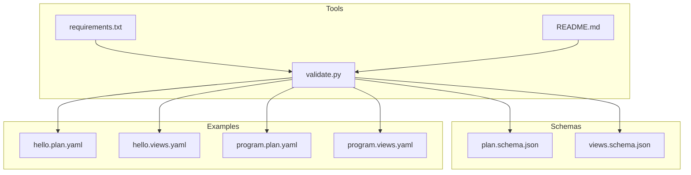
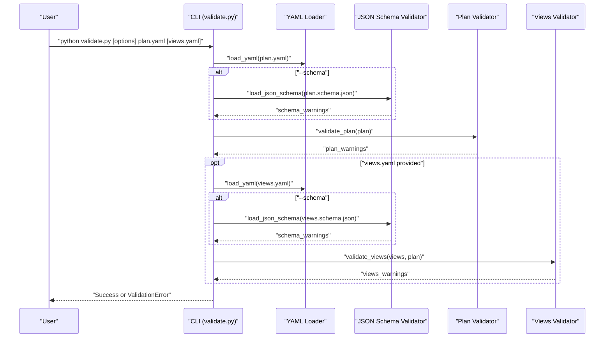
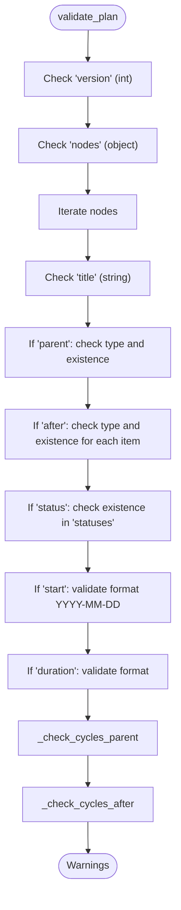
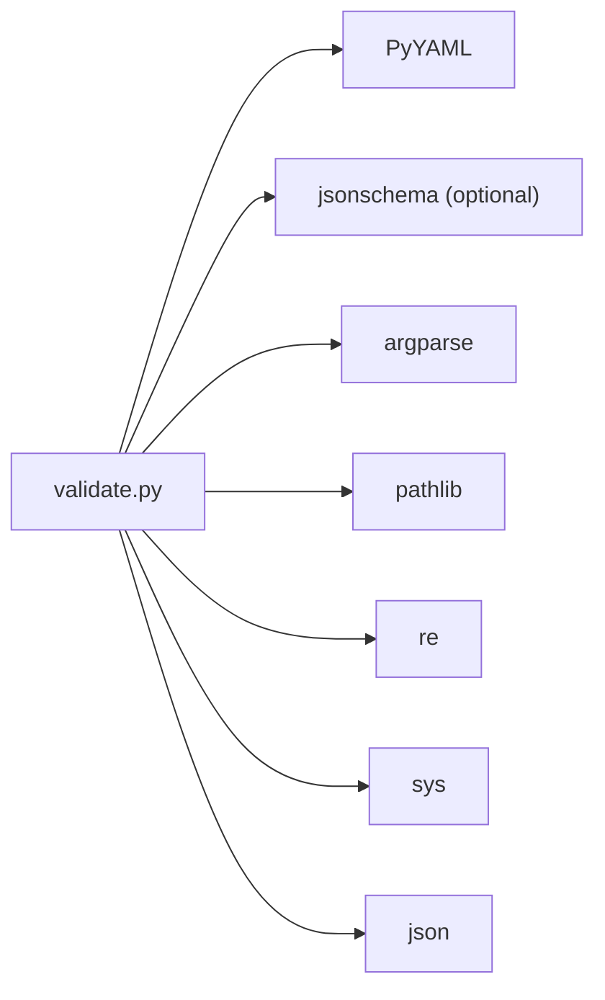

# Validation System

<cite>
**Referenced Files in This Document**
- [validate.py](file://specs/v1/tools/validate.py)
- [60-validation.md](file://specs/v1/spec/60-validation.md)
- [plan.schema.json](file://specs/v1/schemas/plan.schema.json)
- [views.schema.json](file://specs/v1/schemas/views.schema.json)
- [README.md](file://specs/v1/tools/README.md)
- [requirements.txt](file://specs/v1/tools/requirements.txt)
- [hello.plan.yaml](file://specs/v1/examples/hello/hello.plan.yaml)
- [hello.views.yaml](file://specs/v1/examples/hello/hello.views.yaml)
- [program.plan.yaml](file://specs/v1/examples/advanced/program.plan.yaml)
- [program.views.yaml](file://specs/v1/examples/advanced/program.views.yaml)
- [method.md](file://docs/method.md)
</cite>

## Table of Contents
1. [Introduction](#introduction)
2. [Project Structure](#project-structure)
3. [Core Components](#core-components)
4. [Architecture Overview](#architecture-overview)
5. [Detailed Component Analysis](#detailed-component-analysis)
6. [Dependency Analysis](#dependency-analysis)
7. [Performance Considerations](#performance-considerations)
8. [Troubleshooting Guide](#troubleshooting-guide)
9. [Conclusion](#conclusion)
10. [Appendices](#appendices)

## Introduction
This document describes the multi-level validation system used by operational maps in opskarta v1. It covers syntax validation, schema validation, and semantic validation, along with error handling/reporting, debugging strategies, and the validation pipeline. It also documents the validation tool’s command-line interface, integration options, and practical guidance for performance optimization, caching, incremental validation, and extending the system with custom rules.

## Project Structure
The validation system is centered around a Python-based validator that validates plan and views files, with optional JSON Schema validation and built-in semantic checks. Schemas define structural constraints, while the validator enforces referential integrity, dependency cycles, and format rules.

**Diagram sources**
- [validate.py](file://specs/v1/tools/validate.py#L634-L752)
- [requirements.txt](file://specs/v1/tools/requirements.txt#L1-L10)
- [README.md](file://specs/v1/tools/README.md#L1-L126)
- [plan.schema.json](file://specs/v1/schemas/plan.schema.json#L1-L86)
- [views.schema.json](file://specs/v1/schemas/views.schema.json#L1-L26)
- [hello.plan.yaml](file://specs/v1/examples/hello/hello.plan.yaml#L1-L44)
- [hello.views.yaml](file://specs/v1/examples/hello/hello.views.yaml#L1-L13)
- [program.plan.yaml](file://specs/v1/examples/advanced/program.plan.yaml#L1-L326)
- [program.views.yaml](file://specs/v1/examples/advanced/program.views.yaml#L1-L93)

**Section sources**
- [validate.py](file://specs/v1/tools/validate.py#L634-L752)
- [README.md](file://specs/v1/tools/README.md#L1-L126)

## Core Components
- Validator CLI: parses arguments, loads YAML, optionally validates via JSON Schema, performs semantic checks, and prints structured error messages.
- Plan validator: checks required fields, node integrity, parent/after/status referential integrity, and formats for start/duration; detects cycles in parent and after relationships.
- Views validator: verifies version/project alignment with plan meta.id and ensures all referenced nodes exist in the plan.
- JSON Schema validator: optional structural validation against plan.schema.json and views.schema.json.
- Error reporting: standardized ValidationError with path, value, expected, and available suggestions.

Key responsibilities:
- Syntax validation: YAML parsing and basic structure checks.
- Schema validation: structural and type checks via JSON Schema.
- Semantic validation: referential integrity, business rules, and dependency cycle detection.

**Section sources**
- [validate.py](file://specs/v1/tools/validate.py#L30-L129)
- [validate.py](file://specs/v1/tools/validate.py#L135-L329)
- [validate.py](file://specs/v1/tools/validate.py#L431-L579)
- [validate.py](file://specs/v1/tools/validate.py#L586-L618)
- [60-validation.md](file://specs/v1/spec/60-validation.md#L1-L140)

## Architecture Overview
The validator runs in stages: load YAML, optional JSON Schema validation, semantic validation, and reporting. It supports validating plan-only or plan+views, and can optionally enforce schema validation.

**Diagram sources**
- [validate.py](file://specs/v1/tools/validate.py#L634-L752)
- [validate.py](file://specs/v1/tools/validate.py#L69-L129)
- [validate.py](file://specs/v1/tools/validate.py#L586-L618)
- [validate.py](file://specs/v1/tools/validate.py#L135-L329)
- [validate.py](file://specs/v1/tools/validate.py#L431-L579)

## Detailed Component Analysis

### Syntax Validation
Syntax validation ensures the input files are valid YAML and parse to a dictionary. It handles missing files, invalid YAML, and root type mismatches.

- Loads YAML safely and rejects non-dict roots.
- Reports missing files and YAML parse errors with file path context.

**Section sources**
- [validate.py](file://specs/v1/tools/validate.py#L69-L129)

### Schema Validation (Optional)
Schema validation enforces structural and type constraints defined in JSON Schema files. It is optional and invoked with a flag.

- Loads JSON Schema files and validates instances.
- Uses jsonschema library; raises ValidationError with path and expected type information.

**Section sources**
- [validate.py](file://specs/v1/tools/validate.py#L586-L618)
- [plan.schema.json](file://specs/v1/schemas/plan.schema.json#L1-L86)
- [views.schema.json](file://specs/v1/schemas/views.schema.json#L1-L26)
- [requirements.txt](file://specs/v1/tools/requirements.txt#L7-L9)

### Semantic Validation: Plan
Semantic validation enforces referential integrity, business rules, and absence of cycles.

- Required fields: version (int), nodes (object).
- Node-level checks: title required; parent must reference an existing node; after must reference existing nodes; status must reference an existing status if present.
- Date/time formats: start must match YYYY-MM-DD; duration must match <number><unit> where unit is d or w.
- Cycle detection:
  - Parent chain cycle detection using visited tracking.
  - After dependency cycle detection using DFS with state tracking.

**Diagram sources**
- [validate.py](file://specs/v1/tools/validate.py#L135-L329)
- [validate.py](file://specs/v1/tools/validate.py#L332-L425)

**Section sources**
- [validate.py](file://specs/v1/tools/validate.py#L135-L329)
- [60-validation.md](file://specs/v1/spec/60-validation.md#L5-L81)

### Semantic Validation: Views
Views validation ensures alignment with the plan and referential integrity of node references.

- Required fields: version (int), project (string).
- project must equal plan.meta.id.
- gantt_views.lanes[].nodes must reference existing node IDs from plan.nodes.

**Section sources**
- [validate.py](file://specs/v1/tools/validate.py#L431-L579)
- [60-validation.md](file://specs/v1/spec/60-validation.md#L82-L115)

### Error Handling and Reporting
The validator defines a standardized ValidationError with:
- message: human-readable description
- path: dot-separated path to the problematic field
- value: actual value causing the issue
- expected: expected type/format
- available: suggested values (e.g., existing node IDs)

CLI prints formatted error messages and exits with non-zero status on validation failure.

**Section sources**
- [validate.py](file://specs/v1/tools/validate.py#L30-L63)
- [validate.py](file://specs/v1/tools/validate.py#L742-L748)

### Validation Pipeline and Integration Options
- CLI supports plan-only or plan+views validation.
- Optional schema validation via --schema flag.
- Custom schema paths supported via --plan-schema and --views-schema.
- Integration options:
  - Use in CI/CD to validate pull requests.
  - Combine with renderers to produce artifacts after validation.
  - Extend with custom rules by adding new validators and integrating them into the pipeline.

**Section sources**
- [validate.py](file://specs/v1/tools/validate.py#L634-L752)
- [README.md](file://specs/v1/tools/README.md#L18-L32)

## Dependency Analysis
The validator depends on:
- PyYAML for YAML parsing.
- jsonschema for optional schema validation.
- Standard libraries for path handling and argument parsing.

**Diagram sources**
- [validate.py](file://specs/v1/tools/validate.py#L18-L23)
- [requirements.txt](file://specs/v1/tools/requirements.txt#L4-L9)

**Section sources**
- [validate.py](file://specs/v1/tools/validate.py#L18-L23)
- [requirements.txt](file://specs/v1/tools/requirements.txt#L4-L9)

## Performance Considerations
- Large files:
  - Prefer plan-only validation when schema validation is not required to reduce overhead.
  - Use incremental validation by validating only changed files in CI/CD pipelines.
- Caching:
  - Cache JSON Schema loading results if invoking the validator multiple times in a session.
  - Cache YAML parsing results when re-validating the same files.
- Incremental validation:
  - Validate only affected views when plan nodes change.
  - Use file timestamps to skip unchanged files.
- Memory:
  - For very large plans, consider streaming or chunked processing if extending the validator.

[No sources needed since this section provides general guidance]

## Troubleshooting Guide
Common validation failures and solutions:

- Missing or invalid version
  - Symptom: Missing or non-int version field.
  - Fix: Ensure version is an integer (typically 1).
  - Reference: [60-validation.md](file://specs/v1/spec/60-validation.md#L7-L11)

- Non-object root
  - Symptom: Root is not a dictionary.
  - Fix: Ensure the top-level is an object.
  - Reference: [validate.py](file://specs/v1/tools/validate.py#L96-L102)

- Invalid YAML
  - Symptom: YAML parse error.
  - Fix: Correct indentation and syntax.
  - Reference: [validate.py](file://specs/v1/tools/validate.py#L106-L110)

- Missing required fields
  - Symptom: Missing nodes/title/statuses.
  - Fix: Add required fields as per specification.
  - Reference: [60-validation.md](file://specs/v1/spec/60-validation.md#L7-L11)

- Invalid parent reference
  - Symptom: parent references a non-existent node.
  - Fix: Ensure parent node ID exists in nodes.
  - Reference: [60-validation.md](file://specs/v1/spec/60-validation.md#L15-L18), [validate.py](file://specs/v1/tools/validate.py#L241-L248)

- Invalid after dependency
  - Symptom: after contains non-existent node IDs.
  - Fix: Remove or correct missing node IDs.
  - Reference: [60-validation.md](file://specs/v1/spec/60-validation.md#L36-L39), [validate.py](file://specs/v1/tools/validate.py#L270-L277)

- Invalid status reference
  - Symptom: status references a non-existent status ID.
  - Fix: Define status in statuses or remove the field.
  - Reference: [60-validation.md](file://specs/v1/spec/60-validation.md#L57-L75), [validate.py](file://specs/v1/tools/validate.py#L290-L297)

- Invalid date format
  - Symptom: start does not match YYYY-MM-DD.
  - Fix: Use correct date format.
  - Reference: [60-validation.md](file://specs/v1/spec/60-validation.md#L79-L79), [validate.py](file://specs/v1/tools/validate.py#L304-L310)

- Invalid duration format
  - Symptom: duration does not match <number><unit>.
  - Fix: Use d or w units.
  - Reference: [60-validation.md](file://specs/v1/spec/60-validation.md#L79-L80), [validate.py](file://specs/v1/tools/validate.py#L317-L323)

- Cycle detected in parent
  - Symptom: parent chain forms a cycle.
  - Fix: Break the cycle by adjusting parent links.
  - Reference: [validate.py](file://specs/v1/tools/validate.py#L346-L352)

- Cycle detected in after
  - Symptom: after dependencies form a cycle.
  - Fix: Remove or adjust dependencies to form a DAG.
  - Reference: [validate.py](file://specs/v1/tools/validate.py#L379-L384)

- project does not match meta.id
  - Symptom: project differs from plan.meta.id.
  - Fix: Align project with meta.id.
  - Reference: [60-validation.md](file://specs/v1/spec/60-validation.md#L89-L91), [validate.py](file://specs/v1/tools/validate.py#L486-L492)

- Invalid node reference in views
  - Symptom: gantt_views.lanes[].nodes contains non-existent node IDs.
  - Fix: Reference only existing node IDs from plan.
  - Reference: [60-validation.md](file://specs/v1/spec/60-validation.md#L102-L114), [validate.py](file://specs/v1/tools/validate.py#L570-L577)

- Schema mismatch (optional)
  - Symptom: JSON Schema validation fails.
  - Fix: Adjust fields to match schema definitions.
  - Reference: [validate.py](file://specs/v1/tools/validate.py#L610-L617), [plan.schema.json](file://specs/v1/schemas/plan.schema.json#L1-L86), [views.schema.json](file://specs/v1/schemas/views.schema.json#L1-L26)

## Conclusion
The opskarta v1 validation system provides a robust, extensible pipeline that combines syntax, schema, and semantic checks. It offers clear error reporting, supports optional schema validation, and includes cycle detection and referential integrity enforcement. By leveraging the CLI and integrating with CI/CD, teams can maintain high-quality operational maps efficiently.

[No sources needed since this section summarizes without analyzing specific files]

## Appendices

### Validation Tool Command-Line Interface
- Basic usage:
  - Validate plan only: python validate.py plan.yaml
  - Validate plan and views: python validate.py plan.yaml views.yaml
  - Schema validation: python validate.py --schema plan.yaml
  - Custom schema paths: python validate.py --schema --plan-schema custom.plan.json plan.yaml
- Levels:
  - Syntax: YAML correctness
  - Schema: JSON Schema compliance (optional)
  - Semantics: Referential integrity and business rules

**Section sources**
- [README.md](file://specs/v1/tools/README.md#L18-L32)
- [validate.py](file://specs/v1/tools/validate.py#L634-L752)

### Example Files
- Minimal plan example: [hello.plan.yaml](file://specs/v1/examples/hello/hello.plan.yaml#L1-L44)
- Advanced plan and views examples: [program.plan.yaml](file://specs/v1/examples/advanced/program.plan.yaml#L1-L326), [program.views.yaml](file://specs/v1/examples/advanced/program.views.yaml#L1-L93)

**Section sources**
- [hello.plan.yaml](file://specs/v1/examples/hello/hello.plan.yaml#L1-L44)
- [hello.views.yaml](file://specs/v1/examples/hello/hello.views.yaml#L1-L13)
- [program.plan.yaml](file://specs/v1/examples/advanced/program.plan.yaml#L1-L326)
- [program.views.yaml](file://specs/v1/examples/advanced/program.views.yaml#L1-L93)

### Extending the Validation System with Custom Rules
- Add new validators alongside existing ones in the validator module.
- Integrate custom validators into the CLI pipeline.
- Provide clear error messages with path, value, expected, and available hints.
- Consider performance: cache expensive computations and avoid repeated schema loads.

**Section sources**
- [validate.py](file://specs/v1/tools/validate.py#L634-L752)

### Relationship to Operational Methodology
The validation system supports the opskarta methodology by ensuring structural coherence and referential integrity, enabling reliable rendering and collaboration across diverse views.

**Section sources**
- [method.md](file://docs/method.md#L1-L120)