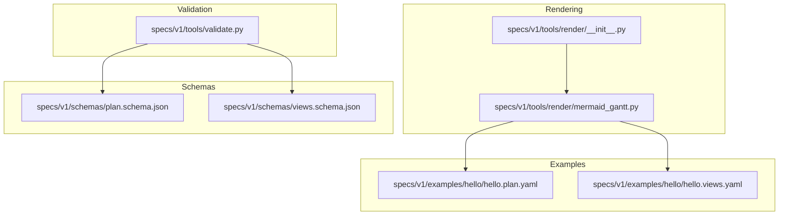
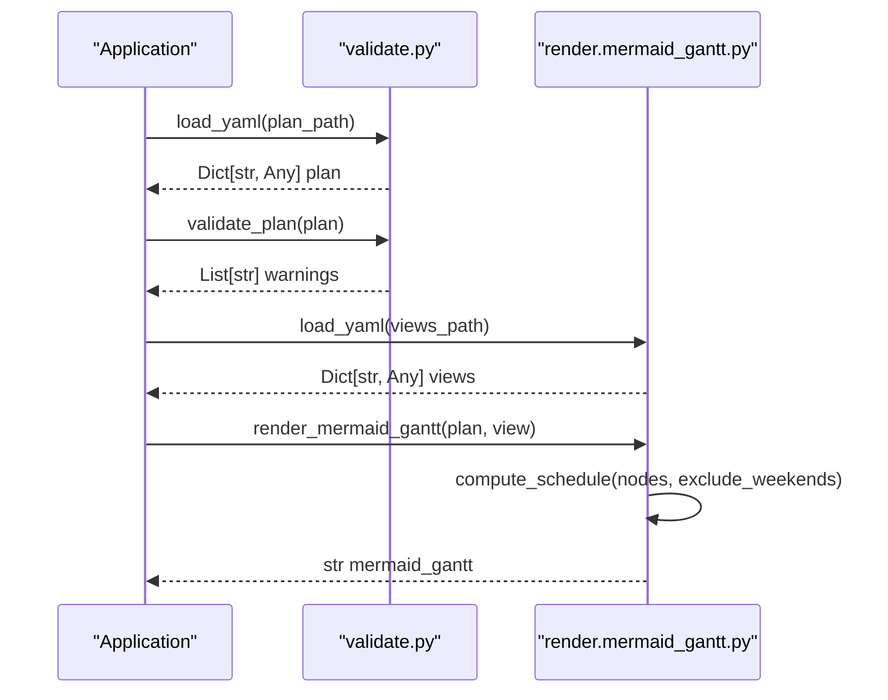
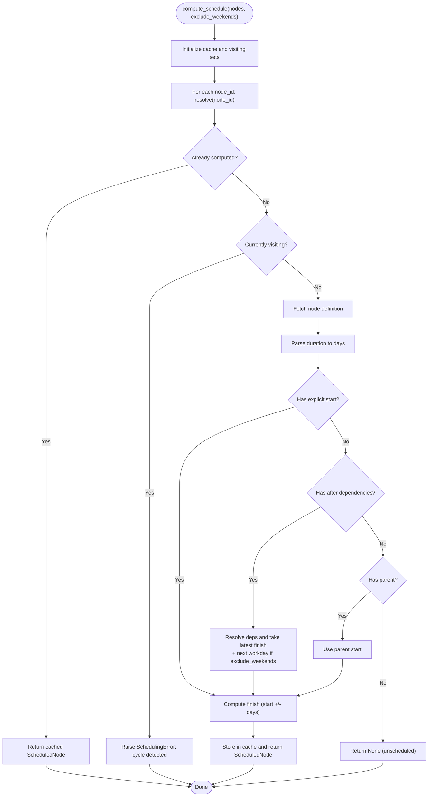
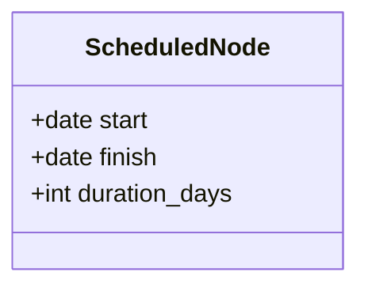
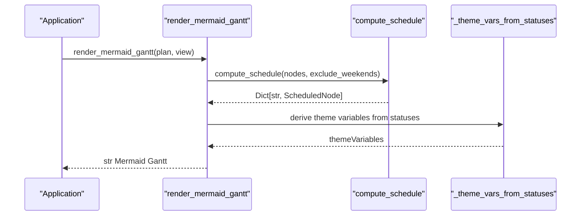
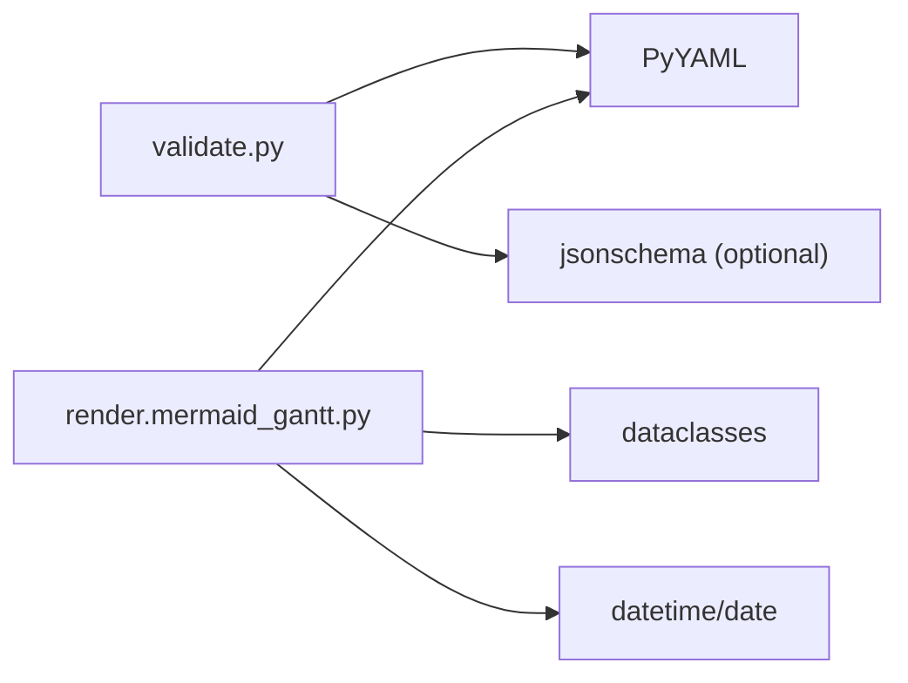

# Python API Reference

<cite>
**Referenced Files in This Document**
- [validate.py](file://specs/v1/tools/validate.py)
- [mermaid_gantt.py](file://specs/v1/tools/render/mermaid_gantt.py)
- [__init__.py](file://specs/v1/tools/render/__init__.py)
- [plan.schema.json](file://specs/v1/schemas/plan.schema.json)
- [views.schema.json](file://specs/v1/schemas/views.schema.json)
- [60-validation.md](file://specs/v1/spec/60-validation.md)
- [50-scheduling.md](file://specs/v1/spec/50-scheduling.md)
- [SPEC.md](file://specs/v1/SPEC.md)
- [hello.plan.yaml](file://specs/v1/examples/hello/hello.plan.yaml)
- [hello.views.yaml](file://specs/v1/examples/hello/hello.views.yaml)
</cite>

## Table of Contents
1. [Introduction](#introduction)
2. [Project Structure](#project-structure)
3. [Core Components](#core-components)
4. [Architecture Overview](#architecture-overview)
5. [Detailed Component Analysis](#detailed-component-analysis)
6. [Dependency Analysis](#dependency-analysis)
7. [Performance Considerations](#performance-considerations)
8. [Troubleshooting Guide](#troubleshooting-guide)
9. [Conclusion](#conclusion)
10. [Appendices](#appendices)

## Introduction
This document provides a comprehensive Python API reference for Opskarta’s programmatic interfaces. It focuses on:
- Validation API: validate_plan() and related helpers, including ValidationError exception handling and validation result semantics.
- Rendering API: compute_schedule() and ScheduledNode data structure, plus render_mermaid_gantt() and its configuration options.
- Data structures, function signatures, parameters, return values, and usage patterns.
- Error handling, propagation, and integration guidance for embedding Opskarta in larger applications.
- Performance characteristics, memory usage, and threading safety considerations.
- Practical examples and best practices for common integration scenarios.

## Project Structure
Opskarta exposes two primary Python packages:
- Validation tools: validate.py
- Rendering tools: render package with mermaid_gantt renderer

**Diagram sources**
- [validate.py](file://specs/v1/tools/validate.py#L1-L752)
- [mermaid_gantt.py](file://specs/v1/tools/render/mermaid_gantt.py#L1-L549)
- [__init__.py](file://specs/v1/tools/render/__init__.py#L1-L14)
- [plan.schema.json](file://specs/v1/schemas/plan.schema.json#L1-L86)
- [views.schema.json](file://specs/v1/schemas/views.schema.json#L1-L26)
- [hello.plan.yaml](file://specs/v1/examples/hello/hello.plan.yaml#L1-L44)
- [hello.views.yaml](file://specs/v1/examples/hello/hello.views.yaml#L1-L13)

**Section sources**
- [validate.py](file://specs/v1/tools/validate.py#L1-L752)
- [mermaid_gantt.py](file://specs/v1/tools/render/mermaid_gantt.py#L1-L549)
- [__init__.py](file://specs/v1/tools/render/__init__.py#L1-L14)

## Core Components
- Validation API
  - validate_plan(plan: Dict[str, Any]) -> List[str]: Validates plan semantics and returns warnings.
  - ValidationError: Exception class with path, value, expected, and available fields.
  - Related helpers: load_yaml(), load_json_schema(), validate_with_schema().
- Rendering API
  - compute_schedule(nodes: Dict[str, Dict[str, Any]], exclude_weekends: bool) -> Dict[str, ScheduledNode]
  - ScheduledNode: dataclass with start, finish, duration_days
  - render_mermaid_gantt(*, plan: Dict[str, Any], view: Dict[str, Any]) -> str

**Section sources**
- [validate.py](file://specs/v1/tools/validate.py#L135-L329)
- [validate.py](file://specs/v1/tools/validate.py#L30-L63)
- [validate.py](file://specs/v1/tools/validate.py#L586-L618)
- [mermaid_gantt.py](file://specs/v1/tools/render/mermaid_gantt.py#L217-L294)
- [mermaid_gantt.py](file://specs/v1/tools/render/mermaid_gantt.py#L209-L215)
- [mermaid_gantt.py](file://specs/v1/tools/render/mermaid_gantt.py#L349-L433)

## Architecture Overview
The validation and rendering APIs operate on parsed dictionaries derived from YAML/JSON files. Validation ensures structural correctness and semantic integrity, while rendering computes schedules and produces Mermaid Gantt output.

**Diagram sources**
- [validate.py](file://specs/v1/tools/validate.py#L69-L111)
- [validate.py](file://specs/v1/tools/validate.py#L135-L329)
- [mermaid_gantt.py](file://specs/v1/tools/render/mermaid_gantt.py#L49-L86)
- [mermaid_gantt.py](file://specs/v1/tools/render/mermaid_gantt.py#L349-L433)
- [mermaid_gantt.py](file://specs/v1/tools/render/mermaid_gantt.py#L217-L294)

## Detailed Component Analysis

### Validation API

#### validate_plan(plan: Dict[str, Any]) -> List[str]
- Purpose: Performs semantic validation of the plan dictionary.
- Parameters:
  - plan: Root dictionary parsed from plan.yaml.
- Returns:
  - List[str]: Non-fatal warnings collected during validation.
- Exceptions:
  - Raises ValidationError on critical errors (e.g., missing fields, invalid types, cycles).
- Behavior highlights:
  - Checks version and nodes presence.
  - Validates each node’s title, parent, after, status, start, and duration formats.
  - Detects cycles in parent and after relationships.
  - Returns warnings for unsupported version values.

Usage example (conceptual):
- Load plan YAML into a dict.
- Call validate_plan(plan).
- Handle ValidationError if raised; process returned warnings.

Integration pattern:
- Use in CI pipelines to gate merges on valid plans.
- Wrap in try/except to capture ValidationError and present user-friendly messages.

**Section sources**
- [validate.py](file://specs/v1/tools/validate.py#L135-L329)

#### ValidationError
- Purpose: Standardized exception for validation failures.
- Fields:
  - message: Human-readable error description.
  - path: Dot-separated path to the problematic field.
  - value: Actual value encountered.
  - expected: Expected type/format.
  - available: Suggested candidates for reference fields.
- Formatting:
  - Provides a formatted string combining message, path, value, expected, and available entries.

Usage example (conceptual):
- Catch ValidationError and log/print formatted message.
- Propagate to caller or convert to application-specific error.

**Section sources**
- [validate.py](file://specs/v1/tools/validate.py#L30-L63)

#### Related Helpers
- load_yaml(file_path: Path) -> Dict[str, Any]
  - Loads YAML safely; raises ValidationError on errors.
- load_json_schema(schema_path: Path) -> Dict[str, Any]
  - Loads JSON Schema file; raises ValidationError on errors.
- validate_with_schema(data: Dict[str, Any], schema: Dict[str, Any], file_type: str) -> List[str]
  - Validates via JSON Schema; raises ValidationError on mismatch.

**Section sources**
- [validate.py](file://specs/v1/tools/validate.py#L69-L111)
- [validate.py](file://specs/v1/tools/validate.py#L113-L129)
- [validate.py](file://specs/v1/tools/validate.py#L586-L618)

#### Validation Rules and Semantics
- Plan-level:
  - version must be integer; nodes must be an object; title required for each node.
- References:
  - parent must reference an existing node_id; cycles forbidden.
  - after must reference existing node_ids; cycles forbidden.
  - status must reference an existing key in statuses.
- Formats:
  - start must match YYYY-MM-DD.
  - duration must match <number>d or <number>w.

**Section sources**
- [60-validation.md](file://specs/v1/spec/60-validation.md#L5-L80)
- [60-validation.md](file://specs/v1/spec/60-validation.md#L82-L115)
- [SPEC.md](file://specs/v1/SPEC.md#L241-L380)

### Rendering API

#### compute_schedule(nodes: Dict[str, Dict[str, Any]], exclude_weekends: bool) -> Dict[str, ScheduledNode]
- Purpose: Computes start/finish dates and durations for nodes considering explicit start, after dependencies, and parent inheritance.
- Parameters:
  - nodes: Dictionary of node definitions from plan.
  - exclude_weekends: Boolean controlling whether weekends are excluded from duration calculations.
- Returns:
  - Dict[str, ScheduledNode]: Mapping from node_id to ScheduledNode with computed dates and duration.
- Exceptions:
  - Raises SchedulingError on cycles, missing nodes, or invalid durations.
- Notes:
  - Nodes without explicit start and after are considered un-scheduled and omitted from the result.
  - Duration semantics: 1 day includes the start day; excludes_weekends affects workday arithmetic.

**Diagram sources**
- [mermaid_gantt.py](file://specs/v1/tools/render/mermaid_gantt.py#L217-L294)

**Section sources**
- [mermaid_gantt.py](file://specs/v1/tools/render/mermaid_gantt.py#L217-L294)

#### ScheduledNode
- Purpose: Immutable data structure representing a scheduled node.
- Fields:
  - start: date
  - finish: date
  - duration_days: int
- Usage:
  - Returned by compute_schedule(); consumed by render_mermaid_gantt().

**Diagram sources**
- [mermaid_gantt.py](file://specs/v1/tools/render/mermaid_gantt.py#L209-L215)

**Section sources**
- [mermaid_gantt.py](file://specs/v1/tools/render/mermaid_gantt.py#L209-L215)

#### render_mermaid_gantt(*, plan: Dict[str, Any], view: Dict[str, Any]) -> str
- Purpose: Generates a Mermaid Gantt diagram from a plan and a selected view.
- Parameters:
  - plan: Parsed plan dictionary.
  - view: Single view from gantt_views.
- Options (from view):
  - title: Diagram title.
  - date_format: Date format string.
  - axis_format: Axis format string.
  - excludes: List containing "weekends" to adjust scheduling.
- Behavior:
  - Computes schedule via compute_schedule().
  - Builds Mermaid Gantt text with theme variables derived from statuses.
  - Skips unscheduled nodes (no explicit start).
- Exceptions:
  - Raises SchedulingError for scheduling issues.
  - Raises RenderError for rendering issues.

**Diagram sources**
- [mermaid_gantt.py](file://specs/v1/tools/render/mermaid_gantt.py#L349-L433)
- [mermaid_gantt.py](file://specs/v1/tools/render/mermaid_gantt.py#L217-L294)
- [mermaid_gantt.py](file://specs/v1/tools/render/mermaid_gantt.py#L317-L347)

**Section sources**
- [mermaid_gantt.py](file://specs/v1/tools/render/mermaid_gantt.py#L349-L433)

### Data Structures and Schemas

#### Plan Schema (plan.schema.json)
- Root fields:
  - version: integer (required)
  - meta: object (required)
    - id: string (required)
    - title: string (required)
  - statuses: object (optional)
  - nodes: object (required)
    - Additional properties allowed; each node object requires title.
- Additional properties allowed at top level and node level.

**Section sources**
- [plan.schema.json](file://specs/v1/schemas/plan.schema.json#L1-L86)

#### Views Schema (views.schema.json)
- Root fields:
  - version: integer (required)
  - project: string (required)
  - gantt_views: object (optional)
- Additional properties allowed.

**Section sources**
- [views.schema.json](file://specs/v1/schemas/views.schema.json#L1-L26)

#### Example Files
- hello.plan.yaml demonstrates version, meta, statuses, nodes with parent/after/start/duration.
- hello.views.yaml demonstrates version, project, gantt_views with title, excludes, lanes, and nodes.

**Section sources**
- [hello.plan.yaml](file://specs/v1/examples/hello/hello.plan.yaml#L1-L44)
- [hello.views.yaml](file://specs/v1/examples/hello/hello.views.yaml#L1-L13)

## Dependency Analysis
- Validation depends on:
  - PyYAML for YAML parsing.
  - Optional jsonschema for schema validation.
- Rendering depends on:
  - PyYAML for YAML parsing.
  - datetime/date for date arithmetic.
  - dataclasses for ScheduledNode.

**Diagram sources**
- [validate.py](file://specs/v1/tools/validate.py#L77-L81)
- [validate.py](file://specs/v1/tools/validate.py#L599-L605)
- [mermaid_gantt.py](file://specs/v1/tools/render/mermaid_gantt.py#L62-L68)
- [mermaid_gantt.py](file://specs/v1/tools/render/mermaid_gantt.py#L20-L23)

**Section sources**
- [validate.py](file://specs/v1/tools/validate.py#L77-L81)
- [validate.py](file://specs/v1/tools/validate.py#L599-L605)
- [mermaid_gantt.py](file://specs/v1/tools/render/mermaid_gantt.py#L62-L68)
- [mermaid_gantt.py](file://specs/v1/tools/render/mermaid_gantt.py#L20-L23)

## Performance Considerations
- Validation:
  - O(N + E) where N is number of nodes and E is number of edges (after dependencies). Cycles are detected via DFS with state tracking.
  - Memory usage proportional to recursion depth and visited sets; acceptable for typical project sizes.
- Rendering:
  - compute_schedule uses memoization (cache) to avoid recomputation; worst-case recursion equals number of nodes.
  - Date arithmetic is constant-time per node.
  - Memory usage is linear in number of nodes plus recursion stack depth.
- Threading:
  - Both APIs are pure functions with no shared mutable state; safe for concurrent use across threads.
  - External libraries (PyYAML, jsonschema) are assumed thread-safe; ensure global interpreter locks do not cause contention.

[No sources needed since this section provides general guidance]

## Troubleshooting Guide
Common issues and resolutions:
- ValidationError with path and expected fields:
  - Use path to locate the issue in the YAML.
  - Fix type/format according to expected values.
- SchedulingError during compute_schedule:
  - Indicates cycles in after dependencies or missing nodes referenced by after.
  - Review after lists and parent references.
- RenderError/SchedulingError in render_mermaid_gantt:
  - Typically due to invalid node references in view.lanes.nodes or unresolved start/duration.
  - Ensure all node IDs exist in plan.nodes and view.project matches plan.meta.id.

Integration tips:
- Wrap API calls in try/except blocks to catch exceptions and present actionable messages.
- Normalize inputs (e.g., strip whitespace in dates) before passing to APIs.
- Validate with both semantic and schema levels for robustness.

**Section sources**
- [validate.py](file://specs/v1/tools/validate.py#L30-L63)
- [mermaid_gantt.py](file://specs/v1/tools/render/mermaid_gantt.py#L30-L43)
- [60-validation.md](file://specs/v1/spec/60-validation.md#L124-L140)

## Conclusion
Opskarta’s Python APIs provide a clean separation between validation and rendering:
- validate_plan() ensures structural and semantic integrity with precise error reporting.
- compute_schedule() and render_mermaid_gantt() enable deterministic, repeatable Gantt generation with clear configuration options.
Adopting these APIs in larger applications enables robust CI checks, automated report generation, and extensible integrations.

[No sources needed since this section summarizes without analyzing specific files]

## Appendices

### API Index
- Validation
  - validate_plan(plan: Dict[str, Any]) -> List[str]
  - ValidationError(message: str, path: Optional[str], value: Any, expected: Optional[str], available: Optional[List[str]])
  - load_yaml(file_path: Path) -> Dict[str, Any]
  - load_json_schema(schema_path: Path) -> Dict[str, Any]
  - validate_with_schema(data: Dict[str, Any], schema: Dict[str, Any], file_type: str) -> List[str]
- Rendering
  - compute_schedule(nodes: Dict[str, Dict[str, Any]], exclude_weekends: bool) -> Dict[str, ScheduledNode]
  - ScheduledNode(start: date, finish: date, duration_days: int)
  - render_mermaid_gantt(*, plan: Dict[str, Any], view: Dict[str, Any]) -> str

**Section sources**
- [validate.py](file://specs/v1/tools/validate.py#L135-L329)
- [validate.py](file://specs/v1/tools/validate.py#L30-L63)
- [validate.py](file://specs/v1/tools/validate.py#L586-L618)
- [mermaid_gantt.py](file://specs/v1/tools/render/mermaid_gantt.py#L217-L294)
- [mermaid_gantt.py](file://specs/v1/tools/render/mermaid_gantt.py#L209-L215)
- [mermaid_gantt.py](file://specs/v1/tools/render/mermaid_gantt.py#L349-L433)

### Example Workflows
- Validate a plan and views:
  - Load plan and views YAML into dicts.
  - Call validate_plan(plan) and validate_views(views, plan).
  - Handle ValidationError and process warnings.
- Generate a Mermaid Gantt:
  - Load plan and views YAML.
  - Select a view from gantt_views.
  - Call render_mermaid_gantt(plan=plan, view=view).
  - Save or stream the resulting string.

**Section sources**
- [validate.py](file://specs/v1/tools/validate.py#L69-L111)
- [validate.py](file://specs/v1/tools/validate.py#L431-L579)
- [mermaid_gantt.py](file://specs/v1/tools/render/mermaid_gantt.py#L49-L86)
- [mermaid_gantt.py](file://specs/v1/tools/render/mermaid_gantt.py#L349-L433)