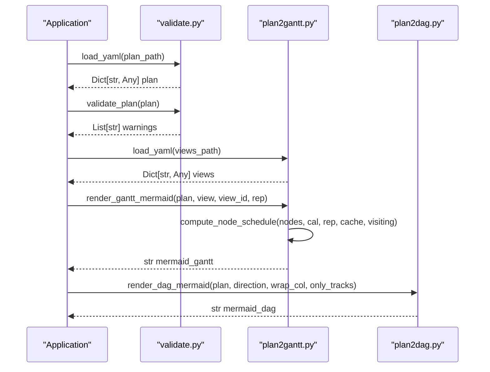
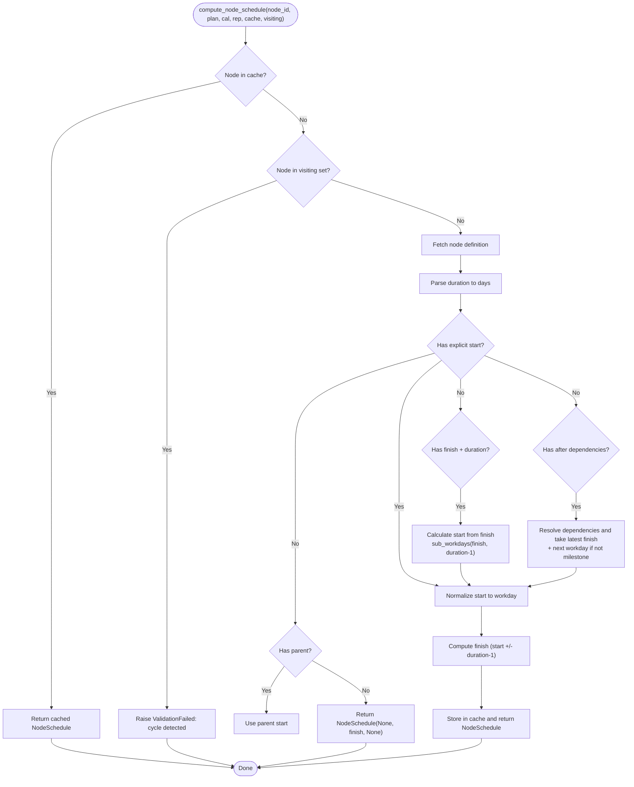
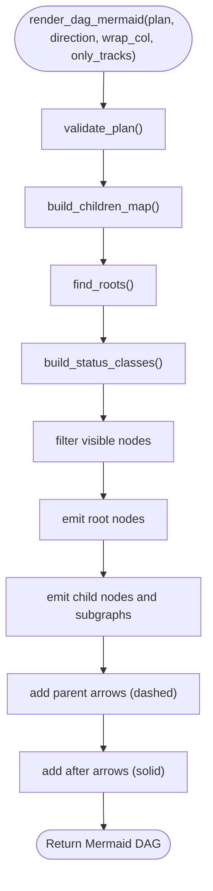
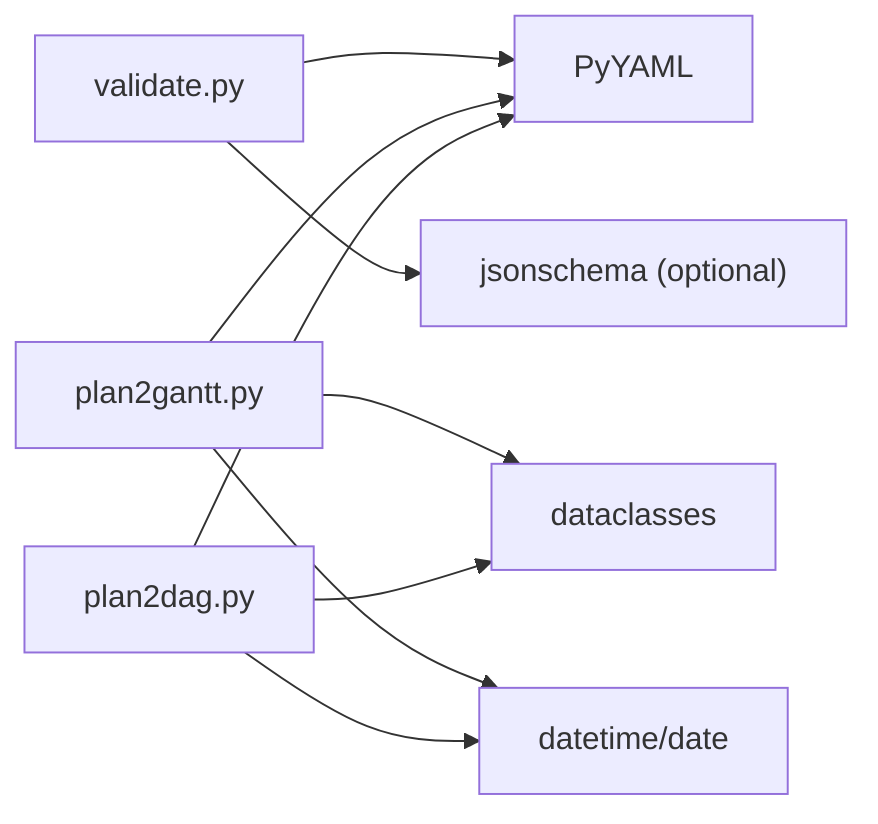

# Python API Reference

<cite>
**Referenced Files in This Document**
- [validate.py](file://specs/v1/tools/validate.py)
- [plan2gantt.py](file://specs/v1/tools/render/plan2gantt.py)
- [plan2dag.py](file://specs/v1/tools/render/plan2dag.py)
- [__init__.py](file://specs/v1/tools/render/__init__.py)
- [plan.schema.json](file://specs/v1/schemas/plan.schema.json)
- [views.schema.json](file://specs/v1/schemas/views.schema.json)
- [SPEC.md](file://specs/v1/SPEC.md)
- [60-validation.md](file://specs/v1/spec/60-validation.md)
- [50-scheduling.md](file://specs/v1/spec/50-scheduling.md)
- [hello.plan.yaml](file://specs/v1/examples/hello/hello.plan.yaml)
- [hello.views.yaml](file://specs/v1/examples/hello/hello.views.yaml)
</cite>

## Update Summary
**Changes Made**
- Updated rendering API documentation to reflect migration from `render_mermaid_gantt()` to `plan2gantt()` module
- Added comprehensive documentation for new `render_gantt_mermaid()` function with enhanced functionality
- Documented new `render_dag_mermaid()` function for Mermaid DAG flowchart generation
- Documented new `Reporter` class with enhanced error reporting capabilities
- Documented new `ValidationFailed` exception for improved error handling
- Enhanced calendar system documentation with weekend exclusion support and automatic date calculation
- Added documentation for status-based color coding and milestone support
- Updated API signatures and function parameters to reflect new implementation
- Enhanced error handling documentation with new `ValidationFailed` exception

## Table of Contents
1. [Introduction](#introduction)
2. [Project Structure](#project-structure)
3. [Core Components](#core-components)
4. [Architecture Overview](#architecture-overview)
5. [Detailed Component Analysis](#detailed-component-analysis)
6. [Dependency Analysis](#dependency-analysis)
7. [Performance Considerations](#performance-considerations)
8. [Troubleshooting Guide](#troubleshooting-guide)
9. [Conclusion](#conclusion)
10. [Appendices](#appendices)

## Introduction
This document provides a comprehensive Python API reference for Opskarta's programmatic interfaces. It focuses on:
- Validation API: validate_plan() and related helpers, including ValidationError exception handling and validation result semantics.
- Rendering API: compute_schedule() and ScheduledNode data structure, plus the new plan2gantt module with enhanced functionality including automatic date calculation, weekend exclusion support, and status-based color coding.
- DAG rendering API: render_dag_mermaid() for generating Mermaid flowcharts from plan files.
- Data structures, function signatures, parameters, return values, and usage patterns.
- Error handling, propagation, and integration guidance for embedding Opskarta in larger applications.
- Performance characteristics, memory usage, and threading safety considerations.
- Practical examples and best practices for common integration scenarios.

## Project Structure
Opskarta exposes two primary Python packages:
- Validation tools: validate.py
- Rendering tools: render package with plan2gantt and plan2dag modules

**Diagram sources**
- [validate.py](file://specs/v1/tools/validate.py#L1-L1082)
- [plan2gantt.py](file://specs/v1/tools/render/plan2gantt.py#L1-L1026)
- [plan2dag.py](file://specs/v1/tools/render/plan2dag.py#L1-L621)
- [__init__.py](file://specs/v1/tools/render/__init__.py#L1-L24)

**Section sources**
- [validate.py](file://specs/v1/tools/validate.py#L1-L1082)
- [plan2gantt.py](file://specs/v1/tools/render/plan2gantt.py#L1-L1026)
- [plan2dag.py](file://specs/v1/tools/render/plan2dag.py#L1-L621)
- [__init__.py](file://specs/v1/tools/render/__init__.py#L1-L24)

## Core Components
- Validation API
  - validate_plan(plan: Dict[str, Any]) -> Tuple[List[str], List[str]]: Validates plan semantics and returns warnings and informational messages.
  - ValidationError: Exception class with message, path, value, expected, and available fields.
  - Related helpers: load_yaml(), load_json_schema(), validate_with_schema().
- Rendering API
  - compute_schedule(nodes: Dict[str, Dict[str, Any]], exclude_weekends: bool) -> Dict[str, ScheduledNode]
  - ScheduledNode: dataclass with start, finish, duration_days
  - render_gantt_mermaid(plan: Dict[str, Any], view: Dict[str, Any], view_id: str, rep: Reporter) -> str
  - render_dag_mermaid(plan: Dict[str, Any], direction: str = "LR", wrap_col: Optional[int] = None, only_tracks: Optional[Set[str]] = None) -> str
- Error Reporting
  - Reporter: Class with error(), warn(), info(), and raise_if_errors() methods for structured error reporting.
  - ValidationFailed: Exception class for validation failures in rendering operations.

**Section sources**
- [validate.py](file://specs/v1/tools/validate.py#L262-L558)
- [validate.py](file://specs/v1/tools/validate.py#L36-L68)
- [validate.py](file://specs/v1/tools/validate.py#L136-L192)
- [plan2gantt.py](file://specs/v1/tools/render/plan2gantt.py#L847-L950)
- [plan2gantt.py](file://specs/v1/tools/render/plan2gantt.py#L601-L606)
- [plan2gantt.py](file://specs/v1/tools/render/plan2gantt.py#L53-L78)
- [plan2dag.py](file://specs/v1/tools/render/plan2dag.py#L374-L579)

## Architecture Overview
The validation and rendering APIs operate on parsed dictionaries derived from YAML/JSON files. Validation ensures structural correctness and semantic integrity, while rendering computes schedules and produces Mermaid Gantt and DAG output with enhanced calendar support and status-based theming.

**Diagram sources**
- [validate.py](file://specs/v1/tools/validate.py#L136-L192)
- [validate.py](file://specs/v1/tools/validate.py#L262-L558)
- [plan2gantt.py](file://specs/v1/tools/render/plan2gantt.py#L957-L1025)
- [plan2gantt.py](file://specs/v1/tools/render/plan2gantt.py#L847-L950)
- [plan2dag.py](file://specs/v1/tools/render/plan2dag.py#L584-L621)

## Detailed Component Analysis

### Validation API

#### validate_plan(plan: Dict[str, Any]) -> Tuple[List[str], List[str]]
- Purpose: Performs semantic validation of the plan dictionary.
- Parameters:
  - plan: Root dictionary parsed from plan.yaml.
- Returns:
  - Tuple[List[str], List[str]]: Non-fatal warnings and informational messages collected during validation.
- Exceptions:
  - Raises ValidationError on critical errors (e.g., missing fields, invalid types, cycles).
- Behavior highlights:
  - Checks version and nodes presence.
  - Validates each node's title, parent, after, status, start, and duration formats.
  - Detects cycles in parent and after relationships.
  - Returns warnings for unsupported version values.

Usage example (conceptual):
- Load plan YAML into a dict.
- Call validate_plan(plan).
- Handle ValidationError if raised; process returned warnings.

Integration pattern:
- Use in CI pipelines to gate merges on valid plans.
- Wrap in try/except to capture ValidationError and present user-friendly messages.

**Section sources**
- [validate.py](file://specs/v1/tools/validate.py#L262-L558)

#### ValidationError
- Purpose: Standardized exception for validation failures.
- Fields:
  - message: Human-readable error description.
  - path: Dot-separated path to the problematic field.
  - value: Actual value encountered.
  - expected: Expected type/format.
  - available: Suggested candidates for reference fields.
- Formatting:
  - Provides a formatted string combining message, path, value, expected, and available entries.

Usage example (conceptual):
- Catch ValidationError and log/print formatted message.
- Propagate to caller or convert to application-specific error.

**Section sources**
- [validate.py](file://specs/v1/tools/validate.py#L36-L68)

#### Related Helpers
- load_yaml(file_path: Path) -> Dict[str, Any]
  - Loads YAML safely; raises ValidationError on errors.
- load_json_schema(schema_path: Path) -> Dict[str, Any]
  - Loads JSON Schema file; raises ValidationError on errors.
- validate_with_schema(data: Dict[str, Any], schema: Dict[str, Any], file_type: str) -> List[str]
  - Validates via JSON Schema; raises ValidationError on mismatch.

**Section sources**
- [validate.py](file://specs/v1/tools/validate.py#L136-L192)
- [validate.py](file://specs/v1/tools/validate.py#L194-L210)
- [validate.py](file://specs/v1/tools/validate.py#L907-L939)

#### Validation Rules and Semantics
- Plan-level:
  - version must be integer; nodes must be an object; title required for each node.
- References:
  - parent must reference an existing node_id; cycles forbidden.
  - after must reference existing node_ids; cycles forbidden.
  - status must reference an existing key in statuses.
- Formats:
  - start must match YYYY-MM-DD.
  - duration must match <number>d or <number>w.

**Section sources**
- [60-validation.md](file://specs/v1/spec/60-validation.md#L5-L80)
- [60-validation.md](file://specs/v1/spec/60-validation.md#L82-L115)
- [SPEC.md](file://specs/v1/SPEC.md#L241-L380)

### Rendering API

#### compute_node_schedule(node_id: str, plan: Dict[str, Any], cal: Calendar, rep: Reporter, cache: Dict[str, NodeSchedule], visiting: Set[str]) -> NodeSchedule
- Purpose: Computes start/finish dates and durations for individual nodes considering explicit start, after dependencies, and parent inheritance.
- Parameters:
  - node_id: ID of the node to compute schedule for.
  - plan: Complete plan dictionary containing all nodes.
  - cal: Calendar object with weekend exclusion and custom date exclusions.
  - rep: Reporter object for logging warnings and errors.
  - cache: Memoization cache to avoid recomputation.
  - visiting: Set tracking nodes currently being processed to detect cycles.
- Returns:
  - NodeSchedule: Dataclass containing computed start, finish, and duration.
- Exceptions:
  - Raises ValidationFailed on cycles, missing nodes, or invalid durations.
- Notes:
  - Handles multiple scheduling strategies: explicit start, finish+duration, after dependencies, and parent anchoring.
  - Supports milestone nodes with special handling.

**Diagram sources**
- [plan2gantt.py](file://specs/v1/tools/render/plan2gantt.py#L608-L791)

**Section sources**
- [plan2gantt.py](file://specs/v1/tools/render/plan2gantt.py#L608-L791)

#### NodeSchedule
- Purpose: Immutable data structure representing a scheduled node.
- Fields:
  - start: Optional[date]
  - finish: Optional[date]
  - duration_days: Optional[int]
- Usage:
  - Returned by compute_node_schedule(); consumed by render_gantt_mermaid().

**Diagram sources**
- [plan2gantt.py](file://specs/v1/tools/render/plan2gantt.py#L601-L606)

**Section sources**
- [plan2gantt.py](file://specs/v1/tools/render/plan2gantt.py#L601-L606)

#### render_gantt_mermaid(plan: Dict[str, Any], view: Dict[str, Any], view_id: str, rep: Reporter) -> str
- Purpose: Generates a Mermaid Gantt diagram from a plan and a selected view with enhanced calendar support.
- Parameters:
  - plan: Parsed plan dictionary.
  - view: Single view from gantt_views.
  - view_id: Identifier of the view being rendered.
  - rep: Reporter object for logging warnings and errors.
- Options (from view):
  - title: Diagram title (fallbacks to plan meta title, then "opskarta gantt").
  - date_format: Date format string (default: "YYYY-MM-DD").
  - axis_format: Axis format string (optional).
  - tick_interval: Tick interval string (optional).
  - excludes: List containing "weekends" and/or specific dates to exclude.
- Behavior:
  - Builds calendar with weekend exclusion and custom date exclusions.
  - Computes schedules via compute_node_schedule() for all nodes in view lanes.
  - Generates Mermaid Gantt with theme variables derived from statuses.
  - Supports milestone nodes with "milestone" tag.
  - Skips unscheduled nodes (no explicit start).
- Exceptions:
  - Raises ValidationFailed for scheduling issues or invalid configurations.

**Diagram sources**
- [plan2gantt.py](file://specs/v1/tools/render/plan2gantt.py#L847-L950)
- [plan2gantt.py](file://specs/v1/tools/render/plan2gantt.py#L161-L195)
- [plan2gantt.py](file://specs/v1/tools/render/plan2gantt.py#L818-L834)

**Section sources**
- [plan2gantt.py](file://specs/v1/tools/render/plan2gantt.py#L847-L950)

#### render_dag_mermaid(plan: Dict[str, Any], direction: str = "LR", wrap_col: Optional[int] = None, only_tracks: Optional[Set[str]] = None) -> str
- Purpose: Generates a Mermaid DAG (flowchart) from a plan with parent-child relationships and dependencies.
- Parameters:
  - plan: Parsed plan dictionary.
  - direction: Graph direction ("LR", "TB", "BT", "RL").
  - wrap_col: Column width for text wrapping in node labels.
  - only_tracks: Set of node IDs to limit the diagram to specific tracks.
- Behavior:
  - Validates plan structure and builds children map from parent relationships.
  - Generates hierarchical flowchart with subgraphs for parent-child relationships.
  - Adds dependency arrows for "after" relationships.
  - Applies status-based coloring to nodes.
  - Supports filtering by specific tracks.
- Returns:
  - String containing complete Mermaid DAG specification.

**Diagram sources**
- [plan2dag.py](file://specs/v1/tools/render/plan2dag.py#L374-L579)
- [plan2dag.py](file://specs/v1/tools/render/plan2dag.py#L266-L283)
- [plan2dag.py](file://specs/v1/tools/render/plan2dag.py#L288-L306)

**Section sources**
- [plan2dag.py](file://specs/v1/tools/render/plan2dag.py#L374-L579)

### Error Reporting System

#### Reporter Class
- Purpose: Centralized error reporting system for rendering operations.
- Methods:
  - error(msg: str) -> None: Logs error and increments error counter.
  - warn(msg: str) -> None: Logs warning and increments warning counter.
  - info(msg: str) -> None: Logs informational message and increments info counter.
  - raise_if_errors() -> None: Raises ValidationFailed if any errors were logged.
- Usage:
  - Passed to all validation and rendering functions for consistent error reporting.

#### ValidationFailed Exception
- Purpose: Exception raised when validation fails in rendering operations.
- Behavior:
  - Raised when reporter detects errors during validation.
  - Contains human-readable error messages with context.
  - Used to signal failure to calling applications.

**Section sources**
- [plan2gantt.py](file://specs/v1/tools/render/plan2gantt.py#L53-L78)
- [plan2gantt.py](file://specs/v1/tools/render/plan2gantt.py#L75-L78)

### Data Structures and Schemas

#### Plan Schema (plan.schema.json)
- Root fields:
  - version: integer (required)
  - meta: object (required)
    - id: string (required)
    - title: string (required)
  - statuses: object (optional)
  - nodes: object (required)
    - Additional properties allowed; each node object requires title.
- Additional properties allowed at top level and node level.

**Section sources**
- [plan.schema.json](file://specs/v1/schemas/plan.schema.json#L1-L86)

#### Views Schema (views.schema.json)
- Root fields:
  - version: integer (required)
  - project: string (required)
  - gantt_views: object (optional)
- Additional properties allowed.

**Section sources**
- [views.schema.json](file://specs/v1/schemas/views.schema.json#L1-L26)

#### Example Files
- hello.plan.yaml demonstrates version, meta, statuses, nodes with parent/after/start/duration.
- hello.views.yaml demonstrates version, project, gantt_views with title, excludes, lanes, and nodes.

**Section sources**
- [hello.plan.yaml](file://specs/v1/examples/hello/hello.plan.yaml#L1-L44)
- [hello.views.yaml](file://specs/v1/examples/hello/hello.views.yaml#L1-L13)

## Dependency Analysis
- Validation depends on:
  - PyYAML for YAML parsing.
  - Optional jsonschema for schema validation.
- Rendering depends on:
  - PyYAML for YAML parsing.
  - datetime/date for date arithmetic.
  - dataclasses for NodeSchedule.

**Diagram sources**
- [validate.py](file://specs/v1/tools/validate.py#L144-L150)
- [validate.py](file://specs/v1/tools/validate.py#L920-L926)
- [plan2gantt.py](file://specs/v1/tools/render/plan2gantt.py#L39-L41)
- [plan2gantt.py](file://specs/v1/tools/render/plan2gantt.py#L36-L38)
- [plan2dag.py](file://specs/v1/tools/render/plan2dag.py#L17-L21)

**Section sources**
- [validate.py](file://specs/v1/tools/validate.py#L144-L150)
- [validate.py](file://specs/v1/tools/validate.py#L920-L926)
- [plan2gantt.py](file://specs/v1/tools/render/plan2gantt.py#L39-L41)
- [plan2gantt.py](file://specs/v1/tools/render/plan2gantt.py#L36-L38)
- [plan2dag.py](file://specs/v1/tools/render/plan2dag.py#L17-L21)

## Performance Considerations
- Validation:
  - O(N + E) where N is number of nodes and E is number of edges (after dependencies). Cycles are detected via DFS with state tracking.
  - Memory usage proportional to recursion depth and visited sets; acceptable for typical project sizes.
- Rendering:
  - compute_node_schedule uses memoization (cache) to avoid recomputation; worst-case recursion equals number of nodes.
  - Date arithmetic is constant-time per node with calendar-aware workday calculations.
  - Memory usage is linear in number of nodes plus recursion stack depth.
- Threading:
  - Both APIs are pure functions with no shared mutable state; safe for concurrent use across threads.
  - External libraries (PyYAML, jsonschema) are assumed thread-safe; ensure global interpreter locks do not cause contention.

## Troubleshooting Guide
Common issues and resolutions:
- ValidationError with path and expected fields:
  - Use path to locate the issue in the YAML.
  - Fix type/format according to expected values.
- ValidationFailed during render_gantt_mermaid:
  - Indicates cycles in after dependencies, missing nodes, or invalid calendar configurations.
  - Review after lists, parent references, and view excludes settings.
- Calendar configuration issues:
  - Ensure "weekends" is properly formatted in excludes list.
  - Verify date formats in excludes follow YYYY-MM-DD pattern.
- Status-based theming problems:
  - Check that status colors are valid hex codes (#RRGGBB).
  - Ensure status references in nodes match defined statuses.
- DAG rendering issues:
  - Verify plan structure has valid parent-child relationships.
  - Check that requested tracks exist in the plan.
  - Ensure only_tracks parameter contains valid node IDs.

Integration tips:
- Wrap API calls in try/except blocks to catch exceptions and present actionable messages.
- Use Reporter object to capture detailed warnings and errors.
- Validate with both semantic and schema levels for robustness.
- Leverage the new calendar system for accurate workday calculations.
- Use render_dag_mermaid() for hierarchical visualization alongside render_gantt_mermaid().

**Section sources**
- [validate.py](file://specs/v1/tools/validate.py#L36-L68)
- [plan2gantt.py](file://specs/v1/tools/render/plan2gantt.py#L53-L78)
- [60-validation.md](file://specs/v1/spec/60-validation.md#L124-L140)

## Conclusion
Opskarta's Python APIs provide a clean separation between validation and rendering with enhanced capabilities:
- validate_plan() ensures structural and semantic integrity with precise error reporting.
- render_gantt_mermaid() enables sophisticated Gantt generation with calendar-aware scheduling, weekend exclusion support, and status-based theming.
- render_dag_mermaid() provides hierarchical visualization of parent-child relationships and dependencies.
- The new plan2gantt module offers improved functionality over previous render_mermaid_gantt implementation with better error handling and extensibility.
- The Reporter class and ValidationFailed exception provide structured error reporting for robust application integration.
Adopting these APIs in larger applications enables robust CI checks, automated report generation, and flexible integration with various project management workflows.

## Appendices

### API Index
- Validation
  - validate_plan(plan: Dict[str, Any]) -> Tuple[List[str], List[str]]
  - ValidationError(message: str, path: Optional[str], value: Any, expected: Optional[str], available: Optional[List[str]])
  - load_yaml(file_path: Path) -> Dict[str, Any]
  - load_json_schema(schema_path: Path) -> Dict[str, Any]
  - validate_with_schema(data: Dict[str, Any], schema: Dict[str, Any], file_type: str) -> List[str]
- Rendering
  - compute_node_schedule(node_id: str, plan: Dict[str, Any], cal: Calendar, rep: Reporter, cache: Dict[str, NodeSchedule], visiting: Set[str]) -> NodeSchedule
  - NodeSchedule(start: Optional[date], finish: Optional[date], duration_days: Optional[int])
  - render_gantt_mermaid(plan: Dict[str, Any], view: Dict[str, Any], view_id: str, rep: Reporter) -> str
  - render_dag_mermaid(plan: Dict[str, Any], direction: str = "LR", wrap_col: Optional[int] = None, only_tracks: Optional[Set[str]] = None) -> str
- Error Reporting
  - Reporter(error: int = 0, warnings: int = 0, infos: int = 0)
  - ValidationFailed

**Section sources**
- [validate.py](file://specs/v1/tools/validate.py#L262-L558)
- [validate.py](file://specs/v1/tools/validate.py#L36-L68)
- [validate.py](file://specs/v1/tools/validate.py#L136-L192)
- [plan2gantt.py](file://specs/v1/tools/render/plan2gantt.py#L608-L791)
- [plan2gantt.py](file://specs/v1/tools/render/plan2gantt.py#L601-L606)
- [plan2gantt.py](file://specs/v1/tools/render/plan2gantt.py#L847-L950)
- [plan2gantt.py](file://specs/v1/tools/render/plan2gantt.py#L53-L78)
- [plan2dag.py](file://specs/v1/tools/render/plan2dag.py#L374-L579)

### Example Workflows
- Validate a plan and views:
  - Load plan and views YAML into dicts.
  - Call validate_plan(plan) and validate_views(views, plan).
  - Handle ValidationError and process warnings.
- Generate a Mermaid Gantt with enhanced features:
  - Load plan and views YAML.
  - Select a view from gantt_views.
  - Call render_gantt_mermaid(plan=plan, view=view, view_id=view_id, rep=Reporter()).
  - Access calendar configuration, weekend exclusions, and status-based theming.
  - Save or stream the resulting string.
- Generate a Mermaid DAG:
  - Load plan YAML into dict.
  - Call render_dag_mermaid(plan, direction="LR", wrap_col=20, only_tracks=None).
  - Process returned Mermaid DAG string for display or export.

**Section sources**
- [validate.py](file://specs/v1/tools/validate.py#L136-L192)
- [validate.py](file://specs/v1/tools/validate.py#L719-L900)
- [plan2gantt.py](file://specs/v1/tools/render/plan2gantt.py#L957-L1025)
- [plan2gantt.py](file://specs/v1/tools/render/plan2gantt.py#L847-L950)
- [plan2dag.py](file://specs/v1/tools/render/plan2dag.py#L584-L621)