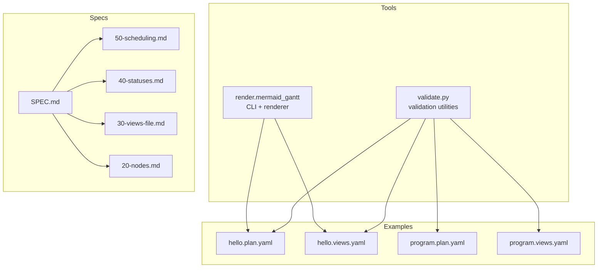
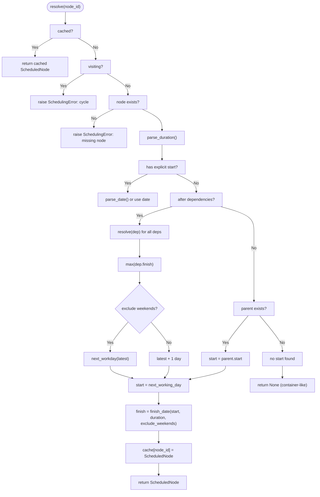
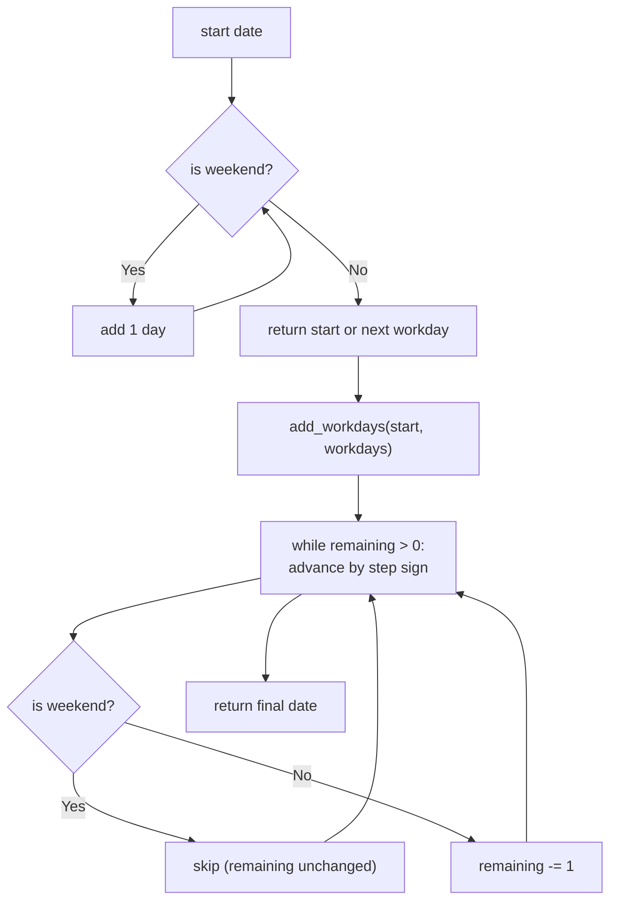
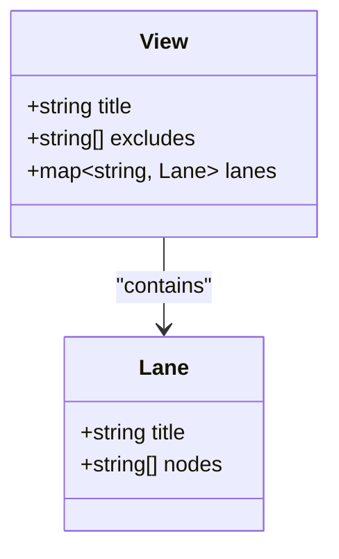
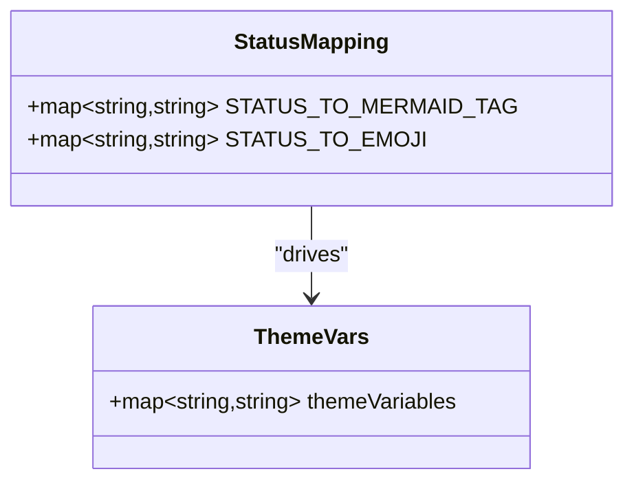
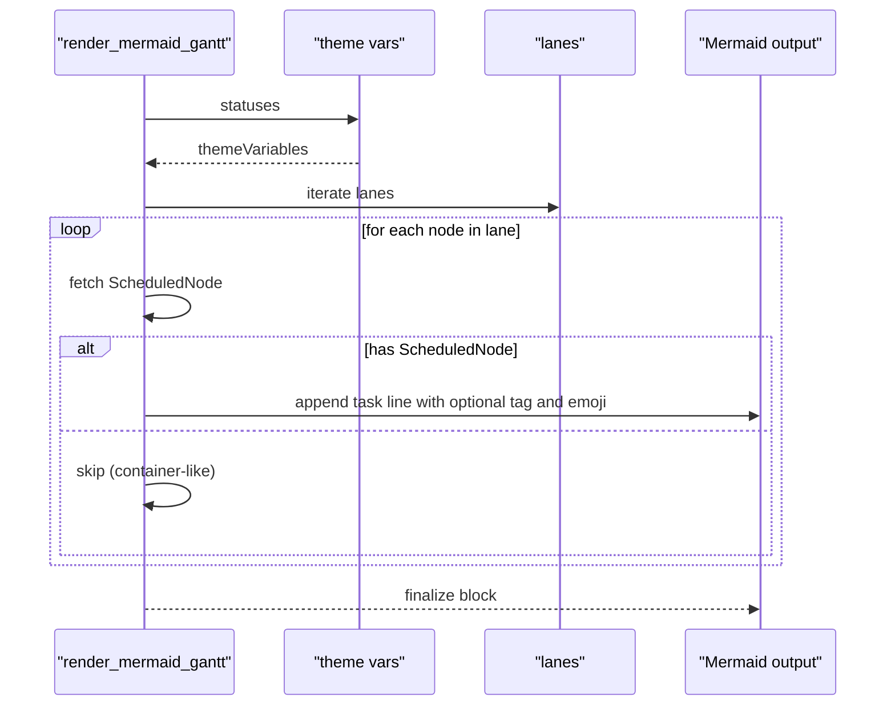
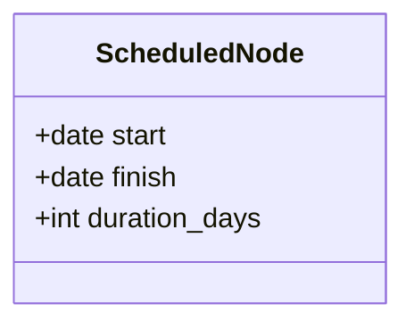
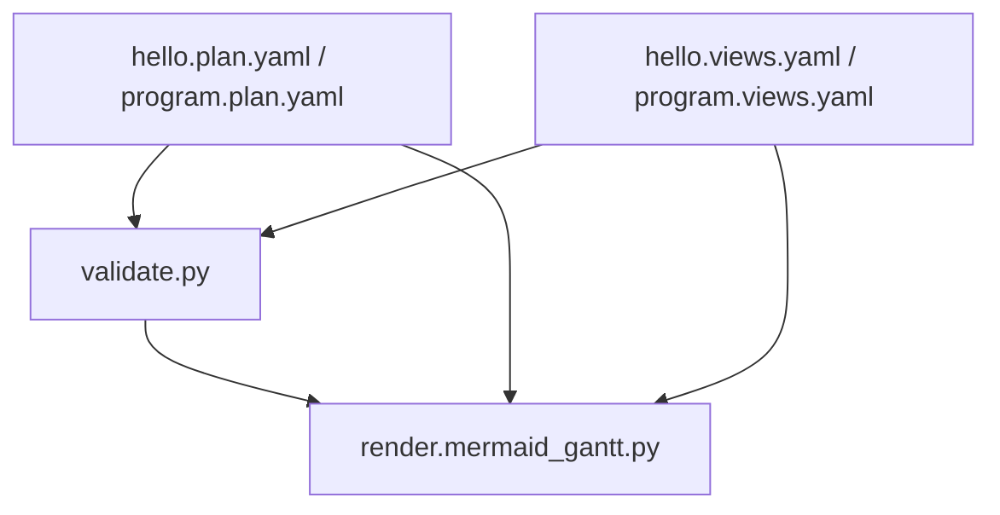

# Rendering Engine

<cite>
**Referenced Files in This Document**
- [mermaid_gantt.py](file://specs/v1/tools/render/mermaid_gantt.py)
- [validate.py](file://specs/v1/tools/validate.py)
- [50-scheduling.md](file://specs/v1/spec/50-scheduling.md)
- [40-statuses.md](file://specs/v1/spec/40-statuses.md)
- [30-views-file.md](file://specs/v1/spec/30-views-file.md)
- [20-nodes.md](file://specs/v1/spec/20-nodes.md)
- [hello.plan.yaml](file://specs/v1/examples/hello/hello.plan.yaml)
- [hello.views.yaml](file://specs/v1/examples/hello/hello.views.yaml)
- [program.plan.yaml](file://specs/v1/examples/advanced/program.plan.yaml)
- [program.views.yaml](file://specs/v1/examples/advanced/program.views.yaml)
- [README.md](file://README.md)
- [SPEC.md](file://specs/v1/SPEC.md)
</cite>

## Table of Contents
1. [Introduction](#introduction)
2. [Project Structure](#project-structure)
3. [Core Components](#core-components)
4. [Architecture Overview](#architecture-overview)
5. [Detailed Component Analysis](#detailed-component-analysis)
6. [Dependency Analysis](#dependency-analysis)
7. [Performance Considerations](#performance-considerations)
8. [Troubleshooting Guide](#troubleshooting-guide)
9. [Conclusion](#conclusion)
10. [Appendices](#appendices)

## Introduction
This document describes the rendering engine that generates Mermaid Gantt diagrams from opskarta plan and view definitions. It explains the scheduling computation algorithm, automatic date calculation from dependencies, weekend exclusion logic, and business day arithmetic. It documents the rendering pipeline from validated plan data to Mermaid output, view configuration options, lane organization, status theming with color coding and emoji support, CLI usage, output formatting, integration with visualization tools, the Python API for programmatic rendering, data structures for scheduled nodes, performance optimization for large datasets, customization options, export formats, and troubleshooting rendering issues.

## Project Structure
The rendering engine lives under specs/v1/tools/render/mermaid_gantt.py and integrates with the opskarta specification and example files. The CLI entry point is exposed via python -m tools.render.mermaid_gantt. Validation utilities reside under specs/v1/tools/validate.py and enforce referential integrity and business rules.



**Diagram sources**
- [mermaid_gantt.py](file://specs/v1/tools/render/mermaid_gantt.py#L439-L549)
- [validate.py](file://specs/v1/tools/validate.py#L634-L752)
- [50-scheduling.md](file://specs/v1/spec/50-scheduling.md#L1-L80)
- [40-statuses.md](file://specs/v1/spec/40-statuses.md#L1-L23)
- [30-views-file.md](file://specs/v1/spec/30-views-file.md#L1-L34)
- [20-nodes.md](file://specs/v1/spec/20-nodes.md#L1-L37)
- [SPEC.md](file://specs/v1/SPEC.md#L1-L407)
- [hello.plan.yaml](file://specs/v1/examples/hello/hello.plan.yaml#L1-L44)
- [hello.views.yaml](file://specs/v1/examples/hello/hello.views.yaml#L1-L13)
- [program.plan.yaml](file://specs/v1/examples/advanced/program.plan.yaml#L1-L326)
- [program.views.yaml](file://specs/v1/examples/advanced/program.views.yaml#L1-L93)

**Section sources**
- [README.md](file://README.md#L68-L84)
- [SPEC.md](file://specs/v1/SPEC.md#L1-L407)

## Core Components
- Date parsing and duration parsing utilities
- Business day arithmetic helpers (weekend detection, next workday, add workdays)
- Schedule computation engine with dependency resolution and cycle detection
- Mermaid Gantt renderer with theme generation and lane emission
- CLI entrypoint with argument parsing and output handling
- Status-to-Mermaid tag mapping and emoji mapping for visual cues

Key responsibilities:
- Parse and validate temporal fields (start, duration) and dependencies (after).
- Compute earliest feasible dates respecting dependencies and exclusions.
- Emit Mermaid Gantt blocks with lanes, statuses, and optional emoji markers.

**Section sources**
- [mermaid_gantt.py](file://specs/v1/tools/render/mermaid_gantt.py#L92-L294)
- [mermaid_gantt.py](file://specs/v1/tools/render/mermaid_gantt.py#L299-L433)
- [mermaid_gantt.py](file://specs/v1/tools/render/mermaid_gantt.py#L439-L549)

## Architecture Overview
The rendering pipeline consists of:
1. Load and validate plan and views.
2. Compute schedule per node considering explicit start, dependencies, and exclusions.
3. Render Mermaid Gantt output with theme variables and lane sections.

```mermaid
sequenceDiagram
participant CLI as "CLI"
participant Loader as "load_yaml()"
participant Renderer as "render_mermaid_gantt()"
participant Scheduler as "compute_schedule()"
participant Theme as "_theme_vars_from_statuses()"
participant Out as "stdout/file"
CLI->>Loader : plan.yaml
CLI->>Loader : views.yaml
CLI->>Renderer : plan, selected view
Renderer->>Scheduler : nodes, exclude_weekends
Scheduler-->>Renderer : {node_id : ScheduledNode}
Renderer->>Theme : statuses
Theme-->>Renderer : themeVariables
Renderer-->>Out : "
```mermaid ... ```"
```

**Diagram sources**
- [mermaid_gantt.py](file://specs/v1/tools/render/mermaid_gantt.py#L49-L86)
- [mermaid_gantt.py](file://specs/v1/tools/render/mermaid_gantt.py#L349-L433)
- [mermaid_gantt.py](file://specs/v1/tools/render/mermaid_gantt.py#L217-L294)
- [mermaid_gantt.py](file://specs/v1/tools/render/mermaid_gantt.py#L317-L347)
- [mermaid_gantt.py](file://specs/v1/tools/render/mermaid_gantt.py#L439-L549)

## Detailed Component Analysis

### Scheduling Computation Algorithm
The scheduler resolves node start dates by:
- Using explicit start when present.
- Otherwise computing the start as the next working day after the latest completion of dependencies (after).
- Optionally inheriting start from parent when no explicit start or dependencies exist.
- Applying weekend exclusion when enabled.



**Diagram sources**
- [mermaid_gantt.py](file://specs/v1/tools/render/mermaid_gantt.py#L217-L294)
- [mermaid_gantt.py](file://specs/v1/tools/render/mermaid_gantt.py#L247-L288)
- [mermaid_gantt.py](file://specs/v1/tools/render/mermaid_gantt.py#L92-L110)
- [mermaid_gantt.py](file://specs/v1/tools/render/mermaid_gantt.py#L112-L152)
- [mermaid_gantt.py](file://specs/v1/tools/render/mermaid_gantt.py#L159-L207)

**Section sources**
- [mermaid_gantt.py](file://specs/v1/tools/render/mermaid_gantt.py#L217-L294)
- [50-scheduling.md](file://specs/v1/spec/50-scheduling.md#L1-L80)

### Weekend Exclusion Logic and Business Day Arithmetic
- Weekend detection uses standard weekday semantics.
- Next workday advances a date until a non-weekend day is found.
- Adding workdays iterates day-by-day, skipping weekends when excluded.
- Finish date calculation respects duration and weekend exclusion.



**Diagram sources**
- [mermaid_gantt.py](file://specs/v1/tools/render/mermaid_gantt.py#L154-L186)

**Section sources**
- [mermaid_gantt.py](file://specs/v1/tools/render/mermaid_gantt.py#L154-L186)

### View Configuration Options and Lane Organization
- Views define gantt_views with title, excludes, and lanes.
- Lanes group node IDs into sections for the Gantt.
- Excludes supports calendar exclusions; weekends is supported in the current implementation.



**Diagram sources**
- [30-views-file.md](file://specs/v1/spec/30-views-file.md#L11-L18)
- [program.views.yaml](file://specs/v1/examples/advanced/program.views.yaml#L8-L28)

**Section sources**
- [30-views-file.md](file://specs/v1/spec/30-views-file.md#L1-L34)
- [program.views.yaml](file://specs/v1/examples/advanced/program.views.yaml#L1-L93)

### Status Theming, Color Coding, and Emoji Support
- Status-to-Mermaid tag mapping enables Mermaid-specific styling keywords.
- Status-to-color mapping drives theme variables for Mermaid.
- Status-to-emoji mapping adds visual cues directly in task labels.



**Diagram sources**
- [mermaid_gantt.py](file://specs/v1/tools/render/mermaid_gantt.py#L300-L315)
- [mermaid_gantt.py](file://specs/v1/tools/render/mermaid_gantt.py#L317-L347)

**Section sources**
- [mermaid_gantt.py](file://specs/v1/tools/render/mermaid_gantt.py#L300-L347)
- [40-statuses.md](file://specs/v1/spec/40-statuses.md#L1-L23)

### Rendering Pipeline to Mermaid Output
- The renderer builds a Mermaid block with init theme variables, title, date format, optional axis format, and optional weekend exclusion.
- It emits sections per lane and tasks with optional Mermaid tags and emoji prefixes.



**Diagram sources**
- [mermaid_gantt.py](file://specs/v1/tools/render/mermaid_gantt.py#L349-L433)

**Section sources**
- [mermaid_gantt.py](file://specs/v1/tools/render/mermaid_gantt.py#L349-L433)

### CLI Usage Examples and Output Formatting
- CLI supports loading plan and views, selecting a view, listing available views, and writing output to a file or stdout.
- Output is a fenced Mermaid block suitable for Markdown consumption.

Example invocations:
- List views: python -m tools.render.mermaid_gantt --plan examples/hello/hello.plan.yaml --views examples/hello/hello.views.yaml --list-views
- Render a view: python -m tools.render.mermaid_gantt --plan examples/hello/hello.plan.yaml --views examples/hello/hello.views.yaml --view overview
- Save to file: python -m tools.render.mermaid_gantt --plan examples/hello/hello.plan.yaml --views examples/hello/hello.views.yaml --view overview --output gantt.md

Output formatting options:
- title from view or plan meta.
- date_format and axis_format from view.
- excludes controls weekend exclusion and can include specific dates.

**Section sources**
- [mermaid_gantt.py](file://specs/v1/tools/render/mermaid_gantt.py#L439-L549)
- [README.md](file://README.md#L78-L83)
- [30-views-file.md](file://specs/v1/spec/30-views-file.md#L11-L18)

### Python API for Programmatic Rendering
- render_mermaid_gantt(plan: Dict[str, Any], view: Dict[str, Any]) -> str
- Intended for embedding in larger toolchains or notebooks.

Integration with visualization tools:
- The output is a Mermaid Gantt block; render it with any Mermaid-compatible Markdown viewer or static site generator.

**Section sources**
- [mermaid_gantt.py](file://specs/v1/tools/render/mermaid_gantt.py#L349-L433)

### Data Structures Used for Scheduled Nodes
- ScheduledNode: immutable record containing start date, finish date, and integer duration in days.



**Diagram sources**
- [mermaid_gantt.py](file://specs/v1/tools/render/mermaid_gantt.py#L209-L215)

**Section sources**
- [mermaid_gantt.py](file://specs/v1/tools/render/mermaid_gantt.py#L209-L215)

### Performance Considerations
- Topological resolution with memoization and a visiting-set prevents recomputation and detects cycles efficiently.
- Duration parsing and date arithmetic are linear-time per node.
- For very large plans, consider:
  - Pre-validating with the validator to catch errors early.
  - Limiting view scope to relevant lanes.
  - Avoiding excessive nested parents that inflate dependency depth.
  - Ensuring durations are reasonable to reduce date arithmetic overhead.

**Section sources**
- [mermaid_gantt.py](file://specs/v1/tools/render/mermaid_gantt.py#L233-L294)
- [validate.py](file://specs/v1/tools/validate.py#L135-L329)

### Customization Options
- View-level:
  - title, date_format, axis_format, excludes (supports weekends and specific dates).
  - lanes organize nodes into sections.
- Status-level:
  - statuses define color hex values used for theming.
- Node-level:
  - status influences both Mermaid tags and emoji.
  - parent inheritance can propagate start dates when no explicit start is given.

**Section sources**
- [30-views-file.md](file://specs/v1/spec/30-views-file.md#L11-L18)
- [40-statuses.md](file://specs/v1/spec/40-statuses.md#L1-L23)
- [20-nodes.md](file://specs/v1/spec/20-nodes.md#L18-L27)
- [mermaid_gantt.py](file://specs/v1/tools/render/mermaid_gantt.py#L372-L373)

### Export Formats and Integration
- The renderer produces a Mermaid Gantt fenced block intended for Markdown consumption.
- Integration examples:
  - Obsidian, LogSeq, Typora, or any Markdown preview supporting Mermaid.
  - Static site generators (e.g., MkDocs, Docusaurus) with Mermaid plugins.
  - CI/CD pipelines to generate and commit Gantt diagrams.

**Section sources**
- [mermaid_gantt.py](file://specs/v1/tools/render/mermaid_gantt.py#L349-L433)

## Dependency Analysis
The rendering engine depends on:
- Plan and view schemas and validation rules.
- Mermaid-specific rendering semantics (tags, theme variables).
- Business rules for scheduling and exclusions.



**Diagram sources**
- [validate.py](file://specs/v1/tools/validate.py#L634-L752)
- [mermaid_gantt.py](file://specs/v1/tools/render/mermaid_gantt.py#L439-L549)
- [hello.plan.yaml](file://specs/v1/examples/hello/hello.plan.yaml#L1-L44)
- [hello.views.yaml](file://specs/v1/examples/hello/hello.views.yaml#L1-L13)
- [program.plan.yaml](file://specs/v1/examples/advanced/program.plan.yaml#L1-L326)
- [program.views.yaml](file://specs/v1/examples/advanced/program.views.yaml#L1-L93)

**Section sources**
- [validate.py](file://specs/v1/tools/validate.py#L135-L580)
- [SPEC.md](file://specs/v1/SPEC.md#L241-L356)

## Performance Considerations
- Complexity:
  - compute_schedule performs DFS with memoization; worst-case O(V + E) per node resolved.
  - Date arithmetic is O(n) for adding workdays where n is the number of days.
- Recommendations:
  - Keep views scoped to relevant lanes to reduce emission overhead.
  - Validate with the validator to detect cycles and invalid references before rendering.
  - Prefer compact dependency graphs; avoid deep chains of after dependencies when not necessary.

[No sources needed since this section provides general guidance]

## Troubleshooting Guide
Common issues and resolutions:
- Missing or invalid YAML:
  - Ensure files are valid YAML and readable; the loader raises file-related errors.
- Unsupported duration format:
  - Use integer or "<number>d" or "<number>w"; otherwise a scheduling error is raised.
- Invalid date format:
  - Use "YYYY-MM-DD" for start fields.
- Cyclic dependencies:
  - The scheduler detects cycles via visiting sets; fix the graph so after and parent references form a DAG.
- Reference errors:
  - The validator checks parent, after, and status references; ensure all IDs exist and match statuses.
- Non-existent view:
  - Use --list-views to discover available view IDs; select one present in gantt_views.
- Output not rendering:
  - Verify the emitted fenced block is placed in a Markdown-compatible environment with Mermaid support.

**Section sources**
- [mermaid_gantt.py](file://specs/v1/tools/render/mermaid_gantt.py#L49-L86)
- [mermaid_gantt.py](file://specs/v1/tools/render/mermaid_gantt.py#L112-L152)
- [mermaid_gantt.py](file://specs/v1/tools/render/mermaid_gantt.py#L236-L243)
- [validate.py](file://specs/v1/tools/validate.py#L135-L403)
- [README.md](file://README.md#L78-L83)

## Conclusion
The opskarta Mermaid Gantt rendering engine computes accurate schedules from explicit starts and dependencies, enforces weekend exclusion when configured, and renders a ready-to-use Mermaid block with theming and emoji. Its modular design integrates cleanly with validation and supports flexible view configuration, making it suitable for automated documentation pipelines and interactive dashboards.

[No sources needed since this section summarizes without analyzing specific files]

## Appendices

### Example Inputs and Outputs
- Minimal plan and view examples demonstrate basic usage and weekend exclusion.
- Advanced example shows multi-lane, multi-track Gantt with critical path emphasis.

**Section sources**
- [hello.plan.yaml](file://specs/v1/examples/hello/hello.plan.yaml#L1-L44)
- [hello.views.yaml](file://specs/v1/examples/hello/hello.views.yaml#L1-L13)
- [program.plan.yaml](file://specs/v1/examples/advanced/program.plan.yaml#L1-L326)
- [program.views.yaml](file://specs/v1/examples/advanced/program.views.yaml#L1-L93)