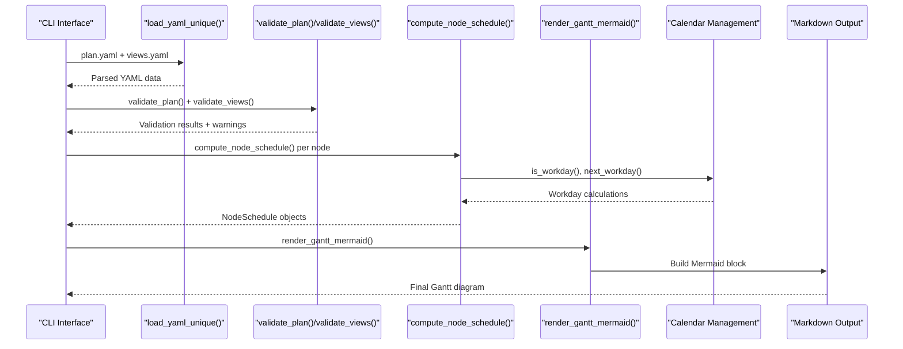
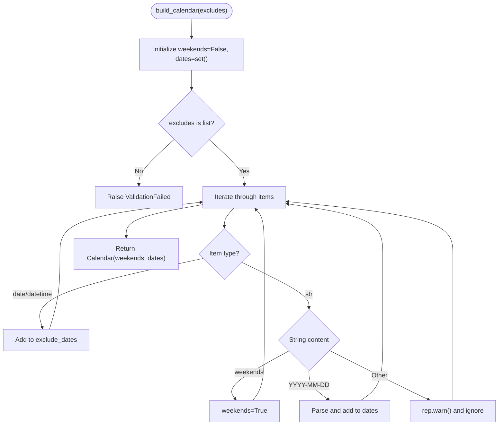
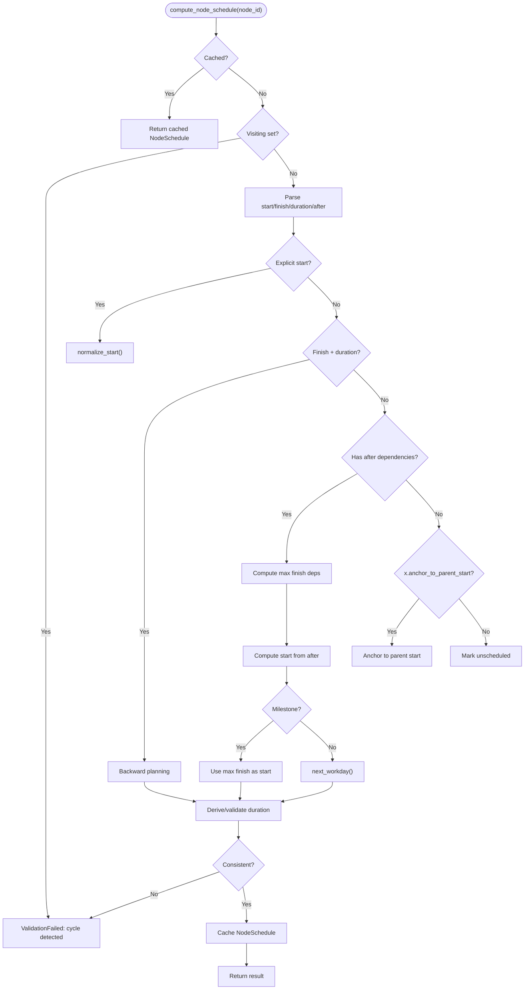
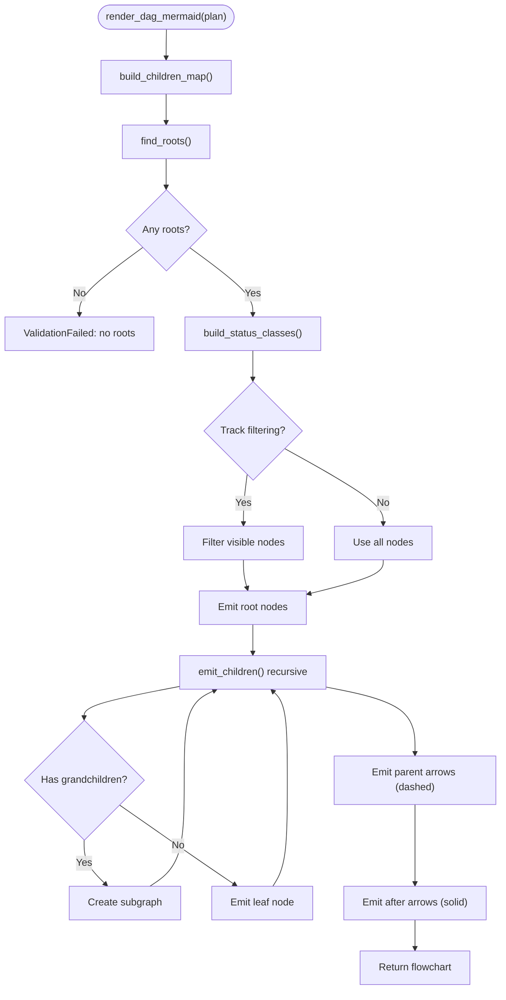
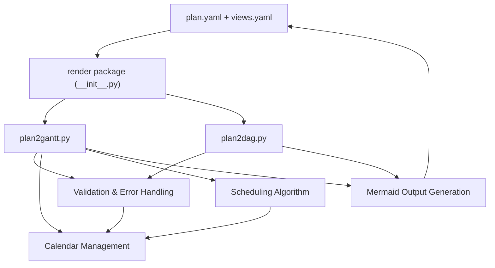

# Rendering Engine

<cite>
**Referenced Files in This Document**
- [plan2gantt.py](file://specs/v1/tools/render/plan2gantt.py)
- [plan2dag.py](file://specs/v1/tools/render/plan2dag.py)
- [__init__.py](file://specs/v1/tools/render/__init__.py)
- [README.md](file://specs/v1/tools/README.md)
- [95-renderer-mermaid.md](file://specs/v1/spec/95-renderer-mermaid.md)
- [50-scheduling.md](file://specs/v1/spec/50-scheduling.md)
- [hello.plan.yaml](file://specs/v1/examples/hello/hello.plan.yaml)
- [hello.views.yaml](file://specs/v1/examples/hello/hello.views.yaml)
- [program.plan.yaml](file://specs/v1/examples/advanced/program.plan.yaml)
- [program.views.yaml](file://specs/v1/examples/advanced/program.views.yaml)
- [SPEC.md](file://specs/v1/SPEC.md)
- [date_excludes.plan.yaml](file://specs/v1/tests/fixtures/date_excludes.plan.yaml)
- [date_excludes.views.yaml](file://specs/v1/tests/fixtures/date_excludes.views.yaml)
- [non_core_excludes.views.yaml](file://specs/v1/tests/fixtures/non_core_excludes.views.yaml)
- [weekends_exclusion.plan.yaml](file://specs/v1/tests/fixtures/weekends_exclusion.plan.yaml)
- [test_scheduling.py](file://specs/v1/tests/test_scheduling.py)
</cite>

## Update Summary
**Changes Made**
- Complete replacement of legacy `mermaid_gantt.py` with new `plan2gantt.py` and `plan2dag.py` implementations
- Enhanced visualization capabilities with improved scheduling algorithms
- Better user experience with lazy imports and structured module organization
- New core/non-core exclusion model implementation with strict separation
- Enhanced weekend exclusion handling with comprehensive calendar support
- Improved error reporting and validation with dedicated Reporter class
- Expanded CLI functionality with markdown wrapping and output options
- Modular architecture with specialized Gantt and DAG renderers

## Table of Contents
1. [Introduction](#introduction)
2. [Project Structure](#project-structure)
3. [Core Components](#core-components)
4. [Architecture Overview](#architecture-overview)
5. [Detailed Component Analysis](#detailed-component-analysis)
6. [Dependency Analysis](#dependency-analysis)
7. [Performance Considerations](#performance-considerations)
8. [Troubleshooting Guide](#troubleshooting-guide)
9. [Conclusion](#conclusion)
10. [Appendices](#appendices)

## Introduction
This document describes the modernized rendering engine that generates Mermaid Gantt diagrams and DAG flowcharts from opskarta plan and view definitions. The new implementation represents a complete replacement of the legacy monolithic renderer with a dual-rendering system featuring specialized modules for different visualization types.

The new rendering engine consists of two modular components: `plan2gantt.py` for Gantt chart generation and `plan2dag.py` for DAG flowchart creation. Both modules provide enhanced scheduling computation algorithms, comprehensive weekend exclusion logic, business day arithmetic, and improved user experience through lazy imports and structured architecture.

The engine maintains backward compatibility while introducing advanced features like parent-child inheritance, enhanced status theming, comprehensive error reporting, and flexible CLI tooling. The modular design enables independent optimization and future enhancements while providing a clean API for programmatic integration.

**Updated** Complete replacement of legacy monolithic renderer with modular architecture featuring separate Gantt and DAG renderers, enhanced validation, and improved user experience.

## Project Structure
The rendering engine is organized into two specialized modules under `specs/v1/tools/render/`: `plan2gantt.py` for Gantt chart generation and `plan2dag.py` for DAG flowchart creation. Both modules support CLI entry points via `python -m render.plan2gantt` and `python -m render.plan2dag`. The `__init__.py` file provides lazy imports to avoid runtime warnings.

```mermaid
graph TB
subgraph "Render Package"
RG["plan2gantt.py<br/>Gantt Chart Renderer"]
RD["plan2dag.py<br/>DAG Flowchart Renderer"]
INIT["__init__.py<br/>Lazy Imports & Exports"]
SPEC["95-renderer-mermaid.md<br/>Renderer Profile"]
SCHED["50-scheduling.md<br/>Scheduling Spec"]
END
subgraph "Examples"
HP["hello.plan.yaml<br/>Basic usage"]
HV["hello.views.yaml<br/>Simple view"]
PP["program.plan.yaml<br/>Advanced multi-track"]
PV["program.views.yaml<br/>Multi-lane views"]
END
INIT --> RG
INIT --> RD
RG --> HP
RG --> HV
RG --> PP
RG --> PV
RD --> HP
RD --> HV
RD --> PP
RD --> PV
SPEC --> RG
SPEC --> RD
SCHED --> RG
SCHED --> RD
```

**Diagram sources**
- [plan2gantt.py](file://specs/v1/tools/render/plan2gantt.py#L1-L28)
- [plan2dag.py](file://specs/v1/tools/render/plan2dag.py#L1-L9)
- [__init__.py](file://specs/v1/tools/render/__init__.py#L1-L24)
- [95-renderer-mermaid.md](file://specs/v1/spec/95-renderer-mermaid.md#L1-L255)
- [50-scheduling.md](file://specs/v1/spec/50-scheduling.md#L1-L262)

**Section sources**
- [README.md](file://specs/v1/tools/README.md#L69-L153)
- [__init__.py](file://specs/v1/tools/render/__init__.py#L1-L24)

## Core Components
The new rendering engine consists of two specialized modules with distinct responsibilities:

### plan2gantt.py - Gantt Chart Renderer
- **Core scheduling algorithm** with explicit start, finish+duration, after dependencies, and parent inheritance
- **Calendar management** with weekend exclusion and specific date handling
- **Business day arithmetic** with comprehensive workday calculations
- **Status theming** with color coding and emoji support
- **Mermaid output generation** with theme variables and lane organization
- **Enhanced validation** with dedicated Reporter class for structured error handling
- **Comprehensive CLI support** with markdown wrapping and output options

### plan2dag.py - DAG Flowchart Renderer  
- **Hierarchical visualization** of parent-child relationships and dependencies
- **Smart arrow rendering** avoiding redundant parent arrows when siblings exist
- **Text wrapping** for long node labels with configurable column width
- **Owner display** with backward compatibility support
- **Track filtering** for focused visualization of specific project tracks
- **Extended validation** with duplicate key detection and cycle prevention
- **Flexible CLI options** for direction control and multiple track support

### Shared Infrastructure
- **Strict YAML loading** with duplicate key detection for both modules
- **Comprehensive validation** ensuring plan and view integrity
- **Error reporting** with structured warnings and informative messages
- **Lazy imports** in `__init__.py` to avoid runtime warnings

**Updated** Complete modular architecture replacing single monolithic renderer with specialized Gantt and DAG modules, each optimized for their respective visualization purposes.

**Section sources**
- [plan2gantt.py](file://specs/v1/tools/render/plan2gantt.py#L1-L28)
- [plan2dag.py](file://specs/v1/tools/render/plan2dag.py#L1-L9)
- [__init__.py](file://specs/v1/tools/render/__init__.py#L15-L23)

## Architecture Overview
The new rendering architecture provides a clean separation of concerns with specialized modules for different visualization types:



**Diagram sources**
- [plan2gantt.py](file://specs/v1/tools/render/plan2gantt.py#L957-L1025)
- [plan2gantt.py](file://specs/v1/tools/render/plan2gantt.py#L847-L950)
- [plan2gantt.py](file://specs/v1/tools/render/plan2gantt.py#L608-L790)
- [plan2gantt.py](file://specs/v1/tools/render/plan2gantt.py#L161-L195)

## Detailed Component Analysis

### Enhanced Core/Non-Core Exclusion Model
The new implementation maintains the core/non-core exclusion separation while improving the underlying calendar management:

**Core Exclusions** (used in scheduling calculations):
- `"weekends"`: Excludes Saturday and Sunday from working days
- Specific dates: Individual dates like `"2024-03-08"` for business day calculations

**Non-Core Exclusions** (ignored in scheduling, only for warnings):
- `"monday"`, `"tuesday"`, etc.: Specific weekdays
- `"custom-holiday"`: Custom holiday names
- Other arbitrary strings

**Enhanced Calendar Management**:
- Dedicated `Calendar` dataclass with `weekends` boolean and `exclude_dates` set
- Structured `build_calendar()` function with comprehensive validation
- Improved `canonical_mermaid_excludes_tokens()` for stable output formatting



**Diagram sources**
- [plan2gantt.py](file://specs/v1/tools/render/plan2gantt.py#L161-L195)
- [plan2gantt.py](file://specs/v1/tools/render/plan2gantt.py#L155-L195)

**Section sources**
- [plan2gantt.py](file://specs/v1/tools/render/plan2gantt.py#L155-L195)
- [plan2gantt.py](file://specs/v1/tools/render/plan2gantt.py#L837-L844)

### Advanced Scheduling Computation Algorithm
The new scheduler implements a comprehensive canonical algorithm with enhanced error handling:

**Core Algorithm Steps**:
1. **Explicit start** with normalization to next workday if excluded
2. **Finish + duration** (backward planning) with milestone handling
3. **After dependencies** with max finish calculation
4. **Extension support** via `x.scheduling.anchor_to_parent_start`
5. **Fallback handling** for unscheduled nodes

**Enhanced Error Reporting**:
- Dedicated `Reporter` class with `error()`, `warn()`, and `info()` methods
- Structured validation failures with `ValidationFailed` exception
- Comprehensive cycle detection for both parent and after relationships



**Diagram sources**
- [plan2gantt.py](file://specs/v1/tools/render/plan2gantt.py#L608-L790)
- [plan2gantt.py](file://specs/v1/tools/render/plan2gantt.py#L675-L726)

**Section sources**
- [plan2gantt.py](file://specs/v1/tools/render/plan2gantt.py#L608-L790)
- [plan2gantt.py](file://specs/v1/tools/render/plan2gantt.py#L573-L594)

### Enhanced DAG Visualization Features
The `plan2dag.py` module provides sophisticated hierarchical visualization with smart arrow rendering:

**Key Features**:
- **Parent-child decomposition** with dashed arrows for structural relationships
- **Dependency visualization** with solid arrows for logical flow
- **Smart arrow avoidance** preventing redundant parent arrows when siblings exist
- **Track filtering** for focused visualization of specific project tracks
- **Text wrapping** with configurable column width for long labels
- **Owner display** with backward compatibility support

**Hierarchical Structure Generation**:
- Root nodes identification and subgraph creation
- Track-level organization with optional squashing
- Grandchild detection for nested subgraph optimization
- Declared nodes tracking to prevent duplicates



**Diagram sources**
- [plan2dag.py](file://specs/v1/tools/render/plan2dag.py#L374-L579)
- [plan2dag.py](file://specs/v1/tools/render/plan2dag.py#L454-L502)

**Section sources**
- [plan2dag.py](file://specs/v1/tools/render/plan2dag.py#L374-L579)
- [plan2dag.py](file://specs/v1/tools/render/plan2dag.py#L338-L370)

### Enhanced Status Theming and Visualization
Both modules implement comprehensive status theming with improved color management:

**Status Color Management**:
- **Default color mapping** for standard statuses
- **Custom color support** with regex validation
- **Fallback mechanisms** ensuring consistent theming
- **Emoji integration** for visual status distinction

**Visualization Enhancements**:
- **Status-based class definitions** in Mermaid output
- **Owner display** with backward compatibility
- **Text wrapping** for long labels with configurable width
- **Smart arrow rendering** avoiding visual clutter

**Section sources**
- [plan2gantt.py](file://specs/v1/tools/render/plan2gantt.py#L802-L816)
- [plan2dag.py](file://specs/v1/tools/render/plan2dag.py#L288-L306)
- [plan2dag.py](file://specs/v1/tools/render/plan2dag.py#L338-L370)

### Improved Business Day Arithmetic
The new implementation provides robust business day calculations with comprehensive edge case handling:

**Core Functions**:
- **Weekend detection** using standard weekday semantics
- **Next workday calculation** advancing until non-excluded day
- **Workday addition/subtraction** with precise arithmetic
- **Duration counting** with workday-only consideration

**Enhanced Features**:
- **Milestone handling** with special duration rules
- **Legacy end conversion** to modern finish format
- **Exclusion normalization** ensuring consistent scheduling
- **Backward planning support** for finish+duration combinations

**Section sources**
- [plan2gantt.py](file://specs/v1/tools/render/plan2gantt.py#L198-L260)
- [plan2gantt.py](file://specs/v1/tools/render/plan2gantt.py#L262-L272)

### Enhanced Weekend Exclusion Handling
The new calendar system provides comprehensive weekend and date exclusion support:

**Supported Exclusions**:
- `"weekends"`: Excludes Saturday and Sunday from working days
- Specific dates: Individual dates like `"2024-03-08"` for visual marking
- Multiple exclusions: Arrays combining weekends with specific dates

**Core vs Non-Core Behavior**:
- **Core exclusions** (`"weekends"` and `"YYYY-MM-DD"`) affect scheduling calculations
- **Non-core exclusions** (like `"monday"`, `"custom-holiday"`) are ignored in scheduling but trigger warnings
- **All exclusions** are passed to Mermaid for visual representation

**Section sources**
- [plan2gantt.py](file://specs/v1/tools/render/plan2gantt.py#L161-L195)
- [95-renderer-mermaid.md](file://specs/v1/spec/95-renderer-mermaid.md#L101-L121)

### Enhanced View Configuration and Lane Organization
The Gantt renderer provides comprehensive view configuration with improved error handling:

**View Configuration Options**:
- **Title fallback chain**: view.title → plan.meta.title → "opskarta gantt"
- **Date formatting**: date_format and axis_format with validation
- **Tick intervals**: tick_interval for timeline granularity
- **Lane organization**: structured grouping of nodes into sections

**Enhanced Error Handling**:
- **Structured validation** with detailed error messages
- **Referential integrity** checking for node references
- **Format validation** for all configuration fields
- **Missing field detection** with informative warnings

**Section sources**
- [plan2gantt.py](file://specs/v1/tools/render/plan2gantt.py#L847-L950)
- [plan2gantt.py](file://specs/v1/tools/render/plan2gantt.py#L446-L530)

### Enhanced Rendering Pipeline
The new rendering pipeline provides structured output generation with comprehensive formatting:

**Gantt Output Generation**:
- **Initialization block** with theme variables and status colors
- **Configuration section** with title, date formats, and exclusions
- **Lane organization** with structured task emission
- **Status tagging** with milestone and progress indicators

**DAG Output Generation**:
- **Flowchart structure** with directional control
- **Subgraph organization** for hierarchical visualization
- **Arrow rendering** with smart parent/sibling logic
- **Status-based styling** with color classes

**Section sources**
- [plan2gantt.py](file://specs/v1/tools/render/plan2gantt.py#L818-L950)
- [plan2dag.py](file://specs/v1/tools/render/plan2dag.py#L374-L579)

### Enhanced CLI Usage and Output Formatting
Both modules provide comprehensive CLI interfaces with improved user experience:

**plan2gantt.py CLI Features**:
- **View selection** with required --view parameter
- **List views** functionality for discovery
- **Output options** with file writing and markdown wrapping
- **Structured error reporting** with detailed messages

**plan2dag.py CLI Features**:
- **Direction control** for graph orientation
- **Text wrapping** for long labels
- **Track filtering** for focused visualization
- **Multiple track support** with repeated --track options

**Enhanced Output Options**:
- **Markdown wrapping** with configurable fences
- **File output** with automatic encoding
- **Standard output** for integration scenarios
- **Structured warnings** for troubleshooting

**Section sources**
- [plan2gantt.py](file://specs/v1/tools/render/plan2gantt.py#L957-L1025)
- [plan2dag.py](file://specs/v1/tools/render/plan2dag.py#L584-L620)

### Enhanced Python API for Programmatic Rendering
Both modules provide robust Python APIs with lazy imports for optimal performance:

**plan2gantt.py API**:
- `render_gantt_mermaid(plan: Dict[str, Any], view: Dict[str, Any], view_id: str, rep: Reporter) -> str`
- Direct integration into larger toolchains and notebooks
- Structured error handling with Reporter class

**plan2dag.py API**:
- `render_dag_mermaid(plan: Dict[str, Any], direction: str = "LR", wrap_col: Optional[int] = None, only_tracks: Optional[Set[str]] = None) -> str`
- Flexible configuration for different visualization needs
- Smart track filtering for focused analysis

**Lazy Import Benefits**:
- **Runtime warning prevention** in `__init__.py`
- **Module isolation** for independent development
- **Performance optimization** by loading only needed components
- **Clean namespace management** avoiding conflicts

**Section sources**
- [plan2gantt.py](file://specs/v1/tools/render/plan2gantt.py#L847-L950)
- [plan2dag.py](file://specs/v1/tools/render/plan2dag.py#L374-L579)
- [__init__.py](file://specs/v1/tools/render/__init__.py#L15-L23)

### Enhanced Data Structures for Scheduled Nodes
The new implementation uses structured dataclasses for improved type safety and clarity:

**NodeSchedule Dataclass**:
- **Immutable records** with `start`, `finish`, and `duration_days` fields
- **Optional typing** for unscheduled nodes
- **Frozen instances** preventing accidental modification
- **Clear field definitions** with comprehensive documentation

**Calendar Dataclass**:
- **Frozen structure** with `weekends` and `exclude_dates` fields
- **Set-based date storage** for efficient lookup
- **Boolean flag** for weekend exclusion
- **Immutable design** ensuring consistent calendar state

**Enhanced Type Safety**:
- **Dataclass annotations** for clear field types
- **Optional typing** for nullable fields
- **Frozen instances** preventing runtime modifications
- **Comprehensive validation** at construction time

**Section sources**
- [plan2gantt.py](file://specs/v1/tools/render/plan2gantt.py#L601-L606)
- [plan2gantt.py](file://specs/v1/tools/render/plan2gantt.py#L155-L159)

### Enhanced Performance Considerations
The new modular architecture provides improved performance through several optimizations:

**Memory Efficiency**:
- **Dataclass usage** reduces memory overhead compared to dictionaries
- **Set-based lookups** for calendar dates and visited nodes
- **Memoization caching** for computed schedules
- **Lazy evaluation** of expensive operations

**Processing Optimizations**:
- **Early termination** in validation and scheduling loops
- **Efficient cycle detection** using visited and stack sets
- **Smart arrow rendering** avoiding redundant parent arrows
- **Structured error handling** preventing cascading failures

**Scalability Improvements**:
- **Modular design** allowing independent optimization
- **Separate concerns** reducing complexity in individual modules
- **Structured validation** catching issues early
- **Comprehensive testing** through fixture-based validation

**Section sources**
- [plan2gantt.py](file://specs/v1/tools/render/plan2gantt.py#L608-L790)
- [plan2dag.py](file://specs/v1/tools/render/plan2dag.py#L190-L227)

### Enhanced Customization Options
Both modules provide comprehensive customization through configuration and extension points:

**plan2gantt.py Customization**:
- **View-level configuration**: title, date_format, axis_format, tick_interval
- **Status-level theming**: custom colors with regex validation
- **Node-level extensions**: `x.scheduling.anchor_to_parent_start`
- **Calendar customization**: comprehensive exclude handling

**plan2dag.py Customization**:
- **Graph direction**: LR, TB, BT, RL orientation options
- **Text wrapping**: configurable column width for labels
- **Track filtering**: selective visualization of project tracks
- **Owner display**: backward compatibility with legacy owner field

**Extension Support**:
- **Non-core extensions** for renderer-specific features
- **Status-based theming** with custom color mapping
- **Emoji integration** for visual status indication
- **Smart arrow rendering** optimizing visual clarity

**Section sources**
- [plan2gantt.py](file://specs/v1/tools/render/plan2gantt.py#L573-L594)
- [plan2dag.py](file://specs/v1/tools/render/plan2dag.py#L338-L370)
- [plan2gantt.py](file://specs/v1/tools/render/plan2gantt.py#L818-L834)

### Enhanced Export Formats and Integration
The new modules provide flexible output formats suitable for various integration scenarios:

**Gantt Output Formats**:
- **Raw Mermaid blocks** for direct embedding
- **Markdown-wrapped output** with configurable fences
- **File-based output** with automatic encoding
- **Standard output** for pipeline integration

**DAG Output Formats**:
- **Flowchart definitions** for Mermaid compatibility
- **Configurable orientations** for different layout preferences
- **Structured output** suitable for automated generation
- **Integration-ready format** for build pipelines

**Integration Examples**:
- **Static site generators** with Mermaid plugin support
- **Documentation systems** like Obsidian and LogSeq
- **CI/CD pipelines** for automated diagram generation
- **Interactive dashboards** with real-time updates

**Section sources**
- [plan2gantt.py](file://specs/v1/tools/render/plan2gantt.py#L797-L800)
- [plan2gantt.py](file://specs/v1/tools/render/plan2gantt.py#L1008-L1017)
- [plan2dag.py](file://specs/v1/tools/render/plan2dag.py#L584-L620)

## Dependency Analysis
The new modular architecture provides clear dependency relationships between components:



**Diagram sources**
- [__init__.py](file://specs/v1/tools/render/__init__.py#L15-L23)
- [plan2gantt.py](file://specs/v1/tools/render/plan2gantt.py#L1-L28)
- [plan2dag.py](file://specs/v1/tools/render/plan2dag.py#L1-L9)

**Section sources**
- [__init__.py](file://specs/v1/tools/render/__init__.py#L1-L24)
- [README.md](file://specs/v1/tools/README.md#L69-L153)

## Performance Considerations
The new modular architecture provides several performance improvements:

**Complexity Analysis**:
- **Scheduling algorithm**: DFS with memoization; worst-case O(V + E) per node resolved
- **Calendar operations**: O(n) for workday calculations where n is days in period
- **Validation**: O(V + E) for referential integrity checks
- **Output generation**: O(N) where N is total nodes and edges

**Optimization Strategies**:
- **Dataclass usage** reduces memory overhead compared to dictionaries
- **Set-based lookups** improve calendar and validation performance
- **Lazy imports** prevent unnecessary module loading
- **Structured caching** avoids recomputation of schedules

**Recommendations**:
- **Pre-validate** with the validator to catch errors early
- **Use track filtering** in DAG mode for focused analysis
- **Limit view scope** to relevant lanes in Gantt mode
- **Avoid excessive nesting** to reduce dependency depth

**Section sources**
- [plan2gantt.py](file://specs/v1/tools/render/plan2gantt.py#L608-L790)
- [plan2dag.py](file://specs/v1/tools/render/plan2dag.py#L190-L227)

## Troubleshooting Guide
Enhanced error reporting and validation provide comprehensive troubleshooting capabilities:

**Common Issues and Resolutions**:
- **Missing or invalid YAML**: Use strict loading with duplicate key detection
- **Unsupported duration format**: Use integer or "<number>d" or "<number>w" format
- **Invalid date format**: Use "YYYY-MM-DD" for all date fields
- **Cyclic dependencies**: Enhanced cycle detection with detailed error messages
- **Reference errors**: Comprehensive validation of parent, after, and status references
- **Unknown view selection**: Use --list-views to discover available view IDs
- **Output not rendering**: Verify Mermaid-compatible environment support
- **Extension misuse**: Non-core extensions are ignored with warnings

**Enhanced Error Reporting**:
- **Structured Reporter class** with error/warn/info categorization
- **Detailed field paths** in error messages for precise location identification
- **ValidationFailed exceptions** for consistent error handling
- **Comprehensive warnings** for edge cases and best practices

**Debugging Tips**:
- **Enable verbose warnings** to identify potential scheduling issues
- **Use --list-views** to verify view availability and configuration
- **Test with minimal examples** to isolate complex dependency issues
- **Validate with strict settings** to catch format violations early

**Section sources**
- [plan2gantt.py](file://specs/v1/tools/render/plan2gantt.py#L53-L78)
- [plan2gantt.py](file://specs/v1/tools/render/plan2gantt.py#L405-L444)
- [plan2dag.py](file://specs/v1/tools/render/plan2dag.py#L229-L261)

## Conclusion
The opskarta rendering engine has been completely modernized with the replacement of the legacy `mermaid_gantt.py` with the new `plan2gantt.py` and `plan2dag.py` implementations. The new modular architecture provides enhanced visualization capabilities, improved scheduling algorithms, comprehensive error reporting, and better user experience through lazy imports.

The engine now supports dual visualization modes: Gantt charts for timeline analysis and DAG flowcharts for dependency visualization. Both modules implement the core/non-core exclusion model, enhanced weekend exclusion handling, and comprehensive status theming. The structured validation, calendar management, and business day arithmetic provide robust scheduling capabilities suitable for complex project management scenarios.

The new implementation maintains backward compatibility while introducing advanced features like parent-child inheritance, smart arrow rendering, and comprehensive error reporting. The modular design enables independent optimization and future enhancements while providing a clean API for programmatic integration.

## Appendices

### Example Inputs and Outputs
The new modules support the same example configurations as the legacy implementation:

**Minimal Plan and View Examples**:
- Basic usage with weekend exclusion support
- Advanced multi-lane Gantt with critical path emphasis
- DAG flowchart visualization of project hierarchy

**Section sources**
- [hello.plan.yaml](file://specs/v1/examples/hello/hello.plan.yaml#L1-L44)
- [hello.views.yaml](file://specs/v1/examples/hello/hello.views.yaml#L1-L13)
- [program.plan.yaml](file://specs/v1/examples/advanced/program.plan.yaml#L1-L326)
- [program.views.yaml](file://specs/v1/examples/advanced/program.views.yaml#L1-L93)

### Enhanced Renderer Profile Details
The new modules implement comprehensive renderer profiles with enhanced capabilities:

**plan2gantt.py Features**:
- **Canonical scheduling algorithm** with explicit start, finish+duration, after dependencies
- **Enhanced calendar management** with comprehensive exclude handling
- **Status-based theming** with custom color support
- **Milestone support** with special duration rules
- **Extension support** via `x.scheduling.anchor_to_parent_start`

**plan2dag.py Features**:
- **Hierarchical visualization** with parent-child decomposition
- **Smart arrow rendering** avoiding redundant parent arrows
- **Track filtering** for focused project analysis
- **Text wrapping** for long node labels
- **Owner display** with backward compatibility

**Section sources**
- [plan2gantt.py](file://specs/v1/tools/render/plan2gantt.py#L1-L28)
- [plan2dag.py](file://specs/v1/tools/render/plan2dag.py#L1-L9)

### Enhanced Core/Non-Core Exclusion Examples
The new implementation provides comprehensive exclusion handling:

**Core Exclusions** (affect scheduling):
- `"weekends"`: Excludes Saturday and Sunday
- `"2024-03-08"`: Specific holiday date

**Non-Core Exclusions** (ignored in scheduling):
- `"monday"`: Specific weekday exclusion
- `"custom-holiday"`: Custom holiday name

**Enhanced Processing**:
- **Structured calendar building** with comprehensive validation
- **Smart exclusion categorization** with detailed warnings
- **Stable output formatting** with sorted date exclusions
- **Comprehensive error handling** for invalid exclusions

**Section sources**
- [plan2gantt.py](file://specs/v1/tools/render/plan2gantt.py#L161-L195)
- [95-renderer-mermaid.md](file://specs/v1/spec/95-renderer-mermaid.md#L101-L137)