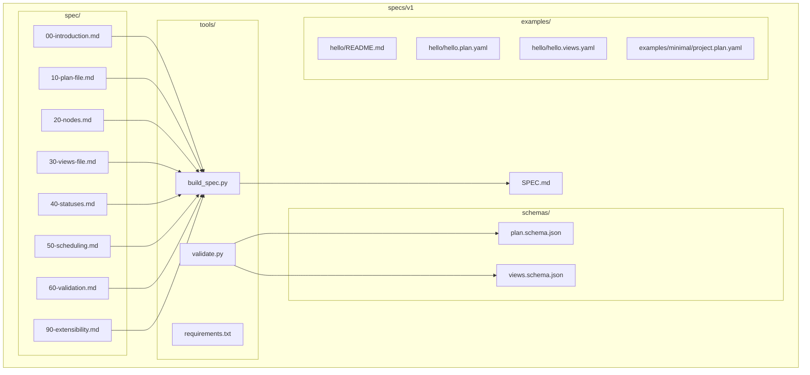
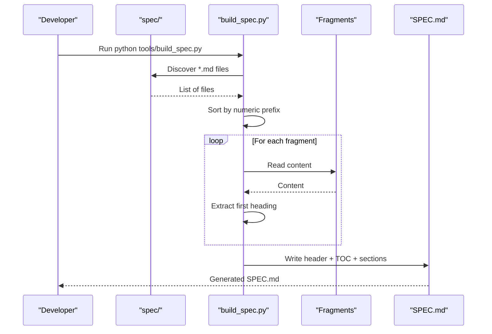
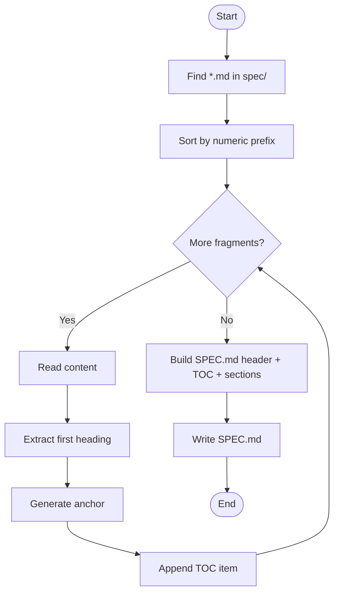
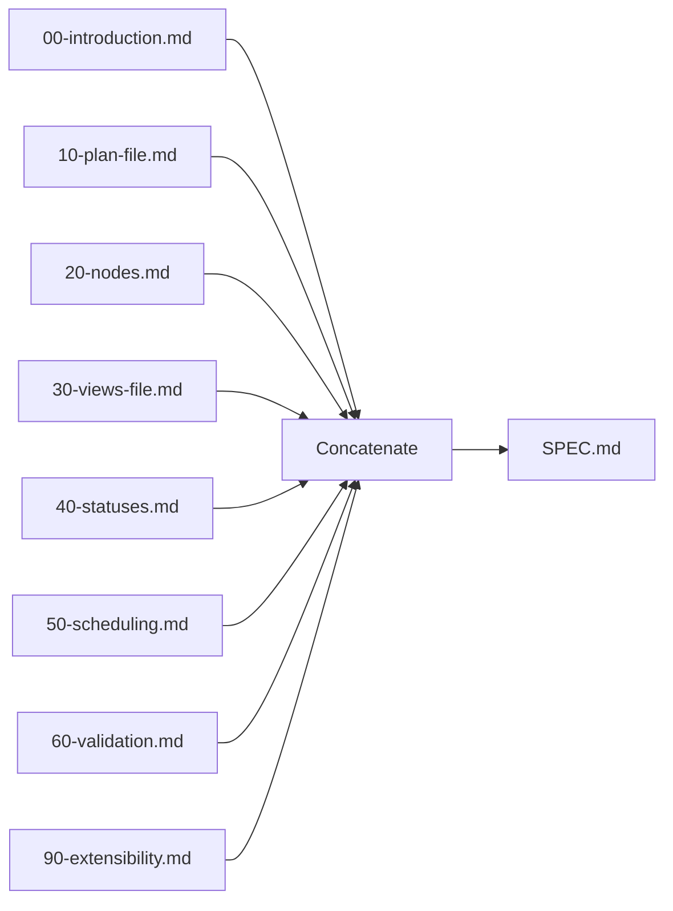
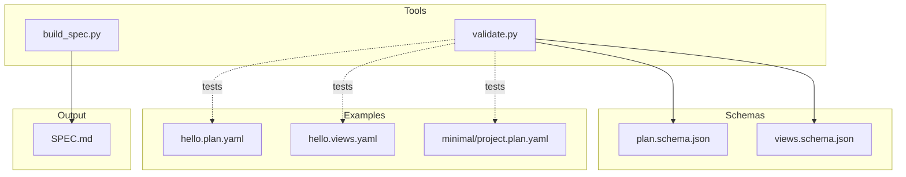

# Specification Builder

<cite>
**Referenced Files in This Document**
- [build_spec.py](file://specs/v1/tools/build_spec.py)
- [validate.py](file://specs/v1/tools/validate.py)
- [SPEC.md](file://specs/v1/SPEC.md)
- [00-introduction.md](file://specs/v1/spec/00-introduction.md)
- [10-plan-file.md](file://specs/v1/spec/10-plan-file.md)
- [20-nodes.md](file://specs/v1/spec/20-nodes.md)
- [30-views-file.md](file://specs/v1/spec/30-views-file.md)
- [40-statuses.md](file://specs/v1/spec/40-statuses.md)
- [50-scheduling.md](file://specs/v1/spec/50-scheduling.md)
- [60-validation.md](file://specs/v1/spec/60-validation.md)
- [90-extensibility.md](file://specs/v1/spec/90-extensibility.md)
- [plan.schema.json](file://specs/v1/schemas/plan.schema.json)
- [views.schema.json](file://specs/v1/schemas/views.schema.json)
- [requirements.txt](file://specs/v1/tools/requirements.txt)
- [README.md](file://specs/v1/examples/hello/README.md)
- [hello.plan.yaml](file://specs/v1/examples/hello/hello.plan.yaml)
- [hello.views.yaml](file://specs/v1/examples/hello/hello.views.yaml)
- [project.plan.yaml](file://specs/v1/examples/minimal/project.plan.yaml)
</cite>

## Table of Contents
1. [Introduction](#introduction)
2. [Project Structure](#project-structure)
3. [Core Components](#core-components)
4. [Architecture Overview](#architecture-overview)
5. [Detailed Component Analysis](#detailed-component-analysis)
6. [Dependency Analysis](#dependency-analysis)
7. [Performance Considerations](#performance-considerations)
8. [Troubleshooting Guide](#troubleshooting-guide)
9. [Conclusion](#conclusion)
10. [Appendices](#appendices)

## Introduction
This document describes the Specification Builder for Opskarta’s automated documentation generation. It explains how individual Markdown fragments in the spec/ directory are assembled into a single SPEC.md file, including file naming conventions, sorting, header extraction for the table of contents, and automated TOC generation. It also covers the build process, output formatting, CI/CD integration via a --check mode for freshness validation, usage examples, configuration options, and maintenance procedures. Finally, it documents the relationship between specification fragments and the generated SPEC.md, version control integration, documentation workflow, and best practices for evolving the specification.

## Project Structure
The specification system is organized under specs/v1 with the following key areas:
- spec/: Fragmented Markdown topics that compose the final specification
- tools/: Python scripts for building and validating the specification
- schemas/: JSON Schemas for structural validation
- examples/: Example plan and views files demonstrating usage
- SPEC.md: The generated specification document

**Diagram sources**
- [build_spec.py](file://specs/v1/tools/build_spec.py#L1-L240)
- [validate.py](file://specs/v1/tools/validate.py#L1-L752)
- [SPEC.md](file://specs/v1/SPEC.md#L1-L407)
- [00-introduction.md](file://specs/v1/spec/00-introduction.md#L1-L10)
- [10-plan-file.md](file://specs/v1/spec/10-plan-file.md#L1-L30)
- [20-nodes.md](file://specs/v1/spec/20-nodes.md#L1-L37)
- [30-views-file.md](file://specs/v1/spec/30-views-file.md#L1-L34)
- [40-statuses.md](file://specs/v1/spec/40-statuses.md#L1-L23)
- [50-scheduling.md](file://specs/v1/spec/50-scheduling.md#L1-L80)
- [60-validation.md](file://specs/v1/spec/60-validation.md#L1-L140)
- [90-extensibility.md](file://specs/v1/spec/90-extensibility.md#L1-L26)
- [plan.schema.json](file://specs/v1/schemas/plan.schema.json#L1-L86)
- [views.schema.json](file://specs/v1/schemas/views.schema.json#L1-L26)
- [requirements.txt](file://specs/v1/tools/requirements.txt#L1-L10)
- [README.md](file://specs/v1/examples/hello/README.md#L1-L53)
- [hello.plan.yaml](file://specs/v1/examples/hello/hello.plan.yaml#L1-L44)
- [hello.views.yaml](file://specs/v1/examples/hello/hello.views.yaml#L1-L13)
- [project.plan.yaml](file://specs/v1/examples/minimal/project.plan.yaml#L1-L6)

**Section sources**
- [build_spec.py](file://specs/v1/tools/build_spec.py#L1-L240)
- [SPEC.md](file://specs/v1/SPEC.md#L1-L407)

## Core Components
- Specification Builder (build_spec.py): Scans spec/, sorts fragments by numeric prefix, extracts first-level headings for TOC, and generates SPEC.md with a header and horizontal dividers between sections.
- Validator (validate.py): Validates plan and views files against semantic rules and optional JSON Schemas.
- Schemas: JSON Schema definitions for plan and views structures.
- Examples: Minimal and hello examples demonstrating usage and rendering.

Key behaviors:
- File naming convention: NN-name.md where NN is a zero-padded integer prefix
- Sorting: Natural numeric order by prefix
- Header extraction: First-level heading (#) used for TOC anchors
- Anchor generation: Lowercase, spaces to hyphens, ASCII letters/digits/hyphens only
- Output: Single Markdown file with auto-generated header and TOC

**Section sources**
- [build_spec.py](file://specs/v1/tools/build_spec.py#L24-L121)
- [SPEC.md](file://specs/v1/SPEC.md#L1-L407)

## Architecture Overview
The build pipeline transforms fragmented Markdown into a unified specification document and supports validation of plan/views artifacts.

**Diagram sources**
- [build_spec.py](file://specs/v1/tools/build_spec.py#L46-L171)
- [SPEC.md](file://specs/v1/SPEC.md#L1-L407)

## Detailed Component Analysis

### Specification Builder (build_spec.py)
Responsibilities:
- Locate spec/ directory and enumerate Markdown files
- Validate and sort by numeric prefix
- Extract first-level headings for TOC entries
- Generate anchors compatible with GitHub-style Markdown
- Assemble final SPEC.md with header and section separators

Processing logic:
- File discovery and sorting by numeric prefix
- Duplicate prefix detection and failure
- First-level heading extraction per fragment
- Anchor normalization for links
- Concatenation with horizontal dividers between sections

**Diagram sources**
- [build_spec.py](file://specs/v1/tools/build_spec.py#L46-L171)

Usage and modes:
- Default mode: Generates SPEC.md
- --check mode: Compares current output with existing SPEC.md and exits non-zero if outdated

Error handling:
- Missing spec/ directory
- No matching files found
- Non-conforming filenames skipped with warning
- Duplicate numeric prefixes cause immediate failure
- Permission and OS errors during write handled with explicit messages

**Section sources**
- [build_spec.py](file://specs/v1/tools/build_spec.py#L46-L236)

### Validator (validate.py)
Responsibilities:
- Parse YAML/JSON plan and views
- Optional JSON Schema validation
- Semantic validation: required fields, referential integrity, date/time formats
- Cross-document checks (e.g., project vs meta.id)

Validation levels:
- Syntax: YAML/JSON parsing
- Schema: JSON Schema compliance
- Semantics: business rules and referential integrity

**Diagram sources**
- [validate.py](file://specs/v1/tools/validate.py#L634-L748)
- [plan.schema.json](file://specs/v1/schemas/plan.schema.json#L1-L86)
- [views.schema.json](file://specs/v1/schemas/views.schema.json#L1-L26)

**Section sources**
- [validate.py](file://specs/v1/tools/validate.py#L69-L748)

### Specification Fragments and Generated SPEC.md
Relationship:
- Each fragment in spec/ contributes a section to SPEC.md
- First-level headings become TOC entries
- Horizontal dividers separate sections for readability
- Auto-generated header instructs contributors not to edit SPEC.md manually

**Diagram sources**
- [00-introduction.md](file://specs/v1/spec/00-introduction.md#L1-L10)
- [10-plan-file.md](file://specs/v1/spec/10-plan-file.md#L1-L30)
- [20-nodes.md](file://specs/v1/spec/20-nodes.md#L1-L37)
- [30-views-file.md](file://specs/v1/spec/30-views-file.md#L1-L34)
- [40-statuses.md](file://specs/v1/spec/40-statuses.md#L1-L23)
- [50-scheduling.md](file://specs/v1/spec/50-scheduling.md#L1-L80)
- [60-validation.md](file://specs/v1/spec/60-validation.md#L1-L140)
- [90-extensibility.md](file://specs/v1/spec/90-extensibility.md#L1-L26)
- [SPEC.md](file://specs/v1/SPEC.md#L1-L407)

**Section sources**
- [SPEC.md](file://specs/v1/SPEC.md#L1-L407)

## Dependency Analysis
External dependencies:
- PyYAML for parsing YAML in validator
- Optional jsonschema for schema validation

Internal relationships:
- build_spec.py depends on spec/ layout and fragment content
- validate.py depends on schemas/ and example files for testing
- examples demonstrate usage patterns and can be validated

**Diagram sources**
- [build_spec.py](file://specs/v1/tools/build_spec.py#L1-L240)
- [validate.py](file://specs/v1/tools/validate.py#L1-L752)
- [plan.schema.json](file://specs/v1/schemas/plan.schema.json#L1-L86)
- [views.schema.json](file://specs/v1/schemas/views.schema.json#L1-L26)
- [SPEC.md](file://specs/v1/SPEC.md#L1-L407)
- [hello.plan.yaml](file://specs/v1/examples/hello/hello.plan.yaml#L1-L44)
- [hello.views.yaml](file://specs/v1/examples/hello/hello.views.yaml#L1-L13)
- [project.plan.yaml](file://specs/v1/examples/minimal/project.plan.yaml#L1-L6)

**Section sources**
- [requirements.txt](file://specs/v1/tools/requirements.txt#L1-L10)
- [validate.py](file://specs/v1/tools/validate.py#L76-L128)

## Performance Considerations
- File discovery and sorting are linear in the number of fragments
- Header extraction and anchor generation are linear per fragment
- IO is bounded by total fragment size; memory usage is proportional to combined content
- The --check mode avoids unnecessary writes and is efficient for CI preflight checks

## Troubleshooting Guide
Common issues and resolutions:
- Missing spec/ directory or no *.md files: The builder reports an error and exits
- Non-conforming filenames: Skipped with a warning; ensure NN-name.md format
- Duplicate numeric prefixes: Builder fails immediately with prefix conflict
- Permission errors writing SPEC.md: Explicit permission error reported
- Validation failures: Validator prints structured error messages with path, expected, and available values
- Missing optional jsonschema dependency: Install via requirements.txt comments

Operational tips:
- Use --check mode in CI to detect stale SPEC.md
- Keep fragment filenames consistent with NN- naming
- Validate examples locally before committing changes

**Section sources**
- [build_spec.py](file://specs/v1/tools/build_spec.py#L55-L86)
- [build_spec.py](file://specs/v1/tools/build_spec.py#L209-L236)
- [validate.py](file://specs/v1/tools/validate.py#L30-L111)
- [validate.py](file://specs/v1/tools/validate.py#L690-L748)

## Conclusion
The Specification Builder automates the assembly of a cohesive specification from modular Markdown fragments, ensuring predictable ordering, accurate TOC generation, and a single-source-of-truth output. Combined with the validator and JSON Schemas, it enables robust documentation and artifact validation workflows suitable for CI/CD integration.

## Appendices

### Usage Examples
- Build the specification:
  - From specs/v1: python tools/build_spec.py
- Validate artifacts:
  - From specs/v1: python tools/validate.py examples/hello/hello.plan.yaml examples/hello/hello.views.yaml
- Validate with JSON Schema:
  - From specs/v1: python tools/validate.py --schema examples/hello/hello.plan.yaml examples/hello/hello.views.yaml
- Check SPEC.md freshness:
  - From specs/v1: python tools/build_spec.py --check

**Section sources**
- [README.md](file://specs/v1/examples/hello/README.md#L28-L45)
- [build_spec.py](file://specs/v1/tools/build_spec.py#L174-L184)
- [validate.py](file://specs/v1/tools/validate.py#L634-L684)

### Configuration Options
- build_spec.py
  - --check: Compare current output with existing SPEC.md and exit non-zero if outdated
- validate.py
  - --schema: Enable JSON Schema validation
  - --plan-schema PATH: Override plan schema path
  - --views-schema PATH: Override views schema path

**Section sources**
- [build_spec.py](file://specs/v1/tools/build_spec.py#L174-L184)
- [validate.py](file://specs/v1/tools/validate.py#L666-L684)

### Maintenance Procedures
- Adding a new fragment:
  - Choose the next available NN prefix in spec/
  - Name the file NN-title.md
  - Ensure the first-level heading matches the intended TOC entry
- Updating an existing fragment:
  - Preserve the NN prefix to maintain ordering
  - Regenerate SPEC.md and validate
- Removing a fragment:
  - Re-number subsequent fragments to keep gaps free
- CI integration:
  - Run python tools/build_spec.py --check in pre-commit/pre-merge checks
  - Optionally run python tools/validate.py on changed examples

**Section sources**
- [build_spec.py](file://specs/v1/tools/build_spec.py#L24-L121)
- [SPEC.md](file://specs/v1/SPEC.md#L1-L407)

### Version Control Integration and Workflow
- Treat SPEC.md as generated output; do not edit manually
- Commit changes to spec/ fragments and regenerate SPEC.md
- Use --check mode to prevent stale documentation in CI
- Keep schemas/ and examples/ aligned with spec/ changes

**Section sources**
- [SPEC.md](file://specs/v1/SPEC.md#L1-L407)
- [build_spec.py](file://specs/v1/tools/build_spec.py#L174-L236)