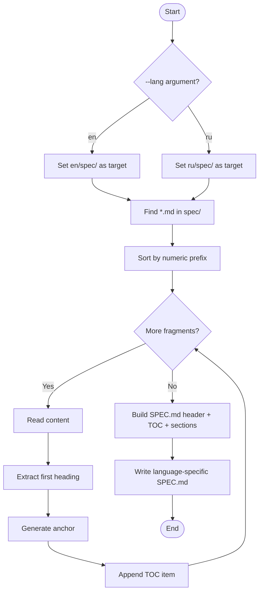

# Specification Builder

<cite>
**Referenced Files in This Document**
- [build_spec.py](file://specs/v1/tools/build_spec.py)
- [validate.py](file://specs/v1/tools/validate.py)
- [SPEC.md](file://specs/v1/en/SPEC.md)
- [SPEC.md](file://specs/v1/ru/SPEC.md)
- [SPEC.min.md](file://specs/v1/en/SPEC.min.md)
- [SPEC.min.md](file://specs/v1/ru/SPEC.min.md)
- [00-introduction.md](file://specs/v1/en/spec/00-introduction.md)
- [10-plan-file.md](file://specs/v1/en/spec/10-plan-file.md)
- [20-nodes.md](file://specs/v1/en/spec/20-nodes.md)
- [30-views-file.md](file://specs/v1/en/spec/30-views-file.md)
- [40-statuses.md](file://specs/v1/en/spec/40-statuses.md)
- [50-scheduling.md](file://specs/v1/en/spec/50-scheduling.md)
- [60-validation.md](file://specs/v1/en/spec/60-validation.md)
- [90-extensibility.md](file://specs/v1/en/spec/90-extensibility.md)
- [plan.schema.json](file://specs/v1/schemas/plan.schema.json)
- [views.schema.json](file://specs/v1/schemas/views.schema.json)
- [requirements.txt](file://specs/v1/tools/requirements.txt)
- [README.md](file://specs/v1/en/examples/hello/README.md)
- [hello.plan.yaml](file://specs/v1/en/examples/hello/hello.plan.yaml)
- [hello.views.yaml](file://specs/v1/en/examples/hello/hello.views.yaml)
- [project.plan.yaml](file://specs/v1/en/examples/minimal/project.plan.yaml)
- [spec_minify.prompt.txt](file://specs/v1/tools/prompts/spec_minify.prompt.txt)
- [Makefile](file://Makefile)
- [tools/README.md](file://specs/v1/tools/README.md)
</cite>

## Update Summary
**Changes Made**
- Added comprehensive bilingual processing support with language-specific targets
- Updated build process to support --lang argument for English and Russian specifications
- Enhanced CI/CD integration with language-specific build targets
- Added Russian localization for all user-facing messages and table of contents
- Updated architecture diagrams to reflect dual-language output system
- Expanded usage examples to include Russian specification generation

## Table of Contents
1. [Introduction](#introduction)
2. [Project Structure](#project-structure)
3. [Core Components](#core-components)
4. [Architecture Overview](#architecture-overview)
5. [Detailed Component Analysis](#detailed-component-analysis)
6. [Bilingual Processing System](#bilingual-processing-system)
7. [Ultra-Compact Specification Format](#ultra-compact-specification-format)
8. [Dependency Analysis](#dependency-analysis)
9. [Performance Considerations](#performance-considerations)
10. [Troubleshooting Guide](#troubleshooting-guide)
11. [Conclusion](#conclusion)
12. [Appendices](#appendices)

## Introduction
This document describes the Specification Builder for Opskarta's automated documentation generation with bilingual support. The system now supports simultaneous English and Russian specification generation, featuring language-specific targets (spec-en, spec-ru, spec-all) and enhanced build_spec.py with --lang argument support. It explains how individual Markdown fragments in the en/spec/ and ru/spec/ directories are assembled into separate SPEC.md files, including file naming conventions, sorting mechanisms, header extraction for table of contents, and automated TOC generation in both languages. The system includes ultra-compact specification formats (SPEC.min.md) for LLM integration in both languages, comprehensive build processes, output formatting, and CI/CD integration via --check modes for freshness validation. It covers usage examples, configuration options, maintenance procedures, and the relationship between specification fragments and generated specification files across both supported languages.

## Project Structure
The specification system is organized under specs/v1 with bilingual support for English and Russian:
- en/: English specification content and outputs
- ru/: Russian specification content and outputs
- tools/: Python scripts for building and validating specifications
- schemas/: JSON Schemas for structural validation
- examples/: Example plan and views files demonstrating usage
- SPEC.md: Generated comprehensive specification documents (English and Russian)
- SPEC.min.md: Ultra-compact specification formats for LLM integration (English and Russian)

**Diagram sources**
- [build_spec.py](file://specs/v1/tools/build_spec.py#L1-L301)
- [validate.py](file://specs/v1/tools/validate.py#L1-L752)
- [SPEC.md](file://specs/v1/en/SPEC.md#L1-L2035)
- [SPEC.md](file://specs/v1/ru/SPEC.md#L1-L2035)
- [SPEC.min.md](file://specs/v1/en/SPEC.min.md#L1-L89)
- [SPEC.min.md](file://specs/v1/ru/SPEC.min.md#L1-L122)

**Section sources**
- [build_spec.py](file://specs/v1/tools/build_spec.py#L1-L301)
- [SPEC.md](file://specs/v1/en/SPEC.md#L1-L2035)
- [SPEC.md](file://specs/v1/ru/SPEC.md#L1-L2035)
- [SPEC.min.md](file://specs/v1/en/SPEC.min.md#L1-L89)
- [SPEC.min.md](file://specs/v1/ru/SPEC.min.md#L1-L122)

## Core Components
- **Specification Builder (build_spec.py)**: Enhanced with bilingual support, scanning en/spec/ and ru/spec/ directories, sorting fragments by numeric prefix, extracting first-level headings for TOC in respective languages, and generating SPEC.md files with localized headers and horizontal dividers between sections.
- **Validator (validate.py)**: Validates plan and views files against semantic rules and optional JSON Schemas for both language variants.
- **Schemas**: JSON Schema definitions for plan and views structures.
- **Examples**: Minimal and hello examples demonstrating usage and rendering in both languages.
- **Ultra-Compact Compressor**: Uses codex to generate SPEC.min.md from SPEC.md using specialized prompt templates for both English and Russian.

Key behaviors:
- **File naming convention**: NN-name.md where NN is a zero-padded integer prefix (supports both English and Russian fragment names)
- **Sorting**: Natural numeric order by prefix within each language directory
- **Header extraction**: First-level heading (#) used for TOC anchors in respective languages
- **Anchor generation**: Lowercase, spaces to hyphens, ASCII letters/digits/hyphens only
- **Output**: Separate Markdown files with auto-generated headers and TOCs for English and Russian
- **Compression**: Automated generation of SPEC.min.md for both languages for LLM integration

**Section sources**
- [build_spec.py](file://specs/v1/tools/build_spec.py#L24-L121)
- [SPEC.md](file://specs/v1/en/SPEC.md#L1-L2035)
- [SPEC.md](file://specs/v1/ru/SPEC.md#L1-L2035)
- [SPEC.min.md](file://specs/v1/en/SPEC.min.md#L1-L89)
- [SPEC.min.md](file://specs/v1/ru/SPEC.min.md#L1-L122)

## Architecture Overview
The build pipeline transforms fragmented Markdown into unified specification documents for both English and Russian languages, supporting validation of plan/views artifacts. The system now includes dual-language compression stages that generate ultra-compact formats optimized for LLM integration in both supported languages.

**Diagram sources**
- [build_spec.py](file://specs/v1/tools/build_spec.py#L228-L297)
- [SPEC.md](file://specs/v1/en/SPEC.md#L1-L2035)
- [SPEC.md](file://specs/v1/ru/SPEC.md#L1-L2035)
- [SPEC.min.md](file://specs/v1/en/SPEC.min.md#L1-L89)
- [SPEC.min.md](file://specs/v1/ru/SPEC.min.md#L1-L122)
- [Makefile](file://Makefile#L129-L140)

## Detailed Component Analysis

### Specification Builder (build_spec.py)
**Updated** Enhanced with comprehensive bilingual support and language-specific processing capabilities.

Responsibilities:
- Locate language-specific spec/ directories (en/spec/ and ru/spec/)
- Validate and sort by numeric prefix within each language
- Extract first-level headings for TOC entries in respective languages
- Generate anchors compatible with GitHub-style Markdown
- Assemble final SPEC.md files with localized headers and section separators

Processing logic:
- **Language detection**: Supports 'en' and 'ru' languages via --lang argument
- **Directory resolution**: Dynamically resolves paths based on selected language
- **File discovery and sorting**: By numeric prefix within language-specific directories
- **Duplicate prefix detection**: Language-aware duplicate detection and failure
- **First-level heading extraction**: Per fragment with language-specific TOC generation
- **Anchor normalization**: For links in respective language contexts
- **Concatenation**: With horizontal dividers between sections for each language

**Diagram sources**
- [build_spec.py](file://specs/v1/tools/build_spec.py#L228-L297)

Usage and modes:
- **Default mode**: Generates en/SPEC.md (English)
- **Language-specific mode**: `python tools/build_spec.py --lang ru` generates ru/SPEC.md (Russian)
- **Check mode**: `python tools/build_spec.py --lang en --check` compares current output with existing SPEC.md and exits non-zero if outdated
- **Language-aware check**: Supports --check mode for both English and Russian outputs

Error handling:
- **Missing language directory**: Language-specific error messages in respective languages
- **No matching files found**: Language-aware error reporting
- **Non-conforming filenames**: Skipped with warning in respective language
- **Duplicate numeric prefixes**: Immediate failure with language-specific conflict reporting
- **Permission and OS errors**: Explicit messages in respective languages during write operations

**Section sources**
- [build_spec.py](file://specs/v1/tools/build_spec.py#L228-L297)

### Validator (validate.py)
Responsibilities:
- Parse YAML/JSON plan and views for both language variants
- Optional JSON Schema validation
- Semantic validation: required fields, referential integrity, date/time formats
- Cross-document checks (e.g., project vs meta.id)

Validation levels:
- Syntax: YAML/JSON parsing
- Schema: JSON Schema compliance
- Semantics: business rules and referential integrity

**Diagram sources**
- [validate.py](file://specs/v1/tools/validate.py#L634-L748)
- [plan.schema.json](file://specs/v1/schemas/plan.schema.json#L1-L86)
- [views.schema.json](file://specs/v1/schemas/views.schema.json#L1-L26)

**Section sources**
- [validate.py](file://specs/v1/tools/validate.py#L69-L748)

### Specification Fragments and Generated SPEC.md
**Updated** Now supports dual-language output with language-specific fragment processing.

Relationship:
- Each fragment in en/spec/ contributes a section to en/SPEC.md
- Each fragment in ru/spec/ contributes a section to ru/SPEC.md
- First-level headings become TOC entries in respective languages
- Horizontal dividers separate sections for readability in both languages
- Auto-generated headers instruct contributors not to edit SPEC.md files manually in either language

**Diagram sources**
- [00-introduction.md](file://specs/v1/en/spec/00-introduction.md#L1-L10)
- [10-plan-file.md](file://specs/v1/en/spec/10-plan-file.md#L1-L30)
- [20-nodes.md](file://specs/v1/en/spec/20-nodes.md#L1-L37)
- [30-views-file.md](file://specs/v1/en/spec/30-views-file.md#L1-L34)
- [40-statuses.md](file://specs/v1/en/spec/40-statuses.md#L1-L23)
- [50-scheduling.md](file://specs/v1/en/spec/50-scheduling.md#L1-L80)
- [60-validation.md](file://specs/v1/en/spec/60-validation.md#L1-L140)
- [90-extensibility.md](file://specs/v1/en/spec/90-extensibility.md#L1-L26)
- [SPEC.md](file://specs/v1/en/SPEC.md#L1-L2035)
- [SPEC.md](file://specs/v1/ru/SPEC.md#L1-L2035)

**Section sources**
- [SPEC.md](file://specs/v1/en/SPEC.md#L1-L2035)
- [SPEC.md](file://specs/v1/ru/SPEC.md#L1-L2035)

## Bilingual Processing System

### Overview
The bilingual processing system enables simultaneous generation of English and Russian specifications with language-specific targets and localized user interfaces. This system maintains parallel processing streams for both languages while sharing common infrastructure and validation logic.

### Language Support
- **Supported Languages**: English ('en') and Russian ('ru')
- **Language Detection**: Via --lang argument in build_spec.py
- **Directory Structure**: Language-specific directories (en/, ru/) with identical structure
- **Fragment Naming**: Supports both English and Russian fragment names
- **Localization**: Complete user interface localization including error messages, warnings, and table of contents

### Build Targets
- **spec-en**: Build English SPEC.md from en/spec/ fragments
- **spec-ru**: Build Russian SPEC.md from ru/spec/ fragments  
- **spec-all**: Build both English and Russian SPEC.md files
- **check-spec-en**: Check if English SPEC.md is up-to-date
- **check-spec-ru**: Check if Russian SPEC.md is up-to-date
- **check-spec-all**: Check both language SPEC.md files

### Localization Features
- **Table of Contents**: '## Table of Contents' (English) vs '## Оглавление' (Russian)
- **Auto-generated Headers**: English and Russian localized instructions
- **Error Messages**: All error and warning messages localized
- **File Operations**: Localized success/failure notifications
- **Anchor Generation**: Maintains compatibility while respecting language conventions

### CI/CD Integration
- **Parallel Builds**: spec-all target for concurrent language processing
- **Freshness Validation**: Language-specific --check modes for CI preflight checks
- **Consistent Output**: Both languages generated with identical fragment processing
- **Compression Pipeline**: Dual-language SPEC.min.md generation via codex

### Usage Scenarios
- **Single Language**: `python tools/build_spec.py --lang ru` for Russian-only generation
- **Dual Language**: `make spec-all` for simultaneous English and Russian generation
- **CI Integration**: `make check-spec-all` for comprehensive freshness validation
- **Development Workflow**: Language-specific targets for focused development cycles

**Section sources**
- [build_spec.py](file://specs/v1/tools/build_spec.py#L30-L71)
- [build_spec.py](file://specs/v1/tools/build_spec.py#L228-L297)
- [Makefile](file://Makefile#L98-L127)

## Ultra-Compact Specification Format

### Overview
The ultra-compact specification format (SPEC.min.md) provides condensed versions of the full specification optimized for LLM integration and copy-pasting in both languages. This format removes examples, tables, and verbose explanations while preserving all core definitions, invariants, formulas, and validation rules in the respective languages.

### Generation Process
The compression process uses specialized codex prompts that:
- Read the full language-specific SPEC.md as the authoritative source
- Remove examples, tables, and repetitive explanations
- Preserve definitions, invariants, formulas, regex patterns, priorities, and validation rules
- Maintain strict section numbering and structure
- Output pure text without markdown formatting in the respective language

### Compression Algorithm
The compression follows language-specific principles:
- **Core vs Non-Core**: Preserves MUST implementations, removes MAY implementations
- **Structural Definitions**: Keeps file structures, field definitions, and requirements
- **Scheduling Rules**: Maintains calendar calculations, duration formats, and priority rules
- **Validation Rules**: Preserves error/warn/info levels and validation matrices
- **Anti-Ambiguity**: Critical for LLM interpretation, preserved with explicit rules
- **Renderer Profiles**: Non-core sections removed, keeping only essential mappings

### Output Format
SPEC.min.md follows strict numbered format in each language:
- **English**: 10-section format covering general rules, plan structure, node definitions, status definitions, views validation, scheduling algorithms, migration rules, YAML normalization, validation levels, extensibility rules, and Mermaid renderer mappings
- **Russian**: 10-section format with Russian translations of all core concepts and technical terms

### Usage Scenarios
- **LLM Integration**: Copy-paste the entire language-specific SPEC.min.md into chat contexts
- **Quick Reference**: Rapid access to core rules without navigation in preferred language
- **Training Data**: Compact representations for AI training and evaluation in target language
- **Documentation**: Minimal format for embedding in other documents in native language

**Section sources**
- [SPEC.min.md](file://specs/v1/en/SPEC.min.md#L1-L89)
- [SPEC.min.md](file://specs/v1/ru/SPEC.min.md#L1-L122)
- [spec_minify.prompt.txt](file://specs/v1/tools/prompts/spec_minify.prompt.txt#L1-L80)
- [Makefile](file://Makefile#L129-L140)

## Dependency Analysis
External dependencies:
- PyYAML for parsing YAML in validator
- Optional jsonschema for schema validation
- **Codex CLI**: Required for SPEC.min.md generation (build-spec-min target) in both languages

Internal relationships:
- build_spec.py depends on language-specific spec/ layouts and fragment content
- validate.py depends on schemas/ and example files for testing
- examples demonstrate usage patterns and can be validated
- **spec_minify.prompt.txt**: Specialized prompts for compression process in both languages
- **Makefile**: Coordinates both full and compressed specification builds for both languages

**Diagram sources**
- [build_spec.py](file://specs/v1/tools/build_spec.py#L1-L301)
- [validate.py](file://specs/v1/tools/validate.py#L1-L752)
- [spec_minify.prompt.txt](file://specs/v1/tools/prompts/spec_minify.prompt.txt#L1-L80)
- [Makefile](file://Makefile#L129-L140)
- [SPEC.md](file://specs/v1/en/SPEC.md#L1-L2035)
- [SPEC.md](file://specs/v1/ru/SPEC.md#L1-L2035)
- [SPEC.min.md](file://specs/v1/en/SPEC.min.md#L1-L89)
- [SPEC.min.md](file://specs/v1/ru/SPEC.min.md#L1-L122)

**Section sources**
- [requirements.txt](file://specs/v1/tools/requirements.txt#L1-L10)
- [validate.py](file://specs/v1/tools/validate.py#L76-L128)
- [Makefile](file://Makefile#L129-L140)

## Performance Considerations
- **File discovery and sorting**: Linear in the number of fragments within each language directory
- **Header extraction and anchor generation**: Linear per fragment within each language
- **IO operations**: Bounded by total fragment size; memory usage proportional to combined content for each language
- **The --check mode**: Avoids unnecessary writes and is efficient for CI preflight checks for both languages
- **Compression performance**: Codex processing adds minimal overhead but requires external CLI availability for both languages
- **SPEC.min.md generation**: Single pass through language-specific SPEC.md content with prompt processing for each language
- **Parallel processing**: spec-all target enables concurrent processing of both languages for improved efficiency

## Troubleshooting Guide
Common issues and resolutions:
- **Missing language directory**: The builder reports language-specific errors and exits
- **No *.md files in language directory**: Language-aware error reporting with guidance
- **Non-conforming filenames**: Skipped with language-specific warnings; ensure NN-name.md format
- **Duplicate numeric prefixes**: Builder fails immediately with language-specific prefix conflict
- **Permission errors writing SPEC.md**: Explicit permission error in respective language reported
- **Validation failures**: Validator prints structured error messages with path, expected, and available values in appropriate language
- **Missing optional jsonschema dependency**: Install via requirements.txt comments
- **Missing codex CLI**: The build-spec-min target requires codex to be installed and available in PATH for both languages
- **SPEC.min.md generation failures**: Check codex configuration and prompt file accessibility for both languages

Operational tips:
- Use language-specific --check modes in CI to detect stale SPEC.md files
- Keep fragment filenames consistent with NN- naming in both languages
- Validate examples locally before committing changes to either language
- **Use build-spec-min for both languages**: Keep SPEC.min.md synchronized with SPEC.md files
- **Test compression separately**: Run `make build-spec-min` independently to verify compression for both languages
- **Monitor language-specific outputs**: Ensure both en/SPEC.md and ru/SPEC.md are generated correctly

**Section sources**
- [build_spec.py](file://specs/v1/tools/build_spec.py#L55-L86)
- [build_spec.py](file://specs/v1/tools/build_spec.py#L209-L236)
- [validate.py](file://specs/v1/tools/validate.py#L30-L111)
- [validate.py](file://specs/v1/tools/validate.py#L690-L748)
- [Makefile](file://Makefile#L129-L140)

## Conclusion
The Specification Builder automates the assembly of cohesive specifications from modular Markdown fragments in both English and Russian languages, ensuring predictable ordering, accurate TOC generation, and single-source-of-truth outputs. The addition of bilingual processing capabilities significantly enhances the system's internationalization support while maintaining the ultra-compact SPEC.min.md format for LLM integration in both supported languages. Combined with the validator and JSON Schemas, it enables robust documentation and artifact validation workflows suitable for CI/CD integration across multiple language variants.

## Appendices

### Usage Examples
- **Build English specification**:
  - From specs/v1: python tools/build_spec.py
  - From specs/v1: python tools/build_spec.py --lang en
- **Build Russian specification**:
  - From specs/v1: python tools/build_spec.py --lang ru
- **Validate artifacts**:
  - From specs/v1: python tools/validate.py examples/en/hello/hello.plan.yaml examples/en/hello/hello.views.yaml
  - From specs/v1: python tools/validate.py examples/ru/hello/hello.plan.yaml examples/ru/hello/hello.views.yaml
- **Validate with JSON Schema**:
  - From specs/v1: python tools/validate.py --schema examples/en/hello/hello.plan.yaml examples/en/hello/hello.views.yaml
  - From specs/v1: python tools/validate.py --schema examples/ru/hello/hello.plan.yaml examples/ru/hello/hello.views.yaml
- **Check SPEC.md freshness**:
  - From specs/v1: python tools/build_spec.py --lang en --check
  - From specs/v1: python tools/build_spec.py --lang ru --check
- **Generate ultra-compact format**:
  - From specs/v1: make build-spec-min
  - From specs/v1: codex -c model_reasoning_effort='"low"' exec --sandbox read-only --color never -o en/SPEC.min.md - < tools/prompts/spec_minify.prompt.txt
  - From specs/v1: codex -c model_reasoning_effort='"low"' exec --sandbox read-only --color never -o ru/SPEC.min.md - < tools/prompts/spec_minify.prompt.txt

**Section sources**
- [README.md](file://specs/v1/en/examples/hello/README.md#L28-L45)
- [build_spec.py](file://specs/v1/tools/build_spec.py#L174-L184)
- [validate.py](file://specs/v1/tools/validate.py#L634-L684)
- [Makefile](file://Makefile#L129-L140)

### Configuration Options
- **build_spec.py**
  - --lang: Specify language ('en' for English, 'ru' for Russian, default: en)
  - --check: Compare current output with existing SPEC.md and exit non-zero if outdated
- **validate.py**
  - --schema: Enable JSON Schema validation
  - --plan-schema PATH: Override plan schema path
  - --views-schema PATH: Override views schema path
- **build-spec-min (Makefile target)**
  - Requires codex CLI installation
  - Configured with low reasoning effort for deterministic output
  - Uses read-only sandbox for security
  - Generates SPEC.min.md in both en/ and ru/ directories

**Section sources**
- [build_spec.py](file://specs/v1/tools/build_spec.py#L230-L244)
- [validate.py](file://specs/v1/tools/validate.py#L666-L684)
- [Makefile](file://Makefile#L129-L140)

### Maintenance Procedures
- **Adding a new fragment**:
  - Choose the next available NN prefix in both en/spec/ and ru/spec/
  - Name files NN-title.md (English) and NN-название.md (Russian)
  - Ensure first-level headings match intended TOC entries in respective languages
- **Updating existing fragments**:
  - Preserve NN prefixes to maintain ordering in both languages
  - Regenerate SPEC.md files for both languages and validate
  - Regenerate SPEC.min.md files for both languages to maintain synchronization
- **Removing fragments**:
  - Re-number subsequent fragments in both language directories to keep gaps free
- **CI integration**:
  - Run python tools/build_spec.py --lang en --check and python tools/build_spec.py --lang ru --check in pre-commit/pre-merge checks
  - Optionally run python tools/validate.py on changed examples
  - Include make spec-all and make check-spec-all in CI pipeline for comprehensive language coverage
- **Compression maintenance**:
  - Update spec_minify.prompt.txt when core rules change significantly
  - Test compression with new SPEC.md files before merging
  - Monitor codex availability in CI environments for both languages

**Section sources**
- [build_spec.py](file://specs/v1/tools/build_spec.py#L24-L121)
- [SPEC.md](file://specs/v1/en/SPEC.md#L1-L2035)
- [SPEC.md](file://specs/v1/ru/SPEC.md#L1-L2035)
- [SPEC.min.md](file://specs/v1/en/SPEC.min.md#L1-L89)
- [SPEC.min.md](file://specs/v1/ru/SPEC.min.md#L1-L122)
- [Makefile](file://Makefile#L129-L140)

### Version Control Integration and Workflow
- **Treat SPEC.md files as generated output**: Do not edit manually in either language
- **Commit changes to both language fragment sets**: Update en/spec/ and ru/spec/ fragments and regenerate both SPEC.md files
- **Use language-specific --check modes**: Prevent stale documentation in CI for both languages
- **Keep schemas/ and examples/ aligned**: Ensure both language variants are maintained consistently
- **Treat SPEC.min.md files as secondary generated output**: Both English and Russian versions should be included in version control
- **Automate dual-language regeneration**: Include both spec-all and build-spec-min in CI pipelines for comprehensive coverage
- **Maintain parallel development**: Changes should be made simultaneously to both language variants

**Section sources**
- [SPEC.md](file://specs/v1/en/SPEC.md#L1-L2035)
- [SPEC.md](file://specs/v1/ru/SPEC.md#L1-L2035)
- [SPEC.min.md](file://specs/v1/en/SPEC.min.md#L1-L89)
- [SPEC.min.md](file://specs/v1/ru/SPEC.min.md#L1-L122)
- [build_spec.py](file://specs/v1/tools/build_spec.py#L174-L236)
- [Makefile](file://Makefile#L129-L140)