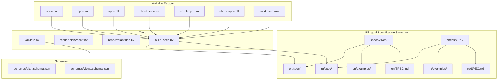
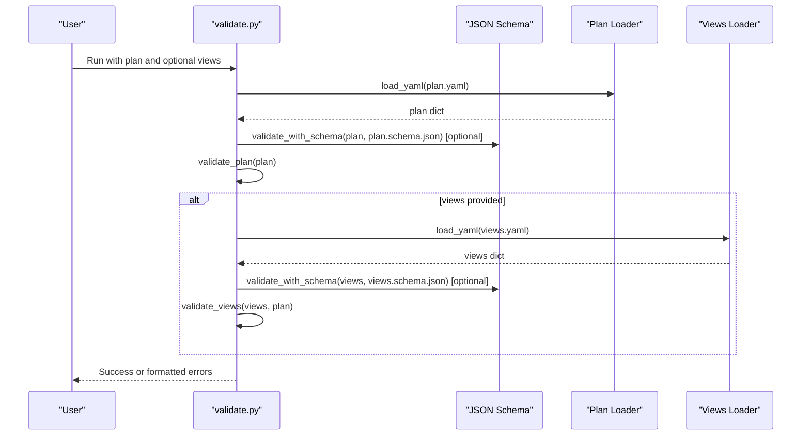
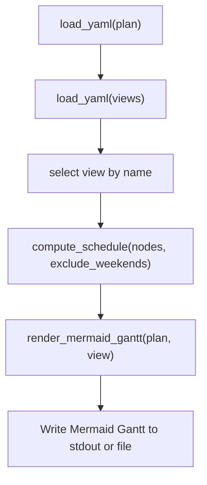
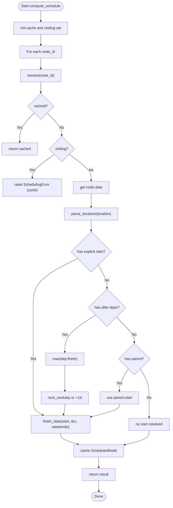
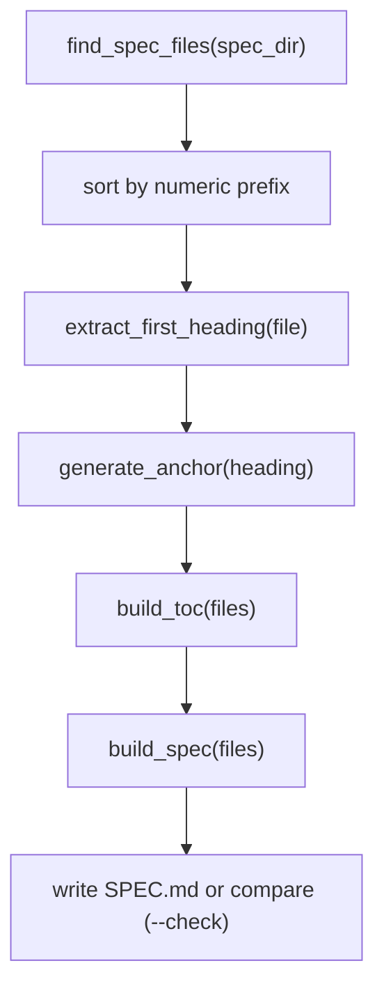
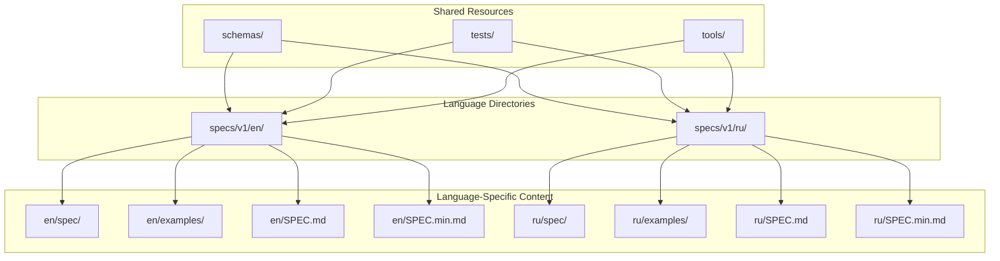
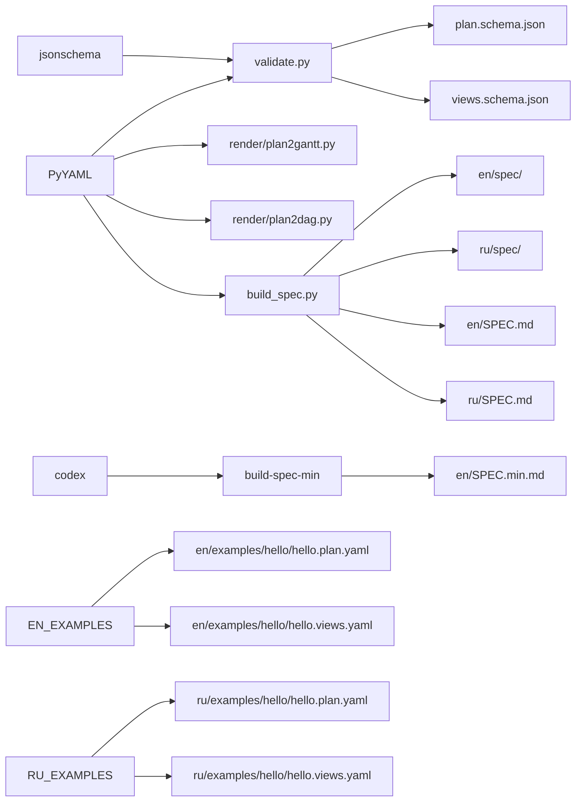

# Tooling and Utilities

<cite>
**Referenced Files in This Document**
- [validate.py](file://specs/v1/tools/validate.py)
- [plan2gantt.py](file://specs/v1/tools/render/plan2gantt.py)
- [plan2dag.py](file://specs/v1/tools/render/plan2dag.py)
- [build_spec.py](file://specs/v1/tools/build_spec.py)
- [README.md (Tools)](file://specs/v1/tools/README.md)
- [README.md (v1 Root)](file://specs/v1/README.md)
- [Makefile](file://Makefile)
- [plan.schema.json](file://specs/v1/schemas/plan.schema.json)
- [views.schema.json](file://specs/v1/schemas/views.schema.json)
- [hello.plan.yaml](file://specs/v1/en/examples/hello/hello.plan.yaml)
- [hello.views.yaml](file://specs/v1/en/examples/hello/hello.views.yaml)
- [program.plan.yaml](file://specs/v1/en/examples/advanced/program.plan.yaml)
- [program.views.yaml](file://specs/v1/en/examples/advanced/program.views.yaml)
- [60-validation.md](file://specs/v1/spec/60-validation.md)
- [50-scheduling.md](file://specs/v1/spec/50-scheduling.md)
- [requirements.txt](file://specs/v1/tools/requirements.txt)
- [spec_minify.prompt.txt](file://specs/v1/tools/prompts/spec_minify.prompt.txt)
- [00-introduction.md](file://specs/v1/en/spec/00-introduction.md)
- [00-introduction.md](file://specs/v1/ru/spec/00-introduction.md)
</cite>

## Update Summary
**Changes Made**
- Added comprehensive documentation for bilingual specification handling with English and Russian language support
- Documented new language-specific build targets: spec-en, spec-ru, spec-all, check-spec-en, check-spec-ru, check-spec-all
- Enhanced validation tool documentation with language-aware features
- Updated Makefile targets to support bilingual workflows
- Added documentation for the new build-spec.py --lang parameter and localization support
- Documented the new spec-min target for LLM integration with Russian prompt template

## Table of Contents
1. [Introduction](#introduction)
2. [Project Structure](#project-structure)
3. [Core Components](#core-components)
4. [Architecture Overview](#architecture-overview)
5. [Detailed Component Analysis](#detailed-component-analysis)
6. [Bilingual Specification Management](#bilingual-specification-management)
7. [Dependency Analysis](#dependency-analysis)
8. [Performance Considerations](#performance-considerations)
9. [Troubleshooting Guide](#troubleshooting-guide)
10. [Conclusion](#conclusion)
11. [Appendices](#appendices)

## Introduction
This document describes the reference implementation tools for Opskarta v1: validation, Mermaid Gantt rendering, and specification building. It explains the validation system (syntax, schema, semantic, and dependency resolution), the Mermaid Gantt rendering engine and scheduling computation, and the specification builder for automated documentation generation. The tools now support bilingual specification management with English as the primary language and Russian as the translation. It also covers CLI usage, parameters, output formats, Python APIs for programmatic access, error handling/logging, performance considerations, and CI/CD integration patterns.

## Project Structure
The tools live under specs/v1/tools and are designed to be runnable from that directory. They support bilingual specification management with separate directories for English (en/) and Russian (ru/) content. They rely on YAML files for plans (.plan.yaml) and views (.views.yaml), and optionally on JSON Schema definitions for formal validation.



**Diagram sources**
- [build_spec.py](file://specs/v1/tools/build_spec.py#L30-L71)
- [Makefile](file://Makefile#L98-L127)
- [Makefile](file://Makefile#L129-L140)

**Section sources**
- [README.md (v1 Root)](file://specs/v1/README.md#L1-L55)
- [README.md (Tools)](file://specs/v1/tools/README.md#L1-L202)
- [Makefile](file://Makefile#L1-L321)

## Core Components
- Validation tool: validates plan and views files against syntax, JSON Schema (optional), and semantic/business rules including cross-references and dependency cycles.
- Mermaid Gantt renderer: computes schedules from plan nodes and renders Gantt diagrams in Mermaid format for selected views.
- Mermaid DAG renderer: generates dependency graphs from plan files with hierarchical and flow relationships visualization.
- Specification builder: aggregates spec/*.md fragments into a single SPEC.md with automatic table of contents and supports bilingual output.
- **New**: Bilingual specification management: builds English and Russian specifications with localized error messages and table of contents.
- **New**: Specification compressor: generates a minified version of the English specification for LLM integration.

**Section sources**
- [validate.py](file://specs/v1/tools/validate.py#L135-L329)
- [plan2gantt.py](file://specs/v1/tools/render/plan2gantt.py#L217-L294)
- [plan2dag.py](file://specs/v1/tools/render/plan2dag.py#L1-L200)
- [build_spec.py](file://specs/v1/tools/build_spec.py#L30-L71)
- [build_spec.py](file://specs/v1/tools/build_spec.py#L228-L244)

## Architecture Overview
The tools are command-line scripts with clear separation of concerns and enhanced bilingual support:
- Input loading: YAML parsing with robust error reporting.
- Plan validation: semantic checks and dependency cycle detection.
- Views validation: cross-checks against plan metadata and node references.
- Rendering: schedule computation and Mermaid Gantt/DAG generation.
- Specification building: file discovery, ordering, TOC generation, and content assembly with language-specific localization.
- **New**: Bilingual processing: language-aware file paths, localized error messages, and separate output directories.



**Diagram sources**
- [validate.py](file://specs/v1/tools/validate.py#L690-L740)
- [plan.schema.json](file://specs/v1/schemas/plan.schema.json#L1-L86)
- [views.schema.json](file://specs/v1/schemas/views.schema.json#L1-L26)

## Detailed Component Analysis

### Validation Tool
The validator performs three levels:
- Syntax: YAML parsing with informative errors.
- Schema: optional JSON Schema validation via jsonschema.
- Semantics: structural and business rule checks including cross-references and dependency cycles.

Key capabilities:
- Loads YAML safely and enforces root object type.
- Validates plan version and nodes structure, title presence, and fields start/duration formats.
- Enforces referential integrity for parent, after, and status.
- Detects cycles in parent and after relationships.
- Validates views version, project alignment with plan meta.id, and lane node references.
- Optional JSON Schema validation for both plan and views.


**Diagram sources**
- [validate.py](file://specs/v1/tools/validate.py#L690-L740)

**Section sources**
- [validate.py](file://specs/v1/tools/validate.py#L69-L129)
- [validate.py](file://specs/v1/tools/validate.py#L135-L329)
- [validate.py](file://specs/v1/tools/validate.py#L431-L579)
- [validate.py](file://specs/v1/tools/validate.py#L586-L618)
- [validate.py](file://specs/v1/tools/validate.py#L634-L752)
- [60-validation.md](file://specs/v1/spec/60-validation.md#L1-L140)
- [plan.schema.json](file://specs/v1/schemas/plan.schema.json#L1-L86)
- [views.schema.json](file://specs/v1/schemas/views.schema.json#L1-L26)

### Mermaid Gantt Renderer
The renderer computes schedules and produces Mermaid Gantt output for a chosen view. It supports:
- Date parsing (YYYY-MM-DD) and duration parsing (int or '<n>d').
- Workday arithmetic and weekend exclusion.
- Recursive schedule resolution respecting parent and after dependencies.
- Theme customization from plan statuses and per-view options.
- **Enhanced**: Comprehensive CLI with listing, markdown wrapping, and output control.



**Diagram sources**
- [plan2gantt.py](file://specs/v1/tools/render/plan2gantt.py#L439-L549)
- [plan2gantt.py](file://specs/v1/tools/render/plan2gantt.py#L217-L294)
- [plan2gantt.py](file://specs/v1/tools/render/plan2gantt.py#L349-L433)

Date calculation and scheduling computation:
- Date parsing and duration normalization.
- Weekend detection and workday addition.
- Finish date computation considering duration and weekend exclusion.
- Top-down recursive resolution with cycle detection and caching.



**Diagram sources**
- [plan2gantt.py](file://specs/v1/tools/render/plan2gantt.py#L217-L294)
- [plan2gantt.py](file://specs/v1/tools/render/plan2gantt.py#L92-L207)

**Section sources**
- [plan2gantt.py](file://specs/v1/tools/render/plan2gantt.py#L49-L86)
- [plan2gantt.py](file://specs/v1/tools/render/plan2gantt.py#L92-L207)
- [plan2gantt.py](file://specs/v1/tools/render/plan2gantt.py#L217-L294)
- [plan2gantt.py](file://specs/v1/tools/render/plan2gantt.py#L349-L433)
- [plan2gantt.py](file://specs/v1/tools/render/plan2gantt.py#L439-L549)
- [plan2gantt.py](file://specs/v1/tools/render/plan2gantt.py#L957-L1026)
- [50-scheduling.md](file://specs/v1/spec/50-scheduling.md#L1-L80)

### Mermaid DAG Renderer
The DAG renderer generates dependency graphs from plan files, visualizing both decomposition hierarchy and flow dependencies:
- Visualizes both parent-child relationships and after dependencies.
- Uses dashed arrows for parent relationships and solid arrows for after dependencies.
- Supports status-based coloring with emoji prefixes.
- Provides filtering by track and smart arrow rendering to avoid redundancy.

**Section sources**
- [plan2dag.py](file://specs/v1/tools/render/plan2dag.py#L1-L200)
- [plan2dag.py](file://specs/v1/tools/render/plan2dag.py#L200-L400)

### Specification Builder
The builder collects spec/*.md files ordered by numeric prefix, extracts first-level headings for TOC anchors, and generates a unified SPEC.md. It supports a check mode to detect staleness without rewriting and now includes comprehensive bilingual support with localized error messages and table of contents.



**Diagram sources**
- [build_spec.py](file://specs/v1/tools/build_spec.py#L46-L87)
- [build_spec.py](file://specs/v1/tools/build_spec.py#L89-L99)
- [build_spec.py](file://specs/v1/tools/build_spec.py#L101-L121)
- [build_spec.py](file://specs/v1/tools/build_spec.py#L123-L145)
- [build_spec.py](file://specs/v1/tools/build_spec.py#L147-L172)
- [build_spec.py](file://specs/v1/tools/build_spec.py#L174-L240)

**Section sources**
- [build_spec.py](file://specs/v1/tools/build_spec.py#L46-L87)
- [build_spec.py](file://specs/v1/tools/build_spec.py#L123-L145)
- [build_spec.py](file://specs/v1/tools/build_spec.py#L147-L172)
- [build_spec.py](file://specs/v1/tools/build_spec.py#L174-L240)

### Specification Compressor (New)
The specification compressor generates a minified version of the English specification for LLM integration:
- Uses the `codex` tool with specific configuration parameters.
- Applies a Russian-language prompt template for compression.
- Produces SPEC.min.md for efficient LLM prompting.
- Maintains semantic completeness while removing examples and explanations.

**Section sources**
- [Makefile](file://Makefile#L129-L140)
- [spec_minify.prompt.txt](file://specs/v1/tools/prompts/spec_minify.prompt.txt#L1-L80)

## Bilingual Specification Management

### Language Support Architecture
Opskarta v1 now supports bilingual specification management with English as the primary language and Russian as the translation. The system maintains separate directories for each language while sharing common schemas and tools.



**Diagram sources**
- [README.md (v1 Root)](file://specs/v1/README.md#L12-L31)

### Build Targets for Bilingual Specifications
The Makefile provides comprehensive language-specific build targets for managing bilingual specifications:

#### Language-Specific Build Targets
- **spec-en**: Build English SPEC.md from en/spec/ sources
- **spec-ru**: Build Russian SPEC.md from ru/spec/ sources  
- **spec-all**: Build both English and Russian SPEC.md files
- **check-spec-en**: Check if English SPEC.md is up-to-date
- **check-spec-ru**: Check if Russian SPEC.md is up-to-date
- **check-spec-all**: Check both language SPEC.md files

#### Validation Targets for Both Languages
- **validate-examples-en**: Validate English example files
- **validate-examples-ru**: Validate Russian example files  
- **validate-examples-all**: Validate all language example files

#### Localized Error Messages
The build_spec.py tool now supports localized error messages and table of contents:
- English: "Table of Contents", "Generated file", "Error: duplicate numeric prefix"
- Russian: "Оглавление", "Сгенерирован файл", "Ошибка: дублирующийся числовой префикс"

**Section sources**
- [Makefile](file://Makefile#L98-L127)
- [Makefile](file://Makefile#L169-L187)
- [build_spec.py](file://specs/v1/tools/build_spec.py#L34-L71)
- [README.md (v1 Root)](file://specs/v1/README.md#L33-L47)

### Specification Builder Enhancements
The build_spec.py tool has been enhanced with comprehensive bilingual support:

#### Language-Aware File Processing
- **get_lang_dir(lang)**: Returns path to language directory (e.g., specs/v1/en/)
- **get_spec_dir(lang)**: Returns path to spec/ directory for given language
- **get_output_path(lang)**: Returns path to output SPEC.md file for language
- **Supported languages**: 'en' and 'ru'

#### Localized User Interface
The tool provides localized feedback messages:
- **English**: "Found {count} specification files:", "✓ Generated file '{path}'"
- **Russian**: "Найдено {count} файлов спецификации:", "✓ Сгенерирован файл '{path}'"

#### Error Handling Localization
All error messages are localized:
- Directory not found errors
- File format validation errors  
- Duplicate prefix detection
- Write permission errors

**Section sources**
- [build_spec.py](file://specs/v1/tools/build_spec.py#L80-L98)
- [build_spec.py](file://specs/v1/tools/build_spec.py#L34-L71)
- [build_spec.py](file://specs/v1/tools/build_spec.py#L228-L244)

## Dependency Analysis
External dependencies:
- PyYAML: required for YAML parsing in all tools.
- jsonschema: optional, enables formal schema validation in the validator.
- **New**: codex: required for specification compression (build-spec-min target).

Internal relationships:
- validate.py loads plan and views YAML, optionally validates via JSON Schema, then runs semantic checks.
- plan2gantt.py loads plan and views YAML, computes schedules, and renders Mermaid output.
- plan2dag.py generates dependency graphs from plan files.
- build_spec.py reads spec/*.md files and writes SPEC.md with language-specific localization.
- **New**: spec_minify.prompt.txt provides compression template for SPEC.min.md generation.



**Diagram sources**
- [requirements.txt](file://specs/v1/tools/requirements.txt#L1-L10)
- [validate.py](file://specs/v1/tools/validate.py#L69-L129)
- [plan2gantt.py](file://specs/v1/tools/render/plan2gantt.py#L49-L86)
- [plan2dag.py](file://specs/v1/tools/render/plan2dag.py#L1-L200)
- [build_spec.py](file://specs/v1/tools/build_spec.py#L174-L240)
- [Makefile](file://Makefile#L129-L140)
- [plan.schema.json](file://specs/v1/schemas/plan.schema.json#L1-L86)
- [views.schema.json](file://specs/v1/schemas/views.schema.json#L1-L26)
- [hello.plan.yaml](file://specs/v1/en/examples/hello/hello.plan.yaml#L1-L44)
- [hello.views.yaml](file://specs/v1/en/examples/hello/hello.views.yaml#L1-L13)

**Section sources**
- [requirements.txt](file://specs/v1/tools/requirements.txt#L1-L10)
- [validate.py](file://specs/v1/tools/validate.py#L599-L618)
- [README.md (Tools)](file://specs/v1/tools/README.md#L93-L126)

## Performance Considerations
- Validation:
  - O(V + E) for dependency checks where V is nodes and E is edges in after relations.
  - DFS-based cycle detection with visited/state arrays prevents redundant recomputation.
- Rendering:
  - Schedule computation caches results per node to avoid repeated resolution.
  - Weekend exclusion adds linear passes over workdays; keep lists of excluded dates minimal.
- **Enhanced**: Plan2Gantt:
  - Improved caching mechanisms and cycle detection for complex dependency chains.
  - Optimized calendar calculations with efficient workday arithmetic.
- Specification building:
  - Sorting by numeric prefix is O(n log n); file I/O dominates for typical spec sizes.
  - **New**: Bilingual processing adds minimal overhead for language selection and file path resolution.
- **New**: Specification compression:
  - Efficient text processing using codex with memory constraints.
  - Stream-based processing to handle large specification files.
  - Russian prompt template optimization for LLM integration.

Optimization tips for large operational maps:
- Prefer explicit start dates for critical nodes to reduce dependency traversal.
- Limit deep nesting and long after chains to reduce recursion depth.
- Use views to partition large plans into focused lanes.
- Cache rendered outputs and regenerate only on changes.
- **Enhanced**: Utilize the new CLI options for selective rendering and output control.
- **New**: Use spec-all for building both language versions in a single operation.
- **New**: Use build-spec-min for LLM integration scenarios where compressed specifications are preferred.

## Troubleshooting Guide
Common issues and remedies:
- Missing or invalid YAML: YAML parsing errors are surfaced with file context.
- Missing PyYAML: install via requirements.txt.
- Missing jsonschema: install to enable --schema mode.
- **New**: Missing codex: install to enable build-spec-min target.
- Reference errors: validate reports path, value, expected, and available candidates.
- Cycle detection: errors indicate the cyclic path for parent or after.
- Scheduling errors: errors indicate cycles, missing nodes, or unsupported duration formats.
- File errors: missing files or unreadable content cause descriptive messages.
- **Enhanced**: Plan2Gantt CLI errors: use --list-views to debug view availability and --markdown for proper output formatting.
- **New**: Bilingual build errors: check language-specific directories exist and contain proper file structure.

Debugging tips:
- Use --schema to add JSON Schema checks alongside semantic validation.
- For rendering, verify that the selected view exists and all referenced node IDs exist in the plan.
- For spec building, ensure filenames follow NN-name.md pattern and numeric prefixes are unique.
- **Enhanced**: Use --list-views to enumerate available views when encountering "unknown view" errors.
- **New**: Use --lang parameter to specify target language for build_spec.py operations.
- **New**: Use check-spec-all to verify both language specifications are up-to-date.
- **New**: Use spec-all to rebuild both language specifications simultaneously.

**Section sources**
- [validate.py](file://specs/v1/tools/validate.py#L30-L63)
- [validate.py](file://specs/v1/tools/validate.py#L742-L748)
- [plan2gantt.py](file://specs/v1/tools/render/plan2gantt.py#L30-L43)
- [plan2gantt.py](file://specs/v1/tools/render/plan2gantt.py#L539-L544)
- [plan2gantt.py](file://specs/v1/tools/render/plan2gantt.py#L957-L1026)
- [build_spec.py](file://specs/v1/tools/build_spec.py#L210-L236)

## Conclusion
The Opskarta v1 tooling provides a robust, extensible pipeline for validating plans and views, computing schedules, and generating specification documentation. The tools are designed for simplicity, clarity, and composability, enabling integration into local workflows and CI/CD systems. **Recent enhancements** include comprehensive bilingual specification support, improved rendering capabilities, automated specification compression, and streamlined Makefile targets for better developer experience across English and Russian content management.

## Appendices

### CLI Usage and Parameters

#### Enhanced CLI Usage Patterns

- **validate.py**
  - Positional arguments:
    - plan_file: path to *.plan.yaml
    - views_file: path to *.views.yaml (optional)
  - Options:
    - --schema: additionally validate via JSON Schema
    - --plan-schema PATH: custom plan schema path
    - --views-schema PATH: custom views schema path
  - Outputs:
    - Success messages and warnings
    - Formatted error messages with path/value/expected/available when applicable

- **render/plan2gantt.py** (Enhanced)
  - Required:
    - --plan PATH: path to *.plan.yaml
    - --views PATH: path to *.views.yaml
    - --view NAME: view name from gantt_views
  - Options:
    - --output PATH: write result to file (default: stdout)
    - --list-views: list available views and exit
    - --markdown: wrap output in ```mermaid
  - Outputs:
    - Mermaid Gantt fenced block suitable for Markdown

- **render/plan2dag.py**
  - Required:
    - --plan PATH: path to *.plan.yaml
  - Options:
    - --direction LR|TB|BT|RL: graph direction (default: LR)
    - --wrap-column N: wrap node labels at column N (0 = no wrap)
    - --track STRING: limit diagram to specific track(s), can be repeated
  - Outputs:
    - Mermaid flowchart suitable for documentation

- **build_spec.py** (Enhanced)
  - Options:
    - --lang EN|RU: language to build (default: en)
    - --check: check SPEC.md freshness without writing
  - Outputs:
    - Generates SPEC.md or reports staleness

- **build_spec.py (Minified)** (New)
  - Options:
    - --minify: generate SPEC.min.md using codex
  - Outputs:
    - Generates SPEC.min.md for LLM integration

**Section sources**
- [validate.py](file://specs/v1/tools/validate.py#L634-L752)
- [plan2gantt.py](file://specs/v1/tools/render/plan2gantt.py#L957-L1026)
- [plan2dag.py](file://specs/v1/tools/render/plan2dag.py#L135-L153)
- [build_spec.py](file://specs/v1/tools/build_spec.py#L228-L244)
- [README.md (Tools)](file://specs/v1/tools/README.md#L14-L126)

### Python API (Programmatic Access)
- Validation:
  - load_yaml(file_path: Path) -> Dict[str, Any]
  - load_json_schema(schema_path: Path) -> Dict[str, Any]
  - validate_with_schema(data: Dict[str, Any], schema: Dict[str, Any], file_type: str) -> List[str]
  - validate_plan(plan: Dict[str, Any]) -> List[str]
  - validate_views(views: Dict[str, Any], plan: Dict[str, Any]) -> List[str]
- Rendering:
  - load_yaml(path: str | Path) -> Dict[str, Any]
  - parse_date(value: str) -> date
  - parse_duration(value: Any) -> int
  - is_weekend(d: date) -> bool
  - next_workday(d: date) -> date
  - add_workdays(start: date, workdays: int) -> date
  - finish_date(start: date, duration_days: int, exclude_weekends: bool) -> date
  - compute_schedule(nodes: Dict[str, Dict[str, Any]], exclude_weekends: bool) -> Dict[str, ScheduledNode]
  - render_mermaid_gantt(plan: Dict[str, Any], view: Dict[str, Any]) -> str
- **Enhanced**: Plan2Gantt:
  - load_yaml_unique(path: str) -> Dict[str, Any]
  - validate_plan(plan: Dict[str, Any], rep: Reporter) -> None
  - validate_views(views: Dict[str, Any], plan: Dict[str, Any], rep: Reporter) -> None
  - compute_node_schedule(node_id: str, plan: Dict[str, Any], cal: Calendar, rep: Reporter, cache: Dict[str, NodeSchedule], visiting: Set[str]) -> NodeSchedule
  - render_gantt_mermaid(plan: Dict[str, Any], view: Dict[str, Any], view_id: str, rep: Reporter) -> str
  - main(argv: Optional[List[str]] = None) -> None
- **Enhanced**: Specification building:
  - find_spec_files(spec_dir: Path, lang: str) -> List[Tuple[int, Path]]
  - extract_first_heading(content: str) -> Optional[str]
  - generate_anchor(heading: str) -> str
  - build_toc(files: List[Tuple[int, Path]], lang: str) -> str
  - build_spec(files: List[Tuple[int, Path]], lang: str) -> str
  - get_string(lang: str, key: str, **kwargs) -> str

**Section sources**
- [validate.py](file://specs/v1/tools/validate.py#L69-L129)
- [validate.py](file://specs/v1/tools/validate.py#L586-L618)
- [validate.py](file://specs/v1/tools/validate.py#L135-L329)
- [validate.py](file://specs/v1/tools/validate.py#L431-L579)
- [plan2gantt.py](file://specs/v1/tools/render/plan2gantt.py#L49-L86)
- [plan2gantt.py](file://specs/v1/tools/render/plan2gantt.py#L92-L207)
- [plan2gantt.py](file://specs/v1/tools/render/plan2gantt.py#L217-L294)
- [plan2gantt.py](file://specs/v1/tools/render/plan2gantt.py#L349-L433)
- [plan2gantt.py](file://specs/v1/tools/render/plan2gantt.py#L847-L951)
- [plan2gantt.py](file://specs/v1/tools/render/plan2gantt.py#L957-L1026)
- [build_spec.py](file://specs/v1/tools/build_spec.py#L46-L87)
- [build_spec.py](file://specs/v1/tools/build_spec.py#L89-L99)
- [build_spec.py](file://specs/v1/tools/build_spec.py#L101-L121)
- [build_spec.py](file://specs/v1/tools/build_spec.py#L123-L145)
- [build_spec.py](file://specs/v1/tools/build_spec.py#L147-L172)

### Makefile Targets and Enhanced Workflows

#### New Bilingual Build Targets

- **spec-en**: Build English SPEC.md from en/spec/ sources
  - Usage: `make spec-en`
  - Executes: `python tools/build_spec.py --lang en`

- **spec-ru**: Build Russian SPEC.md from ru/spec/ sources  
  - Usage: `make spec-ru`
  - Executes: `python tools/build_spec.py --lang ru`

- **spec-all**: Build both English and Russian SPEC.md files
  - Usage: `make spec-all`
  - Executes: `make spec-en spec-ru`

- **check-spec-en**: Check if English SPEC.md is up-to-date
  - Usage: `make check-spec-en`
  - Executes: `python tools/build_spec.py --lang en --check`

- **check-spec-ru**: Check if Russian SPEC.md is up-to-date
  - Usage: `make check-spec-ru`
  - Executes: `python tools/build_spec.py --lang ru --check`

- **check-spec-all**: Check both language SPEC.md files
  - Usage: `make check-spec-all`
  - Executes: `make check-spec-en check-spec-ru`

- **validate-examples-en**: Validate English example files
  - Usage: `make validate-examples-en`
  - Executes: Loop through en/examples/*/ directories

- **validate-examples-ru**: Validate Russian example files
  - Usage: `make validate-examples-ru`
  - Executes: Loop through ru/examples/*/ directories

- **validate-examples-all**: Validate all language example files
  - Usage: `make validate-examples-all`
  - Executes: `make validate-examples-en validate-examples-ru`

- **build-spec-min**: Build minified SPEC.min.md using codex for LLM integration
  - Usage: `make build-spec-min`
  - Executes: `codex --ask-for-approval never ... exec --sandbox read-only --color never -o en/SPEC.min.md - < tools/prompts/spec_minify.prompt.txt`

#### Enhanced Workflow Integration

- **Local validation with schema**: `make validate-schema`
- **Quick start**: `make quickstart` (creates venv, installs deps, validates hello, renders hello)
- **CI pipeline**: `make ci` (runs deps, check-spec-all, validate-examples-all, test)
- **Specification management**: `make build-spec` and `make check-spec`
- **Bilingual management**: `make spec-all` and `make check-spec-all`

**Section sources**
- [Makefile](file://Makefile#L98-L127)
- [Makefile](file://Makefile#L169-L187)
- [Makefile](file://Makefile#L129-L140)
- [Makefile](file://Makefile#L285-L287)
- [Makefile](file://Makefile#L297-L300)

### Example Workflows and Integration Patterns
- **Local validation**:
  - python validate.py ../en/examples/hello/hello.plan.yaml ../en/examples/hello/hello.views.yaml
- **Schema validation**:
  - python validate.py --schema ../en/examples/hello/hello.plan.yaml
- **Enhanced rendering**:
  - python -m render.plan2gantt --plan ../en/examples/hello/hello.plan.yaml --views ../en/examples/hello/hello.views.yaml --view overview
  - python -m render.plan2gantt --plan ../en/examples/hello/hello.plan.yaml --views ../en/examples/hello/hello.views.yaml --view overview --output gantt.md
  - python -m render.plan2gantt --plan ../en/examples/hello/hello.plan.yaml --views ../en/examples/hello/hello.views.yaml --list-views
  - python -m render.plan2gantt --plan ../en/examples/hello/hello.plan.yaml --views ../en/examples/hello/hello.views.yaml --view overview --markdown
- **DAG generation**:
  - python -m render.plan2dag --plan ../en/examples/hello/hello.plan.yaml --direction LR
  - python -m render.plan2dag --plan ../en/examples/hello/hello.plan.yaml --track track-spirit-code
- **Specification generation/check**:
  - python build_spec.py --lang en
  - python build_spec.py --lang ru
  - python build_spec.py --lang en --check
  - python build_spec.py --lang ru --check
  - **New**: make spec-all (build both languages)
  - **New**: make check-spec-all (check both languages)
  - **New**: make build-spec-min (automated compression)

CI/CD integration ideas:
- Pre-commit hook: run validate.py on staged .plan.yaml and .views.yaml files.
- Build job: run validate.py and render/plan2gantt, publish gantt.md artifacts.
- Docs job: run build_spec.py --check for both languages to prevent drift in SPEC.md.
- **Enhanced**: Automated LLM integration: use build-spec-min for compressed specifications in AI workflows.
- **New**: Bilingual CI pipeline: run validate-examples-all and check-spec-all to ensure both languages are maintained.

**Section sources**
- [README.md (Tools)](file://specs/v1/tools/README.md#L100-L126)
- [hello.plan.yaml](file://specs/v1/en/examples/hello/hello.plan.yaml#L1-L44)
- [hello.views.yaml](file://specs/v1/en/examples/hello/hello.views.yaml#L1-L13)
- [program.plan.yaml](file://specs/v1/en/examples/advanced/program.plan.yaml#L1-L326)
- [program.views.yaml](file://specs/v1/en/examples/advanced/program.views.yaml#L1-L93)
- [Makefile](file://Makefile#L98-L127)
- [Makefile](file://Makefile#L129-L140)
- [Makefile](file://Makefile#L169-L187)