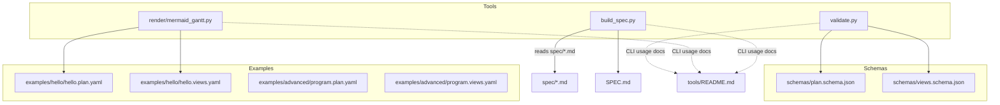
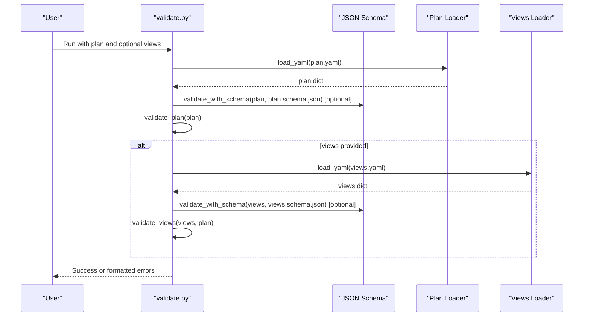
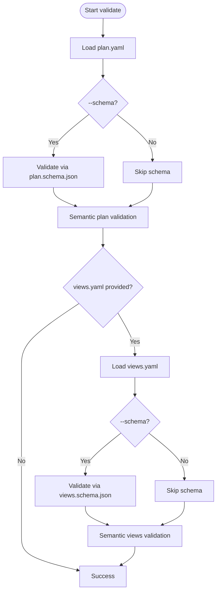
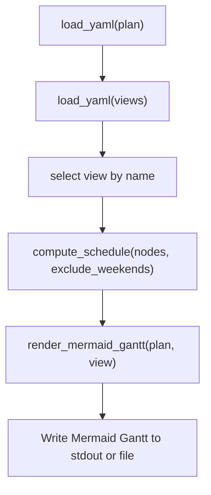
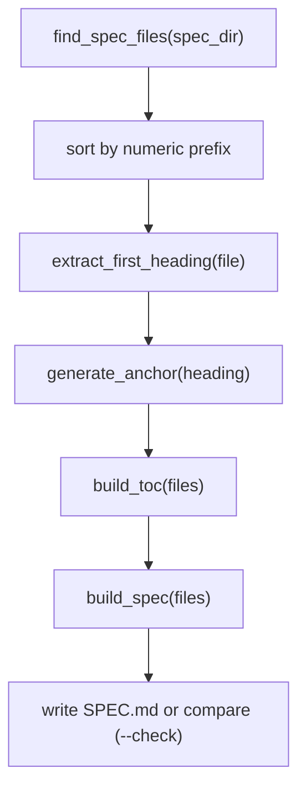
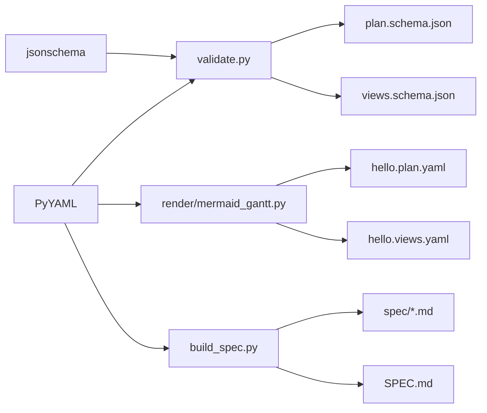

# Tooling and Utilities

<cite>
**Referenced Files in This Document**
- [validate.py](file://specs/v1/tools/validate.py)
- [mermaid_gantt.py](file://specs/v1/tools/render/mermaid_gantt.py)
- [build_spec.py](file://specs/v1/tools/build_spec.py)
- [README.md (Tools)](file://specs/v1/tools/README.md)
- [README.md (v1 Root)](file://specs/v1/README.md)
- [plan.schema.json](file://specs/v1/schemas/plan.schema.json)
- [views.schema.json](file://specs/v1/schemas/views.schema.json)
- [hello.plan.yaml](file://specs/v1/examples/hello/hello.plan.yaml)
- [hello.views.yaml](file://specs/v1/examples/hello/hello.views.yaml)
- [program.plan.yaml](file://specs/v1/examples/advanced/program.plan.yaml)
- [program.views.yaml](file://specs/v1/examples/advanced/program.views.yaml)
- [60-validation.md](file://specs/v1/spec/60-validation.md)
- [50-scheduling.md](file://specs/v1/spec/50-scheduling.md)
- [requirements.txt](file://specs/v1/tools/requirements.txt)
</cite>

## Table of Contents
1. [Introduction](#introduction)
2. [Project Structure](#project-structure)
3. [Core Components](#core-components)
4. [Architecture Overview](#architecture-overview)
5. [Detailed Component Analysis](#detailed-component-analysis)
6. [Dependency Analysis](#dependency-analysis)
7. [Performance Considerations](#performance-considerations)
8. [Troubleshooting Guide](#troubleshooting-guide)
9. [Conclusion](#conclusion)
10. [Appendices](#appendices)

## Introduction
This document describes the reference implementation tools for Opskarta v1: validation, Mermaid Gantt rendering, and specification building. It explains the validation system (syntax, schema, semantic, and dependency resolution), the Mermaid Gantt rendering engine and scheduling computation, and the specification builder for automated documentation generation. It also covers CLI usage, parameters, output formats, Python APIs for programmatic access, error handling/logging, performance considerations, and CI/CD integration patterns.

## Project Structure
The tools live under specs/v1/tools and are designed to be runnable from that directory. They rely on YAML files for plans (.plan.yaml) and views (.views.yaml), and optionally on JSON Schema definitions for formal validation.

**Diagram sources**
- [validate.py](file://specs/v1/tools/validate.py#L634-L752)
- [mermaid_gantt.py](file://specs/v1/tools/render/mermaid_gantt.py#L439-L549)
- [build_spec.py](file://specs/v1/tools/build_spec.py#L174-L240)
- [plan.schema.json](file://specs/v1/schemas/plan.schema.json#L1-L86)
- [views.schema.json](file://specs/v1/schemas/views.schema.json#L1-L26)
- [hello.plan.yaml](file://specs/v1/examples/hello/hello.plan.yaml#L1-L44)
- [hello.views.yaml](file://specs/v1/examples/hello/hello.views.yaml#L1-L13)
- [program.plan.yaml](file://specs/v1/examples/advanced/program.plan.yaml#L1-L326)
- [program.views.yaml](file://specs/v1/examples/advanced/program.views.yaml#L1-L93)
- [README.md (Tools)](file://specs/v1/tools/README.md#L1-L126)

**Section sources**
- [README.md (v1 Root)](file://specs/v1/README.md#L1-L27)
- [README.md (Tools)](file://specs/v1/tools/README.md#L1-L126)

## Core Components
- Validation tool: validates plan and views files against syntax, JSON Schema (optional), and semantic/business rules including cross-references and dependency cycles.
- Mermaid Gantt renderer: computes schedules from plan nodes and renders Gantt diagrams in Mermaid format for selected views.
- Specification builder: aggregates spec/*.md fragments into a single SPEC.md with automatic table of contents.

**Section sources**
- [validate.py](file://specs/v1/tools/validate.py#L135-L329)
- [mermaid_gantt.py](file://specs/v1/tools/render/mermaid_gantt.py#L217-L294)
- [build_spec.py](file://specs/v1/tools/build_spec.py#L147-L172)

## Architecture Overview
The tools are command-line scripts with clear separation of concerns:
- Input loading: YAML parsing with robust error reporting.
- Plan validation: semantic checks and dependency cycle detection.
- Views validation: cross-checks against plan metadata and node references.
- Rendering: schedule computation and Mermaid Gantt generation.
- Specification building: file discovery, ordering, TOC generation, and content assembly.

**Diagram sources**
- [validate.py](file://specs/v1/tools/validate.py#L690-L740)
- [plan.schema.json](file://specs/v1/schemas/plan.schema.json#L1-L86)
- [views.schema.json](file://specs/v1/schemas/views.schema.json#L1-L26)

## Detailed Component Analysis

### Validation Tool
The validator performs three levels:
- Syntax: YAML parsing with informative errors.
- Schema: optional JSON Schema validation via jsonschema.
- Semantics: structural and business rule checks including cross-references and dependency cycles.

Key capabilities:
- Loads YAML safely and enforces root object type.
- Validates plan version and nodes structure, title presence, and fields start/duration formats.
- Enforces referential integrity for parent, after, and status.
- Detects cycles in parent and after relationships.
- Validates views version, project alignment with plan meta.id, and lane node references.
- Optional JSON Schema validation for both plan and views.

**Diagram sources**
- [validate.py](file://specs/v1/tools/validate.py#L690-L740)

**Section sources**
- [validate.py](file://specs/v1/tools/validate.py#L69-L129)
- [validate.py](file://specs/v1/tools/validate.py#L135-L329)
- [validate.py](file://specs/v1/tools/validate.py#L431-L579)
- [validate.py](file://specs/v1/tools/validate.py#L586-L618)
- [validate.py](file://specs/v1/tools/validate.py#L634-L752)
- [60-validation.md](file://specs/v1/spec/60-validation.md#L1-L140)
- [plan.schema.json](file://specs/v1/schemas/plan.schema.json#L1-L86)
- [views.schema.json](file://specs/v1/schemas/views.schema.json#L1-L26)

### Mermaid Gantt Renderer
The renderer computes schedules and produces Mermaid Gantt output for a chosen view. It supports:
- Date parsing (YYYY-MM-DD) and duration parsing (int or '<n>d').
- Workday arithmetic and weekend exclusion.
- Recursive schedule resolution respecting parent and after dependencies.
- Theme customization from plan statuses and per-view options.

**Diagram sources**
- [mermaid_gantt.py](file://specs/v1/tools/render/mermaid_gantt.py#L439-L549)
- [mermaid_gantt.py](file://specs/v1/tools/render/mermaid_gantt.py#L217-L294)
- [mermaid_gantt.py](file://specs/v1/tools/render/mermaid_gantt.py#L349-L433)

Date calculation and scheduling computation:
- Date parsing and duration normalization.
- Weekend detection and workday addition.
- Finish date computation considering duration and weekend exclusion.
- Top-down recursive resolution with cycle detection and caching.

**Diagram sources**
- [mermaid_gantt.py](file://specs/v1/tools/render/mermaid_gantt.py#L217-L294)
- [mermaid_gantt.py](file://specs/v1/tools/render/mermaid_gantt.py#L92-L207)

**Section sources**
- [mermaid_gantt.py](file://specs/v1/tools/render/mermaid_gantt.py#L49-L86)
- [mermaid_gantt.py](file://specs/v1/tools/render/mermaid_gantt.py#L92-L207)
- [mermaid_gantt.py](file://specs/v1/tools/render/mermaid_gantt.py#L217-L294)
- [mermaid_gantt.py](file://specs/v1/tools/render/mermaid_gantt.py#L349-L433)
- [mermaid_gantt.py](file://specs/v1/tools/render/mermaid_gantt.py#L439-L549)
- [50-scheduling.md](file://specs/v1/spec/50-scheduling.md#L1-L80)

### Specification Builder
The builder collects spec/*.md files ordered by numeric prefix, extracts first-level headings for TOC anchors, and generates a unified SPEC.md. It supports a check mode to detect staleness without rewriting.

**Diagram sources**
- [build_spec.py](file://specs/v1/tools/build_spec.py#L46-L87)
- [build_spec.py](file://specs/v1/tools/build_spec.py#L89-L99)
- [build_spec.py](file://specs/v1/tools/build_spec.py#L101-L121)
- [build_spec.py](file://specs/v1/tools/build_spec.py#L123-L145)
- [build_spec.py](file://specs/v1/tools/build_spec.py#L147-L172)
- [build_spec.py](file://specs/v1/tools/build_spec.py#L174-L240)

**Section sources**
- [build_spec.py](file://specs/v1/tools/build_spec.py#L46-L87)
- [build_spec.py](file://specs/v1/tools/build_spec.py#L123-L145)
- [build_spec.py](file://specs/v1/tools/build_spec.py#L147-L172)
- [build_spec.py](file://specs/v1/tools/build_spec.py#L174-L240)

## Dependency Analysis
External dependencies:
- PyYAML: required for YAML parsing in all tools.
- jsonschema: optional, enables formal schema validation in the validator.

Internal relationships:
- validate.py loads plan and views YAML, optionally validates via JSON Schema, then runs semantic checks.
- mermaid_gantt.py loads plan and views YAML, computes schedules, and renders Mermaid output.
- build_spec.py reads spec/*.md files and writes SPEC.md.

**Diagram sources**
- [requirements.txt](file://specs/v1/tools/requirements.txt#L1-L10)
- [validate.py](file://specs/v1/tools/validate.py#L69-L129)
- [mermaid_gantt.py](file://specs/v1/tools/render/mermaid_gantt.py#L49-L86)
- [build_spec.py](file://specs/v1/tools/build_spec.py#L174-L240)
- [plan.schema.json](file://specs/v1/schemas/plan.schema.json#L1-L86)
- [views.schema.json](file://specs/v1/schemas/views.schema.json#L1-L26)
- [hello.plan.yaml](file://specs/v1/examples/hello/hello.plan.yaml#L1-L44)
- [hello.views.yaml](file://specs/v1/examples/hello/hello.views.yaml#L1-L13)

**Section sources**
- [requirements.txt](file://specs/v1/tools/requirements.txt#L1-L10)
- [validate.py](file://specs/v1/tools/validate.py#L599-L618)
- [README.md (Tools)](file://specs/v1/tools/README.md#L93-L126)

## Performance Considerations
- Validation:
  - O(V + E) for dependency checks where V is nodes and E is edges in after relations.
  - DFS-based cycle detection with visited/state arrays prevents redundant recomputation.
- Rendering:
  - Schedule computation caches results per node to avoid repeated resolution.
  - Weekend exclusion adds linear passes over workdays; keep lists of excluded dates minimal.
- Specification building:
  - Sorting by numeric prefix is O(n log n); file I/O dominates for typical spec sizes.

Optimization tips for large operational maps:
- Prefer explicit start dates for critical nodes to reduce dependency traversal.
- Limit deep nesting and long after chains to reduce recursion depth.
- Use views to partition large plans into focused lanes.
- Cache rendered outputs and regenerate only on changes.

[No sources needed since this section provides general guidance]

## Troubleshooting Guide
Common issues and remedies:
- Missing or invalid YAML: YAML parsing errors are surfaced with file context.
- Missing PyYAML: install via requirements.txt.
- Missing jsonschema: install to enable --schema mode.
- Reference errors: validate reports path, value, expected, and available candidates.
- Cycle detection: errors indicate the cyclic path for parent or after.
- Scheduling errors: errors indicate cycles, missing nodes, or unsupported duration formats.
- File errors: missing files or unreadable content cause descriptive messages.

Debugging tips:
- Use --schema to add JSON Schema checks alongside semantic validation.
- For rendering, verify that the selected view exists and all referenced node IDs exist in the plan.
- For spec building, ensure filenames follow NN-name.md pattern and numeric prefixes are unique.

**Section sources**
- [validate.py](file://specs/v1/tools/validate.py#L30-L63)
- [validate.py](file://specs/v1/tools/validate.py#L742-L748)
- [mermaid_gantt.py](file://specs/v1/tools/render/mermaid_gantt.py#L30-L43)
- [mermaid_gantt.py](file://specs/v1/tools/render/mermaid_gantt.py#L539-L544)
- [build_spec.py](file://specs/v1/tools/build_spec.py#L210-L236)

## Conclusion
The Opskarta v1 tooling provides a robust, extensible pipeline for validating plans and views, computing schedules, and generating specification documentation. The tools are designed for simplicity, clarity, and composability, enabling integration into local workflows and CI/CD systems.

[No sources needed since this section summarizes without analyzing specific files]

## Appendices

### CLI Usage and Parameters

- validate.py
  - Positional arguments:
    - plan_file: path to *.plan.yaml
    - views_file: path to *.views.yaml (optional)
  - Options:
    - --schema: additionally validate via JSON Schema
    - --plan-schema PATH: custom plan schema path
    - --views-schema PATH: custom views schema path
  - Outputs:
    - Success messages and warnings
    - Formatted error messages with path/value/expected/available when applicable

- render/mermaid_gantt.py
  - Required:
    - --plan PATH: path to *.plan.yaml
    - --views PATH: path to *.views.yaml
    - --view NAME: view name from gantt_views
  - Options:
    - --output PATH: write result to file (default: stdout)
    - --list-views: list available views and exit
  - Outputs:
    - Mermaid Gantt fenced block suitable for Markdown

- build_spec.py
  - Options:
    - --check: check SPEC.md freshness without writing
  - Outputs:
    - Generates SPEC.md or reports staleness

**Section sources**
- [validate.py](file://specs/v1/tools/validate.py#L634-L752)
- [mermaid_gantt.py](file://specs/v1/tools/render/mermaid_gantt.py#L439-L549)
- [build_spec.py](file://specs/v1/tools/build_spec.py#L174-L240)
- [README.md (Tools)](file://specs/v1/tools/README.md#L14-L126)

### Python API (Programmatic Access)
- Validation:
  - load_yaml(file_path: Path) -> Dict[str, Any]
  - load_json_schema(schema_path: Path) -> Dict[str, Any]
  - validate_with_schema(data: Dict[str, Any], schema: Dict[str, Any], file_type: str) -> List[str]
  - validate_plan(plan: Dict[str, Any]) -> List[str]
  - validate_views(views: Dict[str, Any], plan: Dict[str, Any]) -> List[str]
- Rendering:
  - load_yaml(path: str | Path) -> Dict[str, Any]
  - parse_date(value: str) -> date
  - parse_duration(value: Any) -> int
  - is_weekend(d: date) -> bool
  - next_workday(d: date) -> date
  - add_workdays(start: date, workdays: int) -> date
  - finish_date(start: date, duration_days: int, exclude_weekends: bool) -> date
  - compute_schedule(nodes: Dict[str, Dict[str, Any]], exclude_weekends: bool) -> Dict[str, ScheduledNode]
  - render_mermaid_gantt(plan: Dict[str, Any], view: Dict[str, Any]) -> str
- Specification building:
  - find_spec_files(spec_dir: Path) -> List[Tuple[int, Path]]
  - extract_first_heading(content: str) -> Optional[str]
  - generate_anchor(heading: str) -> str
  - build_toc(files: List[Tuple[int, Path]]) -> str
  - build_spec(files: List[Tuple[int, Path]]) -> str

**Section sources**
- [validate.py](file://specs/v1/tools/validate.py#L69-L129)
- [validate.py](file://specs/v1/tools/validate.py#L586-L618)
- [validate.py](file://specs/v1/tools/validate.py#L135-L329)
- [validate.py](file://specs/v1/tools/validate.py#L431-L579)
- [mermaid_gantt.py](file://specs/v1/tools/render/mermaid_gantt.py#L49-L86)
- [mermaid_gantt.py](file://specs/v1/tools/render/mermaid_gantt.py#L92-L207)
- [mermaid_gantt.py](file://specs/v1/tools/render/mermaid_gantt.py#L217-L294)
- [mermaid_gantt.py](file://specs/v1/tools/render/mermaid_gantt.py#L349-L433)
- [build_spec.py](file://specs/v1/tools/build_spec.py#L46-L87)
- [build_spec.py](file://specs/v1/tools/build_spec.py#L89-L99)
- [build_spec.py](file://specs/v1/tools/build_spec.py#L101-L121)
- [build_spec.py](file://specs/v1/tools/build_spec.py#L123-L145)
- [build_spec.py](file://specs/v1/tools/build_spec.py#L147-L172)

### Example Workflows and Integration Patterns
- Local validation:
  - python validate.py ../examples/hello/hello.plan.yaml ../examples/hello/hello.views.yaml
- Schema validation:
  - python validate.py --schema ../examples/hello/hello.plan.yaml
- Rendering:
  - python -m render.mermaid_gantt --plan ../examples/hello/hello.plan.yaml --views ../examples/hello/hello.views.yaml --view overview
  - python -m render.mermaid_gantt --plan ../examples/hello/hello.plan.yaml --views ../examples/hello/hello.views.yaml --view overview --output gantt.md
- Specification generation/check:
  - python build_spec.py
  - python build_spec.py --check

CI/CD integration ideas:
- Pre-commit hook: run validate.py on staged .plan.yaml and .views.yaml files.
- Build job: run validate.py and render/mermaid_gantt, publish gantt.md artifacts.
- Docs job: run build_spec.py --check to prevent drift in SPEC.md.

**Section sources**
- [README.md (Tools)](file://specs/v1/tools/README.md#L100-L126)
- [hello.plan.yaml](file://specs/v1/examples/hello/hello.plan.yaml#L1-L44)
- [hello.views.yaml](file://specs/v1/examples/hello/hello.views.yaml#L1-L13)
- [program.plan.yaml](file://specs/v1/examples/advanced/program.plan.yaml#L1-L326)
- [program.views.yaml](file://specs/v1/examples/advanced/program.views.yaml#L1-L93)