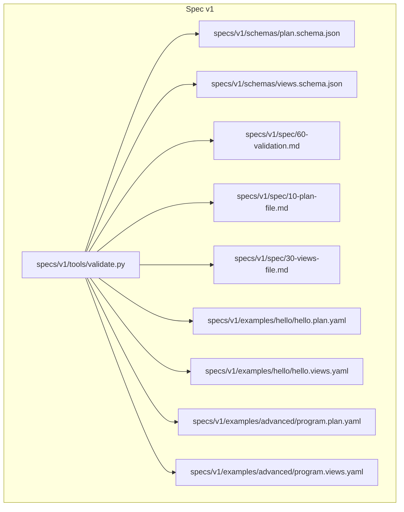
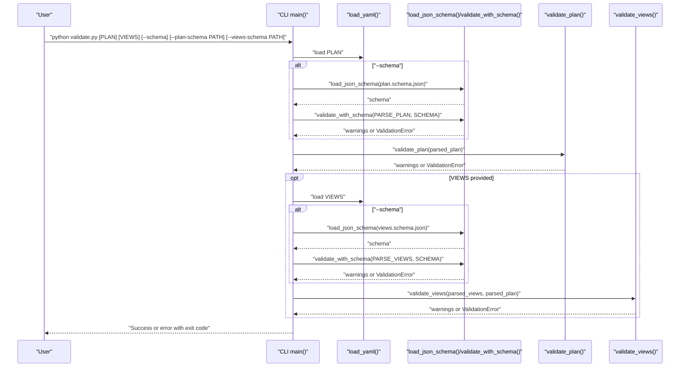
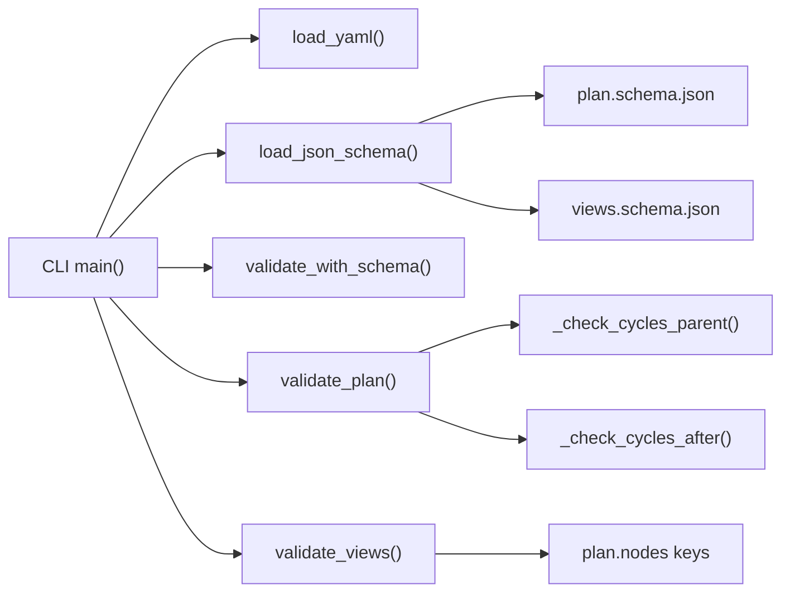

# Validation System

<cite>
**Referenced Files in This Document**
- [validate.py](file://specs/v1/tools/validate.py)
- [plan.schema.json](file://specs/v1/schemas/plan.schema.json)
- [views.schema.json](file://specs/v1/schemas/views.schema.json)
- [60-validation.md](file://specs/v1/spec/60-validation.md)
- [10-plan-file.md](file://specs/v1/spec/10-plan-file.md)
- [30-views-file.md](file://specs/v1/spec/30-views-file.md)
- [hello.plan.yaml](file://specs/v1/examples/hello/hello.plan.yaml)
- [hello.views.yaml](file://specs/v1/examples/hello/hello.views.yaml)
- [program.plan.yaml](file://specs/v1/examples/advanced/program.plan.yaml)
- [program.views.yaml](file://specs/v1/examples/advanced/program.views.yaml)
- [README.md](file://README.md)
</cite>

## Table of Contents
1. [Introduction](#introduction)
2. [Project Structure](#project-structure)
3. [Core Components](#core-components)
4. [Architecture Overview](#architecture-overview)
5. [Detailed Component Analysis](#detailed-component-analysis)
6. [Dependency Analysis](#dependency-analysis)
7. [Performance Considerations](#performance-considerations)
8. [Troubleshooting Guide](#troubleshooting-guide)
9. [Conclusion](#conclusion)
10. [Appendices](#appendices)

## Introduction
This document describes the validation system for Opskarta’s plan and views file validator. It explains the three-tier validation approach:
- Syntax validation (YAML parsing)
- Schema validation (JSON Schema compliance)
- Semantic validation (referential integrity and business rules)

It covers validation levels, error reporting, debugging capabilities, and integration patterns. It also documents the optional JSON Schema validation mode and custom schema support, along with CLI usage, parameters, exit codes, and common validation errors.

## Project Structure
The validation system lives under the v1 specification and includes:
- A Python CLI validator script
- JSON Schema definitions for plan and views
- Specification documents detailing validation rules
- Example plan and views files

**Diagram sources**
- [validate.py](file://specs/v1/tools/validate.py#L634-L752)
- [plan.schema.json](file://specs/v1/schemas/plan.schema.json#L1-L86)
- [views.schema.json](file://specs/v1/schemas/views.schema.json#L1-L26)
- [60-validation.md](file://specs/v1/spec/60-validation.md#L1-L140)
- [10-plan-file.md](file://specs/v1/spec/10-plan-file.md#L1-L30)
- [30-views-file.md](file://specs/v1/spec/30-views-file.md#L1-L34)
- [hello.plan.yaml](file://specs/v1/examples/hello/hello.plan.yaml#L1-L44)
- [hello.views.yaml](file://specs/v1/examples/hello/hello.views.yaml#L1-L13)
- [program.plan.yaml](file://specs/v1/examples/advanced/program.plan.yaml#L1-L326)
- [program.views.yaml](file://specs/v1/examples/advanced/program.views.yaml#L1-L93)

**Section sources**
- [README.md](file://README.md#L68-L83)

## Core Components
- CLI entrypoint and argument parsing
- YAML loader with error reporting
- JSON Schema loader and validator
- Plan semantic validator (referential integrity, scheduling formats, cycles)
- Views semantic validator (project linkage, node references)
- Error reporting via a structured exception

Key responsibilities:
- Load and parse YAML safely
- Optionally validate against built-in or custom JSON Schemas
- Enforce semantic rules and detect cycles
- Produce human-readable error messages with paths and expected values

**Section sources**
- [validate.py](file://specs/v1/tools/validate.py#L634-L752)
- [validate.py](file://specs/v1/tools/validate.py#L69-L129)
- [validate.py](file://specs/v1/tools/validate.py#L135-L329)
- [validate.py](file://specs/v1/tools/validate.py#L431-L579)
- [validate.py](file://specs/v1/tools/validate.py#L586-L618)

## Architecture Overview
The validator runs in stages:
1. Parse YAML files
2. Optional JSON Schema validation
3. Semantic validation (plan and views)
4. Report warnings and errors, exit with appropriate code

**Diagram sources**
- [validate.py](file://specs/v1/tools/validate.py#L634-L752)
- [validate.py](file://specs/v1/tools/validate.py#L69-L129)
- [validate.py](file://specs/v1/tools/validate.py#L586-L618)
- [validate.py](file://specs/v1/tools/validate.py#L135-L329)
- [validate.py](file://specs/v1/tools/validate.py#L431-L579)

## Detailed Component Analysis

### CLI and Argument Parsing
- Supports validating a plan alone or both plan and views
- Optional JSON Schema validation mode
- Custom schema paths for plan and views
- Clear help and usage examples

Exit codes:
- 0 on success
- 1 on validation errors
- 130 on keyboard interrupt

**Section sources**
- [validate.py](file://specs/v1/tools/validate.py#L634-L752)

### YAML Loading and Error Reporting
- Loads YAML safely and enforces root object type
- Reports missing files and YAML parse errors
- Provides structured error messages with path, value, and expected type

**Section sources**
- [validate.py](file://specs/v1/tools/validate.py#L69-L129)

### JSON Schema Validation Mode
- Optional mode invoked with a flag
- Loads custom schema files if provided
- Uses a third-party validator to enforce strict JSON Schema compliance
- Produces detailed error messages with JSON Pointer-style paths

**Section sources**
- [validate.py](file://specs/v1/tools/validate.py#L586-L618)
- [plan.schema.json](file://specs/v1/schemas/plan.schema.json#L1-L86)
- [views.schema.json](file://specs/v1/schemas/views.schema.json#L1-L26)

### Plan Semantic Validation
Checks:
- Root fields: version and nodes presence and types
- Nodes: title presence and non-empty string
- Referential integrity:
  - parent must reference an existing node ID
  - after must be a list of existing node IDs
  - status must reference an existing status key if present
- Format validation:
  - start must match YYYY-MM-DD
  - duration must match <number><unit> where unit is d or w
- Cycle detection:
  - parent chain acyclic
  - after graph acyclic (DFS with state tracking)

Warnings:
- Non-default version triggers a warning

**Section sources**
- [validate.py](file://specs/v1/tools/validate.py#L135-L329)
- [60-validation.md](file://specs/v1/spec/60-validation.md#L5-L81)
- [10-plan-file.md](file://specs/v1/spec/10-plan-file.md#L1-L30)

### Views Semantic Validation
Checks:
- Root fields: version and project presence and types
- project must equal meta.id from the plan
- gantt_views structure:
  - lanes must be a non-empty object
  - each lane must have a nodes list
  - each node ID in lanes must exist in the plan

**Section sources**
- [validate.py](file://specs/v1/tools/validate.py#L431-L579)
- [60-validation.md](file://specs/v1/spec/60-validation.md#L82-L115)
- [30-views-file.md](file://specs/v1/spec/30-views-file.md#L1-L34)

### Error Reporting and Debugging
- Structured exceptions carry:
  - Message
  - Path to the problematic field
  - Actual value
  - Expected type/format
  - Available alternatives (when applicable)
- CLI prints formatted messages and exits with appropriate code

**Section sources**
- [validate.py](file://specs/v1/tools/validate.py#L30-L63)
- [validate.py](file://specs/v1/tools/validate.py#L742-L748)

## Dependency Analysis

**Diagram sources**
- [validate.py](file://specs/v1/tools/validate.py#L634-L752)
- [validate.py](file://specs/v1/tools/validate.py#L135-L329)
- [validate.py](file://specs/v1/tools/validate.py#L431-L579)
- [validate.py](file://specs/v1/tools/validate.py#L586-L618)
- [plan.schema.json](file://specs/v1/schemas/plan.schema.json#L1-L86)
- [views.schema.json](file://specs/v1/schemas/views.schema.json#L1-L26)

**Section sources**
- [validate.py](file://specs/v1/tools/validate.py#L634-L752)

## Performance Considerations
- Large operational maps:
  - YAML parsing is linear in file size
  - JSON Schema validation adds overhead proportional to schema complexity and data size
  - Semantic validation is O(N + E) for N nodes and E edges (dependencies)
  - Cycle detection uses DFS with O(N + E) time and O(N) space
- Recommendations:
  - Prefer streaming parsers for extremely large files if needed
  - Use JSON Schema only when required by CI policy
  - Cache loaded schemas when validating many files
  - Split large plans into smaller, cohesive units

[No sources needed since this section provides general guidance]

## Troubleshooting Guide
Common validation errors and remedies:
- Missing or invalid YAML
  - Ensure the file exists and is valid YAML
  - Verify the root element is an object
- JSON Schema validation failures
  - Install the required library for schema mode
  - Use built-in schemas or provide compatible custom schemas
- Semantic errors
  - Referential integrity: ensure parent, after, and status IDs exist
  - Format errors: confirm start and duration formats
  - Cycle detection: remove circular parent/after links
- Views linkage mismatch
  - project must equal meta.id from the plan

Debugging tips:
- Run with verbose output to see stage-by-stage progress
- Use the schema mode to catch type mismatches early
- Validate plan and views separately to isolate issues
- Inspect the printed path and expected value to fix quickly

**Section sources**
- [validate.py](file://specs/v1/tools/validate.py#L742-L748)
- [60-validation.md](file://specs/v1/spec/60-validation.md#L124-L140)

## Conclusion
Opskarta’s validation system provides a robust, layered approach to ensure plan and views correctness. By combining syntax checks, JSON Schema enforcement, and semantic validations with strong error reporting, teams can catch mistakes early and maintain reliable operational maps.

[No sources needed since this section summarizes without analyzing specific files]

## Appendices

### CLI Usage and Parameters
- Basic usage
  - Validate a plan: python tools/validate.py examples/hello/hello.plan.yaml
  - Validate plan and views: python tools/validate.py examples/hello/hello.plan.yaml examples/hello/hello.views.yaml
  - Enable JSON Schema mode: python tools/validate.py --schema examples/hello/hello.plan.yaml
- Parameters
  - plan_file: Path to the plan file
  - views_file: Path to the views file (optional)
  - --schema: Enable JSON Schema validation
  - --plan-schema PATH: Custom plan schema path (default: schemas/plan.schema.json)
  - --views-schema PATH: Custom views schema path (default: schemas/views.schema.json)
- Exit codes
  - 0: Success
  - 1: Validation error
  - 130: Interrupted by user

**Section sources**
- [validate.py](file://specs/v1/tools/validate.py#L634-L752)
- [README.md](file://README.md#L68-L83)

### Validation Rules Summary
- Plan
  - Required fields: version (int), nodes (object)
  - Node required: title (string)
  - Referential integrity: parent, after, status must reference existing IDs
  - Format: start (YYYY-MM-DD), duration (<number>d|w)
  - No cycles in parent or after
- Views
  - Required fields: version (int), project (string)
  - project must equal meta.id from plan
  - gantt_views.lanes must reference existing node IDs

**Section sources**
- [60-validation.md](file://specs/v1/spec/60-validation.md#L5-L115)
- [10-plan-file.md](file://specs/v1/spec/10-plan-file.md#L1-L30)
- [30-views-file.md](file://specs/v1/spec/30-views-file.md#L1-L34)

### Example Files
- Minimal plan and views
  - [project.plan.yaml](file://specs/v1/examples/minimal/project.plan.yaml#L1-L6)
- Hello example
  - [hello.plan.yaml](file://specs/v1/examples/hello/hello.plan.yaml#L1-L44)
  - [hello.views.yaml](file://specs/v1/examples/hello/hello.views.yaml#L1-L13)
- Advanced example
  - [program.plan.yaml](file://specs/v1/examples/advanced/program.plan.yaml#L1-L326)
  - [program.views.yaml](file://specs/v1/examples/advanced/program.views.yaml#L1-L93)

**Section sources**
- [hello.plan.yaml](file://specs/v1/examples/hello/hello.plan.yaml#L1-L44)
- [hello.views.yaml](file://specs/v1/examples/hello/hello.views.yaml#L1-L13)
- [program.plan.yaml](file://specs/v1/examples/advanced/program.plan.yaml#L1-L326)
- [program.views.yaml](file://specs/v1/examples/advanced/program.views.yaml#L1-L93)