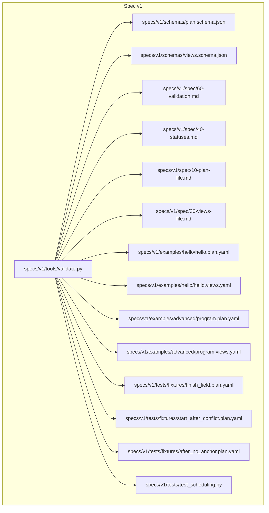
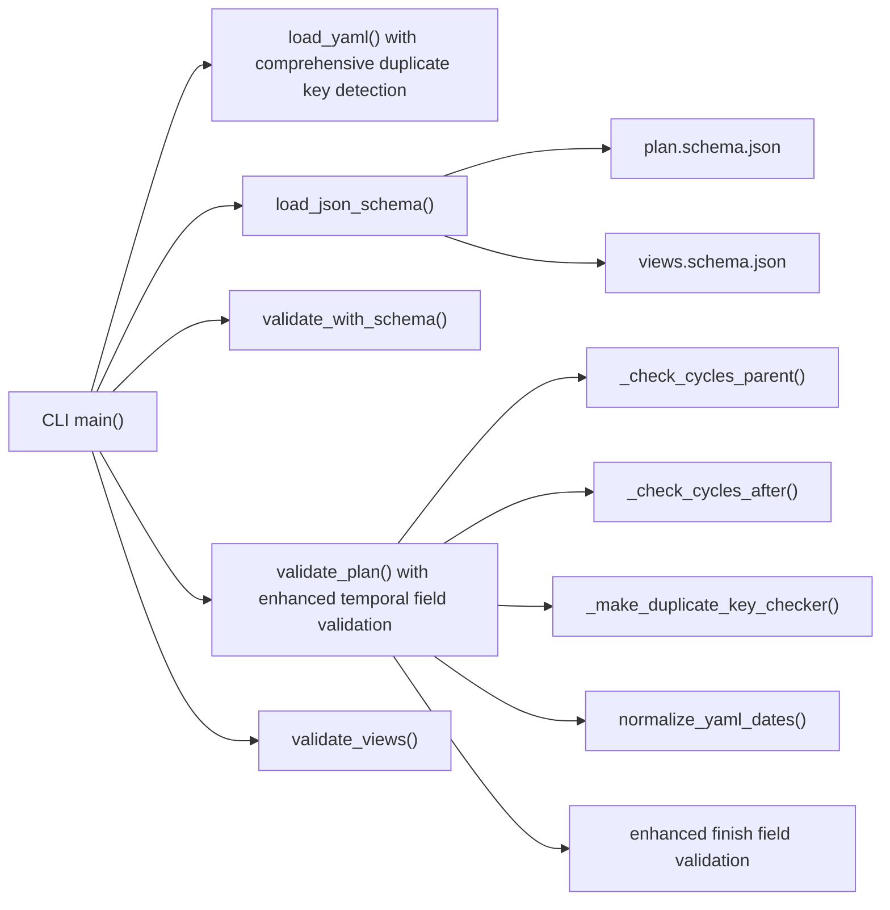

# Validation System

<cite>
**Referenced Files in This Document**
- [validate.py](file://specs/v1/tools/validate.py)
- [plan.schema.json](file://specs/v1/schemas/plan.schema.json)
- [views.schema.json](file://specs/v1/schemas/views.schema.json)
- [60-validation.md](file://specs/v1/spec/60-validation.md)
- [40-statuses.md](file://specs/v1/spec/40-statuses.md)
- [10-plan-file.md](file://specs/v1/spec/10-plan-file.md)
- [30-views-file.md](file://specs/v1/spec/30-views-file.md)
- [hello.plan.yaml](file://specs/v1/examples/hello/hello.plan.yaml)
- [hello.views.yaml](file://specs/v1/examples/hello/hello.views.yaml)
- [program.plan.yaml](file://specs/v1/examples/advanced/program.plan.yaml)
- [program.views.yaml](file://specs/v1/examples/advanced/program.views.yaml)
- [README.md](file://README.md)
- [finish_field.plan.yaml](file://specs/v1/tests/fixtures/finish_field.plan.yaml)
- [start_after_conflict.plan.yaml](file://specs/v1/tests/fixtures/start_after_conflict.plan.yaml)
- [after_no_anchor.plan.yaml](file://specs/v1/tests/fixtures/after_no_anchor.plan.yaml)
- [test_scheduling.py](file://specs/v1/tests/test_scheduling.py)
</cite>

## Update Summary
**Changes Made**
- Added comprehensive finish field validation with strict YYYY-MM-DD regex format
- Enhanced consistency checks between start, finish, and duration fields
- Expanded duplicate key detection coverage to include finish field requirements
- Strengthened format validation with improved error reporting for edge cases
- Updated validation rules to enforce mutual exclusivity and consistency among temporal fields
- Enhanced backward scheduling support with finish field calculations

## Table of Contents
1. [Introduction](#introduction)
2. [Project Structure](#project-structure)
3. [Core Components](#core-components)
4. [Architecture Overview](#architecture-overview)
5. [Detailed Component Analysis](#detailed-component-analysis)
6. [Dependency Analysis](#dependency-analysis)
7. [Performance Considerations](#performance-considerations)
8. [Troubleshooting Guide](#troubleshooting-guide)
9. [Conclusion](#conclusion)
10. [Appendices](#appendices)

## Introduction
This document describes the validation system for Opskarta's plan and views file validator. It explains the three-tier validation approach:
- Syntax validation (YAML parsing with comprehensive duplicate key detection)
- Schema validation (JSON Schema compliance)
- Semantic validation (referential integrity, business rules, and enhanced format validation)

The system now includes sophisticated error reporting with severity levels, comprehensive duplicate key detection, and enhanced validation rules for unique identifiers, color formats, and temporal field consistency. It covers validation levels, error reporting mechanisms, debugging capabilities, and integration patterns.

## Project Structure
The validation system lives under the v1 specification and includes:
- A Python CLI validator script with enhanced error reporting
- JSON Schema definitions for plan and views
- Specification documents detailing validation rules and severity levels
- Example plan and views files demonstrating validation scenarios
- Test fixtures covering new finish field requirements and consistency checks

**Diagram sources**
- [validate.py](file://specs/v1/tools/validate.py#L634-L752)
- [plan.schema.json](file://specs/v1/schemas/plan.schema.json#L1-L95)
- [views.schema.json](file://specs/v1/schemas/views.schema.json#L1-L78)
- [60-validation.md](file://specs/v1/spec/60-validation.md#L1-L377)
- [40-statuses.md](file://specs/v1/spec/40-statuses.md#L49-L93)
- [hello.plan.yaml](file://specs/v1/examples/hello/hello.plan.yaml#L1-L44)
- [hello.views.yaml](file://specs/v1/examples/hello/hello.views.yaml#L1-L13)
- [program.plan.yaml](file://specs/v1/examples/advanced/program.plan.yaml#L1-L331)
- [program.views.yaml](file://specs/v1/examples/advanced/program.views.yaml#L1-L93)
- [finish_field.plan.yaml](file://specs/v1/tests/fixtures/finish_field.plan.yaml#L1-L30)
- [start_after_conflict.plan.yaml](file://specs/v1/tests/fixtures/start_after_conflict.plan.yaml#L1-L20)
- [after_no_anchor.plan.yaml](file://specs/v1/tests/fixtures/after_no_anchor.plan.yaml#L1-L27)
- [test_scheduling.py](file://specs/v1/tests/test_scheduling.py#L1-L403)

**Section sources**
- [README.md](file://README.md#L68-L83)

## Core Components
- CLI entrypoint and argument parsing with enhanced error reporting
- YAML loader with comprehensive duplicate key detection and date normalization
- JSON Schema loader and validator
- Plan semantic validator with unique identifier validation, color format checking, and enhanced temporal field validation
- Views semantic validator with project linkage validation
- Sophisticated error reporting system with severity levels (error, warn, info)
- Structured exception handling with detailed error messages

Key responsibilities:
- Load and parse YAML safely with comprehensive duplicate key detection
- Normalize YAML dates to standardized string format
- Optionally validate against built-in or custom JSON Schemas
- Enforce semantic rules including unique identifiers, color formats, and temporal field consistency
- Detect cycles and format violations
- Provide hierarchical error reporting with severity classification

**Section sources**
- [validate.py](file://specs/v1/tools/validate.py#L634-L752)
- [validate.py](file://specs/v1/tools/validate.py#L69-L192)
- [validate.py](file://specs/v1/tools/validate.py#L194-L329)
- [validate.py](file://specs/v1/tools/validate.py#L431-L579)
- [validate.py](file://specs/v1/tools/validate.py#L586-L618)

## Architecture Overview
The validator runs in enhanced stages with sophisticated error handling:
1. Parse YAML files with comprehensive duplicate key detection and date normalization
2. Optional JSON Schema validation
3. Semantic validation with unique identifier and enhanced temporal field validation
4. Report warnings and errors with severity classification, exit with appropriate code

**Diagram sources**
- [validate.py](file://specs/v1/tools/validate.py#L634-L752)
- [validate.py](file://specs/v1/tools/validate.py#L69-L192)
- [validate.py](file://specs/v1/tools/validate.py#L114-L134)
- [validate.py](file://specs/v1/tools/validate.py#L586-L618)
- [validate.py](file://specs/v1/tools/validate.py#L135-L329)
- [validate.py](file://specs/v1/tools/validate.py#L431-L579)

## Detailed Component Analysis

### Enhanced CLI and Argument Parsing
- Supports validating a plan alone or both plan and views
- Optional JSON Schema validation mode
- Custom schema paths for plan and views
- Clear help and usage examples with enhanced error reporting
- Sophisticated exit codes with user interruption handling

Exit codes:
- 0 on success
- 1 on validation errors
- 130 on keyboard interrupt

**Section sources**
- [validate.py](file://specs/v1/tools/validate.py#L634-L752)

### Enhanced YAML Loading and Error Reporting
- Loads YAML safely with comprehensive duplicate key detection
- Normalizes YAML dates to standardized string format (YYYY-MM-DD)
- Reports missing files, YAML parse errors, and duplicate key errors
- Provides structured error messages with path, value, and expected type
- Uses custom DuplicateKeyLoader for robust duplicate detection

**Section sources**
- [validate.py](file://specs/v1/tools/validate.py#L69-L192)

### Recursive Date Normalization
- Converts YAML datetime objects to standardized date strings
- Recursively processes nested dictionaries and lists
- Ensures consistent date format across all validation stages
- Maintains data integrity while standardizing formats

**Section sources**
- [validate.py](file://specs/v1/tools/validate.py#L114-L134)

### Comprehensive Duplicate Key Detection
- Custom YAML loader that detects duplicate keys during parsing
- Raises DuplicateKeyError for any duplicate key found
- Provides precise error reporting with the problematic key
- Prevents silent data loss from YAML duplicate key overrides

**Section sources**
- [validate.py](file://specs/v1/tools/validate.py#L75-L111)

### Sophisticated Error Reporting with Severity Levels
- Structured exceptions with severity classification
- Three-level severity system: error, warn, info
- Enhanced message formatting with path, value, and expected information
- Available alternatives for reference validation
- Hierarchical error reporting for complex validation failures

Severity levels:
- **error**: Critical validation failure, stops validation process
- **warn**: Potential issue requiring attention, validation continues
- **info**: Informational message, validation successful

**Section sources**
- [validate.py](file://specs/v1/tools/validate.py#L36-L68)
- [60-validation.md](file://specs/v1/spec/60-validation.md#L215-L244)

### JSON Schema Validation Mode
- Optional mode invoked with a flag
- Loads custom schema files if provided
- Uses a third-party validator to enforce strict JSON Schema compliance
- Produces detailed error messages with JSON Pointer-style paths
- Integrates seamlessly with enhanced error reporting system

**Section sources**
- [validate.py](file://specs/v1/tools/validate.py#L586-L618)
- [plan.schema.json](file://specs/v1/schemas/plan.schema.json#L1-L95)
- [views.schema.json](file://specs/v1/schemas/views.schema.json#L1-L78)

### Enhanced Plan Semantic Validation
Enhanced temporal field validation includes:

**Finish Field Requirements**:
- Finish field validation with strict YYYY-MM-DD regex format (`^\d{4}-\d{2}-\d{2}$`)
- Consistency checks between start, finish, and duration fields
- Backward scheduling support: finish + duration calculates start date
- Mutual exclusivity validation: ensure proper field combinations

**Enhanced Format Validation**:
- Start field: strict YYYY-MM-DD regex validation with date existence checking
- Finish field: identical validation to start field for consistency
- Duration field: enhanced pattern validation `^[1-9][0-9]*[dw]$` with improved error messages
- Cross-field consistency: validate that start + duration equals computed finish

**Temporal Field Consistency Checks**:
- All three fields (start, finish, duration) validation when present
- Computed finish verification against provided finish date
- Error reporting with expected vs actual values for debugging
- Graceful handling of edge cases and invalid combinations

**Cycle Detection and Referential Integrity**:
- Parent chain acyclic validation
- After graph acyclic validation using DFS with state tracking
- Enhanced duplicate key detection for node identifiers
- Improved error reporting for complex validation failures

**Section sources**
- [validate.py](file://specs/v1/tools/validate.py#L262-L558)
- [60-validation.md](file://specs/v1/spec/60-validation.md#L99-L152)
- [finish_field.plan.yaml](file://specs/v1/tests/fixtures/finish_field.plan.yaml#L1-L30)
- [test_scheduling.py](file://specs/v1/tests/test_scheduling.py#L325-L349)

### Enhanced Views Semantic Validation
Checks:
- Root fields: version and project presence and types
- project must equal meta.id from the plan
- gantt_views structure:
  - lanes must be a non-empty object
  - each lane must have a nodes list
  - each node ID in lanes must exist in the plan
- Excludes validation: specific dates vs calendar exclusions

Warnings:
- Specific dates in excludes (non-core renderer hints)

**Section sources**
- [validate.py](file://specs/v1/tools/validate.py#L431-L579)
- [60-validation.md](file://specs/v1/spec/60-validation.md#L154-L203)
- [30-views-file.md](file://specs/v1/spec/30-views-file.md#L1-L34)

### Enhanced Error Reporting and Debugging
- Structured exceptions with severity classification
- Enhanced message formatting with path, value, and expected type
- Available alternatives for reference validation
- Hierarchical error reporting for complex validation failures
- Clear separation of error, warning, and informational messages
- User-friendly error messages with actionable guidance

**Section sources**
- [validate.py](file://specs/v1/tools/validate.py#L36-L68)
- [validate.py](file://specs/v1/tools/validate.py#L742-L748)

## Dependency Analysis

**Diagram sources**
- [validate.py](file://specs/v1/tools/validate.py#L634-L752)
- [validate.py](file://specs/v1/tools/validate.py#L75-L111)
- [validate.py](file://specs/v1/tools/validate.py#L114-L134)
- [validate.py](file://specs/v1/tools/validate.py#L135-L329)
- [validate.py](file://specs/v1/tools/validate.py#L431-L579)
- [validate.py](file://specs/v1/tools/validate.py#L586-L618)
- [plan.schema.json](file://specs/v1/schemas/plan.schema.json#L1-L95)
- [views.schema.json](file://specs/v1/schemas/views.schema.json#L1-L78)

**Section sources**
- [validate.py](file://specs/v1/tools/validate.py#L634-L752)

## Performance Considerations
- Large operational maps:
  - YAML parsing with comprehensive duplicate key detection adds minimal overhead
  - Date normalization is O(n) where n is total number of data elements
  - JSON Schema validation adds overhead proportional to schema complexity and data size
  - Semantic validation is O(N + E) for N nodes and E edges (dependencies)
  - Enhanced temporal field validation adds O(N) complexity for date computations
  - Cycle detection uses DFS with O(N + E) time and O(N) space
- Recommendations:
  - Prefer streaming parsers for extremely large files if needed
  - Use JSON Schema only when required by CI policy
  - Cache loaded schemas when validating many files
  - Split large plans into smaller, cohesive units
  - Comprehensive duplicate key detection adds O(k) overhead where k is number of keys processed
  - Enhanced finish field validation performs additional date calculations but maintains linear complexity

## Troubleshooting Guide
Common validation errors and remedies:

**Enhanced Temporal Field Errors**:
- Finish field format validation failures
  - Ensure finish field matches YYYY-MM-DD regex pattern
  - Verify date existence in calendar (not February 30th, etc.)
  - Check consistency with start and duration fields
- Inconsistent temporal field combinations
  - When all three fields (start, finish, duration) are present, they must be mutually consistent
  - Use either forward scheduling (start + duration) or backward scheduling (finish + duration)
  - Avoid mixing explicit start with implied finish constraints

**Duplicate Key Detection Errors**:
- Missing or invalid YAML with duplicate keys
  - Ensure the file exists and is valid YAML
  - Verify the root element is an object
  - Check for duplicate keys in YAML structure, including finish field declarations
- Comprehensive duplicate detection prevents silent data loss

**Enhanced Format Validation Failures**:
- Install the required library for schema mode
- Use built-in schemas or provide compatible custom schemas
- Validate color formats using hex notation (#RRGGBB)
- Ensure proper field combinations for temporal scheduling

**Semantic Errors with Severity Classification**:
- Referential integrity: ensure parent, after, and status IDs exist
- Format errors: confirm start, finish, and duration formats
- Cycle detection: remove circular parent/after links
- Unique identifier violations: ensure all node_id values are unique
- Views linkage mismatch: project must equal meta.id from the plan

**Views Linkage Mismatch**:
- project must equal meta.id from the plan

Debugging tips:
- Run with verbose output to see stage-by-stage progress
- Use the schema mode to catch type mismatches early
- Validate plan and views separately to isolate issues
- Inspect the printed path and expected value to fix quickly
- Pay attention to severity level classification for prioritizing fixes
- Test temporal field combinations incrementally when debugging scheduling issues

**Section sources**
- [validate.py](file://specs/v1/tools/validate.py#L742-L748)
- [60-validation.md](file://specs/v1/spec/60-validation.md#L215-L244)
- [finish_field.plan.yaml](file://specs/v1/tests/fixtures/finish_field.plan.yaml#L1-L30)
- [start_after_conflict.plan.yaml](file://specs/v1/tests/fixtures/start_after_conflict.plan.yaml#L1-L20)
- [after_no_anchor.plan.yaml](file://specs/v1/tests/fixtures/after_no_anchor.plan.yaml#L1-L27)

## Conclusion
Opskarta's enhanced validation system provides a robust, layered approach to ensure plan and views correctness with sophisticated error reporting and comprehensive duplicate key detection. The expanded validation rules now include strict finish field requirements, enhanced temporal field consistency checks, and improved error reporting for edge cases. By combining syntax checks with duplicate key prevention, JSON Schema enforcement, and semantic validations with severity classification, teams can catch mistakes early, maintain reliable operational maps, and ensure data integrity through comprehensive validation rules.

## Appendices

### CLI Usage and Parameters
- Basic usage
  - Validate a plan: python tools/validate.py examples/hello/hello.plan.yaml
  - Validate plan and views: python tools/validate.py examples/hello/hello.plan.yaml examples/hello/hello.views.yaml
  - Enable JSON Schema mode: python tools/validate.py --schema examples/hello/hello.plan.yaml
- Parameters
  - plan_file: Path to the plan file
  - views_file: Path to the views file (optional)
  - --schema: Enable JSON Schema validation
  - --plan-schema PATH: Custom plan schema path (default: schemas/plan.schema.json)
  - --views-schema PATH: Custom views schema path (default: schemas/views.schema.json)
- Exit codes
  - 0: Success
  - 1: Validation error
  - 130: Interrupted by user

**Section sources**
- [validate.py](file://specs/v1/tools/validate.py#L634-L752)
- [README.md](file://README.md#L68-L83)

### Enhanced Validation Rules Summary

**Plan Validation Enhancements**:
- Required fields: version (int), nodes (object)
- Node required: title (string)
- Unique identifier validation: all node_id keys must be unique
- Color format validation: hex color format (#RRGGBB) for status colors
- Enhanced temporal validation:
  - start: strict YYYY-MM-DD regex format with date existence validation
  - finish: identical validation to start for consistency
  - duration: enhanced pattern validation with improved error messages
  - Cross-field consistency: validate relationships between start, finish, and duration
  - Backward scheduling: finish + duration calculates start date
- Referential integrity: parent, after, status must reference existing IDs
- No cycles in parent or after
- Enhanced duplicate key detection for all field types

**Views Validation**:
- Required fields: version (int), project (string)
- project must equal meta.id from plan
- gantt_views.lanes must reference existing node IDs
- Excludes validation: specific dates vs calendar exclusions

**Section sources**
- [60-validation.md](file://specs/v1/spec/60-validation.md#L5-L203)
- [40-statuses.md](file://specs/v1/spec/40-statuses.md#L49-L93)
- [10-plan-file.md](file://specs/v1/spec/10-plan-file.md#L1-L30)
- [30-views-file.md](file://specs/v1/spec/30-views-file.md#L1-L34)
- [finish_field.plan.yaml](file://specs/v1/tests/fixtures/finish_field.plan.yaml#L1-L30)
- [test_scheduling.py](file://specs/v1/tests/test_scheduling.py#L325-L349)

### Example Files
- Minimal plan and views
  - [project.plan.yaml](file://specs/v1/examples/minimal/project.plan.yaml#L1-L6)
- Hello example with enhanced temporal validation
  - [hello.plan.yaml](file://specs/v1/examples/hello/hello.plan.yaml#L1-L44)
  - [hello.views.yaml](file://specs/v1/examples/hello/hello.views.yaml#L1-L13)
- Advanced example with complex scheduling
  - [program.plan.yaml](file://specs/v1/examples/advanced/program.plan.yaml#L1-L331)
  - [program.views.yaml](file://specs/v1/examples/advanced/program.views.yaml#L1-L93)

**Section sources**
- [hello.plan.yaml](file://specs/v1/examples/hello/hello.plan.yaml#L1-L44)
- [hello.views.yaml](file://specs/v1/examples/hello/hello.views.yaml#L1-L13)
- [program.plan.yaml](file://specs/v1/examples/advanced/program.plan.yaml#L1-L331)
- [program.views.yaml](file://specs/v1/examples/advanced/program.views.yaml#L1-L93)

### Test Fixtures Demonstrating New Validation Rules
- Finish field validation and backward scheduling
  - [finish_field.plan.yaml](file://specs/v1/tests/fixtures/finish_field.plan.yaml#L1-L30)
- Start and after conflict resolution
  - [start_after_conflict.plan.yaml](file://specs/v1/tests/fixtures/start_after_conflict.plan.yaml#L1-L20)
- After chain without anchor validation
  - [after_no_anchor.plan.yaml](file://specs/v1/tests/fixtures/after_no_anchor.plan.yaml#L1-L27)

**Section sources**
- [finish_field.plan.yaml](file://specs/v1/tests/fixtures/finish_field.plan.yaml#L1-L30)
- [start_after_conflict.plan.yaml](file://specs/v1/tests/fixtures/start_after_conflict.plan.yaml#L1-L20)
- [after_no_anchor.plan.yaml](file://specs/v1/tests/fixtures/after_no_anchor.plan.yaml#L1-L27)
- [test_scheduling.py](file://specs/v1/tests/test_scheduling.py#L325-L349)