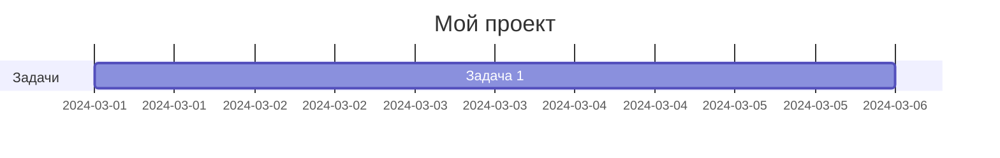
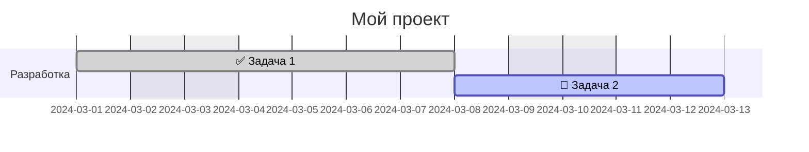
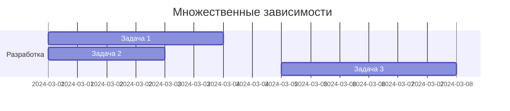
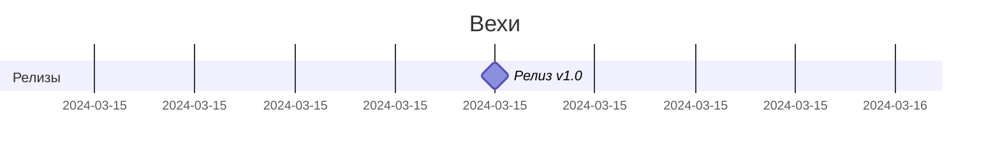

<!-- Этот файл сгенерирован автоматически. Не редактируйте вручную! -->
<!-- Для изменений редактируйте файлы в spec/ и запустите: python tools/build_spec.py -->

## Оглавление

- [Спецификация opskarta v1 (черновик)](#спецификация-opskarta-v1-черновик)
- [Файл плана (`*.plan.yaml`)](#файл-плана-planyaml)
- [Узлы (`nodes`)](#узлы-nodes)
- [Файл представлений (`*.views.yaml`)](#файл-представлений-viewsyaml)
- [Статусы (`statuses`)](#статусы-statuses)
- [Планирование (`start`, `duration`, `after`, `excludes`)](#планирование-start-duration-after-excludes)
- [Рекомендации по кодированию YAML](#рекомендации-по-кодированию-yaml)
- [Правила валидации](#правила-валидации)
- [Расширяемость](#расширяемость)
- [Renderer profile: Mermaid Gantt](#renderer-profile-mermaid-gantt)

# Спецификация opskarta v1 (черновик)

Эта спецификация описывает *минимальный* совместимый набор полей формата opskarta.

- Формат сериализации: **YAML** (рекомендовано) или JSON.
- Версионирование: поле `version` в корне документа.
- Идентификаторы узлов: строковые ключи в мапе `nodes:`.

> Статус: **Draft**. Спека намеренно стартует маленькой и расширяемой.

## Core vs Non-core

Спецификация различает **core** (нормативные) и **non-core** (информативные/расширения) части:

| Категория | Описание | Обязательность для инструментов |
|-----------|----------|--------------------------------|
| **Core** | Базовая семантика формата, алгоритмы планирования, правила валидации | MUST implement |
| **Non-core** | Расширения (`x:` namespace), renderer profiles, дополнительные поля представлений | MAY implement |

### Core-компоненты

- Структура файлов `*.plan.yaml` и `*.views.yaml`
- Поля узлов: `title`, `kind`, `status`, `parent`, `after`, `start`, `finish`, `duration`, `milestone`
- Вычисление дат: `finish`, `start from after`
- Исключения календаря: `"weekends"` и даты `YYYY-MM-DD` в `excludes`
- Значение по умолчанию: `duration = 1d` для планируемых узлов
- Правила валидации и ссылочной целостности

### Non-core компоненты

- Расширения через `x:` namespace (например, `x.scheduling.anchor_to_parent_start`)
- Renderer profiles (Mermaid Gantt, другие)
- Поля представлений для конкретных рендереров (`date_format`, `axis_format`, `tick_interval`)
- Прочие значения в `excludes` (не `"weekends"` и не даты `YYYY-MM-DD`)
- Цвета статусов по умолчанию

---

# Файл плана (`*.plan.yaml`)

## Корневые поля

- `version` *(int)* — версия схемы.
- `meta` *(object)* — метаданные плана.
  - `id` *(string)* — ID проекта/программы. Используется для связки с файлами представлений.
  - `title` *(string)* — человекочитаемое имя.
- `statuses` *(object)* — словарь статусов.
- `nodes` *(object)* — словарь узлов работ: `{ <node_id>: <node> }`.

## Пример

```yaml
version: 1
meta:
  id: demo
  title: "Demo"

statuses:
  not_started: { label: "Не начато", color: "#9ca3af" }
  in_progress: { label: "В работе",  color: "#0ea5e9" }

nodes:
  root:
    title: "Root"
    kind: summary
    status: in_progress
```

---

# Узлы (`nodes`)

Узел — это единица работ/смысла в твоей карте.

## Идентификаторы узлов (node_id)

Каждый узел идентифицируется ключом в словаре `nodes`. Этот ключ (`node_id`) используется для ссылок в `parent`, `after` и `lanes[].nodes`.

### Требования

- `node_id` ДОЛЖЕН быть уникальным в пределах `nodes`.
- `node_id` ДОЛЖЕН быть строкой.

### Рекомендации

- **Рекомендуемый формат:** `^[a-zA-Z][a-zA-Z0-9._-]*$`
  - Начинается с буквы
  - Содержит только буквы, цифры, точки, подчёркивания, дефисы
- **Для совместимости с Mermaid:** избегайте пробелов, скобок, двоеточий в идентификаторах.

```yaml
# Хорошие идентификаторы
nodes:
  kickoff: ...
  phase_1: ...
  backend-api: ...
  JIRA.123: ...

# Проблемные идентификаторы (могут не работать в некоторых рендерерах)
nodes:
  "task with spaces": ...     # Пробелы
  "task:important": ...       # Двоеточие
  123: ...                    # Начинается с цифры
```

## Обязательные поля узла

- `title` *(string)* — имя работы.

## Рекомендуемые поля

- `kind` *(string)* — тип узла. Рекомендованные значения:
  - `summary` — верхнеуровневый контейнер
  - `phase` — этап/фаза
  - `epic` — крупная сущность в системе деталей
  - `user_story` — история/ценность
  - `task` — конкретная задача

- `status` *(string)* — ключ статуса из `statuses`.

- `parent` *(string)* — ID родительского узла (иерархия декомпозиции).

- `after` *(list[string])* — зависимости "после чего" (граф).  
  Семантика: узел может стартовать после завершения всех `after`.

- Планирование:
  - `start` *(YYYY-MM-DD)* — плановая дата старта
  - `finish` *(YYYY-MM-DD)* — целевая дата завершения (дедлайн). См. раздел "Планирование".
  - `duration` *(string)* — длительность, например `5d`. Если не указана для планируемого узла — по умолчанию `1d`.
  - `milestone` *(boolean)* — если `true`, узел является вехой (событием-точкой). См. ниже.

- `issue` *(string)* — ссылка/ключ в системе деталей (например, `JIRA-123`).

- `notes` *(string|multiline)* — заметки/контекст, который не хочется терять.

## Вехи (milestones)

Веха — это событие-точка на временной шкале, а не задача с длительностью. Используется для фиксации ключевых дат: релизы, дедлайны, контрольные точки.

### Поле `milestone`

- `milestone` *(boolean)* — если `true`, узел отображается как веха.

### Поведение

- Веха ДОЛЖНА иметь `start` или вычислимый `start` через `after`.
- Если `duration` не указан для вехи, используется `1d` для вычислений.
- На диаграмме Gantt веха отображается как точка/ромб, а не как полоса.
- Вехи могут иметь зависимости (`after`) и статусы (`status`).

### Пример

```yaml
nodes:
  release_v1:
    title: "Релиз v1.0"
    milestone: true
    start: "2024-03-15"
    status: not_started

  beta_release:
    title: "Бета-релиз"
    milestone: true
    after: [integration_testing]
    # start вычисляется из after
```

## Примечания

- opskarta не диктует workflow. `status` — это метка для твоей карты.
- Узел может существовать без `issue` (черновик, гипотеза, заготовка).

## Поле `finish` (дедлайн/обратное планирование)

Поле `finish` указывает целевую дату завершения или дедлайн для узла.

- `finish` *(string, YYYY-MM-DD)* — целевая дата завершения.

### Поведение

1. **Если указаны `finish` + `duration` без `start`:**
   - `start` вычисляется "назад" от `finish` путём вычитания рабочих дней.
   - Формула: `start = sub_workdays(finish, duration - 1)`, где `finish` включается в длительность.
   - Пример: `finish: 2024-03-15`, `duration: 5d` → `start: 2024-03-11` (5 рабочих дней: 11, 12, 13, 14, 15).

2. **Если указаны `start` + `finish` без `duration`:**
   - `duration` вычисляется как количество рабочих дней между датами.

3. **Если указаны все три (`start`, `finish`, `duration`):**
   - Они ДОЛЖНЫ быть согласованы (вычисленный `finish` из `start+duration` должен совпадать с указанным `finish`).
   - Несогласованность является **ошибкой**.

### Пример

```yaml
nodes:
  release_prep:
    title: "Подготовка к релизу"
    finish: "2024-03-15"  # Дедлайн
    duration: "5d"
    # start вычисляется назад: 2024-03-11 (5 рабочих дней: 11, 12, 13, 14, 15)
  
  feature_a:
    title: "Фича A"
    start: "2024-03-01"
    finish: "2024-03-05"
    # duration вычисляется: 5d
```

---

# Файл представлений (`*.views.yaml`)

Файл представлений описывает, *как* смотреть на план.

## Корневые поля

- `version` *(int)*
- `project` *(string)* — должен совпадать с `meta.id` плана
- `gantt_views` *(object)* — набор Gantt‑представлений (опционально)

## Gantt view

### Core-поля

- `title` *(string)* — заголовок представления
- `excludes` *(list[string])* — исключения календаря
  - `"weekends"` — исключить субботу и воскресенье (core)
  - Конкретные даты в формате `YYYY-MM-DD` — **core**, влияют на алгоритм расчёта дат
- `lanes` *(object)* — полосы/лейны
  - `<lane_id>.title` *(string)*
  - `<lane_id>.nodes` *(list[string])* — список node_id, которые показываем в этом лейне

### Поля для рендерера Mermaid (non-core)

Следующие поля являются расширениями для Mermaid Gantt рендерера и НЕ влияют на core-алгоритм вычисления дат:

- `date_format` *(string)* — формат входных дат для Mermaid (по умолчанию `YYYY-MM-DD`)
- `axis_format` *(string)* — формат отображения дат на оси X
- `tick_interval` *(string)* — интервал меток на оси X (например, `1week`, `1day`, `1month`)

> **Примечание:** эти поля документированы здесь для совместимости с существующими файлами. Подробное описание маппинга на директивы Mermaid см. в разделе "Renderer profile: Mermaid Gantt".

## Пример

### Минимальный

```yaml
version: 1
project: demo

gantt_views:
  overview:
    title: "Overview"
    excludes: ["weekends"]
    lanes:
      main:
        title: "Main"
        nodes: [root, task1]
```

### Расширенный (с полями для Mermaid)

```yaml
version: 1
project: demo

gantt_views:
  overview:
    title: "Обзор проекта"
    date_format: "YYYY-MM-DD"
    axis_format: "%d %b"
    tick_interval: "1week"
    excludes:
      - weekends
      - "2024-03-08"    # Праздник
    lanes:
      development:
        title: "Разработка"
        nodes: [backend, frontend, integration]
      testing:
        title: "Тестирование"
        nodes: [unit_tests, e2e_tests]
```

---

# Статусы (`statuses`)

`statuses` — словарь произвольных статусов, которые понимает твой набор инструментов.

## Структура

Секция `statuses` в файле плана является **опциональной**. Однако, если хотя бы один узел имеет поле `status`, секция `statuses` становится обязательной.

### Правило ссылочной целостности

Если узел имеет поле `status`, значение ДОЛЖНО быть ключом из словаря `statuses`:

```yaml
statuses:
  done: { label: "Готово" }
  in_progress: { label: "В работе" }

nodes:
  task1:
    title: "Задача"
    status: done          # ✓ корректно
  task2:
    title: "Другая задача"
    status: pending       # ✗ ошибка: pending нет в statuses
```

## Рекомендованные ключи статусов

Следующие ключи не обязательны, но помогают совместимости между инструментами:

- `not_started`
- `in_progress`
- `done`
- `blocked`

## Поля статуса

Каждый статус — объект со следующими полями:

| Поле | Тип | Обязательность | Описание |
|------|-----|----------------|----------|
| `label` | string | Рекомендуется | Человекочитаемое имя статуса |
| `color` | string | Опционально | Цвет в hex-формате для визуализаций |

### Поле `label`

- Если `label` не указан, рендереры МОГУТ использовать ключ статуса как label.

### Поле `color`

- Формат: hex-цвет, регулярное выражение `^#[0-9a-fA-F]{6}$`.
- Примеры: `#22c55e`, `#9ca3af`, `#fecaca`.
- Если `color` не указан, рендереры МОГУТ использовать цвета по умолчанию (см. Renderer profile).

```yaml
# Корректные цвета
color: "#22c55e"
color: "#9CA3AF"

# Некорректные цвета
color: "green"      # Именованные цвета не поддерживаются
color: "#fff"       # Должен быть 6-символьный hex
color: "22c55e"     # Должен начинаться с #
```

## Пример

### Минимальный

```yaml
statuses:
  done: { label: "Готово" }
  in_progress: { label: "В работе" }
```

### Полный

```yaml
statuses:
  not_started:
    label: "Не начато"
    color: "#9ca3af"
  in_progress:
    label: "В работе"
    color: "#0ea5e9"
  done:
    label: "Готово"
    color: "#22c55e"
  blocked:
    label: "Заблокировано"
    color: "#fecaca"
```

---

# Планирование (`start`, `duration`, `after`, `excludes`)

Поля планирования позволяют задать временные характеристики узлов и зависимости между ними.

## Термины

- **Календарь представления (calendar(view))** — функция, определяющая, какие дни считаются рабочими для данного представления. Зависит от параметра `excludes` в представлении.
- **Рабочий день (workday)** — день, который НЕ исключён календарём представления. При `excludes: ["weekends"]` рабочими являются пн–пт. При пустом `excludes` рабочим является любой календарный день.
- **Core excludes** — значения в `excludes`, которые влияют на расчёт дат: `"weekends"` и даты в формате `YYYY-MM-DD`.
- **Non-core excludes** — прочие значения в `excludes` (не стандартизованы); переносимые инструменты ДОЛЖНЫ игнорировать их с предупреждением.
- **Планируемый узел (scheduled)** — узел, для которого можно вычислить дату начала (`start`). Такие узлы отображаются на временной шкале.
- **Непланируемый узел (unscheduled)** — узел без явного `start`, без `finish` и без вычислимого `start` через `after`. Такие узлы НЕ отображаются на временной шкале.
- **Эффективный start (effective_start)** — нормализованная дата начала, используемая в вычислениях. Если `start` узла попадает на исключённый день (и узел не является вехой), эффективный start сдвигается на следующий рабочий день.

> **Важно:** расписание вычисляется для каждого представления отдельно. План хранит ограничения (constraints), представления применяют правила календаря. Один и тот же узел может иметь разные вычисленные даты в разных представлениях с разными `excludes`.

## Поля планирования

### `start` *(string, YYYY-MM-DD)*

Плановая дата начала работы. Формат: ISO 8601 дата, например `2024-03-15`.

- Если указан `start`, узел считается **планируемым**.
- `start` ДОЛЖЕН быть строкой в формате `YYYY-MM-DD`.

### `duration` *(string)*

Длительность работы. Формат: `<число><единица>`, где:

- `d` — дни (например, `5d` = 5 рабочих дней)
- `w` — недели (например, `2w` = 2 недели)

**Семантика единицы `d` (дни):**

- `Nd` означает N **рабочих дней** по календарю представления.
- При пустом `excludes` → рабочий день = любой календарный день (т.е. `5d` = 5 календарных дней).
- При `excludes: ["weekends"]` → рабочий день = пн–пт (т.е. `5d` = 5 будних дней).

**Семантика единицы `w` (недели):**

- `1w` = 5 рабочих дней (не 7 календарных).
- При наличии `excludes: ["weekends"]` в представлении, неделя остаётся равной 5 рабочим дням.
- Пример: `2w` = 10 рабочих дней.

**Правила:**

- Число ДОЛЖНО быть положительным целым (≥ 1).
- Формат ДОЛЖЕН соответствовать регулярному выражению: `^[1-9][0-9]*[dw]$`.
- `duration` без `start` или `after` не определяет позицию на временной шкале, но может использоваться для оценки трудозатрат.

**Значение по умолчанию:**

- Если `duration` не указан для планируемого узла (имеющего `start` или вычислимый `start` через `after`), core-инструменты ДОЛЖНЫ использовать значение `1d` по умолчанию.
- Это обеспечивает возможность вычисления `finish` и `start from after` для всех планируемых узлов.

### `finish` *(string, YYYY-MM-DD)*

Целевая дата завершения или дедлайн. Формат: ISO 8601 дата, например `2024-03-15`.

**Поведение:**

1. **Если указаны `finish` и `duration`, но нет `start`:**
   - `start` вычисляется "назад" от `finish` путём вычитания рабочих дней.
   - Пример: `finish: 2024-03-15`, `duration: 5d` → `start: 2024-03-11` (или раньше, если есть excludes).

2. **Если указаны `start` и `finish`, но нет `duration`:**
   - `duration` вычисляется как количество рабочих дней между датами.
   - Пример: `start: 2024-03-11`, `finish: 2024-03-15` → `duration: 5d` (без excludes).

3. **Если указаны все три (`start`, `finish`, `duration`):**
   - Они ДОЛЖНЫ быть согласованы (вычисленный `finish` из `start+duration` должен совпадать с указанным `finish`).
   - Несогласованность является **ошибкой**.

**Пример:**

```yaml
nodes:
  release_prep:
    title: "Подготовка к релизу"
    finish: "2024-03-15"  # Дедлайн
    duration: "5d"
    # start вычисляется назад: 2024-03-11 (5 рабочих дней: 11, 12, 13, 14, 15)
```

### `after` *(list[string])*

Список ID узлов-зависимостей.

**Семантика:** узел может стартовать только после завершения **всех** узлов из списка `after`.

## Вычисление дат

### Дата окончания (finish)

Дата окончания вычисляется по формуле:

```
finish = start + (duration_days - 1)
```

где `duration_days` — длительность в рабочих днях.

**Пояснение:** день начала (`start`) включается в длительность. Узел с `duration: 1d` начинается и заканчивается в один день.

**Примеры:**

| start | duration | finish | Пояснение |
|-------|----------|--------|-----------|
| 2024-03-01 | 1d | 2024-03-01 | Один день работы |
| 2024-03-01 | 5d | 2024-03-05 | Пять дней: 01, 02, 03, 04, 05 |
| 2024-03-01 (пт) | 5d (без excludes) | 2024-03-05 | Календарные дни |
| 2024-03-01 (пт) | 5d (с excludes: weekends) | 2024-03-07 | Рабочие дни: пт, пн, вт, ср, чт |

### Вычисление start из after

Если `start` не указан, но указан `after`, дата старта вычисляется как:

```
start = max(finish для всех зависимостей) + 1 рабочий день
```

**Алгоритм:**

1. Для каждой зависимости из `after` вычислить её `finish`.
2. Найти максимальную дату `finish` среди всех зависимостей.
3. Добавить 1 рабочий день (с учётом `excludes`, если применимо).

**Пример (без excludes — календарные дни):**

```yaml
nodes:
  task_a:
    title: "Задача A"
    start: "2024-03-04"    # Понедельник
    duration: "3d"
    # finish = 2024-03-06 (пн, вт, ср)

  task_b:
    title: "Задача B"
    after: [task_a]
    duration: "2d"
    # start = 2024-03-07 (чт), finish = 2024-03-08 (пт)
```

### Особое правило для вех (milestones)

Если узел с `after` является вехой (`milestone: true`), дата старта вычисляется **без добавления следующего рабочего дня**:

```
start = max(finish для всех зависимостей)
```

Это связано с тем, что веха фиксирует момент завершения предшествующих работ, а не начало новой работы.

**Пример:**

```yaml
nodes:
  feature:
    title: "Разработка фичи"
    start: "2024-03-01"
    duration: "5d"
    # finish = 2024-03-05

  release:
    title: "Релиз"
    milestone: true
    after: [feature]
    # start = 2024-03-05 (НЕ 2024-03-06!)
    # Веха фиксирует момент завершения feature
```

**Сравнение:**

| Тип узла | Формула start из after |
|----------|------------------------|
| Обычный узел | `next_workday(max_finish)` |
| Веха (`milestone: true`) | `max_finish` |

### Одновременное наличие start и after

Если узел имеет и `start`, и `after`:

- **`start` имеет приоритет** — используется явно указанная дата.
- **`after` становится логической зависимостью** — отображается как связь (стрелка) на диаграмме, но не влияет на дату старта.

**Пример:**

```yaml
nodes:
  dependency:
    title: "Зависимость"
    start: "2024-03-01"
    duration: "5d"
    # finish = 2024-03-05

  task_with_both:
    title: "Задача с явным стартом"
    start: "2024-03-04"  # Явная дата (раньше finish зависимости!)
    after: [dependency]   # Логическая связь для диаграммы
    duration: "3d"
    # start = 2024-03-04 (используется явный start, не вычисленный)
    # finish = 2024-03-06
```

В этом примере `task_with_both` начнётся 04.03, хотя `dependency` заканчивается 05.03. Это может быть намеренным (например, параллельная работа) или ошибкой в планировании — инструменты МОГУТ выдавать предупреждение.

### Нормализация start на исключённый день

Если `start` узла попадает на исключённый день (например, выходной или праздник) и узел НЕ является вехой:

1. Планировщик ДОЛЖЕН нормализовать `start` на следующий рабочий день.
2. Планировщик ДОЛЖЕН выдать предупреждение: "start попал на исключённый день, нормализован на следующий рабочий день".
3. Для вычислений используется нормализованный `effective_start`, а не исходный `start`.

**Пример:**

```yaml
# В представлении: excludes: ["weekends", "2024-03-08"]

nodes:
  task:
    title: "Задача с началом в выходной"
    start: "2024-03-02"  # Суббота
    duration: "3d"
    # Effective start: 2024-03-04 (понедельник)
    # Предупреждение: "start 2024-03-02 — исключённый день, нормализован на 2024-03-04"
    # finish = 2024-03-06 (3 рабочих дня от понедельника)
```

**Для вех:** нормализация НЕ применяется. Вехи могут быть привязаны к любой дате, включая исключённые дни.

### Поле finish на исключённом дне

Если `finish` узла попадает на исключённый день (выходной или праздник):

1. **Для обычных задач**: инструмент ДОЛЖЕН выдать предупреждение "finish попал на исключённый день".
   - `finish` **НЕ нормализуется автоматически** (в отличие от `start`).
   - Это позволяет использовать `finish` как "дедлайн" на конкретную календарную дату.

2. **Для вех**: предупреждение НЕ выдаётся. Вехи могут быть привязаны к любой дате.

3. **При вычислении зависимостей** (`after`): если зависимость имеет `finish` на исключённом дне, функция `next_workday(finish)` корректно найдёт следующий рабочий день, пропуская исключённые дни.

**Пример:**

```yaml
# В представлении: excludes: ["weekends"]

nodes:
  urgent_task:
    title: "Срочная задача"
    start: "2024-03-04"  # Понедельник
    finish: "2024-03-09"  # Суббота — ПРЕДУПРЕЖДЕНИЕ: finish на исключённом дне
    # duration вычисляется по рабочим дням между 04 и 09 = 5d (пн-пт)
    
  next_task:
    title: "Следующая задача"
    after: [urgent_task]
    duration: "2d"
    # start = next_workday(2024-03-09) = 2024-03-11 (понедельник)
```

### Вычисление start из finish (обратное планирование)

Если `start` не указан, но указаны `finish` и `duration`:

1. Вычислить количество рабочих дней из `duration`.
2. Вычесть рабочие дни от `finish`, двигаясь назад.
3. Результат — вычисленный `start`.

**Алгоритм:**

```
start = sub_workdays(finish, duration_days - 1)
```

где `sub_workdays(finish, n)` идёт назад на n рабочих дней от finish, пропуская исключённые дни.

**Пример:**

```yaml
# В представлении: excludes: ["weekends"]

nodes:
  release_prep:
    title: "Подготовка к релизу"
    finish: "2024-03-15"  # Пятница
    duration: "5d"
    # Идём назад на 5 рабочих дней: пт(15), чт(14), ср(13), вт(12), пн(11)
    # start = 2024-03-11 (понедельник)
```

### Непланируемые узлы

Узел считается **непланируемым**, если:

1. Отсутствует `start`, И
2. Отсутствует `after`, ИЛИ все зависимости в `after` сами непланируемые.

**Core-поведение:** непланируемые узлы НЕ отображаются на временной шкале Gantt. Это нормативное правило для всех инструментов.

> **Примечание:** рендереры МОГУТ предоставлять расширения (например, `x.scheduling.anchor_to_parent_start`) для опционального наследования дат от родительских узлов. Такие расширения являются non-core и ДОЛЖНЫ быть документированы отдельно.

## Исключения календаря (excludes)

Параметр `excludes` задаётся на уровне представления (`gantt_views`) и влияет на расчёт дат.

### Core excludes (влияют на расчёт)

Следующие значения в `excludes` являются **core** и ДОЛЖНЫ влиять на вычисление дат в переносимых инструментах:

1. `"weekends"` — исключить субботу и воскресенье из рабочих дней.
2. **Конкретные даты в формате `YYYY-MM-DD`** — исключить указанные дни (праздники, закрытия офиса и т.п.).

**Пример:**

```yaml
gantt_views:
  main:
    excludes:
      - weekends
      - "2024-03-08"  # Международный женский день (праздник)
      - "2024-05-01"  # День труда
```

### Non-core excludes

Любые другие значения в `excludes` (например, `"monday"`, произвольные токены) являются **non-core**:

- Переносимые инструменты ДОЛЖНЫ игнорировать их.
- Переносимые инструменты ДОЛЖНЫ выдавать предупреждение: "неизвестное значение exclude '<value>' является non-core и игнорируется".
- Рендерер-специфичные инструменты МОГУТ поддерживать их как расширения (ДОЛЖНО быть документировано).

**Почему это важно:** это предотвращает расхождение календарей, когда разные инструменты вычисляют разные расписания для одного и того же плана.

### Влияние на вычисления

При наличии core excludes:

1. **`"weekends"`**: суббота и воскресенье пропускаются в вычислениях рабочих дней.
2. **Даты `YYYY-MM-DD`**: указанные даты пропускаются в вычислениях рабочих дней.
3. **Длительность** считается в рабочих днях (исключая выходные и указанные даты).
4. **Дата окончания** пропускает исключённые дни.
5. **Следующий рабочий день** после зависимости пропускает исключённые дни.

**Пример с праздником:**

```yaml
# В представлении: excludes: ["weekends", "2024-03-08"]

nodes:
  task:
    title: "Задача с праздником"
    start: "2024-03-07"  # Четверг
    duration: "3d"
    # Рабочие дни: чт(07), пропуск пт(08, праздник), пропуск сб-вс, пн(11), вт(12)
    # finish = 2024-03-12 (вторник)
```

**Пример с weekends:**

```yaml
# В представлении: excludes: ["weekends"]

nodes:
  friday_task:
    title: "Начало в пятницу"
    start: "2024-03-01"  # Пятница
    duration: "3d"
    # Рабочие дни: пт (01), пн (04), вт (05)
    # finish = 2024-03-05 (вторник)

  next_task:
    title: "После friday_task"
    after: [friday_task]
    duration: "2d"
    # start = 2024-03-06 (среда)
    # finish = 2024-03-07 (четверг)
```

## Примеры

### Узел с фиксированной датой старта

```yaml
nodes:
  kickoff:
    title: "Kickoff"
    start: "2024-03-01"
    duration: "1d"
```

### Узел с зависимостью

```yaml
nodes:
  design:
    title: "Дизайн"
    start: "2024-03-01"
    duration: "5d"

  implementation:
    title: "Реализация"
    after: [design]
    duration: "10d"
```

В этом примере `implementation` может начаться только после завершения `design`.

### Узел с несколькими зависимостями

```yaml
nodes:
  backend:
    title: "Backend API"
    start: "2024-03-01"
    duration: "5d"

  frontend:
    title: "Frontend UI"
    start: "2024-03-01"
    duration: "3d"

  integration:
    title: "Интеграция"
    after: [backend, frontend]
    duration: "2d"
```

Узел `integration` ждёт завершения **обоих** узлов `backend` и `frontend`. Его `start` будет вычислен как следующий день после `max(finish(backend), finish(frontend))`.

### Узел с duration в неделях

```yaml
nodes:
  sprint:
    title: "Спринт разработки"
    start: "2024-03-04"  # Понедельник
    duration: "2w"       # = 10 рабочих дней
    # finish = 2024-03-15 (пятница второй недели)
```

## Взаимодействие с представлениями

Поля планирования используются рендерерами для построения временных диаграмм:

- **Gantt-диаграммы**: `start` и `duration` определяют позицию и длину полосы узла на временной шкале.
- **Зависимости**: `after` отображается как стрелки между узлами.
- **Исключения календаря**: параметр `excludes` в `gantt_views` влияет на расчёт дат при наличии `duration`.

## Канонический алгоритм планирования (псевдокод)

Этот раздел определяет канонический алгоритм вычисления расписания. Независимые реализации, следующие этому алгоритму, ДОЛЖНЫ давать идентичные результаты.

### Примитивы

```python
def is_workday(d: date, excludes: list) -> bool:
    """Проверяет, является ли дата рабочим днём (не исключённым)."""
    # Проверка выходных
    if "weekends" in excludes and d.weekday() in [5, 6]:  # Sat=5, Sun=6
        return False
    
    # Проверка конкретных дат (YYYY-MM-DD)
    if d.isoformat() in excludes:  # формат YYYY-MM-DD
        return False
    
    return True


def next_workday(d: date, excludes: list) -> date:
    """Находит следующий рабочий день после d (d+1, пропуская исключённые дни)."""
    cur = d + timedelta(days=1)
    while not is_workday(cur, excludes):
        cur += timedelta(days=1)
    return cur


def add_workdays(start: date, n: int, excludes: list) -> date:
    """Добавляет n рабочих дней к start."""
    cur = start
    added = 0
    while added < n:
        cur += timedelta(days=1)
        if is_workday(cur, excludes):
            added += 1
    return cur


def sub_workdays(finish: date, n: int, excludes: list) -> date:
    """Вычитает n рабочих дней из finish (идёт назад)."""
    cur = finish
    subtracted = 0
    while subtracted < n:
        cur -= timedelta(days=1)
        if is_workday(cur, excludes):
            subtracted += 1
    return cur


def normalize_start(start: date, excludes: list, is_milestone: bool) -> date:
    """Нормализует start на следующий рабочий день, если попал на исключённый день."""
    if is_milestone:
        return start  # Вехи не нормализуются
    if not is_workday(start, excludes):
        # Найти следующий рабочий день
        cur = start
        while not is_workday(cur, excludes):
            cur += timedelta(days=1)
        # SHOULD выдать предупреждение: "start попал на исключённый день, нормализован"
        return cur
    return start


def compute_start_from_after(dependencies_finishes: list[date], excludes: list, is_milestone: bool) -> date:
    """Вычисляет start для узла с зависимостями after."""
    max_finish = max(dependencies_finishes)
    if is_milestone:
        # Вехи начинаются в день завершения зависимостей
        return max_finish
    else:
        # Обычные узлы начинаются на следующий рабочий день
        return next_workday(max_finish, excludes)
```

### Приоритет вычисления start

При вычислении `start` для узла используется следующий приоритет:

1. **Явный `start`** (если указан): использовать его (после нормализации, если попал на исключённый день).
2. **Явный `finish` + `duration`** (если `start` отсутствует): вычислить `start = sub_workdays(finish, duration - 1)`.
3. **Зависимости `after`** (если `start` и `finish` отсутствуют):
   - Для **обычных узлов**: `start = next_workday(max_finish_зависимостей)`.
   - Для **вех** (`milestone: true`): `start = max_finish_зависимостей` (без +1 день).
4. **Иначе**: узел непланируемый (нет start).

### Проверка согласованности

Если указаны все три поля (`start`, `finish`, `duration`):

```python
computed_finish = add_workdays(start, duration - 1, excludes)
if computed_finish != finish:
    # ОШИБКА: несогласованные start/finish/duration
```

### Зависимости вне представления

При вычислении расписания для представления, разрешение зависимостей (`after`) ДОЛЖНО учитывать ВСЕ узлы в плане, даже если они не отображаются в текущем представлении.

**Почему:** это гарантирует, что "срезы" плана на несколько представлений не ломают цепочки зависимостей.

## Миграция из модели с `end` (exclusive)

Некоторые системы планирования используют `end` как эксклюзивную границу интервала (т.е. работа идёт ДО указанной даты, но не включая её). opskarta использует `finish` как **инклюзивную** дату — работа включает день `finish`.

### Формула преобразования

```
finish_opskarta = prev_workday(end_exclusive, calendar)
```

где `prev_workday` находит предыдущий рабочий день с учётом календаря представления (excludes).

**Важно:** нельзя просто вычесть 1 календарный день. Нужно найти **предыдущий рабочий день** с учётом исключений календаря.

### Пример

| Исходная модель | opskarta |
|-----------------|----------|
| `end: 2024-03-18` (пн, exclusive) | `finish: 2024-03-15` (пт, inclusive) |
| Работа идёт до 18-го, не включая | Работа заканчивается 15-го (пятница) |

При `excludes: ["weekends"]`, если `end = 2024-03-18` (понедельник), то `finish = 2024-03-15` (пятница), потому что 16-17 — выходные.

### Алгоритм

```python
def prev_workday(d: date, excludes: list) -> date:
    """Находит предыдущий рабочий день (d-1, пропуская исключённые дни назад)."""
    cur = d - timedelta(days=1)
    while not is_workday(cur, excludes):
        cur -= timedelta(days=1)
    return cur


def convert_end_to_finish(end_exclusive: date, excludes: list) -> date:
    """Преобразует end (exclusive) в finish (inclusive)."""
    return prev_workday(end_exclusive, excludes)
```

### Проверка корректности миграции

После миграции убедитесь, что:

1. Количество рабочих дней (`duration`) осталось неизменным.
2. Зависимые задачи (`after`) начинаются в тот же день, что и раньше.
3. Вехи, привязанные к дедлайнам, корректно указывают на нужную дату.

---

# Рекомендации по кодированию YAML

Формат opskarta использует YAML (рекомендуется) или JSON для сериализации. В этом разделе описаны рекомендации по корректному кодированию данных в YAML.

## Даты (поля `start`, `finish`, `excludes`)

YAML-парсеры (особенно YAML 1.1, включая PyYAML по умолчанию) могут автоматически преобразовывать строки, похожие на даты, в специальные типы данных (date/datetime). Это может привести к неожиданному поведению.

### Настоятельно рекомендуемый формат

```yaml
nodes:
  task1:
    title: "Задача"
    start: "2024-03-15"  # Строка в кавычках — НАСТОЯТЕЛЬНО РЕКОМЕНДУЕТСЯ
    duration: "5d"
```

### Допустимый, но рискованный формат

```yaml
nodes:
  task1:
    title: "Задача"
    start: 2024-03-15  # Без кавычек — PyYAML 1.1 преобразует в тип date!
    duration: 5d       # Без кавычек — валидный plain scalar, но лучше в кавычках
```

> **Внимание:** `start: 2024-03-15` без кавычек в PyYAML будет преобразовано в Python `datetime.date(2024, 3, 15)`, а не в строку `"2024-03-15"`. Инструменты opskarta ДОЛЖНЫ нормализовать такие значения (см. раздел "Нормализация типов").

## Длительность (поле `duration`)

Значение `duration` ДОЛЖНО быть строкой в формате `<число><единица>` (например, `5d`, `2w`).

### Корректные примеры

```yaml
duration: "5d"   # 5 дней (рекомендуемый формат)
duration: "2w"   # 2 недели (= 10 рабочих дней)
duration: "10d"  # 10 дней
duration: 5d     # Валидный YAML plain scalar, парсится как строка "5d"
```

> **Примечание:** `5d` без кавычек является валидным YAML plain scalar и корректно парсится как строка. Кавычки рекомендуются для единообразия с полем `start`, но не обязательны.

### Некорректные примеры

```yaml
duration: 5      # Число без единицы — не соответствует формату
duration: "0d"   # Ноль недопустим
duration: "-1d"  # Отрицательные значения недопустимы
```

## Эквивалентность YAML и JSON

Формат данных opskarta является JSON-совместимым. YAML рекомендуется как более удобный синтаксис для ручного редактирования, но инструменты ДОЛЖНЫ приводить YAML-значения к каноническим типам opskarta (см. раздел "Нормализация типов").

> **Важно:** YAML является надмножеством JSON, но YAML 1.1 парсеры (например, PyYAML) имеют особенности авто-типизации, которые могут приводить к неожиданным результатам. Инструменты opskarta ДОЛЖНЫ корректно обрабатывать такие случаи.

### YAML

```yaml
version: 1
meta:
  id: "my-project"
  title: "Мой проект"
nodes:
  task1:
    title: "Первая задача"
    start: "2024-03-01"
    duration: "5d"
  task2:
    title: "Вторая задача"
    after:
      - task1
    duration: "3d"
```

### JSON (эквивалент)

```json
{
  "version": 1,
  "meta": {
    "id": "my-project",
    "title": "Мой проект"
  },
  "nodes": {
    "task1": {
      "title": "Первая задача",
      "start": "2024-03-01",
      "duration": "5d"
    },
    "task2": {
      "title": "Вторая задача",
      "after": ["task1"],
      "duration": "3d"
    }
  }
}
```

## Многострочные строки (поле `notes`)

Для многострочных заметок используйте литеральный блок (`|`) или свёрнутый блок (`>`):

### Литеральный блок (сохраняет переводы строк)

```yaml
nodes:
  task1:
    title: "Задача с заметками"
    notes: |
      Первая строка заметки.
      Вторая строка заметки.
      
      Абзац после пустой строки.
```

### Свёрнутый блок (объединяет строки)

```yaml
nodes:
  task1:
    title: "Задача с заметками"
    notes: >
      Это длинная заметка, которая
      будет объединена в одну строку
      с пробелами между частями.
```

## Специальные символы

При использовании специальных символов в строках заключайте их в кавычки:

```yaml
nodes:
  task1:
    title: "Задача: важная!"      # Двоеточие требует кавычек
    issue: "JIRA-123"             # Без проблем
    notes: "Заметка с # символом" # Решётка требует кавычек
```

## Нормализация типов

Инструменты opskarta (валидаторы, рендереры) ДОЛЖНЫ нормализовать YAML-значения к каноническим типам opskarta:

### Канонические типы полей

| Поле | Канонический тип | Допустимый YAML-вход | Нормализация |
|------|------------------|----------------------|--------------|
| `start` | строка `YYYY-MM-DD` | строка или YAML-дата | `date(2024, 3, 15)` → `"2024-03-15"` |
| `finish` | строка `YYYY-MM-DD` | строка или YAML-дата | `date(2024, 3, 15)` → `"2024-03-15"` |
| `excludes[]` | строка | строка или YAML-дата | `date(2024, 3, 8)` → `"2024-03-08"` |
| `duration` | строка `Nd` или `Nw` | строка | — |
| `node_id` (ключи в `nodes`) | строка | строка | — |

### Правила нормализации

1. **Поле `start`:**
   - Если YAML-парсер вернул объект типа `date` или `datetime`, инструмент ДОЛЖЕН преобразовать его в строку формата `YYYY-MM-DD`.
   - Пример: Python `datetime.date(2024, 3, 15)` → строка `"2024-03-15"`.

2. **Поле `finish`:**
   - Аналогично `start`: если YAML-парсер вернул объект типа `date` или `datetime`, инструмент ДОЛЖЕН преобразовать его в строку формата `YYYY-MM-DD`.

3. **Элементы `excludes[]`:**
   - Каждый элемент массива `excludes` в представлении (`gantt_views`) может быть YAML-датой.
   - Инструмент ДОЛЖЕН нормализовать такие элементы к строке `YYYY-MM-DD`.
   - Пример: `excludes: [weekends, 2024-03-08]` — если `2024-03-08` распарсилось как `date`, нормализовать в строку `"2024-03-08"`.

4. **Идентификаторы узлов (`node_id`):**
   - Ключи в словаре `nodes` ДОЛЖНЫ быть строками.
   - Если YAML-парсер вернул нестроковый ключ (например, число), инструмент МОЖЕТ преобразовать его в строку или отвергнуть с ошибкой.
   - Рекомендация: отвергать нестроковые ключи для явности.

5. **Общий принцип:**
   - Инструменты НЕ ДОЛЖНЫ падать на корректных YAML-файлах только из-за особенностей YAML-типизации.
   - Инструменты ДОЛЖНЫ приводить значения к каноническим типам перед дальнейшей обработкой.

### Пример нормализации в Python

```python
from datetime import date, datetime

def normalize_date_field(value):
    """Нормализует значение даты (start, finish) к строке YYYY-MM-DD."""
    if isinstance(value, datetime):
        return value.date().isoformat()
    if isinstance(value, date):
        return value.isoformat()
    if isinstance(value, str):
        return value.strip()
    raise ValueError(f"Invalid date type: {type(value)}")


def normalize_start(value):
    """Нормализует значение start к строке YYYY-MM-DD."""
    return normalize_date_field(value)


def normalize_finish(value):
    """Нормализует значение finish к строке YYYY-MM-DD."""
    return normalize_date_field(value)


def normalize_excludes(excludes_list):
    """Нормализует список excludes, преобразуя YAML-даты в строки."""
    result = []
    for item in excludes_list:
        if isinstance(item, (date, datetime)):
            result.append(item.isoformat() if isinstance(item, date) else item.date().isoformat())
        else:
            result.append(str(item))
    return result
```

---

# Правила валидации

Этот раздел описывает правила валидации файлов плана и представлений.

## Валидация файла плана (`*.plan.yaml`)

### Обязательные поля

- `version` *(int)* — ДОЛЖЕН присутствовать в корне документа.
- `nodes` *(object)* — ДОЛЖЕН присутствовать (может быть пустым).
- Для каждого узла: `title` *(string)* — обязательное поле.

### Поле `meta.id`

- `meta.id` РЕКОМЕНДУЕТСЯ для всех файлов плана.
- `meta.id` ОБЯЗАТЕЛЕН, если файл плана используется совместно с файлом представлений (`*.views.yaml`).

```yaml
# Минимальный план (без views)
version: 1
nodes:
  task1:
    title: "Задача"

# План для использования с views (meta.id обязателен)
version: 1
meta:
  id: "my-project"
  title: "Мой проект"
nodes:
  task1:
    title: "Задача"
```

### Ссылочная целостность

#### Родительские ссылки (`parent`)

- Если узел содержит поле `parent`, значение ДОЛЖНО быть ключом существующего узла в `nodes`.
- Циклические ссылки через `parent` запрещены.

```yaml
# Корректно
nodes:
  root:
    title: "Root"
  child:
    title: "Child"
    parent: root  # root существует

# Ошибка: несуществующий parent
nodes:
  child:
    title: "Child"
    parent: nonexistent  # ошибка!
```

#### Зависимости (`after`)

- Каждый элемент списка `after` ДОЛЖЕН быть ключом существующего узла в `nodes`.
- Циклические зависимости через `after` запрещены.

```yaml
# Корректно
nodes:
  task1:
    title: "Task 1"
  task2:
    title: "Task 2"
    after: [task1]  # task1 существует

# Ошибка: несуществующая зависимость
nodes:
  task2:
    title: "Task 2"
    after: [missing_task]  # ошибка!
```

#### Статусы (`status`)

- Если узел содержит поле `status`, значение ДОЛЖНО быть ключом из словаря `statuses`.

```yaml
statuses:
  done: { label: "Готово" }

nodes:
  task:
    title: "Task"
    status: done  # корректно, done есть в statuses

# Ошибка: несуществующий статус
nodes:
  task:
    title: "Task"
    status: completed  # ошибка, если completed нет в statuses!
```

### Формат полей планирования

#### Поле `start`

- Если указан, ДОЛЖЕН соответствовать формату `YYYY-MM-DD`.
- Формат: регулярное выражение `^\d{4}-\d{2}-\d{2}$`.
- РЕКОМЕНДУЕТСЯ проверять корректность даты (существующий день календаря).

```yaml
# Корректно
start: "2024-03-15"

# Ошибки формата
start: "2024-3-15"   # месяц без ведущего нуля
start: "15-03-2024"  # неверный порядок
start: "2024/03/15"  # неверный разделитель
```

#### Поле `finish`

- Если указан, ДОЛЖЕН соответствовать формату `YYYY-MM-DD`.
- Формат: регулярное выражение `^\d{4}-\d{2}-\d{2}$`.
- РЕКОМЕНДУЕТСЯ проверять корректность даты (существующий день календаря).
- Если указаны `start`, `finish` и `duration` одновременно, они ДОЛЖНЫ быть согласованы (ошибка при несогласованности).

```yaml
# Корректно
finish: "2024-03-15"

# Ошибки формата (аналогично start)
finish: "2024-3-15"   # месяц без ведущего нуля
finish: "15-03-2024"  # неверный порядок
```

#### Поле `duration`

- Если указан, ДОЛЖЕН соответствовать формату `<число><единица>`.
- Формат: регулярное выражение `^[1-9][0-9]*[dw]$`.
- Единицы: `d` (дни), `w` (недели, где 1w = 5 рабочих дней).
- Число ДОЛЖНО быть положительным целым (≥ 1).

```yaml
# Корректно
duration: "5d"   # 5 дней
duration: "2w"   # 2 недели (10 рабочих дней)
duration: "10d"  # 10 дней

# Ошибки формата
duration: "0d"   # ноль недопустим
duration: "-1d"  # отрицательные недопустимы
duration: "5"    # отсутствует единица
duration: "5m"   # неизвестная единица
duration: "d5"   # неверный порядок
```

## Валидация файла представлений (`*.views.yaml`)

### Обязательные поля

- `version` *(int)* — ДОЛЖЕН присутствовать.
- `project` *(string)* — ДОЛЖЕН присутствовать.

### Связь с файлом плана

- Поле `project` ДОЛЖНО совпадать с `meta.id` соответствующего файла плана.
- Если в файле плана отсутствует `meta.id`, валидация связи ДОЛЖНА завершиться ошибкой.

```yaml
# plan.yaml
meta:
  id: my-project

# views.yaml
project: my-project  # должно совпадать с meta.id
```

### Ссылки на узлы в представлениях

- Каждый `node_id` в `lanes[].nodes` ДОЛЖЕН существовать в файле плана.

```yaml
# Если в плане есть nodes: {task1, task2}
gantt_views:
  overview:
    lanes:
      main:
        nodes: [task1, task2]  # корректно
        # nodes: [task1, task3]  # ошибка, task3 не существует
```

### Поле `excludes` в представлениях

- Поле `excludes` в `gantt_views` МОЖЕТ содержать:
  - `"weekends"` — влияет на алгоритм расчёта дат (см. раздел "Планирование").
  - Конкретные даты в формате `YYYY-MM-DD` — **core**, влияют на алгоритм расчёта дат.
  - Прочие значения — **non-core**, ДОЛЖНЫ игнорироваться с предупреждением.

```yaml
gantt_views:
  overview:
    excludes:
      - weekends        # core: влияет на расчёт дат
      - "2024-03-08"    # core: влияет на расчёт дат (праздник)
      - "monday"        # non-core: предупреждение, игнорируется
```

> **Примечание:** валидатор ДОЛЖЕН выдавать предупреждение о наличии non-core значений в `excludes`.

## Уровни валидации

Валидатор может работать на разных уровнях:

1. **Синтаксис** — корректность YAML/JSON.
2. **Схема** — соответствие JSON Schema (типы полей, обязательные поля, форматы).
3. **Семантика** — ссылочная целостность, бизнес-правила, корректность дат.

## Уровни серьёзности (severity)

Валидатор ДОЛЖЕН классифицировать проблемы по уровням серьёзности:

| Уровень | Описание | Поведение |
|---------|----------|-----------|
| **error** | Критическая ошибка, делающая файл невалидным | Валидация завершается неудачей (exit code ≠ 0) |
| **warn** | Потенциальная проблема, требующая внимания | Валидация успешна, но выводится предупреждение |
| **info** | Информационное сообщение | Валидация успешна |

### Классификация проблем

| Проблема | Уровень |
|----------|---------|
| Отсутствие обязательных полей (`version`, `nodes`, `title`) | error |
| Несуществующие ссылки (`parent`, `after`, `status`) | error |
| Циклические зависимости (`parent`, `after`) | error |
| Дубликаты `node_id` в `nodes` | error |
| Дубликаты ключей YAML (на любом уровне) | error |
| Неверный формат `start`, `finish` или `duration` | error |
| Неверный формат `color` в `statuses` | error |
| Несогласованные `start` + `finish` + `duration` | error |
| Цепочка `after` без якоря (нет `start`/`finish` в цепочке) | warn |
| Явный `start` раньше завершения зависимостей (`after`) | warn |
| `start` на исключённом дне (не веха) | warn |
| `finish` на исключённом дне | warn |
| Non-core значения в `excludes` | warn |
| Отсутствие `duration` у планируемого узла | info |
| Конкретные даты в `excludes` (core, влияют на расчёт) | info |
| Непланируемые узлы (не отображаются на диаграмме) | info |

## Дополнительные правила валидации

### Уникальность идентификаторов узлов

Каждый `node_id` (ключ в словаре `nodes`) ДОЛЖЕН быть уникальным.

> **Важно:** некоторые YAML-парсеры (например, PyYAML) молча берут последнее значение при дублировании ключей. Валидатор ДОЛЖЕН детектировать дубликаты насколько это возможно и выдавать ошибку.

```yaml
# Ошибка: дублирование node_id
nodes:
  task1:
    title: "Первая версия"
  task1:                    # ОШИБКА: дубликат ключа!
    title: "Вторая версия"
```

### Дубликаты ключей YAML

YAML-парсеры могут молча перезаписывать дублирующиеся ключи. Валидаторы ДОЛЖНЫ детектировать дубликаты ключей и сообщать об ошибке.

**Реализация:** использовать YAML-загрузчик, который выбрасывает исключение при обнаружении дубликатов (см. Python `yaml.SafeLoader` с кастомным конструктором).

```yaml
# ОШИБКА: дубликат ключа
nodes:
  task1:
    title: "Первый"
  task1:  # ДУБЛИКАТ
    title: "Второй"
```

Это правило применяется ко всем уровням: корень, nodes, statuses, views и т.д.

### Цепочки after без якоря

Цепочка узлов, связанных зависимостями `after`, МОЖЕТ не иметь якоря (узла с явным `start` или `finish`). В этом случае:

1. Валидатор ДОЛЖЕН выдать **предупреждение** (warn).
2. Узлы в такой цепочке становятся **непланируемыми** (unscheduled).
3. Непланируемые узлы **НЕ отображаются** на диаграмме Gantt.
4. План остаётся **валидным** — это позволяет хранить "черновые" ветки без фейковых дат.

**Когда выдавать предупреждение:** если при рекурсивном обходе зависимостей `after` ни один узел не имеет `start` или `finish`.

> **Примечание:** циклические зависимости (`task1 → task2 → task1`) остаются **ошибкой** (error), так как это структурная проблема графа, а не проблема планирования.

```yaml
# ПРЕДУПРЕЖДЕНИЕ: цепочка без якоря (узлы будут unscheduled)
nodes:
  task1:
    title: "Задача 1"
    after: [task2]
    duration: "3d"
  
  task2:
    title: "Задача 2"
    # Нет start, нет finish, нет after → непланируемый
    # task1 зависит от непланируемого task2 → task1 тоже непланируемый
    duration: "2d"
    # Оба узла не появятся на диаграмме Gantt
```

**Строгий режим:** инструменты МОГУТ предоставлять опцию `--strict`, при которой цепочки без якоря трактуются как ошибка. Это полезно для CI/CD пайплайнов, где требуется полная распланированность.

### Конфликт start и after

Если узел имеет и `start`, и `after`, и явный `start` раньше вычисленного завершения зависимостей — валидатор ДОЛЖЕН выдать предупреждение:

```yaml
nodes:
  dependency:
    title: "Зависимость"
    start: "2024-03-01"
    duration: "5d"
    # finish = 2024-03-05

  task:
    title: "Задача"
    start: "2024-03-03"     # WARN: раньше finish зависимости (2024-03-05)!
    after: [dependency]
    duration: "2d"
```

### Формат цвета в статусах

Поле `color` в `statuses` ДОЛЖНО быть валидным hex-цветом:

- Формат: регулярное выражение `^#[0-9a-fA-F]{6}$`.
- Примеры корректных значений: `#22c55e`, `#9CA3AF`, `#fecaca`.

```yaml
statuses:
  done:
    label: "Готово"
    color: "#22c55e"    # корректно
  
  invalid:
    label: "Неверный"
    color: "green"      # ОШИБКА: должен быть hex-формат
```

## Сообщения об ошибках

Валидатор ДОЛЖЕН предоставлять понятные сообщения об ошибках:

- Путь к проблемному полю (например, `nodes.task2.parent`).
- Описание проблемы.
- Ожидаемое значение или формат.

Пример вывода:

```
Error: Invalid reference in nodes.task2.parent
  Value: "nonexistent"
  Expected: existing node ID from nodes
  Available: root, task1
```

```
Error: Invalid duration format in nodes.task1.duration
  Value: "5"
  Expected: format <number><unit> where unit is 'd' or 'w'
  Pattern: ^[1-9][0-9]*[dw]$
```

---

# Расширяемость

opskarta специально допускает расширение формата без нарушения базовой совместимости.

## Области расширяемости

Дополнительные поля (расширения) допустимы в следующих местах:

### Файл плана (`*.plan.yaml`)

| Уровень | Пример расположения | Описание |
|---------|---------------------|----------|
| Корень файла | `version`, `meta`, `nodes`, **`x:`** | Метаданные проекта |
| Объект `meta` | `meta.id`, `meta.title`, **`meta.x:`** | Расширенные метаданные |
| Объект `statuses.*` | `statuses.done.label`, **`statuses.done.x:`** | Дополнительные атрибуты статуса |
| Объект узла `nodes.*` | `nodes.task1.title`, **`nodes.task1.x:`** | Пользовательские атрибуты узла |

### Файл представлений (`*.views.yaml`)

| Уровень | Пример расположения | Описание |
|---------|---------------------|----------|
| Корень файла | `version`, `project`, **`x:`** | Метаданные представлений |
| Объект `gantt_views.*` | `gantt_views.main.title`, **`gantt_views.main.x:`** | Настройки представления |
| Объект `lanes.*` | `lanes.dev.title`, **`lanes.dev.x:`** | Настройки дорожки |

## Правила для инструментов

Базовые инструменты (валидаторы, рендереры) ДОЛЖНЫ:

1. **Игнорировать неизвестные поля** — не выдавать ошибку при встрече неизвестного поля.
2. **Сохранять неизвестные поля** — при операциях "parse → emit" (чтение и запись) неизвестные поля ДОЛЖНЫ быть сохранены.

## Рекомендуемый namespace `x:`

Для пользовательских и рендер-специфичных полей РЕКОМЕНДУЕТСЯ использовать namespace `x:`:

```yaml
# В корне плана
version: 1
meta:
  id: "my-project"
  title: "Мой проект"
x:
  team_assignments:
    - team: "Backend"
      lead: "Alice"
  risk_register:
    - risk_id: "R1"
      description: "Зависимость от внешнего API"

nodes:
  task1:
    title: "Задача 1"
    x:
      team: "SRE"
      risk: "high"
      custom_field: "любое значение"
```

```yaml
# В представлениях
version: 1
project: "my-project"
x:
  theme: "dark"
  export_format: "png"

gantt_views:
  main:
    title: "Основной план"
    x:
      zoom_level: "week"
    lanes:
      dev:
        title: "Разработка"
        nodes: [task1, task2]
        x:
          color: "#3498db"
```

### Зачем использовать `x:`

1. **Избежание конфликтов** — новые версии спецификации не будут конфликтовать с вашими расширениями.
2. **Явная маркировка** — понятно, что это расширение, а не часть core-спецификации.
3. **Группировка** — все пользовательские поля собраны в одном месте.

### Когда `x:` не обязателен

Использование `x:` РЕКОМЕНДУЕТСЯ, но не обязательно. Следующие форматы также допустимы:

```yaml
# Допустимо (но не рекомендуется)
nodes:
  task1:
    title: "Задача"
    team: "SRE"          # расширение без namespace
    risk: "high"         # расширение без namespace

# Рекомендуется
nodes:
  task1:
    title: "Задача"
    x:
      team: "SRE"
      risk: "high"
```

## Расширения рендереров

Рендереры МОГУТ поддерживать специфичные расширения. Такие расширения ДОЛЖНЫ:

1. Быть документированы в профиле рендерера (см. "Renderer profile: Mermaid Gantt").
2. Использовать namespace `x:` или явный namespace рендерера (например, `x.mermaid:`).
3. Не влиять на core-семантику формата.

**Пример расширения для планирования:**

```yaml
nodes:
  child_task:
    title: "Дочерняя задача"
    parent: parent_task
    x:
      scheduling:
        anchor_to_parent_start: true  # Опциональное наследование даты от родителя
```

## JSON Schema и расширяемость

JSON Schema для opskarta использует `additionalProperties: true` на всех уровнях, где разрешены расширения. Это означает:

- Схема НЕ выдаст ошибку для неизвестных полей.
- Расширения валидируются только по типам (если указаны в схеме расширения).

Если вам нужна валидация пользовательских расширений, создайте собственную JSON Schema, расширяющую базовую.

---

# Renderer profile: Mermaid Gantt

Этот раздел описывает поведение reference-рендерера Mermaid Gantt, включая умолчания и расширения, специфичные для этого рендерера.

> **Важно:** правила в этом разделе являются **non-core** и не обязательны для других инструментов. Они документированы для обеспечения предсказуемости reference-реализации.

## Умолчания рендерера

### Длительность по умолчанию

Если узел не имеет поля `duration`, рендерер использует значение **1 день** (`1d`). Это соответствует core-спецификации, которая определяет `1d` как значение по умолчанию для планируемых узлов.

```yaml
nodes:
  milestone:
    title: "Milestone"
    start: "2024-03-01"
    # duration не указан → используется 1d
    # На диаграмме: полоса 2024-03-01 — 2024-03-01
```

### Непланируемые узлы

Узлы без вычислимой даты начала (unscheduled) **пропускаются** рендерером без ошибки. Рендерер МОЖЕТ выдавать информационное предупреждение.

```yaml
nodes:
  idea:
    title: "Идея для обсуждения"
    # Нет start, нет after → узел не появится на диаграмме
```

## Расширение: наследование даты от родителя

Рендерер поддерживает опциональное расширение `x.scheduling.anchor_to_parent_start` для наследования даты начала от родительского узла.

### Активация

```yaml
nodes:
  parent_task:
    title: "Родительская задача"
    start: "2024-03-01"
    duration: "10d"

  child_task:
    title: "Дочерняя задача"
    parent: parent_task
    duration: "3d"
    x:
      scheduling:
        anchor_to_parent_start: true
    # effective_start = 2024-03-01 (наследуется от parent_task)
```

### Семантика

Когда `x.scheduling.anchor_to_parent_start: true`:

1. **Если у узла нет `start` и нет `after`:**
   - `effective_start(child) = effective_start(parent)`

2. **Если у узла есть `after` (но нет `start`):**
   - `effective_start = max(start_from_after, effective_start(parent))`

3. **Если у узла есть явный `start`:**
   - Используется явный `start` (расширение не влияет)

### Важно

- Это расширение является **non-core** и специфично для рендерера.
- Другие инструменты НЕ обязаны поддерживать это расширение.
- При отсутствии расширения узлы без `start`/`after` остаются непланируемыми (core-поведение).

## Отображение статусов

Рендерер отображает статусы узлов с помощью эмодзи и цветов.

### Маппинг статусов на эмодзи

| Статус | Эмодзи | Тег Mermaid |
|--------|--------|-------------|
| `done` | ✅ | `done` |
| `in_progress` | 🔄 | `active` |
| `blocked` | ⛔ | `crit` |
| `not_started` | (нет) | (нет тега) |

### Цвета по умолчанию

Если в `statuses` не указан `color`, используются значения по умолчанию:

| Статус | Цвет по умолчанию |
|--------|-------------------|
| `not_started` | `#9ca3af` (серый) |
| `in_progress` | `#0ea5e9` (синий) |
| `done` | `#22c55e` (зелёный) |
| `blocked` | `#fecaca` (светло-красный) |

Цвета из `statuses[].color` переопределяют значения по умолчанию.

## Исключения календаря в представлениях

### Core excludes: `"weekends"` и даты

Reference Mermaid renderer ДОЛЖЕН реализовывать поведение core excludes:

1. **`"weekends"`**: суббота и воскресенье пропускаются в вычислениях рабочих дней.
2. **Даты в формате `YYYY-MM-DD`**: указанные даты пропускаются в вычислениях рабочих дней.

Оба типа влияют на **core-алгоритм планирования** (используются для вычисления `start` и `finish` узлов).

### Non-core excludes

Значения в `excludes`, которые не являются `"weekends"` или датами `YYYY-MM-DD`, являются **non-core**.

- Reference renderer ДОЛЖЕН выдавать предупреждение и игнорировать их.
- Renderer НЕ ДОЛЖЕН передавать non-core excludes в Mermaid (это приведёт к расхождению календарей).

**Почему:** Mermaid поддерживает дополнительные типы исключений (например, `"monday"`, `"sunday"`). Если core-алгоритм их не понимает, а Mermaid понимает, визуальная диаграмма покажет другие даты, чем вычисленное расписание.

### Поведение рендерера

Reference Mermaid renderer:

1. **Предвычисляет** расписание по core-алгоритму (с учётом weekends и дат-исключений).
2. **Выдаёт явные даты** в Mermaid (например, `task1, 2024-03-01, 5d`).
3. **Передаёт только core excludes** в директиву Mermaid `excludes` (для визуальных маркеров).

```yaml
gantt_views:
  main:
    excludes:
      - weekends        # Core: передаётся в Mermaid, влияет на расчёт
      - "2024-03-08"    # Core: влияет на расчёт, передаётся в Mermaid
      - "monday"        # Non-core: ПРЕДУПРЕЖДЕНИЕ, НЕ передаётся в Mermaid
```

### Формат вывода excludes

Рендерер ДОЛЖЕН выводить core excludes в формат Mermaid:



## Формат вывода

Рендерер генерирует код Mermaid Gantt:



### Особенности формата

- Эмодзи добавляются перед названием задачи.
- Все даты вычисляются core-алгоритмом и выводятся как явные значения.
- Секции (`section`) соответствуют дорожкам (`lanes`).

## Ограничения

1. **Единица `w` (недели):** рендерер преобразует недели в дни (`1w` → `5d` рабочих дней).
2. **Вложенные секции:** Mermaid не поддерживает вложенные секции; иерархия `parent` отображается плоско.

## Множественные зависимости (`after`)

При наличии множественных зависимостей (`after: [task1, task2]`) reference renderer:

1. **Вычисляет** `start` по core-алгоритму: `start = next_workday(max(finish(task1), finish(task2)))`.
2. **Выводит явную дату** в Mermaid, а не синтаксис `after`.



В примере выше `Задача 3` зависит от `task1` (finish = 2024-03-03) и `task2` (finish = 2024-03-02). Core-алгоритм вычисляет `start = next_workday(max(03-03, 03-02)) = 2024-03-04`. На диаграмме отображается явная дата `2024-03-04`.

> **Почему не `after` в Mermaid?** Reference renderer НЕ использует синтаксис `after task1 task2` в выводе Mermaid, чтобы исключить зависимость от внутреннего планировщика Mermaid. Это гарантирует, что визуальная диаграмма точно соответствует расчётам core-алгоритма opskarta.

## Вехи (milestones)

Mermaid Gantt поддерживает вехи (milestones) — события-точки без длительности.

### Core-поле `milestone`

Если узел имеет `milestone: true`, рендерер отображает его как веху:

```yaml
nodes:
  release:
    title: "Релиз v1.0"
    milestone: true
    start: "2024-03-15"
    # Отображается как точка на временной шкале
```

### Маппинг на Mermaid

Узел с `milestone: true` генерирует Mermaid-тег `milestone`:



### Поведение

- Если `milestone: true` и `duration` не указан, используется `1d` для вычислений.
- На диаграмме веха отображается как точка/ромб, а не как полоса.
- Вехи могут иметь зависимости (`after`) и статусы (`status`).

## Поля представления для Mermaid

Рендерер поддерживает дополнительные поля в `gantt_views` для настройки вывода Mermaid.

### Маппинг полей

| Поле opskarta | Директива Mermaid | Описание |
|---------------|-------------------|----------|
| `date_format` | `dateFormat` | Формат входных дат (по умолчанию `YYYY-MM-DD`) |
| `axis_format` | `axisFormat` | Формат отображения дат на оси X |
| `tick_interval` | `tickInterval` | Интервал меток на оси X (опционально) |

### Пример

```yaml
gantt_views:
  overview:
    title: "Обзор проекта"
    date_format: "YYYY-MM-DD"
    axis_format: "%d %b"
    tick_interval: "1week"
    excludes: ["weekends"]
    lanes:
      main:
        title: "Основные задачи"
        nodes: [task1, task2]
```

Генерирует:


### Формат `axis_format`

Поддерживаются стандартные директивы форматирования дат:

| Директива | Описание | Пример |
|-----------|----------|--------|
| `%Y` | Год (4 цифры) | `2024` |
| `%m` | Месяц (01-12) | `03` |
| `%d` | День (01-31) | `15` |
| `%b` | Сокращённый месяц | `Mar` |
| `%B` | Полный месяц | `March` |
| `%a` | Сокращённый день недели | `Fri` |

## Расширенные excludes в Mermaid

Mermaid Gantt поддерживает больше типов исключений, чем core-спецификация opskarta:

| Тип | Пример | Core opskarta | Mermaid |
|-----|--------|---------------|---------|
| Выходные | `"weekends"` | ✅ Поддерживается | ✅ Поддерживается |
| Конкретные даты | `"2024-03-08"` | ✅ Поддерживается | ✅ Поддерживается |
| Дни недели | `"sunday"` | ❌ Non-core (игнорируется) | ✅ Поддерживается |

Reference renderer передаёт в Mermaid **только core excludes** (`"weekends"` и даты `YYYY-MM-DD`). Non-core excludes игнорируются с предупреждением.

**Ссылка:** [Mermaid Gantt documentation](https://mermaid.js.org/syntax/gantt.html)