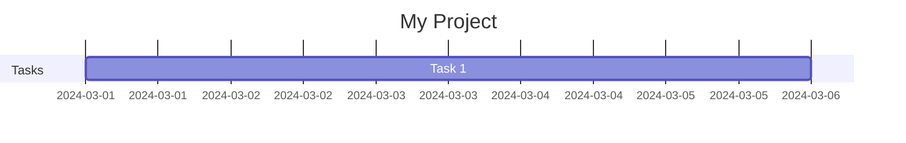
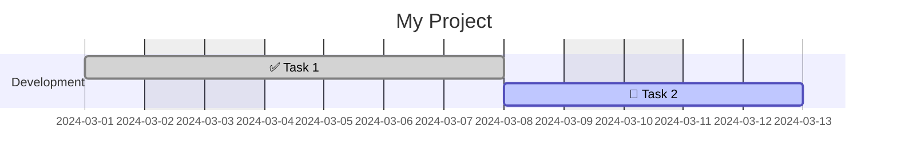
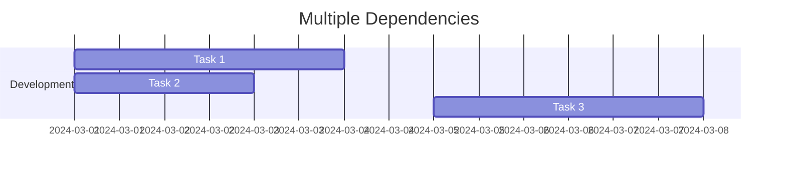
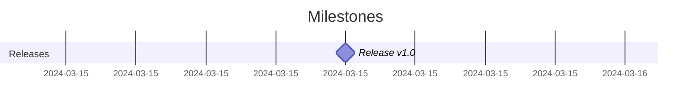

<!-- This file is auto-generated. Do not edit manually! -->
<!-- To make changes, edit files in spec/ and run: python tools/build_spec.py --lang en -->

## Table of Contents

- [opskarta Specification v1 (Draft)](#opskarta-specification-v1-draft)
- [Plan File (`*.plan.yaml`)](#plan-file-planyaml)
- [Nodes (`nodes`)](#nodes-nodes)
- [Views File (`*.views.yaml`)](#views-file-viewsyaml)
- [Statuses (`statuses`)](#statuses-statuses)
- [Scheduling (`start`, `duration`, `after`, `excludes`)](#scheduling-start-duration-after-excludes)
- [YAML Encoding Recommendations](#yaml-encoding-recommendations)
- [Validation Rules](#validation-rules)
- [Extensibility](#extensibility)
- [Renderer Profile: Mermaid Gantt](#renderer-profile-mermaid-gantt)

# opskarta Specification v1 (Draft)

This specification describes the *minimal* compatible field set of the opskarta format.

- Serialization format: **YAML** (recommended) or JSON.
- Versioning: `version` field at document root.
- Node identifiers: string keys in the `nodes:` map.

> Status: **Draft**. The spec is intentionally starting small and extensible.

## Core vs Non-core

The specification distinguishes between **core** (normative) and **non-core** (informative/extensions) parts:

| Category | Description | Tool Implementation Requirement |
|----------|-------------|--------------------------------|
| **Core** | Basic format semantics, scheduling algorithms, validation rules | MUST implement |
| **Non-core** | Extensions (`x:` namespace), renderer profiles, additional view fields | MAY implement |

### Core Components

- Structure of `*.plan.yaml` and `*.views.yaml` files
- Node fields: `title`, `kind`, `status`, `parent`, `after`, `start`, `finish`, `duration`, `milestone`
- Date computation: `finish`, `start from after`
- Calendar exclusions: `"weekends"` and `YYYY-MM-DD` dates in `excludes`
- Default value: `duration = 1d` for scheduled nodes
- Validation rules and referential integrity

### Non-core Components

- Extensions via `x:` namespace (e.g., `x.scheduling.anchor_to_parent_start`)
- Renderer profiles (Mermaid Gantt, others)
- View fields for specific renderers (`date_format`, `axis_format`, `tick_interval`)
- Other values in `excludes` (not `"weekends"` and not `YYYY-MM-DD` dates)
- Default status colors

---

# Plan File (`*.plan.yaml`)

## Root Fields

- `version` *(int)* — schema version.
- `meta` *(object)* — plan metadata.
  - `id` *(string)* — project/program ID. Used for linking with view files.
  - `title` *(string)* — human-readable name.
- `statuses` *(object)* — status dictionary.
- `nodes` *(object)* — work nodes dictionary: `{ <node_id>: <node> }`.

## Example

```yaml
version: 1
meta:
  id: demo
  title: "Demo"

statuses:
  not_started: { label: "Not Started", color: "#9ca3af" }
  in_progress: { label: "In Progress", color: "#0ea5e9" }

nodes:
  root:
    title: "Root"
    kind: summary
    status: in_progress
```

---

# Nodes (`nodes`)

A node is a unit of work/meaning in your map.

## Node Identifiers (node_id)

Each node is identified by a key in the `nodes` dictionary. This key (`node_id`) is used for references in `parent`, `after`, and `lanes[].nodes`.

### Requirements

- `node_id` MUST be unique within `nodes`.
- `node_id` MUST be a string.

### Recommendations

- **Recommended format:** `^[a-zA-Z][a-zA-Z0-9._-]*$`
  - Starts with a letter
  - Contains only letters, digits, dots, underscores, hyphens
- **For Mermaid compatibility:** avoid spaces, parentheses, colons in identifiers.

```yaml
# Good identifiers
nodes:
  kickoff: ...
  phase_1: ...
  backend-api: ...
  JIRA.123: ...

# Problematic identifiers (may not work in some renderers)
nodes:
  "task with spaces": ...     # Spaces
  "task:important": ...       # Colon
  123: ...                    # Starts with digit
```

## Required Node Fields

- `title` *(string)* — work name.

## Recommended Fields

- `kind` *(string)* — node type. Recommended values:
  - `summary` — top-level container
  - `phase` — stage/phase
  - `epic` — large entity in the detail system
  - `user_story` — story/value
  - `task` — specific task

- `status` *(string)* — status key from `statuses`.

- `parent` *(string)* — parent node ID (decomposition hierarchy).

- `after` *(list[string])* — "after what" dependencies (graph).  
  Semantics: node can start after all `after` nodes are completed.

- Scheduling:
  - `start` *(YYYY-MM-DD)* — planned start date
  - `finish` *(YYYY-MM-DD)* — target completion date (deadline). See "Scheduling" section.
  - `duration` *(string)* — duration, e.g. `5d`. If not specified for a scheduled node — defaults to `1d`.
  - `milestone` *(boolean)* — if `true`, node is a milestone (point event). See below.

- `issue` *(string)* — reference/key in the detail system (e.g., `JIRA-123`).

- `notes` *(string|multiline)* — notes/context that you don't want to lose.

## Milestones

A milestone is a point event on the timeline, not a task with duration. Used to mark key dates: releases, deadlines, checkpoints.

### Field `milestone`

- `milestone` *(boolean)* — if `true`, node is displayed as a milestone.

### Behavior

- Milestone MUST have `start` or computable `start` via `after`.
- If `duration` is not specified for a milestone, `1d` is used for calculations.
- On Gantt chart, milestone is displayed as a point/diamond, not as a bar.
- Milestones can have dependencies (`after`) and statuses (`status`).

### Example

```yaml
nodes:
  release_v1:
    title: "Release v1.0"
    milestone: true
    start: "2024-03-15"
    status: not_started

  beta_release:
    title: "Beta Release"
    milestone: true
    after: [integration_testing]
    # start is computed from after
```

## Notes

- opskarta does not dictate workflow. `status` is a label for your map.
- Node can exist without `issue` (draft, hypothesis, placeholder).

## Field `finish` (deadline/backward scheduling)

Field `finish` specifies the target completion date or deadline for a node.

- `finish` *(string, YYYY-MM-DD)* — target completion date.

### Behavior

1. **If `finish` + `duration` are specified without `start`:**
   - `start` is computed "backward" from `finish` by subtracting workdays.
   - Formula: `start = sub_workdays(finish, duration - 1)`, where `finish` is included in the duration.
   - Example: `finish: 2024-03-15`, `duration: 5d` → `start: 2024-03-11` (5 workdays: 11, 12, 13, 14, 15).

2. **If `start` + `finish` are specified without `duration`:**
   - `duration` is computed as the number of workdays between dates.

3. **If all three (`start`, `finish`, `duration`) are specified:**
   - They MUST be consistent (computed `finish` from `start+duration` must match specified `finish`).
   - Inconsistency is an **error**.

### Example

```yaml
nodes:
  release_prep:
    title: "Release Preparation"
    finish: "2024-03-15"  # Deadline
    duration: "5d"
    # start is computed backward: 2024-03-11 (5 workdays: 11, 12, 13, 14, 15)
  
  feature_a:
    title: "Feature A"
    start: "2024-03-01"
    finish: "2024-03-05"
    # duration is computed: 5d
```

---

# Views File (`*.views.yaml`)

The views file describes *how* to look at the plan.

## Root Fields

- `version` *(int)*
- `project` *(string)* — must match `meta.id` of the plan
- `gantt_views` *(object)* — set of Gantt views (optional)

## Gantt View

### Core Fields

- `title` *(string)* — view title
- `excludes` *(list[string])* — calendar exclusions
  - `"weekends"` — exclude Saturday and Sunday (core)
  - Specific dates in `YYYY-MM-DD` format — **core**, affect date calculation algorithm
- `lanes` *(object)* — lanes/tracks
  - `<lane_id>.title` *(string)*
  - `<lane_id>.nodes` *(list[string])* — list of node_ids to show in this lane

### Mermaid Renderer Fields (non-core)

The following fields are extensions for Mermaid Gantt renderer and do NOT affect the core date calculation algorithm:

- `date_format` *(string)* — input date format for Mermaid (default `YYYY-MM-DD`)
- `axis_format` *(string)* — date display format on X axis
- `tick_interval` *(string)* — tick interval on X axis (e.g., `1week`, `1day`, `1month`)

> **Note:** these fields are documented here for compatibility with existing files. For detailed mapping to Mermaid directives see "Renderer profile: Mermaid Gantt" section.

## Example

### Minimal

```yaml
version: 1
project: demo

gantt_views:
  overview:
    title: "Overview"
    excludes: ["weekends"]
    lanes:
      main:
        title: "Main"
        nodes: [root, task1]
```

### Extended (with Mermaid fields)

```yaml
version: 1
project: demo

gantt_views:
  overview:
    title: "Project Overview"
    date_format: "YYYY-MM-DD"
    axis_format: "%d %b"
    tick_interval: "1week"
    excludes:
      - weekends
      - "2024-03-08"    # Holiday
    lanes:
      development:
        title: "Development"
        nodes: [backend, frontend, integration]
      testing:
        title: "Testing"
        nodes: [unit_tests, e2e_tests]
```

---

# Statuses (`statuses`)

`statuses` — a dictionary of arbitrary statuses that your toolset understands.

## Structure

The `statuses` section in the plan file is **optional**. However, if at least one node has a `status` field, the `statuses` section becomes required.

### Referential Integrity Rule

If a node has a `status` field, the value MUST be a key from the `statuses` dictionary:

```yaml
statuses:
  done: { label: "Done" }
  in_progress: { label: "In Progress" }

nodes:
  task1:
    title: "Task"
    status: done          # ✓ correct
  task2:
    title: "Another Task"
    status: pending       # ✗ error: pending is not in statuses
```

## Recommended Status Keys

The following keys are not required, but help with tool compatibility:

- `not_started`
- `in_progress`
- `done`
- `blocked`

## Status Fields

Each status is an object with the following fields:

| Field | Type | Requirement | Description |
|-------|------|-------------|-------------|
| `label` | string | Recommended | Human-readable status name |
| `color` | string | Optional | Color in hex format for visualizations |

### Field `label`

- If `label` is not specified, renderers MAY use the status key as label.

### Field `color`

- Format: hex color, regex `^#[0-9a-fA-F]{6}$`.
- Examples: `#22c55e`, `#9ca3af`, `#fecaca`.
- If `color` is not specified, renderers MAY use default colors (see Renderer profile).

```yaml
# Correct colors
color: "#22c55e"
color: "#9CA3AF"

# Incorrect colors
color: "green"      # Named colors not supported
color: "#fff"       # Must be 6-character hex
color: "22c55e"     # Must start with #
```

## Example

### Minimal

```yaml
statuses:
  done: { label: "Done" }
  in_progress: { label: "In Progress" }
```

### Full

```yaml
statuses:
  not_started:
    label: "Not Started"
    color: "#9ca3af"
  in_progress:
    label: "In Progress"
    color: "#0ea5e9"
  done:
    label: "Done"
    color: "#22c55e"
  blocked:
    label: "Blocked"
    color: "#fecaca"
```

---

# Scheduling (`start`, `duration`, `after`, `excludes`)

Scheduling fields allow you to set temporal characteristics of nodes and dependencies between them.

## Terms

- **View calendar (calendar(view))** — a function that determines which days are considered workdays for a given view. Depends on the `excludes` parameter in the view.
- **Workday** — a day that is NOT excluded by the view calendar. With `excludes: ["weekends"]`, workdays are Mon–Fri. With empty `excludes`, any calendar day is a workday.
- **Core excludes** — values in `excludes` that affect date calculation: `"weekends"` and dates in `YYYY-MM-DD` format.
- **Non-core excludes** — other values in `excludes` (not standardized); portable tools MUST ignore them with a warning.
- **Scheduled node** — a node for which a start date (`start`) can be computed. Such nodes are displayed on the timeline.
- **Unscheduled node** — a node without explicit `start`, without `finish`, and without computable `start` via `after`. Such nodes are NOT displayed on the timeline.
- **Effective start (effective_start)** — normalized start date used in calculations. If a node's `start` falls on an excluded day (and node is not a milestone), effective start is shifted to the next workday.

> **Important:** schedule is computed for each view separately. The plan stores constraints, views apply calendar rules. The same node may have different computed dates in different views with different `excludes`.

## Scheduling Fields

### `start` *(string, YYYY-MM-DD)*

Planned work start date. Format: ISO 8601 date, e.g. `2024-03-15`.

- If `start` is specified, node is considered **scheduled**.
- `start` MUST be a string in `YYYY-MM-DD` format.

### `duration` *(string)*

Work duration. Format: `<number><unit>`, where:

- `d` — days (e.g., `5d` = 5 workdays)
- `w` — weeks (e.g., `2w` = 2 weeks)

**Semantics of unit `d` (days):**

- `Nd` means N **workdays** according to the view calendar.
- With empty `excludes` → workday = any calendar day (i.e., `5d` = 5 calendar days).
- With `excludes: ["weekends"]` → workday = Mon–Fri (i.e., `5d` = 5 weekdays).

**Semantics of unit `w` (weeks):**

- `1w` = 5 workdays (not 7 calendar days).
- With `excludes: ["weekends"]` in the view, a week remains equal to 5 workdays.
- Example: `2w` = 10 workdays.

**Rules:**

- Number MUST be a positive integer (≥ 1).
- Format MUST match regex: `^[1-9][0-9]*[dw]$`.
- `duration` without `start` or `after` does not define timeline position, but may be used for effort estimation.

**Default value:**

- If `duration` is not specified for a scheduled node (having `start` or computable `start` via `after`), core tools MUST use default value `1d`.
- This ensures ability to compute `finish` and `start from after` for all scheduled nodes.

### `finish` *(string, YYYY-MM-DD)*

Target completion date or deadline. Format: ISO 8601 date, e.g. `2024-03-15`.

**Behavior:**

1. **If `finish` and `duration` are specified, but no `start`:**
   - `start` is computed "backward" from `finish` by subtracting workdays.
   - Example: `finish: 2024-03-15`, `duration: 5d` → `start: 2024-03-11` (or earlier, if there are excludes).

2. **If `start` and `finish` are specified, but no `duration`:**
   - `duration` is computed as the number of workdays between dates.
   - Example: `start: 2024-03-11`, `finish: 2024-03-15` → `duration: 5d` (without excludes).

3. **If all three (`start`, `finish`, `duration`) are specified:**
   - They MUST be consistent (computed `finish` from `start+duration` must match specified `finish`).
   - Inconsistency is an **error**.

**Example:**

```yaml
nodes:
  release_prep:
    title: "Release Preparation"
    finish: "2024-03-15"  # Deadline
    duration: "5d"
    # start is computed backward: 2024-03-11 (5 workdays: 11, 12, 13, 14, 15)
```

### `after` *(list[string])*

List of dependency node IDs.

**Semantics:** node can start only after **all** nodes from the `after` list are completed.

## Date Computation

### Finish Date

Finish date is computed by formula:

```
finish = start + (duration_days - 1)
```

where `duration_days` — duration in workdays.

**Explanation:** start day (`start`) is included in the duration. A node with `duration: 1d` starts and finishes on the same day.

**Examples:**

| start | duration | finish | Explanation |
|-------|----------|--------|-------------|
| 2024-03-01 | 1d | 2024-03-01 | One day of work |
| 2024-03-01 | 5d | 2024-03-05 | Five days: 01, 02, 03, 04, 05 |
| 2024-03-01 (Fri) | 5d (no excludes) | 2024-03-05 | Calendar days |
| 2024-03-01 (Fri) | 5d (with excludes: weekends) | 2024-03-07 | Workdays: Fri, Mon, Tue, Wed, Thu |

### Computing start from after

If `start` is not specified but `after` is, start date is computed as:

```
start = max(finish for all dependencies) + 1 workday
```

**Algorithm:**

1. For each dependency in `after`, compute its `finish`.
2. Find maximum `finish` date among all dependencies.
3. Add 1 workday (considering `excludes`, if applicable).

**Example (without excludes — calendar days):**

```yaml
nodes:
  task_a:
    title: "Task A"
    start: "2024-03-04"    # Monday
    duration: "3d"
    # finish = 2024-03-06 (Mon, Tue, Wed)

  task_b:
    title: "Task B"
    after: [task_a]
    duration: "2d"
    # start = 2024-03-07 (Thu), finish = 2024-03-08 (Fri)
```

### Special Rule for Milestones

If a node with `after` is a milestone (`milestone: true`), start date is computed **without adding the next workday**:

```
start = max(finish for all dependencies)
```

This is because a milestone marks the moment of completion of preceding work, not the start of new work.

**Example:**

```yaml
nodes:
  feature:
    title: "Feature Development"
    start: "2024-03-01"
    duration: "5d"
    # finish = 2024-03-05

  release:
    title: "Release"
    milestone: true
    after: [feature]
    # start = 2024-03-05 (NOT 2024-03-06!)
    # Milestone marks the moment of feature completion
```

**Comparison:**

| Node Type | start from after Formula |
|-----------|--------------------------|
| Regular node | `next_workday(max_finish)` |
| Milestone (`milestone: true`) | `max_finish` |

### Simultaneous start and after

If a node has both `start` and `after`:

- **`start` takes priority** — the explicitly specified date is used.
- **`after` becomes a logical dependency** — displayed as a link (arrow) on the diagram, but does not affect start date.

**Example:**

```yaml
nodes:
  dependency:
    title: "Dependency"
    start: "2024-03-01"
    duration: "5d"
    # finish = 2024-03-05

  task_with_both:
    title: "Task with Explicit Start"
    start: "2024-03-04"  # Explicit date (before dependency finish!)
    after: [dependency]   # Logical link for diagram
    duration: "3d"
    # start = 2024-03-04 (explicit start is used, not computed)
    # finish = 2024-03-06
```

In this example, `task_with_both` will start on 03/04, although `dependency` finishes on 03/05. This may be intentional (e.g., parallel work) or a planning error — tools MAY issue a warning.

### Normalizing start on Excluded Day

If a node's `start` falls on an excluded day (e.g., weekend or holiday) and node is NOT a milestone:

1. Scheduler MUST normalize `start` to the next workday.
2. Scheduler MUST issue a warning: "start fell on excluded day, normalized to next workday".
3. For calculations, normalized `effective_start` is used, not the original `start`.

**Example:**

```yaml
# In view: excludes: ["weekends", "2024-03-08"]

nodes:
  task:
    title: "Task Starting on Weekend"
    start: "2024-03-02"  # Saturday
    duration: "3d"
    # Effective start: 2024-03-04 (Monday)
    # Warning: "start 2024-03-02 — excluded day, normalized to 2024-03-04"
    # finish = 2024-03-06 (3 workdays from Monday)
```

**For milestones:** normalization is NOT applied. Milestones can be pinned to any date, including excluded days.

### finish Field on Excluded Day

If a node's `finish` falls on an excluded day (weekend or holiday):

1. **For regular tasks**: tool MUST issue a warning "finish fell on excluded day".
   - `finish` is **NOT automatically normalized** (unlike `start`).
   - This allows using `finish` as a "deadline" on a specific calendar date.

2. **For milestones**: no warning is issued. Milestones can be pinned to any date.

3. **When computing dependencies** (`after`): if a dependency has `finish` on an excluded day, `next_workday(finish)` function will correctly find the next workday, skipping excluded days.

**Example:**

```yaml
# In view: excludes: ["weekends"]

nodes:
  urgent_task:
    title: "Urgent Task"
    start: "2024-03-04"  # Monday
    finish: "2024-03-09"  # Saturday — WARNING: finish on excluded day
    # duration is computed by workdays between 04 and 09 = 5d (Mon-Fri)
    
  next_task:
    title: "Next Task"
    after: [urgent_task]
    duration: "2d"
    # start = next_workday(2024-03-09) = 2024-03-11 (Monday)
```

### Computing start from finish (backward scheduling)

If `start` is not specified but `finish` and `duration` are:

1. Compute number of workdays from `duration`.
2. Subtract workdays from `finish`, going backward.
3. Result is computed `start`.

**Algorithm:**

```
start = sub_workdays(finish, duration_days - 1)
```

where `sub_workdays(finish, n)` goes back n workdays from finish, skipping excluded days.

**Example:**

```yaml
# In view: excludes: ["weekends"]

nodes:
  release_prep:
    title: "Release Preparation"
    finish: "2024-03-15"  # Friday
    duration: "5d"
    # Go back 5 workdays: Fri(15), Thu(14), Wed(13), Tue(12), Mon(11)
    # start = 2024-03-11 (Monday)
```

### Unscheduled Nodes

A node is considered **unscheduled** if:

1. `start` is absent, AND
2. `after` is absent, OR all dependencies in `after` are themselves unscheduled.

**Core behavior:** unscheduled nodes are NOT displayed on the Gantt timeline. This is a normative rule for all tools.

> **Note:** renderers MAY provide extensions (e.g., `x.scheduling.anchor_to_parent_start`) for optional date inheritance from parent nodes. Such extensions are non-core and MUST be documented separately.

## Calendar Exclusions (excludes)

The `excludes` parameter is set at view level (`gantt_views`) and affects date calculation.

### Core excludes (affect calculation)

The following values in `excludes` are **core** and MUST affect date computation in portable tools:

1. `"weekends"` — exclude Saturday and Sunday from workdays.
2. **Specific dates in `YYYY-MM-DD` format** — exclude specified days (holidays, office closures, etc.).

**Example:**

```yaml
gantt_views:
  main:
    excludes:
      - weekends
      - "2024-03-08"  # International Women's Day (holiday)
      - "2024-05-01"  # Labor Day
```

### Non-core excludes

Any other values in `excludes` (e.g., `"monday"`, arbitrary tokens) are **non-core**:

- Portable tools MUST ignore them.
- Portable tools MUST issue a warning: "unknown exclude value '<value>' is non-core and ignored".
- Renderer-specific tools MAY support them as extensions (MUST be documented).

**Why this matters:** this prevents calendar divergence when different tools compute different schedules for the same plan.

### Effect on Calculations

With core excludes:

1. **`"weekends"`**: Saturday and Sunday are skipped in workday calculations.
2. **`YYYY-MM-DD` dates**: specified dates are skipped in workday calculations.
3. **Duration** is counted in workdays (excluding weekends and specified dates).
4. **Finish date** skips excluded days.
5. **Next workday** after dependency skips excluded days.

**Example with holiday:**

```yaml
# In view: excludes: ["weekends", "2024-03-08"]

nodes:
  task:
    title: "Task with Holiday"
    start: "2024-03-07"  # Thursday
    duration: "3d"
    # Workdays: Thu(07), skip Fri(08, holiday), skip Sat-Sun, Mon(11), Tue(12)
    # finish = 2024-03-12 (Tuesday)
```

**Example with weekends:**

```yaml
# In view: excludes: ["weekends"]

nodes:
  friday_task:
    title: "Starting Friday"
    start: "2024-03-01"  # Friday
    duration: "3d"
    # Workdays: Fri (01), Mon (04), Tue (05)
    # finish = 2024-03-05 (Tuesday)

  next_task:
    title: "After friday_task"
    after: [friday_task]
    duration: "2d"
    # start = 2024-03-06 (Wednesday)
    # finish = 2024-03-07 (Thursday)
```

## Examples

### Node with Fixed Start Date

```yaml
nodes:
  kickoff:
    title: "Kickoff"
    start: "2024-03-01"
    duration: "1d"
```

### Node with Dependency

```yaml
nodes:
  design:
    title: "Design"
    start: "2024-03-01"
    duration: "5d"

  implementation:
    title: "Implementation"
    after: [design]
    duration: "10d"
```

In this example, `implementation` can start only after `design` is completed.

### Node with Multiple Dependencies

```yaml
nodes:
  backend:
    title: "Backend API"
    start: "2024-03-01"
    duration: "5d"

  frontend:
    title: "Frontend UI"
    start: "2024-03-01"
    duration: "3d"

  integration:
    title: "Integration"
    after: [backend, frontend]
    duration: "2d"
```

Node `integration` waits for completion of **both** `backend` and `frontend`. Its `start` will be computed as the next day after `max(finish(backend), finish(frontend))`.

### Node with Duration in Weeks

```yaml
nodes:
  sprint:
    title: "Development Sprint"
    start: "2024-03-04"  # Monday
    duration: "2w"       # = 10 workdays
    # finish = 2024-03-15 (Friday of second week)
```

## Interaction with Views

Scheduling fields are used by renderers to build timeline diagrams:

- **Gantt charts**: `start` and `duration` determine position and length of node bar on timeline.
- **Dependencies**: `after` is displayed as arrows between nodes.
- **Calendar exclusions**: `excludes` parameter in `gantt_views` affects date calculation when `duration` is present.

## Canonical Scheduling Algorithm (pseudocode)

This section defines the canonical schedule computation algorithm. Independent implementations following this algorithm MUST produce identical results.

### Primitives

```python
def is_workday(d: date, excludes: list) -> bool:
    """Checks if date is a workday (not excluded)."""
    # Check weekends
    if "weekends" in excludes and d.weekday() in [5, 6]:  # Sat=5, Sun=6
        return False
    
    # Check specific dates (YYYY-MM-DD)
    if d.isoformat() in excludes:  # format YYYY-MM-DD
        return False
    
    return True


def next_workday(d: date, excludes: list) -> date:
    """Finds the next workday after d (d+1, skipping excluded days)."""
    cur = d + timedelta(days=1)
    while not is_workday(cur, excludes):
        cur += timedelta(days=1)
    return cur


def add_workdays(start: date, n: int, excludes: list) -> date:
    """Adds n workdays to start."""
    cur = start
    added = 0
    while added < n:
        cur += timedelta(days=1)
        if is_workday(cur, excludes):
            added += 1
    return cur


def sub_workdays(finish: date, n: int, excludes: list) -> date:
    """Subtracts n workdays from finish (goes backward)."""
    cur = finish
    subtracted = 0
    while subtracted < n:
        cur -= timedelta(days=1)
        if is_workday(cur, excludes):
            subtracted += 1
    return cur


def normalize_start(start: date, excludes: list, is_milestone: bool) -> date:
    """Normalizes start to next workday if it falls on excluded day."""
    if is_milestone:
        return start  # Milestones are not normalized
    if not is_workday(start, excludes):
        # Find next workday
        cur = start
        while not is_workday(cur, excludes):
            cur += timedelta(days=1)
        # SHOULD issue warning: "start fell on excluded day, normalized"
        return cur
    return start


def compute_start_from_after(dependencies_finishes: list[date], excludes: list, is_milestone: bool) -> date:
    """Computes start for node with after dependencies."""
    max_finish = max(dependencies_finishes)
    if is_milestone:
        # Milestones start on the day dependencies finish
        return max_finish
    else:
        # Regular nodes start on the next workday
        return next_workday(max_finish, excludes)
```

### start Computation Priority

When computing `start` for a node, the following priority is used:

1. **Explicit `start`** (if specified): use it (after normalization if fell on excluded day).
2. **Explicit `finish` + `duration`** (if `start` is absent): compute `start = sub_workdays(finish, duration - 1)`.
3. **Dependencies `after`** (if `start` and `finish` are absent):
   - For **regular nodes**: `start = next_workday(max_finish_of_dependencies)`.
   - For **milestones** (`milestone: true`): `start = max_finish_of_dependencies` (without +1 day).
4. **Otherwise**: node is unscheduled (no start).

### Consistency Check

If all three fields (`start`, `finish`, `duration`) are specified:

```python
computed_finish = add_workdays(start, duration - 1, excludes)
if computed_finish != finish:
    # ERROR: inconsistent start/finish/duration
```

### Dependencies Outside View

When computing schedule for a view, dependency resolution (`after`) MUST consider ALL nodes in the plan, even if they are not displayed in the current view.

**Why:** this ensures that "slices" of the plan into multiple views don't break dependency chains.

## Migration from Model with `end` (exclusive)

Some planning systems use `end` as exclusive interval boundary (i.e., work goes UP TO the specified date, but not including it). opskarta uses `finish` as **inclusive** date — work includes the `finish` day.

### Conversion Formula

```
finish_opskarta = prev_workday(end_exclusive, calendar)
```

where `prev_workday` finds the previous workday considering the view calendar (excludes).

**Important:** you cannot simply subtract 1 calendar day. You need to find the **previous workday** considering calendar exclusions.

### Example

| Original Model | opskarta |
|----------------|----------|
| `end: 2024-03-18` (Mon, exclusive) | `finish: 2024-03-15` (Fri, inclusive) |
| Work goes until the 18th, not including | Work finishes on the 15th (Friday) |

With `excludes: ["weekends"]`, if `end = 2024-03-18` (Monday), then `finish = 2024-03-15` (Friday), because 16-17 are weekends.

### Algorithm

```python
def prev_workday(d: date, excludes: list) -> date:
    """Finds the previous workday (d-1, skipping excluded days backward)."""
    cur = d - timedelta(days=1)
    while not is_workday(cur, excludes):
        cur -= timedelta(days=1)
    return cur


def convert_end_to_finish(end_exclusive: date, excludes: list) -> date:
    """Converts end (exclusive) to finish (inclusive)."""
    return prev_workday(end_exclusive, excludes)
```

### Migration Correctness Check

After migration, ensure that:

1. Number of workdays (`duration`) remains unchanged.
2. Dependent tasks (`after`) start on the same day as before.
3. Milestones pinned to deadlines correctly point to the needed date.

---

# YAML Encoding Recommendations

opskarta format uses YAML (recommended) or JSON for serialization. This section describes recommendations for correct data encoding in YAML.

## Dates (fields `start`, `finish`, `excludes`)

YAML parsers (especially YAML 1.1, including PyYAML by default) may automatically convert strings that look like dates into special data types (date/datetime). This can lead to unexpected behavior.

### Strongly Recommended Format

```yaml
nodes:
  task1:
    title: "Task"
    start: "2024-03-15"  # Quoted string — STRONGLY RECOMMENDED
    duration: "5d"
```

### Allowed but Risky Format

```yaml
nodes:
  task1:
    title: "Task"
    start: 2024-03-15  # Unquoted — PyYAML 1.1 converts to date type!
    duration: 5d       # Unquoted — valid plain scalar, but better quoted
```

> **Warning:** `start: 2024-03-15` without quotes in PyYAML will be converted to Python `datetime.date(2024, 3, 15)`, not string `"2024-03-15"`. opskarta tools MUST normalize such values (see "Type Normalization" section).

## Duration (field `duration`)

`duration` value MUST be a string in format `<number><unit>` (e.g., `5d`, `2w`).

### Correct Examples

```yaml
duration: "5d"   # 5 days (recommended format)
duration: "2w"   # 2 weeks (= 10 workdays)
duration: "10d"  # 10 days
duration: 5d     # Valid YAML plain scalar, parsed as string "5d"
```

> **Note:** `5d` without quotes is a valid YAML plain scalar and correctly parses as string. Quotes are recommended for consistency with the `start` field, but not required.

### Incorrect Examples

```yaml
duration: 5      # Number without unit — doesn't match format
duration: "0d"   # Zero is not allowed
duration: "-1d"  # Negative values are not allowed
```

## YAML and JSON Equivalence

opskarta data format is JSON-compatible. YAML is recommended as more convenient syntax for manual editing, but tools MUST convert YAML values to canonical opskarta types (see "Type Normalization" section).

> **Important:** YAML is a superset of JSON, but YAML 1.1 parsers (e.g., PyYAML) have auto-typing features that can lead to unexpected results. opskarta tools MUST correctly handle such cases.

### YAML

```yaml
version: 1
meta:
  id: "my-project"
  title: "My Project"
nodes:
  task1:
    title: "First Task"
    start: "2024-03-01"
    duration: "5d"
  task2:
    title: "Second Task"
    after:
      - task1
    duration: "3d"
```

### JSON (equivalent)

```json
{
  "version": 1,
  "meta": {
    "id": "my-project",
    "title": "My Project"
  },
  "nodes": {
    "task1": {
      "title": "First Task",
      "start": "2024-03-01",
      "duration": "5d"
    },
    "task2": {
      "title": "Second Task",
      "after": ["task1"],
      "duration": "3d"
    }
  }
}
```

## Multiline Strings (field `notes`)

For multiline notes, use literal block (`|`) or folded block (`>`):

### Literal Block (preserves line breaks)

```yaml
nodes:
  task1:
    title: "Task with Notes"
    notes: |
      First line of note.
      Second line of note.
      
      Paragraph after empty line.
```

### Folded Block (joins lines)

```yaml
nodes:
  task1:
    title: "Task with Notes"
    notes: >
      This is a long note that
      will be joined into one line
      with spaces between parts.
```

## Special Characters

When using special characters in strings, enclose them in quotes:

```yaml
nodes:
  task1:
    title: "Task: important!"      # Colon requires quotes
    issue: "JIRA-123"              # No problem
    notes: "Note with # symbol"    # Hash requires quotes
```

## Type Normalization

opskarta tools (validators, renderers) MUST normalize YAML values to canonical opskarta types:

### Canonical Field Types

| Field | Canonical Type | Allowed YAML Input | Normalization |
|-------|----------------|-------------------|---------------|
| `start` | string `YYYY-MM-DD` | string or YAML date | `date(2024, 3, 15)` → `"2024-03-15"` |
| `finish` | string `YYYY-MM-DD` | string or YAML date | `date(2024, 3, 15)` → `"2024-03-15"` |
| `excludes[]` | string | string or YAML date | `date(2024, 3, 8)` → `"2024-03-08"` |
| `duration` | string `Nd` or `Nw` | string | — |
| `node_id` (keys in `nodes`) | string | string | — |

### Normalization Rules

1. **Field `start`:**
   - If YAML parser returned a `date` or `datetime` object, tool MUST convert it to string in `YYYY-MM-DD` format.
   - Example: Python `datetime.date(2024, 3, 15)` → string `"2024-03-15"`.

2. **Field `finish`:**
   - Similar to `start`: if YAML parser returned a `date` or `datetime` object, tool MUST convert it to string in `YYYY-MM-DD` format.

3. **Elements `excludes[]`:**
   - Each element of `excludes` array in view (`gantt_views`) may be a YAML date.
   - Tool MUST normalize such elements to string `YYYY-MM-DD`.
   - Example: `excludes: [weekends, 2024-03-08]` — if `2024-03-08` parsed as `date`, normalize to string `"2024-03-08"`.

4. **Node identifiers (`node_id`):**
   - Keys in `nodes` dictionary MUST be strings.
   - If YAML parser returned a non-string key (e.g., number), tool MAY convert it to string or reject with error.
   - Recommendation: reject non-string keys for explicitness.

5. **General principle:**
   - Tools MUST NOT crash on correct YAML files just because of YAML typing quirks.
   - Tools MUST convert values to canonical types before further processing.

### Python Normalization Example

```python
from datetime import date, datetime

def normalize_date_field(value):
    """Normalizes date value (start, finish) to string YYYY-MM-DD."""
    if isinstance(value, datetime):
        return value.date().isoformat()
    if isinstance(value, date):
        return value.isoformat()
    if isinstance(value, str):
        return value.strip()
    raise ValueError(f"Invalid date type: {type(value)}")


def normalize_start(value):
    """Normalizes start value to string YYYY-MM-DD."""
    return normalize_date_field(value)


def normalize_finish(value):
    """Normalizes finish value to string YYYY-MM-DD."""
    return normalize_date_field(value)


def normalize_excludes(excludes_list):
    """Normalizes excludes list, converting YAML dates to strings."""
    result = []
    for item in excludes_list:
        if isinstance(item, (date, datetime)):
            result.append(item.isoformat() if isinstance(item, date) else item.date().isoformat())
        else:
            result.append(str(item))
    return result
```

---

# Validation Rules

This section describes validation rules for plan and view files.

## Plan File Validation (`*.plan.yaml`)

### Required Fields

- `version` *(int)* — MUST be present at document root.
- `nodes` *(object)* — MUST be present (may be empty).
- For each node: `title` *(string)* — required field.

### Field `meta.id`

- `meta.id` is RECOMMENDED for all plan files.
- `meta.id` is REQUIRED if plan file is used together with views file (`*.views.yaml`).

```yaml
# Minimal plan (without views)
version: 1
nodes:
  task1:
    title: "Task"

# Plan for use with views (meta.id is required)
version: 1
meta:
  id: "my-project"
  title: "My Project"
nodes:
  task1:
    title: "Task"
```

### Referential Integrity

#### Parent References (`parent`)

- If a node contains `parent` field, value MUST be a key of existing node in `nodes`.
- Circular references via `parent` are forbidden.

```yaml
# Correct
nodes:
  root:
    title: "Root"
  child:
    title: "Child"
    parent: root  # root exists

# Error: non-existent parent
nodes:
  child:
    title: "Child"
    parent: nonexistent  # error!
```

#### Dependencies (`after`)

- Each element of `after` list MUST be a key of existing node in `nodes`.
- Circular dependencies via `after` are forbidden.

```yaml
# Correct
nodes:
  task1:
    title: "Task 1"
  task2:
    title: "Task 2"
    after: [task1]  # task1 exists

# Error: non-existent dependency
nodes:
  task2:
    title: "Task 2"
    after: [missing_task]  # error!
```

#### Statuses (`status`)

- If a node contains `status` field, value MUST be a key from `statuses` dictionary.

```yaml
statuses:
  done: { label: "Done" }

nodes:
  task:
    title: "Task"
    status: done  # correct, done exists in statuses

# Error: non-existent status
nodes:
  task:
    title: "Task"
    status: completed  # error, if completed is not in statuses!
```

### Scheduling Field Formats

#### Field `start`

- If specified, MUST match format `YYYY-MM-DD`.
- Format: regex `^\d{4}-\d{2}-\d{2}$`.
- RECOMMENDED to validate date correctness (existing calendar day).

```yaml
# Correct
start: "2024-03-15"

# Format errors
start: "2024-3-15"   # month without leading zero
start: "15-03-2024"  # wrong order
start: "2024/03/15"  # wrong separator
```

#### Field `finish`

- If specified, MUST match format `YYYY-MM-DD`.
- Format: regex `^\d{4}-\d{2}-\d{2}$`.
- RECOMMENDED to validate date correctness (existing calendar day).
- If `start`, `finish`, and `duration` are all specified, they MUST be consistent (error on inconsistency).

```yaml
# Correct
finish: "2024-03-15"

# Format errors (similar to start)
finish: "2024-3-15"   # month without leading zero
finish: "15-03-2024"  # wrong order
```

#### Field `duration`

- If specified, MUST match format `<number><unit>`.
- Format: regex `^[1-9][0-9]*[dw]$`.
- Units: `d` (days), `w` (weeks, where 1w = 5 workdays).
- Number MUST be positive integer (≥ 1).

```yaml
# Correct
duration: "5d"   # 5 days
duration: "2w"   # 2 weeks (10 workdays)
duration: "10d"  # 10 days

# Format errors
duration: "0d"   # zero is not allowed
duration: "-1d"  # negatives are not allowed
duration: "5"    # missing unit
duration: "5m"   # unknown unit
duration: "d5"   # wrong order
```

## Views File Validation (`*.views.yaml`)

### Required Fields

- `version` *(int)* — MUST be present.
- `project` *(string)* — MUST be present.

### Link to Plan File

- `project` field MUST match `meta.id` of corresponding plan file.
- If plan file is missing `meta.id`, link validation MUST fail.

```yaml
# plan.yaml
meta:
  id: my-project

# views.yaml
project: my-project  # must match meta.id
```

### Node References in Views

- Each `node_id` in `lanes[].nodes` MUST exist in plan file.

```yaml
# If plan has nodes: {task1, task2}
gantt_views:
  overview:
    lanes:
      main:
        nodes: [task1, task2]  # correct
        # nodes: [task1, task3]  # error, task3 doesn't exist
```

### Field `excludes` in Views

- `excludes` field in `gantt_views` MAY contain:
  - `"weekends"` — affects date calculation algorithm (see "Scheduling" section).
  - Specific dates in `YYYY-MM-DD` format — **core**, affect date calculation algorithm.
  - Other values — **non-core**, MUST be ignored with warning.

```yaml
gantt_views:
  overview:
    excludes:
      - weekends        # core: affects date calculation
      - "2024-03-08"    # core: affects date calculation (holiday)
      - "monday"        # non-core: warning, ignored
```

> **Note:** validator MUST issue warning about presence of non-core values in `excludes`.

## Validation Levels

Validator may operate at different levels:

1. **Syntax** — YAML/JSON correctness.
2. **Schema** — JSON Schema compliance (field types, required fields, formats).
3. **Semantics** — referential integrity, business rules, date correctness.

## Severity Levels

Validator MUST classify issues by severity level:

| Level | Description | Behavior |
|-------|-------------|----------|
| **error** | Critical error making file invalid | Validation fails (exit code ≠ 0) |
| **warn** | Potential issue requiring attention | Validation succeeds, but warning is output |
| **info** | Informational message | Validation succeeds |

### Issue Classification

| Issue | Level |
|-------|-------|
| Missing required fields (`version`, `nodes`, `title`) | error |
| Non-existent references (`parent`, `after`, `status`) | error |
| Circular dependencies (`parent`, `after`) | error |
| Duplicate `node_id` in `nodes` | error |
| Duplicate YAML keys (at any level) | error |
| Invalid `start`, `finish`, or `duration` format | error |
| Invalid `color` format in `statuses` | error |
| Inconsistent `start` + `finish` + `duration` | error |
| `after` chain without anchor (no `start`/`finish` in chain) | warn |
| Explicit `start` before dependency finish (`after`) | warn |
| `start` on excluded day (not milestone) | warn |
| `finish` on excluded day | warn |
| Non-core values in `excludes` | warn |
| Missing `duration` for scheduled node | info |
| Specific dates in `excludes` (core, affect calculation) | info |
| Unscheduled nodes (not displayed on diagram) | info |

## Additional Validation Rules

### Node Identifier Uniqueness

Each `node_id` (key in `nodes` dictionary) MUST be unique.

> **Important:** some YAML parsers (e.g., PyYAML) silently take the last value when keys are duplicated. Validator MUST detect duplicates as much as possible and issue an error.

```yaml
# Error: duplicate node_id
nodes:
  task1:
    title: "First version"
  task1:                    # ERROR: duplicate key!
    title: "Second version"
```

### Duplicate YAML Keys

YAML parsers may silently overwrite duplicate keys. Validators MUST detect duplicate keys and report an error.

**Implementation:** use YAML loader that throws exception on duplicate detection (see Python `yaml.SafeLoader` with custom constructor).

```yaml
# ERROR: duplicate key
nodes:
  task1:
    title: "First"
  task1:  # DUPLICATE
    title: "Second"
```

This rule applies to all levels: root, nodes, statuses, views, etc.

### after Chains Without Anchor

A chain of nodes linked by `after` dependencies MAY not have an anchor (node with explicit `start` or `finish`). In this case:

1. Validator MUST issue a **warning** (warn).
2. Nodes in such chain become **unscheduled**.
3. Unscheduled nodes are **NOT displayed** on Gantt chart.
4. Plan remains **valid** — this allows storing "draft" branches without fake dates.

**When to issue warning:** if recursive traversal of `after` dependencies finds no node with `start` or `finish`.

> **Note:** circular dependencies (`task1 → task2 → task1`) remain an **error**, as this is a structural graph problem, not a scheduling problem.

```yaml
# WARNING: chain without anchor (nodes will be unscheduled)
nodes:
  task1:
    title: "Task 1"
    after: [task2]
    duration: "3d"
  
  task2:
    title: "Task 2"
    # No start, no finish, no after → unscheduled
    # task1 depends on unscheduled task2 → task1 is also unscheduled
    duration: "2d"
    # Both nodes won't appear on Gantt chart
```

**Strict mode:** tools MAY provide `--strict` option, where chains without anchor are treated as error. Useful for CI/CD pipelines where full scheduling is required.

### start and after Conflict

If a node has both `start` and `after`, and explicit `start` is before computed dependency finish — validator MUST issue warning:

```yaml
nodes:
  dependency:
    title: "Dependency"
    start: "2024-03-01"
    duration: "5d"
    # finish = 2024-03-05

  task:
    title: "Task"
    start: "2024-03-03"     # WARN: before dependency finish (2024-03-05)!
    after: [dependency]
    duration: "2d"
```

### Color Format in Statuses

`color` field in `statuses` MUST be a valid hex color:

- Format: regex `^#[0-9a-fA-F]{6}$`.
- Examples of correct values: `#22c55e`, `#9CA3AF`, `#fecaca`.

```yaml
statuses:
  done:
    label: "Done"
    color: "#22c55e"    # correct
  
  invalid:
    label: "Invalid"
    color: "green"      # ERROR: must be hex format
```

## Error Messages

Validator MUST provide clear error messages:

- Path to problematic field (e.g., `nodes.task2.parent`).
- Problem description.
- Expected value or format.

Example output:

```
Error: Invalid reference in nodes.task2.parent
  Value: "nonexistent"
  Expected: existing node ID from nodes
  Available: root, task1
```

```
Error: Invalid duration format in nodes.task1.duration
  Value: "5"
  Expected: format <number><unit> where unit is 'd' or 'w'
  Pattern: ^[1-9][0-9]*[dw]$
```

---

# Extensibility

opskarta specifically allows format extension without breaking basic compatibility.

## Extension Areas

Additional fields (extensions) are allowed in the following places:

### Plan File (`*.plan.yaml`)

| Level | Example Location | Description |
|-------|------------------|-------------|
| File root | `version`, `meta`, `nodes`, **`x:`** | Project metadata |
| `meta` object | `meta.id`, `meta.title`, **`meta.x:`** | Extended metadata |
| `statuses.*` object | `statuses.done.label`, **`statuses.done.x:`** | Additional status attributes |
| Node object `nodes.*` | `nodes.task1.title`, **`nodes.task1.x:`** | Custom node attributes |

### Views File (`*.views.yaml`)

| Level | Example Location | Description |
|-------|------------------|-------------|
| File root | `version`, `project`, **`x:`** | Views metadata |
| `gantt_views.*` object | `gantt_views.main.title`, **`gantt_views.main.x:`** | View settings |
| `lanes.*` object | `lanes.dev.title`, **`lanes.dev.x:`** | Lane settings |

## Rules for Tools

Base tools (validators, renderers) MUST:

1. **Ignore unknown fields** — do not error when encountering unknown field.
2. **Preserve unknown fields** — during "parse → emit" operations (read and write) unknown fields MUST be preserved.

## Recommended Namespace `x:`

For custom and renderer-specific fields it is RECOMMENDED to use namespace `x:`:

```yaml
# At plan root
version: 1
meta:
  id: "my-project"
  title: "My Project"
x:
  team_assignments:
    - team: "Backend"
      lead: "Alice"
  risk_register:
    - risk_id: "R1"
      description: "External API dependency"

nodes:
  task1:
    title: "Task 1"
    x:
      team: "SRE"
      risk: "high"
      custom_field: "any value"
```

```yaml
# In views
version: 1
project: "my-project"
x:
  theme: "dark"
  export_format: "png"

gantt_views:
  main:
    title: "Main Plan"
    x:
      zoom_level: "week"
    lanes:
      dev:
        title: "Development"
        nodes: [task1, task2]
        x:
          color: "#3498db"
```

### Why Use `x:`

1. **Avoid conflicts** — new spec versions won't conflict with your extensions.
2. **Explicit marking** — clear that this is an extension, not part of core spec.
3. **Grouping** — all custom fields are collected in one place.

### When `x:` is Not Required

Using `x:` is RECOMMENDED but not required. The following formats are also allowed:

```yaml
# Allowed (but not recommended)
nodes:
  task1:
    title: "Task"
    team: "SRE"          # extension without namespace
    risk: "high"         # extension without namespace

# Recommended
nodes:
  task1:
    title: "Task"
    x:
      team: "SRE"
      risk: "high"
```

## Renderer Extensions

Renderers MAY support specific extensions. Such extensions MUST:

1. Be documented in renderer profile (see "Renderer profile: Mermaid Gantt").
2. Use namespace `x:` or explicit renderer namespace (e.g., `x.mermaid:`).
3. Not affect core format semantics.

**Example scheduling extension:**

```yaml
nodes:
  child_task:
    title: "Child Task"
    parent: parent_task
    x:
      scheduling:
        anchor_to_parent_start: true  # Optional date inheritance from parent
```

## JSON Schema and Extensibility

JSON Schema for opskarta uses `additionalProperties: true` at all levels where extensions are allowed. This means:

- Schema will NOT error for unknown fields.
- Extensions are validated only by types (if specified in extension schema).

If you need validation of custom extensions, create your own JSON Schema extending the base one.

---

# Renderer Profile: Mermaid Gantt

This section describes behavior of the reference Mermaid Gantt renderer, including defaults and extensions specific to this renderer.

> **Important:** rules in this section are **non-core** and not required for other tools. They are documented to ensure predictability of the reference implementation.

## Renderer Defaults

### Default Duration

If a node doesn't have `duration` field, renderer uses **1 day** (`1d`). This matches core spec, which defines `1d` as default value for scheduled nodes.

```yaml
nodes:
  milestone:
    title: "Milestone"
    start: "2024-03-01"
    # duration not specified → 1d is used
    # On diagram: bar 2024-03-01 — 2024-03-01
```

### Unscheduled Nodes

Nodes without computable start date (unscheduled) are **skipped** by renderer without error. Renderer MAY issue informational warning.

```yaml
nodes:
  idea:
    title: "Idea for Discussion"
    # No start, no after → node won't appear on diagram
```

## Extension: Date Inheritance from Parent

Renderer supports optional extension `x.scheduling.anchor_to_parent_start` for inheriting start date from parent node.

### Activation

```yaml
nodes:
  parent_task:
    title: "Parent Task"
    start: "2024-03-01"
    duration: "10d"

  child_task:
    title: "Child Task"
    parent: parent_task
    duration: "3d"
    x:
      scheduling:
        anchor_to_parent_start: true
    # effective_start = 2024-03-01 (inherited from parent_task)
```

### Semantics

When `x.scheduling.anchor_to_parent_start: true`:

1. **If node has no `start` and no `after`:**
   - `effective_start(child) = effective_start(parent)`

2. **If node has `after` (but no `start`):**
   - `effective_start = max(start_from_after, effective_start(parent))`

3. **If node has explicit `start`:**
   - Explicit `start` is used (extension has no effect)

### Important

- This extension is **non-core** and specific to the renderer.
- Other tools are NOT required to support this extension.
- Without extension, nodes without `start`/`after` remain unscheduled (core behavior).

## Status Display

Renderer displays node statuses using emoji and colors.

### Status to Emoji Mapping

| Status | Emoji | Mermaid Tag |
|--------|-------|-------------|
| `done` | ✅ | `done` |
| `in_progress` | 🔄 | `active` |
| `blocked` | ⛔ | `crit` |
| `not_started` | (none) | (no tag) |

### Default Colors

If `color` is not specified in `statuses`, default values are used:

| Status | Default Color |
|--------|---------------|
| `not_started` | `#9ca3af` (gray) |
| `in_progress` | `#0ea5e9` (blue) |
| `done` | `#22c55e` (green) |
| `blocked` | `#fecaca` (light red) |

Colors from `statuses[].color` override default values.

## Calendar Exclusions in Views

### Core excludes: `"weekends"` and Dates

Reference Mermaid renderer MUST implement core excludes behavior:

1. **`"weekends"`**: Saturday and Sunday are skipped in workday calculations.
2. **Dates in `YYYY-MM-DD` format**: specified dates are skipped in workday calculations.

Both types affect **core scheduling algorithm** (used for computing node `start` and `finish`).

### Non-core excludes

Values in `excludes` that are not `"weekends"` or `YYYY-MM-DD` dates are **non-core**.

- Reference renderer MUST issue warning and ignore them.
- Renderer MUST NOT pass non-core excludes to Mermaid (this would cause calendar divergence).

**Why:** Mermaid supports additional exclusion types (e.g., `"monday"`, `"sunday"`). If core algorithm doesn't understand them but Mermaid does, visual diagram will show different dates than computed schedule.

### Renderer Behavior

Reference Mermaid renderer:

1. **Pre-computes** schedule using core algorithm (considering weekends and date exclusions).
2. **Outputs explicit dates** to Mermaid (e.g., `task1, 2024-03-01, 5d`).
3. **Passes only core excludes** to Mermaid `excludes` directive (for visual markers).

```yaml
gantt_views:
  main:
    excludes:
      - weekends        # Core: passed to Mermaid, affects calculation
      - "2024-03-08"    # Core: affects calculation, passed to Mermaid
      - "monday"        # Non-core: WARNING, NOT passed to Mermaid
```

### excludes Output Format

Renderer MUST output core excludes to Mermaid format:



## Output Format

Renderer generates Mermaid Gantt code:



### Format Features

- Emoji are added before task name.
- All dates are computed by core algorithm and output as explicit values.
- Sections (`section`) correspond to lanes.

## Limitations

1. **Unit `w` (weeks):** renderer converts weeks to days (`1w` → `5d` workdays).
2. **Nested sections:** Mermaid doesn't support nested sections; `parent` hierarchy is displayed flat.

## Multiple Dependencies (`after`)

When there are multiple dependencies (`after: [task1, task2]`) reference renderer:

1. **Computes** `start` using core algorithm: `start = next_workday(max(finish(task1), finish(task2)))`.
2. **Outputs explicit date** to Mermaid, not `after` syntax.



In example above, `Task 3` depends on `task1` (finish = 2024-03-03) and `task2` (finish = 2024-03-02). Core algorithm computes `start = next_workday(max(03-03, 03-02)) = 2024-03-04`. Diagram shows explicit date `2024-03-04`.

> **Why not `after` in Mermaid?** Reference renderer does NOT use `after task1 task2` syntax in Mermaid output, to avoid dependency on Mermaid's internal scheduler. This guarantees visual diagram exactly matches opskarta core algorithm calculations.

## Milestones

Mermaid Gantt supports milestones — point events without duration.

### Core Field `milestone`

If a node has `milestone: true`, renderer displays it as milestone:

```yaml
nodes:
  release:
    title: "Release v1.0"
    milestone: true
    start: "2024-03-15"
    # Displayed as point on timeline
```

### Mermaid Mapping

Node with `milestone: true` generates Mermaid tag `milestone`:



### Behavior

- If `milestone: true` and `duration` is not specified, `1d` is used for calculations.
- On diagram, milestone is displayed as point/diamond, not as bar.
- Milestones can have dependencies (`after`) and statuses (`status`).

## View Fields for Mermaid

Renderer supports additional fields in `gantt_views` for configuring Mermaid output.

### Field Mapping

| opskarta Field | Mermaid Directive | Description |
|----------------|-------------------|-------------|
| `date_format` | `dateFormat` | Input date format (default `YYYY-MM-DD`) |
| `axis_format` | `axisFormat` | Date display format on X axis |
| `tick_interval` | `tickInterval` | Tick interval on X axis (optional) |

### Example

```yaml
gantt_views:
  overview:
    title: "Project Overview"
    date_format: "YYYY-MM-DD"
    axis_format: "%d %b"
    tick_interval: "1week"
    excludes: ["weekends"]
    lanes:
      main:
        title: "Main Tasks"
        nodes: [task1, task2]
```

Generates:


### `axis_format` Format

Standard date formatting directives are supported:

| Directive | Description | Example |
|-----------|-------------|---------|
| `%Y` | Year (4 digits) | `2024` |
| `%m` | Month (01-12) | `03` |
| `%d` | Day (01-31) | `15` |
| `%b` | Abbreviated month | `Mar` |
| `%B` | Full month | `March` |
| `%a` | Abbreviated weekday | `Fri` |

## Extended excludes in Mermaid

Mermaid Gantt supports more exclusion types than opskarta core spec:

| Type | Example | Core opskarta | Mermaid |
|------|---------|---------------|---------|
| Weekends | `"weekends"` | ✅ Supported | ✅ Supported |
| Specific dates | `"2024-03-08"` | ✅ Supported | ✅ Supported |
| Weekdays | `"sunday"` | ❌ Non-core (ignored) | ✅ Supported |

Reference renderer passes to Mermaid **only core excludes** (`"weekends"` and `YYYY-MM-DD` dates). Non-core excludes are ignored with warning.

**Reference:** [Mermaid Gantt documentation](https://mermaid.js.org/syntax/gantt.html)