# Renderer Profile: Mermaid Gantt

This section describes behavior of the reference Mermaid Gantt renderer, including defaults and extensions specific to this renderer.

> **Important:** rules in this section are **non-core** and not required for other tools. They are documented to ensure predictability of the reference implementation.

## Renderer Defaults

### Default Duration

If a node doesn't have `duration` field, renderer uses **1 day** (`1d`). This matches core spec, which defines `1d` as default value for scheduled nodes.

```yaml
nodes:
  milestone:
    title: "Milestone"
    start: "2024-03-01"
    # duration not specified → 1d is used
    # On diagram: bar 2024-03-01 — 2024-03-01
```

### Unscheduled Nodes

Nodes without computable start date (unscheduled) are **skipped** by renderer without error. Renderer MAY issue informational warning.

```yaml
nodes:
  idea:
    title: "Idea for Discussion"
    # No start, no after → node won't appear on diagram
```

## Extension: Date Inheritance from Parent

Renderer supports optional extension `x.scheduling.anchor_to_parent_start` for inheriting start date from parent node.

### Activation

```yaml
nodes:
  parent_task:
    title: "Parent Task"
    start: "2024-03-01"
    duration: "10d"

  child_task:
    title: "Child Task"
    parent: parent_task
    duration: "3d"
    x:
      scheduling:
        anchor_to_parent_start: true
    # effective_start = 2024-03-01 (inherited from parent_task)
```

### Semantics

When `x.scheduling.anchor_to_parent_start: true`:

1. **If node has no `start` and no `after`:**
   - `effective_start(child) = effective_start(parent)`

2. **If node has `after` (but no `start`):**
   - `effective_start = max(start_from_after, effective_start(parent))`

3. **If node has explicit `start`:**
   - Explicit `start` is used (extension has no effect)

### Important

- This extension is **non-core** and specific to the renderer.
- Other tools are NOT required to support this extension.
- Without extension, nodes without `start`/`after` remain unscheduled (core behavior).

## Status Display

Renderer displays node statuses using emoji and colors.

### Status to Emoji Mapping

| Status | Emoji | Mermaid Tag |
|--------|-------|-------------|
| `done` | ✅ | `done` |
| `in_progress` | 🔄 | `active` |
| `blocked` | ⛔ | `crit` |
| `not_started` | (none) | (no tag) |

### Default Colors

If `color` is not specified in `statuses`, default values are used:

| Status | Default Color |
|--------|---------------|
| `not_started` | `#9ca3af` (gray) |
| `in_progress` | `#0ea5e9` (blue) |
| `done` | `#22c55e` (green) |
| `blocked` | `#fecaca` (light red) |

Colors from `statuses[].color` override default values.

## Calendar Exclusions in Views

### Core excludes: `"weekends"` and Dates

Reference Mermaid renderer MUST implement core excludes behavior:

1. **`"weekends"`**: Saturday and Sunday are skipped in workday calculations.
2. **Dates in `YYYY-MM-DD` format**: specified dates are skipped in workday calculations.

Both types affect **core scheduling algorithm** (used for computing node `start` and `finish`).

### Non-core excludes

Values in `excludes` that are not `"weekends"` or `YYYY-MM-DD` dates are **non-core**.

- Reference renderer MUST issue warning and ignore them.
- Renderer MUST NOT pass non-core excludes to Mermaid (this would cause calendar divergence).

**Why:** Mermaid supports additional exclusion types (e.g., `"monday"`, `"sunday"`). If core algorithm doesn't understand them but Mermaid does, visual diagram will show different dates than computed schedule.

### Renderer Behavior

Reference Mermaid renderer:

1. **Pre-computes** schedule using core algorithm (considering weekends and date exclusions).
2. **Outputs explicit dates** to Mermaid (e.g., `task1, 2024-03-01, 5d`).
3. **Passes only core excludes** to Mermaid `excludes` directive (for visual markers).

```yaml
gantt_views:
  main:
    excludes:
      - weekends        # Core: passed to Mermaid, affects calculation
      - "2024-03-08"    # Core: affects calculation, passed to Mermaid
      - "monday"        # Non-core: WARNING, NOT passed to Mermaid
```

### excludes Output Format

Renderer MUST output core excludes to Mermaid format:


## Output Format

Renderer generates Mermaid Gantt code:

```mermaid
gantt
    title My Project
    dateFormat YYYY-MM-DD
    excludes weekends

    section Development
    ✅ Task 1        :done, task1, 2024-03-01, 5d
    🔄 Task 2        :active, task2, 2024-03-08, 3d
```



### Format Features

- Emoji are added before task name.
- All dates are computed by core algorithm and output as explicit values.
- Sections (`section`) correspond to lanes.

## Limitations

1. **Unit `w` (weeks):** renderer converts weeks to days (`1w` → `5d` workdays).
2. **Nested sections:** Mermaid doesn't support nested sections; `parent` hierarchy is displayed flat.

## Multiple Dependencies (`after`)

When there are multiple dependencies (`after: [task1, task2]`) reference renderer:

1. **Computes** `start` using core algorithm: `start = next_workday(max(finish(task1), finish(task2)))`.
2. **Outputs explicit date** to Mermaid, not `after` syntax.


In example above, `Task 3` depends on `task1` (finish = 2024-03-03) and `task2` (finish = 2024-03-02). Core algorithm computes `start = next_workday(max(03-03, 03-02)) = 2024-03-04`. Diagram shows explicit date `2024-03-04`.

> **Why not `after` in Mermaid?** Reference renderer does NOT use `after task1 task2` syntax in Mermaid output, to avoid dependency on Mermaid's internal scheduler. This guarantees visual diagram exactly matches opskarta core algorithm calculations.

## Milestones

Mermaid Gantt supports milestones — point events without duration.

### Core Field `milestone`

If a node has `milestone: true`, renderer displays it as milestone:

```yaml
nodes:
  release:
    title: "Release v1.0"
    milestone: true
    start: "2024-03-15"
    # Displayed as point on timeline
```

### Mermaid Mapping

Node with `milestone: true` generates Mermaid tag `milestone`:


### Behavior

- If `milestone: true` and `duration` is not specified, `1d` is used for calculations.
- On diagram, milestone is displayed as point/diamond, not as bar.
- Milestones can have dependencies (`after`) and statuses (`status`).

## View Fields for Mermaid

Renderer supports additional fields in `gantt_views` for configuring Mermaid output.

### Field Mapping

| opskarta Field | Mermaid Directive | Description |
|----------------|-------------------|-------------|
| `date_format` | `dateFormat` | Input date format (default `YYYY-MM-DD`) |
| `axis_format` | `axisFormat` | Date display format on X axis |
| `tick_interval` | `tickInterval` | Tick interval on X axis (optional) |

### Example

```yaml
gantt_views:
  overview:
    title: "Project Overview"
    date_format: "YYYY-MM-DD"
    axis_format: "%d %b"
    tick_interval: "1week"
    excludes: ["weekends"]
    lanes:
      main:
        title: "Main Tasks"
        nodes: [task1, task2]
```

Generates:


### `axis_format` Format

Standard date formatting directives are supported:

| Directive | Description | Example |
|-----------|-------------|---------|
| `%Y` | Year (4 digits) | `2024` |
| `%m` | Month (01-12) | `03` |
| `%d` | Day (01-31) | `15` |
| `%b` | Abbreviated month | `Mar` |
| `%B` | Full month | `March` |
| `%a` | Abbreviated weekday | `Fri` |

## Extended excludes in Mermaid

Mermaid Gantt supports more exclusion types than opskarta core spec:

| Type | Example | Core opskarta | Mermaid |
|------|---------|---------------|---------|
| Weekends | `"weekends"` | ✅ Supported | ✅ Supported |
| Specific dates | `"2024-03-08"` | ✅ Supported | ✅ Supported |
| Weekdays | `"sunday"` | ❌ Non-core (ignored) | ✅ Supported |

Reference renderer passes to Mermaid **only core excludes** (`"weekends"` and `YYYY-MM-DD` dates). Non-core excludes are ignored with warning.

**Reference:** [Mermaid Gantt documentation](https://mermaid.js.org/syntax/gantt.html)
