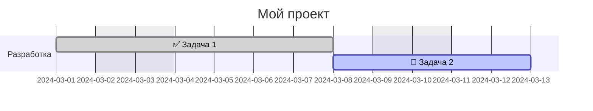

# Renderer profile: Mermaid Gantt

Этот раздел описывает поведение reference-рендерера Mermaid Gantt, включая умолчания и расширения, специфичные для этого рендерера.

> **Важно:** правила в этом разделе являются **non-core** и не обязательны для других инструментов. Они документированы для обеспечения предсказуемости reference-реализации.

## Умолчания рендерера

### Длительность по умолчанию

Если узел не имеет поля `duration`, рендерер использует значение **1 день** (`1d`).

```yaml
nodes:
  milestone:
    title: "Milestone"
    start: "2024-03-01"
    # duration не указан → используется 1d
    # На диаграмме: полоса 2024-03-01 — 2024-03-01
```

> **Core-спецификация** не определяет умолчание для `duration`. Другие рендереры МОГУТ использовать другие значения или выдавать ошибку.

### Непланируемые узлы

Узлы без вычислимой даты начала (unscheduled) **пропускаются** рендерером без ошибки. Рендерер МОЖЕТ выдавать информационное предупреждение.

```yaml
nodes:
  idea:
    title: "Идея для обсуждения"
    # Нет start, нет after → узел не появится на диаграмме
```

## Расширение: наследование даты от родителя

Рендерер поддерживает опциональное расширение `x.scheduling.anchor_to_parent_start` для наследования даты начала от родительского узла.

### Активация

```yaml
nodes:
  parent_task:
    title: "Родительская задача"
    start: "2024-03-01"
    duration: "10d"

  child_task:
    title: "Дочерняя задача"
    parent: parent_task
    duration: "3d"
    x:
      scheduling:
        anchor_to_parent_start: true
    # effective_start = 2024-03-01 (наследуется от parent_task)
```

### Семантика

Когда `x.scheduling.anchor_to_parent_start: true`:

1. **Если у узла нет `start` и нет `after`:**
   - `effective_start(child) = effective_start(parent)`

2. **Если у узла есть `after` (но нет `start`):**
   - `effective_start = max(start_from_after, effective_start(parent))`

3. **Если у узла есть явный `start`:**
   - Используется явный `start` (расширение не влияет)

### Важно

- Это расширение является **non-core** и специфично для рендерера.
- Другие инструменты НЕ обязаны поддерживать это расширение.
- При отсутствии расширения узлы без `start`/`after` остаются непланируемыми (core-поведение).

## Отображение статусов

Рендерер отображает статусы узлов с помощью эмодзи и цветов.

### Маппинг статусов на эмодзи

| Статус | Эмодзи | Тег Mermaid |
|--------|--------|-------------|
| `done` | ✅ | `done` |
| `in_progress` | 🔄 | `active` |
| `blocked` | ⛔ | `crit` |
| `not_started` | (нет) | (нет тега) |

### Цвета по умолчанию

Если в `statuses` не указан `color`, используются значения по умолчанию:

| Статус | Цвет по умолчанию |
|--------|-------------------|
| `not_started` | `#9ca3af` (серый) |
| `in_progress` | `#0ea5e9` (синий) |
| `done` | `#22c55e` (зелёный) |
| `blocked` | `#fecaca` (светло-красный) |

Цвета из `statuses[].color` переопределяют значения по умолчанию.

## Исключения календаря в представлениях

### `excludes: ["weekends"]`

Влияет на расчёт дат согласно core-спецификации: суббота и воскресенье пропускаются при подсчёте рабочих дней.

### Конкретные даты

Конкретные даты в `excludes` (например, `"2024-03-08"`) являются **подсказками для рендерера**:

- Они передаются в Mermaid для визуального отображения (маркировка праздников).
- Они **НЕ влияют** на алгоритм расчёта дат в рендерере.

```yaml
gantt_views:
  main:
    excludes:
      - weekends        # Влияет на расчёт дат
      - "2024-03-08"    # Только визуальная метка в диаграмме
```

## Формат вывода

Рендерер генерирует код Mermaid Gantt:



### Особенности формата

- Эмодзи добавляются перед названием задачи.
- Зависимости (`after`) отображаются как `after <task_id>`.
- Секции (`section`) соответствуют дорожкам (`lanes`).

## Ограничения

1. **Единица `w` (недели):** рендерер преобразует недели в дни (`1w` → `5d` рабочих дней).
2. **Вложенные секции:** Mermaid не поддерживает вложенные секции; иерархия `parent` отображается плоско.
3. **Множественные зависимости:** Mermaid ограниченно поддерживает `after` с несколькими зависимостями.
